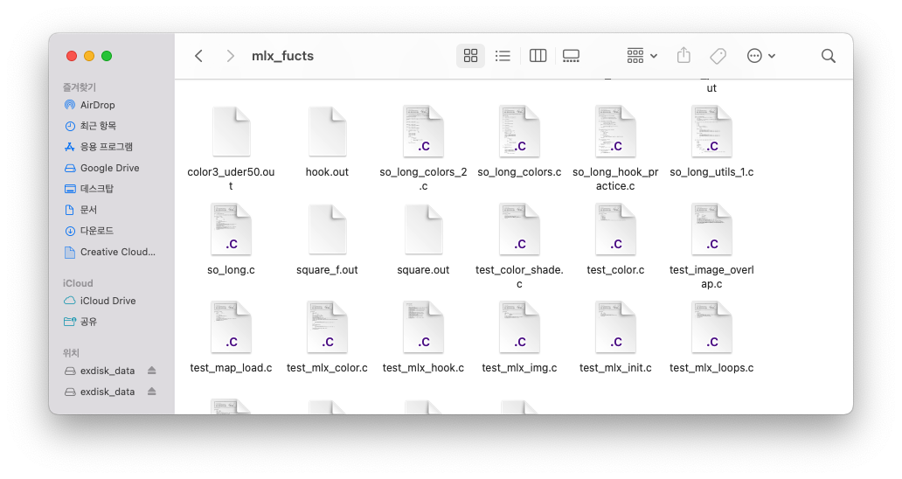
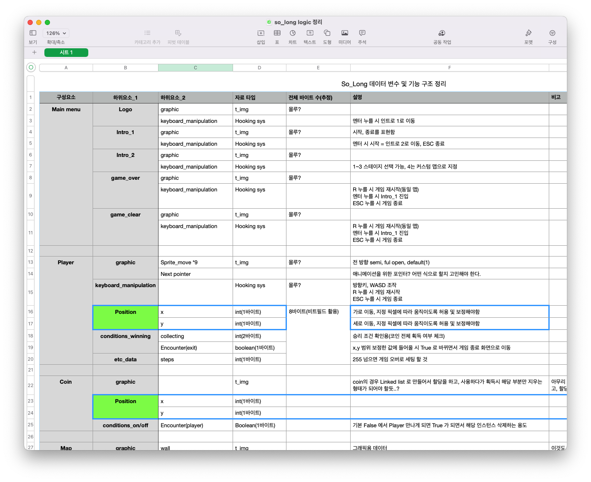
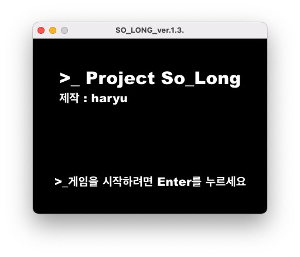
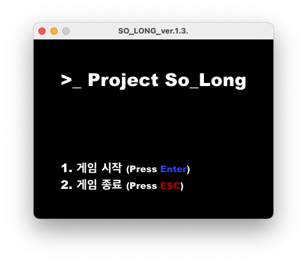
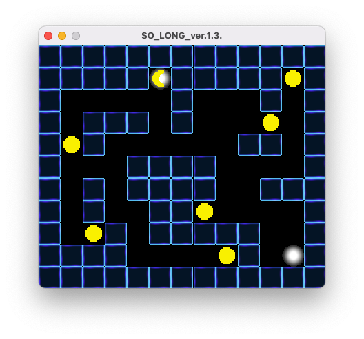
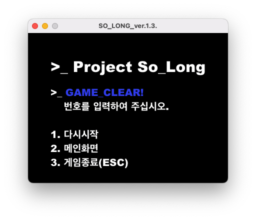
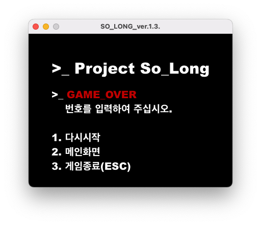
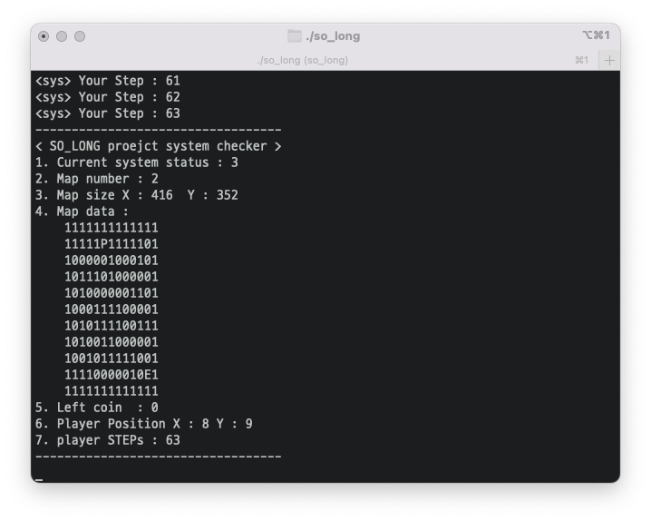

# So_Long

해당 과제에 대해 정리는 저장 목적도 있지만, 동시에 다음 번 과제를 고려하여 이렇게 준비하게 되었습니다. 앞으로 해야하는 과제들을 위한 정리적 차원의 글이라고 보시면 좋을 것 같습니다. 🙂

## So_Long 이건 무슨 과제였던가?

게임을 만든 다는 것을 실질적으로 체험해 본다는 것은 대단히 흥미로운 경험입니다. 하물며 요즘은 엔진이나, 게임위한 툴이 존재하는데, 그런 편리함을 모두 없애버리고 순수하게 데이터를 만져서 무언가를 표현한다는 것은 그만큼 쉽지 않아 보입니다.

## 얻은 것, 그리고 얻어야 할 것

그렇기에 `So_long` 과제에 대해 저는 상당한 흥미를 갖고 있었습니다. 비전공자로써 무언가를 만든다는 것에 대한 흥미를 갖고 있었음에도, 아직까지 해본건 그저 함수를 만들어 본 것 정도의 일이었기에 So_Long 이라는 프로그램을 만든다는 것은 확실히 '프로그램 다운 프로그램'을 만든다는 점에서 대단히, 대단히 괜찮은 것이 아닐까 하는 생각을 갖고 있었습니다. 그래서 So_long 과제를 마무리 지은 입장에서 생각해보면... 이번 과제는 나름대로 의미가 있지만, 또 동시에 한계도 명확히 있었다는 생각을 하게 되었습니다.

우선, 이 과제를 통해 알 수 있었던, 제가 가져야 할 개발 과정에서의 포인트는

> 1. 개발을 위한 설계는 명확해야 딜레이가 생기지 않는다.
> 2. 개발의 설계 과정 만큼이나 데이터 구조에 대한 고민은 필수다.
> 3. 클린코드를 한 번에 완성해 낸다는 것은 불가능하지만, 모듈화, 단일 기능화를 활용해서 만들게 된다면 코드의 가독성이나 코드의 사용 효과는 극대화 된다.

이정도로 볼 수 있을 것 같습니다.

### 설계의 명확성이 만드는 개발 과정의 비지연성

코드를 만드는 과정에선 다분히 생각을 깊이 하게 됩니다. 그러나 단순 뇌의 사고 흐름으로만 코딩을 하게되면, 순간순간의 판단과 생각의 로직을 그대로 따라가는 경향이 생기는데, 문제는 그 과정에서 내가 모르는 방식이나 표현 방법을 찾아야 하는 순간이 오게 되면 이는 대단히 힘든, 그리고 지루한 시간을 보낸다는 게 이번 과제를 통해 정말 많이 알 수 있었습니다.

예를 들면, 캐릭터 이동의 기능. 해당 기능을 구현하기 위해, 처음에는 오류 체크도 해야하고, 여러가지 상황을 고려해 한 개체 인스턴스를 구조체로 만들어야 한다고 생각했습니다. 플래그를 넣고, 그 넣은 플래그들을 통해 상호 체크를 해야지? 이런 식으로 생각하여 캐릭터나 코인을 구현해보도록 생각했습니다.

```C
typedef struct s_player
{
	t_img		*sprite;
	t_position	position;
	int			enc_coin;
	int			enc_exit;
	int			enc_enemy;
}	t_player

typedef struct coin
{
	t_img		*sprite;
	int			enc_player;
	t_position	position;
	.
	.
	.
}

```

그렇게 생각을 하니, 자연스레 데이터를 위한 변수들을 구조체에 마구잡이로 넣게 되었습니다. player 의 구조체 내부에 coin을 만나는 걸 세어 줄 변수에... 동시에 coin에선 그렇게 만나면 1이 들어가면서 해당 이미지가 사라지고....

하지만 다시 라이브러리를 뒤져보고, 이동과 캐릭터를 위한걸 구현하기 시작하자 전혀 다른 식으로 결정이 되어갔습니다.

```C
typedef struct s_player
{
	t_img			*sprite;
	t_position		position;
	unsigned int	steps;
}				t_player;

typedef struct s_rule
{
	unsigned int	starting;
	unsigned int	collect;
	unsigned int	exit;
	char			**map_data;
}			t_rule;

```

mlx 라이브러리를 통해 그래픽을 그리는 것은 결국 핵심은 윈도우에 어떤 식의 조건에 맞아 들어가면, 해당 이미지를 뿌려주는 것이고, 단순히 x, y로 좌표를 만든 뒤 그림을 위에 올려주는 방식, 즉 그림판과 같은 역항를 했습니다. 그렇다면 coin이라는 것을 만나서 먹고 게임이 클리어되게 만든다고 한다면, 굳이 복잡한 변수를 쓸게 아니라 '맵 데이터'로 저장 되는 것을 활용하여 움직이는 것 만으로도 충분하던 것이었습니다.

그런데 저는 처음부터 이런 생각으로 천천히 필요한 `단위기능`을 형성하고, 무언가 남긴 뒤 그것의 정립을 확실히 하고 `구조`를 짜 나갔다면 좋았을 것입니다. 하지만 그러지 못했고, 결과적으로 일주일이면 해결할 수 있는 과제라고 보는데 그걸 거의 2달 가까운 시간을 소비하는 주요 원인이 되어 버렸습니다.

이것 외에도 애니메이션의 구현은 어떻게 하나? 에 대해서도 그 원리를 이해하지 못한채 진행하게 되니 한참을 해매고, 말도안되는 로직을 활용하고 있었습니다. MLX는 사실 이미 필요한 기능이나 구조를 어느정도 제한하고 있었는데, 그런 특성의 이해가 없고, 고민하며 단위로 쪼개서 하지를 않으니, 잘못된 방식으로 한창 구현 -> 틀림 -> 오류 수정한다고 시간을 낭비함 -> 고민하다가 점점 하기 싫어짐. 이런 루트를 타게 된 느낌이 들었습니다.

그런 점에서 프로그램을 만든다는 것, 어떤 구조의 무언가를 구성해 낸 다는 것은 어떨 때는 막 만들어야 할 수도 있겠지만 결국 조금씩 복잡해지고 인지적 범주를 넘어서게 된다는 점을 고려한다면 반드시 `단위` 로 쪼개고, 그걸 가능케하는 기능들이 실제 작동 여부를 점검하고, 그 점검 이후에 설계 -> 코딩의 단계로 들어가야 최종적으로는 시간이 줄어들 수 있단 생각을 할 수 있었습니다.

### 데이터의 구조와 문제

```C
typedef struct s_module
{
	t_mlx		game; // 내부 변수 2개
	t_intro		intro; // 내부 변수 5개
	t_map		map; // 내부 변수 9개
	int			map_number;
	int			sys_status;
	t_player	player; // 내부 변수 5개
	t_img		*coin;
	t_position	starting;
	t_position	exit;
}				t_module; // 전체 게임 모듈. 이 구조체 하나를 통해 시스템 전반의 데이터가 저장되고 작동합니다.
```

So_Long 의 경우, 특히나 중요한 것이 바로 데이터의 관리였습니다. 필요한 상황에 맞춰 이미지를 출력해야 하고, 성공 조건과 실패조건을 항상 고려하여 시스템에서 돌아가야 정상적인 게임 이벤트 발생이 가능합니다. 따라서 위와 같이 모듈을 만들고 이 모듈의 이동이 필수 불가결 합니다.

그런데 문제는 `무지성` 하게 진행한 제 자신이었습니다. 처음에는 생소한 구조체를 활용해야 한다는 점, 그리고 그런 구조체 뿐 아니라 필요한 자료형이 뭘까에 대한 고민이 없이 진행하다보니, 정말 정신없는 스파게티 코드가 탄생했고, 그 결과 old 버전은 더 이상 손을 써서 수선한다는게 웃긴 이야기처럼의 수준이 되어버렸고, 과감히 해당 코드는 학습용으로 잘썼다 생각하고 현재의 수정 버전으로 담아내게 되었습니다.


<font color=grey>[retry 만이 살 길이다...]</font>

그렇게 진한 망조의 냄새를 맡고나서 결국 깨달았었던 것입니다. 무언가 진행을 제대로 하려면 결국 필요한 기능과 필요한 상황에 맞춘 데이터들의 열람이 필요하고, 그걸 기반으로 만들어야 비로소 시스템이나 난무하는 변수들 사이에서도 시스템의 총체적인 이해가 가능하다는 것을...


<font color=grey>[물론 제작 과정에서 생각과는 다른 부붑들이 있어 100프로 동일하게 구현되진 않았습니다...]</font>

결국 건실한 계획 없는 작업은 없어야 한다는 생각이 가슴 깊이 사무쳤습니다. 1달 안에 해결하겠단 생각과 각오라면 그에 합당한 계획을 세워야 한다는 것을 다시 한 번 곱씹어보게 됩니다...

### 결국 기승전 클린코드가 먼저다.








그리하여 어쩌면 3번째가 결국 1, 2번의 내용을 통해 얻은 결론 즉 최종적인 결론일 수 있다고 생각합니다. 결국 핵심은 클린코드를 만들기 위한 모든 노력이 곧 코딩의 효율적인, 그리고 근본적인 수준 향상의 지름길이 아닌가, 그런 생각이 들었습니다. 모듈화가 되어야 하고 데이터의 구조조차도 분명한 계획성과 기술적 실증 아래에 진행을 해야 결국 무언가를 만들 때 보다 명확한 목표나, 수정이 가능함을 느낄 수 있었다고 생각됩니다.

특히나 기능적으로 쪼개놓은 함수 + 상황에 맞춰 기능으로 연결해주는 스위칭 함수(제가 직접 만든 말입니다.) 이 두 개로 연결시키는 것이 진짜 잘 만드시는 분들의 간단하지만 동시에 효율적인 코딩 실력으로 이어지는게 아닌가 '조금' 맛 본것 같다는 생각이 들었습니다.

그런 김에 새벽에 갬성에 젖어 찾은 클린 코딩의 비법을 짧게 남겨 봅니다...

> #### Tips for clean code / better code / quality code
>
> ### 1. Naming Convention
>
> - 모든 변수나, 함수, 클래스 들은 CamelCase 스타일로한다. 유일하게 다른 점은 — 클래스의 첫자가 대문자인 것.
> - 상수는 전부 대문자, 언더 스코어로 띄어쓰기를 할 것
> - 특수 기호나 숫자를 병용하는 것을 피해라
> - 너무 긴 글자를 변수나, 메소드 명으로 쓰는 것은 피하고 심플한, 핵심 정보를담아야 한다.
> - 함수 이름은 동사로 짓고, 클래스나 속성의 이름은 명사로 지어라
>
> ### 2. 의미하는 바를 적어라
>
> - 변수를 선언 시 반드시 풀 네임을 쓰는 것을 귀찮아 하지 말아라.
> - 이름에 한 글자만 담긴 것은 절대 안된다.
> - 해당 변수가 어떤 값을 위한 값인지 나타내야 한다.
> - 다른 사람이 선언하는 사항을 무조건 알 수 있을 것이라고 생각하면 안된다.
>
> ### 3. 변수와 메소드의 선언
>
> - 모든 클래스의 변수들은 클래스 맨 위에 선언된다. 언제든지 변수를 찾을 수 있고, 전체 클래스를 스크롤 해서 선언된 곳을 찾는 경우를 최소화시킨다.
> - 만약 변수 한 개의 메소드에서만 쓴다면 로컬 변수로 선언하는게 낫다.
> - 메소들은 쓰이는 순서대로 선언되야 한다. 현재 메소드는 반드시 현재 사용 될 때 써야 한다.
>
> ### 4. 단일 책임성을 유지해라.
>
> - 단일한 함수나 메소드가 두 세개의 다른 것들을 한 다면 이는 기능적으로 메소드를 나눌 것을 고려한다.
> - 이러한 방식이 이해가 쉽고 메소드 재 사용을 용의하게 만든다.
>
> ### 5. 작은 메소드(함수)
>
> - 함수(메소드)의 적정 길이는 존재하지 않는다. 하지만 15줄 미만의 코드가 이해가 잘되며 고품질의 코드를 만들 수 있다.
>
> ### 6. 코드의 최소화
>
> 항상 최상의 접근법을 생각해서, 한 줄이면 가능하다면, 코드 블럭을 추가해 3줄로 늘리고, 풀어쓰는 경우를 만들지 말아라.
>
> ### 7. 중복은 악이다.
>
> 프로젝트에서 코드의 중복은 피해야 한다. 재 사용할 수 없으면 잘못된 것이며, 재사용 가능한 방법을 고민해야 한다. 메소드는 가능하면 최대한 넓게 쓰도록 되어 있어야 한다.
>
> ### 8. 주석
>
> - 코드에 주석을 단다는 것이 좋을 수도 있고, 나쁠 수도 있다. 매우 짧아서 완벽히 이해될 수 있는 메소드나, 클래스가 아니라면 반드시 어느정도 설명은 적어주자.
> - 또한 스몰 메소드로 구성되어 있다면, 사용법이나 전체 로직, 처리 과정을 명확하게 적는 코멘트가 좋을 것이다.
>
> ### 9. 코드 체커 도구를 구비한다.
>
> - 코드 퀄리티 체크를 위한 도구들을 사용한다는 것은 매우 중요하다. 문제가 어디 있고, 어떤 상태인지를 대비할 수 있어야 하는 만큼, 앞으로는 오히려 예외나, 처리할 사항들을 함께 묶어 코드 퀄리티 체크를 위한 무언가를 만들면 좋을 것 같다.
>
> ### 10. 최고의 습관
>
> - 분명 무언가를 구현한다는 것은 누군가가 이미 이전에 했을 수 있다는 점이다. 따라서 구현에 앞서 이러한 것들을 조사하는 것은 최고의 선행 준비 작업이자 전문 기술을 레벨업 하는 방법이라고 한다.

## So_Long 을 보내며

사실 아쉬움이 굉장히 큰 과제였습니다. 보너스도 준비를 하고 있었지만, 다른 것들과 병행해서 한다는 점, 현재는 우선 진도를 명확하게 나가는 것이 나를 위해 도움이 되리라 판단하여 멈춰 있는 상황입니다. 그러나 이번 과제는 분명 42서울의 1서클을 넘어서, `프로그래머라는 존재에게 무엇을 요구하는 가` 라는 나름의 메시지를 담고 있었다 생각합니다. 지금까지는 인지능력만 충분하다면 개판 같이 써도 작동 가능한 코드를 만드는 게 목표이자 가능했던 일이지만, So_Long이란 걸 시점으론 진짜 '개발자' 다운 생각을 하도록 만드려는 의도가 다분하다고 할까? 앞으로 목표로 삼아야 할 것이 어느 경지인지를 새삼 느낄 수 있던 과제라 생각됩니다.

아직 마무리 되지 않은 보너스는 차후에 한 번 도전해 보는걸로 하고, 앞으로 나아가 보려고 합니다. 무엇보다 이렇게 나가면서 경험해보고 있으니 여기저기서 무얼 하면 좋을지를 알려주기도 하고, 어느새 이런 기술을 배워보면 좋겠다는 생각들이 무럭무럭 성장하고 있어서인지 앞으로가 더 기대되게 만드는 과제가 아니었나 생각해봅니다. 😆

```toc

```
