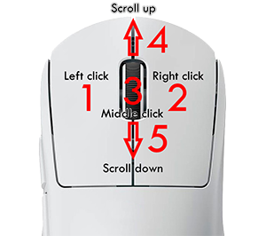

### Hooks

컴퓨터 프로그래밍에서 hooking 이란 용어가 있습니다. 이는 SW 컴포넌트 사이에서 지나가는 메시지, 혹은 이벤트들, 혹은 함수 호출을 가로채서 다른 SW 컴포넌트의, 혹은 어플리케이션의, 운영체제의 행동, 인자를 대체하는데 사용하는 기술을 아우르는 말입니다. 그러한 함수 콜, 이벤트들, 메시지를 가로채는 걸 다루는 code 들을 `hook` 이라고 부릅니다.

1.  Introduction

    Hooking은 디버깅이라던지, 함수의 확장 등을 포함하여 다양한 목적으로 사용됩니다. 예시로서는 키보드를 가로채거나, 어플리케이션에 도달하기 이전에 마우스 이벤트 메시지를 취한다거나, 특정 어플리케이션이나 다른 컴포넌트의 함수 수정 혹은 감시하는 행위를 위해 운영체제의 호출을 가로채는 등을 들 수 있습니다. 이는 벤치마킹 프로그램등에서도 널리 쓰이며, 3D 게임의 프레임레이트를 측정하는 용과 같이 생각보다 여기저기서 사용되는 보편적인 개념입니다.

2.  Hooking into key events

    hooking 은 아마도 어려워 보이지만, 실제론 굉장히 심플한 기능입니다.

    ```c
    #include <mlx.h>
    #include <stdio.h>

    typedef struct	s_vars {
    	void	*mlx;
    	void	*win;
    }				t_vars;

    int	key_hook(int keycode, t_vars *vars)
    {
    	printf("Hello from key_hook!\n");
    	return (0);
    }

    int	main(void)
    {
    	t_vars	vars;

    	vars.mlx = mlx_init();
    	vars.win = mlx_new_window(vars.mlx, 640, 480, "Hello world!");
    	mlx_key_hook(vars.win, key_hook, &vars);
    	mlx_loop(vars.mlx);
    }
    ```

    이제 키를 누를 때 후킹이 자동적으로 될 것이며, 메시지를 출력하는 함수를 실행시킬 것입니다. 이는 `mlx_key_hook` 가 키보드의 이벤트를 후킹하고 있기 때문입니다. 하지만 좀더 복잡한 후킹을 원한다면 함수 `mlx_hook` 와 X11 이벤트 타입을 적절히 활용해 백그라운드에서 간단하게 hook 하는 것이 가능합니다. X11 이벤트의 경우 다음 `event` 항목에서 더 자세히 다루도록 하겠습니다.

3.  Hooking into mouse events

    마우스 이벤트 역시 hooking 이 가능합니다.

    

    Mac OS 상에 마우스 코드는 다음과 같습니다.

    > - Left click: 1
    > - Right click: 2
    > - Middle click: 3
    > - Scroll up: 4
    > - Scroll down : 5

4.  Test your skills!
    익숙해지기 위해 다음 활동을 도전해보시길 추천드립니다.

    1. 키를 누르면 키코드가 터미널 상에 출력되도록 해보십시오.
    2. 마우스를 움직이면 현재의 마우스가 있는 좌표를 출력해보십시오.
    3. 마우스 버튼이 눌렀을 누르면 창위에서 터미널로 움직인 각을 출력해보십시오.

## 주제별 라이브러리 설명(링크 참조)

해당 내용들은 분량이 너무 많은 관계로 링크로 대신 합니다.

> ### **[1. Introduction](https://paul2021-r.github.io/20220314_42_so_long_minilibX/index_0/)**
>
> ### **[2. Getting Started](https://paul2021-r.github.io/20220314_42_so_long_minilibX/index_2/)**
>
> ### **[3. Colors](https://paul2021-r.github.io/20220314_42_so_long_minilibX/index_3/)**
>
> ### **[4. Hooks](https://paul2021-r.github.io/20220314_42_so_long_minilibX/index_4/)**
>
> ### **[5. Events](https://paul2021-r.github.io/20220314_42_so_long_minilibX/index_5/)**
>
> ### **[6. Loops](https://paul2021-r.github.io/20220314_42_so_long_minilibX/index_6/)**
>
> ### **[7. Images](https://paul2021-r.github.io/20220314_42_so_long_minilibX/index_7/)**
>
> ### **[8. Sync](https://paul2021-r.github.io/20220314_42_so_long_minilibX/index_8/)**

```toc

```
