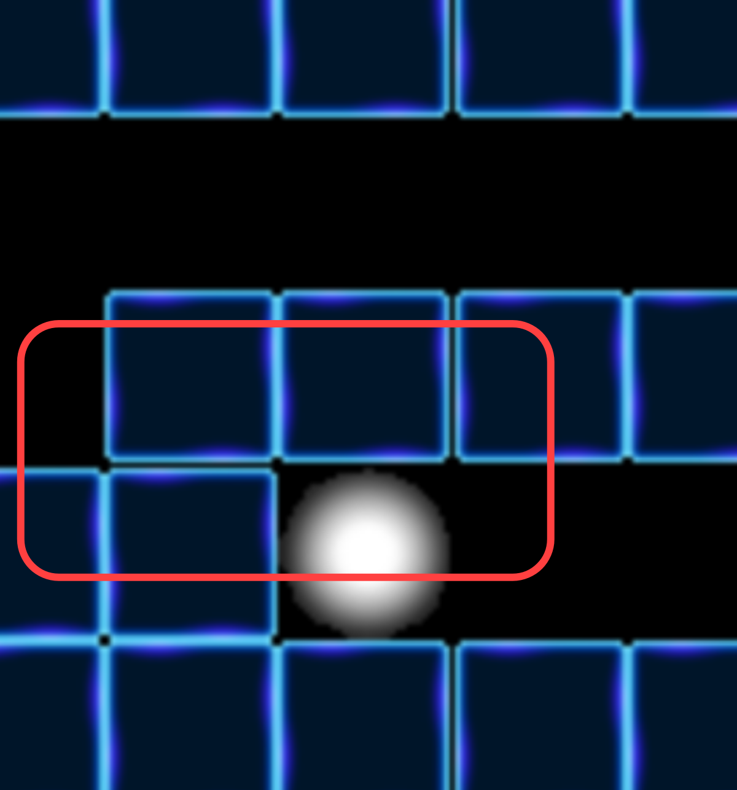

### Images

1.  Introduction

    mlx 상에서 완벽한 잠재력 끌어 내기 위해 중요한 도구 중 하입니다. 이 함수들은 당신이 이미지 객체로부터 파일을 직접 읽는 것을 허락해주고, 포인터로 접근하는 것을 가능케 합니다. 이는 텍스쳐나 스프라이트 등을 호출하여 윈도우에 호출해주는 역할을 하며, 이를통해 게임의 캐릭터, 게임 요를 만들어냅니다.

2.  Reading images

    파일부터 이미지 객체까지 읽어 들이기 위하여, 우리는 XMP 혹은 PNG 포맷을 필요로 합니다. XPM 파일의 경우 온라인 상의 변환 웹 페이지를 활용하시면, PNG 파일을 사용하여 쉽게 제작이 가능하며, 추천하는 이미지 포맷입니다. 이미지 파일들을 읽기 위해, 우리는 `mlx_xpm_file_to_image` 와 `mlx_png_file_to_image` 라는 함수 호출이 필요합니다. 주의사항은 `mlx_png_file_to_image`는 현재 메모리 누수가 존재 한다는 점입니다. 두 함수들은 모두 동일한 인자들과 동일한 사용성을 제공한다는 점을 알아 주십시오.

    더불어, 현재 알려진 바, mlx 라이브러리 mms 버전은 렌더링 과정에서의 문제로 검은색 십자가 특정 숫자 이상의 타일의 불러오기 시 타일과 타일 사이 발생하는 문제가 있습니다. 아래 이미지를 참고 하시면, 다른 주변 타일과는 다르게, 검은 줄이 보일 것입니다.
    
    이는 그래픽 렌더링 과정에서 메탈 라이브러리와의 전송 과정이라고 추정되나, 어쨌든 라이브러리 문제이므로 타일을 반복적으로 출력시 생기는 문제라고 알고 계시면 되며, 과제자의 해결 범위에서 벗어나는 것으로 보여집니다.

    이에대한 해결 방법으로는

    1.  OpenGL 버전을 사용한다.
    2.  그래픽 이미지인 배경 이미지를 하나의 통으로된 이미지로 구현한다.

    정도로 생각됩니다. 하지만 1번의 경우 최신형 M1 ARM 기반 노트북에선 사용이 어려우며(불가능하진 않으나) 결정적으로 컴파일 시 세팅이 달라야 된다는 점은 유념하시면 되겠습니다. 더불어 2번의 경우 가변적으로 맵을 작성해야하는 특성상 쉽지 않아 보입니다. (제한된 라이브러리와 함수로는... )

    ```c
    #include <mlx.h>

    int	main(void)
    {
    	void	*mlx;
    	void	*img;
    	char	*relative_path = "./test.xpm";
    	int		img_width;
    	int		img_height;

    	mlx = mlx_init();
    	img = mlx_xpm_file_to_image(mlx, relative_path, &img_width, &img_height);
    }
    ```

    만약 `img` 변수가 널값이라면, 이는 이미지를 읽는 것에 실패했다는 의미입니다. 또한 `img_width` 와 `img_height` 은 스프라이트를 읽을 때도 동일한 존재로, 이미지를 불러오게되면서 얻게되는 정보라고 보면 됩니다. 즉, 이미지의 크기가 다르거나, 크기를 통해 전체 해상도를 구하는 등에서 사용이 가능합니다.

3.  Test your skills!
    1.  기호에 맞게 커서를 Import 해보고, 창 안을 자연스럽게 돌아다녀 봅시다.(캐릭터 구현)
    2.  텍스쳐를 import 하고 복사해서 창 전체에 복사해봅시다.(맵구현))

## 주제별 라이브러리 설명(링크 참조)

해당 내용들은 분량이 너무 많은 관계로 링크로 대신 합니다.

> ### **[1. Introduction](https://paul2021-r.github.io/20220314_42_so_long_minilibX/index_0/)**
>
> ### **[2. Getting Started](https://paul2021-r.github.io/20220314_42_so_long_minilibX/index_2/)**
>
> ### **[3. Colors](https://paul2021-r.github.io/20220314_42_so_long_minilibX/index_3/)**
>
> ### **[4. Hooks](https://paul2021-r.github.io/20220314_42_so_long_minilibX/index_4/)**
>
> ### **[5. Events](https://paul2021-r.github.io/20220314_42_so_long_minilibX/index_5/)**
>
> ### **[6. Loops](https://paul2021-r.github.io/20220314_42_so_long_minilibX/index_6/)**
>
> ### **[7. Images](https://paul2021-r.github.io/20220314_42_so_long_minilibX/index_7/)**
>
> ### **[8. Sync](https://paul2021-r.github.io/20220314_42_so_long_minilibX/index_8/)**

```toc

```
