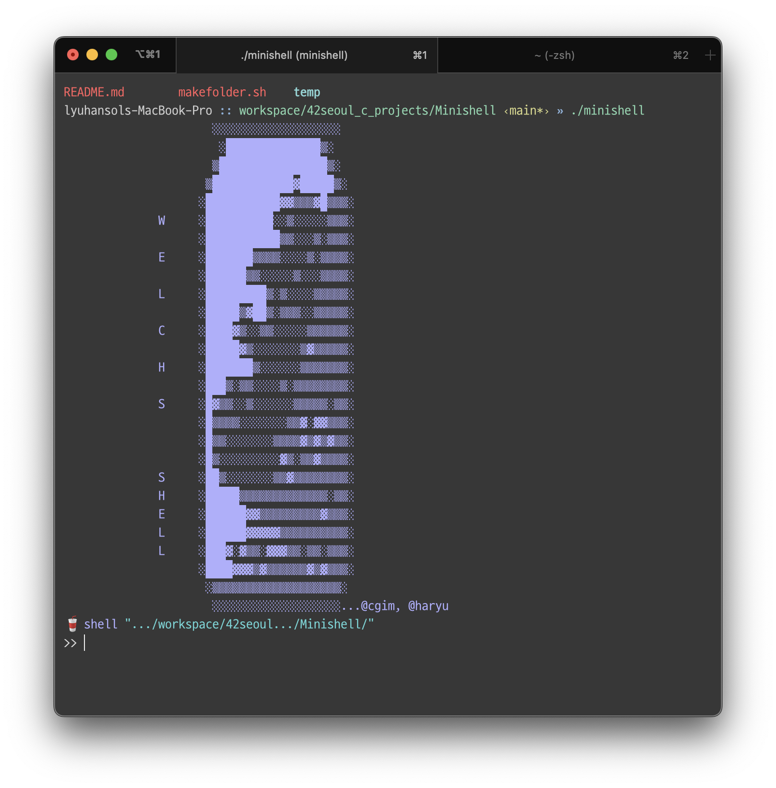
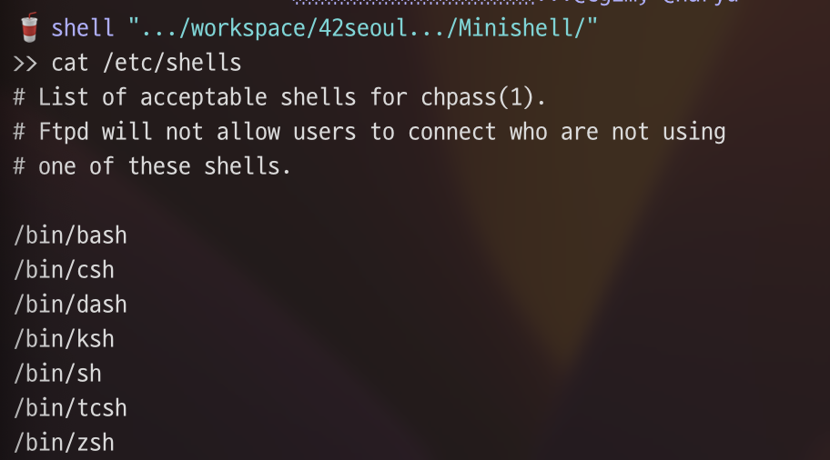
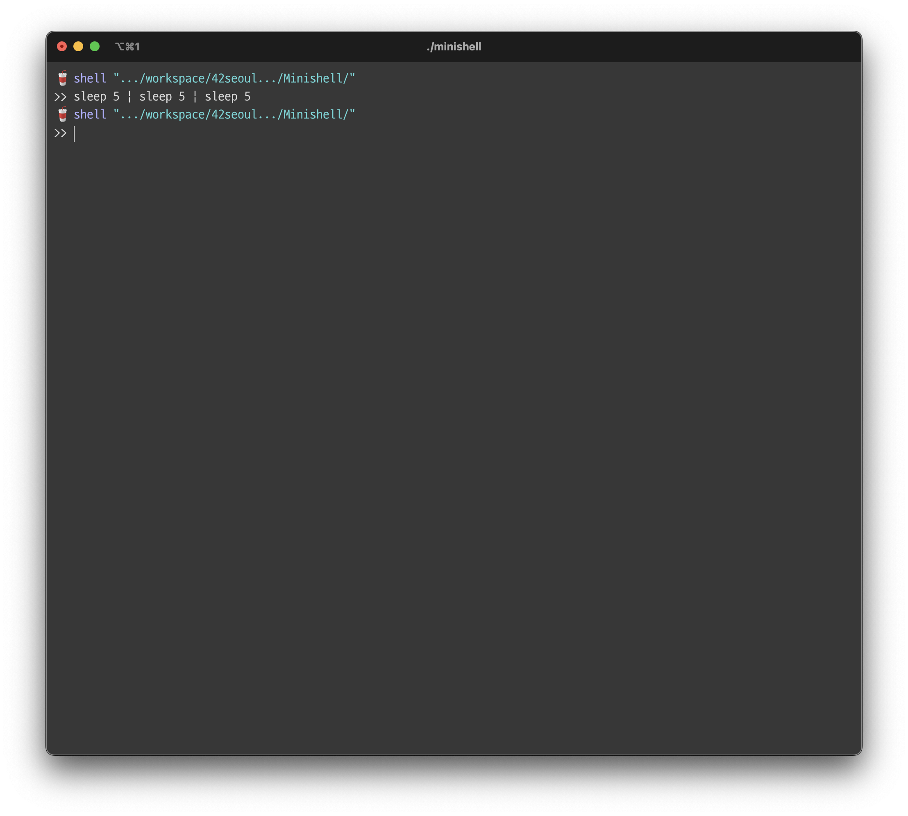
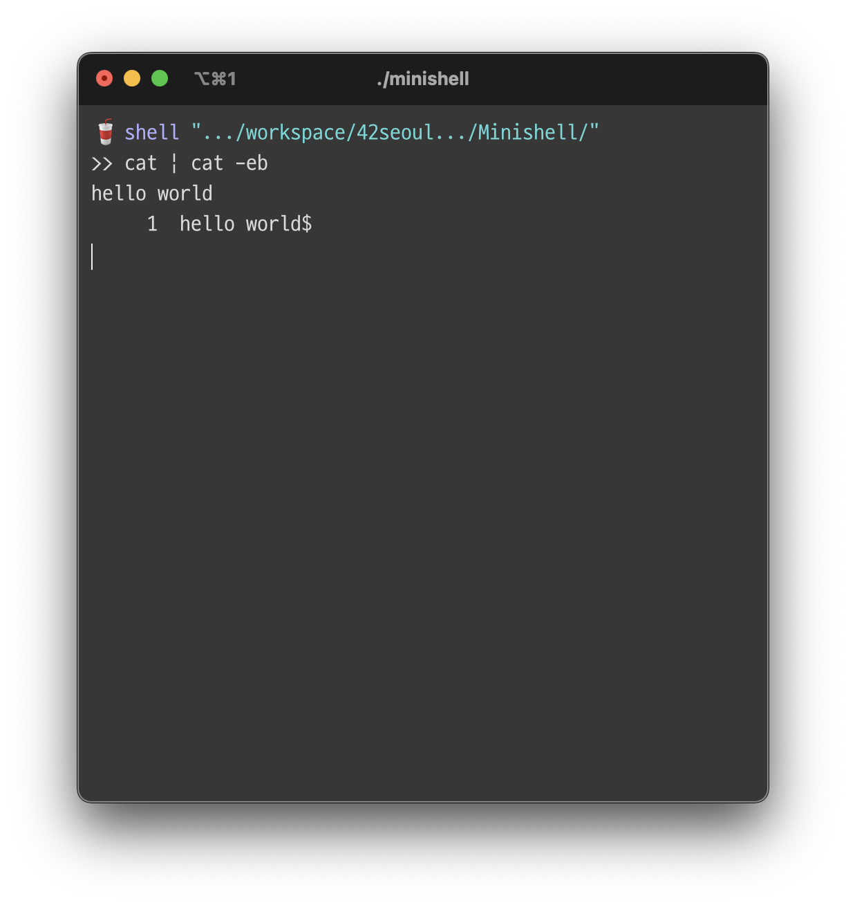
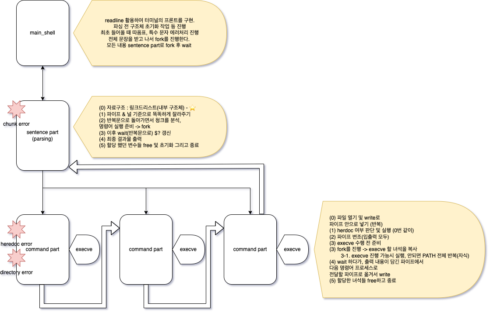

# Reminding : Minishell 

## Introducing Minishell 



42서울. 2022년 11월 들어가게 된 이 공간에서 나는 기어코 살아남았고, 버텼고, 내 나름의 자신감을 가질 만큼 많은 내용을 밤낮을 가리지 않고 배울 수 있었다. 지속적으로 학습한 내용 중 중요하다고 생각하는 부분들에 대해 남겨왔다. 그런데 그러던 와중 드디어 약 두개 정도 과제가 남고, 정규 공통과정을 마무리 짓기 얼마 남지 않은 시점까지 와버렸다. 생각보다는 빠르게, 생각보다는 느린 듯 여러 생각이 교차되는 도중에 곰곰히 생각해보았다. 나를 남기고 나를 알리고, 내 능력을 보여줘야 하는데, 내 모습이나 내가 누군가야 자기소개서를 통해, 인터뷰릍 통해 충분히 기회가 있다지만 내 실력은? 

거기서 다시 그런 글들을 적는 시간도 필요하겠구나 하는 생각이 들었다. 결국 내가 나름 다양한 일들을 하면서 살았지만, 이제 실력과 노하우, 깊이감으로 21세기스럽게 '만든다' 를 하겠다고 나섰는데, 이러한 나를 증명하는 것 없이 어찌 개발자라고 이야기 할 수 있겠는가?

미니쉘이라는 과제를 한 마디로 정리해보자. 음, 머릿속에서 정리되지 않는다. 미니쉘이라는 과제는 사실 42서울의 몇몇 `통곡의 벽`이라고 불리는 과제들 중 하나에 해당하는 과제이다. 교재도, 교수도 없는 이곳에서 리눅스의 프로그램의 실행 프로세스 전역을 닮고, 사람과 컴퓨터를 연결시키는 가장 기본적인 인터페이스를 구현하라니. 심지어 과거에는 readline 과 같은 API의 보조적 지원도 허용 함수에 포함되어 있지 않았기에 터미널 상에서 커서의 움직임 조차 구현해야 했다. 또한 공식적으로 42 서울 본 과정에서 할 수 있는 사상 첫 팀 과제. 여러모로(?) 많은 슬픔과 기쁨, 희극과 비극이 섞인 과제다. 😅 

그래서 핵심은 무엇인가? 우선 서브젝트를 보자. 

> "The existence of shells is linked to the very existence of IT."
> "쉘의 존재는 IT의 존재와 매우 연결되어있다."
> 																											by Subject 

1971년 최초의 `Thompson shell`이 만들어졌다. 그 뒤엔 `Bourne shell`이라는 쉘이 개발되어 현재까지도 사용된다. 쉘은 사실 가교다. 엄밀히 말하면 과거 최초의 컴퓨터 이래로 컴퓨터에 GUI(Graphic User Interface) 가 있는 환경이 된 것은 지극히 얼마 전의 이야기이다. 물론 컴퓨터 자체가 그 구조적으로 추상화의 결정체 같은 것이며, 가상화의 결정체 같은 것이다. 그럼에도 사람과 컴퓨터 사이의 소통의 도구는 0, 1로선 한계가 있었다. 그렇기에 사용자의 `명령어` 를 해석하고 실행하는 역할의 도구는 필요했으며, 그 이전엔 직접 명령을 했고, 이를 통해 프로그램을 구동했다. 그리고 지금은 이러한 아주 기본적인 역할의 대상이 바로 쉘(Shell)인 것이다. 



처음 이 과제의 내용을 받았을 때, 막연한 두려움이 엄습했다. 왜냐면 그 앞에서 배운거라고 해봐야 기껏해야 아주 간단한 자료구조를 활용한 알고리즘 문제, 파이프 활용 문제나 SIgnal 처리와 관련된 문제 정도이며, 심지어 여기서 미니쉘의 핵심이라고 할 수 있는 파일을 켜고 끄는 부분은 학습조차 하지 않았었다(...) 

## Structure Minishell 

미니쉘을 이해하기 위해선 다음 몇 가지 주제에 대하여 이해하는 것이 핵심이다. 

1. 프로세스를 알고, OS를 알면 구조가 보인다.  
2. 병렬형? 순차형? 로직은 어떻게 구성되는가 
3. 그 밖에 고려할 것은?

### 프로세스를 알고, OS를 알면 구조가 보인다. 

프로세스는 한 마디로 정리하면 '실행 중인 프로그램'이다. 특정 상태를 가지며, 커널로부터 상태를 감시 받고 있고, 문맥 전환(context change)라는 과정으로 CPU 상에서 계속 스케쥴링 된 순서에 맞춰 실행되고 마치 여러 개의 작업이 '동시에' 돌아가는 것처럼 보이게 만드는, 가장 기본이 되는 프로그램의 단위를 의미한다. 

유닉스 시스템에서는 프로세스를 확인할 수 있는 다양한 함수들을 제공하며, 여기서 가장 핵심이 되는, 관리하는 방법 중 하나가 `프로세스 ID(Process ID)` 라는 고유 값을 제공해주는 것이다. 물론 그 이외에 더 세부적인 개념이나, 도구들이 있긴 하다(프로세스 그룹이라던가, 세션이라던가). 

프로세스는 기본적으로 상태를 포함해 다양한 정보들을 담은 `PCB(Process Control Block)` 를 가지고 있으며, 프로그램이 실행됨과 동시에 해당 영역과 프로그램의 내용을 담은 메모리 공간이 할당되면서 프로그램에서 프로세스로 바뀌게 된다. 

여기서 잠시 좀 더 깊이 들어가서 프로세스는 과연 어떻게 구조로 짜여져 있을까? 사실 OS 에 대한 내용은 워낙 OS 마다 다르다. 하지만 개괄적인 내용만 종합해서 OS의 부트업 부터 관리 과정을 설명해본다면 다음과 같다. 

- 최초 전기가 들어오면 CPU가 켜지면서 mother board 에 담겨져 있는 BIOS(Basic Input Output System)를 로드한다. 
- POST(Power on self test) 과정을 통해 하드웨어 정상 여부를 점검하고, 끝이 나는 순간 부트스트랩(BOOtstrap)이라는 과정으로 넘어간다. 
- Bootstrap 에선 부팅관련 정보를 메모리에 읽어오게 되는데, Disk의 `MBR` 에 저장된 부팅 정보를 읽어오는 것으로 MBR이란 디스크의 가장 첫 번째 섹터로, 무조건적으로 접근 하게 되는 OS 시발점 포인터(entry pointer)라고 보면 된다. 
- 부트로더(Bootloader) 단계에 들어서면 OS 코드를 직접 메모리로 읽어 오고, 이때 각종 인터럽트를 위한 table을 비롯해 시스템 동작을 위한 코드들(커널)을 메모리에 상주 시킨다. 
- 운영체제 실행 단계에 들어서면 모든 작업이 끝나 메모리 상에 커널이 올라갔고, 이 상태에서 운영체제는 첫 프로세스(Demon)을 실행 시킨다. 

여기서 운영체제의 각종 프로그램들이 작업을 하는 와중에 사용자가 요청하는 사항에 따라 '인터럽트'가 발생하고, 사용자 수준의 프로그램들이 기동하게 된다. 여기서 우리는 알아야 할 함수, 겸 가장 핵심적인 리눅스, 유닉스 기반 시스템의 특징을 알 수 있다. 그것은 바로 `fork()`라는 함수의 형태이다. 

```c
#include <unistd.h>

pid_t fork(void);
```

유닉스는 시스템의 실행 방식이 독특하다. 여기에는 여러 이유가 있지만, 핵심은 '프로세스'는 혼자가 절대 아니라는 사실이다. 부모 프로세스에서 요청이 들어오는 순간, fork라는 함수를 호출하게 되고, 커널은 이 시스템 함수에 대해 요청을 수락한 즉시 메모리 상에서 부모의 메모리 구조를 그대로 복사 한다. 그 뒤 자식 프로세스의 경우 반환값이 0으로 반환이 되고, 이를 통해 분기를 나눠 부모와 자식 두 가지 선형(linear) 명령어들을 실행하게 된다. 

그리고 다시 OS로 돌아가서 최초의 프로세스 실행 이후 정책마다 다르지만 가장 부모인 프로세스 하나가 존재하는데, 이렇게 하므로써 모든 프로세스는 마치 트리 구조처럼 구현되며, 자식은 부모 아래에 놓이게 된다. 그리고 이러한 형태는 커널이 프로세스를 관리하기 용이하게 만들어주는데, 이러한 구조 때문에 독특한 개념 하나가 발생하게 된다. 

- **좀비 프로세스** : 프로세스가 종료되고, 리소스도 회수되었지만 시스템 프로세스 테이블에 남아 있는 defunct 상태의 프로세스를 뜻한다. 

이러한 형태가 굳이 남겨지는 이유는 적절한 메모리 관리 및 자원을 위해 부모가 되는 프로세스에서 자식 프로세스를 사용 후 적절하게 자원을 반납(reap) 하는 작업을 하기 위해서 이며, 그렇기에 기본적인 unix 혹은 linux 환경에서는 `fork()` 함수 호출 이후에는 다음과 같은 `wait()` 계열의 함수를 호출해야 한다. 

```c
#include <sys/wait.h>

pid_t wait(int *wstatus);
pid_t waitpid(pid_t pid, int *wstatus, int options);
```

좀비가 생기는 것 자체는 사실 큰 문제는 아니다. 자원은 이미 반환 했고 사실 상 커널이라는 시스템의 어찌 보면 공통되는 룰에 가까운 현상이다. 하지만 시스템 테이블에 프로세스 ID 가 그대로 할당 받은 상태이고, 리눅스 운영체제에서는 기본적으로 2^15 개의 PID만을 발행할 수 있다는 점에서 보면 구조적으로 이를 계속 쌓이게 만든다면 시스템에서 가용 가능한 PID를 줄인다는 점, 다른 프로세스의 실행을 방해한다는 문제가 생길 수 있다. 

여기서 함수적 특성도 보면 좋은데 wait은 기본적으로 특정 옵션을 넣지 않는 이상 시스템콜 함수와 유사하게 움직인다. 즉 자식이 죽고, 이를 커널에서 시그널로 보내주는 경우가 아닌 이상 멈춰서 움직이지 않는다. 따라서 여기서 특정 자식의 PID를 넣거나, 아니면 자식을 fork() 한 만큼 반복문을 통해 대기하면 부모는 '완벽하게' 자식의 자원 회수를 기다릴 수 있고, 이러한 철저한 형태를 기본으로 둔 이유는 그만큼 로직적으로 허점이 없는 어느정도 완벽한 시스템 형태를 갖추기 위함이라고 생각된다. 

자, 그렇다면 이제 어느정도 기본이 되는 구조는 다 파악한 것이나 마찬가지다. 추가적인 개념 몇 가지만 추가해서 이해한다면 미니쉘을 위한 로직을 머릿속으로 그려볼 수 있다. 

#### `$?`
쉘에서 명령이 성공했는지를 판단하는, exit status를 확인하는 용도. 시그널을 통해, return 값을 통해 전달되는 값을 쉘 내부가 저장하고 있어야 한다. 이때 포인트는 명령어들은 wait 이나 SIGNAL을 통해 이 값을 부모에게 전달한다는 점이다. 

#### `execve(const char *path, const char *argv[], const char *envp[])`

특정 프로세스에서 새로운 프로그램을 실행시키기 위한 함수이자 시스템 콜. 사실 우리가 알던 '명령어' 라고 하는 것들은 모두 `int main(int argc, char **argv, char **envp)` 로 동작하는 프로그램인 것이다. 

#### `dup() 시리즈`

프로세스들은 기본적으로 서로 다른 가상 메모리 구조를 갖고 있다. 따라서 프로세스 끼리 메모리를 공유하거나, 작업 공간을 공유할 수 있는 구조로 OS가 설계되어 있지는 않다. 하지만 기본적으로 Unix, Linux 기반의 운영체제들은 모든 기반이 파일 구조이며, 파일을 물리적으로든 가상으로든 구현하고 이를 커널이 관리하면서, 이 곳에 무언가 집어넣는 방식을 통해 프로세스끼리의 통신을 가능케 한다. 그리고 이러한 기능을 `파이프(PIPE)`라고 부른다. 어쨌든 이러한 모든 파일을 가리키는 file descriptor(파일 구분자)는 사실 커널에서 전체를 관리하고 있다. table 의 형태로 관리하고 있으며, 실제로 어떤 값인지 사용자 수준의 프로그램에게는 이를 알려주지 않는다. 즉, FD는 일종의 alias 개념인 것이다. 

이때, 해당 FD 값들의 변조, 수정을 통해 다른 방식으로 사용하고 싶을 수 있다. 예를 들어 표준 출력으로 파일 목록을 출력하는 `ls` 라는 명령어를 떠올려보자. 해당 명령어는 표준 출력으로 그저 읽어 들인 데이터를 출력해주고 이는 터미널에 뜨게 된다. 하지만 쉘에서 `ls | cat -e` 라는 형태로 만들어버린다면 어떨까? 이때 내부에서는 dup2 함수를 활용해 ls 프로그램은 인지하지 못한 채 1번 표준 출력 FD를 cat이 수용가능한 파이프 FD로 바꿀 수 있을 것이고, 이렇게하면 각 프로그램들은 자신들의 환경(출력 위치)이 달라질 것을 미리 대응하지 않더라도 우리가 원하는데로 데이터를 흐르게 만들 수 있다. 

#### `PIPE` 
위에서 언급한 파이프를 구현하는 실질적인 API 이다. int배열로 쌍을 만들어서 0번엔 read를, 1번엔 write로 지정을 하게 되고, 프로세스끼리의 데이터 소통을 가능하게 만들어준다. 

### 병렬형? 순차형? 로직은 어떻게 구성되는가 

쉘 프로그램은 컴퓨터와 사용자 간의 아주 근본적인 커뮤니케이션 도구이다. 명령어를 적절한 문법에 맞춰 넣으면 해당 내용은 쉘 프로그램의 적절한 파싱 절차를 거쳐 우리가 요구하는 프로그램을 실행하는 단계로 가게 된다. 

여기서 명령어라고 하는 것들은 복합적으로 작용할 수가 있는데, 예를 들어 시스템을 모니터링 하는 명령어가 있다고 치자. 여기서 우리는 원하는 정보가 있다면 해당 내용을 출력하게 만들 수도 있고, 그렇지 않다면 출력하지 않도록 조건을 걸어 정보들의 편집과 갈무리가 일어날 수 있다. 

즉 명령어를 사용하는 구조 조차 일종의 프로그래밍 로직을 따르며, 여기엔 조건에 따른 순차적인 실행도 보장이 되어야 하며, 동시에 딱히 조건이 존재하지 않으면, 실행 자체를 막는 것이 없으니 가능한한 '동시 실행'이 보장되어야 하는 것이다. 


> 반드시 동시에 실행되어야 한다. 왜냐면 파이프로 연결되어 있다고 한들 파이프를 통해 거치는 것이 없으므로, sleep은  5초 전후로 끝이 나야 한다. 



> 이러한 경우에는, 놀랍게도 순차 실행이며 파이프가 연결된 상태이므로 프로그램은 꺼지지 않고, 1번 cat에서 표준 입력을 대기하고 있으니, 두번째 cat은 1번에서 값을 받기 전까지 대기하고, 들어오면 들어오는데로 이를 처리하고 옵션 값을 추가한 출력을 진행한다. 

즉, Minishell은 그렇기에 두가지 경우를 모두 고려 가능한 형태의 로직이 되어야 한다. 그리고 여기서 가장 중요한 핵심 중에 하나가 바로 '파이프' 인 것이다. 

우리가 read 함수를 호출하면, 표준 입력을 넣은 경우 ctr + D 를 눌러 eof 신호를 보내기 전까지 계속 데이터를 받을 수 있고, 실제로 대기하고 있는다. 이것처럼 파이프를 통해 프로그램을 연결하냐, 안하냐에 따라 파이프를 타고 데이터가 들어오도록 설정한다면 입력을 기다리는 프로그램은 해당 입력이 도착되기까지 대기하는 구조가 되고, 그렇지 않다면 그냥 실행됨으로써 병렬식으로 실행되거나 반대로 순차적으로 실행되는 형태가 구현이 가능해진다. 

이를 정리한 구조는 바로 이런 형태가 될 것이다. 



프로그램들은 기본적으로 표준 입출력을 기준으로 설계되어 있다. 그러므로 적절한 파싱 이후 해당 프로그램 실행하는 execve 직전에 dup2 를 활용해 표준 입출력으로 설정된 FD들의 alias를 우리가 원하는 파이프의 입구와 출구로 설정하게 되면, 프로그램들 끼리는 서로 연결되는 구조를 달성하여 순차적으로 데이터가 흐르게 될 것이다. 

반대로 그러한 조건이 없다면 프로그램 들은 입출력에 대한 시스템콜들을 대기하지 않고 실행되므로, 마치 동시에 실행된 것과 같은 효과를 보게 되는 것이다. 

### 그 밖에 고려 할 것은?

로직적으론 이해했지만 그 외에도 고려할 사항들은 참 많았다. 우선 시그널은 중간중간, 명령어 실행 전, 실행 중, 실행 후에 따라 다르게 움직여야 할 것이다. 사용자가 종료를 요청했지만 그것이 먹혀야 하는 상황이 아니라면 시그널은 무시되어야 할 것이고, 반대라면 시그널은 기본적으로 정해진 대로 작동하도록 해줘야 한다. 

또한 전역적으로 관리되어야 할 것들도 있으며, 환경변수에 대한 부분도 있다. 특히나 구현해야하는 기능들 중에서, 명령어가 파이프로 연결되어 순차적으로 실행구조를 갖추는 경우와 단독으로 실행 혹은 병렬로 실행되는 경우(명령어 끝에 ;를 넣는 경우)에 따라 명령어가 적용되는 경우와 그렇지 않은 경우를 정확히 알아야 한다. 

파이프를 전달 할 때, 파일 FD의 용도상 자식 프로세스에서 필요 없는 것 들은 적절히 처리해주고 념겨줘야 하며, 그래야만 파이프에 대한 참고 테이블을 비울 수 있고 비정상 종료를 해낼 수 있다. 

더불어 병렬성을 구현하는 말은 각 프로세스들의 reap 부분에서도 고려할 부분이 있다. 예를 들어 이런 코드를 고려해보자.

```c
while (i < command_number) {

pid = fork();
	if (pid == 0) {
	// child handling
	}
	else {
	// parent handling 
	}
}

while(i < command_number) {
	pid = wait(...);
	if (pid == pid_arr[i]) {
		i++;
	}
}

```

이런 코드 구조를 짜고 있다고 할 때, 우리는 wait 을 순서대로 기다리면 될 것이라 생각하는 경우가 있다. 따라서 int 배열을 통해 pid를 저장하고 wait()의 return 값으로 순서대로 받는 방식으로 짜게 할수도 있다. 왜냐면 종료되는 것을 확실히 거두어야 한다고 강조 받기 때문에 생기는 오해고, 실제로 우리도 그런 로직으로 했다가 잘못된 코드임을 깨닫게 되었다(...) 

왜냐면 각 명령어 프로세스들은 fork() 된 이후로 CPU의 스케줄링을 받게 된다. 물론 파이프를 통해 명령어끼리의 데이터 스트림이 생긴다면, 당연히 이렇게 구현을 해도 되지 않을까? 생각이 들수 있다. 하지만 이 역시 파이프를 통해 입력스트림을 받거나, 출력을 진행하는 경우가 아니라면, 혹은 하나의 스트림만을 사용하는 경우라면 파이프가 있다고 한들 병렬 실행이 되는 경우가 있다. 

따라서 이러한 상황의 가장 쉬운 해결 방법은 다음과 같다. 

```c
while (i < command_number) {

pid = fork();
	if (pid == 0) {
	// child handling
	}
	else {
	// parent handling 
	}
}

while(i < command_number) {
	pid = waitpid(-1, &stat, 0);
	i++;
}

```

가장 쉬운 방법은 스케쥴링 자체에 대한 어떤 프로세스는 전적으로 CPU 몫이니 그 부분을 CPU에게 맡기고, 우리는 그저 익명의 자식프로세스의 수량만을 검증하는 식으로 reap 작업을 진행하는 것이며, 여기서 에러가 나오는 경우도 검사하고, 가장 마지막 프로세스의 에러 상태를 기억하는 것이다. 

## After Minishell & CS 적 사고 

미니쉘은 개발을 경험할 수 있었다. 부족한 사고력, 부족한 논리력을 가진 상태로 몇 달이나 걸리는 시간을 꾸준히 곱씹어가며 무언가를 만들어 쌓아 올리는 것을 최초로 시도한 그런 과제였다. 그렇기에 여기엔 얻은 점도, 동시에 그 상황과 수준에서 부족했던, 그리고 아쉬웠기에 개선해야 하는 것까지 나오면서, 종합 패키지처럼 나를 성장 시킨 기회였다. 

우선, 미니쉘의 과제는 시스템의 구동 방식에 대한 이해도를 높여주었다. 커널이 어떻게 프로세스를 관리하고, 관리하는 프로세스가 새로운 프로그램을 실행하는 방식은 운영체제의 구동 방식과 매우 깊은 연관이 존재했다. 그렇기에 wait이라는 것을 통해 leap 하지 않으면 안되며, 이때 leap을 하지 않았을 경우 커널의 대응하는 방식들이 연결되고 연쇄되어 쉘의 행동이나, 에러를 연결지어진다는 사실은 대단히 독특한 느낌을 주었다. 

본 과제를 하던 시점이 딱 CS 학습을 위하여 CSAPP 라는 교제의 탐독이 거진 마무리 되는 시점이었다. 그리고 그런 점에서 CS 의 이해도가 늘어남과 동시에 보다 명료하게 프로그램의 구조가 보였다는 점 역시 신기한 경험이었는데, 지금 생각해보면 왜 개발에 이런  컴퓨터의 하드웨어와 소프트웨어 양쪽의 깊이있는 학습이 필요한지 의구심을 갖고 있었다. 하지만 결국 내가 무언가를 만들고, 그 서비스를 깊이있게 최적화 및 개선하려면 결국 필요하구나- 라는 내 나름의 답을 찾은 것이 본 과제가 아니었나 생각 해본다. 

또한 처음 해본 팀 과제이다보니 누군가와 호흡을 맞춰 목표를 달성해 나간다는 점은 상당히 기분 좋은 행위가 아니었나? 하는 생각도 들었다. 물론 회사나, 기존에 직장에서도 팀처럼 조직이 되어 전체 중에 하나의 역할을 행한다는 감각은 있었다. 하지만 그렇게 만든 것이 무언가 움직이고, 원하는 역할을 수행하고 하는 결과물이 눈에 보이진 않았다. 하지만 이번엔 어떤가. 내가 넣은 스프라이트 이미지가 최초에 뜨고 사라진다. 현재 디렉토리 구조를 갱신하는 구조를 집어 넣었기에 무언가를 입력하면 그 뒤에 일어날 행동들이 눈에 보일 뿐 아니라 머릿속에서도 생생하게 재생된다. 어쩌면 이런 감각이 이 과제를 길고도 긴 시간 붙잡고 있을 수 있던 원동력이었다.

### 그렇다고 부족하지 않다고는 안 했다.

그러나 미니쉘 과제, 해당 과제를 해 나가면서 부족함은 너무나 많았다.  완벽한 팀 플레이란 존재하지 않는다. 수 많은 방법론이나 협업툴들, 지향하는 방식이 너무나 다양하다는 점에서 완성형 프로젝트는 존재하지 않을지도 모른다. 오죽하면 프로그램 개발 입문서들도, 하나의 완벽한 프로그램이 아닌 부족하지만 온전한 하나의 기능을 담은 프로그램이 낫다고 하지 않던가. 

우선, 가장 큰 아쉬움은 '설계' 였다. 우리는 전체 로직을 짜는데 상당히 공을 들인 만큼, 생각보다 너무 쉽게 전체 로직 구현에 성공했었다. 하지만 그 반동이라고 해야 할까? 좀 더 빠르게 진행했으면 하는 마음도 내심 한 켠에 자리 잡았었다. 그러다 보니 우리는 세세한 데이터의 흐름에 맞춰 **약속**을 정하는 것보다, 각자의 역할은 빠르게 해치우는 방향으로 갔다. 

결과는 어떨 것 같나? 디버깅이 난리가 났을까? 사실 그렇진 않았다. 그래도 뭘 원하는 지 큰 흐름 중간 중간에는 맞춰 놓기도 했고, 기본적으로 ASCII 데이터인 만큼 데이터 사용의 문제가 있진 않았다. 

하지만 핵심은 **효율성**이다. 파싱을 하거나, 데이터의 편집 과정에서 결국 유사한 형태의 데이터 편집이 필요한 경우들이 있었다. 그런 과정에서 필요한 함수들, 그런 것들은 공통으로 해도 될 것이었지만 서로 소통하지 않고 독단으로 진행했었다. 결국 정리해보고 나니 미니쉘 안에 동일한 기능을 하는 함수들이 꼭 두 개 씩 생겨 버렸고, 이러한 비효율성은 아무리 미숙한 나라도 매우 비효율적이라는 사실을 알 수 있었다. 

거기다 이미 개발은 짜는 것보다 디버깅이 중요한 시기에 도달했다고 보인다. 게임만 해도 최적화로 평가를 나누는 것은 어제 오늘 일이 아니다. 하지만 우리는 만드는 데 급급했고, 생각해보면 요소 요소 함수나 특정 단계를 거쳐 지나가면서 어떤 식으로 지나가는 지를 확실하게 머릿속에 그리는 도구들을 구성하지 못했다. 이는 위에서 지적한 부분과도 연관되는데, 확실하게 정리된 **데이터 타입의 약속이 부재**하다는 사실 만으로도 디버깅 툴은 `printf` 혹은 그에 준하는 함수들 정도라는 말도 안되는(...) 상황을 이어나갔다. 

이러한 점은 당연히 평가 과정에서의 leak 이나, 터짐을 완벽하게 잡기 어려웠고, 결국 몇 번의 리트라이, 몇 번의 비효율적 디버깅 작업 끝에 마무리를 지을 수 있었다. 나는 이때 처음으로 디버깅 능력도 스킬이 된다는 사실을 깨달았다. VSC 의 디버깅 도구, sanitizer, lldb 등 왜 그렇게나 강조를 하고, 여러 서적에서도 나올 때마다 학습이 필요하다는 것인지 느낄 수 있던 때였다. 그렇기에 vsc 디버거를 시작으로 디버거에 더 많은 관심을 쏟게 되었던게 이때 과제를 끝낸 뒤였다. 

또 한 가지 떠오르는 것은 GitHub의 사용 방식에 대한 문제다. 처음 미니쉘을 작업할 때는 딱 상대 커밋과 내 커밋을 합치고, 새로운 develop 브랜치를 만드는 작업만을 해보는 정도에서 GitHub의 활용을 했었다. 생각해보면 그때 여러가지 찾아보고 사용 방법이나, Git 자체로 협업의 편리한 구조를 만들어 보는 것 정도는 충분히 실습할 수 있었다.

하지만 지속적으로 말한 것처럼, 전체 로직 학습 자체에만 1달이란 시간이 걸리고 나서, 팀원과 나는 핵심적으로 우리가 중심을 두고 있어야 할 사실들에 대해 다소 망각한 모습을 보였다. 빨리 끝낸다는 그 사실이 상당히 중요하게 무게 방점이 찍혀 있었고, '배운다' 는 본질에 대해 놓친 것이다. 그렇기에 깃의 컨벤션을 지켜보는 것, 브랜치별 용도를 정하고, 해당 브랜치를 통해 협력적으로 개발하는 것 등... 해볼 수 있는 것들을 더 해보면 어땠을 까 하는 아쉬움이 남는다. 분명 그런 점에서 디테일하게 접근했다면 단순히 과제를 해결하고 기능을 구현한다 외에도 '조직적 개발' 이라고 해야할까 보다 효율적인 작업이 가능하지 않았을까 하고 조심스럽게 아쉬워 해본다. 

## End of Minishell

42 서울에서 첫 고비라고 할 만한 과제가 무엇이냐? 라고 하면 많은 이들이 Minishell 을 꼽는다. 이는 비단 Minishell이 어렵기만 해서는 아닐 것이다. CS에 대한 깊이 있는 이해와 복잡한 데이터 구조체, 합의 하에 만들어나가야 할 API, 디버깅을 비롯한 약속을 통해 유지 해나가야 하는 개발과정의 효율성 등등.. 보다 디테일하게 들어가면 현업에서 우리에게 처해질 각종 상황과 고통(?) 속에서 보다 현명함과 효율성을 유지 해야 한다는 그런 상황을 처음 경험해본다는 점에서 Minishell 은 통곡의 벽이자, 42서울에서 개발자로 나아가기 위한 첫 관문 같은 게 아닐까 한다. 

다행히도 이번 팀원과, 나는 그런 점에서 아쉬움은 남지만 결국 돌파해낼 수 있었다. 정말 3번째 평가 전까지 터지고 수정하고, 고민하기를 n번 반복하는 작업은 정말 쉽지 않았다. 인내심의 한계를 시험하는 느낌이었고 그렇기에 지치고 화도 날 법했다. 그럼에도 둘이서 이를 분담했기에 견딜 수 있었으며, 제일 핵심은 혼자라면 놓칠만한 부분을 '대화'와 '피드백' 이라는 수단으로 발견할 수 있었다는 점이다. 고생하고, 고민하고, 침울하다가도 결국 대화를 하는 과정에서 단계들을 정리하고, 복잡한 걸 보다 쉽게 풀어내고, 그러다 문제를 발견하고 해결하면 얻는 쾌감. 박수를 치거나 서로 와- 하는 소리를 내며 수정했을 때 정상적으로 돌아가는 모습은 창조의 재미를, 프로그래밍을 통해 컴퓨터와 제대로 소통한 핵심적인 순간들이었지 않나 생각해본다. 

이제 시작이라 생각한다. 내가 더 깊이 배울 수 있으며, 더 넓어질 기회가 앞으로 펼쳐질 것이다. 정말 기대된다. 이제 처음 '괜찮은' 것을 만들어본 것 같다. 진짜 내가 '만들고 싶은 것'에 찾아가며 만들 수 있을 날이 얼마 남지 않은게 아닐까? 하는 조그마한 희망과 함께 글을 마쳐본다. 

```toc

```
