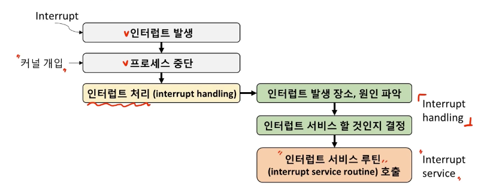
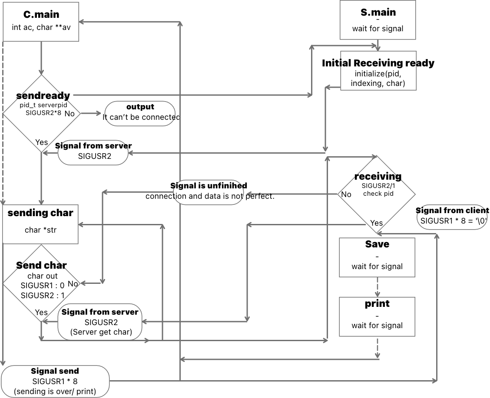
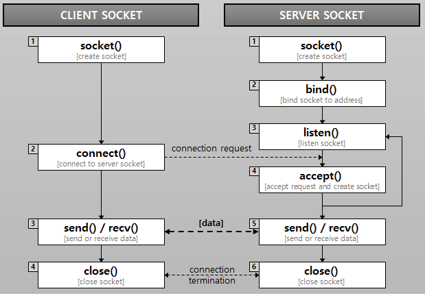
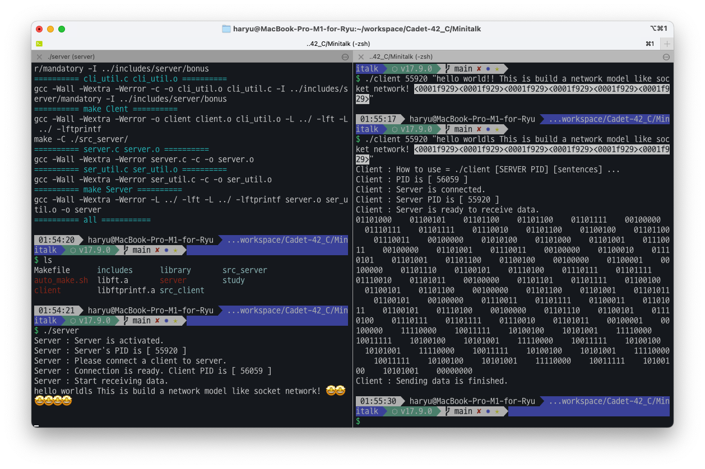

# Prologue

진작에 끝난 과제... 사실 정리 하려면 빨리 했어야 하는데... 허허; push swap을 끝내고 나서야 이제야 보이는 정리 안된 모습에, 과제를 잊어 먹기전에 적어보려고 합니다. 해당 글이 과제 하시는데 아이디어를 얻는데 도움이 되길 기대하면서...

# Minitalk 와 소켓통신

## 기본 개념

미니톡이라는 과제는 기본적으로 '프로그램 간의 소통을 어떻게 해 내는가?' 라는 부분에서 핵심적으로 이해해야할 것들, 그리고 통신이란 행위가 어떤 식인가를 이해하는 중요한 과제 입니다. 난이도도 쉽고, 이걸 굳이? 라고 할 수 있겠지만 우리가 사용하는 모든 것들이 통신을 통해 이루어지고 있다는 점을 감안한다면, 통신의 원리를 이해하고, 간단한 방법들은 직접 구현해 보는 것은 네트워크의 이해도를 높여준다고 생각합니다.

특별히 해당 과제는 약식의 구현이고, 그걸 위해 유닉스 시스템이 가진 '시그널'이란 도구를 활용한 다는 점에서 여러모로 유닉스 시스템에 대한 이해를 위한 행위라고 생각됩니다.

### 우선 시그널..?

- 시그널이란 비동기적 이벤트를 처리하기 위한 소프트웨어적 인터럽트입니다. 인터럽트에는 여러가지가 있는데, 이는 시스템 운영에서 현재 시스템이 작업중인 것과는 별개로 사용자가 보내는 신호라고 보시면 됩니다.



- 시그널은 발생(raise)을 하게 되면, 그 입력이 프로세스나, 커널에서 신호로 생성이 되고, 전달이 됩니다. 유닉스 시스템의 경우 KILL 이라는 명령어나 프로그래밍 언어에서 전달을 위한 kill 함수 등이 존재할 수 있으며, 전달 대상은 직접 지정을 하는 것 외에도 포커싱 하고 있는 프로그램에 전달 되는 경우도 있을 겁니다.
- 이렇게 되는 과정에서 보관을 거치고, 특정한 위치로 전달이 되면, '처리(handling)'의 단계를 가지게 되는데, 이때 시그널은 시스템에서 지정한 항목 또는 사용자가 원하는 방식으로 처리되게 됩니다. 가장 대표적인 기본 처리 방법은 아래와 같습니다.
  - Ignore the signal(무시))
  - Catch and handle the signal(처리하기)
  - Perform the defualt action(처리하기 : 시스템 지정한데로)
- 그 외에 시그널을 보내게 되면 약속된 기본값이 존재하는데 이는 `man -s 7 signal` 에서 확인이 가능합니다. 운영체제 마다 다소 차이는 있지만 확인할 수 있으니 보시고 의미를 이해하심이 좋습니다.

### 받았다, 그럼 어쩌면 되는가?

- 아까 말씀 드렸듯이, 시그널은 특정한 행동을 강제하거나, 어떤 행위를 하겠음을 알리는 역할을 합니다. 그런데 이때 기존의 프로그램은 그런 역할과 상관 없다고 한다면, 어떨까요? 가령 게임을 한다고 하면, 게임 도중에 Alt F4를 누릅니다. 그럼 거기서 어떻게 되나요? 어떤 게임은 그대로 게임 데이터를 날려버리기도 합니다. 어떤 경우엔 임시 저장을 해놓은 걸 불러올 수도 있습니다. 또 어떤 경우엔 종료 전에 알림창을 띄워 종료 여부를 재 확인 하겠지요.
- 이렇듯이 시그널은 결국 처리하는 존재(handler)가 있어서 위에서 이야기한 3 종류 행동 중 무언갈 수행합니다. 이를 `signal handler`라고 합니다.
- 시그널 핸들러는 기본적으로 저장한 특정 시그널을 커널이 보내주게 되면, PID(Process ID)를 통해 특정 프로그램에 전송됩니다. 그리곤 시그널 핸들러는 이에 시그널에 종류에 따라 지정된 함수를 작동하게 되고, 작동된 함수가 시그널에 대하여 처리 방식을 지정하고 처리하게 됩니다.
- 시그널을 송수신을 위한 주요 함수(자세한 사항은 man으로 검색하시거나 구글링하세요~)
  1.  `kill` : 시그널을 보내줍니다.
  2.  `signal` : 시그널 핸들러 함수입니다.
  3.  `sigaction` : 시그널 핸들러 함수이지만, signal보다 설정이 복잡하고, 대신에 사용시 훨씬 세세한 작업을 가능케 합니다.
  4.  `signal set` : 복수개의 시그널 처리를 위한 비트마스크 방식의 옵션 함수입니다. 해당 비트들을 비우거나, 채우거나, 혹은 특정 옵션을 삭제하는 등으로 사용이 가능합니다. 단, 실제 사용시 딱히 복잡하게 세팅할 필요는 없습니다.
  5.  `usleep`, `sleep` : 밀리 초, 초 단위로 대기하는 기능입니다. 필수 파트 구현시 가장 쉽게 사용이 가능한 '대기시간'을 만드는 용도 입니다.
  6.  `pause()` : 시그널을 받기 전까지 해당 프로세스를 멈춥니다. 따라서 시그널이 들어오지 않는 한 프로세스가 진행되지 않습니다.

## 서브젝트가 원하는 것

- 이런 기본 지식을 가지고 서브젝트를 바라보면, 여기서 원하는 것은 아래와 같습니다.

  1.  서버라는 프로그램은 상주하여 지속적으로 클라이언트로부터 문자를 받고 출력합니다. (더불어, 특정 클라이언트가 보내는 내용을 모두 받을 때 재 실행되는 일은 없어야 합니다.)
  2.  클라이언트는 서버의 PID를 받으면, 해당 PID에 데이터를 전송해주고 종료됩니다.
  3.  여기서 프로그램 당 한 개의 전역변수까지 지정이 가능하며, 이용의 이유는 정당해야 합니다.
  4.  프로그램 모두 잘못된 출력이나 예상치 못한 에러는 있어선 안됩니다.
  5.  이러한 모든 조건 하에 문자열의 출력이 1초에 100자 정도 이상은 나올 수 있어야 합니다.
  6.  시그널을 보내는 것은 `SIGUSR1` `SIGUSR2`입니다.

  - 보너스 ) 유니코드가 작동되어야 합니다.
  - 보너스 ) 클라이언트가 다음 신호를 보내기 전

- 위 내용을 통해 알 수 있는 것들이 있을 것입니다. 다행이라고 해야 할지, 기존의 미니톡의 평가 기준에선 초에 몇글자 이상을 출력할 수 있다는 제약사항이 존재했고, 그러다보니 의도 이상으로 간소한 방식의 구조만을 쓰도록 강요되었습니다.
- 하지만 제가 과제를 한 시점에선 평가 표에서 해당 내용은 없어졌고, 오히려 정확히 문자를 입출력 할 수 있는지에 대한 내용이 더 자세했던 것으로 기억이 납니다.

## 핵심 로직

- 위의 구현에서 가장 핵심, 보너스를 목표로 삼거나 보너스가 아니더라도 안정적인 전달을 위해 가장 중요한 것은, 서버와 클라이언트 모두 신호를 '주고 받는' 과정으로 작업이 결정되어야 한다는 점입니다.
- 두개가 다른 프로세스이고, 시스템은 우선순위를 통해 작동합니다. 그리고 그 과정에서 서버와 클라이언트는 '동기식'으로 작동하는게 아닌 서로 다른 '비동기식'으로 작업이 진행됩니다. 그렇기에 프로세스들이 굉장히 많고, 클라이언트는 신호를 쉽게 보내지만, 받는 서버가 처리가 늦어지는 순간 들어오는 신호의 읽는 과정에서 신호가 씹히는 일이 발생할 수 있습니다.
- 따라서 해줘야 할 것은 비동기식이지만 신호를 주고 받으면서, 작업을 진행 이후 수행 완료 신호를 보내면 상대편에서 그걸 받았을 때 비로소 작동하는 구조를 만들어야 한다는 점입니다.

_제가 생각했던 로직입니다. 물론 복잡하게 생각했던지라 결국 더 간소화 되엇습니다..._
_더 명확하게 보실 수 있는 건 이 짤 같습니다._

- 소켓통신에 대해선 구글링하면 다 나오니 따로 설명은 더하지 않겠습니다. 대신 간단하게 몇 마디로 정리만 하고 넘어가자면, 클라이언트가 서버로 신호를 보내면, 이에 대해 수신 여부를 결정하고, 서버는 이에 따른 신호를 재 송신, 이후 서로 연결이 되면 data를 보내고, 서버는 수신이 성공적일 때 일정 신호를 보내고, 실패 시에도 이를 보낸다. 이러한 구조가 소켓 통신이라고 보시면 될 겁니다.

- 그리하여 로직을 정리해보면...
  1.  서버 가동 - PID 출력
  2.  클라이언트에 서버 PID + 데이타 입력 및 가동
  3.  클라이언트 -> 서버 커넥트 섹션 가동. 성공 시 서버가 이에 대한 성공 시그널 전달.\
      성공 시 다음 섹션, 실패시 메시지 출력
  4.  클라이언트 -> 데이터 전송 준비 여부 확인 시그널 전송 \
      서버는 이에 따라, 가능 , 불가능 여부 전달
  5.  클라이언트 서버로 비트 데이터 전송. `SIGUSR1` = `0`, `SIGUSR2` = `1`로 하여 전달. 서버는 이를 연산하여 0, 1로 환산하고 비트 연산을 통해 8비트(1바이트)의 아스키 코드로 출력. 1비트 받을 때마다 서버는 받았다는 신호도 보낸다.
  6.  클라이언트가 성공적으로 입력받은 모든 문자를 출력 시, 마지막에 `NULL` 을 보냄으로써 클라이언트를 종료시킴. 서버는 해당 클라이언트의 신호와 함께 지금까지 저장한 클라이언트 PID 및 데이터들을 초기화. 새로운 연결에 대기한다.

## 주의 사항

### 해당 로직을 구현하려면...

- 처음에는 저도 시그널 함수만으로 구현을 하려고 했습니다. 이유는 간단합니다. Signal 함수가 훨씬 사용성이 용이하며, sigaction을 활용하는 방법은 man을 정독을 해도 이해가 잘 안되었습니다(...) 😫
- 다행이도 알려주시는 분들과 42서울 '감' 길드장인 jekim 님의 글과 깃헙를 통해 사용 방법을 터득했고, 덕분에 sigaction을 숙지하고 사용이 가능했습니다.
- 그렇다면 굳이 왜? 라고 질문하실 수 있는데 여기에는 몇 가지 이유가 있습니다.

  1.  signal 처리 과정에서 씹힘을 제 아무리 usleep, sleep을 준다해도 굉장히 가변적인 프로세스 상의 문제로 인해 완벽하게 컨트롤이 불가능합니다. 물론 1비트에 1초씩 타임랙을 준다면 가능은 하지만... 이는 당연히 퍼포먼스 손해를 보게 됩니다. \
      이를 막기 위해선 `pause()` 함수에 초점을 맞추셔야 합니다. 프로세스 자체를 스톱을 거는 함수이다보니, 시그널이 오기 전까지 작동을 안 할 수 있고, 이 경우 이상적으로 서버가 수신 및 수신 사실 송신, 클라이언트는 이러한 신호를 받고 다음 신호 전달하는 아주 이상적인 메커니즘이 될 수 있습니다.
  2.  그런데 이걸 위해 sigaction은 사실상 거의 필수 입니다. 왜냐면 sigaction을 위한 signal 구조체 자료형을 써야 비로소 신호를 받을 때, 신호 외에 신호를 보낸 PID를 받는 다거, 특정 시그널만 받고, 특정 신호만 제한하여 신호를 받는 다거나 하는 기능들을 활용할 수 있기 때문입니다.
      서버 프로그램에 요구하는 바 특성상, 클라이언트 피드를 따로 입력해주는게 제한되기 때문에 클라이언트가 전달하는 과정에서 정보를 취득해야 합니다.\
      더불어 중간에 행여 다른 클라이언트가 신호를 보낸다는 상황이 생각될 경우, 서버의 튕김이나 문자열 출력 에러를 막아줄 수 있습니다.

- 결론적으로, 가장 큰 문제, 즉 서버가 클라이언트로부터 신호를 받고, 이 신호를 문자화 하는 과정에서 씹힘이 생기는 상황을 signal함수로 구현한 미니톡은 에러 제어가 불가능하지만, sigaction 함수를 활용한 소켓통신 모델링에 근거한 구조라면 거의 완벽하게 에러제어가 가능해집니다. 더더욱 보내는 도중에 다른 클라이언트의 개입도 막을 수 있다는 점에서, 미니톡을 하시게 된 이상 반드시 권장됩니다.

- 추가로 다른 분들 것을 도와주면서 알게된 사실 중 하나가, 생각보다 우리가 너무나 쉽게 생각하고 놓칠만한 부분이 비트 연산 파트였습니다.

- [여기](https://dojang.io/mod/page/view.php?id=188)를 보시면 알 수 있지만, 비트 연산자는 강력한 기능이기 때문인지 연산 우선순위가 매우 낮습니다. 그러다보니 1바이트를 쪼개어 8개의 비트를 따로 보낸다고 할 때, 다른 연산자와 섞어서 사용하다간 생전 처음보는 에러들을 맞이할 수 있으니 유의하십시오.

### 보너스는...?

- 위의 내용을 충분히 이해하실 수 있으신 분이라면, 정말 쉽게 해결 가능하실겁니다. 여기서 특징적인 부분이 유니코드 부분이긴 합니다.

- 유니코드 문자는 가변 문자이므로, 1~4바이트까지 다양한 값으로 표현됩니다. 하지만 그러다보니 이 경우 printf로 만 출력이 될줄 알았습니다. 그러나 신기하게도 `write` 함수로도 구현이 됩니다! 괜히 복잡할 것 같다고 생각하실 수 있겠지만, 맥이나 리눅스가 요즘은 모두 UTF-8 기반이고, 유니코드 문자 특성상 첫번째 1 바이트에서 해당 문자의 길이수를 지정해주고 있습니다. 따라서 완벽한 문자가 나올 때까지 바이트가 쪼개진다고 하여도 출력은 결국 최종 다 보내고 나서이니 걱정하실 필요가 없는 것입니다.

- 단, 이는 터미널이 '유니코드' 기반일 때 이야기입니다. 혹여 셋팅에서 인코딩 기반이 다른 경우 정상 출력이 안될 수 있다는 점은 유념해주세요.



# 마치며

미니톡을 마무리 지으면서, 다시 한 번 내용을 훑어보니 확실하게 이해가 됩니다. 거기다 만드는 과정에서 서로 주고 받는 것에 대한 이해에 비해 복잡하다보니 '생각'이 굳는 것처럼 어디서부터 건드려야 할 지 엄두가 안나는 상황이 몇 번 있었습니다. 그때 불현듯 생각난 UML, 먼저 가신 분들의 고생과 분노(?) 덕분에 잘 해결할 수 있었던 것이라 생각됩니다.

해당 과제를 통해 배울 수 있었던 점은

1. 바쁠 수록 돌아가라. 이미지화 시키지 못한다면 설계부터 잘못된 것이다 라는 생각을 하면서 한 3번 갈아 엎었으며

2. 통신을 구현함에 있어 중요한 것은, 얼마나 제한적인 상황임에도 특정 패턴이나 룰을 규정함으로써 데이터 전송이 충분히 가능하다는 점.

3. 한층 더 리눅스 시스템의 구조를 이해할 수 있던 기회였다는 점이 생각보다 컸습니다. 향후 운영체제 학습도 할 예정이지만, 운영체제 자체에 대해 상당히 흥미가 돋습니다.

과제 마무리를 하면서 과제 자체에 대한 평가를 해보자면

1. 모양을 중시하다보니 성능이 다소 낮게 나온 점.

2. 생각했던 로직과는 다르게 신호 전달 과정에서 혼선이 있었으나, 작동 자체는 잘 해서 넘어갔지만... 이는 좋은 습관은 결코 아니라고 생각이 들었습니다.

3. 더불어 다소 스파게티 코드라는 느낌이 많이 들었습니다. pushswap을 오면서 훨씬 조직적인 구조 짜기가 가능해졌지만, 이제와서 다시 보니 영 상태가 안 좋네요.

```toc

```
