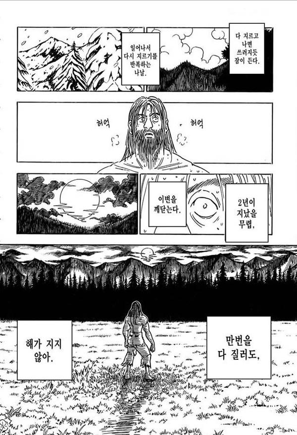

# 초월자(Transcendence) 가 되기 위한 길 

고수가 되는 길은 참 멀고도 험하다. 어떤 분야가 아무리 사소해도 결국 완성이라는 수준이 있다면 거길 도달하기 위해선, 신기하게도 어떤 '통달'이라는 특정한 수준 이상의 연마가 필요하다. 여러 미디어나 영화 속 백발의 고수가, 청년의 시절 웃통을 까고 기본기를 연습하는 그런 땀내 나는 느낌. 그런 통과 의례가 없다면 고수라는 말 붙이기가 쉽지 않을 것 같다. 


> 옛날에 이런 짤이 있었지...

42서울의 과제에서도 그런 과제가 있다. 기존의 지옥 같은 고통 속에 몸부림을 쳤어도, 비교도 안될 만큼 양과 비교도 안될 만큼의 깊이를 가지는 과제. 물론, 그것이 끝인가? 아니다. 어쩌면 개발의 진짜 입구에 초대를 받은 것이라고 봐도 과언이 아닌 과제. 그것이 바로 `트렌센더스` 라는 과제이다. 

# 무슨 과제인가? 
본 과제는 크게는 다음과 같은 내용을 담고 있다. 

1. TypeScript 를 배우고, 프론트엔드 웹을 구축하라. 반드시 `Single Page Application(SPA)`의 형태를 띄어야한다. 
2. TypeScript 를 배우고, NestJS 프레임워크를 사용하여 백엔드 웹 서버를 구축하라
3. DataBase를 위하여 PostgressDB 를 사용하라 
4. 이러한 기본 베이스를 기반으로 다음의 것들을 만들어라
	1. 보안을 위하여 hashed 되어 있어야 하며, SQL Injection에 대비해야 하며
	2. OAuth 를 활용하여 42인트라넷의 인증 체계를 사용한 로그인을 구현하며, 2차 인증을 구현하고, 사용자의 기록은 추적이 되어야 한다. 
	3. 채팅, 권한을 비롯한 기능들이 구현되어야 하며
	4. 실시간의 게임이 구현 되어야 한다. 

처음 이 내용을 받았을 때를 떠올려보면, 참 난감했다. 그 전까지 배운게 고작 C++ 98 버전을 통한 객체 지향 언어 뿐인데 뭘 하라는 걸까. 물론 다행이라고 한다면 webServ 과제를 통해 


```toc

```
