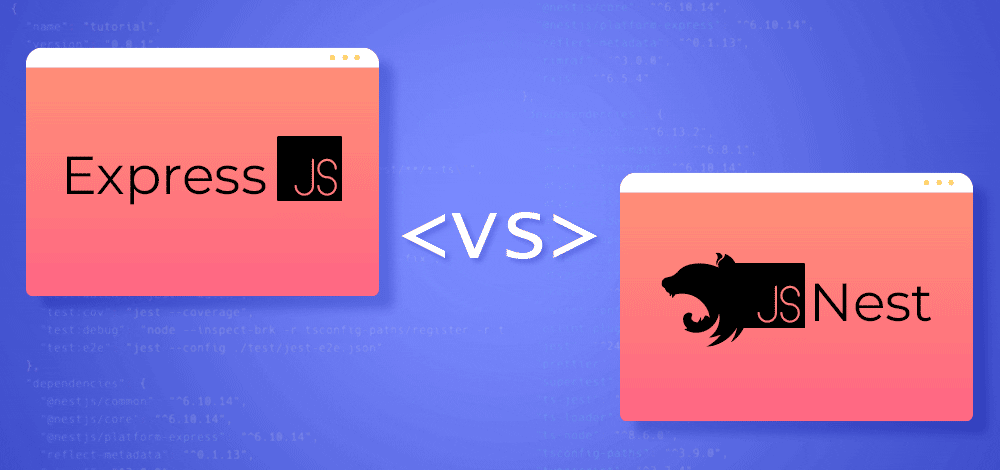
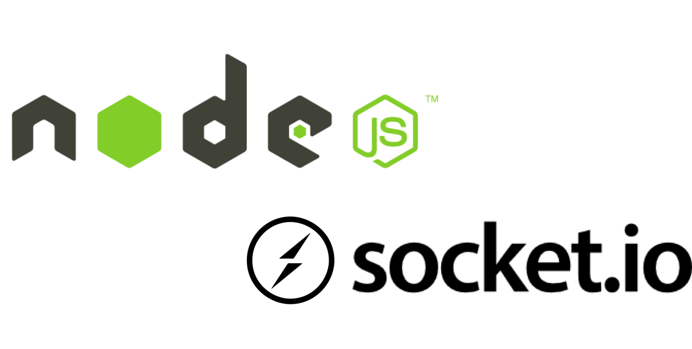
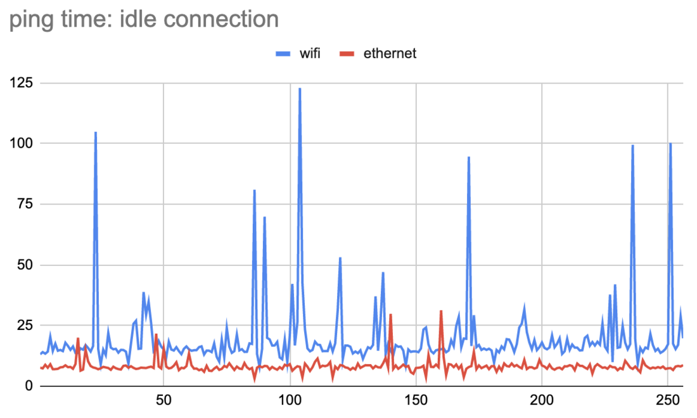

# 초월자(Transcendence) 가 되기 위한 길 

고수가 되는 길은 참 멀고도 험하다. 어떤 분야가 아무리 사소해도 결국 완성이라는 수준이 있다면 거길 도달하기 위해선, 신기하게도 어떤 '통달'이라는 특정한 수준 이상의 연마가 필요하다. 여러 미디어나 영화 속 백발의 고수가, 청년의 시절 웃통을 까고 기본기를 연습하는 그런 땀내 나는 느낌. 그런 통과 의례가 없다면 고수라는 말 붙이기가 쉽지 않을 것 같다. 


> 옛날에 이런 짤이 있었지...

42서울의 과제에서도 그런 과제가 있다. 기존의 지옥 같은 고통 속에 몸부림을 쳤어도, 비교도 안될 만큼 양과 비교도 안될 만큼의 깊이를 가지는 과제. 물론, 그것이 끝인가? 아니다. 어쩌면 개발의 진짜 입구에 초대를 받은 것이라고 봐도 과언이 아닌 과제. 그것이 바로 `트렌센더스` 라는 과제이다. 

# 무슨 과제인가? 
본 과제는 크게는 다음과 같은 내용을 담고 있다. 

1. TypeScript 를 배우고, 프론트엔드 웹을 구축하라. 반드시 `Single Page Application(SPA)`의 형태를 띄어야한다. 
2. TypeScript 를 배우고, NestJS 프레임워크를 사용하여 백엔드 웹 서버를 구축하라
3. DataBase를 위하여 PostgressDB 를 사용하라 
4. 이러한 기본 베이스를 기반으로 다음의 것들을 만들어라
	1. 보안을 위하여 hashed 되어 있어야 하며, SQL Injection에 대비해야 하며
	2. OAuth 를 활용하여 42인트라넷의 인증 체계를 사용한 로그인을 구현하며, 2차 인증을 구현하고, 사용자의 기록은 추적이 되어야 한다. 
	3. 채팅, 권한을 비롯한 기능들이 구현되어야 하며
	4. 실시간의 게임이 구현 되어야 한다. 

처음 이 내용을 받았을 때를 떠올려보면, 참 난감했다. 그 전까지 배운게 고작 C++ 98 버전을 통한 객체 지향 언어 뿐인데 뭘 하라는 걸까. 물론 다행이라고 한다면 webServ 과제를 통해 어느정도 웹을 이해할 수 있었고, 서버의 구조도 어떤 식으로 한다면 되는지 감은 잡고 있는 상황이었다. 보내는 데이터가 아무리 특별해 보여도 사실 그렇지 않음을 충분히 이해할 수는 있었다. 

# 내 앞에 나타난 고비들
생각해보면 트렌센더스 과제를 해결하는데 걸린 시간은 도합 거의 5개월의 시간이었다. 정말 인내심을 시험하는 듯한 느낌을 받았었다. 배우는 시간도 배우는 시간이었고, 개발의 시간도 개발의 시간이었지만, 사실 그것 외의 문제도 상당히 많았다. 와썹 행사를 진행하는 일도 있었고, 코로나에 전세사기를 처리하기까지... 정말 어떻게 버텼나 싶을 정도로 여러 일들이 내 앞을 가로 막았고, 결정적으로 진행하게 된 Project peer의 개발 총괄을 맡게된 것은 양 쪽다 일이 딜레이 되도록 만드는 주요한 요인이 아니었나 싶다. 

포인트는 어떻게 문제들을 해결했냐? 일 것이라고 본다. 기억이 사라지기 전에... 얼른 정리해보고자 한다. 

## 고수준의 언어를 통해 프로그래밍을 진행하는 감각 & 프레임워크라는 개념이 가지는 의미

C, C++ 은 모두가 알다시피 상당히 로우하다. 물론 사용하기 나름으론 매우 고수준의 언어처럼 만들어 쓸 수도 있겠지. 
하지만 기본적으로 다루는 방법이나 패턴은 매우 '정직' 했다. 하지만 자바스크립트, 타입스크립트로 이어지면서 보다 편리한 방식이라고 하는 다양한 '객체지향형' 언어들의 추상 개념은 러닝커브를 한층 끌어올리는 역할을 했다. 

특히나 화살표 함수를 비롯해, 객체 지향형임과 동시에 어떤 데이터든 담을 수 있도록 구조가 설계된 JavaScript 라는 언어, 그리고 이걸 기반으로 단단한 타입을 통해 잘못된 구조나 데이터를 담고, 휴먼 이슈와 함께는 결코 개발할 수 없도록 만든 TypeScript는 아무리 생각해도 쉽지 않은 고비였다. 기존에 javascript로 작성하는 여러 도구들을 써봤고, 나름대로 익숙하다고 생각했음에도 배움은 익숙하지 않았다.

그리곤 거기에 백 앤드 기능을 구현하기 위해 알아야 하는 것, 프레임워크 역시 그리 쉬운 녀석은 아니었다. NodeJS, expressJS 와는 또 다른 성격을 가졌는데, Node, express, NestJS를 구분 짓자면 다음과 같은 느낌이라고 볼 수 있을 것이다. 

> - NodeJS : 런타임, 실행기지만 기본적으론 라이브러리, 패키지 관리도 해주네?
> - expressJS : 오 Node 는 좋은데 너무 도화지 사이즈가 지멋데로네, 사이즈는 적당히 제한하자 
> - NestJS : 서버? 이렇게 만들면 알아서 돌아갈거임 ㅇㅇ..



무엇이 되었든 프레임워크라는 녀석은 일종의 '세상' 이라는 느낌이었다. 자유로우면 너무나 편리할 수는 있겠지만, 내부의 자원과 비효율적인 프로그램 구조를 가질 수 밖에 없고, 그런 구조를 가진다는 것 자체가 점점 복잡한 프로그램을 만들어내는 개발자 입장에선 여간 까다로운게 아니다. 그러니 좀더 배우는 품이 들더라도, 이런 자원 관리, 프로세싱의 형태를 관리해주는 것이 필요시 될 것이고, NestJS 는 그런 점에서 JS 진영의 Spring Boot 를 꿈꾼게 아닌가 싶다. 

하지만 위에서 말했듯 배우는데 품이 든다는 것은, 새로이 무언가 배우는 사람에겐 겁나는 요소가 될 수 있다. 특히나 우리 백 앤드 개발자들은 더더욱 그런 부분에서 어려워 했고, 그러니 개발에 가장 진척을 잡아 먹었던 것은 'NestJS'라는 세상을 이해하는 데서 였다고 말할 수 있을 것 같다. 

거기다 한편으로 이해하고 나니 더더욱 타성적인(?) 습관이 들어갔던 것 중에 하나는, NestJS 의 레퍼런스 코드나 사용 설명서가 없는 라이브러리, 패키지를 마주하게 되면 그때부터 매우 골치가 아파왔다. 읽어도 어떻게 연결시키면 좋을지 모르겠다는 생각이 먼저 앞섰고, 그래서 어느새 NodeJS 레퍼런스 코드들도 함께 보면서, 여차하면 NestJS의 틀에 갖히지 않으려고 생각을 했다. 

## 소통하는 방식의 차이 HTTP, Socket 통신 Socket.io

HTTP 라는 것은 Hyper Text Transfer Protocol 의 약자로 웹, 정확히 근본을 따라가자면 네트워크 상에서 공유되는 문서의 데이터를 주고 받기 위한 프로토콜이다. 현재의 인터넷 환경에서 웹 서버와 클라이언트 간의 통신의 규약이며, 클라이언트의 요청(request)에 웹서버가 이에 대한 응답(response)의 쌍으로 구성되어 있다는 특징을 가진다. 

그렇다면 소켓은 무엇일까? Socket 통신은 리눅스 시스템을 비롯한 그와 비슷한 모든 시스템 체계에 구현된 통신 방법으로, 시스템 상의 소켓이라는 연결지점을 만들고, 해당 지점을 기준으로 통신이 가능하도록 하는 것을 말한다. 특히나 이를 구성하는 요소로 전세계 컴퓨터들 사이에 공개된 IP라는 주소를 갖고 있으며, 이에 포트번호라는 도구를 통해 연결 위치를 지정해주며, 연결이 성사되면 데이터의 전송이 이루어진다. 

엄밀히 말하면 둘의 관계는 동등한 것은 아니다. 소켓은 기본적으로 컴퓨터라고 하는 구조 체계가 가진 통신의 방법이며, 그렇기에 특징적으로 소켓 통신은 프로토콜에 `독립적`이며 이 소켓 통신이 좀더 기반적인 측면으로 HTTP는 그런 통신 환경 하에 구현된, 비연결성(`Conectionless`), 무상태성(`Stateless`), 확장 가능성(`Extensionable`)을 가진 일종의 통신의 '약속(Protocol)' 인 것이다. 

그런데 본 과제에서는 게임을 구현하길 원하며, 구현을 위해선 HTTP 통신가지고는 불가능한 것을 요청한다. 실시간의 동기화, 클라이언트 간의 데이터의 실시간 전송 등... 이때 신기한 도구 하나를 소개하는데, 그것이 바로 `Socket.io`이다



해당 기술은 웹 어플리케이션 제작을 위한 JavaScript 라이브러리로 `실시간` 과 `양방향성` 을 만족한다. 심지어 클라이언트와 서버 사이에서 실시간 통신이지만, 웹 소켓이 지원되지 않는 환경에선 다른 방법으로 대체하여 통신을 하는 등, 꽤나 세심하게 만들어진 통신 방식이다. 기술 자체에 대한 내용은 Socket.io 공식 문서를 보면 된다. 하지만 역시 이것도 함정은 존재하는데, 이는 바로 '이벤트 기반' 이라는 점이다. 

기본적으로 해당 기술에 대해 이해를 하고, 사용하여 무언가 해보는 것은 어렵지 않았다. 하지만 그럼에도 문제가 되는 것은 실시간이라고 하는 것이 가지고 있는 '한계'와 동시에 발생할 수 있는 '모순'이다. 

## 네트워크를 이해하지 못하면, 구현도 안된다. 


실시간이라고 하는 것은 정말 매력적이다. 서버를 통해 클라이언트 끼리 실시간으로 데이터를 주고 받는다는 점은 마치 기존의 신호를 통해 뿅뿅 구시대적인 무언가를 하던것 같은데서 벗어나서, 심지어 네트워크라는 환경에서 멀리 떨어진 곳에 있는 사람들과 소통이 가능하다는...! 온라인 게임을 하며 청소년 시기를 지낸 우리들에게 실시간을 구현해본다는 말 자체는 로망 그 자체라고 해도 과언이 아닐 것이다. 

하지만 네트워크를 함부로 생각하면 안된다...! 예를 들어보자 

1) 한사람은 와이파이 환경이며, 한 명은 유선 환경이라면?
2) 키보드 입력이 한쪽은 polling rate가 1000hz인데 한쪽은 500hz 밖에 안된다면?
3) 서버의 성능이 부족해 이벤트 기반으로 싱글 스레드 큐가 불균형적으로 쌓이게 된다면?
4) 클라이언트 PC의 환경이 서버와 소통을 하면서, 그림을 그리는데 제약이 있는 저스펙의 디바이스라면? 

위의 4가지는 나 역시 게임을 구현하면서 하나씩 고민했던 부분이다. 이번 과제에서는 직접 구현해보면 좋겠다, 내가 알고 있는 것으로 충분히 가능하겠다고 생각했지만 그것들 중에서도 특히나 어떻게 하면 좋을까? 를 진지하게 고민했던 부분이다. 

설령 동일한 시간에 있다고 하더라도, 기계는 어쩔 수 없이 딜레이를 가진다. 네트워크의 대역폭은 한쪽이 더 빠를 수도 있다. 하지만 이를 전달하는데 걸리는 시간(latency) 가 오히려 느리다면, 데이터를 한번에 많은 양 전달은 할 수 있겠지만, 오히려 대역폭은 낮아도 반응속도가 빠른 연결 구성이 데이터의 도착에서 앞지를 수가 있는 것이다.

****

위의 사진은 Ethernet 환경에서 Video Call에 대한 연결 상태를 나타낸 표이다. 하나는 무선 환경이며, 하나는 유선 환경을 보여준다. 수평선의 경우 경과하는 시간, 수직선의 경우 ping(특정 포인트에서 특정 포인트로 데이터를 전달하는데 걸리는 시간)을 나타낸다. 

사진에서 볼 수 있듯 네트워크 무선환경은 거의 유선에 근접하는 수준까지 ping이 줄어들 수도 있으나, 기술적 한계로 요동치는게 보인다. 그렇다면 데이터가 저 순간 만큼은 규격에 대응하는 빠른속도라고 하더라도, 데이터의 입력에 '버퍼'가 발생할 수 밖에 없는 것이다. 

기본적으로 소켓을 통한 통신은 커널이 담당하고 있다. 따라서 예를 들어보자, A 클라이언트의 입력은 Ethernet 으로 항상 2ms 정도의 간격으로 데이터가 들어온다. B 클라이언트의 경우 wifi 환경이며 빠를 땐 10ms 간격으로 데이터가 들어온다. 하지만 종종 최대 50ms~125ms 까지 신호전달이 늦어진다. 커널은 큐 기반으로 보통 이러한 이벤트를 받는데, 문제는 그렇게 되면 동일하게 A, B의 신호가 들어온다면 처리에 문제가 없겠지만 AABBBBBAAAAAAABABAB 이런식으로 신호의 강도나, 도달되는 속도에 맞춰 정상적으로 데이터가 순차로 들어온다는 보장을 받을 수가 없다. 

하물며 키보드 입력에 대한 기본적이 원리를 생각해봐도 문제가 발생한다. 키보드는 기본적으로 polling 이라는 방식으로 키보드 입력이 눌려지는 순간을 데이터화 한다고 볼수 있다. 이때 key press자체를 입력받는데, 사무용 키보드라면 동시입력 미지원, polling의 빈도가 500hz 때로 PC에 들어오는 신호의 양 자체가 작을 수 있다. 이와 반대로 성능이 좋은 키보드라고 한다면 동시입력과 1000hz의 빈도로 신호를 보내줄 수 있다. 이러한 점에서 게임 내에 막대를 이동하는 이동값은, 단순하게 키보드 입력을 곧이곧대로 받아들일 수는 없다. 누르는 양을 비례해야하며, 네트워크 속도에 기반으로 하여 움직이는 시간 동안, 얼마나 움직일 것인가에 대한 나름의 알고리즘이 세워 져야만 한다. 

기타 등등.. 이러한 문제들에 직면했기 나는 다음 몇 가지를 추가함으로써 서버에서 직접 렌더링해서 전달하는 방식으로 게임의 구현을 성공시켰다. 

1. 60FPS를 그리기 위해 필요한 반응속도는 대략 1초 15ms보다 더 짧은 간격의 레이턴시면 된다. 즉, 비율적으로 환산하여, 60, 30, 24, 10 프레임으로 구간을 나누고, 소켓 통신 과정에서 레이턴시를 측정하고, 이에 맞춰 키프레임을 그릴 애니메이션의 양을 정하고, 이에 맞춰 대응한다. 
2. 키보드 입력은 클라이언트 엔드포인트에서 클라이언트 기반으로 동작해서는 안된다. 키보드 신호가 입력을 하는 것에 맡기게 되면, 키보드 신호 처리 상황에 따라 전혀 다른 수준의 키보드 신호가 들어올 수 있다. 그렇다고 프론트엔드에서 이를 조절한다면 또 다른 문제를 일으킨다. 
	1. 프론트엔드에서 이를 조절하기 위해서 신호를 조절하거나 하게 되면, 프론트엔드의 연산에서 문제가 발생한다. 비동기적으로 싱글 스레드 처리가 발생 되어 가는데, 이때 신호의 처리 중간에 대기를 해야 하게 됨에 따라, Socket.IO 의 이벤트 처리를 하는데 지장을 준다. 따라서 프론트엔드에서 이러한 처리 방식은 결코 추천되진 않는다. 
	2. 따라서 2번의 처리는 서버에서 '신호'를 보냈을 때, 정확하게 클라이언트가 이를 받고, 입력 여부를 결정해야 한다. 
	3. 더불어 고려할 것은 '프레임'을 가변으로 한다고 했을 때 키보드 입력이 프레임이 달라도 똑같이 움직이는 것처럼 되어야 한다는 점이다. 30프레임으로 움직인다면 1초에 30장을 그릴텐데, 여기서 이동속도가 등속하다면, 움직이는 거리 기준 1/30 만큼 키보드 입력이 되어야 할 것이다. 반대로 60 프레임이라면 키보드 입력 값이 똑같이 들어와도 더 작은 거리를 세밀하게 여러번 움직여야 한다. 이 점을 고려하여 지정된 거리 만큼 움직이는데, 이때 키 입력이 들어왔을 때, 정량적으로 환산하는 방법으로 키보드 입력을 일정하게 만들었다.
3. nestJS 는 Node와 express 기반의 싱글스레드 비동기 

# 반대로 그렇기에 얻은 것은...

# 마치면서

```toc

```
