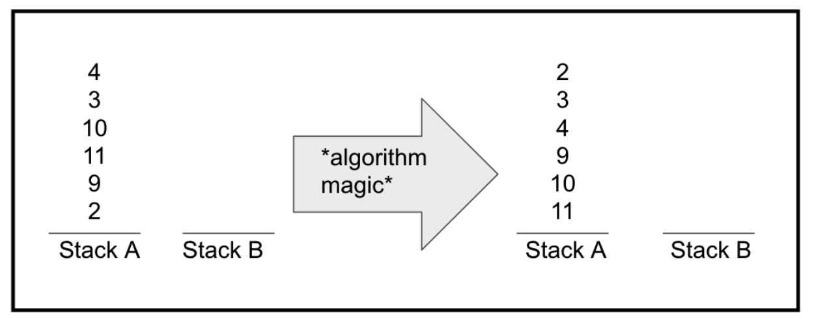
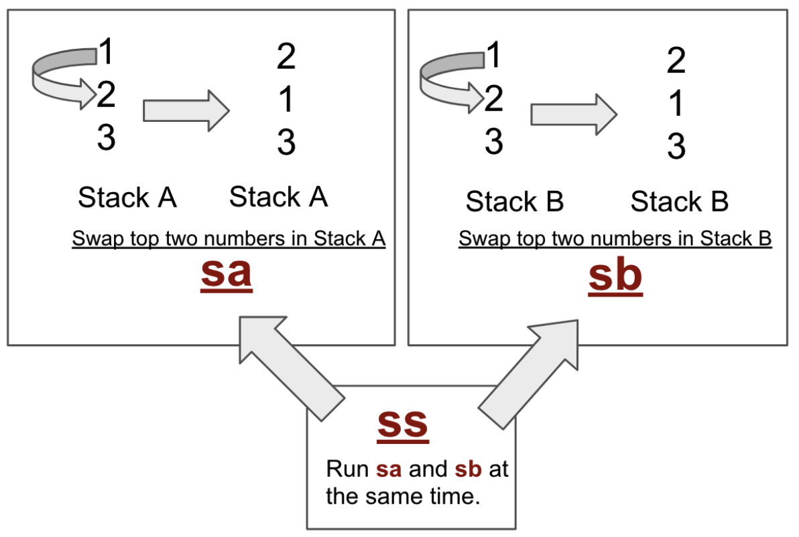
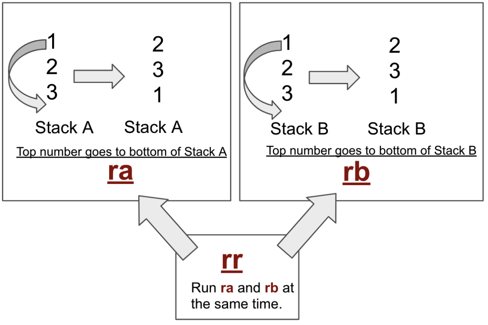
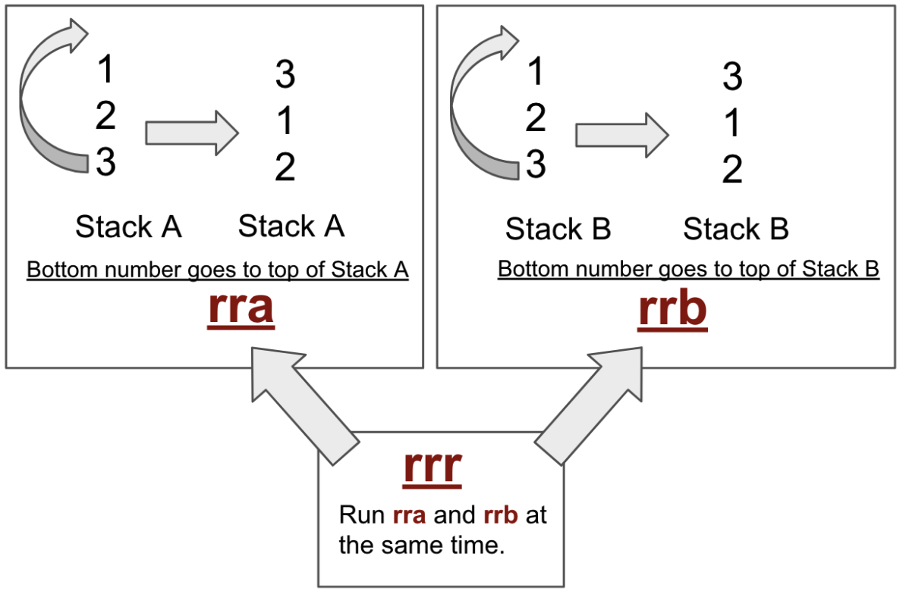
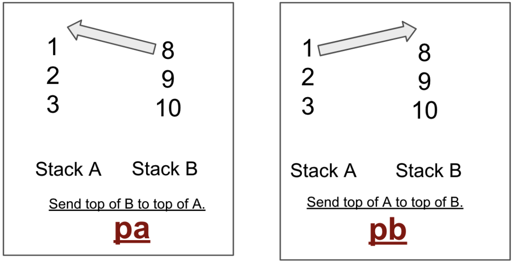

# Prologue

올 것이 왔습니다. 사실 C 언어 강의를 마무리 짓고, So_long이나 Minitalk을 통한 소켓통신 구현 등... 이런 녀석들에 대해선 부담이란걸 느낀 적은 없었습니다.

멘탈이 바스라질 일은 있었지만(so_long... ^^) 그렇다고 못할 수준이냐? 지금 생각하면 그렇진 않았습니다.

하지만 알고리즘은 확실히 부담이 느껴집니다. 이유는 수학을 손 놓은지 어언 몇 년째이고, 정리 정돈이라니...!

내가 제일 못 하는 부분 중에 하나를 들이밀다니. 😳

해본적 없는 걸 해보게 된다는 것 만큼 가슴 두근거리는(부정적으로) 일은 없을 것 같습니다.

그럼에도 인강도 듣고, 결국 해쳐서 해결해 나갈 것을 알기에... 제대로 빡세게 공부해보려고 합니다. 이왕 하는김에! 보너스까지!(이래놓고 so_long은 보너스 안 했지만(...))

우선, 가이드로 제공되는 문서들을 찬찬히 훑어보먼서 핵심들 위주로 정리해보고자 합니다. 그 뒤에 실제 부분부분 구현부터 시작해서 진행해보겠습니다.

# Push Swap

## 개념 잡기

Push Swap 은 스택 2개를 제공합니다. 이 제공되는 스택 중 하나 (stack A)에는 정돈되지 않은 정수들이 들어 있으며, 여기서 알고리즘을 활용하고, 한 개의 추가적인 빈 스택을 최대한 활용해 최소한의 제공되는 명령어로 정렬을 해야하는 프로젝트입니다. 생각해보면 이상한 프로젝트이긴 합니다. 시간 복잡도도 공간 복잡도도 아닌, 절차로 제공되는 기믹들의 사용 횟수를 줄인다라는... 참 신기한 구성이지만 아마도 알고리즘을 이렇게 해서 재대로 곱씹지 않으면 못 해결하도록 유도한게 아닌가. 그렇기에 조금 공부를 했던 사람들 입장에선 당황스러운 과제가 되지 않을까 예상해봅니다.


이 과제에는 허용되는 액션이 정해져 있습니다.
**sa, sb, ss, ra, rb, rr, rra, rrb, rrr, pa, pb**

## 허용 액션 정리해보자

허용 되는 액션에 대해선 매우 깔끔하게 정리한 이미지들이 있습니다. 이를 적극 활용하려고 합니다(증말 만들어주신 분 땡큐....)
우선 직접 번역하여 정리한 명령어들에 대한 설명은 다음과 같습니다.

- [ ] `sa` : (swap a) : 스택 a의 top 에 최초 2개의 요소를 스왑한다. 만약 거기에 한개 혹은 요소가 전혀 없다면 아무 일도 하면 안된다.
- [ ] `sb` : (swap b) : 스택 b의 top에 최초 2개의 요소를 스왑한다. 만약 거기에 한개 혹은 요소가 전혀 없다면 아무 일도 하면 안된다.
- [ ] `ss` : `sa` 와 `sb` 를 동시에 진행한다.
- [ ] `pa` : (push a) : b의 top에 있는 첫 인자를 취해라 그리곤 a의 top에 그것을 넣어라. b 스택이 비어있다면 아무 것도 하면 안된다.
- [ ] `pb` : (push b) : a의 top에 있는 첫 인자를 취해라 그리곤 b의 top에 그것을 넣어라. a 스택이 비어 있다면 아무것도 하면 안된다.
- [ ] `ra` : (rotate a) : 스택 a의 모든 요소들을 1 씩 top 쪽으로 해라. 최초 멤버는 마지막이 된다.
- [ ] `rb` : (rotate b) : 스택 b의 모든 요소들을 1씩 top 쩍ㅇ로 해라. 최초 멤버는 마지막이 된다.
- [ ] `rr` : `ra` 와 `rb` 를 동시에 진행한다.
- [ ] `rra` : (reverse rotate a) : 스택 a의 모든 요소를 1씩 bottom 쪽으로 해라. 마지막 멤버는 최초 멤버가 된다.
- [ ] `rrb` : (reverse rotate b) : 스택 b의 모든 요소를 1씩 bottom 쪽으로 해라. 마지막 멤버는 최초 멤버가 된다.
- [ ] `rrr` : `rra` 와 `rrb` 를 동시에 진행한다.

주욱 읽어보면 대충 무슨 말인지 이해가 됩니다. 하지만 역시 한 방에 이해하는게 좋지 않겠는가? 바로 그림으로 설명하면 다음과 같습니다.

단, 한 가지 기억해야 할 것은 원래 stack 구조는 전통적 `top` 부분이 아래로 가게 표현해야 합니다.(반대로, `bottom`은 위로 가야 합니다.) 하지만 이 그림을 만드신 분은 그런 전통적인 표현을 지키진 않은 것으로 보이니 주의 하십시오.


S 시리즈의 경우 `top` 부분부터 시작하여 2개의 숫자의 `위치`를 바꾸는 역할을 합니다.(swap)</p>

rr 시리즈 경우 `top` 부분의 숫자를 `bottom`으로 전달하고, 2번째 숫자가 `top`으로 올라가게 만듭니다.</p>

rrr 시리즈 경우 `bottom`의 숫자를 `top` 으로 올리고, 나머지 숫자를 아래로 내립니다.</p>

p 시리즈는 명칭에 맞춰 자기 스택에서 지정된 스택으로 `top` 부분의 숫자를 옴기는 역할을 합니다.</p>

정말 이해가 잘 되게 그린 그림이라 생각합니다. 이제 이걸 활용해서 알고리즘을 선택할 것이고, 선택한 알고리즘에 이 액션들을 적용하여 정리가 될 수 있도록 만들 것입니다.

## 어떻게 작동되는가?

우선, 스택 A에서 최장 증가 부분 수열(Longest Increasing Sequence, LIS)을 발견함으로 시작을 하면 좋을 것으로 생각됩니다. 예를 들면 이렇게 말이죠.

> 최장증가부분수열에 대해선 이 [링크](https://chanhuiseok.github.io/posts/algo-49/)를 참조하세요.

|  `top`   |  `top`   |
| :------: | :------: |
|    7     |    -     |
|    3     |    -     |
|    8     |    -     |
|    9     |    -     |
|   `0`    |    -     |
|    4     |    -     |
|    6     |    -     |
|    1     |    -     |
|    2     |    -     |
|    10    |    -     |
|          |          |
|  **A**   |  **B**   |
| `bottom` | `bottom` |

시작함과 동시에, stack A를 tmp라는 스택을 만들어 복사해야하고, 가장 작은 숫자(이 예시에선 `0`)를 top에 넣어야 합니다. 스택의 절반의 bottom 부분 혹은 top에 숫자가 있는지 없는지에 따라서`ra` 와 `rra`를 사용할 것입니다.
이번 샘플에 경우 top으로부터 5번째 위치에 있으므로, `ra`를 사용합니다.

|  `top`   |  `top`   |
| :------: | :------: |
|   `0`    |    -     |
|    4     |    -     |
|    6     |    -     |
|    1     |    -     |
|    2     |    -     |
|    10    |    -     |
|    7     |    -     |
|    3     |    -     |
|    8     |    -     |
|    9     |    -     |
|          |          |
| **tmp**  |  **B**   |
| `bottom` | `bottom` |

이제 LIS 는 `0, 1, 2, 3, 8, 9` 입니다. 이에 대한 튜토리얼들은 많이 찾아 볼 수 있으니 확인해보십시오.
LIS 를 확보 했으니, Stack B 에 LIS에 속하지 않는 정수들을 옮겨 줍니다. 그래서 이런 식으로 정리 될 것입니다.

|  `top`   |  `top`   |
| :------: | :------: |
|    -     |    -     |
|    -     |    -     |
|    -     |    -     |
|    -     |    -     |
|    3     |    -     |
|    8     |    -     |
|    9     |    10    |
|    0     |    6     |
|    1     |    4     |
|    2     |    7     |
|          |          |
|  **a**   |  **b**   |
| `bottom` | `bottom` |

다음으로 스택 B에서 스택 A로 정확한 위치로 push 할수 있는 가장 최선의 정수가 어떤 수인지를 정하는 것이 가장 중요합니다.

우선, 매번 stack B의 top 위에 현재 숫자를 넣기 위해 필요한 이동수를 계산하고 저장하고자, 스택 B의 top에서 bottom까지 스택의 중간에 도달할 때까지 반복합니다. 스택 A에도 정확한 포지션에 놓기위해 움직임의 수를 계산하고 저장합니다.

예를 들어, stack B의 top에 10을 놓기 위해, 필요시 되는 움직임의 숫자는 '0' 입니다. 왜냐면 이미 top 에 있기 때문입니다. 정수 10은 stack A의 9, 0 사이에 들어가야 할 것입니다. 이를 위해 stack A에서 액션을 3회 시킬 필요가 있고, 그 뒤에 `pb` 를 진행해야 합니다. 따라서 최종적으로 정수 10을 옮기기 위해선 정확히 4회의 액션이 필요한 것을 알 수 있습니다.

그렇다면 어떻게 '10' 의 적절한 위치를 알수 있을 까요?
stack A에서 위치시켜야할 숫자들의 위치를 알기 위해 필요한 4가지 경우의 수가 있습니다. (stack A에 대해 우리는 top~bottom까지 반복시키고 있다는 사실을 기억해주세요.)

1. `A[size_of_stack_A - 1]`와 `A[0]` 사이에 있습니다. [2, 3](이걸 한 번에 점검하면 된다.)
2. `A[i]`, `A[i+1]`의 사이에 있다. [3, 8]. i는 0부터 시작하여 `stack A 의 크기의 절반`이며, 위의 사례의 경우 6입니다.
3. `A[j]`, `A[j-1]`의 사이에 있다. [1, 2]. j는 stack A의 사이즈 - 1부터 stack A의 절반 까지입니다.
4. 위의 모든 경우가 아닌 경우. 이 경우, `현재 숫자는 두 스택의 최댓값`입니다. 스택 A의 최대 수의 위치(이 예에서는 인덱스 3, 9의 위치) 를 찾아야 하며, 여기에 10이 배치될 곳입니다.

이제 이 위치를 크기 2의 배열에, `tmp[2] = {pos_a, pos_b}` (예시 - '10', tmp[2]={3, 0})로 저장해야 비교 할 수 있습니다. 그리하여 다음 숫자의 위치와 이전 숫자의 위치 다음 숫자의 위치와 이전의 숫자 위치를 비교할 수 있습니다. 다소 헷갈릴 수 있는 설명인되, 뒷 부분에서 이해가 될 수 있을 것입니다.

우리는 stack A에 최적에 요소들을 되돌리기 위한 stack B의 처음 수를 항상 고려해야 합니다. 그러나 stack B 전체를 반복함과 함께, 우리는 A로 보내야할 최적의 숫자를 찾거나, 혹은 찾지 못할 수도 있습니다.

이제는 '7' 이란 수의 위치를 계산해봅시다. 우리는 tmp[2] = {1, -1}를 얻을 것입니다.(음수 값은 걱정마세요. 뒤에서 이해가 되실 겁니다.) 이 수는 10의 위치 선정보단 낫지요. 그래서 현재 최적의 수는 10 대신 7이 됩니다.

이번엔 6, tmp[2] = {1, 1}, 이 수의 경우 7과 똑같은 위치네요. 그렇기에 처음 시작으로 할 숫자는 변하지 않습니다. 그러면 4는 어떨까요? 4의 경우 tmp[2] = {1, -2} 이고, 그래서 최적의 숫자는 변하지 않습니다. 이제 어느정도 무슨 방식으로 작동하는지 이해가 되셨나요? 천천히 어떤 식으로 pos_a, pos_b의 작동 방식을 이해해보시길 바랍니다.

이 예제에서, 우리는 쉽게 stack A에 7을 되돌려 넣을 수 있습니다. 하지만 만약에 7에 대해 tmp[2]={3, 2}으로 지정이 된다면, 그리고 이게 우리가 전달 가능한 최적의 숫자라면? 우리는 `rb`를 2회, `ra`를 3회 진행하면 됩니다. 하지만 이 경우 액션의 숫자를 최소화 시킬 순 없겠습니다.(`rb` _ 2 + `ra` _ 3 = `5`)

|  `top`   |  `top`   |
| :------: | :------: |
|    -     |    -     |
|    -     |    -     |
|    -     |    7     |
|    8     |    -     |
|    -     |    -     |
|    -     |    -     |
|    -     |    -     |
|    -     |    -     |
|    -     |    -     |
|    -     |    -     |
|          |          |
|  **a**   |  **b**   |
| `bottom` | `bottom` |

마지막에 이야기 한 경우를 생각해봅시다. stack A의 8은 ra _ 3, stack B 의 7은 rb _ 2가 필요합니다.
이러한 경우 우리는 `rr` 을 활용해서 액션의 숫자를 줄일 수 있습니다. (`rr` _ 2 + ra _ 1 = `3`).

여기서 기억해야할 부분이, ra-rb 뿐 아니라, rra-rrb, sa-sb 액션들도 공통적으로 필요할 때 사용하는 방식을 활용한다면 훨씬 더 최적화 시키는 것이 가능합니다.

stack B를 계속해서 회전시킬 때, 최근의 숫자의 위치가 top 혹은 bottom, 어느 곳에 위치하고 있는지를 알아야 합니다. 여기서 활용 가능한 방법은 음수 인덱스를 사용하는 것입니다. 즉, 스택 B의 아래쪽 절반에 숫자가 있는 경우 `pos_b`를 음수로 저장하고 stack A의 올바른 위치가 아래쪽 절반에 있으면, `pos_a` 역시 음수가 됩니다. 그럼에도 bottom의 중간 아래에 있는 수라고 해도 적절하게 처리할 수 있습니다.
| `top` | 비고 | `top` | 비고 |
| :------: | :------: | :------: | :------: |
| - | | - | |
| - | | - | |
| - | | - | |
| - | | - | |
| - |←2번째 위치 A의 bottom, pos_a = -2 | 7 | ←3번째 위치 B의 bottom, pos_b = -3 |
| 8 | | - | |
| - | | - | |
| - | | - | |
| | | | |
| **a** | | **b** | |
| `bottom` | | `bottom` | |

이제 최적의 숫자를 결정하기 위한 똑똑한 회전에 대한 신중한 고민을 할 때입니다. 이제 stack A 안에서 현재 숫자의 정확한 위치를 결정할수 있는 최대 움직임을 계산해야합니다. 예를 들여, 만약 우리가 생각하는 최적의 수를 '15'라고 한다면, 이는 stack B의 bottom 부에 존재합니다. 이는 tmp[2] = {-2, -3}일 것이고, 최대 움직임 횟수는 3이겠지요.

|  `top`   |          비고           |  `top`   | 비고 |
| :------: | :---------------------: | :------: | :--: |
|    -     |                         |    -     |      |
|    -     |      rrr\*2 + rrb       |    -     |      |
|    -     |       이렇게 하면       |    -     |      |
|    -     | 바꿔야 할 숫자의 위치가 |    -     |      |
|    -     |    top으로 바뀝니다.    |    -     |      |
|    -     |                         |    15    |      |
|    16    |                         |    -     |      |
|    -     |                         |    -     |      |
|          |                         |          |      |
|  **a**   |                         |  **b**   |      |
| `bottom` |                         | `bottom` |      |

이제 어떤 식으로 계산이 되는지 이해가 되시나요? 확신이 안선다면 (pos_a \* pos_b) 가 양수인지 확인하고 사용하면 될 겁니다.

최적의 숫자가 중간을 기준으로 위쪽에 존재한다면, 동일하게 정용합니다. 그저 양수로 된 pos_a, pos_b를 사용하면 될 뿐입니다.

음수의 횟수를 사용하는 경우는 중간을 기준으로 bottom 쪽에 배치된 숫자일 경우 사용하시면 됩니다. 하지만 stack을 회전시킬 때, pos_a의 절대 값, 그리고(혹은) pos_b의 절대값을 사용하면 됩니다.

그러면 다시 원래 샘플을 보면서 이야기 해봅시다.

|  `top`   |  `top`   |
| :------: | :------: |
|    -     |    -     |
|    -     |    -     |
|    -     |    -     |
|   `7`    |    -     |
|    8     |    -     |
|    9     |    -     |
|    0     |    -     |
|    1     |    10    |
|    2     |    6     |
|    3     |    4     |
|          |          |
|  **a**   |  **b**   |
| `bottom` | `bottom` |

7을 옮겼습니다. 그러면 이제 동일한 작업을 진행하여, stack B를 비워줍니다.

|  `top`   |  `top`   |  `top`   |  `top`   |  `top`   |  `top`   |
| :------: | :------: | :------: | :------: | :------: | :------: |
|    -     |    -     |    -     |    -     |   `10`   |    -     |
|    -     |    -     |   `6`    |    -     |    0     |    -     |
|   `4`    |    -     |    7     |    -     |    1     |    -     |
|    7     |    -     |    8     |    -     |    2     |    -     |
|    8     |    -     |    9     |    -     |    3     |    -     |
|    9     |    -     |    0     |    -     |    4     |    -     |
|    0     |    -     |    1     |    -     |    6     |    -     |
|    1     |    -     |    2     |    -     |    7     |    -     |
|    2     |    10    |    3     |    -     |    8     |    -     |
|    3     |    6     |    4     |    10    |    9     |    -     |
|          |          |          |          |          |          |
|  **a**   |  **b**   |  **a**   |  **b**   |  **a**   |  **b**   |
| `bottom` | `bottom` | `bottom` | `bottom` | `bottom` | `bottom` |

진행 방향은 → 이쪽으로 진행이 됩니다.
이렇게 정리하다보면 어느새 배열은 정돈이 되어 있습니다. 가장 마지막 해야할 일은 가장 적은 숫자로 stack A의 top에 가장 작은 숫자가 있는지 여부를 점검하는 것입니다.

만약 이상적인 상태라면, 그야말로 최적이지만, 그렇지 않을 경우 `ra`와 `rra`를 활용해서 정돈을 하시면 됩니다

축하드립니다. 성공적으로 stack A를 최소한의 액션 수로 정리하신 것이 됩니다. 😁

깃허브를 참고하시면 수 많은 시각화 도구들이 존재합니다. 이걸 쓰는 것은 뭔가 잘못되었을 때만 참고 하시는게 가장 좋을 것으로 보입니다.

## 마무리를 지으면서

해당 내용은 push swap에서도 어떤 방식으로 정렬하면 좋을지 꽤나 쉽게 정돈 되어 있던 문서이자, LIS 알고리즘을 활용한 것으로 보입니다. 알고리즘의 방식도 다양하고, 기존의 풀이한 분들 중에선, quick sort 나, greedy 방식을 이용하신 분들이 많은데, 해당 방식도 충분히 알고리즘으로써 가치가 있고, 훨씬 쉬운 접근이 아닐까 생각했습니다.

구현해야할 일이 많긴 한데... 로직은 얼추 이해가 되었으니, 함수로 구현 및 푸시스왑을 위한 자료형을 어떤 식으로 짤지를 고민해 봐야겠습니다.

**😎 push swap 과제 시리즈 😎**

[push swap 정복기(1)](https://paul2021-r.github.io/42%20seoul/push_swap/20220413_push_swap/)

[push swap 정복기(2)](https://paul2021-r.github.io/42%20seoul/push_swap/20220416_push_swap_2/)

[push swap 정복기(3)](https://paul2021-r.github.io/42%20seoul/push_swap/20220420_push_swap_3/)

[push swap 정복기(4)](https://paul2021-r.github.io/42%20seoul/push_swap/20220423_push_swap_4/)

```toc

```
