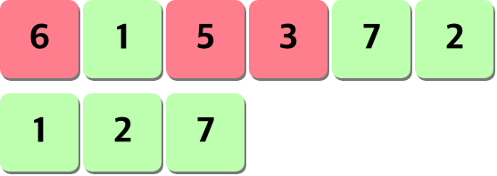
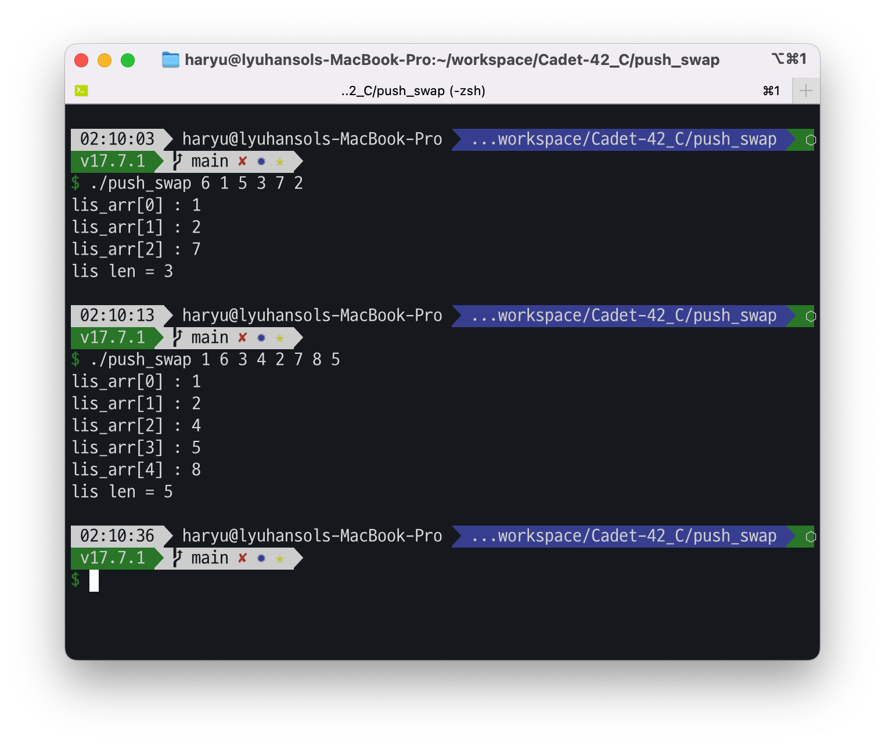

# Prologue

우선은 중간 정리.
LIS 알고리즘으로 하겠다고 결정을 하고, 내용을 이해하고 구현할 수 있는 곳까지 구현을 마무리 지어봤습니다. 핵심적인 알고리즘을 다 마무리 하고 싶었지만, 추가로 사용하기 위한 것들을 만들다 터지고..., 서순을 잘못 하거나 하는 등으로 노드를 잘못 연결시킨다던가 하는 일들 때문에... 어느새 하루를 다 쓰고, `sa` 부터 `rrr` 까지 만들고나니 12시가... 😅

이러나 저러나 코드가 나름 순조롭게 진행 중인 것 같아. 다행이라면 다행인? 상황입니다. 알고리즘이라고 잔뜩 쫄았지만, 생각보다 알고리즘 자체에 대한 이해가 어느 정도 되고, 레퍼런스가 될만한 것들을 구글링 하면서 찾아보면서 나름 순조롭게 된것 같아 다행입니다. 그리하야... CS 공부를 하기 전 해놓았던 것들을 정리하는 글을 써 놓으려고 합니다.

# Push Swap

## LIS

`최장 증가 부분 수열(Longest Increasing Subsequence)`의 핵심은 여기에 있다고 생각했습니다. 다른 소팅 방식도 있지만, 다른 소팅의 경우 기준이 될만한 것을 만든다기 보단, 분할 -> 기준치를 만들고 그 기준으로 크기 비교하여 정리의 구조이다보니 자연스레 시간복잡도가 올라가게 되고, 최적화하는 과정에 대한 고민이 되더군요. 그런 점에서 LIS의 사용은 생각보다 괜찮다고 느꼈습니다. 물론 단점도 있지만 말이지요.

LIS는 어떤 수열이 주어질 때 그 수열에서 몇 개의 수들을 제거하여 부분 수열을 만드는데, 이때 그 중 오름차순으로 정렬된 가장 긴 수열을 만들어내는 것입니다. 최장 증가 부분 수열(LIS) 라고 하며, 동적계획법(DP)으로 풀이를 한다고 보시면 됩니다.

_이런 녀석에서_
_초록색으로 순차적인 수열을 만들면 됩니다._

그렇다면 이해를 위해 좀더 들어가보도록 하겠습니다. 동적계획법에 대해 간단히 먼저 보고 가겠습니다.

동적 계획법이란 ..

> "수학과 컴퓨터 과학, 그리고 경제학에서 동적 계획법(dynamic programming)이란 복잡한 문제를 간단한 여러 개의 문제로 나누어 푸는 방법을 말한다. 이것은 부분 문제 반복과 최적 부분 구조를 가지고 있는 알고리즘을 일반적인 방법에 비해 더욱 적은 시간 내에 풀 때 사용한다 -[위키피디아](https://ko.wikipedia.org/wiki/%EB%8F%99%EC%A0%81_%EA%B3%84%ED%9A%8D%EB%B2%95)"

사실 복잡한 내용은 지금 당장 설명한다고 나 역시 이해가 잘 되진 않습니다. 하지만 한 가지 확실한 것은, 이것이 가진 장점에 있다고 생각했습니다. 동적계획법의 경우 `모든 방법`을 일일이 검토하여 최적의 해를 찾아내는 알고리즘입니다. 그리디 알고리즘과 분명하게 대비 되는 부분이 있는데, 그것은 그리디 알고리즘은 모든 해를 구하지 않고 순간 순간의 가장 최적의 해를 구합니다. 하지만, 이에 비해 동적 계획법은 모든 가능성을 찾아본 뒤의 결정을 진행합니다. 따라서 최선의 상태가 결정되게 될 경우 그 과정에선 느릴 순 있지만, 결과적으론 효율적이게 됩니다. 즉, 그리디에 비해선 `과정의 시간이 오래걸리지만` 항상 `최적의 해를 구할 수 있다`는 겁니다. 반대로 그리디의 경우 순간적인 최선을 선택하는 만큼 빠르지만, 순간적으로 고르는 결정이 궁극적인 최선은 아닐수 있다는 점이 차이일 수 있습니다.

어쨌든, 이런 개념을 가지고 있는 동적계획법에 대해선 아직 부족함이 많지만, 분명한 것은 LIS 를 활용해 결정되는 수열은 이미 오름차순으로 정돈되는 결과를 가져옵니다. 그리곤 나머지 원소들을 스택 B로 옮기고, 그 옮긴 것들을 최대한 공통적인 명령어들로 수행시켜 위치에 옮겨준 뒤, 반복문을 통해 회전시켜(rotate) 주면 꽤나 빠른 형태로 정돈되지 않을까 생각해봤습니다.

## 그래서 LIS 는 어떻게 구해봐야 할까?

여기서부터는 역시 아직 자료구조를 배우지 않은 제 수준의 한계를 많이 느꼈습니다. 최초엔 직접 구현을 고려해보았으나 결정적으로 구현 과정에서 고려해야 할 요소들에 손이 미치지 못한 만큼 레퍼런스가 될 만한 로직을 보고 최대한 구현해보게 되었습니다. 참고로 한 글은 [여기](https://cocoon1787.tistory.com/713)입니다.

본 글에서 이야기 하는 핵심 아이디어는 이중 for문을 활용하는 방식과 이분 탐색을 활용하는 방식이었습니다. 결론적으로 push swap을 위해선 어떤게 최적의 방식인가? 에 대해선 이분탐색을 고려해보기로 했습니다. 그 이유는 아래와 같습니다.

1. 이중문을 활용한 경우, 결과에서 온전하게 LIS의 원소를 구할 순 있었지만, 문제는 `중복`되어 들어간다는 점이 있었습니다. 이는 `추가적인 필터링 기능`을 고려해봐야 했습니다.
2. 추가적인 필터링의 기능은 차치하더라도, 해당 알고리즘은 `고정된 폭의 배열을 제공`하고, 받아내는 배열도 `이미 길이가 얼마가 될지에 대해 알고 작성하는 방식`이었습니다. 즉, 동적으로 할당 해야 하며, 그런 와중에 어느정도 성능의 최적화를 고려한다면 이중 for 문의 형태를 개조해서 사용하는 로직은 타당치 않아 보였습니다.
3. 그에비해 이분탐색은 우선 `시간 복잡도` 면에서 우수했습니다(`n log n`).
4. 동시에 해당 방식을 활용할 경우 `동적으로 배열을 할당하는게 어렵지 않았으며`, 처음에 적절하게 초기화만 이루게 되면 필요한 `중복이 없는 단일 원소들의 LIS 배열을 구할 수 있다`는 점에서 매우 큰 강점이 있었습니다.

## 구현 결과

```c
include "../includes/pushswap.h"

int	lower_bound(int *array, int value, int s, int e)
{
	int	mid;

	while (s < e)
	{
		mid = s + (e - s) / 2;
		if (value <= array[mid])
			e = mid;
		else
			s = mid + 1;
	}
	return (s);
}

void	make_lis(int *array, int **ret, int ref_i, int max_len)
{
	int	i;
	int	j;
	int	pos;

	i = ref_i;
	j = 1;
	while (++i < max_len)
	{
		if ((*ret)[j - 1] < array[i])
			(*ret)[j++] = array[i];
			// 순수하게 기준되는 (*ret)[j - 1] 값 보다작은 값이면, j 위치에 넣습니다.
		else
		{
			pos = lower_bound((*ret), array[i], 0, j);
			// 처음부터 현재 원소가 들어간 지점까지를 훑어서 더 작은 값이라면 해당 위치에 삽입됩니다.
			(*ret)[pos] = array[i];
		}
	}
}

int	find_lis_len(int *array, int max_len)
{
	int	ret;

	ret = 0;
	while (ret < max_len)
	{
		if (array[ret] == 0 && array[ret + 1] == 0)
			break ;
		if (array[ret] == 0 && ret + 1 == max_len)
			break ;
		ret++;
	}
	return (ret);
}

void	get_lis(t_pushlist **push)
{
	int	*lis_arr;
	int	i;
	int	pivot;

	pivot = find_minimun((*push)->array, (*push)->max_len, &i);
	// 기준이 되는 최솟값을 찾습니다.
	/* 위의 명령을 통해 인덱스를 지정합니다.
	이는 앞 부분에서 작은 수가 들어올 때마다 자리를 내주기 때문에
	이왕 이렇게 된거 스킵을 해버리는 단계입니다.*/
	pivot = (*push)->max_len - i;
	lis_arr = array_malloc_to_zero(pivot);
	// 필요한 양 만큼만 동적 할당을 진행합니다.
	(*push)->lis_len = pivot;
	lis_arr[0] = (*push)->array[i]; // 첫 값을 지정합니다.
	make_lis((*push)->array, &lis_arr, i, (*push)->max_len);
	// make_lis 함수를 활용해서 LIS 값을 while 문 안에서 돌려서 탐색합니다.
	free((*push)->array);
	// 기존에 array에 스택 A에 들어갈 초기 값으로 배열은 초기화하고
	(*push)->array = lis_arr;
	// 새로운 배열을 해당 구조체에 지정함으로써, 배열 정렬을 위한 과정을 준비합니다.
	(*push)->lis_len = find_lis_len((*push)->array, (*push)->lis_len);
	/*
	만들어놓은 LIS의 문제가 하나 있었습니다. 이는 필요한 양을 동적으로 할당하는 것은 좋지만,
	LIS 를 만드는 과정에서 실제 LIS는 동적할당한 배열의 길이보다 짧을 수 있다는 점이 었습니다.
	따라서 이에 대하여 명확한 끝이 어딘지를 다시 탐색하는 과정이 필요했습니다.
	*/
	return ;
}
```

상당히 긴 것 가지만... 여하튼 이렇게 구현 로직을 활용하고, 이분 탐색으로 값 사이 작은 값들을 앞 쪽으로 보내는 방식으로 하면 결과를 이렇게 얻을 수 있습니다.

_확실하게 참고한 글과 동일한 결과를, 제가 직접 넣은 테스트 케이스에서도 정상 작동합니다_

## 앞으로 남은 것은?

가이드로 제공되는 문서들이나 힌트들을 종합해보면 LIS를 구한 뒤의 로직은 생각 이상으로 간단합니다.

1. LIS를 기반으로 스택 A에서 `LIS에 속하지 않는 원소들`을 `스택 B`로 옮깁니다.
2. 분할 된 스택 A, B 사이에서 스택 B의 원소 중 가장 `최적의 숫자`를 선정하는 로직을 만들어냅니다.
3. 해당 로직에 따라 B의 원소를 옮기기 위한 `공통 액션(ss, rr, rrr) + 개별 액션`을 선택할 수 있는 알고리즘을 활용하여 옮긴다.
4. 끗.

가장 핵심이 2번과 3번인데 이 녀석들이 진짜 가장 문제로 보여집니다. 가이드나 각종 문서들을 보긴 했지만 전혀 이해가 안된다는게 유머(...). 1번까지는 이미 구현이 완료되었고, 알고리즘 완성 후 버그나 생각 못한 예외 케이스에 대한 검토만 하면 됩니다. 대충 머릿속에 떠오르는 로직은 존재하지만, 그대로 했다간 최적화면에서 아주 꽝이리란 불안감이 있다보니(...) 좀더 고민을 하면서 적용 가능한 경우의 수를 선택하여 로직을 짜보는 방식으로 해봐야 하리라 생각합니다..

## 마무리를 지으면서

원래는 LIS + 구현에 핵심인 명령어들 구현한 것도 함께 포스팅을 하고 싶었으나, 그러기엔 양의 압박이 심각할 것으로 보여(..) 여기서 마치려고 합니다. 여전히 LIS를 구하는 방식에도 최적화가 좀더 들어갈 수 있으리란 생각이 들긴 합니다. 이 글을 작성하던 중간에도 갑자기 생각나서 수정을 하긴 했는데(...) 역시 생각하면 할 수록 더 최적화가 되는 것이 아닌가 생각이 드네요.😂 다음주 중에는 마무리 짓고 필로소퍼를 도전 + 벌써 3트째인(...) 시험을 통과할 수 있길 ㅎㅎ;

**😎 push swap 과제 시리즈 😎**

[push swap 정복기(1)](https://paul2021-r.github.io/42%20seoul/push_swap/20220413_push_swap/)

[push swap 정복기(2)](https://paul2021-r.github.io/42%20seoul/push_swap/20220416_push_swap_2/)

[push swap 정복기(3)](https://paul2021-r.github.io/42%20seoul/push_swap/20220420_push_swap_3/)

[push swap 정복기(4)](https://paul2021-r.github.io/42%20seoul/push_swap/20220423_push_swap_4/)

```toc

```
