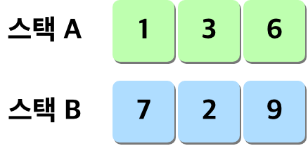
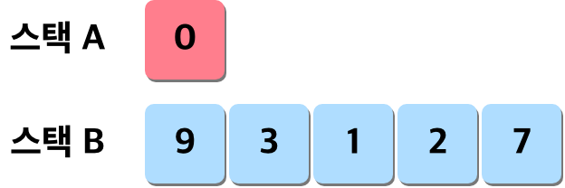
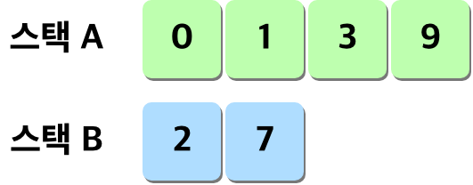
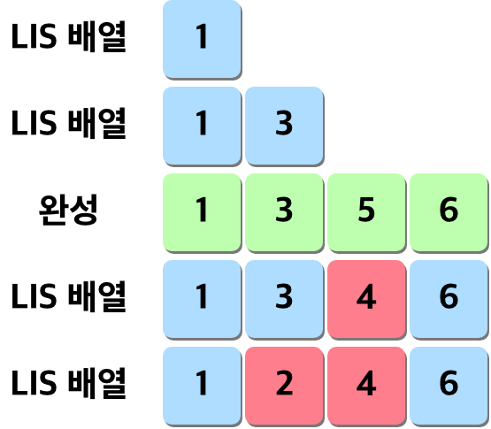
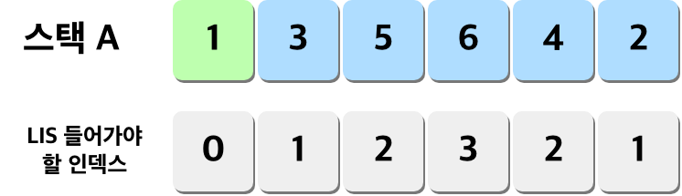
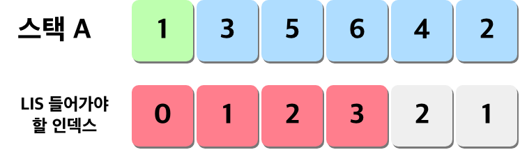
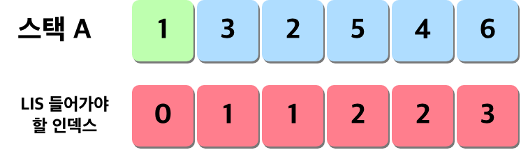

# Prologue

아.. 망했습니다. 사람은 역시 꼼꼼하게 읽어야 하는 것이었습니다. LIS 배열을 만드는 것에서 문제가 생겼습니다. 오늘 이 포스팅은 해당 내용에 대해서 스스로 반성 및 어떻게 할 지를 정리하는 글로써 남기려고 합니다. (그리곤 불타는 코딩 🫣)

# Push Swap

## LIS와 이분탐색의 한계

가장 큰 문제는 역시 제가 꼼꼼하게 읽지 않은 것이었습니다. 그
리고 동시에 LIS 성능을 극대화 하는 방법은 무엇인가에 대한 고민이 없었기에 만들어놓고 결국 문제가 있음을 깨달았고 이를 수정해보기 전에 단순 로직 구현으론 어떤 문제가 생기는지를 정리하였습니다.

### 1. LIS 배열의 극대화

우선 첫 번째 발견한 문제는 LIS 작성 중의 효율에 대한 문제였습니다. 예를 들어 이런 숫자의 배열이 들어왔다고 가정합니다.


이 배열에서 현재 상태 그대로 LIS를 구한다고 하면, LIS 값은 이렇게 지정되게 됩니다.


보시다시피 `1`, `3`, `6`을 현재의 스택 상태에서 구하게 되고 그렇게 될 경우 스택 A와 스택 B는 이런 상태로 정돈 되게 됩니다.



원래 짜놓은 로직은 그냥 이런 최악의 결과를 만들게 됩니다.




이 경우 시간복잡도가 아닌 Push Swap의 관점에서 본다면 매우 문제가 있습니다. 왜냐면 스택 A -> 스택 B로 옮기기 + 다시 스택 B에서 LIS 알고리즘으로 정리한 것들을 스택 A로 조정하면서 전달까지 무지막지안 액션의 숫자를 만나게 되는 것입니다(..)

결국 로직을 짜고 나온 값들의 알흠다운 상태를 보고, 다른 자료를 찾아 보던 도중 이런 생각이 들었습니다. LIS 알고리즘의 핵심은 일정하게 증가하는 수열값으로 값을 위치시키는 것이 중요하고, 거기서 효율적일 수 있는 방법은<center>

**"LIS 배열이 길어지고 스택 A의 움직임을 최소화하면서 스택 B에 들어갈 원소들을 최소화"**

</center>

하여 `스택 A를 조작하는 경우를 최소화`시키는 것이었습니다.

그렇기에 해당 알고리즘의 강점을 극대화할 수 있는 유일한 방법은?

바로 "**최소 값**"을 스택 A의 `top`으로 끌고 와서 LIS 배열을 구성하는 방식입니다. 이렇게 되면 그림과 같은 결과물을 얻을 수 있습니다.




보이시나요? 우선적으로 `ra` 나 `rra`를 활용해 스택 A의 최솟값을 top으로 맞추면 자연스레 어떤 배열이든 깔끔하게 길어진 LIS 를 얻게되고 이러면 원소가 아무리 많아도 해야할 행동들이 매우 최소화 되는 결과를 얻게 됩니다.

### 2. LIS 이분탐색법은 사실... 정답이 아니었어...

<center>

<iframe src="https://giphy.com/embed/a9xhxAxaqOfQs" width="480" frameBorder="0" class="giphy-embed" allowFullScreen></iframe><p><a href="https://giphy.com/gifs/sad-a9xhxAxaqOfQs">via GIPHY</a></p>

</center>

이부분은 순수한 저의 실수였습니다. 신이나서 하루 만에 acition들을 다 구현했고, 활용해서 스택 A와, 스택 B로 옮기는 제일 큰 작업을 마무리 지었습니다. 그런데... 어째서인지 값이 좀 이상한 겁니다.

_여기서 우선 1번 발견 사항을 수정하여 최솟값을 top으로 올립니다._

_엥?😳_

뭔가 이상했습니다. LIS 배열은 증가하는 그 순서 그대로 가장 길게 나열할 수 있어야 하는데 뒤섞인 순서의 수열이 나온 겁니다.

처음엔 제가 잘못 짠 줄 알았으나, 코드와 방법론은 전혀 문제가 없었고 결국 글 두 개를 한 서너번 읽었을 때 비로소 '이분탐색' 방법이 가지는 한계, 즉 해당 로직을 통해 정확한 LIS의 '길이'는 구할 수 있지만, '값'을 찾는 것은 아니라는 사실을 인지할 수 있었습니다. <span style="color:grey">~~정독을 안하니깐 이러지.~~</span> 그리하야 부랴부랴 해당 방식으로 알고리즘은 완벽할 수 없다는 것과 그에 대한 개선 방안을 찾아보고 고민을 해봤습니다. 관련 내용은 [여기서](https://velog.io/@seho100/%EC%B5%9C%EA%B0%95-%EC%A6%9D%EA%B0%80-%EB%B6%80%EB%B6%84-%EC%88%98%EC%97%B4LIS-%EC%95%8C%EA%B3%A0%EB%A6%AC%EC%A6%98) 정보를 발췌했습니다.

그리하야... 방법을 찾아본 결과 의외로 쉬운 방법이 있다는 것을 알게 되었습니다. 탐색을 진행하게 되면 lis 배열에 들어갈 각 원소가 들어갈 공간이 있습니다. 예를 들면 이런 식 이지요.



이분 탐색 로직을 활용하면 들어가야할 위치가 계산이 됩니다. 그리고 이를 가지고 위치를 파악한 뒤엔 해당 lis 배열에 대입을 해버리게 되면, 위에서 보여준 잘못된 LIS 를 구하게 됩니다. 우선 들어간 3, 5가 2, 4로 덫칠 되는 것이었지요.

그렇다고 넣는 걸 막는 방법도 없습니다. 왜냐면 PushSwap 구조 상 정수 음양 모두 들어올 수 있으며, 이 경우 어떤 값이라도 결국 들어올 수 있는 숫자란 소린데, 이걸 넣는 걸 막겠다고 조건문을 거는건 너무나 비효율적인 방식이었지요.

그렇다면 해결 방법은 무엇일까요? 참고를 한 원본 글에선 이를 개선하게 위해 record라는 곳에 해당 인덱스를 기록, 그걸 거꾸로 가면서 값을 불러들이는 방식을 썼습니다. 왜냐면 LIS 길이를 아니까, 해당 인덱스부터 거꾸로 값을 얻게 되는 것이지요.

하지만 이 경우도 문제는 있을 수 있었습니다.

왜냐면 거꾸로 집어 넣는 경우 나머지 값에 다른 값이 들어가야 하고(비어있다는) 이 경우 그렇게 약속한 값과 아닌 값 사이에 구분을 어떻게 할 것인가? 에 대한 문제도 있었던 것입니다. 그래서 저는 오히려 '처음' 오는 인덱스인 경우 LIS에 넣는 방법으로 하면 어떤가? 를 생각해보았습니다.



전체 배열을 훑으면서 처음 나오는 인덱스의 숫자를 LIS 배열에 넣으면, 원본 스택 A의 각 값이 가지는 순서를 구할 수 있었습니다.



그러나 이 경우에도 고민해야할 사항이 하나 있습니다. 우리에게는 다양한 LIS의 가능성이 나오는게 된다는 점입니다.

`1` `3` `5` `6`

`1` `3` `4` `6`

`1` `2` `5` `6`

`1` `2` `4` `6` 등등 ...

중복되게 인접해 있으니 3, 2 그리고 5, 4가 짝을 이뤄서 어느걸 넣어도 LIS 가 성립이 되어 버리는 겁니다. 그러니 저는 가장 첫 번째 오는 숫자로 오는게 가장 적절한 로직이라고 판단을 내렸습니다. 로직을 정리하면 다음과 같습니다.

1. LIS 에 들어가야할 스택 A의 각 값의 인덱스(= lis index)를 저장한다.
2. 스택 A와 이 lis index를 활용해 lis가 들어가야할 최대값까지 반복문을 사용한다.
3. 반복 과정에서 기준 역할을 해줄 변수를 증가시켜가며 0일 땐 lis[0]에 들어갈 것을 찾고, 1증가 시킨다. 이때 중복된 것이 나온다면? 이는 스킵하고 넘어가 버린다.
4. 최종적으로 lis[max]까지 가게 되면, 거기서 스톱하고 LIS 배열을 완벽하게 저장해둔다.

## 앞으로 남은 것은?

으음, 생각보다 일이 커졌단 생각은 듭니다. 하지만 이 글을 작성하면서 나름 로직의 아이디어가 떠올라 매우 기분이 좋기도 합니다. 이제 할 일은 몇 가지 정도입니다.

1. 위에서 언급한 것들 수정하기(온전한 LIS 구하기 로직 작성하기)
2. 스택 B에 들어가는 녀석들의 가장 좋은 포지션을 어떻게 결정할지 정하기 - 혹은 그냥 깡으로할까?
   (~~2번을 무식하게 할까...~~)

얼른 마무리 짓고 드뎌 미니쉘로 갈 수 있길...!

**😎 push swap 과제 시리즈 😎**

[push swap 정복기(1)](https://paul2021-r.github.io/42%20seoul/push_swap/20220413_push_swap/)

[push swap 정복기(2)](https://paul2021-r.github.io/42%20seoul/push_swap/20220416_push_swap_2/)

[push swap 정복기(2)](https://paul2021-r.github.io/42%20seoul/push_swap/20220416_push_swap_3/)

```toc

```
