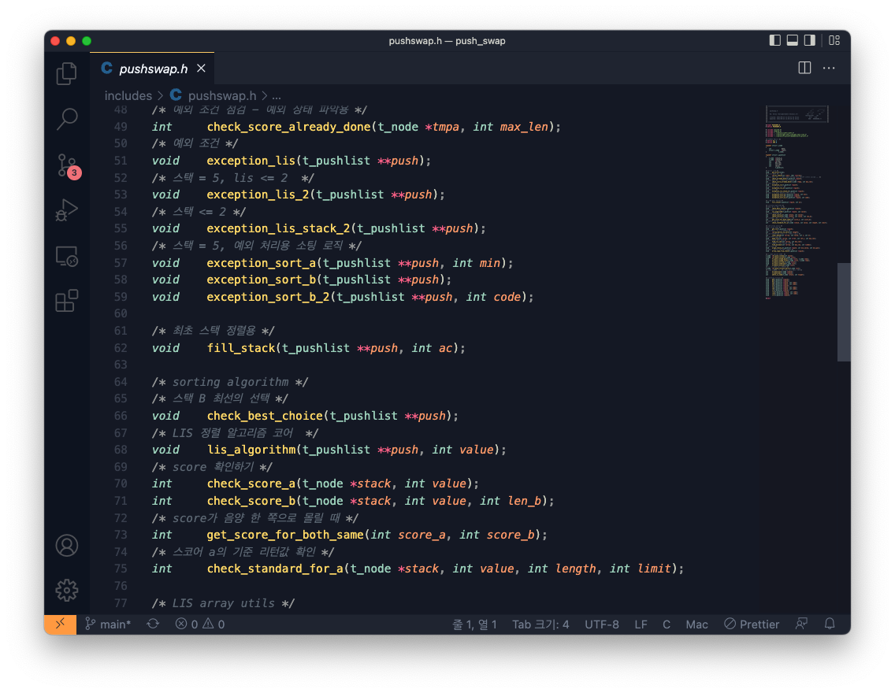
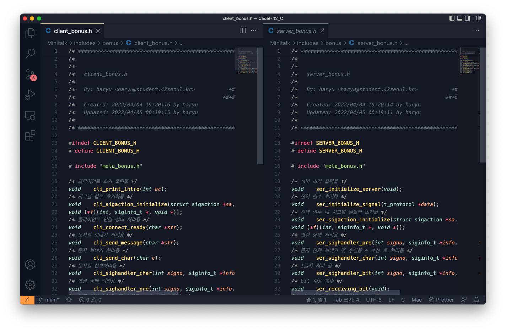
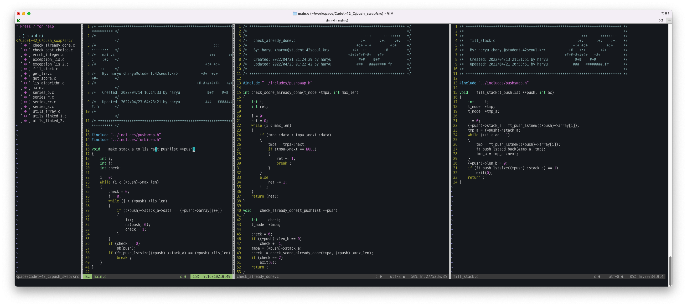
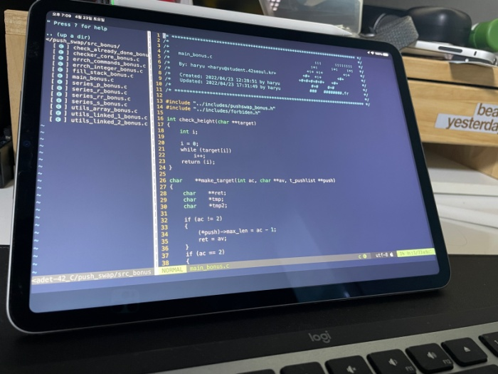

# Prologue

후... 모든 것을 마친 뒤의 만족감은 훌륭합니다.
별 일이 다 있었고, 아직 평가 전이긴 하지만 이 감정, 이 분노, 이 상황 그대로 정리하고자... 할 일은 좀 있지만, 글부터 적어 내려 가려고 합니다. 해당 내용이 다른 분들에게 얼마나 많은 도움이 될진 모르겠지만
우선, 어제 갑작스럽게 충격의 도가니에 빠졌다가 헤어나오는게 쉽지 않았습니다.

# Push Swap

사실 알고리즘에 대한 걱정은 생각보다 기우였습니다. 알고리즘 인강을 들으며 직접 기본기를 배우기 조금 먼저 시작했었고, 하나씩 정리하고 방식과 동작 원리를 이해하는 연습이 될 때마다 훨씬 폭 넓게 작동 기믹을 이해하기 시작했었고, 그 결실로 LIS 알고리즘으로 구현하는 방식을 해볼 수 있었고, 해당 방식은 상당히 인상적임과 동시에 내가 어떤 식으로 알고리즘을 이해하고 활용해야할 지에 대한 개괄적인 답변을 보여주었다고 생각합니다.

그렇기에 이 과제가 가진 매우 중요한 시사점. 학습을 계획하고 왜 굳이 이런 문제를 내게 되었는가? 도 생각해봅니다.

## LIS의 한계

우선 자신이 썻던 기술에 대한 반성입니다. LIS 알고리즘은 동적 알고리즘이고, 그렇기에 과정 자체가 그렇게 심플하진 않습니다. 로직을 정리하면 다음과 같습니다.

1. 스택에 원소들을 집어넣는다.
2. 스택의 순서 중 가장 작은 수를 맨 첫번째로 옮긴 뒤, 최장 증가 부분 수열(Longest Increasing Subsequence)을 구성합니다.
3. 스택 A에서 LIS에 포함되지 않는 것을 스택 B에 넣습니다.
4. 스택 B의 원소들에 대하여 포지션을 측정해, 가장 action이 덜 필요한 녀석을 선택하는 방식으로 스택 A로의 action이 가장 작은 것을 실행합니다.
5. 여전히 스택 B에 남아 있는 경우 포지션 재 측정 및 최선의 원소를 선택해 정렬을 실행합니다.

확실히 다른 알고리즘들에 비해 중간 과정을 구현하는 작업이 굉장히 쉽진 않았습니다. 고려할 것들을 함수화 하고, 이때 push_swap 과제가 요구하는 특성까지 고려하다보니 머리가 아픈 부분이 상당했습니다. 예를 들면 LIS 배열의 길이는 추정할 수 있지만, LIS에 스택 A로부터 정확한 원소들을 담은 배열을 만드는 것은 시간이 소요되었습니다. 이거 외에도 스택 구조를 갖고 있다보니, 처리 방식 자체에서 오는 부족한 자유도는 action의 사용을 제한해야 함에도 불필요한 action을 할 수 밖에 없도록 유도되었습니다.

그러다 보니 알게된 것, push swap 이란 과제를 위해 알아야 할 점들이 아래와 같습니다.

> 1. push swap 과제는 알고리즘을 요구하지만, 오히려 원소 1~5개 까지는 알고리즘을 사용하는게 아닌 **가장 최적의 루트**를 직접 찾아 진행하도록, 즉, **최솟값의 경우의 수를 활용해 정렬을 직접 실행하는 형태로 구현해야 했습니다.**
> 2. LIS 활용 시 각 원소(노드)를 옮기는 과정에서, **세밀한 구분점**을 두는 방식이 필요했고, 없이 간단한 구현으로 스택 A로 넣는다면 KO를 면치 못했습니다. 예를 들어 넣어야 할 값이 스택 A의 중간에서 아래 지점이라면 `rra`를 활용해 위치 전까지 넣을 수 있도록 값들을 거꾸로 끌어 올려야 했습니다. 이 반대인 경우 `ra`를 활용해, 최대한 회전을 맨 끝에서 맨 끝으로 진행하도록 만들지 않도록 노력했습니다.
> 3. 가장 실수하기 쉬운 것이, 링크드 리스트를 사용하는 경우 자료 값이 action으로 top 포인터가 바뀐다는 점이었습니다. 그렇기에, 아무 생각 없이 `tmpa` 라는 포인터 변수를 찍고, 그 뒤에 action을 실행하고, 내부를 검사하는 것과 같은 실수는 잘 티도 안나는데 당연히 심각한 문제를 불러 일으켰습니다.(ZeroPage unknown memory problem)
> 4. LIS 알고리즘을 활용할 경우, 확실하게 LIS 길이를 확보 할 수 있는가?의 영향을 정말 많이 받았습니다. 예를 들어 인자 5개가 들어오고, LIS 가 1 ~ 2개로 설정되는 순간 action 수가 엄청나게 올라갔고, 회전 방식의 정렬의 단점이 심각하게 두드러졌습니다. 평가 기준을 넘어 20회 수행 되는 등, 상당히 골아픈 상황이 나타났습니다. 그러다보니 (1) 인자 중 최솟값을 파악해서 맨 앞으로 끌어올린다. (2) LIS로 분리된 스택 B의 원소들의 입력 - 이후 스택 A의 위치 조정(ra, sa, rra)에서의 명확한 기준이 필요했습니다.

참... 제일 머리가 아팠던것은 역시 1번이었습니다. 짝수인 4, 6인 경우 기준 분할에서 정확히 중간 지점을 가를 수 있다보니, 오차 없이 진행이 되어 순수하게 LIS 로직으로도 충분했습니다. 그 이상의 숫자의 경우 LIS 의 진면목이 나왔습니다. LIS 배열이 많이 확보되는 만큼, 훨씬 똑똑하게 위로, 아래로 돌릴 지 판단이 되는 만큼, 아무 최적화 없이도 기준치를 확실히 지키면서 정렬을 성공했습니다. 하지만, 홀수 3, 5 인자의 경우 알고리즘으론 불가능한 LIS 확보 문제를 만나게 되었습니다. 더불어 회전하는 기준이 3의 경우 1, 5의 경우 2가 되다보니, 이 경우 LIS로 `ra` 또는 `rra`를 사용하는 데 있어 중간값에 가까운 원소를 스택 B에서 A로 옮길 시 ra, rra 어떤 걸 옮길 때 최적이 되기 보단 오히려 오차 범위로 비효율적으로 돌아가는 것을 확인할 수 있었습니다.

이런 점에서 LIS 알고리즘의 한계를 정리해보자면..

- LIS 알고리즘은 스택 구조에서 사용할 경우, 중간 중간 삽입을 필요로 하는 LIS 를 만들어냄으로 생각 보다는 비효율적일 수 있습니다. 특히 **오히려 원소가 적을 경우 이 오차는 상당히 커집니다.**
- 각 과정에서 가장 최선을 완벽하게 해서, 궁극적으론 가장 최선으로 결과를 내놓는다고 했지만, LIS 소팅이라고 한다면, **궁극적으론 스택 B의 원소를 넣은 후의 영향력까지 고려해야만 최선이 됩니다.** 즉, LIS 의 구조가 DP 라고 했지만, 실질적으로 결정적 순간엔 `그리디 알고리즘`과 과연 차이가 있는가? 에 대해 확실히 물음표가 뜨는 부분이었습니다. 거기다 오히려 그걸 위해 예상을 자료구조, 알고리즘을 병행해 가장 최선을 선택한다고 하면, 못할 것 같진 않지만 처리할 연산량의 증가는 불가피할 것으로 보입니다.

더불어 그럼에도 장점이 있긴 하냐? 라고 한다면 분명 장점은 있습니다.

- 원소의 개수가 많으면 많을수 록 점점 작업해야할 양은 줄어들게 되고, 이 경우 처리 할 작업이나, 이를 위한 코딩으로 인해 생길 자료 정렬 중의 불안한 구조가 매우 극적으로 감소됩니다. ~~알고리즘 뉴비라고 해야할 제가 짜놓고도, 한 방에 정돈 기준을 달성한다는 것만 봐도... 터지지 않는다고 괜히 어깨 으슥했는데, 걍 알고리즘 빨이었던 걸로...~~
- 중간 중간 비효율적인 부분에서의 선택일 분할 정복 방식을 활용하거나, LIS가 아닌 스택 B를 미리 정리하는 등의 작업을 추가한다면 생각보다 더 좋은 결과물로 만들 수 있어 보였습니다. (단, 너무 과하면 스택 A와 동시에 작업하는 액션(`ss`, `rr`, `rrr`)을 수행하지 못해, 비효율적일 순 있습니다.)

## push swap.. 그래서 이녀석은...

결국 push swap은 딱히 알고리즘을 위한 문제냐? 라는 생각은 안들었습니다. 정확히 말하자면, 알고리즘을 사용하긴 하지만, 결국 **공략에는 원소들의 배열 패턴에 대한 이해로 적은 원소는 요구되는 방식의 하드 코딩**을 해야 했으며, 그 이후부터 알고리즘으로 자동 정렬 메커니즘을 만든다는 수준에 가까웠습니다.

왜 어느 정도 실력이 되시는 분들이 해당 과제를 굉장히 싫어하시는 지 다소 이해가 가는 부분이 아니었나 생각해봅니다.

그러나 그럼에도 불구하고 해당 과제는 상당히 인상적이었습니다. 생각해보면 우리가 사용하는 프로그램에서 극한으로 속도를 내는 걸 추구하는 방향도 괜찮았겠지요. 그런데 이런 경우 코딩을 하는 상황에서 필요한 조건들을 남긴채 모두 제거합니다. 하지만 현실에서 실제 작업이 들어간다면, 그런 속도 보다도 더 큰 제약들이 분명 있을 겁니다. 그런걸 전체적으로 고려하는 능력, 그리고 동시에 알고리즘 같았음에도, 알고보면 패턴을 보고 정렬을 하는 등을 통해 알고리즘을 다소 비꼬아둔 과제였다는 생각이 매우 강렬하게 들었습니다. 놀라운건 그러다가 결국 알고리즘도 맛을 보았고, 더불어 스택에 사용 방식이나 원리는 더더욱 명확하게 이해됬다는 점에서, 42의 커리큘럼이 확실히 다른 무언가를 보고, 고민하고 있다는 것을 느낄 수 있었습니다.(~~다소 불친절 하긴 해도 말이죠...~~)

## 보너스는 어떻게?

필수 파트를 마무리 지으신 분들은 아마 바로 고려하실 것 같습니다. 저 역시 이것 저것 듣다가 알게 된 것이, gnl을 표준 입력으로 연결시켜두면 시그널로 <kbd>CTRL</kbd> + <kbd>D</kbd>를 보내기 전까진 문자열을 수용하고 있다는 사실이었습니다.

해당 기능을 활용하고, 직접 만드신 함수들을 역으로 이용하는 방식으로 하여 스택을 정리, 정리 된 상황을 점검. 이렇게 진행하시면 손쉽게 보너스는 돌파 하실 수 있으리라 생각됩니다.

# 이번 과제에서 실험적으로 사용했던 것들

1. 함수를 문장으로 작성해보기
   
   코딩 과정에서 숏코딩 만큼 중요한게 가독성이라고 생각했습니다. 그래서 핵심적인 단어들로 용도를 정리해보았습니다. 확실하게 좋은 점은 함수 명을 보면 바로바로 해당 기능에 대해 어느정도 연상이 가능하다는 점이고, 그러다보니 코드 리뷰 과정에서 이상한 점, 논리적 서순에서 이상하다고 느끼는 순간 당연하다는 듯 터지는 문제를 통해, 확실히 프로그램 전체에 대한 수행 과정과 이해도를 높일 수 있었습니다. 그러나 다소 아쉬운 점은, 통합된 관리가 되나? 라고 한다면 그렇진 않아 보였습니다.
   예를 들어
   
   이런 방식으로 진행한 경우 각 함수 명이 명확해지도록 프로그램 명, 핵심 단어로 구성되다보니 훨씬 간결한 가독성을 제공해준다고 생각했습니다. 결국 호불호의 영역이겠지만, 다음번 과제에선 좀더 깔끔한 정리, 이해도를 높일 정리가 필요해 보입니다.

2. 주석 반드시 달기
   완전 도움됩니다. 밤에 만들다 까먹었던 걸 다시 떠올리게 해주는 마법... 장황하지 않게 몇 자 적기는 계속해보려고 합니다.

3. vim을 IDE 처럼 써보기
   
   원래는 vim 아주 기초적으로 작성하고 있었습니다. 그러다가 `so long`을 기점으로 내용에 대해 내가 굳이 어렵게 외우거나 시간을 할애하는게 과연 올바른 학습인가? 하는 생각을 했습니다. 입시 컨설팅을 하던 당시에도 그랬습니다. 공부의 방법의 숙련이 부족한 경우 정도를 지키는 것, 어렵게 훈련하는게 맞았겠지만, 지금은 목표를 위해 '얼마나 능숙하게 도달하는가'가 핵심이며, 내 스스로 기본기를 무시하는 행동은 하지 않을 것이다 라는 생각을 했습니다. 그걸 위해 내 인지적 범주 내에서 코딩이 더 넓게, 빠르게, 효율적이게 되는것 같단 생각이 들어 VSC를 사용했었습니다.

   _이쁘긴합니다. 안 그런가요?_

   그러던 도중 ssh 구현을 심심풀이로 하다가, 확실히 이젠 맥북 안 들고 다니고, 아이패드 활용해보자! 란 생각이 들어 바로 다시 vim에 플러그인 설치와 함께 써보려고 했습니다....

   그러나 역시 괜히 vsc, vsc 그러는게 아니란 생각은 들었습니다. 작기도 하지만, 전체적인 몰입감이랄까, 멀티테스킹 적으론 별로라 임시용으로 vim을 IDE로 간단간단한 코딩을 해보지 않을까 생각이 듭니다. push swap을 작성하면서 생각났던거라 자세한 설명은 언젠가 따로 해보는 것으로 해보겠습니다 ㅎㅎ;;;

# 다음은?

5기 1차로 42서울을 들어와 드디어 대략 6개월 정도 시간이 흐른 것 같습니다. 생각보다 많은 과제들, 지레 겁먹었던 상황들이 있었으나, 그럼에도 여기까지 굉장히 나름 빠르게 도착한 것 같았습니다. 알고리즘, 기본기이자 코딩의 힘이 된다는 점은 여기서 정말 많이 느꼈으니, 꾸준히 알고리즘 학습 포스팅을 하면서 계속해서 이건 기본기를 쌓고, 드디어 대망의 통곡의 벽 1탄(1탄은 프엡이었지만 보너스를 안 했으니..) 미니쉘에 다가갈 것 같습니다. 열정을 또 불태워보는걸로 ㅎㅎㅎㅎ 😤

- **😎 push swap 과제 시리즈 😎**

[push swap 정복기(1)](https://paul2021-r.github.io/42%20seoul/push_swap/20220413_push_swap/)

[push swap 정복기(2)](https://paul2021-r.github.io/42%20seoul/push_swap/20220416_push_swap_2/)

[push swap 정복기(3)](https://paul2021-r.github.io/42%20seoul/push_swap/20220420_push_swap_3/)

[push swap 정복기(4)](https://paul2021-r.github.io/42%20seoul/push_swap/20220423_push_swap_4/)

```toc

```
