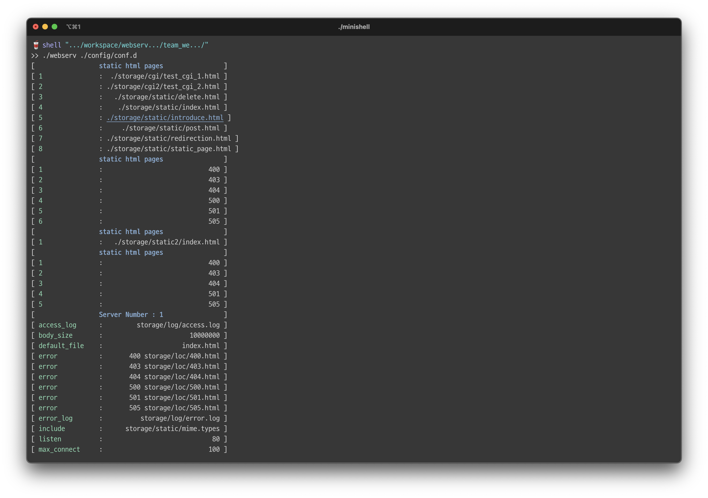

# Reminding : Webserv

## 'Webserv' = HTTP +  Web + nginx 

드디어, 정말로 놀랍게도 Coding의 C 도 모른다고 생각했던 류한솔은 42서울에서 가장 난이도 높은 과제 중 하나를 클리어 해냈다. 스스로도 대단히 감격스러운 순간이다. 😂 백앤드가 무엇인가를 배우거나, 아직 완벽히 준비된 것은 아니겠지만, 웹이란 것이 무얼 말하고, HTTP 통신이란 것이 무얼 원하는 것인가 등등... 정말 실질적으로 동작하는 서버를 구축했다는 점에서 내가 정말 무언가를 만들었구나- 라는 생각이 들었다. 이제는 정말 배우기만 하는게 아니라 스스로 만들어 낼 수 있다라는 확신이 드는 순간이 아닐까? 이제 앞으로 딱 두 과제, 두 과제만 해결한다면 나는 42서울의 공통과정을 마치고 개발자로서 취업도, 또 다른 도전도 가능해진다. 나의 마지막 도전이 정말 제대로 시작되는 것 같아 대단히 감격스럽고, 뜻 깊다. 

처음 웹 서브를 도전하게 되었을 때, 정말 막연한 두려움이 내 앞을 가로 막았다. C, C++ 을 적당히 할 줄 알았지만 그것이 실제 현실에서 필요한 혹은 사용 가능한 도구를 구현해낸다- 와 전혀 연결 짓지 못하던 1년의 시간을 거쳤는데, 나는 아직 부족하고, 나는 아직 배울게 많다고 생각이 드는데 여기까지 왔다니 겁이 덜컥 났다. 과연 나는 많은 사람들이 고통으로 몸부림친(?) 일을 해낼 수 있을까. 

그리고 결론적으로 정리하면, 결국 해냈다. 이 얼마나 기쁜 일인지. 그리고 여기엔 참 여러 일들이 있었다. 다사다난이라는 말이 나를 위한 말이라고 이번 프로젝트를 진행하면서 느꼈다. 그리고 동시에 `다사다난`이라는 말이 가지는 의미는 곧 '성장'이라는 사실을 아는 만큼, 글로 남기겠다고, 누군가에겐 유익한 후기가 될 수 있기를 기원하면서 글을 써보고자 한다. 

webserv, 이하 웹서브라는 과제는 어떤 과제일까? 나는 어떤 점에서 고민을 했고, 어떤 어려움을 겪었고, 어떤 점을 고려한 설계를 진행했고, 어떤 점은 잘 했으며, 어떤 점은 아쉬웠을까. 본 글들은(아마도 쪼갤것 같다) 이러한 점을 정리하는 글이 될 것이다. 

### Webserv 는 한 마디로...




웹 서브는 한 마디로 이를 정리하자면 'nginx의 마이너 버전 서버'를 구현하는 프로젝트이다. HTTP /1.1을 지키며, 소켓 통신이라는 컴퓨터가 할 수 있는 다양한 네트워킹 방법 중 하나를 선택해, 대화하는 양식을 지키고 해석하게 만드는 프로그램을 만든다. 그리고 거기서 클라이언트가 요구하는 것을 파악하고, 파악한 상태에서 요구하는 문서를 제공함으로써 정적 페이지를 정상적으로 제공할 수 있는 서버. WAS 역할이면서도 프록시 서버를 구현하는 것을 목표로 하는 그런 프로젝트. 사실 다소 생소할 수 있고, 그렇기에 어디서부터 접근해야 하는지 감이 오지 않을 수 있다. 그런 점을 풀어서 쓰는 챕터가 이번 챕터라고 보면 될 것이다. 

### 프로젝트 요구사항은? 

해당 프로젝트의 서브젝트를 읽고 정리하면 다음과 같은 내용들을 지키도록 요구한다. 

- 우선 Configuration file을 취하며, 기본 path 상에서 이를 읽어서 설정을 로두해야 한다. 
- 서버 내부는 '단일 프로세스, 단일 스레드'로 동작해야 한다. 
- 서버는 block이 되지 말아야 하며, non-blocking 이 구현된 입출력 작업이 되어야 하고, poll 혹은 그와 동등한 역할을 하는 함수들을 거쳐서 동작해야 한다. 
- 읽기 쓰기 연산 후에는 errno의 값을 검사하거나 하는 것은 엄격하게 금지된다. 
- 설정 파일을 읽기 전에 읽기에서는(서버 부팅 시) poll()이나 그와 동등한 것은 사용할 필요 없다. 
- select()를 사용시 매크로 사용은 허가 된다. 
- 서버의 요청은 결코 멈추거나 크래시가 나선 안된다. 
- 프로젝트에서 직접 지정한 웹브라우저에 최적화되어 있어야 한다. 
- HTTP/ 1.1 에 대응 되어야 하며, NGINX 헤더들과 비교하고 행동을 답하면 된다. 
- HTTP의 리스폰스 상태 코드는 정확하고, 제공되며, 서버는 기본 에러 페이지를 갖고 있어야 한다. 
- CGI를 구현하고, 이 경우에 한해 fork() 를 허가한다. 
- 반드시 정적 웹 사이트를 완벽하게 제공할 수 있어야 한다. 
- 더불어 최소한 구현에서 GET, POST, DELETE 메소드를 지원해야 한다. 
- siege를 활용한 부하 테스트를 통해 기본 부하 테스트 시 가용성 99.5% 이상이 나와야 한다.
- 프로젝트로 구현된 서버는 반드시 멀티 포트 멀티 서버를 listen 하는 것이 가능해야 한다. 

일단 개괄적인 사항만 정리해도 이만큼이다(...). 추가적으로 configuration file 파트와 보너스 구현은 다음 룰들을 지키도록 요구한다. 

- 각 서버의 호스트, 포트가 존재해야 한다. 
- 서버 명(server_name)은 설정하거나 설정하지 않을 수 있다. 
- default 에러 페이지를 설정하라
- client의 바디 사이즈를 제한하라. 
- 하나 혹은 복수의 룰을 설정하는 루트를 지정하라(location) 
	- 각 루트 별 허용되는 HTTP 메소드를 정의한다. 
	- 리다이렉션을 정의한다. 
	- 파일의 기본 저장 루트 혹은 디렉토리를 지정하라. 
	- 디렉토리 리스닝을 켜거나 끌 수 있다. 
	- 특정 파일 확장자를 기반한 CGI가 실행될 수 있어야 한다. 
	- 업로드 파일을 받을 수 있는 경로를 지정하고 구성한다. 
- chunked 요청이 들어오게 되면, 이에 대해 unchunked 형태로 다시 서버가 바꿀 수 있어야 한다. 그리고 CGI의 본문의 끝은 EOF 가 올 것이다. 
- CGI의 출력을 위해, content_length가 CGI로부터 반환되지 않으면 EOF는 반환된 데이터의 끝으로 EOF를 활용한다. 
- 당신의 프로그램은 CGI를 호출할 때 첫 인자로 요청된 파일과 함께 호출한다. 
- CGI는 파일 엑세스를 위한 상대 경로를 통해 정확하게 동작한다. 
- 당신의 서버는 하나의 CGI가 작동해야 한다(php든, python이든)
- 서버는 반드시 죽지 말아야 한다. 

보너스 파트의 요구사항은 다음과 같다. 
- 쿠키, 세션 관리를 지원한다. 
- 멀티플 CGI를 처리하라. 

정말 많은 걸 요구한다. 지금 생각해보면 유사하긴 하나 완벽하게 여기에 부합할 수 있는지... 다소 의문이 드는 부분도 있긴 하다. 하지만 어쨌든 이렇듯 구현해야할 내용들을 보면 결국 우리가 만들 웹서브의 역할을 다음과 같이 정리할수 있다고 본다. 

1. NGINX 가 그러하듯, 정적 페이지에 대한 옵션들을 담아두는 config 파일을 기획하고, 구성하고, 서버를 설계해라. 
2. 설정 파일을 파싱하고, 클라이언트의 요청에 각 기능이 동작하거나, 요청하지 않은 내용이 왔을 때 적절하게 에러를 띄워주는 로직을 구성하라. 
3. CGI와 같은 부가 기능들을 CGI의 요구사항에 맞춰 구현하고, chunked 인코딩을 비롯한 추가 구현사항을 구현하라. 서버에서 갖춰야 하는 기본적인 기능들 (멀티 포트, 멀티 서버 등)을 구현하라. 

사실 3줄로 요약한다는게 과연 맞나? 싶을 정도로 내부에 담긴 내용들은 많다. 하지만 기본적으로 내가 스터디를 하거나 팀 프로젝트 진행과정에서 중점을 둔 부분은 이 정도라고 보면 될 것 같다. 더불어 내가 설계를 하던 당시의 중요하게 생각한 부분은 다음과 같다. 

1. 웹 서버에게 '에러'라는 말은 '에러'가 아니라 '상태'이다. 
2. 웹 서버는 I/O Multiplexing 을 통해 작업의 '단계'를 나누며, '순환적' 형태를 띄도록 로직이 짜여져야 한다. 
3. 구현에 필요한 조건들을 명확히하고 필요한 적정 수준을 지정해 구현하자. 
4. config 파일의 완성도와 로직과의 결합성이 중요하다. 
5. 성능 최적화를 신경쓰자(IO 입출력)

앞으로 몇 화에 걸쳐 내용을 정리하고, 글을 써보고자 한다. 내용에 부족함이나 잘못된 부분이 있다면 과감히 지적 부탁드린다.


```toc

```
