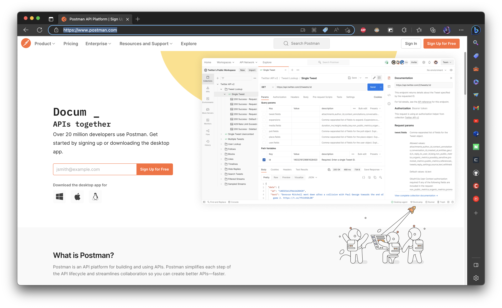

# Reminding : Webserv

## Key of Webserv 

웹 서브의 핵심은 `비동기 비봉쇄 방식의 입출력 다중화` 이다. 정말 말이 길지만 이를 풀어가면서 웹서브의 역할과 로직에 대해서 정리해보고자 한다. 

### 비동기(Asynchronous)

보통 통신, 혹은 어떤 객체와 객체 간의 통신을 떠올리면 우리는 자연스럽게 로직을 이렇게 생각할 수 있다. A라는 쪽에서 B에게 무언가를 전달하면, 전달받은 것에 대해 B 는 다시 A를 향해 대응하는 내용을 담아 전달을 한다. 이러한 방식은 `request`에 대한 `response` 가 명확하게 예상되며, 이를 통해 요청하는 상황에서 얻을 답을 바로 받을 수 있다는 확신을 가지는 소통 방식이라 할 수 있다. 

컴퓨터적으로 보았을 때 이러한 통신의 루틴은 아주 통상적인 방식에 가깝다. 예를 들어 read() 함수를 떠올려보자. 표준 입력으로 해당 함수를 호출하게 되면, 해당 함수는 EOF 를 만나기 전까지 계속 기다리며 사용자의 표준 입력을 기다린다. 그리곤 기다리던 과정에서 원하는 요청(데이터)이 들어오면, 이에 맞춰 반응을 해주니 우리는 즉각적으로 어떤 행위에 대한 '결과'를 바로 예상이 가능하다. 

하지만 이런 방식은 많은 CS 서적에서 이야기 하듯 장점만 있는 것은 아니다.

1. 동기식은 input 과 output이 연결되어야 하는 만큼 컴퓨터는 input 을 항상 대기하고 있어야 한다. (컴퓨터 자원의 낭비가 발생한다.)
2. 만약 input 이 한꺼번에 들어오거나, 지속적으로 들어오게 되는 경우, 적절한 조치를 하지 않으면 뒤의 input이 계속 대기 상태에 빠지거나, 해당 요청이 소멸될 수 있다. 
3. 2번과 같은 경우 때문에 빠른 대응이 가능한 동기식은 반대로 빠르지 못한 대응이 될 수가 있다. (100번째 요청은 100번째 처리로 결과를 받아본다.)


자 그러면 여기서 비동기라는 녀석이 등장하게 된다. 비동기는 말그대로 동기가 아닌 것이다. 즉, 요청과 대답이 완벽히 1:1 로 매칭되어서 처리되는 구조가 아니다. 

예를 들면, 요청으로 어떤 파일을 요구하는 것이 N 번 들어왔다고 하자. 이때 N 번의 요청을 받는 과정에서도 하드웨어의 자원이 가능하다면, 중간 중간의 짧은 찰나에도 요청 일부를 처리한다. 뿐만 아니라 항상 감시하거나 할 필요도 없이, 커넥션을 받을 창구 앞에서 주기적으로 체크하여 들어오는 요청들을 정리하여 한번에 가져오면 그만이다. 또 동시에 여러 작업이 들어오고, 요청 중에 사용자 프로그램이 기다려야 하는 순간이 온다면, 기꺼이 해당 일은 OS에게 맞겨놓고 프로그램은 다른 작업을 해볼 수도 있다. 

그렇다면 비동기의 장점, 단점을 정리하면 다음처럼 정리할 수 있다. 

1. 장점 
	1. 시스템이 항상 감시를 하고, 바로 대응하는 구조를 갖추지 않아도 되므로 하드웨어의 자원 낭비를 줄일 수 있다. 
	2. OS 단에서 처리해야하는 작업에 대해 기다리지 않고(비봉쇄), 해당 작업은 진행 되도록 둔 채로, 하지 못한 다른 작업을 수행할 수 있어, 대기 시간이 최소화된다. 
	3. 위의 특성으로 인해 여러가지 일을 동시에 처리할 수 있고, 결론적으로 비교적 첫 input과 이후 input들 모두 빠른 시간 내에 처리가 되어 마치 동시에 처리한 듯한 효과를 보여준다. 
2. 단점 
	1. input 과 output 이라고 이야기 했지만, 결국 이벤트(event)라는 형태로 불린다. 그런데 이때 이벤트들을 감시하는 과정이 필요하다보니, 들어오는 것에 바로 대응하는 구조보다 감시라는 단계가 또 추가로 생긴다고도 볼 수 있다. 
	2. 기존의 컴퓨터 시스템 체계에서 가지고 있는 봉쇄 구조 및 인터럽트식 작동원리와는 맞지 않은 방식으로 동작해야 하며, 이 경우 작업의 처리가 복잡해지는 것 뿐만 아니라, 처리의 진행이 정상적으로 되지 않는 경우가 발생할 수 있다. 입출력 시스템콜들이 특히 그러한데, 대용량 처리, 하드웨어 상황에 따라서 입출력 요청이 정상 처리가 뒤에서 제대로 되지 않을 수 있고, 이 경우 대기시간이 도리어 늘어날 수 있다. 
	3. 각 작업을 '병렬적'으로 처리하고, 이벤트 내부에서도 세부적으로 단계가 나눠지게 되다보니, 각 작업이 동시적으로 처리되는 과정 속에서 개발자는 디버깅하기 매우 까다롭다. 

비동기식은 장점만 가진 완벽한 접근 법은 아니다. 하지만 서버를 구현하는데 있어서 동기와 비동기의 차이를 이해하는 것, 그리고 그 차이 속에서 각 상황에 적절한 디자인 철학을 따라가는 것은 적절한 서비스의 서버 구현에 있어 필수라고 볼 수 있겠다. 

동시에 비동기 내용을 보면 이런 내용이 눈에 뜨일 것이다. 

> "OS 단에서 처리해야하는 작업에 대해 기다리지 않고(비봉쇄), 해당 작업은 진행 되도록 둔 채로, 하지 못한 다른 작업을 수행할 수 있어, 대기 시간이 최소화된다."

비봉쇄, 이제는 비봉쇄라는 키워드를 먼저 정리해보자. 

### 비봉쇄(NON-Blocking)

컴퓨터에서 가장 느린 부분은 어디인가? 컴퓨터를 배우기 시작하고 처음으로 우리가 맞닥뜨리는 가장 '느린' 부분이라는 영역은 보통 시스템콜 함수들이다. read, write, recv, send 등을 포함해 특히나 입출력을 관장하고, 하물며 파일에 입출력이 들어가는 경우는 항상 '느리다'고 배웠다. 

사실 얼마나 느린가? 라고 이야기를 한다면, 좀 막연하다. 컴퓨터 사이언스의 기초를 배우고, 파일 시스템을 배우고 저널링을 비롯한 컴퓨터 체계의 보조 저장장치의 체계를 배우게 되면 그제서야 파일 입출력이 CPU 대비 얼마나 느리고, 느리면서도 안정성을 위해 성능을 손해보면서까지 로직을 집어넣고 하는지를 배우게 된다. 

이러한 저장장치의 특성 때문에 기본적으로 우리가 사용하는 입출력의 시스템 콜 함수는 기본적으로  blocking(봉쇄) 방식으로 동작한다. 

사실, 이 방식으로 시스템이 구축되어 있는 것은 단순한 완료를 위해 대기하는 것을 의미하지는 않는다. 엄밀히 따지면 봉쇄 됨은 시스템 보안 측면에서 유리하며, 프로그램에게 실질적인 권한을 제거하여 OS가 시스템 전체를 제어하도록 만드는 역할을 하기도 한다. 뿐만 아니라 보조기억장치의 원자성을 통해 사용자 수준의 프로그램이 일으킬 수 있는 Data 오염 문제와 같은 동시성(concurrency)문제를 제어하는 역할을 하기도 한다. 

하지만 굳이, 웹서브와 관련된 부분으로 제한하여 설명을 하면 다음과 같다. IO 입출력은 느리고, 이 느린 작업이 완료되도록 기다리는 것은 동기식 방법 속에서도 완벽한 1:1 대응형으로 접근하는 것에 가장 자연스럽게 연결되는 형태다. 

> 사실 엄밀히 말하면, 두 특성이 경우의 수처럼 다양한 형태를 입출력 방식, 서버이 작동방식을 결정한다. 

하지만 위에서 정리한 것을 떠올려보자. 비동기 방식은 서로 다른 작업들 중에 지금 처리 가능한 것들을 빠르게, 부분적으로, 병렬적으로 처리하는걸 목표로 삼는다. 그럼 한번 그 과정에서 index.html 문서를 클라이언트가 요청했다고 생각해보자. 그리고 우리는 파일을 open() 한 뒤, 받은 FD를 통해 read() 를 수행해 10만 바이트의 문서를 읽었다고 생각해보자. 만약 봉쇄형으로 파일을 로드했다면? 

당연한 말이지만, 해당 이벤트, 해당 read()가 끝날 때까지 비동기식 서버는 '멈추고' 만다. 

즉, 비동기식 서버를 구현한다고 할 때, 비봉쇄형으로 처리되는 구조를 짜지 않는 것은 비동기형이 가질 장점들을 모두 죽여버리고, 겉으로 보기엔 비동기지만, 결국 동기식으로 동작하는 꼴을 만들게 된다. 결국 '비봉쇄- 비동기' 이 두 키워드는 서로 연결될 때 비로소 완벽한 비동기식 처리, 비봉쇄 처리가 되는 것이다.

우리가 원하는 키워드, '비동기식', '병렬 처리', '다중 처리'와 같은 키워드를 달성하기 위해선 두 짝이 반드시 필요한 것이다. 


여기 보면 입출력에 대한 모델링이 존재한다. 여기서 비봉쇄와 비동기 두가지가 개별로 표현되어 있는데, 핵심을 아주 잘 나타낸 그림이라고 생각한다. 

결국 정리하면 비봉쇄는 비동기식이 비동기식으로 있기 위해 필요한 조건 중에 하나다. 구현은 어떻게되어있는가? 이는 간단하다. 원래 사용자 프로그램은 입출력이 발생하게 되면, 인터럽트를 발동시키고, 발동된 인터럽트에 대해 OS가 가진 인터럽트 테이블 속 해당하는 handler가 실행된다. 실행되고 나면 운영체제가 시스템 권한을 가지게 되고 들어오는 요청에 대해 커널이 `권한모드`를 통해 해당 작업을 처리하고 다시 사용자 프로그램에게 시스템 제어권을 제공하면서, 연산을 이어가도록 한다. 이렇게 되면 결국 커널이 완료를 해서 확실하게 끝날 때까지 사용자 프로그램의 프로세스는 계속 대기 상태가 되는 것이다. 

이때 비봉쇄 옵션이 켜지게 되면 커널은 다음처럼 작동한다. 

1. 인터럽트가 발생하지 않는다.
2. 커널은 자기에게 부여된 일을 진행한다. 
3. 사용자 프로그램은 멈추지 않았기 때문에 다음 작업이 바로 시작된다.
4. ???? 

코드를 통해 예시를 들어보자.

```cpp
// GET METHOD
size_t read_ret = read(file_fd, response->entity_, response->entity_length_);

if (read_ret == (size_t)-1 || read_ret) {
	for (idx = 0; (idx < read_ret) && (idx < response->entity_length_); idx++) {
		work->GetVec().push_back(response->entity_[idx]);
	}
	if (work->GetVec().size() != response->entity_length_) {
		return;
	}
}
```

본 코드는 실제 우리 팀의 GET 메서드의 일반 읽기 파트를 보여준다. 여기서는 요청받은 location 혹은 요청받은 파일을 전달하기 위한 read 파트이다. 그리고 여기의 앞에서는 fd를 받아오면서 NON-BLOCK으로 설정을 해서 OPEN을 진행한다. 

read()를 하게 되면, 커널은 해당 작업을 처리를 아주 짧은 시간 진행한다. 하물며 이것이 완료되지 못해도 좋다. 커널은 에러를 뿜기는 커녕 읽다가 못읽으면 이를 return 값으로 전달하거나 -1을 반환한다. 

하지만 비봉쇄 프로그램 입장에선 상관 없다. 그저 작은 일이 다소 지연된 것 뿐이다. 그렇기 때문에 읽어야 할 사이즈를 완벽하게 읽지 못했다면, 이때는 조건에 맞춰 재 읽기를 반복 호출하거나, 위에처럼 return 을 하고 다시 이벤트 감지 함수(poll, kevent)로 돌아간 뒤 남은 작업을 다시 도전한다. 위에 이미지 그대로 check하는 절차를 무한히 반복할 뿐인 것이다. 

### Robust IO 

본래 해당 개념은 입출력에 대해 결과가 명확하지 않을때, 완벽한 읽기와 쓰기를 위해 고려된 방식을 의미한다. 따라서 비봉쇄와 연결성이 있는 것은 아니다. 하지만 나는 이 개념이 비동기 비봉쇄 식 프로그래밍에선 꼭 이해하고 넘어갔으면 한다. 

자, 아까까지 비동기와 비봉쇄를 배웠다. 두 가지 개념이 합쳐지면 어떤 일이 벌어질까? 시스템에서 파일 입출력이라는 아주 느린 작업을 진행하면서도, 커널은 이를 하는 과정에서 사용자 프로그램을 막지 않는다. 사용자 프로그램은 그저 다 읽거나 쓰기만 하면 되지만, 과도하게 큰 사이즈의 입출력 시스템 콜이 있을 때는 결국 커널도 다 읽지 못하고, 이에 대해 사용자 프로그램에게 return 값으로 이를 알린다. 

뿐만 아니라 서버를 생각해보면서도 그렇다. client가 어떤 특정 데이터를 보내는데, 회선에 문제가 있다거나, 시스템 사양이 매우 좋지 않아서 데이터를 보내다가 덜 보내고, 다시 보내는 경우도 고려해볼 수 있다. 

이런 경우 시스템 입출력 함수는 어떻게 해야 하는가? 핵심은 '끝'이라는 표식이든, 결과든, 나올 때까지 읽거나 쓰기를 반복하는 것이다. 여기서 완벽한 읽기와 쓰기를 제공한다는 개념으로 Robust IO 라는 개념이 존재하는데, webserv에서는 이를 구현하여 읽고, 쓰는 곳마다 탑재하는 것이 핵심 중에 핵심이라고 할 수 있다. 

### HTTP 


상당히 돌고 돌아서 왔다. 따지고보면 비동기 비봉쇄도, 결국 소통을 위한 도구다. 그리고 실제 소통을 하는 것은 컴퓨터 클라이언트와 컴퓨터 서버일 것이다. 그렇다면 소통의 방식은 무엇일까? 그것이 바로 HTTP 이다. 

HTTP는 HyperText Transfer Protocol의 약자로, OSI 7 계층에서 어플리케이션 수준의 레이어에서의 hypermedia라고 규정되는 것들을 전송하기 위한 일종의 메시지 형태이다. 여기서 클라이언트는 `Request`라고 부르며, 서버가 보내는 대답은 `Response`라고 부른다. 해당 방식은 결국 문서라는 측면을 위해서 개발된 규약으로써, 시작줄-헤더-본문 이라는 구성을 갖고 있다. 

각 상황에 맞춰 요청을 하거나, 여러가지 기능들을 하며 이에 대한 해석은 서버가 header를 비롯해 내용들 전체를 통해 해석하게 된다. 이에 대해선 개인적으로 `HTTP 완전정복` 이라는 교제의 chapter 5까지 확실하게 읽고 진행하기를 추천한다. 

시작줄에 있어야 할 것들, 각 HTTP 버전마다 가지는 특징들, 헤더들을 통해 얻을수 있는 브라우저의 반응 등등... 설명할 것들이 워낙 많고, 내용이 방대하다. 개인적으로 HTTP RFC를 공부하라고 되어 있긴 하지만, RFC 부터 보는 것은 비추천한다. 왜냐하면 수평적으로 각 기능들을 설명하고, 각 기능의 의미나 필요한 이유 등은 어느정도 배제되어 있다. 즉, '그런 갑다' 하고 넘어가는 경우가 파다해서, 서버가 무엇을 해석하고, 서버에서 어떤 걸 필요로 하는지에 대해 파악하기가 쉽지 않다. 

하물며 개발 과정에서 맞닥뜨린 문제점으로 다음과 같은 문제들이 있었다. 

1. HTTP /1.1 기반의 표준안 이라고 하는 것은 정말 '표준'일 뿐이다. 
2. 웹 브라우저는 해당 표준을 준수하는 존재가 아니다. 자기식의 방법으로 이를 해결할 뿐이며, 이것을 개선하기 위해선 javascript 등을 통해 전달되는 요청사항을 직접 수정해주는 작업이 필요하다.
3. 더불어 서버는 모든 헤더를 해석할 필요는 없다. 헤더들이 있고, 이를 다 해석하거나 고려해야 할 거라 생각할 수 있는데, 결국 서비스의 크기나 서비스의 반경 내에서 필요한 정보만을 요청하거나 보내면 된다. 이를 고려하지 않으면 정말 뭐든 다 만들어야 할 것같다(...) 
4. 표준이라고 했지만 이를 구현하는 언어로 기본적으로 프로젝트에선 HTML, javascript만 활용한다. 그런데 그런 HTML과 javascript도 혼자서는 한계가 있다. 예를 들면 HTML에서 `<form>` 태그를 활용해서 메서드 요청을 서버로 보낼 수 있다. 이때 `<form>`은 오로지 GET, POST만 보낼 수 있다. 프로젝트를 위한 DELETE 메서드의 경우 넣어도 GET으로 바뀐다. 
5. 이 부분은 아주 미묘한 영역이고, 42 한정인데, 42서울의 현재 개발 시스템 환경은 Mac 기반이다. iMac의 환경에서 크롬, 엣지, 사파리 모두 내부 엔진은 사파리의 webkit을 써서 더더욱 표준안을 지키기 매우 어려운 개발환경이다. 

결론적으로, HTTP 버전을 유지하기 위해, 브라우저에 최적화를 위해서 위와 같은 특이한 점들을 감안하고, 테스트하면서 프로젝트에 임할 수 밖에 없었다. 오히려 1.1 기반으로 하고 싶다면 curl 이나 telnet 등을 활용하거나 postman과 같은 디버깅 도구를 활용해 메시지를 보내보는 것이 현명하다. 


> postman 홈 페이지

### nginx, 서버란? 

해당 프로젝트에서는 대놓고 nginx를 참고하라고 이야기 한다. 뿐만 아니라 42 과정의 공통 과정 중 마지막 서비스 제작의 6서클을 제외한 마지막 5서클에서는 아예 nginx를 실제 docker에 올리고, wordpress 페이지를 deploy 하는 과제도 존재한다. 그만큼 42 과정에서나, 실제 웹 서비스를 구현하다보면 nginx라는 키워드가 주변을 날아다닌다. nginx가 뭘까? 

nginx에 대한 설명을 정리하면 다음과 같다. nginx는 웹 서비스의 구축을 도와주는 소프트웨어이다. 기존에 아파치의 tomcat과 같은 서버 프로그램도 존재한다. 스레드/ 프로세스 기반의 요청 처리 방식의 서버인데, 과거에는 해당 방식의 서버를 통해 웹 서비스가 전파 되었다. 

하지만 이러한 방식은 많은 요청에 따라 무거워지고, 성능적 손해를 보았고, 비동기 비봉쇄에 이벤트 기반으로 요청을 처리하는 '싱글 프로세스/ 스레드' 기반의 프로그램이 바로 NGINX 이다. 

그렇기에 NGINX는 무겁지 않으며, 다중 요청을 효과적으로 처리할 수 있는 프로그램으로 정적 사이트의 서버 역할을 하거나, 리버스 프록시의 역할, 그 외에도 로드 밸런식의 역할을 하기도 한다. 이러한 장점 때문에 최초 러시아에서 개발된 이후 오픈소스화 하여 현재는 미국 오픈소스 재단에서  해당 프로그램을 관리하는 것으로 나오고 있다. 

그렇다면 이러한 nginx 보다 더 앞선 개념으로 서버란 무엇일까?

서버는 초창기부터 HTML이나 마크업 방식으로 작성된 문서를 보내주기 위한 시스템이었다. HTTP 프로토콜만 봐도 처음 해당 프로토콜을 기획하고, 작성한 것 역시 문서를 보여주기위한 시스템의 일환이었다. 

하지만 점점 인터넷, 네트워크의 발달과 단순 공적 목적이나, 군사목적 등이 아닌 사적 목적, 다양한 정보의 공유 등의 기능들이 부가 되면서 SPA(single Page Application)의 개념으로 확장되면서 서버는 매우 다양한 형태를 가지게 되었다. 

그리고 이런 서버들은 위에서 이야기한 HTTP라는 소통 수단을 가지고 Requst를 해석하고, 그 Request에 맞는 데이터를 Response해준다. 이 대목에서, 서버는 다양한 형태를 가지게 되는데, 그 중에서 정적인 데이터나, 헤더 중 필요한 영역만 빠르게 해석하고 본 서버에 전달해주는 식으로 서버를 돕는 역할을 하는 등의 기능들이 포함된 것이 바로 nginx라는 것이다. 

이 외에 추가로 서버의 구현이나 구성과 관련된 내용들은 꼭 HTTP 완전정복의 5 chapter를 읽기 바란다. 

### 주요 함수들 

마지막으로 이 내용이다. 소켓프로그래밍을 위해선 정말 가장 간단한 몇 가지 함수로부터 시작한다는 것을 C를 배운사람들은 알 것이다. 


> 정말 유명한 사진이다. 

기본적으로 서버는 socket을 활성화한다. 그리고 이를 포트 설정을 넣은 구조체를 통해 연결시키는 작업(bind)을 진행한다. 그 뒤에 활성화가 되면 listen을 진행하는데, 여기서 읽을 것, 정확히는 `이벤트`가 발생하게 되면 서버 소켓에 할당된 FD를 통해 accept를 하게 되고, 이로써 클라이언트와 서버 간에 연결된 FD값을 가지게 되며, 이후 HTTP 소통을 하고 다 쓰고 나면 해당 FD 를 close 해준다. 

여기까지는 그렇게 어렵거나 특별한게 있지는 않다. 하지만 여기서 우리에게 제공되는 다른 함수들 몇 가지는 상당히 독특한 특성과, webserv 구현에 필수적이게 된다. 

```c
// select 
int select(int nfds, fd_set *restrict readfds, fd_set *rest
rict writefds, fd_set *restrict errorfds, struct timeval *restrict
 timeout);

// poll
int poll(struct pollfd fds[], nfds_t nfds, int timeout);

// kevent 
int kevent(int kq, const struct kevent *changelist, int nch
anges, struct kevent *eventlist, int nevents, const struct timespec *timeout);
```

프로젝트에 사용 가능한 다른 많은 함수들이 있지만 해당 내용은 찾아보면 된다. 핵심만 전달하고자 한다. 위 함수들은 아주 기본적인 이벤트 감지 및 비동기 비봉쇄형 서버 프로그램을 만드는 핵심 함수들이다. 

- select() 함수 : 싱글스레드에서 입출력 다중화를 하고, 여러 FD들을 설정해놓고 이를 순회하며 감시하고, 이벤트 발생한 FD 들을 모아서 처리를 진행하는 방식이다. 
	- select의 단점
		-   감시하고자 하는 이벤트 설정을 변형하기 때문에 매번 이벤트 비트를 새로 설정해야 한다.
		-   fd를 하나하나 체크해야헤서 O(n)의 계산이 들어간다. 즉, 관리하는 fd의 수가 증가하면 증가 할 수록 프로그램의 성능, 반응성이 떨어지게 된다. 뿐만 아니라 메모리 사용량 조차 증가한다. 
		-   fd 길이에 제한이 있음
- poll() 함수 : select와 유사한 형태지만, select의 단점을 개선하고 관심있는 fd만 넘겨 주며, 감시하는 이벤트도 보전되는 형태의 함수다. 
	- poll의 단점 : 
		- 하나의 이벤트 전송을 위해 64비트 전송을 해야 한다. 
		- 여전히 감시하는 모든 fd에 대해 루프를 돌면서 이벤트 발생을 탐색한다. 즉, select가 가지는 최대 단점을 극복하진 못했다. 
- kevent()/ kqueue() 함수 : FreeBSD 커널의 환경에서 사용이 가능한 기법이다. 위의 두 함수와 기본 기능은 동일하다. 단 kernel에 event를 저장할 queue(줄)을 생성하고 여기에 쌓이도록 했다. 사용자가 직접 polling(감시)를 지정하는 방식이므로 FD를 순회하면서 찾을 작업이 필요없다. 
	- 따라서 성능면에서 좋으며, 이는 FreeBSD 환경이 아닌 리눅스 환경의 epoll이라고 할 수 있다. 

아주 간단하게 핵심만 정리했다. 사용 용례나, 사용 예시 코드는 chatGPT만 찾아봐도 수두룩 하며, 다른 42서울 caddet의 정리글들을 보면 바람직할 것이다. 

우리 팀의 경우 kevent를 활용했다. 외국의 경우 mac 환경이 아닌 것도 있다보니 42 프로젝트에서 select나 poll, epoll 등 다양한 함수를 활용한 예시들이 있다. 더불어 맥 외의 환경에서도 돌아가는 서버를 구축하길 원한다면 select나 poll을 쓰는게 맞으며, 리눅스 환경만을 고려한다면 epoll도 대안이 된다. 여기서 그러면 이런 생각이 들 것이다. 왜 42 프로젝트는 사용 가능한 함수로 select를 시작으로 이렇게 많은 대안을 제시하는 걸까? 그냥 하나 정하면 안되나? **사실 여기에는 아주 중요한 핵심이 담겨져 있다.** 

제시되는 함수들은 모두 각각의 형태나 OS 차이로 구분되는 이벤트 기반의 입출력 다중화 프로그램을 위해 제시된 함수들이다. 그러나 함수의 원형을 보면, 함수들이 가지는 아주 큰 특징이 보인다. 

우선 select를 보면, 해당 방식은 FD를 따로따로 관리하는 구조가 절대 아니다. FD를 위한 전체 배열을 만들고, 그 최대치까지의 FD가 자동 설정이 되는데, 그 배열의 FD가 할당이 되든, 할당이 안되든 순회를 한다. 즉 이벤트 하나 하나의 관리라기 보단, 전체 FD 중 이벤트 발생 FD만을 나중에 추려서 작업을 진행하는 구조다. 그만큼 쉽고, 편리하지만, 한편으론 성능적 제약이 발생할 수 밖에 없다. 

거기다 한 번 순회하여 list가 준비될 때, 각 read, write, except가 구분되어 설정되는 걸 볼 수 있다. 그만큼 이벤트 접근이나 이해가 쉽다는 점은 큰 장점이 되는 것이다. poll은 여기서 좀더 개선된거라고 보면 된다. 

그런데 여기서 kevent를 보자. kevent는 여러 단계를 거쳐 사용해야만한다. 우선 kque를 만들고, kevent()함수에 등록을 시켜야 한다. 이후 내부에 전달되는 패러미터 방식으로 kevent 구조체로 새롭게 접속되는 FD 들을, 그리고 그 FD의 감시할 이벤트의 종류, 이벤트의 설정 방법 등을 모두 일일히 설정해주어야 한다. 이 말은 이벤트의 작업 절차를 아주 입맛대로 세세하게 설정할 수 있다는 말이다. 

하지만 한편으로 생각해보면, 결국 그렇게 하기 위해 일일히 함수를 호출하는 경우가 있어야 하며, 각 FD들의 설정에서 이벤트 필터링을 어떻게 하냐에 따라서 상당히 복잡한 로직이 생기고 꼬일 수 있게 된다. 

그럼에도 kqueue, kevent가 있는 이유는 큐에 직접 집어넣어 감시를 하는 구조니 전체 FD 리스트를 만들고 순회해야 하는 select나 poll 함수에 비하면 유의미할 정도로 성능적 차이를 만들어낼 수 있다. 

#### 그래서 결론은?

사실 참 어려운 부분이다. 어느 것이 무조건 낫다고 보기엔 어렵다. 특히 kevent 계열은 워낙 복잡하다보니, 나 역시 몇 번이고 RFC를 읽고 통번역을 해서 사용 면에서 능숙해진 부분이 있다. 차라리 select 나 poll이 좀더 편하다는 것은 명백해 보인다. 

하지만 결국 우리가 제작하는 것은 성능적 손해를 보더라도 간단하게 만들기 보단, 서버라는 프로그램이 가지는 특성과 본질에 맞춰 좀더 빠르고 세세한 설정이 가능한 구조를 짜기를 원했다. 그렇기에 kevent와 kqueue를 사용했으며, 결과적으로 나는 대 만족이었다. 

개인적으로 각 함수들에 대해서 반드시 man 페이지를 어느 정도 읽거나 통 번역을 하면서 완벽한 숙지를 하길 추천한다. kevent의 경우 내부에 udata는 사용자가 직접 활용이 가능할 뿐만 아니라, 등록하는 이벤트가 뭐냐에 따라서 data 파트는 커널이 직접 프로그램의 길이 사이즈 등을 나타내기도 한다. 이러한 다양한 특징들 때문에 서버의 수준과 성능을 결정짓는 중요한 핵심 파트에서 현명한 함수사용이 보장되어야 한다고 생각한다. 

## 일단 마치면서... 

핵심만 정리한다고 생각했는데 벌써 양이 이렇게 될 줄은 몰랐다. 분량 실패란 이런 걸 말하는게 아닐까(...) 개인적으로 가능하면 핵심 내용은 굳이 요약하지 않았다. 왜냐면 그런 정보는 이미 내 obsidian이나 여러 사람의 블로그로 차고 넘친다. 

웹서브를 위해 필요한 핵심들을 정리하긴 했다. 각 키워드별로 반드시 숙지해야 결국 서버의 전체 로직을 짤 수 있을 것이라고 생각하는 것들만 모은 것이다. 이 외에도 자잘하게 STL의 사용이라던지, binary와 char 사이에서 데이터 타입은 어떻게 해야 하는 건지 등등... 다루지는 않았지만 웹서브 구현을 위한 여러 내용들이 필요하고 이러한 부분들은 반드시 구글링을 제대로 해보기를 추천한다. 더불어 HTTP 완전정복이라는 책도 추천하는데, 해당 교재를 통해 내부의 흐름을 파악한다면 더더욱 웹서브의 전체 로직을 짜는 것이 가능하리라 생각된다. 


```toc

```
