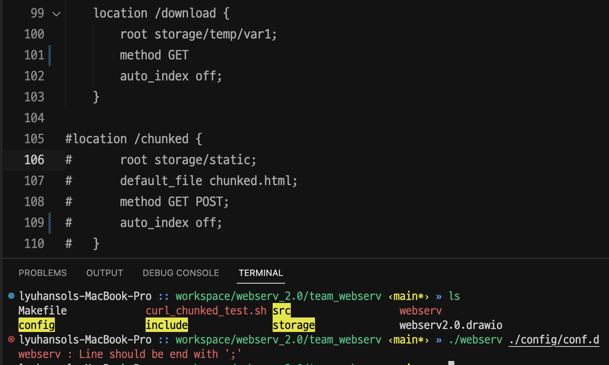
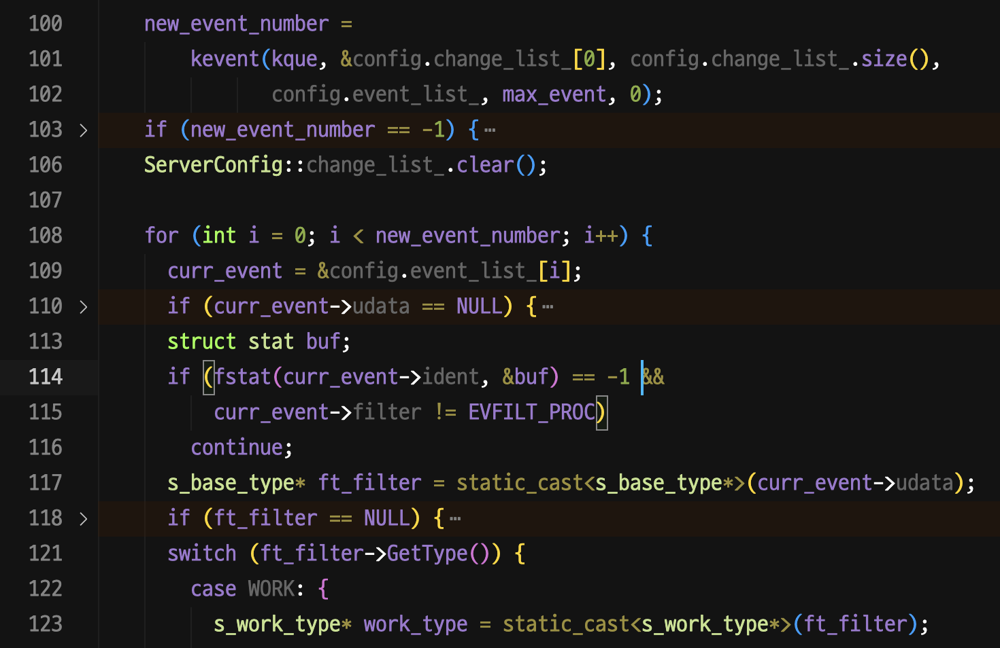
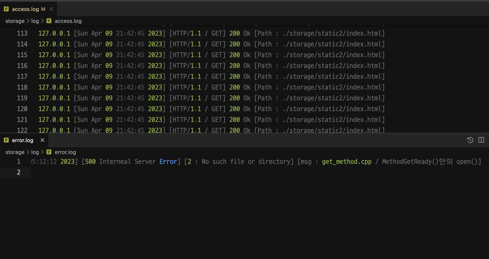

# Reminding : Webserv

## Webserv 구축, '우리의 웹서브'는

이번 Post에서는 웹서브의 구현 구조에 대해서 설명하는 시간을 가지려고 한다. 이 이야기를 정리하려면 사실 굉장히 다사다난했던(?) 내 팀 프로젝트 과정을 설명을 해야겠지만... 이는 스스로의 과정을 되돌아보는 다음 게시물에서 자세히 다루도록 하고, 지금은 그저 핵심적인 내용과 성공적으로 구현한 내용에 대해 살펴보고자 한다. 

우선 나는 전체 기간으로 따지면 웹 서브를 3달에 걸쳐 구현했다. 1달 스터디를 하고 1달을 짰지만, 팀이 와해(...) 되는 바람에, 거기서 나와 스스로 팀을 다시 꾸렸다. 그리고 그 팀을 이끌면서 메인 로직을 담당하여 설계를 했으며, 그 결과 2 + 1달로 승부를 보고 평가를 마쳤다. 

웹서브는 상당히 부담스러운 과제였다. 내용 자체도 워낙 많았지만 모호한 영역도 상당했다. 그렇기에 거기서 어떤 식으로 구현을 하는가? 해야 하는가? 라는 부분은 항상 머릿속에 맴돌았고, 그래도 감사한 것은 첫 도전의 실패로 오히려 웹서브의 흐름과 핵심을 좀더 빨리 깨달은게 아닌가 싶다. 

그게 내가 웹서브관련 후기 첫 글에서 이야기한 설계에서 중점으로 둔 부분이다. 

> 1. 웹 서버에게 '에러'라는 말은 '에러'가 아니라 '상태'이다. <br>
> 2. 웹 서버는 I/O Multiplexing 을 통해 작업의 '단계'를 나누며, '순환적' 형태를 띄도록 로직이 짜여져야 한다.  <br>
> 3. 구현에 필요한 조건들을 명확히하고 필요한 적정 수준을 지정해 구현하자.  <br>
> 4. config 파일의 완성도와 로직과의 결합성이 중요하다.  <br>
> 5. 성능 최적화를 신경쓰자(IO 입출력) 

2달의 숙고의 시간을 거치면서, 서버가 하는 일이라는 측면에서 깨달은 것을 적어둔 것이 위의 인용문이다. 그리고 이를 보다 쉽게 이해하기 위해 설계한 내용은 이렇다. 


그림이 상당히 정신없기 때문에, 순차적으로 단계 별 내용을 정리해보면 다음과 같다. 

1. server config 로드, 서버의 유효성을 검사한다. 
2. 서버 기동, 클라이언트가 accept 될 수 있도록 설정을 진행한다. 
3. 클라이언트 FD를 통한 이벤트 발생시 처리를 위하여 이를 해석하는 Request Handler 를 통해, 내용을 파싱하고, request를 해석한다. 
4. 해석하고, 에러 검증이 끝난 상황에서 요구 사항을 body 에 넣는다. 
5. 준비된 모든 내용을 하나의 HTTP response 로 만들어 전달하는 Response Handler
6. 연결 조건에 따라 data reset 혹은 close를 하고, logging을 진행하는 end part

이 총 6 단계 속 디테일을 가볍게 풀어보고자 한다. 

### 0. kevent와 udata & data 타입들... 

갑작스럽게 6단계라더니 kevent와 udata가 나와 당황스러울 수 있을 것이다. 하지만 나름 이유가 있다.

전체 서버에서 하는 작업은 결국 데이터의 읽기 + 원하는 조건의 해석 + 조건에 맞춘 데이터의 읽기 + 전체를 브라우저가 읽을 수 있는 단일한 data 로 바꾸어주는 작업이기 때문에, 필수적으로 data를 어떻게 읽고 파싱하며, 저장하는지가 가장 중요한 것이다. 

그런 점에서 굳이 챕터 0을 먼저 설명하는 것이며, 여기서 절명하는 것중에 핵심이 바로 kevent와 udata인 것이다. 

#### server config는 어떻게?

```plain
server  {
	listen 80;
	body_size 10000000;
	max_connect 100;
	max_header 4000;
	root storage/static/;
	default_file index.html;
	upload_path storage/temp/var1;
	access_log storage/log/access.log;
	error_log storage/log/error.log;
	include storage/static/mime.types;

	# 서버명과 같은 것들은 모두 영어 + 숫자 + '_' 만 지원한다.
	server_name RyujeansToday;
	timeout 3;


	# 메서드는 구현하기로 한 GET, POST, DELETE 왜에는 에러처리
	method GET POST DELETE;
	# 앞에 숫자, 뒤에 경로 파일 있어야 함 (반복형)
	# 에러는 반드시 해당 server config 에서 받아오는 것으로 생각한다.
	error 400 storage/loc/400.html 403 storage/loc/403.html  404 storage/loc/404.html 500 storage/loc/500.html  501 storage/loc/501.html 505 storage/loc/505.html;

	# 필수 location(root)
	location / {
		root storage/static;
		method GET;
		default_file index.html;
		upload_path storage/temp/var1;
		auto_index off;
		# 주석 (무시 처리)
	}

	location /introduce {
		root storage/static;
		method GET;
		default_file introduce.html;
		auto_index off;
	}

	location /static {
		root storage/static;
		method GET;
		default_file static_page.html;
		auto_index off;
	}

	# 추가 기능들 있는 페이지
	location /redir {
		root storage/static;
		default_file redirection.html;
		method GET;
		auto_index off;
		redirection http://www.naver.com; # redirection이 존재 시 다른 config 무시 비트 켜짐
	}

	# POST 기능용
	location /post {
		root storage/static;
		default_file post.html;
		# post 메서드로 들어오면 해당 entity는 root를 접근하는 것이 아니라, upload path를 활용한다.
		method GET POST;
		auto_index off;
	}

	# DELETE 기능용
	location /delete {
		root storage/static;
		default_file delete.html;
		method GET DELETE;
		auto_index off;
	}

	# AutoIndex 기능용
	location /auto_index {
		root storage/static;
		#default_file auto_index.html;
		method GET;
		auto_index on;
	}

	# cgi 용
	location /cgi_1 {
		root storage/cgi;
		default_file test_cgi_1.html;
		method GET POST;
		cgi cgi.py; # 해당 내용이 켜져 있을 경우 default_file 은 없어도 됨.
		auto_index off;
	}

	location /cgi_2 {
		root storage/cgi2;
		default_file test_cgi_2.html;
		method GET POST;
		cgi cgi.py; # 해당 내용이 켜져 있을 경우 default_file 은 없어도 됨.
		auto_index off;
	}

	location /download {
		root storage/temp/var1;
		method GET;
		auto_index off;
	}
}
```

우선 config 옵션 파일 자체는 nginx와 유사한 구조를 따라갔다. 서버가 존재하고, 서버에 기본 설정이 있고, 각 location이라는 추상적 위치 구분점을 두었고, 그런 위치에서 또 필요한 핵심 설정들만을 넣어두었다. 여기서 핵심은 특정 기능들이 가지는 의미를 명백히 해서, 혼란을 최소화 하는 것이다. 

예를 들어 auto_index 기능은 nginx에도 있는 일종의 directory listing 기능인데, 이는 기본파일이 지정되지 않았을 때 효과를 발휘하고, default file의 옵션이 있다면 동작하지 않는다. CGI의 경우 cgi 지정된 파일이 URL에 오지 않는다면, 이는 GET 메서드로 CGI 페이지의 default file을 읽어서 전달해준다. 

그리고 이런 설정 파일을 읽게 될 때는 C++에서 정말 편리한 STL을 적극 활용했다. 특히 사용량이 빈번했던 것은 map인데, 일정하게 필요한 값들을 비트 형태로 구현해볼까도 고려했지만, 결국 데이터를 찾아 들어가서 옵션을 찾고, 그 해당하는 옵션에 대해 파일을 여는 등의 행위를 해야 한다는 점에서 std::map의 활용이 더 두드러지게 되었었다. 

여기서 유효성 검사에 대한 영역도 특히나 고민을 많이 했다. 예를 들어 어떤 경로가 존재하거나, 기본 파일로 특정 파일을 지정했다고 생각해보자. 여기서 유효성 검사는 어디까지 검사해야 하는 걸까? 실제 서버라면 어느 정도 구현을 해야 할까? 

전체 설계를 담당하고, 팀을 구하면서 이 부분의 설계를 했었는데, 얻은 결론은 '파일의 존재여부' 내지는 '적힌 그대로의 역할을 할수 있는가?' 라는 질문에 답할 수 있을 정도로 설정하는 것으로 했었다. 

아무리 설정에 대한 촘촘한 유효성 검사를 하는게 좋을 수는 있다. 하지만 생각해보면 그것이 좋은 프로그램이라고 말할 순 없을 것이었다. 사용자는 서버를 원하며, 서버의 역할은 전달을 잘하는 것이지, 디버깅이나 다른 부가 기능은 서버로써 역할이 명확할 때 나온다. 즉, html 문서를 기본 파일로 설정했을 때, 그 내용의 유무나, 형식의 유무를 판단하는 건 의미가 없으며, 해당 파일을 제대로 전달할 수 있는지, 파일이 실제 존재하는지 등이 더 중요한 것이라고 판단했다. 정수 값이면, 그 값의 크기나, 내부에 혹여 다른 문자가 섞여 있는지 정도를 보았으며, 특별히 신경 쓴 것은 잘못 설정 되었을 때 그 라인 부분을 보여줌으로써 사용자가 직접 설정을 제대로 할 수 있도록 유도했다. 


> 사실 좀 더 디테일하게 하는게 나았지 않을까 생각은 든다... 101번 라인의 끝맺음 문법이 ;가 오지 않았기에 에러를 띄운 것이다. 

#### kevent와 udata 

나는 여러 구현 가능한 핵심 함수 중 성능적 우위를 고려하여 kevent를 로직의 핵심으로 두었다. 그리곤 매뉴얼을 몇 번을 읽으면서 고민한 것이 바로 udata 부분이었다. 

kevent 마지막 패러미터로 제공하면 되는 udata 파트는 커널을 거쳐도 커널이 손을 대지 않는 파트이다. 구분자인 FD와 함께 등록이되면, 그저 지정한 이벤트에 맞춰 FD가 뜰거고, 그 맨 마지막에 고스란히 담겨져서 kevent() 함수의 반복문 구조에서 바로 받아서 접근이 가능하다. 즉, 사용자가 원하는데로 갑을 넣을 수 있는 일종의 인벤토리 같은 것이었다. 



처음 팀을 짰을 때는 서버, 클라이언트, 파일 각기 다른 식으로 kevent의 이벤트 데이터를 담는 용도로 구조체를 담아 활용을 모색했었다. 하지만 다시 스스로 설계를 하계 되면서 곰곰히 생각해보았다. 단순 비동기 비봉쇄가 아닌 '이벤트' 처리 방식의 서버를 구현하는데, 그렇다면 이벤트란 무엇일까? 

이벤트는 곧 FD(file descriptor), SD(socket descriptor) 등등... 이런 다양한 파일의 구분자에서 비롯되는 읽기, 쓰기, 혹은 다른 예외 케이스들이 이벤트가 아닌가? 심지어 FD는 설령 파일 FD든, client의 SD 든 정수 값으로 되며 커널이 관리하며 할당해주는게 아닌가? 

나는 여기서 번뜩 아이디어가 떠올랐다. class 의 다형성을 적용하면 어떨까? 차라리 용도에 맞춰 이벤트의 최소 단위를 담은 기반 클래스를 설계하고, 여기에 종류에 따라 파생클래스를 붙이는 구조를 한다면, 여러모로 이점이 있을 것이라 판단이 들었다. 그래서 나는 이것저것 고민을 해서 결국 이렇게 4가지의 클래스를 구현하게 되었다. 

```cpp
class s_base_type;
class s_server_type: public s_base_type;
class s_client_type: public s_base_type;
class s_worker_type: public s_base_type;
class s_logger_type: public s_base_type;
```

우선 어떤 종류의 파일이건 간에 FD 값은 가진다. 내부적으로 이 값의 역할은 달라도 결국 kevent에 등록하는 구분자 역할을 하는 데다가, 이에 대한 type만을 우선 s_base_type에 넣어둔다면, 로직적으로 굳이 각 타입이라고 구분 짓지 않아도, 처음엔 s_base_type의 포인터로 하여 getter를 호출하면 편리하게 사용이 가능했다. 

그외의 각 타입들은 이름 그대로의 역할이라고 보면 된다. 서버는 서버의 전체 컨피그를 갖고 있으며, client는 client가 accept가 된 뒤에 만들어지는 클래스며, worker는 요구사항에 맞춰 파일을 만들거나, 읽을 때 쓰며, logger는 사전에 준비된 logging FD를 등록, 클라이언트들이 작업이 끝나면 데이터를 전달해줄 수 있도록 구성을 했다. 

이 부분에서 가장 신경을 쓴 것은 역시나 '코드의 논리성'과 팀원들이 이해하기 쉽도록 흐름을 어떻게 만드느냐? 였다.

이러한 부분에서 나는 항상 다음과 같은 구조로 작업이 진행되도록 했다. 

```cpp
s_server_type * server_udata;
s_client_type * new_client = server_udata.CreateClient(client_fd);
s_worker_type * new_task = new_client.CreateWork(path, file_fd, work_type);

//logger 는 별도의 특수 케이스, s_server_type의 최초 생성당시 내부에서 같이 생성된다. 
```

이벤트식의 핵심은 결국 이벤트가 병렬 처리가 되며, 적절하게 잘라서 kevent로 다시 돌아갔다가, 거기서 이벤트로 커널이 감지를 하면 그 때 다음을 진행한 다는 점에 있다. 하나의 client FD를 가지고 생각해보면 결국 선형의 작업이 중간 중간 끊기는 형태이다. 하지만 어쨌든 선형의 구조이며, 결국 작업은 '단계(stage)'가 존재한다. 

따라서 나는 설계할 때, 결국 이 흐름대로라면 server-> client->work 이 순서로 항상 작업은 진행될 것이며, 그리고 마지막 work까지 Create 되고 난다면, 다시 거꾸로 데이터가 흘러서 client에서 보내고 나면 data를 정리하면 된다는 생각에 이르게 되었다. 

따라서 coplien 방식으로 class가 따로 할당을 하거나 생성을 하는게 아닌, 연관 논리적 흐름에 맞춰 Create 메서드를 가지고 있는 구조로 했으며, 따라서 어느 단계에 들어가면 반드시 해당 class 타입만이 들어갈 수 있도록 구성을 한 것이다. 

이러한 구조로 짜게 되면서 확실히 팀원들의 이해도는 매우 빨랐다. 클래스 형태로 되어 있다보니 데이터의 소멸도 매우 손쉬웠다. 특히나 전역으로 관리하는 구조는 자칫 dangling pointer를 만들거나, leak이 날 가능성이 높았지만, udata라는 특정 작업 별로 데이터의 포인터를 연결시키다 보니 leak 면에서 결코 생길 일일이 없었다는 점은 매우 용이했다. 

#### 특히나 신경쓴 logger 

logger의 구현은 필수는 아니다. 하지만 만들게 된 것은 순전히 디버깅의 용이성이 보장된다는 생각 때문이었다. 서버는 멈출수 없다. recv, read, send, write 모든 시스템 콜에서 -1이 나올 수 가 있지만 그때마다 서버는 오히려 성공할 때까지 점검해야 하는 구조다. 그러다보니 중간에 어디서 문제였는지를 아는 것이 중요했지만, 문제는 여러 클라이언트가 접속하는 상황에서 디버거를 활용해 문제가 어딘지를 안다는 것은 사실상 매우 번거로운 영역임이 나타났었다. 그래서 logger에 대한 고민은 기본 설계 이후 가장 공을 들인 부분이라고 할 수 있겠다. 

logger의 핵심이 무엇이냐? 고 묻는 다면 나는 성능에 대한 고민 이라고 말해주고 싶다. 사실 logger를 넣는 다는 것은 입출력을 한번 무조건 하게 만들겠다는 말에 가깝다. 즉, 그만큼의 성능 저하가 발생할 수 밖에 없다는 것이다. 그래서 정말 많은 고민을 했다. 어떻게 하면 좋을까. 그래서 얻은 결론은 잦은 입출력을 최소화 하고, 중간 중간 갱신하는 방식 보다는 클라이언트에게 최대한 일처리가 끝난 시점, client의 데이터를 말소 직전에 이에서 핵심 적인 내용만 간추려서 logger에 전달해주도록 하였고, logger 역시 이렇게 데이터를 전달 받을 때, std::vector로 이루어진 데이터 리스트를 활용, 성능을 감안하여, vector에 누적된 로깅 데이터의 개수가 일정 개수를 넘거나, TIMER를 통해 로깅 할 시점을 미루는 방식의 로직을 짜게 되었다. 

```cpp
void s_logger_type::GetData(std::string log) {
	data_que_ += 1;
	logs_.push_back(log);
	// 이 부분에서 이벤트 발동을 타이머로 설정할 수도 있다. 
	ServerConfig::ChangeEvents(this->GetFD(), EVFILT_WRITE, EV_ENABLE, 0, NULL, this);
}

void s_logger_type::PushData(void) {
	// 이부분에서 정수 값을 조정하면 logging 타이밍을 바꿀 수 있다. 
	if (data_que_ == 0) {
		return;
	}
	for (size_t i = 0; i < data_que_; i++) {
		write(GetFD(), logs_.at(i).c_str(), logs_.at(i).size());
	}
	logs_.clear();
	ServerConfig::ChangeEvents(this->GetFD(), EVFILT_WRITE, EV_DISABLE, 0, NULL, this);
	data_que_ = 0;
}
```

다행이도 siege 테스트와 같은 벤치에서 write이기도하고, 사이즈가 크지 않아서 일까 에러가 나지 않고 아주 잘 작동했으며, 1개의 로깅 데이터가 쌓였을 때 바로바로 처리하는 식으로 했음에도 잘 돌아감을 볼 수 있었다. 

또한 뒤에서 설명하겠지만 cache hit/miss 개념을 도입한 정적 페이지 캐싱 기능 덕분에도 로거는 서버의 성능 저하에 크게 영향을 주지 않았다는 점에서 매우 만족스러운 설계였다고 생각한다. 

### 1. ServerConfig, 서버 유효성 검사 

드디어 본 단계를 검토한다... 이 파트들은 위의 data 파트보다는 내용이 간결하다. 특히 1단계는 이미 언급한 바 서버로서 해야할 최소한의 유효성 검사를 진행했다. 

오히려 이 파트에서 핵심은 그 외에 것들에 대한 세팅을 같이 했다는 것이다. 그 중 하나가 바로 '캐시' 개념의 도입이다. 

```cpp
void MethodGetReady(s_client_type*& client) {
	std::string converted_uri = client->GetConvertedURI();
	t_http& response = client->GetResponse();

	if (client->GetCachePage(converted_uri, response)) // 캐시파일인경우
	{
		client->SetMimeType("default.html");
		client->SetErrorCode(OK);
		client->SetStage(GET_FIN);
		ServerConfig::ChangeEvents(client->GetFD(), EVFILT_READ, EV_DISABLE, 0, 0, client);
		ServerConfig::ChangeEvents(client->GetFD(), EVFILT_WRITE, EV_ENABLE, 0, 0, client);
		return;
} else // 일반파일인경우
	{
		DIR* dir = opendir(converted_uri.c_str());
		if (dir != NULL) { // auto index 꺼져있고 default file 없을때
			client->SetErrorCode(FORBID);
			client->SetStage(GET_FIN);
			closedir(dir);
			return;
		}
	
		int file_fd = open(converted_uri.c_str(), O_RDONLY | O_NONBLOCK);
		if (file_fd == -1) {
			client->SetErrorString(errno,
			"get_method.cpp / MethodGetReady()안의 open()");
			client->SetMimeType(converted_uri);
			client->SetErrorCode(SYS_ERR);
			client->SetStage(ERR_READY);
			return;
		}
		MethodGetSetEntity(client);
		client->SetErrorCode(OK);
		client->SetStage(GET_START);
		s_work_type* work = static_cast<s_work_type*>(client->CreateWork(&converted_uri, file_fd, file));
		ServerConfig::ChangeEvents(client->GetFD(), EVFILT_READ, EV_DISABLE, 0, 0, client);
		ServerConfig::ChangeEvents(file_fd, EVFILT_READ, EV_ADD, 0, 0, work);
	}
return;
}
```

위 코드는 Method 중에서도 GET의 통상 경우를 데이터를 담아내는 구조이다. 여기서 알 수 있는 것은 udata client에서 GetCache 메서드를 우선 호출해본다는 점이다. 이는 1번 챕터에서 유효성이 판단 되면 그에 맞춰 설정 속 '정적 파일들을 확인' 하고, 이를 데이터로 갖고 있어서 복사해주는 구조로 되어 있다. 

이러한 구조를 고려한데는 나름의 이유가 있었다. 파일을 읽는 다는 행위가 오래 걸리는 것도 오래 걸리지만, 만약 다수의 클라이언트가 계속 요청을 하게 되면 커널은 여러 작업을 진행하다가 결국 -1을 반환하고 read를 다시 해야 하는 경우가 발생할 것이었다. 그런 경우 어쩔 수 없이 하던 작업은 일단 종료를 한 뒤, return, kevent 함수로 다시 돌아가 커널이 이벤트 있다고 알려줘서 다시 read를 시도해야 했다. 그러면 타이밍이 안 좋거나 접속이 복잡하게 쌓일 경우 read의 실패율이 늘어날수도 있겠다는 생각을 했다. 

이에 1번 챕터에서 미리 기본 파일들의 위치 경로를 조합해서 만든 뒤, 해당 파일의 위치만을 제공하는 구조로, 흡사 MMU의 TLB 캐시와 같은 느낌의 캐싱 작업을 넣었었다. 결과는? 대성공이었다. siege에서 42에서 요구하는 가용성은 99.5 % 이상이고, 이 역시 상당히 빡세다는데 우리는 기본테스트에서 100%에서 내려가지 않는 나름의 성적을 거둘 수 있었다. 

### 2. Request handler

위에서 제시한 2번 항목은 말 그대로라서 스킵을 하고, 다음 단계를 보자. 이 파트는 정말 쉽지 않은 내용이 많이 있었다. 우선 들어오는 요청에서 원치 않는건 걸러야 했으며, 유효성 검사를 최대한 디테일하게 진행했다. 특히 이 파트에서 URI를 환산해내는 것, chunked 등의 세세한 기준으로 검사가 필요하지들을 신경썼다. 

### 3. Method part

본 파트는 HTTP의 꽃, 해석을 통해 메서드를 지정하고 그 메서드를 수행해 본문이나 이런 것들을 담아내는 역할을 하는 파트다. 우선 request에서 완벽히 유효성을 검사했다고 보았기에 들어오는 값은 바로바로 처리가 가능했다. 

여기서 핵심적인 부분은, I/O 입출력이 있을시 반드시 robust하게 읽어햐므로 kevent로 돌아가는 read를 구현하는 것이다(이 부분을 우리 팀에선 "kevent 로 회귀한다" 라고 표현했다.). 뿐만 아니라 binary 파일들을 전달하기도 했는데, 이때 binary 는 우리가 익히 편리하게 쓰던 string으로 파싱이 불가능했다. 

따라서 robust함을 위하여 `vector<char>` 라는 데이터 타입을 활용하기도 했다. 

### 4. Response handler 

이 파트는 보내기에 핵심이 맞춰져 있었다. 예를들어 사이즈가 크면 chuneked로 보내야 했고, 만약 보내기가 에러가 나면 다시 보낼 수 있도록 설계를 진행했고 그 덕에 아주 깔끔하게 역할을 수행했다. 그 뒤에 핵심 중에 하나로 HTTP/1,1을 지원한다는 것도 눈여겨 볼만하다. 

HTTP/ 1.1 기준에서 connection은 keep-alive가 기본이다. 그런데 그러한 기능들이 활성화 된 경우 모든 작업을 마무리 지었음에도 해당 client fd 를 닫지 못하며, 계속 열어둔 상태에서 잠시 대기하는 시간이 있어야 한다. 따라서 이런 경우, 그리고 그렇지 않고 바로 커넥션을 닫아야 하는 경우에 따라 data를 그저 일부 reset만 하던가 혹은 전체를 싹 지우는 과정을 거칠 것인가를 이 파트에서 결정할 수 있도록 하였다. 

### 5. End Part



마지막 단계로, 이 단계는 아까 위에서 언급한 logger의 부분이 가장 포인트가 될 것이다. 실제로 logger를 구현한 이래로, 터지는 부분이 뭔지, 혹은 성공적인 접속이 되었다면 어떤 데이터들이 오갔는지를 볼 수 있게 구현을 했다. nginx의 그것도 많이 참고를 했는데, 개인적으로 웹서브 프로젝트를 하시는 분이라면 반드시 구현해보길 권장한다. 

실제로 구현을 해내냐 아니냐로, 프로젝트 후반부에 새로운 기능을 넣는 과정에서 프로그램이 터지는 경우들의 거의 대다수는 에러 로그를 통해 확인 및 해결이 가능했었다. 


## 글을 마치면서...

정말이지 두고두고 분량 실패가 아닌가 생각이 든다. 하지만 정리하고, 내용 중에 핵심만 담아도 이정도니... 그래도 다행이라고 하면 이런 내용들 안 잊고 이렇게 기억해서 적을 수 있음에(...) 감사해야할지도 모르겠다.


```toc

```
