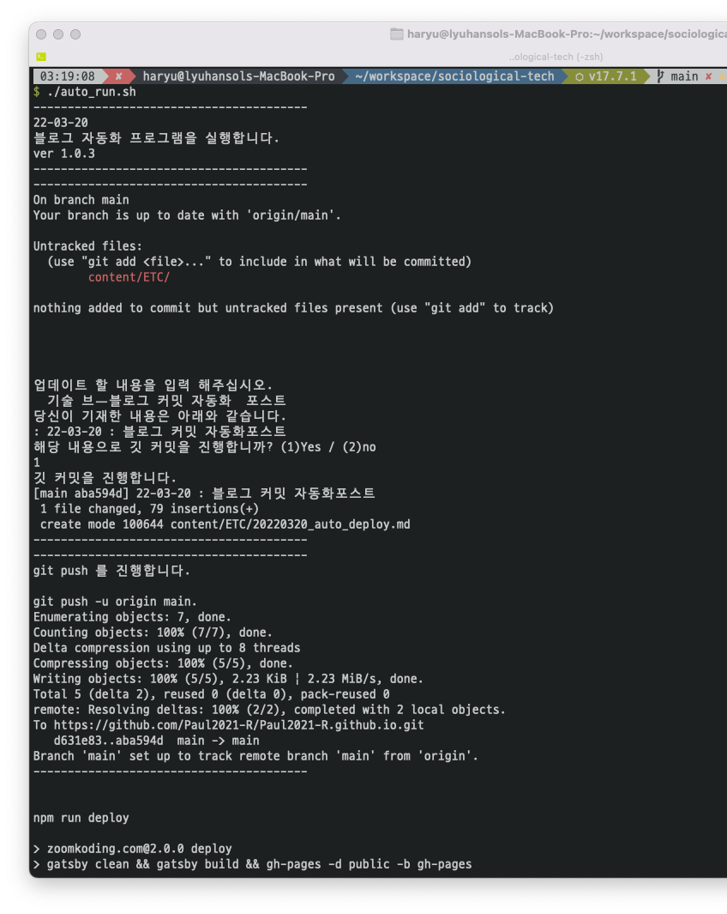
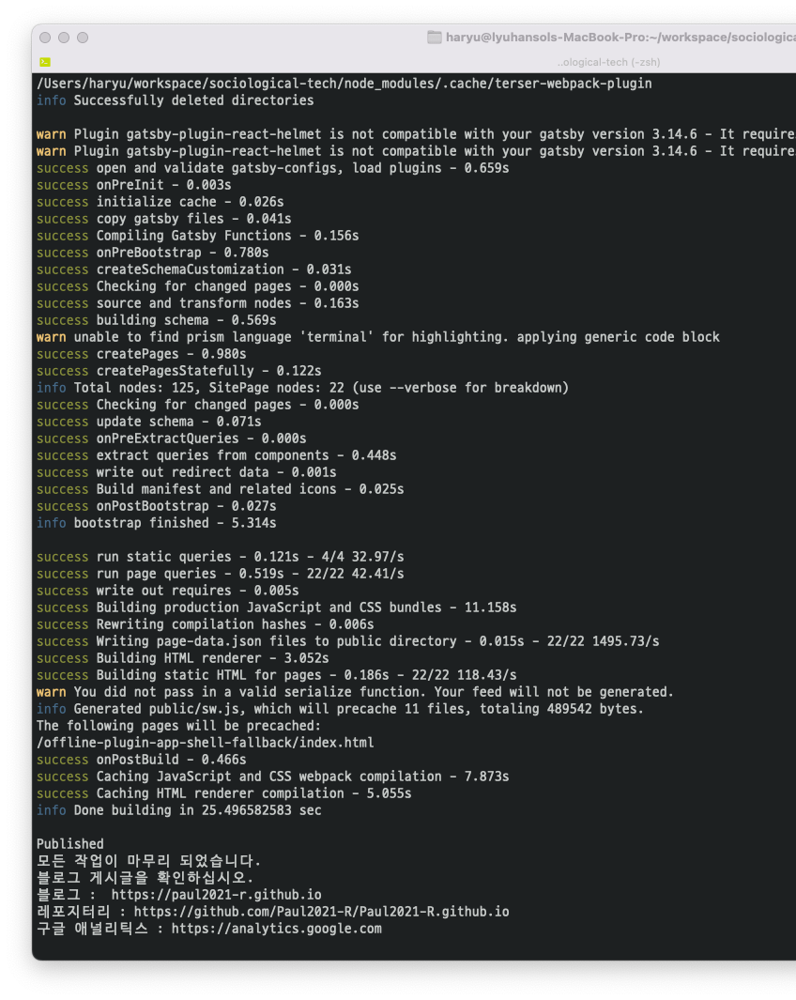

P.s ) 개인적인 일기글에 가까운 글은 아무리 생각해도 전달하는 용의 글이 아닌 만큼 편안하게 글을 쓸 것입니다. 글체가 바뀌었다고 당황하지 말아주세요...😅

깃블로그 스터디 큰 고비를 넘겼다.

해야할 일들을 마무리 지었고, 특히나 소득이 컸던 것은 기술블로그 구글 애널리틱스 적용 및 자동화 스크립트 작성 부분이었다.

개발 공부를 한지 어언 몇 달 째, 드디어 갑작스럽게 블로그 공부를 하던 도중 알게된 '불편함'에 직접 자동화 스크립트를 짜보자 하고 생각하여 부랴부랴, 놀던 와중에 스크립트 명령어들을 뒤지기 시작했다.

```bash
#! /bin/bash

today=`date +%y-%m-%d`

echo "----------------------------------------"
echo $today
echo "블로그 자동화 프로그램을 실행합니다."
echo "ver 1.0.3"
echo "----------------------------------------"
sleep 1 && clear
echo "----------------------------------------"
git status
printf "\n\n\n\n"
echo "업데이트 할 내용을 입력 해주십시오."
read comment
clear
echo "당신이 기재한 내용은 아래와 같습니다.
: $today : $comment"
echo "해당 내용으로 깃 커밋을 진행합니까? (1)Yes / (2)no"
read answer
no=2
if [ $answer -eq $no ] ; then
	echo "블로그 업로드를 취소합니다.
	프로그램을 종료합니다."
	exit
fi
echo "깃 커밋을 진행합니다." && sleep 1 & clear
git add .
git commit -m "$today : $comment"
echo "----------------------------------------"
sleep 1 && clear
echo "----------------------------------------"
echo "git push 를 진행합니다."
printf "\ngit push -u origin main.\n"
git push -u origin main
sleep 1 && clear
echo "----------------------------------------"
printf "\n\nnpm run deploy\n"
npm run deploy
sleep 1 && echo "모든 작업이 마무리 되었습니다."
echo "블로그 게시글을 확인하십시오."
echo "블로그 :  https://paul2021-r.github.io"
echo "레포지터리 : https://github.com/Paul2021-R/Paul2021-R.github.io"
echo "구글 애널리틱스 : https://analytics.google.com"
exit
```

역시 구글의 힘일까. 필요한 명령어를 찾아다녀봤는데, 생각보다 간단하게 끝날 수 있는 부분이었다는 것에 이 편한걸 왜 안했을까 싶다는 생각도 들었다.

해당 스크립트의 핵심은 현재 상태 파악 및 깃 커밋 후 `npm run deploy`를 자동으로 실행해 주는 것이다. 활용된 명령어를 정리하면 아래와 같다.

1. `echo` : 전형적인 출력용 명령어(printf 도 동일한 용도. 걍 쓰다보니 중간에 써보며 테스트해보았다. 차이점은 자동 개행이 echo에는 있다. )
2. `sleep` : 잠시 터미널에서 딜레이를 만들어준다. `sleep 1 && clear` 라고 하면 알아서 1초의 딜레이 후 다음 명령어를 실행한다.
3. `조건문 if` : 해당 명령어는 상당히 C와 달라 처음에 어색했다. 기본적으로 조건문 형태로 진행되며 링크를 참조할 것.[참고자료](https://jink1982.tistory.com/48)
4. `exit` : 해당 스크립트에서 명령어를 작동하면 스크립트의 프로세스를 종료시킨다.

그리하야 실행을 시키면 다음처럼 움직인다.



ㅋㅋㅋ...
작고 사소하지만, 진짜 내가 필요해서 만들었다는 점에서 새벽 오밤중에 좋다고 박수를 쳤다. 더 괜찮은 걸 언젠가 만들겠지? 그런 나에게 기대한다. 🤪
