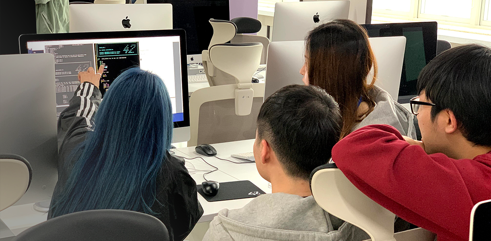
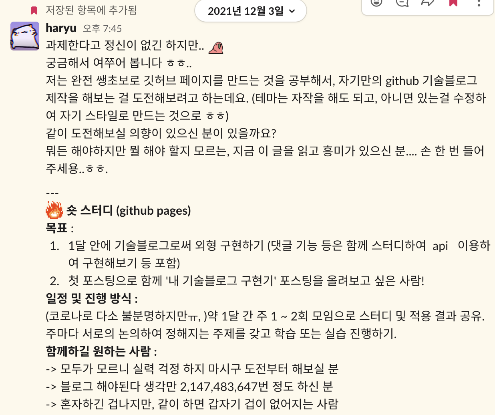
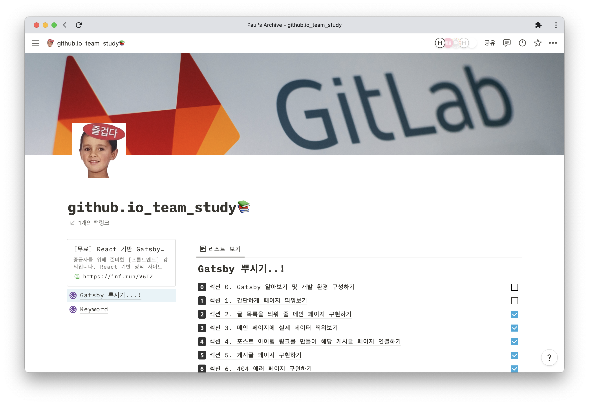
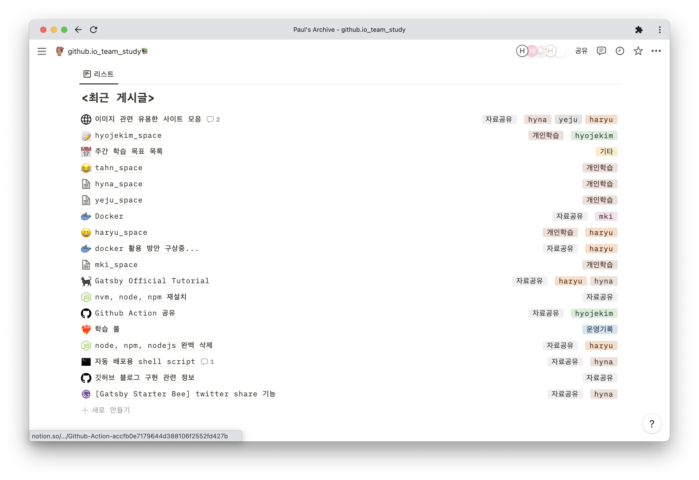
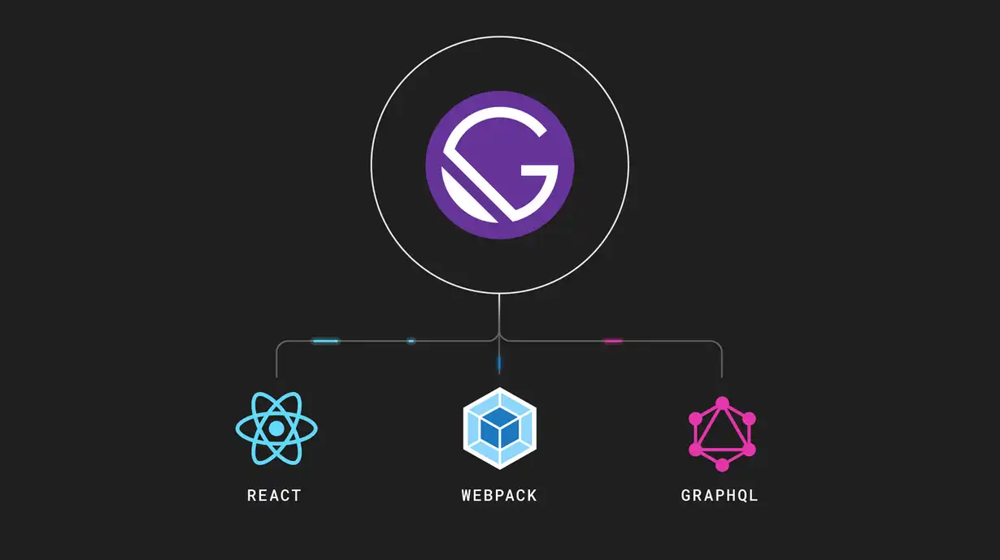
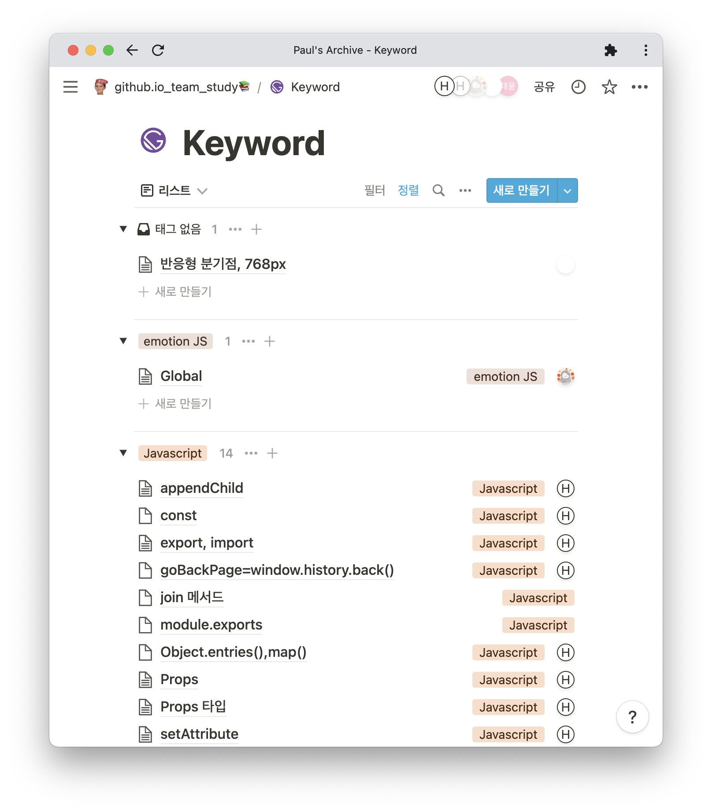
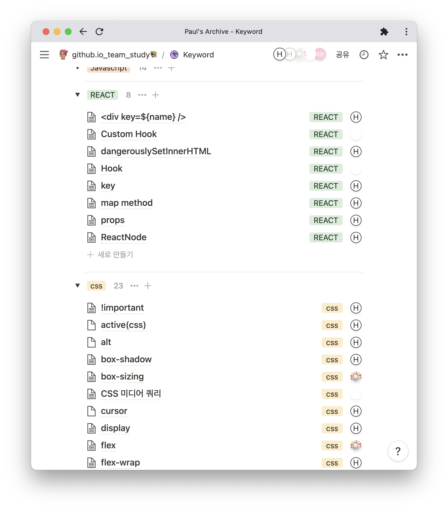
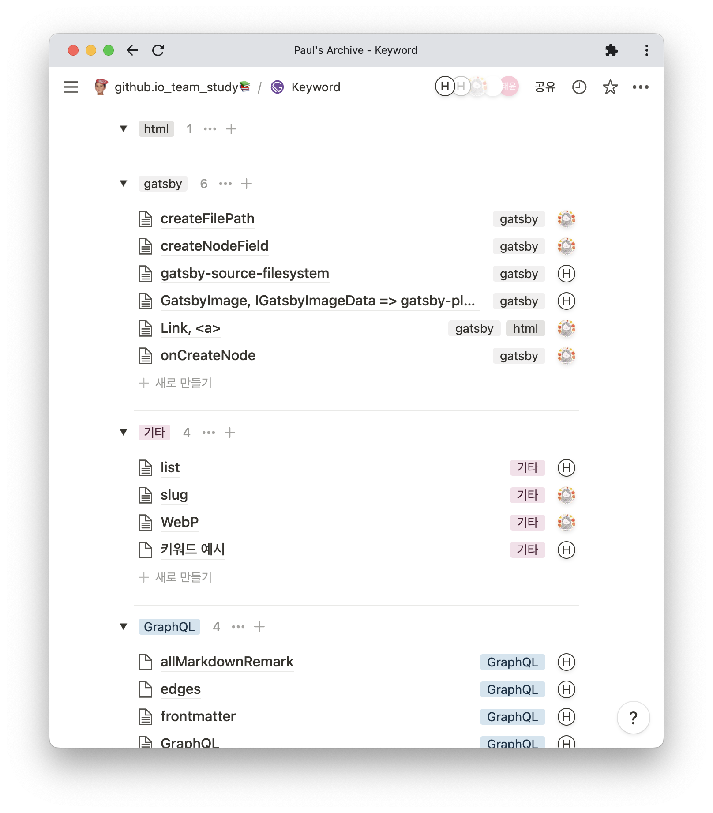
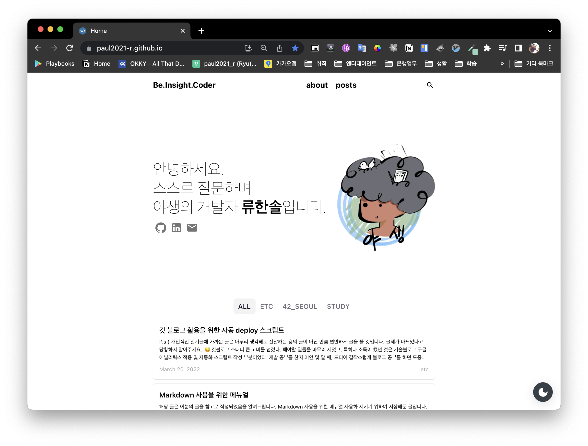
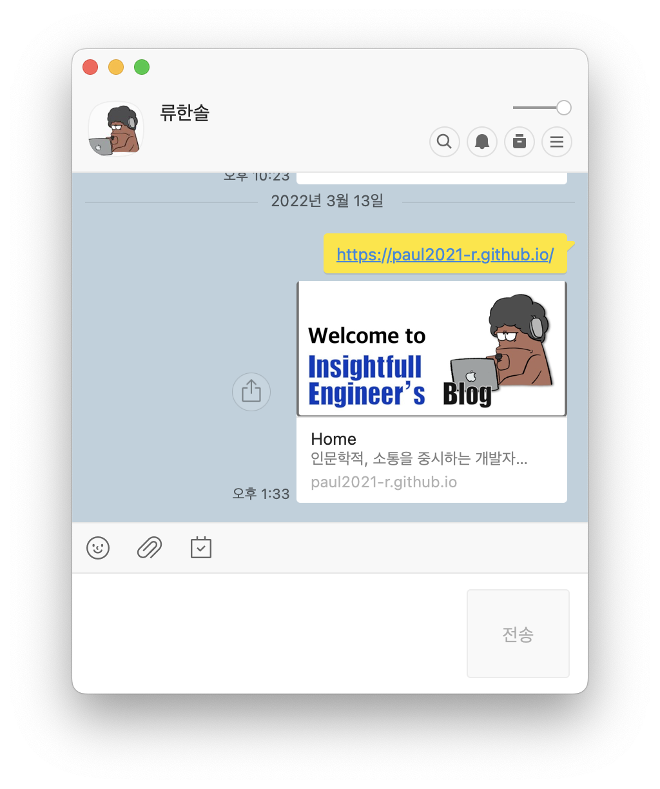

# 스터디를 마치면서 적어보는 나름의 소해...

## 42 서울 첫 깃 페이지 스터디를 마치면서

42서울의 핵심은 **<big>동료</big>** 라고 생각합니다. 사실 이 밖에도 여러 말로 형용할 수는 있을 겁니다. 하지만 저는 이 말이야 말로 가장 필요하고, 42서울이라는 공간의 잠재능력의 근본이라고 생각하게 되었습니다.

### 라피신, 수영장

42서울 첫 발을 디딤과 동시에 우리는 라피신이란 벽을 만나게 됩니다. 물밀듯 밀려들어오는 과제의 연속, 전혀 모르는 개념이지만 전혀 설명해주지 않는데, 심지어 교재도, 정해진 방식도 없습니다. 주변에서는 잘 하는 사람이라면 어느새 마무리하고 멋지기까지 한 과제를 보고 있노라면 멈춰 서있는 것 같은 내 자신의 모습을, 목까지 차오른 물로 질식할 것만 같은, 성인 풀장에 들어간 어린아이와 같은 감각까지도 느끼게 됩니다.

그런 상황에서 갑작스런 일이지만, 동시에 조금 힘이 풀리게 됩니다. 정확히는 자기자신에게 실망을 하고, 동시에 머릿속이 새 하얗게 되버립니다. 내 부족을 인지하게 되고, 인정하게 되며, 그제서야 혼자 할 수 없음을 직시하기 시작합니다. 힘이 풀리고, 혼자의 힘으로 모든걸 하려던 교만이나 오만함, 아집을 집어 던지고 눈 앞에선 새로운 시작, 혹은 기회를 우리는 보게 됩니다.



동료 평가는 너무나 큰 힌트가 됩니다. 학습에서 내 입의 뻣뻣함이 곧 내 실력의 한계임을 명확히 알게됩니다. 준비의 철저함이나 코드에 대한 보다 깊이있는 고민 혹은 상대를 이해시키기 위한 고뇌를 요하게 됩니다.

그러면서 나름의 선물처럼 찾아오는 새로운 인연은 평가 중간 중간, 지금 하는 과제, 개념, 혹은 그 이상의 무언가에 대한 힌트를 얻게 됩니다. 내 고비 그 이상의 추진력으로 과제를 통과하게 될 때의 그 쾌감은, 모두가 혀를 내두르는 '한 번은 하지만 두 번은 모르겠다' 라는 라피신의 힘들었지만 멋진 추억, 끝내주는 정복감을 맛보게 됩니다.

### 다시 시작

하지만 라피신의 끝은 끝이 아닙니다. 본 과정에 들어선 순간 시작되는 본 과정 수준의 학습과 깊이를 보고 숨이 막혔습니다. 비 전공자이자 노 베이스라는 말이 무색하게 더욱 철저하게 검사되는 동료 학습, 그리고 라피신을 통해 알게된 명확한 현실은 '혼자서 불가능한 채움'을 '모두 같이 채우자' 라는 마음으로 변하게 되었습니다. '함께' 하면서 동시에 '성장'한 경험. 이러한 기세를 어떻게 하면 살릴 수 있을까? 하고 고민을 하게 되었습니다.

## 기회를 만들어보자... 스터디 구해볼까?

한 번도 해본적 없었습니다. 대학 조별과제야 당연히 어떤 모습인지 익히 아실 것이며 저 역시 압니다. 그럼에도 라피신 때의 느낌. 정말 괜찮았던 그것들을 다시 해보면서 새로운 것을 배우고 기회를 얻고 싶었습니다. 하물며 42서울의 본질은 역시나 SW 인재겠지요. 자기를 드러낼 공간의 필요성, 꾸준한 소통과 자기 소화를 위한 웹 상의 공간이 필요했습니다. 이런 점들이 꼬리에 꼬리를 물고, `아 괜찮은 블로그를 만들면 좋겠다. 근데 뭔가 새롭게 해볼 기회는 어디에 있을까?` 그러다 결국 알게 된 것이 `깃 허브 페이지`를 활용한 `정적 사이트 생성 방식`의 기술 블로그 였습니다.

처음에는 혼자 해보니 이는 너무나 어려웠습니다. 자바 스크립트를 알지도 못하는데다가, 터미널에서 활용하여 사이트를 불러오고, 어디서부터 시작해야할지 막막함으로 2~3주를 그냥 흘려 보냈습니다. 뿐만 아니라 그냥 테마만 다운받아 복붙해 쓰는 것 역시 뭔가 아니란 생각을 했습니다. 애초에 그렇게 하고 나서 드는 생각은 전혀, 아무것도 모르는 페이지들, 코드 들과의 애매한 동거 같았습니다. 그리고 나서 위의 아이디어가 떠올랐던 것입니다. 불현듯 맥북의 메모장을 키고, 스터디 대한 구상을 시작했었습니다. 빨라지는 자판 소리가 멎을 때 즈음 슬랙에 저는 조심스레 공지 하나를 올리게 되지요.



<caption><font color=grey>[나름 열심히 구해본다고.. 한 글자 한 글자에 진심을 담았습니다...] </font> </caption>

그렇게 나름대로 진심을 담은 글을 써서 일까요? 놀랍게도 순식간에 정원은 채워지게 되고 저희는 함께 깃 허브를 활용한 기술 블로그 작성 및 이를 위한 숏 스터디 작성에 들어가게 되었습니다.

## 시작은 가벼웠지만, 세워진 플래그는 묵직했다...

모인 분들의 열성은 대단했습니다. 대학 재진학을 목표로 하는 분도 있었고, 취준을 위해 42과제를 불태우시던 분도 있었으며, 프론트 앤드 쪽을 이미 시작하신 분도 계셨지요. 하지만 모두의 공통점은 하나였습니다. 만들고 싶고, 시작하고 싶지만 선뜻 도전하기 어려웠다는 점. 그리고 혼자 채우기엔 쉽지 않았다는 점. 그렇기에 저희의 열의는 자연스레 확실한 적극성에서 보여졌고, 일주일에 한 번 만나는 만남이었지만, 모두 나름대로 필요한 지식들을 정리하고 나름 탄탄히 준비해오는 태도를 가질 수 있었습니다.

저는 그때 "**무엇이 필요한가?**" 에 대해 고민을 하고 있었습니다. 왜냐면 해야할 일은 너무 많고 방대했고, 공부를 하는 과정에서 서로 묻고 답하는 것이 되어야 하면, 나름의 명확한 활동 목표가 필요했기 때문입니다(블로그 스터디라곤 했지만 '무엇을' 이란 구체적인 게 필요했던 것입니다.). 그렇기에 처음에는 자연스럽게 여러가질 할 수 있는'툴'을 잘 골라야 하리라 생각했고, 각자에게 미션처럼 '이번 주는 구현을 해보자', '이번 주는 내부 페이지 트리를 이해해보자' 이런 식으로 말이지요.




논의를 통해 정적 사이트 생성기를 선택했고(gatsby), 해당되는 사이트 생성기의 기초가 되는 언어들을 확인하였습니다. 그러던 도중 자료 공유가 필요했기에 노션 사이트를 구성했으며, 각자의 자료를 공유하고, 학습의 내용들을 최대한 기록하려고 노력했습니다. 여기까진 정말 좋았습니다. 자신감과 기대가 넘쳤죠. 한 달이라는 목표 기간 안에 블로그를 만들어보겠단 나름의 기대감으로 다들 으쌰으쌰 하는 분위기를 가질 수 있었습니다. 하지만... 아시죠? 보통 이런 식으로 시작한 이야기는 꼭 이상하게도 부정적이게, 고비를 마주하기 마련이라는 점을....😢

## 코로나...그리고 벽...

작년 말 1차적으로 문제는 코로나에서 터지기 시작했습니다. 코로나가 심해지고 정부 지침의 변경으로 점점 만나서 뭘 할 수 없는 상황으로 변해가고 있었습니다. 슬랙을 통해 만나기는 하지만, 과연 제대로 되는가? 에 대해 스스로 의구심을 가질 수 밖에 없었습니다. 집중이 잘 안되는 점, 상대적으로 힘이 빠져감을 느꼈습니다.

뿐만 아닙니다. 예상 외의 복병은 공부하고 있던 기술 블로그 구현 방식에도 매우 큰 문제점을 껴안고 있었습니다. 이는, 사용하기로 결정한 정적 사이트 생성기 `gatsby` 가 프론트 앤드의 기본이자 핵심이라 할 수 있는 `HTML`, `CSS` 를 시작으로 `Java Script`, `Type Script`, `React` 및 `graph query`, 각종 자체 라이브러리, 플러그인까지 단순 개념 이상으로 디테일한 노하우, 숙련도가 있어야만 사용이 가능했음을 공부하면 할 수록 깨달아갔던 것입니다. 스터디 팀 전체가 상당한 난이도에 진척이 쉽지 않았고, 스스로 공부하고 발표하는 방식이었는데, 이것 역시 굉장히 느린 진행 혹은 다른 일들과 겹쳐 흐지부지 되는 경우가 생겨버렸었습니다. 그리하여 1달 숏스터디! 라던 생각은 2달로, 2달은 다시 3달 째를 향할까 말까 하는 시점에 도달했었습니다.


<font color=grey>[처음엔 보기만 해도 어지러웠다...]</font>

스터디의 힘은 빠져갔습니다. 분위기가 쳐지는 게 느껴졌습니다. 저 역시 자신감보단 두려움으로, 부담감으로 공부를 마주할 수 밖에 없었습니다. 나름 따라와 주지 않는 팀원들에 대해 원망스럽단 생각도 조금 했지요. 내가 열심히 할 의미가 있는가? 왜 나만 하는 것 같지? 이런 생각은 감정을 소모캐 할 뿐이었습니다.

동료학습의 장점을 맛보고, 그걸 그대로 이루면서 뭔가 이뤄보겠단 저의 생각이 너무 앞섰던 것인가? 하는 생각이 스쳐지나갔습니다. 촛불이 바람에 휘날리듯 이런 생각이 들 수록 제 머릿속엔 동시에 **"이게 비전공자의 한계인가?"** 라는 생각 마저 함께 떠오르기 시작했었습니다.

## 기회를 준건 여전히 동료였다

고민의 한 가운데에서 해당 스터디를 만든 제가 직접 스터디를 끝내자고 이야기 해야 하는가? 라는 고민을 하던 때 였습니다. 함께하던 스터디원의 권유로 다시 한 번 마음을 다잡고 'gatsby의 기초' 강의를 같이 따라 해보면서, 학습을 진행해보면 어떤가? 라는 제안을 받게 되었습니다. 그룹 모두 지친 상태, 하지만 포기할 수 없는 것임을 서로 알기에 해당 권유는 마지막 기대와 같은 느낌이었습니다.

그러나 여전히 강의를 같이 공부한다는 것 조차도 처음엔 어려웠습니다. 모르는 단어들, 난무하는 개념들, 정리를 하고 따라한다고 다들 여전히 길을 찾지 못하고 있었습니다.

그러던 도중 갑작스럽게, 한 그룹 스터디원의 설명, 그리고 이를 위한 단어 정리가 눈에 들어왔습니다. 생각해보면 조원들이 각자 해오는 방식, 모두가 동일한 목표를 공유한다고 했으나, 서로 모르는 부분도 다를 뿐만 아니라 질문하거나 하는 행위가 적었다는 사실이 눈에 들어왔습니다. 그때 단어 정리가 되고, 순차적으로 흐름으로 코드를 설명해주자 제 스스로 놀라울 정도로 손쉽게 더 많이 이해가 됐습니다. 그리고 머릿 속에서 기존의 방식에 대한 의구심이 들었고, 그리고 눈 앞에서 스터디원의 정리 및 설명에 대해 이게 동료 학습이런 건가? 하는 생각이 들었습니다.

함께 배운다는 의미를 새길 필요가 있었습니다. 그리고 기회를 준 동료의 생각과 열의를 헛으로 보내고 싶지도 않았습니다. 그렇기에 다시 한 번 과감하게 '라피신'의 때를 떠올려보기 시작했고, 전체 스터디 방식의 변화를 주게 되었습니다.




<font color=grey>[함께 닥치는대로 찾고, 묻고, 검색했습니다.]</font>

동료 학습의 시작은 '질문'에 있었습니다. 그리고 '과정에서의 공유' 였지요. 물론 기존에도 공유를 안한 건 아니었습니다. 하지만 결과적으로 자기가 할 걸 다 하고 공유한다는 형태였지 '과정'에서의 공유가 있었던 것은 아니었습니다. 하물며 중구난방에 자꾸 정재된 것만 공유하려는 느낌에 가까웠습니다.

그렇기에 과감히 마지막 변화를 도전했습니다. 한 주 당 한 색션의 한 개의 강의를 맡고 각 스터디원들이 맡고, 전체의 진행은 각자 하면서도, 이해 안 되는 부분을 계속 공유하고, 궁금한 키워드를 찾아옵니다. 그리곤 스터디 시간에 함께 한 강의, 한 강의 씩 순서대로 설명해나가는 방식으로 진행방식을 바꾸게 되었습니다. 그리곤 각자 알아서 올리는 것이 아닌 검색해서 정리한 내용을 한 군데에 모으기 시작했습니다.

그리곤 같이 슬랙을 활용하여 스터디를 진행 할 때는 항상 '카메라'를 키고 했으며, 전체 중 특별히 본인이 맡은 파트를 책임지고 흐름과 본인이 정리한 키워드들을 설명하도록 했지요. 동시에 서로 질문을 하고 답변을 하도록 적극적으로 형태를 구축해 나갔습니다.

## 내가 놓치고 있던 것들

스터디원들 사이에서 이런 변화는 꽤나 `성공적`이었습니다.

> 1.  타입스크립트로 짜여진 웹페이지의 `흐름`을 이해하기 시작했고,
> 2.  키워드를 기반으로 메꿔나가는 학습이 CSS나 HTML 태그들, `페이지의 외형`에 대한 `이해`를 높여갔고,
> 3.  질문의 소통이 전체 강의와 개념 `학습의 속도`를 높여 줬습니다.
> 4.  뿐만 아니라 서로 찾아가며 알게된 주요 사이트들, 거기서 제공해주는 자료들이 공유되니 점점 `키워드를 찾는 속도`도 빨라지기 시작했습니다.

그리하여 빈 말 거두하고, 각자 만들고 싶은 블로그를 위해 나름의 과정을 거쳐 왔고, 저 역시 저 만의 블로그를 구성하는데 성공하게 됩니다.

<font color=grey>[기본 베이스는 테마는 ZOOMKODING 님의 테마입니다.]</font>

<font color=grey>[OG 이미지는 제 친구 작품입니다.]</font>

위 블로그는 학습을 통해 이해하게 되고, gatsby 사용 환경을 구축해서 만들어 냈습니다. 기본 테마부터의 제로부터의 제작은 어려웠으나, 기존 테마를 수정하고, 직접 필요한 데이터 연결이나, 구글 애널리틱스 구현, 각종 메타 데이터 구현 등 동료학습의 효과를 톡톡히 보았고, 완벽하진 않지만 `성장`을 경험하고 누릴 수 있었습니다. 무엇보다 앞으로 어떤 식으로 하겠다는 생각이 명확해졌습니다.

그리하여 강의 및 블로그 구현을 마지막으로, 여러 상황 속에 스터디는 마무리를 짓게 되었고, 이렇게 저는 자리에 앉아, So_Long 으로 지친 머리지만 고민하며 글을 쓰게 된 것입니다. 제가 무엇을 놓쳤었고, 무엇을 얻었는지에 대해서 말입니다.

### 내가 놓친 것들

스터디를 구하고, 함께 한다. 이건 라피신에서 누린 동료학습을 기대한 행동이었습니다. 뿐만 아니라, 필요도 있었지요. 하지만 이제 와서 가만히 정리해보고 있노라면 이끌어가겠다고 시작했던 제 스스로 동료학습의 `본질`을 보진 못하고 있었습니다.

동료 학습의 라피신, 그리고 카뎃으로의 42서울에서의 삶은 `질문`, 그리고 그런 `과정에서의 공유`가 중요했습니다. 공통의 목표라곤 하지만, 과정에서 공유하지 않고 **알아서 처리**하려 한다거나, 어려움을 나누지 않고, 그저 과감하게
**칼로 자르듯 분량**을 정하거나, **결과물만을 가져와 공유**하는 방식은 `동료 학습`이 아닌 `개별학습-후-검사` 의 형태에 가까웠습니다. 그리고 이는 스터디 원들의 성장 보다는 지침을 유발했고, 특히나 블로그 스터디의 경우 우선순위가 1순위가 되는 것이 아닌 것이었기에 현실적으로 구성원들의 적극적인 학습이나 참여를 바라기도 힘들었습니다. 동시에 재미를 느끼기도 쉽지 않았습니다.

결국 그런 방식으론 서로가 서로를 채워주지 못하며, 자극도 되지 않았습니다. 아니, 자극은 되었지만 `같이` 가는게 아니라 `무리 중에 혼자` 가는 모습에서 서로 어쩌면 상대의 앞서감에 대한 '질투' 하는 모습에 가까운 감정을 갖진 않았나 조심스레 생각해보게 되었습니다. 즉, 경쟁 속에 그저 상대의 커보임을 경계하는 듯, 자신의 부족함에 실망하고 기운이 빠지는...기존의 학습의 방식과 한계를 여전히 고수하고 있던 것입니다. 제 스스로 라피신 초반 1주차 때의 제 모습을 여전히 그리고 있는 듯 느껴졌습니다.

### 그렇기에 얻은 것

이번 스터디는 정말로 `성장`의 가능성은 어디에 있는가? 에 대한 제 나름대로 이해하는 계기 였다고 생각합니다. 핵심은 '나'에게 갇혀있지 않는 점이라고 생각합니다.

첫 라피신에 돌입하고, 숨막히는 과제, 숨막히는 실력, 숨막히는 경쟁심리를 느끼며 좌절하고, 체념하고, 동시에 부담으로 인해 성장하지 못하던 때가 있었지요. 하지만 어느새 내 부족을 인정하고, 나를 열고 상대에게 '질문' 하고, 상대와 함께 '공유'하면서 과정에서부터 공유하고 상부상조하는 학습을 했을 때, 생각지도 못한 부분에서 아이디어나 힌트를 얻게 되던 그 감정. 그 기회. 그리고 그렇게 질문과 소통의 작용 반작용이 결국 무언갈 이루어줬던 경험. 이것이 진짜 `괜찮은 성장`이며, 이것이 사회에서 요구하는 단순히 컴퓨터만 잘하는 것이 아닌 한 `공동체에 대한 개인의 문제 해결 능력`을 만들어주고, 그럴 `준비된 사람`으로 만들어주는 방식이 아닌가 조심스레 결론지어봅니다.

42의 본질, 가르쳐 주는 사람도, 교재도, 강의도 없지만 성장이 가능함이란 것은 어디에서나 적용 가능성이 있습니다. 스터디 역시 동일하게 적용되는 것이었음을 느꼈습니다. 같이 목표를 정하고, 그 같은 목표를 위해 과정에 공유하거나 질문합니다. 그런 나눔과 소통은 서로의 실력으로 치환되었고, 그렇게 붙은 가속도는 결국 '성장'을 만들어 냈습니다. 문제는 그렇게 하기 보단 혼자 해결해 내려던 옹졸한 자신, 사실은 소통하면 됐던 문제를 해결하지 않으려 했던 내 자신에게 있었음을 느낄 수 있었습니다.

## 마침내

저는 첫 스터디의 목표를 나름대로 달성함과 더불어, 아쉽지만 스터디를 마무리 하게 되었습니다. 이는 스터디원 전체의 상황에서 더 다른 목표를 세워서 나가기엔, 각자의 역할이나 현재 진행형으로 해야할 일들이 많기 때문에 공동의 목표가 부재된 상태에서 모여있는 것은 무의미하다 생각했습니다. 이젠 각자의 길 앞으로 나가자- 라는 생각이 들었지요. 다들 정말 아쉬운 눈치였습니다. 마지막 슬랙을 통한 스터디 세미나에선 서로 나가기 어렵고, 서로를 끔뻑거리며 쳐다보기만 했습니다. 아쉽고, 슬픈... 그런 감각이 공존했습니다.

그럼에도 이제는 나름 이해가 됩니다. 42의 시스템이 가지는 장점들을, 그리고 우리가 생각하지 못했던 성장의 나름의 비결을 여기서 배워갑니다. 이번 마무리 된 깃 스터디 스터디 원들 모두의 도움이 아니었나 생각해보게 됩니다. 완벽한 스터디 였냐? 하면 `아니다`라고 답하겠지만, 성장의 기회가 된 스터디였나? 라고 하면 당당하게 `그렇다` 라고 이야기 할 수 있는 스터디였다고 확신합니다.

mki님, yeju님, tahn님, hyna님, hyojekim님... 정말 남 이름을 쉽게 외우지 못했던 자신임에도, 인트라 아이디를 외우게 되고, 함께하며 쌓아놓은 정보들은 여전히 살아 숨쉬고, 제가 자바 스크립트나, 블로그 유지 보수를 하면서 써먹게 될 것입니다. 정말이지 멋진, 그리고 의미 있는 스터디를 했다고 생각합니다. 함께한 스터디원들에겐 할 말이 없을 정도로 감사하는, 많은 도움을 받아왔습니다. 앞으로 어떤 스터디, 프로젝트를 할 진 모르겠지만 지금 여기 누리고, 배웠던 경험이 더 좋은, 더 성장하는 만남을 얻게 되리라 생각하니 기대가 충만해집니다. 함께한 모두에게 감사를 전하며 이만 글을 맺으려 합니다.

```toc

```
