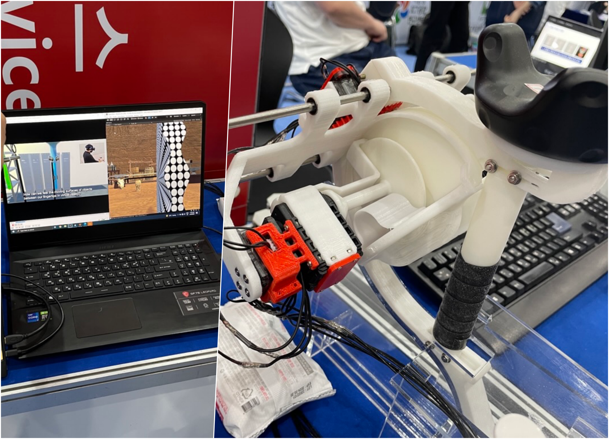
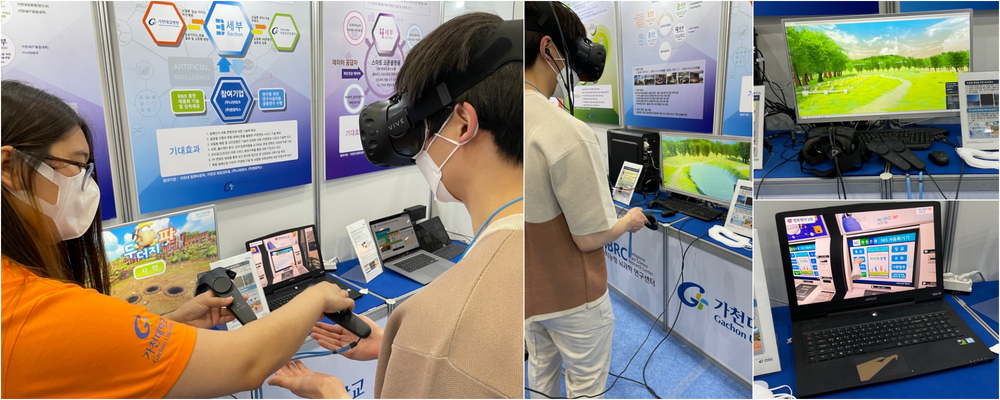
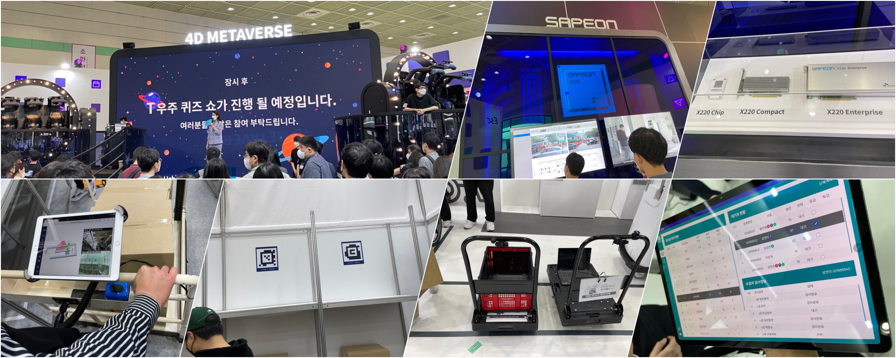
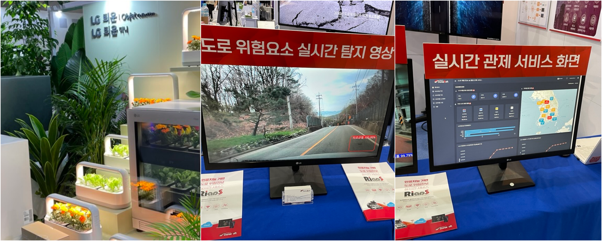
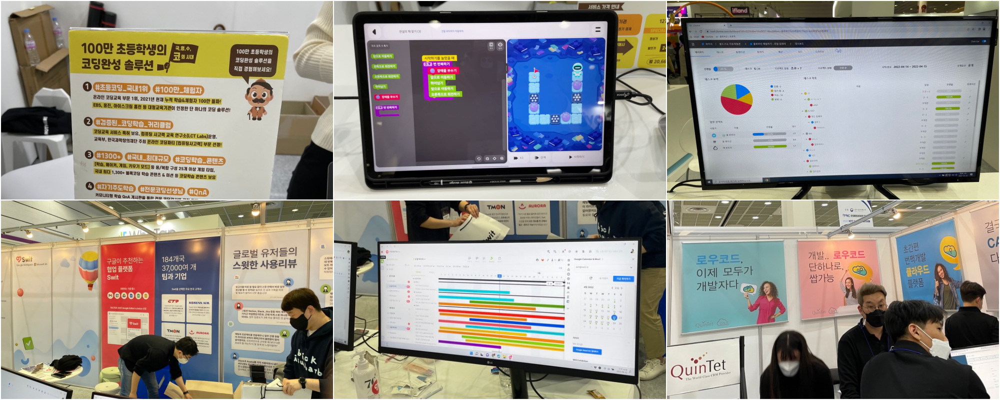
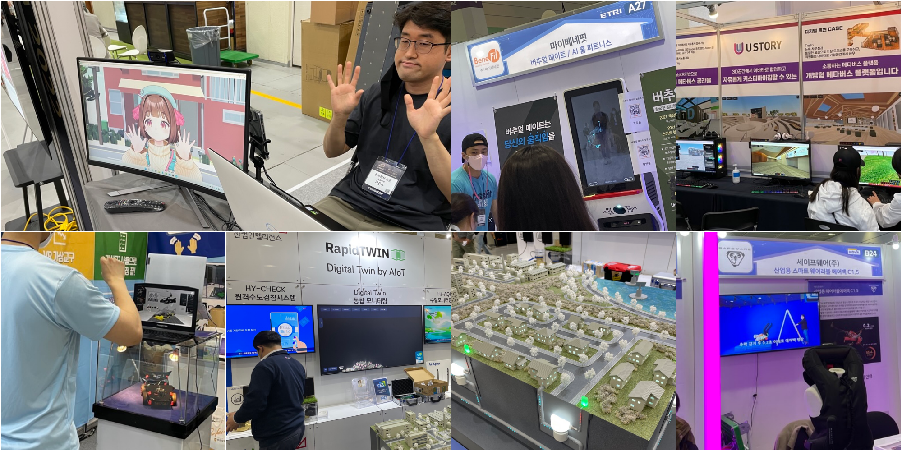
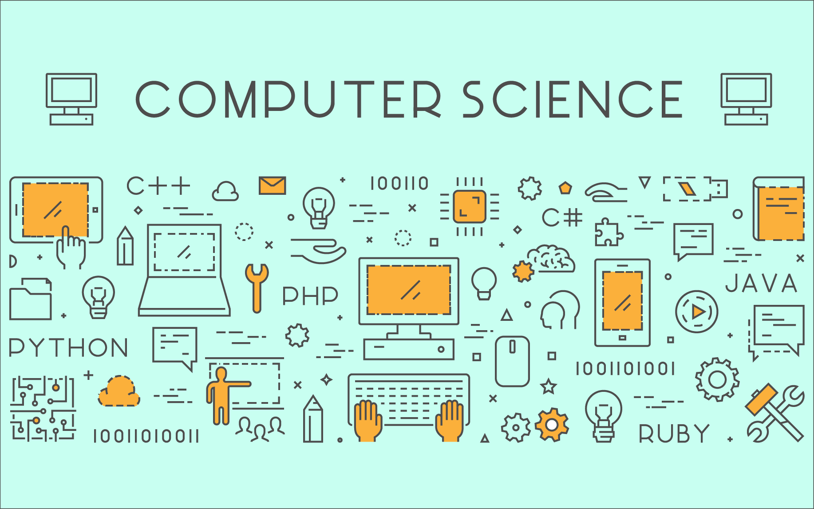
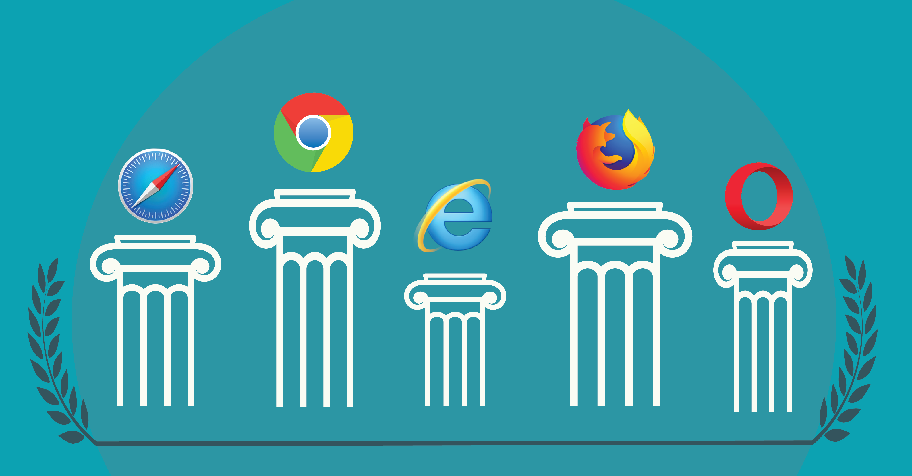

# Introduce

_World IT show 2022 전경_

2016년 1월 20일 사람들은 놀라움과 당혹감을 맞이했습니다. 이세돌 9단과 사람이 만든 인공지능 ‘알파고’의 대결. 바둑의 경우의 수는 대략 10의 171제곱이 되는데, 알파고는 인간의 지적 능력을, 복합적 사고능력을 갖추는 데 성공했다는 증거를 보여줍니다. 또 2020년 보스턴 다이내믹스(Boston Dynamics)는 로봇 ‘스팟’을 공개, 2020년 6월 ‘상업적’ 판매를 본격적으로 시작하면서 인간이 생각하는 다양한 기능을 할 수 있는 다목적성 로봇이 현실화, 상업화되었습니다.

이 밖에도 단백질 폴딩을 예측하는 것이 가능케 된 인공지능 알파폴드2(Alphafold2)는 현대 의학 50년 동안 풀리지 않던 단백질 접힘 문제의 실마리를 찾았습니다. 또한 AI-GPT3 라는 오픈AI는 자연어 처리 AI로 개발되었고 스스로 모르는 언어임에도 학습하여 성공적인 코딩을 작업을 보여주었습니다. 해당 AI를 활용하여 문학작품을 작성하는 것도 실현되었습니다. 그로 인해 LCNC(Low-Code / No-Code)의 시대가 코앞까지 왔음을 보여주었습니다. 2020년 9월에는 이 인공지능이 ‘스스로’에 대한 칼럼을 작성하여, 당시 가디언 칼럼지 상당한 주목을 얻었습니다. 국내에선 인공지능을 활용해 가수의 홀로그램을 재현한 콘서트, AI가 신문 기사를 작성하게 도입되는 등의 일이 일어나고 있습니다. SW와 HW의 지속적인 진보는 과거에 상상했던 것 이상을 해내는 시기로 다가가는 현실을 그대로 보여주고 있습니다.

우리는 이렇듯 기술의 진보가 멈추지 않는 사회에서 살고 있습니다. 예시로 AI 쪽만을 언급했지만, 딥러닝이나 머신러닝 분야, 센서나 하드웨어적 발전, 더욱이 개발자적으로 봤을 때는 효율적이면서도 기계어에 가까운 퍼포먼스를 보여주는 언어의 등장 등, 더 이상 소프트웨어의 파워, 이와 연합한 하드웨어의 진보는 끝을 알 수 없는 속도로 발전하고 있습니다. 개발의 끝은 없으며, 개발자의 존재는 더 이상 ‘특수’의 개념이 아니라 ‘필연’의 개념이 되었습니다.

그렇기에 우리는 개발자를 지향하고 혹은 그런 소양을 갖추고 싶어 합니다. SW의 능력을 이해했기에 이 자리에서 수학(**修學**)을 마다하지 않습니다. 이 42 서울이라는 공간에서 무엇을 얻고 있으며, 무엇을 위한 공부, 개발을 마다하지 않고 있는가. 이 시대에서 가장 필요시 되는 존재들이 되기 위해 밤을 설치며, 새벽을 마주합니다. 커피는 친구 그 이상이 되고, 구현이 성공될 때마다 후련하면서도 달성했다는 쾌감으로 미소를 짓습니다.

그러나 동시에 우리에겐 가슴 한편에 혼란이 있습니다. 배워야 하고, 해야 할 일은 많습니다. 창업하시고 싶으신 분들에겐 항상 상업적이면서 새롭고 현실적인 아이템에 대한 갈망이 끊임없습니다. 회사에 들어가려고 하시는 분들도 시장상황에 대한 이해를 해야 ‘내가 가야 할 길’과 ‘내가 가고 싶은 길’을 구체화 할 텐데, 이젠 인간의 인지 능력 밖에서 너무나 많은 발전과 진보, 다양성이 나타나고 있습니다. 무언가를 고르기 어렵기 때문에 배워야 하는 순간이 오고 말았습니다. 이런 점이 제가 WIS2022를 방문하게 된 이유입니다. 우리의 현주소, 우리가 있는 이 공간에서 취업이나 창업으로 새로운 삶을 준비하는 예비 혹은 현직 개발자로서의 위치와 역할을 알기 위해, 이곳의 분위기와 개인적 감상을 담아 이야기를 나눠보고자 합니다.

# World IT Show 2022

World IT Show 2022(WIS)는 한국 과학기술정보통신부 주최 코엑스에서 진행하는 최신 ICT 기술 및 트랜드 공개 행사입니다. 400여 개의 회사가 모였으며, 각종 비즈니스적, 기술적 쇼케이스 행사를 통해 현재의 트랜드를 느끼기엔 충분한 행사였습니다. 4월 20일부터 21일 이틀간은 기업들이나 기업에 속한 분들을 위한 시간으로 마련되었으며, 일반인들에 대해선 22일 하루 관람의 기회가 제공되었기에 저를 포함한 일행은 22일 금요일 대략 11시부터 행사에 참여했습니다.

이 행사의 주된 키워드는 총 다섯 개로 `Untact Technology`, `AI 및 IoT& ICT 융합 서비스`, `디지털트윈&메타버스`, `스마트 디바이스`, `사이버보안 및 블록체인`으로 어느 것 하나, 최근의 상황에선 빼놓을 수 없는 주제였습니다.  각종 기업이나 연구단체, 기술 연구 분야 쪽의 대학원에서의 참가가 주를 이루었으며, 22일 아침부터 몰려온 사람들의 행렬이 상당했다는 점에서 얼마나 많은 사람이 이 행사에 관심이 있었는지를 짐작게 했습니다. 어느 정도 규모가 있는 업체들의 경우 코엑스 3층 홀을 따로 마련하여 전시가 진행되었으며, 중소 및 중견기업들과 대학원들의 연구 발표는 1층에서 진행되었습니다.

## 의의와 한계

먼저 일행과 함께 찾아간 것은 iTRC 인재양성대전 2022에 참여한 대학 부스였습니다. 그곳도 WIS의 주제에 맞춰 구분된 7개의 부스로 이루어져 있었습니다. 각 대학의 교수님들과 대학원생 및 함께 연구에 보조를 한 학부생들의 노력이 느껴지는 곳이었습니다. 굉장히 흥미로운 연구들이 있다는 점과 동시에 현재 기술적인 '한계’는 어디에 있는가에 대한 고민을 할 수 있었습니다.

_실제 사람같은 피부 질감표현이 인상적이었던 연구 사례였습니다._

예를 들면, 성균관대학교에서는 영상 경계특성과 인공지능 기술을 활용하여 딥페이크의 구현 기술 혹은 그러한 영상을 탐지해 내는 기술을 구현해냈습니다. 가상의 얼굴 이미지를 옵션 단 2개로 늙거나, 감정표현을 합성해내는 것은 상당히 놀랄 만큼 정교했으며, 컴퓨터가 만들어냈다고 생각하기 어려울 정도의 품질을 보여주었습니다. 과거 3D FX 기술로 천문학적인 돈을 들이는 전문 업체에서나 해내던 수준의 그래픽 합성이 대학원 수준에서 구현된다는 점만 보더라도 영상 컨텐츠 분야에서 활용 및 사회적 문제 해결에 충분한 가치가 있어 보였습니다. 우리 사회에 당장 적용 및 현재의 문제를 개선이 가능한 소재였습니다.

이렇게 의미 있고 동시에 실체화 할 수 있는 요소도 있었지만, 그렇지 않은 경우도 있었습니다. VR의 3D 환경에서 사물을 느끼게 만들려는 연구, VR을 활용한 뇌 질병 환자들에 대한 치료 기술을 개발하는 연구 등도 근처에서 있었지만 이에 대해선 ‘대단하다'와 동시에 ‘한계'가 있겠다고 생각했습니다.

‘VR 오브젝트의 피드백을 현실화하는 장치’의 시연품의 경우 모터를 여러 축으로 연결하고 사람의 손가락의 끝에 3D프린터로 출력한 파츠로 구성되어 있었습니다. 기존 해외 기업들에서 프로토타입들로 공개했던 장치의 경우 손가락마다 줄로 연결하여 이를 통해 저항감을 주고 실제 물건을 만지는 듯한 VR 피드백 디바이스가 있었습니다. 그러나 기존 프로토타입들은 실의 장력으로 꽤 ‘무언가 있다’라는 느낌을 주긴 했지만, 실물을 만진다는 느낌은 받지 못했습니다. 하지만 해당 기기는 마치 ‘만지는 것’ 같은 기분을 일으켰습니다. 3D 객체 표면에 손가락이 닿을 때의 저항감이 느껴질 뿐만 아니라, 손가락과 닻은 부분에서 돌아가는 3D 사출물이 적정 속도로 돌아감으로써 마찰감을 구현하였습니다. 이를 통해 실제 오브젝트를 만질 때 표면의 질감, 저항감과 유사한 경험을 제공했습니다. VR 컨텐츠가 갖고 있던 한계를 좀 더 구체적이고 현실적으로 해결하려는 노력이 엿보였습니다.

_정말 실제같았으나, 너무 크고 아름다운 장치의 모습..._

그러나 이러한 구현이 왜 실제 기업들이 나서지 않는가? 를 생각하면 해당 연구가 가진 의의와 한계를 명확히 볼 수 있습니다. 기기의 무게나 다중 모터를 사용함에 따른 내구성, 소음 등 소비자에게 돌아가는 부담이나, 실제 구현을 위한 인력, 코스트 문제가 있었습니다. 결정적으로 SW가 그것에 대한 대응을 일일히 하지 않으면 사용하기 어렵다는 측면에서 미래 산업, 메타버스라는 이름으로 각광을 받지만 동시에 우리가 사는 물질세계에 제대로 뿌리 박기엔 아직 멀었다는 아쉬움이 느껴졌습니다. SW 개발자들을 수 십, 수 만 명을 가져온다고 해도 VR 컨텐츠를 만드는 것보다 일일이 컨텐츠마다의 오브젝트 피드백을 최적화시키기 위한 작업을 할 수 있을까? 우선순위적 사고에서 본다면 실제 상용화 되는 건 어지간한 투자가 없이는 쉽지 않아보였습니다.

뇌 질환자를 위한 연구의 경우도 VR 컨텐츠로 공간 제약 없이 심리적 안정을 제공하거나, 인지능력을 확장시킨다는 학술적 결과들은 존재했습니다. 그렇기에 이를 위한 연구 노력의 의미는 상당하다고 볼 수 있습니다. 예를 들어 기술에 적응할 기회가 많지 않거나, 치매, 뇌 질환이 있다고 할 때 실제 현실에 나가서 이를 연습한다는 것은 여러 제약이 따릅니다. 특히 그런 대상을 감독할 대상이 반드시 있어야 한다는 점에서 불편하신 분들을 돕지 못하는 가장 주된 이유일 것입니다. 그런데 VR 세상에 여러 기기 체험 컨텐츠를 구현하여(예를 들면 ATM 기기나 매장에서 사용하는 벤딩 머신등) 노인이나 뇌질환자들의 학습 체험을 가능케 하며, 심리적 안정에 효과적인 그림, 영상, 소리 컨텐츠를 더욱 현실감이 좋은 VR에 적용한다는 발상은 물리적 의료 한계를 극복하는 대안이 될 만 했습니다.

_(좌)실제게임 장면, (중간)심리테라피 체험 장면, (우하)ATM 기기 체험 컨텐츠_

그러나 한 편으로 VR의 장비의 비대함, 유선환경에서만 가능하다는 점은 당연한 한계일 것이고 해당 기술 이용을 위해 하드웨어 스펙을 최소 GTX 1080 급 이상의 그래픽 장비가 있어야 가능하다는 점은 굉장한 맹점이었습니다. (물론 해당 연구하신 분들은 이를 인지하시고, 하드웨어의 경량화 연구에 대해서도 고민하고 있다고 말씀하셨습니다.) SW 개발자적 차원에서 본다면 보다 사실감을 준다 = 의료적 효과를 극대화한다 인데, 이를 위한 개발이 이어진다면, 당연히 기기의 최소 하드웨어 스펙, 그리고 연산량 등 고려할 것이 한 두개가 아니었습니다. 제한된 하드웨어 재원에서 얼마나 기술적 최적화를 만들 수 있는가? 쉽지 않은 길임을 볼 수 있었습니다.

이런 걸 보면 현실에서의 서비스, 혹은 기술을 활용한 무언가 획기적인 것을 꿈꾸는 우리의 모습이 있지만, 여전히 ‘물리적 한계’는 우리 세상을 지배하고 있다는 점에서 실제 회사에 속하게 될 내가, 혹은 창업을 한 내가 어떤 관점으로 만들어내야 할 것들을 바라보아야 할 지를 느낄 수 있는 대목이었습니다. 매우 흥미롭지만 아쉬운, 그럼에도 여전히 필요한 연구들을 뒤로 하고 1층의 다른 쪽을 향하고, 3층을 바라보았습니다. 화려한 홍보용 전단들, 배너들 … 지금부터는 기업들이 바라본 IT의 세계, 시장에서 그들의 관심사들 중 인상깊었던 것들에 분야들에 대한 이야기를 해보고자 합니다.

## 웹, 인공지능, 머신러닝, 그리고 시장의 트렌드

### 웹, 네트워크

우선, 가장 큰 흐름은 ‘인터넷’, 네트워크를 활용한 것들이었습니다. SKT의 경우 자체 메타버스, 각종 컨텐츠 서비스 등이 있었는데 그중 인상 깊었던 것은 자체적으로 개발한 NPU(Neural Processing Unit)였습니다. 기존 GPU 대비 각종 병렬연산 처리를 보다 특화되었으며 에너지 효율성까지 끌어올린 것을 자랑스럽게 선보였습니다. KT의 경우 B2B성격이 강한 신사업들이 많이 있었습니다. 기존의 중소 자영업자들이 개별적으로 가입을 하던 B2B 서비스들의 통합적인 제공하려는데 공을 들이고 있었습니다. AI를 활용한 자연어 처리 예약 서비스, 스마트 시티 종합 관리 서비스, 스마트 물류를 위한 장비, 전동 모터를 장착한 수레를 통해 유통 물류와 관련하여 노동자들의 편의성과 효율을 끌어올리는 사례도 있었습니다. 더 나아가선 헬스 케어 시장의 성장을 의식한 듯 병원에서 효율적인 진료실 배치, 및 환자 케어를 위한 플랫폼 홍보도 보여주었습니다. 결론적으로 인터넷의 연결성을 통해 기존에도 있었지만, 사람이 하던 일들을 더욱 편리하게 만든다는 게 핵심이며 이런 점에서 각 기업은 자신들의 장점을 극대화하려는 노력이 보였습니다.

_메타버스와 사피온 NPU를 자랑하는 SKT, 좌측 하단부터 물류 시스템과 연동되는 태블릿 애플리케이션 시스템, 이를 위한 QR 방식의 라벨링, 유통 개선을 위한 전동 수레와 병원을 위한 플랫폼 시연 장면입니다._

### 인공지능과 머신러닝

그 다음으로 부각된 분야는 인공지능, 머신러닝 분야였습니다. LG의 경우 인공지능 기술을 접목한 스마트 농업을 축소한 개인용 혹은 소규모 업소에서 사용이 가능한 식물재배기 ‘틔운’을 선보이면서 스마트 농업이라는 주제를 상당히 강조했습니다. 2D 카메라를 활용해 도로 상태를 인지하는 블랙박스를 개발한 업체도 있었으며, 이외에도 많은 업체들이 인공지능이란 용어를 통해 사람의 판단, 식별 능력과 유사한 인식을 가능케 했을 때 얻는 편리함을 강점으로 내보였습니다. 특히 ‘플랫폼’을 함께 강조하는 경우가 많았는데, 예를 들어 2D CMOS 센서를 활용한 블랙박스의 경우를 살펴보면 다음과 같습니다. 인공지능 학습으로 모바일 AP(업체는 스냅드래곤 AP를 사용하였다고 하였습니다.) 수준에서 도로 상태를 매우 정확하게 인지하는 걸 가능케 했습니다. 여기에 플랫폼 개념을 도입해 도로의 상태를 모니터링할 수가 있으니 공공 플랫폼을 통해 도로 노면을 주기적으로 점검하거나 사고 상황을 빠르게 인지, 공공재와 도로교통 모니터링에 들어갈 비용을 최소화하는 식으로 기술 이점을 홍보하려는 전략을 보여주었습니다.
_사진으로 다 담진 못했으나, 중소 국내업체에서도 틔운과 같은 스마트 농업 기기들을 선보였습니다. 중간부터는 인공지능을 활용한 블랙박스 사례 사진입니다._

### 그 밖의 것들

그 밖의 영역에서 가장 다수의 업체가 참여한 분야는 헬스케어 분야였습니다. AI를 활용한 동작 인식 기술의 헬스 파트너 기기 제조 업체 및 서비스 업체들이 상당히 있었습니다. 그뿐만 아니라 맹인이나 약시이신 분들의 안구에 하드웨어 장치를 삽입, 눈의 신경에 직접 광신호를 보내어 흑백으로나마 사물을 볼 수 있도록 만드는 기술을 개발한 업체도 있었습니다. 이렇듯 헬스케어 기술 개발이나 투자, 소프트웨어적 역량이 필요하고, 공을 들이고 있다는, 사람들의 관심사가 상당하는 것을 볼 수 있었습니다. 이 외에는 아동을 위한 코딩 학습을 위한 플랫폼, 기업의 생산성 향상을 위한 서비스 업체들이 주를 이루었으며, 일부 업체들의 경우 ‘스마트 시티'를 위한 센서 및 플랫폼에 대한 참여 업체들도 있었습니다. 이 중에 눈길을 끌었던 곳 몇 군데를 설명해 드리면 아래와 같습니다.

_그 밖에도 정말 많은 아이템들이 있었습니다. 협업툴로 참여한 기업도 확인한 곳만 3곳이나 됩니다._

1. CODMOS : 화려한 비주얼, 아동 학습 효과를 끌어 올리고자 UI, UX 연구에 공을 들인게 보였으며, 직접 코딩을 한 결과만 그래픽으로 보여주는 게 아니라 실제 작성된 자바스크립트 코드를 보여줌으로써 교육적 효과를 극대화하려는 노력이 느껴짐. 코딩은 ‘스스로’ 할 수도 있겠지만, 부모의 관리 밖에서 체계적으로 ‘아이들’을 교육한다는 점에서 괜찮은 서비스라고 생각되었습니다.

2. Swit(Work OS) : 구글의 협업 툴의 서비스를 200% 이상 활용할 수 있도록 만든 서비스입니다. 각종 구글 서비스를 위젯화하여 각 서비스를 원하는 대로 개인화하는 기술을 선보였습니다. 잘 다듬어진 대쉬보드로 목표 달성, 과업 수행을 위한 관리툴로 굉장히 괜찮은 모양새를 보여주었습니다. 위젯은 드래그 & 드롭 방식으로 구글 서비스에 접근 및 공유하도록 만들었습니다. 웹앱 내부에 웹 페이지를 검색하거나 접속하는 것도 가능케 하여서, 해당 어플리케이션을 통해 대부분의 사무, 행정직무, 개발이나 조직적 직무 이행에 필요한 업무를 위한 통합 플랫폼화하려는 굉장한 노력이 엿보였습니다. 해당 업체에서는 그렇기에 ‘Work OS’라고 자칭하기도 했습니다.

3. 한컴 인텔리전스 : 스마트 시티를 위한 가장 현실적 대안을 제시했습니다. 협력업체로부터 제작된 센서류, 카메라 장비를 통해 기존의 계량기, 측정 도구들을 그대로 두고 간단한 추가 설비로 디지털화, 위변조 불가능한 구조로 스마트 시티 개념을 활성화하려는 모습이 보였습니다. 전기를 비롯한 사회적 공공자원들을 계량하고 디지털화, 대기질, 수질 등의 인간 생활의 민감한 정보들을 통합적으로 모니터링 하는 서비스도 시연하였습니다. 비용 차원에서도, 설치나 현실에서 이를 관리하실 분들에 대해서 생각하면 WIS 2022 내에서 가장 현실적인 스마트시티의 모델을 제시한 것으로 생각됩니다.

_좌측상단부터, 우리들의 미래(..)를 모션 디텍터 없이 아이폰과 기성 센서 하나로 해결한 모습. 운동 모션 인식 서비스, 웹에서 구현한 메타버스 서비스, 노트북 2D 카메라로 동작인식을 구현, 손모양으로 장난감 조립을 가능하게 만든 서비스, 한컴 인텔리전스의 스마트 시티 구현 모습, 낙하감지가 되면 자동으로 펴지는 에어백 등_

# WIS가 나에게 남기고 간 것

WIS2022에선 현재의 시장 트랜드를 활용한 회사들의 서비스나 기획, 제공하는 제품들을 볼 수 있었습니다. 이들은 사람의 삶을 윤택하게 만들기 위해 초점을 맞춰둔 것을 확실히 엿 볼 수 있었습니다. 그것이 큰 혁신이든 사람의 삶에 사소한 것이라고 해도, 이러한 서비스나 제품이 쌓여 우리가 사는 현재를 만들었다는 것을 알기에, 하나하나가 사람들의 빛나는 작품이라 생각이 들었습니다. 그러나 그런 감상 하나를 위해 이런 글을 쓴 것은 아닙니다. 결국 ‘개발자’가 되어가는 우리들의 입장에서 필요한 것이 무엇인가. 이에 대한 고민과 나름의 생각, ‘생존 전략’들을 풀어내기 위함이지요.

## Computing Science를 알아야 하는 이유



소프트웨어 개발자, 프로그래머의 역할은 어디에 있는가, 먼저 생각한 것은 ‘근본'이 얼마나 중요해지는가? 에 대한 생각이었습니다. 개발을 위해 필요한 기술을 깃헙이나, 커뮤니티를 통해 빠르게 파악하고 적용하는 등, 급한 길을 빠르게 해결하는 방식도 필요합니다. 실제 사회에서, 회사에서 우리가 만나는 문제 해결의 대다수는 그런 방식입니다. 효율성과 현재를 빠르게 인지하고 일 처리를 한다는 관점에선 이런 빠른 문제해결 방법은 쓸 줄 아는 것이 곧 능력입니다. 하지만 이번 행사 속에서 볼 수 있던 부분은 기술이나 기계가 ‘사람'을 인지하는 데서 비롯되었다는 점에서 다른 인사이트를 제시하기도 합니다. 사람의 몸동작을 인식하고, 위치를 인식하고, 패턴을 인식하고 보다 효율적인 쪽으로 끌어당김은 상당히 중요한 비즈니스 포인트라고 느낄 수 있었습니다. 그러다 보니 센서류, ARM 기반의 소형 아키텍쳐를 적극적으로 활용하는 경우를 이번 WIS 쇼케이스에서 더더욱 느껴졌습니다. SKT가 서버의 효율을 생각해 NPU를 만들고, 다수 인공지능 활용 업체에선 ARM 기반의 디바이스를 활용했습니다. 여기서 눈에 띄는 점이 ‘잘 만든 기술’은 해당 제품을 사야 하는 ‘대상’의 경제력에 맞춘 적절한 가격, 규모, 크기로 사용될 환경에서 불편함을 ‘최소화’ 시켰다는 점입니다. 센서나 장치가 소형화가 되지 않으면 거추장스럽고, 오히려 역으로 소비자로부터 외면당할 것을 많은 업체의 공통된 생각으로 보였습니다. 그 말은 서비스나 하드웨어의 영혼이라 할 수 있는 소프트웨어 역시 이런 ‘제한된 상황’에서 어떻게 ‘기능, 성능을 극한’으로 끌어 올릴 수 있는가? 라는 점이 가장 최 앞선에서 필요한 덕목임을 새삼 깨달았습니다. 예전보다 코딩이 쉬워지고, 개발환경이 발전되어갑니다. 하지만 NCLC 라는 말처럼, 쉬운 개발, 쉬운 환경에서의 코딩은 점점 개발자의 영역이 아니게 되고 있습니다. 컴퓨터 하드웨어로 밀어붙이는 트랜드가 분명 존재하지만, 오히려 가장 빛나고 가장 최선의 제품 혹은 서비스는 CS 지식, 협소한 구동 환경에, 보다 최적화가 요구되는 서비스나 하드웨어가 될 것으로 보였습니다. 이에 적응하고, 더욱 효과적인 프로그래밍을 이해하는 것이 개발자로서, 그 실력을 증명하는데 필요한 덕목이 되리란 생각을 했습니다.

## 나에게 웹이란



두 번째 포인트는 여전히 강력한 ‘웹’입니다. 많은 업체는 결국 본질적으로 소비자나 기업에 대해 ‘정보의 재생산 혹은 재조합’이란 포인트를 셀링포인트를 잡는게 보였습니다. 단순히 데이터를 쌓고, 데이터를 분석하는 툴은 지금까지 많았습니다. 그러므로 기업이든 개인이든 더 효율적이고 더 효과적인 상황을 만들어야 한다는 분명한 목표의식을 갖고 있었습니다. 기업용 생산성 앱들은 이런 상황에서 기존 서비스를 재정렬하는 행동, 그것만으로도 엄청난 협업툴의 가치를 갖추었습니다. 그러나 살아남기 위해 웹상에서 드래그&드롭으로 레거시 웹 컨텐츠들조차 이동할 수 있는 위젯화 시키는 노력까지 들이지 않았습니까? 이런 업체들의 노력에서 웹 개발이 가지는 무게감, 필요성 등은 너무나 분명해 보였습니다. 최적화만 된다면 OS를 타지 않고, 브라우저를 통해 구동이 가능한 장점 등… 이런 현재의 시장에서 살아남거나 주도적 입장을 원하는 개발자라고 한다면 의미하는 바는 명백해 보였습니다. 스마트 시티에 대한 도전을 하는 업체들 사이에선 정보들을 종합하는 관제 시스템을 구축 = 웹으로 구현 이 기본처럼 여겨지는 모습이었습니다. 메타버스를 활용하는 경우에도, 네이티브한 어플리케이션을 통해 접속하는 방식보단, OS 상관없이 사용이 가능한 웹 브라우저를 최대한 활용하려는 업체들의 모든 서비스 시작은 웹, 더 나아가 웹으로 다양한 것들을 구동케 하는 WebGL, 리액트와 같은 기술에 대한 이해와 필요성은 앞으로도 계속해서 필요해 보입니다.

## 시장을 바라보는 눈이란


세 번째 포인트는 신분야에 대한 냉정한 시장의 판단이었습니다. 아주 일부 블록체인이나 NFT, 메타버스 등과 같이 화두에 오른 콘텐츠를 실현한 업체들이 있었습니다. 하지만 유명무실하다고 할까요? 규모가 있거나, 제대로 해당 내용을 완성시킨 업체들은 많지 않아 보였습니다. 메타버스 플랫폼에 대한 부분은 그나마 구현하고 서비스를 시작하려는 업체들이 있었지만, 블록체인과 NFT의 경우 주목의 대상이지만 동시에 보는 관객에게 ‘인정’ 받지 못하는 분위기였습니다. 처음엔 의아했습니다. 하지만 해당 관련 내용부스를 보고 금세 돌아가는 관람객들의 모습, 현재 가장 최 앞단에서 우리나라 IT 분야에 도전하거나, 자리매김하려는 업체들의 참여는 없어 보였습니다. 이에 대한 답, 분명 투자가 존재하고 어느 정도 신기술과 신시장에 대한 가능성이 엿보임에도 여전히 그 시장의 활성화가 눈에 띄지 않는 이유는 어디에 있는가? 곰곰이 그런 기술 업체 부스들을 한참을 바라보다가 어느 정도 감이 온다는 생각이 들었습니다.

이원부 동국대 경영정보학 교수님은 올해 2월 인터뷰에서 이런 이야기를 하셨습니다.

> "블록체인의 역기능도 존재 한다. 첫째 블록체인에 저장된 정보나 거래내역 기록은 절대 위·변조가 불가능하지만 기록되기 전 데이터의 무결성에 대한 보장은 없다. 예를 들면 블록체인 원산지 증명의 경우 생태계 외 불법 참여자들의 위·변조 행위는 방어가 가능하지만 내부인들의 담합에 의한 무결성 침해는 막을 방도가 없다. 둘째 암호화폐 지감의 거래소 위탁에 따른 해킹 발생과 같이 블록체인과 기존 전산시스템의 온·오프라인 연동에 대한 대비가 난이하다. 거래소의 중앙집중식 데이터 관리로 정작 블록체인 데이터의 무결성이 침해될 수 있다. 셋째 분산원장을 통한 데이터 공동 관리는 거래 처리 속도와 저장 용량 문제가 있어 적용이 불가한 업무 영역도 존재한다. 이 같은 문제점을 보완하기 위해 집중적 연구와 노력이 진행되고 있어 가시적인 성과를 기대해 본다.
>
> **결론적으로 블록체인 기술과 철학에 대한 균형적 이해를 바탕으로 최적화된 용처 발굴과 활용방안 정립이 필요하다.**" - 전자신문 블록체인 칼럼(2022.02.22)

현재의 가장 핫한 기술들에 대한 기대와 현실 사에어서 최적의 용처가 확보된 것이 아닙니다. 설령 이에 대한 한창의 관심이 존재할 순 있지만, 기존 물리 세계를 뒤집어 물리 세계의 한 자리를 확실하게 차지하기엔 여전히 아쉬움이 있습니다. NFT 거래가 현실화하여 실제로 제공되는 경우도 있지만 그런 사례 중 구매 이후에 가격이 급락하여, NFT로서 가치를 잃는 사례들도 너무나 많이 들려오고 있습니다. 여전히 공허한 울림과 시장의 판단. 개발자들이 이것을 현실이 될 수 있으면 하는 희망도 있겠지만, 아직은 ‘그 중간 어딘가’라는 게 느껴졌습니다. 그 사이에서 어떤 결론이 나올지 아무도 모릅니다. 이것이 현실을 뒤집어 놓을 가능성도 분명 충분히 생각해 볼 만합니다. 하지만 동시에 그런 불확실성에 무언가 ‘확신'을 가지는 것은 대단히 위험하다는, 더욱 신중하고 깊이 있는 고민으로 기술의 가치를 만들어가야 할 것이라는 생각이 머릿속을 스치는 순간이었습니다. WIS 컨퍼런스에서 보여준 모습이나, 업체들이 보여주는 상품, 서비스들은 분명히 냉정했습니다. 도전할 수 있고 구현할 수 있는 것은 한 없이 적극적이었지만, 그렇지 못한 것들은 그렇지 못했죠.

### 진짜 개발이란 무엇일까?

마지막으로 IT 산업이라는 것에 대한 ‘스테레오 타입(고정관념)'과 ‘현실'을 명확히 인지하는 것이 내가 앞으로 살아갈 공간에 대한 이해를 높이겠다- 는 생각을 했습니다. IT는 이젠 우리 사회와 너무나 밀접한 관계가 있습니다. 더 이상 이를 떼놓고 사회의 발전을 이야기 할 수 없는 시점까지 왔습니다. 과거 정치구조나, 사회구조, 다양한 사회학적, 정치적, 역사적 요소들이 사회의 변화 척도였다면 이젠 IT를 통한 민주화, IT를 통한 사회 현실의 통합과 체계화가 사회를 구분 짓는 척도가 되어가며, 사람들은 이것을 당연하게 받아들였습니다. 그러다 보니 우리의 인식에서 IT는 도전과 새로움이 공존한다고 생각합니다. 선구자의 의미를 지니기도 한다고 생각합니다.

하지만 WIS에 나온 시장, 현업에서의 IT는 분명히 다른 점이 있습니다. 이는 무엇보다도 산업에서 설령 개발 중심인 것이라고 해도 ‘구현 가능성'과 ‘시장 가능성'이라는 두 가지 큰 기준에서 고정관념과 소비자의 생각은 다르다는 점입니다. 위에서 언급한 한컴 인텔리전스의 스마트 시티 센서 모듈과 플랫폼, SKT의 NPU 사피온, KT의 인터넷망을 활용한 서비스나 유통 물류 분야에 대한 도전 등은 우리가 생각하는 화려하거나, 거창한 기술적 최첨단을 생각해보겠지만, 그것보다는 실제 사회에서 현재 가장 필요한, 발전 가능성이 있는 곳을 공략하는 모습을 보였습니다. 설령 이러한 하이리스크 하이리턴(High-risk and High-return)의 도전이 스타트업에 전유물이라고 하더라도 말이지요. 개발을 하고자 하는 우리가 가져야 할 기술적 ‘실력’과 동시에 알아야 하는 ‘실물’을 바라보는 시각. WIS는 이 두 가지를 볼 수 있던 좋은 기회였다고 생각합니다.

# Epilogue

이번 컨퍼런스 한 번을 통해 현재의 시장의 트랜드나, 상황, 그리고 확대 해석해서는 안됩니다. 여기서 온점을 찍는 오만함은 지금 제가 가져야할 덕목은 아니라 생각합니다. 더불어 실시간으로 변하는 기술, 완숙해져가는 상황이라고 한다면 1달 뒤, 1년 뒤에는 기존에 신중하게 봐야 하던 것들이 현실화할 수도 있습니다. 그러나 넷플릭스가 루비를 통해 시작하여 다시 레거시한 방식으로 서비스하게 된 것도, 기존의 PDA로 나온 기술들이 이미 있었지만, 이를 모아 집대성을 아이폰이 달성한 것과 같이, 사회에서 바라는 기술상은 우리의 생각과는 다르게 갈 때도 있고, 그 과정에서의 개선의 연속이 곧 크게 보면 혁신이 될 수 있다는 점을 새기면서, 개발자는 거기서 어떤 생각과 끊임없는 자기 성장이 필요하다고 생각하게 됩니다. 이번에 이런 좋은 기회를 제공해주었던 silee 님의 제안과, NCLC 특강을 통해 영감을 가야 할 길, 미래를 보는 냉정한 시각을 제공해주신 김영욱 멘토님께 감사 인사를 드리며 이만 글을 줄이고자 합니다.

```toc

```
