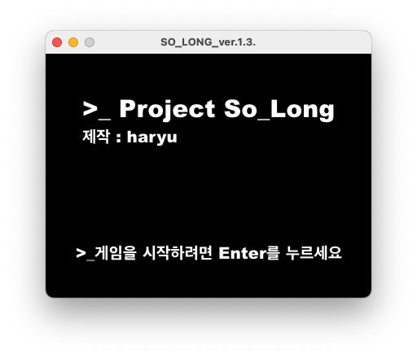
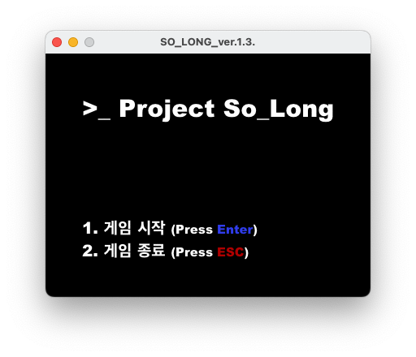
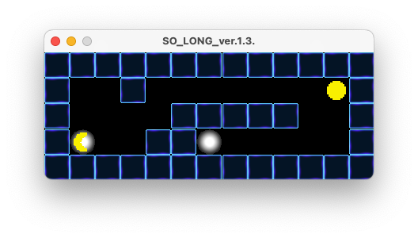
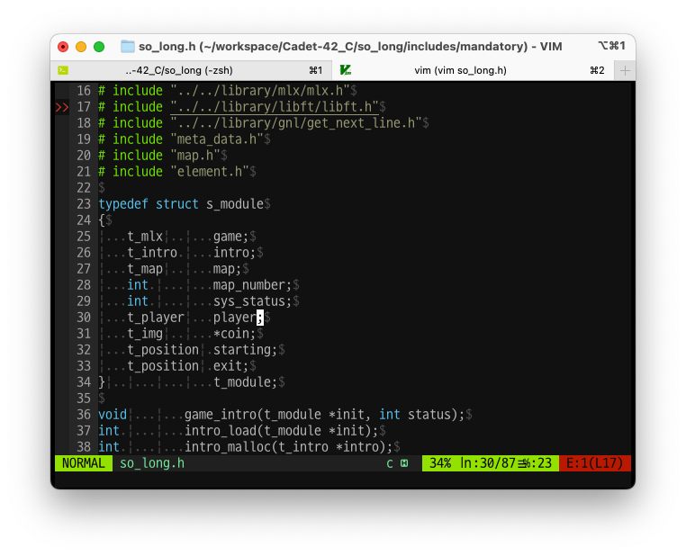
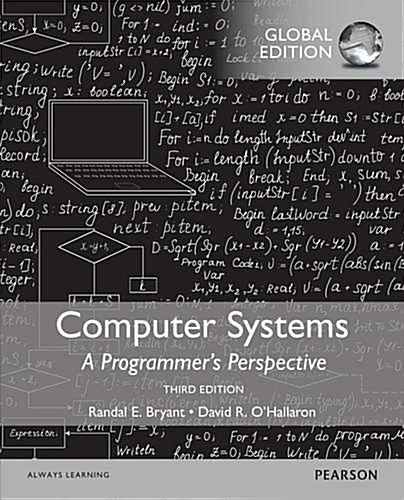
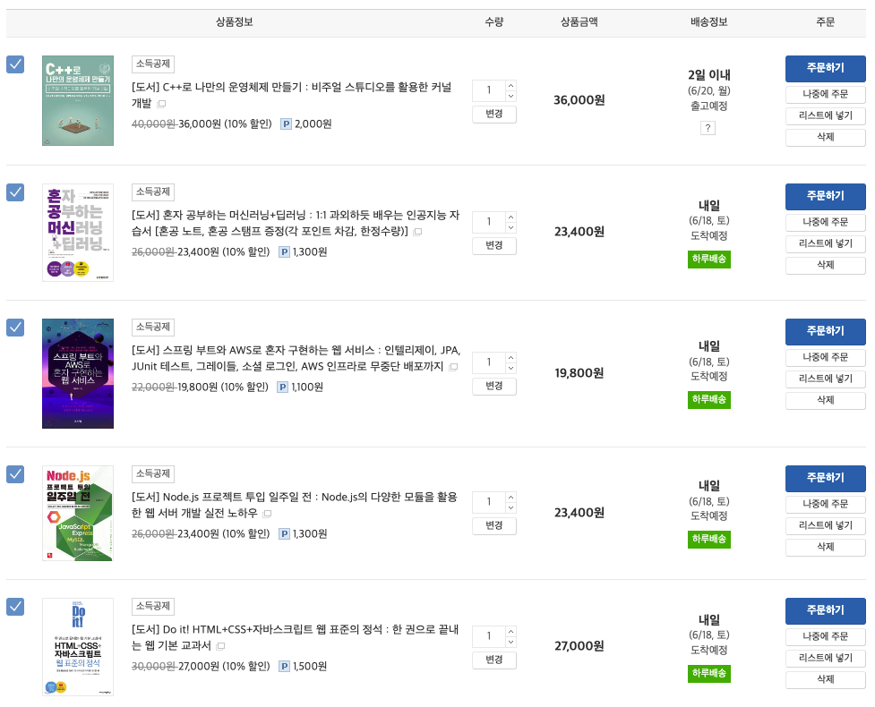

# 다음을 고민하는 나의 몸부림을 보아라...!

## 42서울 6개월 차 카뎃이 남겨보는 생존일기

제목이 너무 중2병 스럽지 않나- 생각해보기는 했다. 하지만 다른 이름이 떠오르진 않았다. 마치 일본의 라노벨 같으면서도, 어딘가의 운동가가 선동하듯 온점 3개와 느낌표 한 개가 만들어주는 힘은, 생각보다 마음에 들었기에 그대로 써 보기로 했다. 중2병이긴 하지만, 나쁘지 않지 않은가? 세상에 중2병 한 명정도 있어도 세상은 잘 돌아가니까.

작년 11월, 42서울에 처음 카뎃이 되어 들어왔을 때 눈 앞에 펼쳐진 당혹감, 동시에 뭔지 모를 열정은 정말 충만했다. 아무 것도 모르고, C의 기본 겨우 땐 듯 보이는 내 상황에서 뭐가 그리 자신감이 넘쳤는지, 혹은 교만했는지는 모르겠지만 그런 시작이 굉장히 기대되었었고, 실제로 본 과정에 들어갔다는 사실 정도만으로도 나는 프로그래머가 된 기분이었다.

하지만 생각해보면 그렇다. 정신없이 달려오면서 과연 언제 한 번 제대로 정리했던가? 그렇진 못했다. 바쁘다는 핑계를 대긴 하지만 그걸 부정하는 내 유튜브 시청 기록만 보더라도 나의 삶은 완벽한 노력과는 거리가 멀었고, 성장의 수준은 부족하다고 솔직하게 인정하고 싶다.

So_Long 과제를 끝낼 때까지 늘어나지 않는 속도, 복잡함에 흔들리는 멘탈. 본 과정에서 굵은 내 성대와 성량이 쩌렁쩌렁 사람들과 이야기 할 때 자신감을 보여주었지만, 그것이 전부는 아니었다. 그 속에 좌절, 특히나 내가 못하는게 아닌가 라는 불안감은 지속적으로 나를 괴롭혔고, 그런 상황에서 현실을 도피할 겸 제대로 직면하지 않았던 것이 문뜩 지금 떠올랐다. 그렇기에 이렇게 글을 적어보게 된다.




## 인지력의 한계

_구조체의 활용에 대해 여기서 겨우 감을 얻었다._

첫 그래픽 과제를 시점으로 정말 힘들었다. 인지력의 한계였다. 어떤 구조에, 어떤 걸 변수로 삼고 진행하는가... 라는 것에 대해 수 십개의 구조체를 사용해야 했고, 그 구조체들 사이에 유기적인 연결고리를 만들고, 컴퓨터가 할 일을 어떻게 짜를까에 대한 고민은 뒤죽박죽 엉망이 되었었다. 그 결과는 너무나 자명했다. 2개월의 그래픽 과제 진행은 내 부족을 명확하게 보여주는 대목이었다.

그땐 정말 이걸 그만둬야 하는가? 라는 생각에 잠기는 경우가 많았다. 공부를 안하고 있자니 불안하고, 돈도 없으니 나가 놀지도 못하는 상황, 반지하방에 갇혀 오만 생각을 다했다.

그럼에도 감사했던 것은 그런 나의 우울감을 밀어내줄 동료들이 있었고, 동료들과 선택한 시작 포인트. `CS`에 대한 내용을 조금씩이나마 소화시키기 시작한 이후로 위기는 곧 기회라는 생각을 다시금 할 수 있었다.

Computer Science라는 것. 처음 42서울을 들어올 때 선배들 일부는 그런 이야기를 했다. CS가 중요하지 않거나, 42과제가 취업에 도움이 안 된다고. 처음에 나는 그것에 많이 휘둘렸다. 취업을 위해서 여기까지 포기하고 노력해왔으며, 달려왔다. 그러니 손해보는 행동은 하기 싫었다. 계획과 계산이 가장 중요한 순간이라고 스스로를 되내이고 있었기에 확실히 CS 지식을 공부를 한다거나 42서울의 과제가 나에게 줄수 있는 **무언가**에 대해선 대단히 비판적일 수 밖에 없었다.

하지만 점점 이것 저것 바라보는 과정에서 그런 생각이 들었다. 내가 처음 학생들, 고등학교에서 아래에서 공부가 뭔지도 모르고, 놀기 바뻤던 친구들이 있었다. 그들에게 내가 처음 공부를 가르치고, 그들이 노하우를 터득할 수 있게 어떻게 만들었던가? 사실 거창한 무언가가 있을것 같지만 결국은 자기 성향과 성미에 맞춰 엉덩이 오래 앉아있게 만들면서, 공부를 가능하게 만드는 기초 체력 키우기를 먼저 했지 않았는가? 하물며 프로그래밍 언어는 모르면 쓸 수 없는게 무조건이고, 그런 상황에서 지식 없이 무언가 만드는게 가능하기나 하단 말인가? 컴퓨터를 조립할 때도 사실 복합적인 지식들, 조립한다는 행위를 위한 것처럼 보이진 않지만, 결국 전체를 이해할 부분에 대한 순차적인 이해는 필수가 아니겠는가? 그런 생각이 들던 도중 만난 스터디 CS 팀은 정말 나에게 큰 기회가 되었다.

잘 하는 동료는 나의 지식의 기반이자 조력자가 되어 주었고, 함께 가는 동료는 의지 하고 함께 포기하지 않을 힘이 되어 주었다. 거기다 정말 어려운 파트 하나를 씹어 삼키고, 그걸 통해 다음 파트로 조금씩 나아갈 때면, 놀랍게도 빨라지는 이해 속도와 코드 이해 속도에서 내가 의지를 가지면 정말 빨리질 수 있구나를 비로소 체감할 수 있었다.

## 과제 .. 그리고 그 다음

덕분에 조금 더 자랑과 감사를 적어보자면, 함께하는 동료 두 명 덖에 나는 생각 이상으로 내 실력이 좋아졌음을 느낄 수 있었다. CS 지식에서 내가 처한 문제의 상황과 어디서 그걸 손을 보면 좋을지를 이해할 수 있었으며, 구조적으로 PC에 접근하여 내가 처한 상황을 빠르게 이해할 수 있었다. 특히나 프로그래밍 상에서 맞이하는 일반적인, 통상적인 경우보다 더 중요한 '예외의 상황'에 대한 이해력의 증가는 내가 생각해도 대단하다고 느낄만한 일들을 벌여주었다.

_정말 난해하고, 번역본은 번역이 좀 아쉽지만...정말 고마운 책이다._

푸시스왑을 3일 만에 해결하고, 미니톡도 그렇게 할 수 있었다. 따지고 보면 그래픽 과제도 질질 끌던 2달의 시간 중 실제 개발에 걸린 시간은 정리하면 대략 2주 정도였다. 그리고 그 과정에서 다시 한 번 이해가 되는 CS는 전보다 큰 확신을 나에게 선사했다. 그러니 함께 해준 동료와 42서울의 시스템이 진짜 원하는 바가 무엇인지 새삼 느끼는 순간이 아니었나 생각해본다.

그 뒤, 지금 나는 사람들의 말에서 어렵다 어렵다 했던 미니쉘을 마주했고, 생각보다 꿋꿋이 잘 해나가고 있다. 그래도 조금 더 열심히, 꾸준히 해나간다면 분명한 결과가 있으리라는 생각이 머릿속을 스친다.

하지만 한 가지 아쉬운 점은 있다. 그것이 바로 `다음`에 대한 부분이다. 이제 CS 공부를 위한 기초 교재이자 모두라고도 할 정도로 방대했던 CSAPP 교재가 끝이 난다. 아마 앞으로 1달이 채 안걸리지 않을까 생각해본다. 그리곤 운영체제에 대한 공부를 통해 CS를 보다 심화시킬 생각이고, 그 과정에서 틈틈히 복습도 할 예정이다. 하지만 이건 어디까지나 기초 체력에 불과하다. 체력을 끼웠으면 해야 할 일은 이제 기술을 만들어 내야 하는데, 아직은 부족하다고 느낀다. 나보다 앞서 프로젝트를 진행하는 사람들의 모습을 볼 때면 대단하기도 하고 솔직히 부럽다. 모르는 건 아니지만, 실제 프로그래밍으로 프로젝트를 진행한게 아니니, 이걸 가지고 될까? 하는 생각이 든다.

무엇보다 이런 생각에서 가장 나를 힘들게 하는 것은 역시 분야적 선택이다. 프론트 엔드와 백앤드에 대해선 익히 들어왔다. 뿐만 아니라 내 개인적인 성향 역시 너무나 잘 알고 있었다. 하지만 이걸론 부족하다. 확신이 서지 않았다. 좀더 익숙한 것은 프론트 엔드 파트의 내용이었고, 내 공부 과정에서 나는 보여지는 것에 대하여 잘 나왔을 때 기분이 좋다는 생각이 들었다. 그러니 성향적으로 프론트 쪽이 맞는 면이 있을 것 같다. 하지만 성향 체크를 또 해보면 백엔드 쪽에서도 흥미를 느끼는 분야가 있었고, 여기까지 생각이 뻗치자 퍼뜩 내가 왜 기존의 일을 그만두었던 것인가에 대한 생각이 들었다.

내가 잘 하던 직장일을 그만두었던 것은, 결국 '전문성'에 대한 부분에서였다. 내가 돈이 부족한 이상, 능력치로 내 삶을 결정짓는다고 할 때 제네럴리스트는 상당히 '좋아보인다'. 이는 다양한 문제들에 다양한 해결을 볼 수도 있고, 무엇보다 그 과정에서 다른 사람들보다 많은 일을 해낼 수 있다. 실제로 그러했다. 하지만 이는 근본적인 해결의 연속이거나, '기회를 줄 때'의 이야기였다.

예를 들면 그렇다. 선생이란 기회가 생기면, 학생을 가르친 다는 행위를 할 수 있다. 그런데 여기서 선생이란 기회는 어떻게 얻는가? 일반화 시키는 것은 좋은 습관은 아니지만, 다소 유물론적으로 본다면 결국은 '자격'이라는 결과가 그 기회를 제공한다. 즉, 선생의 경험이나 기타 다른 기술들은 물론 있어서 손해볼 일은 아니지만, 결국 선생이란 기회를 얻는 경우는 오로지 자격을 갖출 때만 가능하다는 말이다.

설령 제네럴리스트가 되고, 일을 처리하고 해결하는데 상당한 능력치가 있더라도 그 사람이 결국 얻는 기회는 '기회'를 위한 타인이나 조직으로부터의 '인정'이 없이는 결코 성사되는게 없었다. 그런 점에서 어느 누구나 할 수 있는 일, 어느 누구나 얻을 수 있는 기회에서 오히려 더 큰 기회나 가능성을 얻는다? 정말 쉽지 않은 일임을 깨달았기에 나는 기존의 잘 나가던 일들을 내려놓았고 '전문성'을 키울 길을 생각하지 않았던가?

## 그레서 내가 갈 길은 어디에?

그런 점에서 이번엔 정말 좋은 기회들을 많이 얻었다. 인천에서 제공하는 기회로 물질적인 부분이 다소 해결이 되었다. 다소 빡빡하긴 하지만 이정도면... 정말 몇 달 간은 걱정하지 않아도 될 정도라고 말할 수 있을 것 같다. 뿐만 아니라 미니쉘이 끝나고, CS 마무리가 된다면 정말 이제는 좋은 기회이자 나의 실력을 한 단계 올리고, 실무에서 사용되는 것들을 익히는 기회를 얻어야 하리라 생각이 들었다. 그러나 여전히 내 성향도 어중간한 제네럴 리스트인 상황이... 과연 옳은 일일까?

그렇기에 지금 이렇게 새벽 2시 30분을 넘어가는 시점에도 나는 키보드를 두들기고 있다. 이런 글이 다소 시원하게 만들어주기도 하지만, 동시에 내가 가야할 길을 안내해주기 때문이기도 하다. 아직 확실한 결론을 내리긴 쉽지 않아 보인다. 무엇보다 결정하기엔 정보 부족이라는게 분명하게 보인다. 거기다 현실 시장에서의 상황을 볼 때, 내가 할 일을 그렇게 쉽게 결정할 수 있겠는가? 솔직히 말하면 프론트엔드의 경우 개발자로 더 높은 기회를 얻기란 쉽지 않고, 그런 기회를 위한 노력에 필요한 방향성이 매우 진보적이며, 한 순간 한 순간 바뀌는 와중에, 개발의 우선순위 면에서도 1등이 될 수는 없지 않은가?

그런 점에서 지금은 이런 고민을 하고 있다.

1. 프론트, 백엔드 양쪽에서 필요한 기초적인 지식을 위한 학습을 진행해보자. (1달 학습 가능 교재 파보자!)
2. 그 밖에 CS를 위한, 개발을 위한 서적은 매달 10만원 정도는 할애하여 구매하고, 읽어 나가자.
3. 나 같이 고민하는 사람이 많이 있다. 그렇다면 결국 해볼 일은 '도전'해서 '둘 다' 맛 보게 만드는 수밖에 없다. 그러니 미니 프로젝트 형태로 직접 구현하고 서버를 만들어서 진행해보는 것을 직접 할 수 있도록 해보면 어떤가? 내가 가진 리딩 능력과 조율 능력을 적극 활용해볼 순간이 조만간 올 것으로 보인다.
4. 3번을 위한 멘토링 및 미니 프로젝트 만들기를 함께 해볼 사람을 찾기 + 멘토님과의 논의를 해보면 어떨까?

_우선 간단하게 살려고 준비중인 책들은 위와 같다. 우선 웹 표준 정석부터 1달 컷을 해보자..._

## 흘러가는 과정이 다소 어색하고, 부족함에도...

감사할 일들이 많다. 그리고 동시에 내가 가야하는 길 위에 카운트 다운도 존재하고 있다. 돈을 벌어야 한다. 어머니를 위해, 가족을 위해, 그리고 그 가족 너머에 내가 도와야 할 사람들과 내가 사랑할 사람을 위해 내가 할 일이 여전히 많이 있음을 느낀다.

그런데 마지막 버저비터(buzzer-beater)와 같은 느낌으로 시작한 도전이 생각보다 나에게 준수하게 맞아들어가고 있으며, 동시에 이를 위한 길들이 하나씩 열려감을 느낀다. 그러니 멈출수 없고, 내일은 다시 한 번 내가 할 일에 몰두해보고자 한다. 오만함은 버리고, 자신감은 채우고, 동시에 가야할 길에 대한 객관적이고 냉철한 판단이 필요시 된다. 실패의 두려움은 이미 떨쳐 내고자 생각하고 있으며, 있는 것은 다음의 내가 더 믿음직한 사람이 되기 위해 노력하는 것이 아니겠는가? 다시 한 번 이 새벽에 내 노력과 나를 믿는 믿음을 다지며, 한 발자국 내디뎌 보고 싶다.

```toc

```
