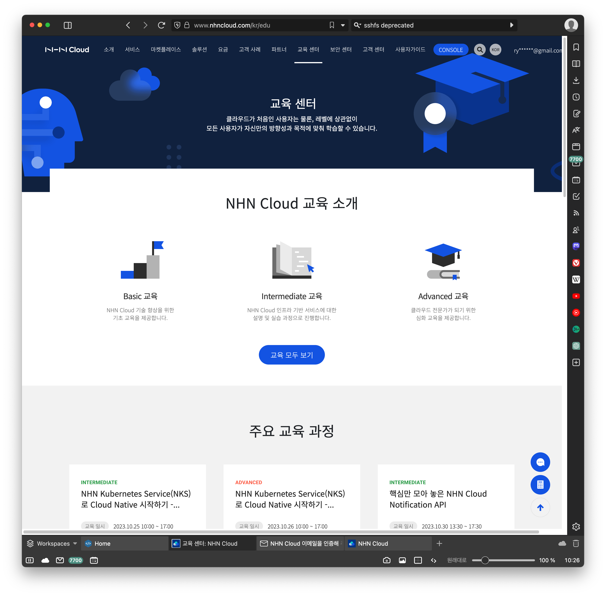
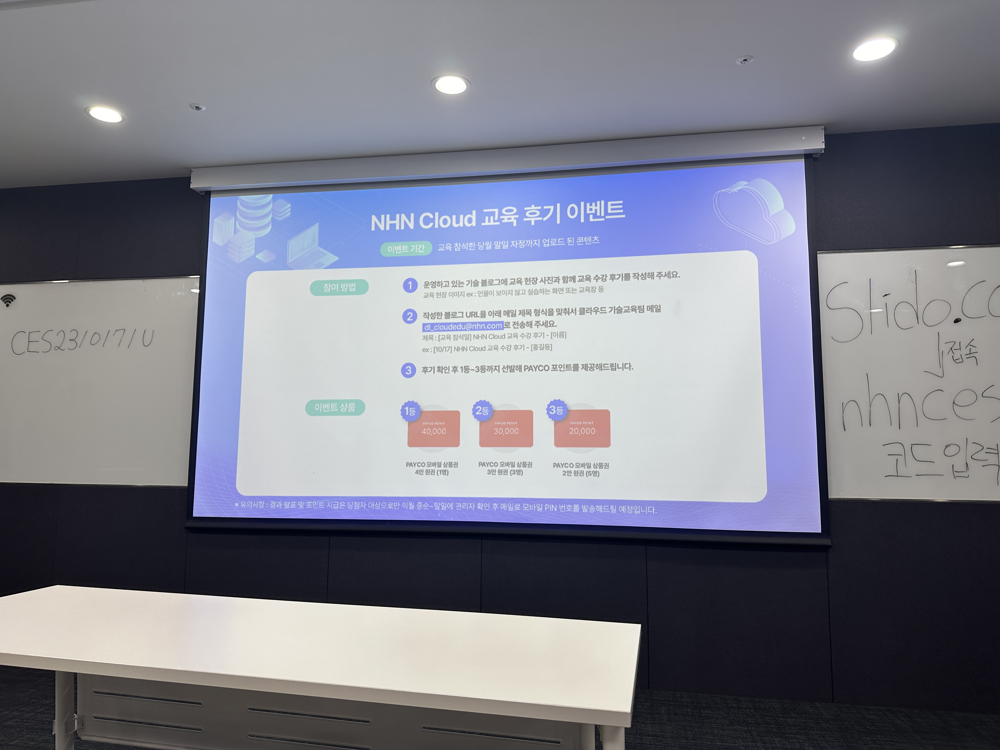
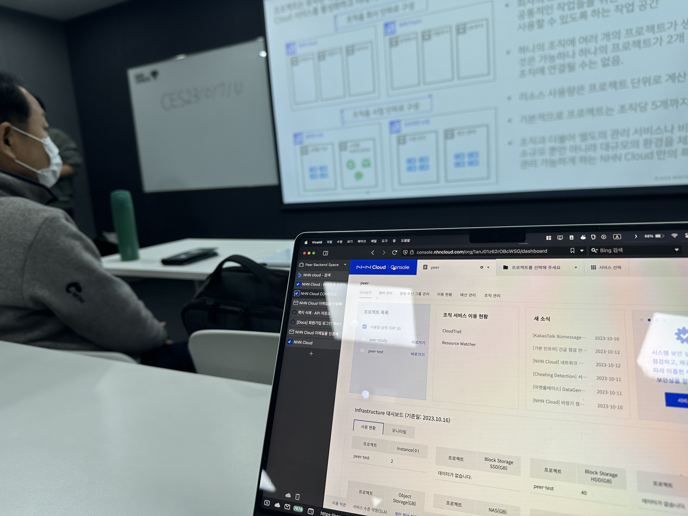
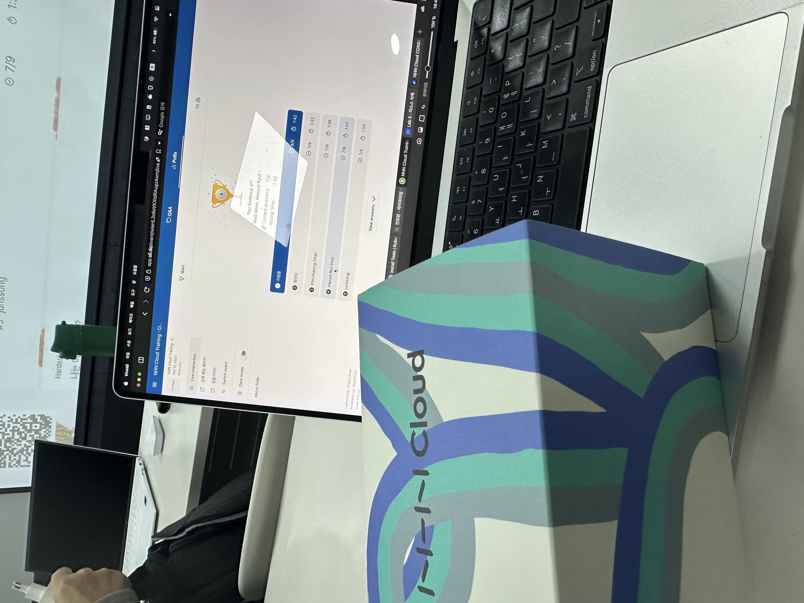

# NHN Cloud
백엔드, 즉 서버-클라이어트 형태를 구축하는데는 여러가지 방법이 있다. 한창 배우고 있는 상황에서 프로젝트 진행을 위해 해 나아가는 과정 속에서 드디어 개발되어가는 프로젝트를 어딘가에 올려야 할 상황이 왔다. 여러가지 고민의 결과 끝에 AWS 라는 아주 메인스트림도 존재하지만, nhn 클라우드 쪽도 큰 차이가 없이, 오히려 국내 서비스를 생각한다면 훨씬 이점도 있으리라 생각되어 nhn 클라우드를 활용해 보기로 했다. 

그리고 우선적으로 컨테이너들을 올리면서, 프로젝트를 준비하던 도중 교육을 같이 들으면 어떨까?라는 팀원들의 이야기가 있었고, 결론적으로 제목처럼 Basic Essential 교육을 받을 수 있었다. 


> 교육 소개 페이지 - 안은 생각보다 깨끗한걸?


> 새로산 아이폰이 화질이 아주 좋다...ㅋ

총원은 40명, 아침 9시 시작하여 18시까지라고 되어 있긴 했지만 그것보단 빠르게 끝났다. 아쉬웠던것은 실습을 위한 크레딧을 제공해주시다보니, 인원수 이상으로 수업 참가를 원칙적으로 불허하고 있었다. 덕분에 같은 팀원 한 명은 참석을 할수 없었다. 

그리하여 교육은 아침부터 시작되었고, 생각보다 빠르게 빠르게 진행되었다. 

# NHN 클라우드 그래서 어떰?

우선 강사님은 아주 만족스러웠다. 내용 설명도 잘 해주셨고, 예시를 꼬박꼬박 넣어주신것은 어쩌면 Basic 이라는 이름에 걸맞게 귀에 쏙쏙 들어오게 만들고 싶었던 것이 느껴졌고 실제로도 그러했다. 

생각해보면 내용 자체는 우리 팀원들에게는 그렇게 어렵지 않았다. 서브넷 설정, 사설망 내부에서도 어떤 식으로 공개 영역과 비공개 영역을 나눌지, 인스턴스는 뭐고, 스토리지는 뭐고, 특히나 미리 준비된 서비스들을 통해 container 이미지만 갖추면 손쉽게 서버 구현과 외부 접근 구현이 가능하다는 점은 매우 매우 쉬웠다. 

이게 바로 42서울의 노가다와 같던 로우한 내용들을 배워서 일까 싶기도 했다. 명색이 2년을 구르면서 내부 과제들을 깨는 과정에서 느꼈던 여러 현타들이 쏙 들어갈 만큼 '이래서 배우는 구나'를 느낄수 있는 순간이었다. 

하지만 그렇다고 소득이 없던 것은 전혀 아니다. 처음 nhn 클라우드에 인스턴스를 올리는 것을 팀원에게 부탁하고 내용 설계를 하고 내용을 들여다 볼 때 왜 안되지? 하던 부분들이 종종 있었는데, 사용방법을 간단하게 실습 하는 것 만으로도 "아 내가 뭘 놓쳤구나" 를 알 수 있었다. 뿐만 아니라 서비스 자체의 '기믹' 이라고 할까? 어떤 서비스를 쓰려면 어떻게 설정을 해야 하는가? 이런 영역들은 특히나 더욱이 AWS 기준으로 어느정도 배워놓고 진행하던 나에게 생소함이 있었는데 순식간에 이해가 되었다. 

오히려 좋다고 할까?

nhn 클라우드는 설정이나 기획부터가 생각보다 개발자 중심적이지 않고, 오히려 좀더 이용자 중심적이라는 생각도들 정도로 단어의 선정이나 서비스 구조가 아주 직관적으로 느껴졌다. 특히 아마존 `S3` 이렇게 불리는 것보다 `객체 스토리지` 이렇게 부르는 유사 기능들의 형태를 보면, 오히려 더 직관적이라 편하게 쓸수 있겠는걸? 하는 생각도 들었다. 물론 결국, 서비스에 직접 도입해보고, 아직까지는 문서를 찾는게 일이라는 점은 있지만 그건 뭘하나 비슷비슷하니 결국 앞으로 얼마나 유용하겠는가, 서비스가 얼마나 경쟁력있는가- 를 보면 되겠지. 



# 교육을 통해 조금 더... 

peer 프로젝트는 정말 나에겐 중요한 프로젝트이다. 기획자로써 과거의 나, 개발자로써의 현재의 나를 포함해 내가 3년이란 시간에 걸쳐 얻은 것들을 다 쏟아내는 그러한 순간이 바로 이때이고, 그러는 과정에서 많은 분들의 도움도 받았으며 많은 기회를 버리면서 반대로 부여잡고 온 기회이다. 

정말 괜찮게도 요 근래 필요로 하는 많은 기술 스택을 다 한번씩 고려해볼 수 있을 뿐만 아니라, 이렇게 웹 프로바이저 서비스를 접하고, 익숙해지고, 자신감이 생기는 과정들은 설레면서도 앞으로 또 열심히 달려야 하는 구나.. 라는 생각과 함께 끔찍한(?!) 기분이 교차하게 된다. (서비스 아키텍쳐 생각만 해도 끔찍하다..힣힣)

이번 교육은 그런 점에서 몇 가지 꽤 여러가지 생각이 교착하게 만들었다. 

우선 서비스 구축이 얼마나 쉬워지고, 교육을 통해 얼마나 빠르게 구축할 수 있게 되었는가를 알 수 있었다. nhn cloud 가 AWS나 다른 대형 서비스보다 아직 크다고 말할 수 없을지는 모르지만 내용의 설명을 통해 여러가지 웹 서버가 어떤 상황에서까지 대응이 가능할까?에 대한 꽤나 상세한 부분까지도 상정한 것이 보였다.

DB 다중화 기능을 지원하여 입출력 DB를 나눠서 DB 성능을 올리는 것, 연습용으로 사용하는 스토리지를 비롯, 오토 스케일링과 아키텍쳐 구축에 편리한 기능들이 생각이상으로 많다고 느꼈다. 물론 네트워크에 대한 기초지식이 있어야 쓸 수 있는 것들, 혹은 그 이상으로 전문적으로 접근해야 하겠지만 기본적으로 stateless 서버라고 한다면 정말 손쉽게 꽤나 많은 트레픽에 대처하고, 반응속도를 끌어올릴 수 있어 보였다. 

더불어 교육 해주신 강사님은 매우 친절하셔서, 베이직 아닌 영역에 대한 질문에 대해서도 답변을 해주셔서, 쿠버네티스까지 적용시킨다고 한다면 계속 강사분과 함께하고 교육 이수를 통해 프로젝트를 잘 만들어내면 어떨까 하는 생각을 할 수 있었다. 

아직 부족하긴 하지만, 퀴즈도 4등까지 하고, 그래도 나의 3년이 헛 산것은 아닌 것 같아 기쁘다. 

개인적으로 웹 서비스 구축을 해야 하고, 서버 구축을 어떤식으로 웹 프로바이저에 올려야 할지 모르겠다면 이런 교육에 참석하여 제대로 배우고, 크레딧에 경품까지 타가는게 확실히 이득이 아닐까 싶다. 




```toc

```
