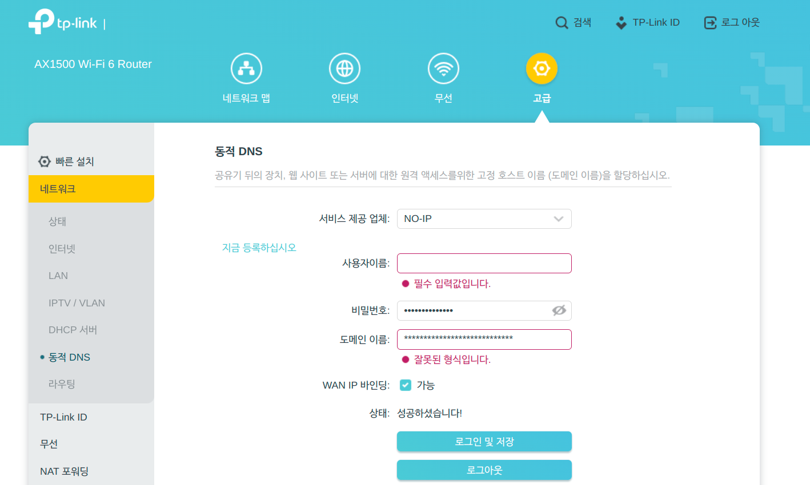
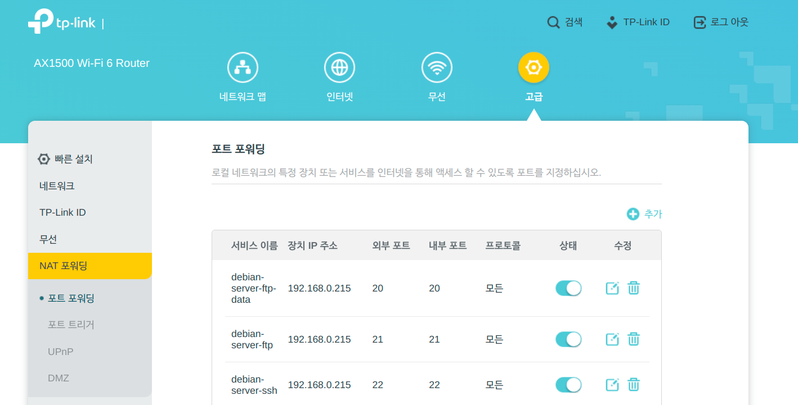
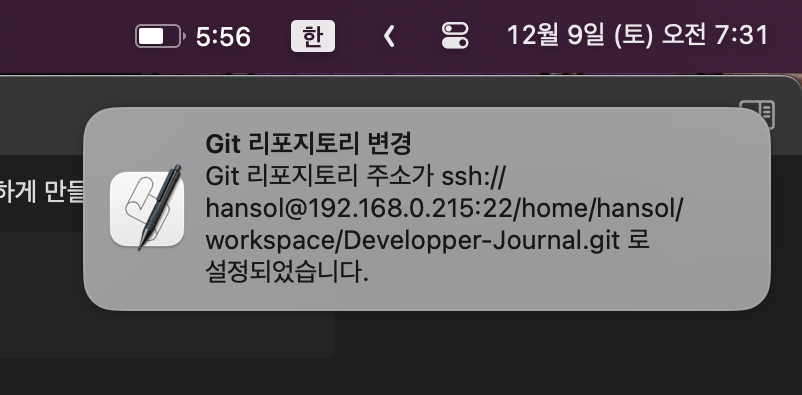

# Intro 
개발과정을 정리하는 도구로 나는 Obsidian 을 선택했다. 하지만 해당 도구는 매우 강력하지만 sync 기능을 유료로 제공해주었으며, 아이클라우드를 사용하는 기능도 있긴 하나, 이는 애플기기 한정으로 사용하기 용이했다. 하지만 반대로 말하면 애플 기기끼리는 쉬워도 멀티 OS 환경에서 동작하도록 구축하는 것은 쉽지 않았다. 

기존의 개발환경이 맥 + 윈도우 였던 상황에서는 구글 드라이브를 활용해서 싱크가 가능했다. 하지만 리눅스로 개발 데스크탑 환경을 바꾸게 되면서 정상적인 사용이 어려웠다. linux 용 구글 드라이브 패키지가 있긴 했지만 불안정하고 사용이 어려웠으며, 무엇보다 미러링 방식으로 내장되는 구조가 아닌, FTP 서버 처럼 그때 그때 데이터를 가져오는 구조였다. 따라서 옵시디언을 활용하기에 매우 곤란하다. 

사실 그런 점에서 해결하기 가장 쉬운 방법은 역시 gitHub 같은 곳을 사용하는 것이다. 언제 어디서든 사용이 가능하며, 깃헙의 레포지터리를 사용하는데 있어 용량 제한은 없고, 옵시디언을 활용하는데 있어 깃만 추가하면 되니까. 하지만 다소 아쉬움은 분명히 있었다. 

우선, 옵시디언으로 저장하는 과정에서 사진, pdf, 개인정보 등도 담겨져 있다. 거기다 이제 내 옵시디언은 듬직(?)할 정도로 용량이 늘어난 상황. 지금까지 공부했던 많은 것들이 담긴 상황이다. 그런데 공개를 해야 한다는 점과 웹 상에 개인정보를 넣는다는게 옳은 행동처럼 보이진 않았다. 뿐만 아니라 github에서는 과하게 커진 용량의 레포지터리에 대해서는 모니터링을 하고 있다는 점에서, 개인용 obsidian을 위한 다른 대처가 필요하다는 판단 하에 고민을 하였다. 

그러던 와중에 떠오른 것이 바로 `'깃 서버'는 어차피 똑같은 깃 서버인데, 그냥 내가 만들면 안되나?` 였다.  그래서 찾아보니 이런 글이 있더라.

[나만의 git 서버 만들기 - (3) 원격 저장소 생성하기](https://velog.io/@kimjjs100/%EB%82%98%EB%A7%8C%EC%9D%98-git-%EC%84%9C%EB%B2%84-%EB%A7%8C%EB%93%A4%EA%B8%B0-3-%EC%9B%90%EA%B2%A9%EC%A0%80%EC%9E%A5%EC%86%8C-%EC%83%9D%EC%84%B1%ED%95%98%EA%B8%B0)

생각해보면 회사이거나 어떤 영리 목적의 프로젝트가 있다고 한다면 github 을 사용하는게 부담스러울 수 있다. 심지어 유료 서비스가 아니면 public 으로 노출이 된다. 그런데 집에서 노는 서버가 하나 정도 있다면야, 해당 서버를 활용하여 손쉽게 무료의 깃허브를 직접 만들 수 있는 것이다. 

다만 완전히 이해도가 높은 분은 아닌 것으로 보여서 Git 사용시 에러까지 해결은 못하시고 기존 깃을 활용하는 방식만 정리가 좀 되어 있길래, 새로이 깃을 만들면서 작업하는 방법을 사용해 정리했다. 

# 작업 순서 

원본 글에선 이를 정리할 때, 원격 저장소 생성을 로컬에서 하는 식으로 접근을 했는데, 서순이 좀 애매한 것으로 판단하여 좀더 체계적으로 정리해보았다. 

### SSH 서버 세팅부터 할 것 
**1. 머릿속으로 구상해보자...**
   서버로 쓸 컴퓨터가 존재 한다면, 해당 서버는 우선 어디까지 공개할 것인지 고민해야 한다. 
   
   로컬 네트워크 망에서만 공유한다면, 사실 공개 IP가 아닌 사설 IP 내부에서 소통이 되니 일이 좀 줄지만, 나는 외부에서도 사용이 가능했으면 하는 바램이 있다. 이에 외부로 '공개'까지 해볼 생각이다. 
   
   사설망에서 동작이 가능하도록 서버를 구현한다면, 반드시 사설망 네트워크 안에서만 해당 깃서버에 접속이 가능하니 여간 불편한게 아닐 것이다. 
   
**2. 우선, DDNS를 적용해보자.** 
   
   DDNS란 한마디로 말하면 변동되는 도메인 이름 서비스로, 보통 집에서 사용하는 네트워크는 고정IP를 이동통신사를 통해 할당 받지만, 이게 변할 수 있다. 변하지 않는다고 하더라도, IPv4 주소로 접근하는 게 번거롭고, 쉽지 않을 뿐 아니라, 보안성도 취약하다. 이에 DDNS 서비스 가입으로 외부에서도 접근할 수 있게 지정해주면 좋은데,
   
   이때 꽤 괜찮은 공유기를 사용한다면 해당 기능이 내장되어 있다. 따라서 계정을 만들고 등록하고, 집 외부에서도 원격으로 접속할 수 있도록 한다. DDNS는 서비스 제공자들이 상당히 많고, 요즘은 아예 무료 1계정을 지원해주는데, 이를 잘 써먹으면 된다. 
   
   DDNS에 대해서는 [요글](https://www.noip.com/remote-access)을 참고하면 좋다 
   
**3. 그 다음 할 일은 서버로 쓸 컴퓨터로의 포트 포워딩이다.**
   DDNS는 어디까지나 문 앞까지 신호를 전달해줄 뿐이며, 공유기의 사설 네트워크와는 단절되어 있다. 그렇기에 사용하는 서버의 컴퓨터로 연결해줄 필요가 있고, 이때 필요한 기술이 '포트포워딩' 이다. 
   
   
   사진에서 보듯 내 debian 서버 컴퓨터를 등록해두었고, 거기서 SSH 기능을 활성화 한 뒤 SSH로 접속하도록 했다. 
   
   뒤에서 후술하겠지만, 리모트 깃 서버는 다양한 프로토콜로 연결만 되면 된다. 이때 사용 가능한 커넥션은 다양하겠지만, 일반적으로 SSH가장 편하게 구축할 수 있다. 

4. **서버의 설정을 한다.** 
   내용이 많아져서 생략하겠지만 대략적으론 다음 순서로 진행하면 된다. 
   - SSH 기능을 제공하는 프로그램 패키지를 설치하고, 설정을 한다.
   - 보안 설정이 필요하다면 간단한 UFW나 방화벽 서비스까지 구축을 해낸다. 
   - 외부에서 접속 가능하도록 만들고, 포트포워딩 한 포트로 연결시킨다. 

여기까지 구축이 끝났다면, 이제는 서버에서 작업을 진행하면 된다. 

### 원격 저장소를 생성해보자. 

1. 새로운 폴더를 원격 저장소로 만들자. 

```shell
> mkdir git-test && cd git-test
> git init
> git add .
> git commit -a
> git --bare --shared init
```

놀랍게도 다한거나 마찬가지다. 어차피 통신은 SSH가 담당하며, 각 엔드포인트의 git들이 서버겸 클라이언트 역할을 도맡아 해주게 되는 것이고, 이때 필요한 것은 `--bare` 옵션과 `--shared` 옵션을 통해 repository 의 각각 읽기와 쓰기 권한을 제공해준다. 

그러나 원 저자도 여기서 실패한 부분이 해당방식으로 마무리 하고나면 접속이 이론상 가능하게 되는데, 막상 원본으로 `git push`를 하면 실패가 뜬다. 그러나 이는 서버 측에서 데이터 변경이 되는 것에 대한 설정값이 존재하지 않기 때문이다. 

2. 설정 변경

1번에서의 문제를 해결하기 위해선 다음과 같은 설정을 해주면 된다. 

```Shell
> git config receive.denyCurrentBranch updateInstead
```

자 모든 작업은 끝났다. 접속해보자. 

### 접속 방법

```shell
> git clone ssh://{user_name_ssh}@{ssh_endpoint}:{port}/git/dir/git-test.git
```

ssh 접속을 위한 인증 절차를 걸친 후 정상적으로 클론이 될 것이다. 이제 여기에 데이터를 넣고 적절히 커밋을 실행하면 된다. 

### 번외편 : 외부 접속, 내부 접속을 편하게 스위칭 하는 단축어 만들기 
PC의 경우 어차피 내부망에서만 놀기 때문에 적절히  알아서 동기화 해주면 되는 부분이 있다. 
하지만, 맥은 들고 나가는 면이 있다보니 동기화에 애매한 경우가 있는데, 이럴 때마다 DDNS URL과 사설망 IP를 교체해가는 것이 매우 번거롭다. (당연한 말이지만, 같은 네트워크 상에 없으면 사설망 IP는 무쓸모이며, 내부망에서 DDNS로 사설망에 접근하는 것 역시 제대로 안된다.)

더불어 깃은 자동으로 다른 URL에서 땡겨온다던가.. 그런 구조가 결코 아니다보니 방법은 직접 쉘 스크립트 등으로 구축을 해내는 것이다. 

이에 단축어를 통해 맥에서 실행 가능한 스크립트 구조를 짜 보았다. 


```shell
#!/bin/bash

cd /Users/ryuhansol/workspace/obsidian/Developper-Journal

# 현재 Wi-Fi 네트워크 이름 확인
CURRENT_WIFI=$(/System/Library/PrivateFrameworks/Apple80211.framework/Versions/Current/Resources/airport -I | grep SSID | awk '{print $2}' | grep "Paul_main")

# 리포지토리 주소 설정
if [[ $CURRENT_WIFI == "Paul_main" ]]; then
    # Paul_main 네트워크일 때의 주소
    REPO_URL="ssh://hansol@{URL}:22/home/hansol/workspace/Developper-Journal.git"
else
    # 다른 네트워크일 때의 주소
    REPO_URL="ssh://hansol@{URL}:22/home/hansol/workspace/Developper-Journal.git"
fi

# 리포지토리 주소로 Git 명령어 실행
git remote set-url origin $REPO_URL

# 시스템 알림 메시지 보내기
osascript -e "display notification \"Git 리포지토리 주소가 $REPO_URL 로 설정되었습니다.\" with title \"Git 리포지토리 변경\""

```

쉽게 설명하면 다음과 같다. 

- 우선 쉘 스크립트 동작 경로를 옮겨준다. 
- 그 뒤에 CURRENT_WIFI 라고 하여서 무선랜 환경에서 사용하는 SSID 를 파악하는 식으로 해서 내가 사용하는 wifi의 SSID 를 추출해 냈다. 
- 그 뒤에, 다른 wifi 환경이거나 하다면 당연히 지정된 SSID를 안 쓸거니, 이 경우 URL을 바꿔주는 식으로 했으며, 맥 시스템 알림 메시지를 보낼 수 있는 osascript 라는 명령어가 있길래 사용해보았다. 
- 이렇게 하여 단축어를 독에 등록하여 사용하면 알림도 오면서 사용이 가능하다..!

> 독에 등록한 모습 


> 스크립트를 활용해서 알람이 떠서 깃 레포지터리가 URL 이 바뀜을 보여준다.

### 결론 : 편한가...?

이것으로 Obsidian의 동기화, Obsidian을 언제 어디서든 쓸수 있지만 만들고나니 치명적인 단점이 있었다. 

뭐냐면... iCloud 를 쓰지 않으니 맥 이외의 다른 기기, 예컨데 아이폰이나 아이패드에서는 옵시디언의 볼트를 따른 폴더 구조로 만들기가 지원되지 않아 매우 번거롭다. 어쩔수 없이 그 둘을 위한 서브 볼트를 파야하는 실정 ㅠ...

두 번째로, 사용시 스크립트를 만들어 보긴했으나, 자동으로 작업을 하고난 다음에 저장을 하는 자동 저장 기능을 구현하기엔 여러모로 아쉬움이 좀 있었다. crontab을 사용하는게 가장 직관적이지만 이것도 역시 아직 완벽한 대안은 아니다. 

발전의, 개선의 여지는 있으니, 이 앞부분은 좀더 연구를 해봐야 겠다. 

```toc

```
