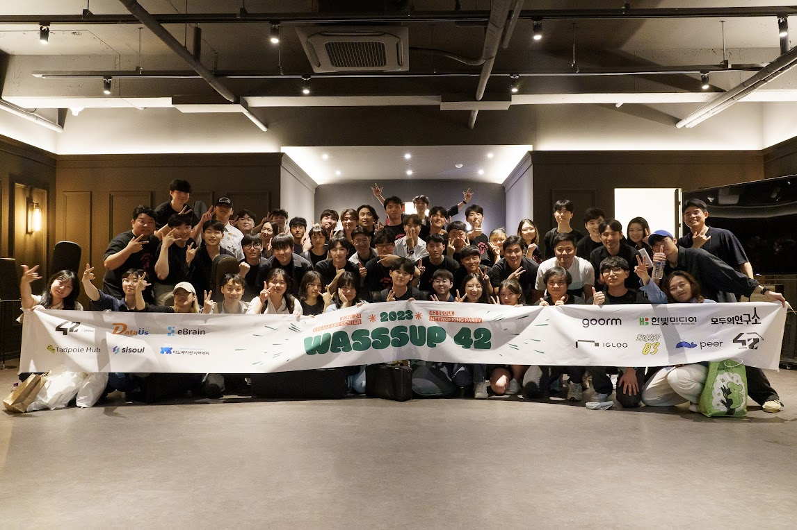
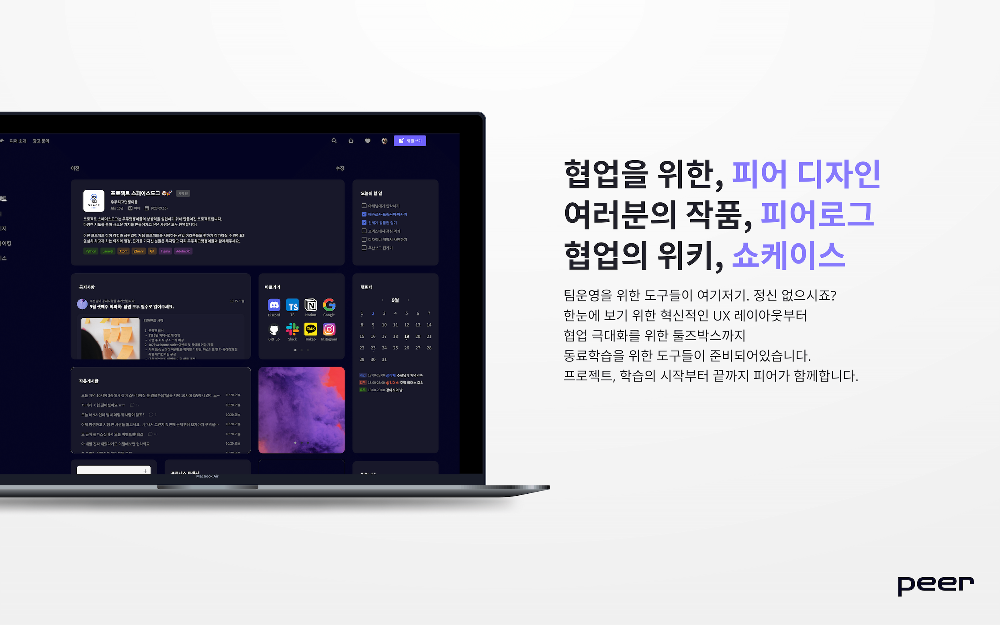

# 2023년 마지막 1주를 시작하며 

2023년 드디어 마지막 주가 시작되었다. 정말 말이 안된다. 벌써 이렇게 시간이 흘렀다니. 내가 무엇을 하였는지, 하고 있는지, 정신없이 시간이 흘렀다. 정말 많은 일들이 겹치고 겹쳐 정신이 없었는데, 정신 차리고 보니 2023년의 시간은 벌써 99%를 달성하고, 56주, 대망의 마지막 주간이 찾아왔다. 창밖의 흐린 하늘은 드디어 내 위치가 어디까지 왔고, 나의 시간대가 어딜 가리키고 있는지 자각할 만큼 차디찬 기준점을 알려준다. 

2023년은 나에게 어떤 한 해였을까? 생각해보면 정신없이 달렸는데, 정말 고생했는데, 아직도 달려야 한다는 생각에 깨름찍하긴 하지만 정리를 좀 해보면 어떨까 한다. 🤪

## 2023년의 마무리, 42서울 

42서울을 들어오게 된 것이 2022년 11월이었다. 그때의 나는 C언어 코드 조차 해석에 어려움을 쩔쩔매던 나였다. 지금은 자바 서버 개발과 아키텍쳐를 만지고 있다는 점에서 놀라운 성장이 아닐 수 없다. 이런 성장의 핵심, 어쩌면 내 근간이라고 생각될만한 것은 결국 42서울이었다. 

42서울. 철저하게 교수도, 조언하는 사람도 없이, 교재도 없이, 오로지 동료와 함께, 정말 불친절 그 자체인 프로젝트들을 해나가는 하루 하루는 하루 하루를 떼서 바라보면 정말 괴로운 하루들이었다. 특히 역시나 협업을 하게 되는 경우 발생하는 다양한 생각들의 부딪힘들은 하루가 멀다하고 비극을 불러올 때가 있었다. 😂

특히 가장 힘들었던 것은, 역시나 개개인의 생각이 옳다고 무대뽀로 진행하는 사람들이었는데, 이런 이들의 행동들은 신뢰를 깬다는 것을 보면서, 과거의 나의 흑역사들이 새삼(!) 깨닫게 되어 이불킥을 하기도 했다. 어설프게 효과적이다, 효율적이다는 표현은 자재해야 함을 느꼈지 않나 싶다. 


> 2층 클러스터... 중후반엔 종종 신세를 진 공간이다.

어쨌든 23년도, 10월까지, 지원금을 받는 마지막 순간까지 가서야 나는 트랜센더스를 돌파함으로써 정식으로 멤버가 될 수 있었다. 카뎃으로 활동하는 기간이 다른 사람들에 비해 참 길었던 것 같다. 과제를 빨리 한다고 생가했지만, 막상 그렇지도 않았던 지라 마지막으로 가면 갈 수록 속도가 느려졌던 것 같다. 

웹 서브를 할 때는, 비동기 비봉쇄를 이해하는데 시간이 걸렸고, 첫 팀은 완성 80% 상황에서 사실상 팀이 폭발해버렸고(....), 내가 리더가 되어야 겠단 생각에 0부터 다시 체계적으로 쌓아 올려 돌파했었다. 

트랜센더스를 할 때는 일정 상 와썹 2023을 진행했고, 코로나, 전세 사기 등의 것들이 겹쳐 지면서 돌아와보니 팀이 불타고 있던 🥵, 놀라운 경험도 할 수 있었다. 특히 와썹을 할 때는 트샌이 생각도 안 날만큼 열심히 준비를 했었고, 결과적으로 정말 성공적인 행사를 치를 수 있었다. 


> 정말 우여곡절이 있었던(...) 행사. 컨퍼런스를 할 수 있다는 것에 감사함과, 조직을 움직이는 귀한 경험을 함께 할 수 있었다. [페스타링크](https://festa.io/events/3352)


> 포스터는 참 마음에 든다. 내 후배 덕을 보긴 했는데, 참 잘 만든다고 생각한다. 

와썹은 주축으로 들어가서 전반적인 체계를 잡는 역할을 했었다. 특히나 기존의 와썹 이후 여러모로 기업들의 상황이 좋지 못하다는 점, 기존의 소통 방식이 사실상 지인들을 통해서가 아니면 접근이 안된다는 점에서 여러모로 고생을 했고, 이후에는 회사에서의 경험을 살려(!) 메일 소통을 함께 진행했었다. 여러모로 소통의 중요성을 새삼 느낄 수 있었을 뿐 아니라, 이런 행사의 전체적인 틀과 진행 과정, 특히 내부 구성원들과의 소통 면에서 여러 생각을 느끼게 했던 행사였지 않나 싶다. 

자, 그래서 42서울에서의 1년은 어떠했던가? 

우선 개인적으론 정말 많은 성장을 느꼈다. 작년에는 생각보다 여유있게 진행했었다. 과제들이 솔로 과제 위주였기 때문이다. 계획적이었고, 계획을 달성하는 만족감은 있었지만, 성장이 폭발적이었다? 라는 느낌은 아니었다. 오히려 마음 한 켠에 2022년은 '이걸로 뭘 할 수 있을까?' 라는 막연한 공포감이 있었다. 하지만 2023년에는 팀 과제들이 주를 이루었고, 와썹, 이 뒤에 설명할 피어 프로젝트 등으로 나, 스스로의 능력을 시험하듯 작업을 진행해보았고, 쫓기듯 문제들을 해결해보았다. 

그러는 와중에 정말 세상의 발전이 무서운 것이 AI를 적극 활용할 수 있게 되었고, 탐색의 시간이 2022년 대비 월등히 줄어들 수 있었다. 한 편으론 지배 당하는게 아닌가? 싶었지만, 오히려 탐색하며 정보를 갈무리 하는 것 조차 AI에게 맡길 수 있었기 때문에, 이후에는 내가 판단하고 결정하는 일이 가능했다.

거기다 결국 일을 벌리니 처리나 해결은 내 역할(...)이 되면서 싫든 좋든 두렵든, 상관 없이 일을 진행할 수 밖에 없었다. 이 과정에서 다른 언어들을 배우는 속도가 비약적으로 올라갔고, 완전히 아는 것은 아니지만 필요한 기능들을 위하여 달려갈 수 있었고 빠른 습득이 가능했다. 역시 옛날 말이 안 틀리다는 느낌을 새삼스럽게 배울 수 있었다.

특히 자바스크립트, 타입스크립트를 건너 피어 프로젝트를 위해 자바를 배울 때는, 사실상 4일 만에 기초를 전부 학습하고, 바로 서버 개발에 투입되었으며, 기획을 위한 서버 아키텍쳐의 설계까지 해낼 수 있었던 것은, 역시 좋든 싫든 42서울에서의 시간 덕이었다는 생각이 들었다.

아마도 앞으로 취업 전까지는 42서울의 과정은 따로 진행하지 않을 것이며, 취업 후에야 부족한 것을 채우기 위해 다시 42서울의 과제들을 해나가지 않을까? 하고 생각하고 있다. 지금으로썬 어쩔 수 없이 우선순위를 바꿔야 한다는 것이다. 하지만 지금까지 42서울, 정확히는 42 프랑스에서 비롯된 이 시스템이 가지는 장점, 가능성, 잠재력은 정말 중요하다고 생각이 든다. 

## 나의 42의 종착역, peer web application 


> 컨셉 디자인, 현재는 조금 차이가 있다. 

42서울에서 나는 개발을 배웠다. 동료학습을 배웠고, 앞으로 어떻게 개발을 해야 하는지에 대한 감도 얻을 수 있었다. 특히나 개발자라는 직군이 '코딩'을 하는직군이 아니라 '코딩'을 완성하기 위한 일들을 하는 분야라는 것을 새삼 느끼고 난 이후, 나는 마지막 도전을 고민하고 있었다. 

배운 개발을 활용하면서도, 의미가 있길 바랬다. 나의 개발 스킬들의 집대성, 어떻게 하면 그런 것들을 해낼 수 있을 까 생각을 하는 과정에서 peer가 눈에 들어왔다. 처음에는 현실성이 없다고 생각했고, 다른 서비스도 고려했다. 하지만 규모, 가능성, 그리고 이걸 책임지려는 리더의 존재 등 여러가지를 고려하고, 추가로 AI의 발전은 기획할 의미를 제공해준다고 생각할 수 있었다. 

그렇기에 나는 도전하기로 마음 먹었다. 그리고 팀원들을 구했고, 지금 내년 2월 1일 런칭을 기다리고 있다. 


> 이걸 그릴 수 있었을 때 정말 감사했다. 내가, 내 손으로 시스템을 구축해낼 수 있었다는 점에서 정말 감사했다. 

물론, 여전히 부족함은 많다. 일단 해당 계획을 실행하겠다고 한 것은 이번년도 5월이었다. 그리고 2달의 준비 과정을 거친 이후 아무리 못해도 10월에는 런칭하려고 했다. 생각보다 널널한 계획이라고 생각했다. 하지만 역시나일까, 낙관으론 현실을 이길 순 없는 것이다. 중간에 팀원들의 이탈, 개발 역량의 부족이나 디자인의 늦어짐 등... 여러 외적 요소들은 개발 속도에 제약을 걸었고, 결국 늦어지고 말았다. 

그러는 와중에 특히나 느꼈던 점들은 몇 가지 있었다. 이걸 일일이 설명하는 것은 쉬운 일은 아니니... 나중에 다시 정리 해보고, 지금은 정말로 나에게 '집대성'이 되어 가는 구나 - 라는 점만을 알리고 싶다. 이 과정에서 배움을 준 모든 분들에게 감사를 하며, 특히나 아키텍쳐 설계라는 분야가 얼마나 재밌는가를 새삼 깨닫게 되면서(?) 한층 서버 및 시스템 개발을 해보고 싶다는 생각을 하게 되었다. 아직은 실력도 경험도 부족하니, 새삼 더 넓은, 깊은 세상으로 가야 한다는 예고편(?) 을 맛보았다고 생각이 든다. 

## 2023년, 그래서 2024년은?

2023년을 이렇게 돌아보았다. 많은 내용을 담은 것은 아니지만, 그럼에도 정말 적는 내내 여러 일들이 있었구나 라는 생각이 들었다. 그럼에도 적는 내내 한 켠에서 계속 내 머릿속에 남는 것은 단 하나다, '아직 부족하구나' 였다. 취업의 차원의 문제가 아니다. 개발이라는 창조 활동이 가지는 종합 예술적 가치는 정말 훌륭한데, 문제는 그런걸 다 감당해내기엔 여전히 나의 능력, 커뮤니케이션 능력, 리딩 능력, 팔로잉 능력 등등... 피어만 봐도 겉으로 보기엔 희극, 내지는 해피 엔딩 같지만, 여전히 구조적으로나 실력적으로 엉망인 부분이 한 두군데가 아니다. 

그러니 결론적으로 2023년은 마지막이다 라는 생각도 있지만, 한 켠에는 2024년의 모험을 준비하기 위한 준비의 준비 단계가 아니었던게 아닌가 생각이 드는 것이다. 20대의 마지막 도전, 30대의 첫 시작을 준비하는 과정에서 정말 여러 생각이 교차했지만, 그럼에도 웃으며 기분좋게, 동시에 진지하게 갈 수 있는 이유가 이런 점이 개발이라는 분야에 있기 때문이 아닐까 싶다. 

새벽, 어슴푸레한 방 안, 달빛에 기대어 공부할 것들, 무엇을 먼저 해야 할지를 적으면서 질린 표정과 어딘가 한 켠에서 나름대로 기뻐하는 표정이 있는 이유는 어쩌면 다음 스테이지가 눈 앞에, 목전에 놓여져 있는게 아닐까 하는 설렘과, 2023년을 당당히 앞으로 걸어갈 수 있었던 나라는 신뢰가 있으니까 아닐까? 

다시, 마음을 가다듬자. 쉼 호흡 크게 하고 1월은 peer 런칭을 위한 달리기를 마무리 짓고, 1월부터 3월까지, 취업을 위한 마지막 작업들의 우선순위에 따라 공략을 해나가자. 결국 골은 정말 코앞이다. 


```toc

```
