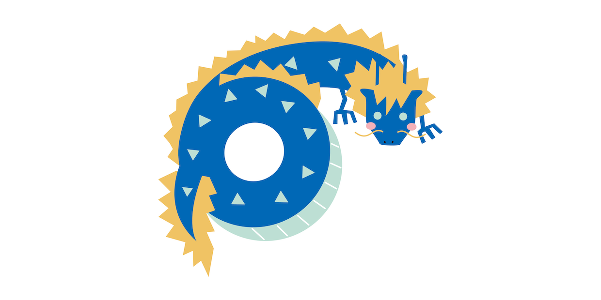
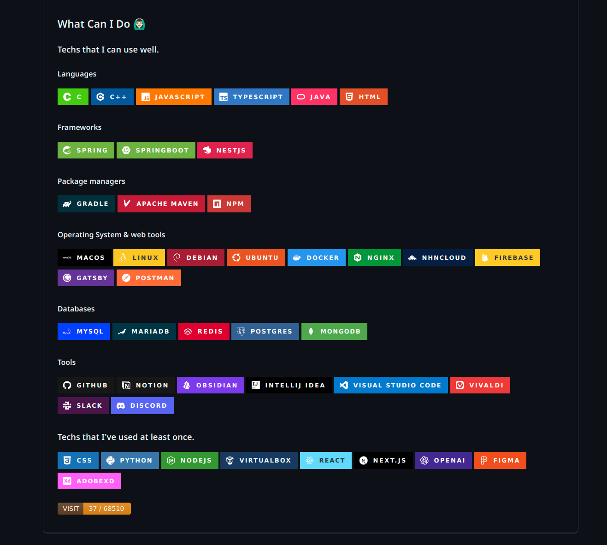
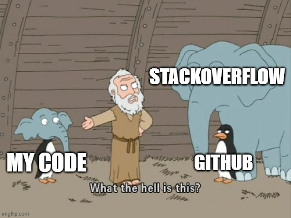

# 고민, 고민, 고민을 하자 

웰컴 투 2024..! 

> 출처 : 코코네 공방([링크](https://tumblbug.com/2024calendar_))

야심한 새벽, 물론 야근을 하면 안되지만! 오늘은 밀린 작업들을 쳐내기 위해 야근을 스스로 선택했다. 증말, 과연 프로젝트는 언제 쯤 끝날 수 있는 걸까. 막바지라고 막바지라고 그렇게 이야기 했지만, 이 정도를 구현하는 것도 사람이 많으면 정말 어렵다. 오히려 혼자 했다면 더 빨리 끝났으려나?

그래도 정말 많은 인원과 친해졌고, 같이 개발하는 것이 자연스러워졌다. 논의하는 과정은 분명 즐거움이 있었기에, 2024년을 맞이하고, 2월 1일 런칭을 확정하겠다고 오기까지 정말 긴 시간이 걸린 게 아닌가 다소 생각해본다. 

그렇다면 2024년, 이제 1달의 달림 이후에는 다시 나만의 시간이 될 것이다. 물론 완벽하진 않다. 여전히 피어 관리는 해야할 것이고, 대빵이 어떤 생각을 하냐에 따라 개발을 지속할 수도 걍 관리만 해 줄수도 있으리라 생각된다. 

어떤 방향이 되었든, 조금의 여유가 생기고 그걸 다시 다음 목표를 위해 나아가야 할 것이다. 그걸 오늘 여기서 다소 적어볼까 한다. 

## 나한테 장점은 뭘까?

이제 앞으로 생각할 일은 좀 다양하다. 금전적인 문제, 학습에 대한 문제, 몸에 대한 문제, 기타 등등... 그러는 와중에 당연히 가장 중요한 것은 이직을 성공하는 것 일텐데, 그걸 위해선 현재 내 상황을 정리할 필요가 있다고 느낀다. 그리고 그 중에서도 가장 중요한건 역시 장점을 살리는 것. 

생각해보면 신입 개발자로써 그래도 많은 경험을 했다는 점은 분명 장점이라고 생각된다. 로우한 언어부터 프론트, 백에 이르기까지 분야를 완벽하게는 아니지만 분명 나름데로 섭렵을 해왔다. 


> 다 정리 된건 아니지만... 일단 깃허브에 정리한 내가 다룰 수 있는 기술들과 도구들.. 2년이 길지만 값진 시간은 맞았다고 본다. 

무엇보다 이번 프로젝트를 통해 배우게 된 것들은 특히나 도움이 되었다. 프로젝트를 진행함에 있어 좋지 않은 수는 어떤 것이었는지, 그리고 사람들을 끌고 갈때 어떤 동의와 어떤 조건으로 갖춰야 관리와 함께, 좋지 못한 개발 경험으로 가지 않게 만드는 지를 이해하고, 배우며, 경험할 수 있었다. 

특히 기획적인 면에서도 기존의 문서 작업, 사무 작업에서 보지 못하는 지평을 본 것 같아서, 기획과 충돌되는 개발의 현실을 느낄 수 있었다. 이는 결국 회사 어떤 곳에 가도 사용될 경험이 될거라 확신한다. 

그리고 제일 중요한 부분으로 협업 도구들과, 실제로 구현시 필요한 여러 툴들에 대한 이해도가 높아진 점은 단연 자랑해야하는 전략적 포인트라고 생각한다. Nginx, Docker 를 필두로 하여 개발 프로젝트에서 결국 개발은 아니지만, 개발에 반드시 필요한 도구들의 사용방법을 시작으로 협업용 도구나, 작업 효율성을 끌어 올리는 도구를 아냐 모르느냐는 실제 작업의 효율성을 극단적으로 바꿔 놓는데, 그런 점에서 <mark style="background: #FFB8EBA6;">'배울 수 있을 때 배운다'</mark> 전략으로 틈틈히 배워온 것은 계속해서 스스로에게 잘한 지점이라고 생각이 든다. 

한 가지 더 나의 강점을 꼽아보자면 배움에 대한 자신감이 생겼다. 개발의 과정에서 단순히 끝나지 않는 일들이 정말 많았다. 해결을 해야 하지만 사실 사람이 많을 수록 해야할 일도 많고, 우선순위가 다르다 보니, 까다롭고 해야하는 일들이 종종 미뤄진다. 하지만 그렇기에 반대로 말하면 어렵고, 복잡하고, 해야할 것들을 먼저 하려고 했을 때, 경험도 얻을 수 있을 뿐 아니라 결국 해내려면 내가 해야 한다는 불가피한(?) 상황이 펼쳐지게 되고, 결국 싫든 좋든 뚫고 나갈 수 밖에 없는 상황이 몇 번이고 찾아왔다. (물론, 말하지만 피어 개발팀은 아래 이미지 같은 건 절대 아니다...! 최고의 팀이고, 내가 경험한 정말 좋은 사람들이 뭉쳐 있던 곳이다.)

<iframe src="https://giphy.com/embed/hr4Ftl96sZbJUtfm3f" width="386" height="480" frameBorder="0" class="giphy-embed" allowFullScreen></iframe><p><a href="https://giphy.com/gifs/teamwork-hempions-hr4Ftl96sZbJUtfm3f">via GIPHY</a></p>

그런 상황은 좋은 기회였다. 정말 새로운 것들을 많이 접할 수 있었다. Nginx의 설정을 통해 어떻게 포트포워딩을 하면 될지를 이해했고, HTTPS 통신 방식에 대해서도 배웠다. 특히 nhn Cloud 서버를 활용하는 방법을 배우며, github을 활용한 CICD 구축을 배우는 것은 정말 신의 한 수 였다. 그걸 접목시켜 현재 내 private CICD 서버 덕분에 블로그 글을 쓰는 것은 훨씬 간편해지고, 내 관심 밖에서 알아서 동작하도록 만들수 있었다. 뿐만 아니라 Sonar Cloud 라는 좋은 분석 도구를 알 수 있었으며, 종장에는 웹 서버를 활용하지 못하게 되어 물리적인 서버 구축을 직접 하게 되면서 네트워크에 대한 이해, 사설망 구축, 물리 서버에 웹 서비스를 올리는 등 정말 별 별 것들을 배울 수 있었고 실천할 수 있었다. 

결론적으로 이러한 행위들은 하나의 지점으로 내 경험의 결론을 도달시켰다. 그것은 바로 '자신감'. 개발이라는 것이 분명 어렵고, 배우는 과정은 정말 쉽지 않았다. 하지만 결국 사람이 하는 일이고, 그 일들의 핵심을 이해하고, 컴퓨터를 이해하는 만큼 길은 보인다. 특히 내가 느낀 것은 '컴퓨터'의 소통의 방식을 이해하고 나면, 절차가 상상이 되고, 이미 시대는 개인이 그것을 찾기 어려운 시대에서 너무나 쉬운 시대로 바뀌어 있기에 논리적 상상력에 끈질긴 정보 검색과 정보 조합을 통해 분명 과거에 못하던 것들을 가능케 할 수 있게 되었다. 

이러한 경험은 배우는 방법을, 상상하는 방법을 나에게 가르쳐 줬으며 그게 피어를 하면서 얻게 된, 다른 사람들에게 분명히 강점으로 자랑할만한 포인트가 아닐까 하다. 

## 하지만 부족한게 없다곤 안 했다. 


자신감은 생겼다. 하지만 근자감일 수 있다는 점에서 충격과 반전...! 열 받지만, 아쉽고 짜증도 나지만 부족한 점을 정리해보자. 

우선, 자신감을 얻은 경험들은 반대로 '불안함'을 주기도 한다. 자바를 배우고 스프링을 배우고 JPA를 배운 뒤 후다닥 실전에 들어갔다. 지금까지 경험, 이것 저것을 꾸역 꾸역 담아 피어 프로젝트를 진행하고 있다. 완전 초짜는 아닐지 몰라도 디테일하게 내용을 배우거나 하진 못했다. 기본기를 다잡아야 한다고 생각한다. 

내가 지금 이렇게 여러 가지 내용들을 빠르게 습득해서 개발을 해낼 수 있었던 것은 역시 기본기 덕이었다. 42서울은 그런 점에서 정말 밑바닥을 바라보게 해주었고, 그와 함께 했던 CS 학습은 나에게 시간이 갈 수록 개발을 할 수 있는 체력을 주었던 것이었다. 

그런 점에서 그전에 했던 것들은 그래도 체력을 잘 붙잡아놨다. 하지만 이제부터 주 무기가 되어야 하는 자바와 스프링 부트, 더 나아가선 향후 코틀린 쪽도 고려해야 할 것인데, 이런 부분과 영역들에 대해서 아직 기초 체력 면이 부족한게 아닌가 생각이 든다. 

더불어 OS에 대한 이해도는 더더욱 중요해 보인다. 인공지능도 중요하고 이것 저것 사업에 중요한 핫한 아이템도 있다. 하지만 그런 아이템 구현에 필요한 걸 모르면 안된다는 생각이 요즘 들어 더 강하게 들고 있다. 많은 사람들이 다양한 아이템으로 창업을 하는 것을 42서울에서 보고 있다. 그런 과정에서 당연한 이야기지만 꼭 필요한 인원이 되는 것은 쉽지 않다. **결국 프로젝트들의 흥망은 기본기에 있지, 욕심에 있지 않다는 것을 느낄 수 있었다.** 

그리고 구체적으로 부족한 점을 하나 꼽자면, 역시나 알고리즘. 요즘 기획이 떠오른 아이디어라던가, 웹 서비스 대용량 처리 등에서, 그냥 로직적으로 순차적으로 생각하는 것은 어렵지 않다. 하지만 그것이 효율적인 처리인가? 라는 점에서 부족함을 느낀다. 특히 대용량 처리에 대한 책을 읽으면서 느낀 감각은, 알고리즘이라고 하는 것이는 잠재력은 보다 
'최적화'에 집중하는 정말 전문성을 갖추는 길의 힌트를 제시해 주는 것으로 보인다.

## 2024년 드디어 이루고 싶다. 마무리와 함께 시작하고 싶다.

취업, 창업, 프로젝트, 정말 이제는 얼마 남지 않았다는 체감이 든다. 여러 문제들이 아직 남았고, 부족하지만 정말 이제는 다시 사회로 나갈 때다. 돈도 벌고, 설령 세상이 무너지더라도 뭐라도 하고, 행복을 누리고, 지킬 사람들을 지킬 수 있는 시간이 왔으면 한다. 

어디까지 내가 통할지도 알았다. 프로젝트의 성과는 사실 아쉽지만, 그 만큼 현실적으로 프로젝트가 왜 어렵고, 왜 창업이나, 팀 플레이를 끌고 가는 게 어려운지를 새삼 느꼈다. 오히려 능력이 있다고 보이는 사람들이 더 위험하다는 순간도 느꼈고, 반대로 어떤 마음을 가진 이들이 더 열심히 하는지를 알 수도 있었다. 이 경험을 놓치지 않는 좋은 직장에서, 진짜 뜨겁고 치열하게 돈 벌어보고 싶다. 

더불어 다른 부분도 관심이 간다. 예전에는 너무나 생각하지 않았던 부분이지만, 돈에 대해 이번엔 진지하게 공부해보고 싶어졌다. 옛날에 나를 알기 위해 심리학 서적들을 뒤지던 그 때처럼, 나의 부족과, 나의 가난함을 돌파하기 위해 필요한 것을 이해하기 위해 노력해보는게 어떨까 하는 이번 년도의 나름의 목표가 생겨났다. 

### 버킷 리스트
1. 정말 열심히 다닐 수 있는 직장으로 이직하기
2. 매월 경제 관련 서적, 제대로 된 제태크 관련 서적 읽으며 친해지기 
4. 다이...어트...ㅋ, 건강한 몸 만들기
5. 빚 갚고 경제적 자유 누리기..!
6. 즐겁게 영향력 있는 사람이 될 수 있는 도전의 시작을 준비하기
7. 다시 한 번 해외 여행을 찐하게 갔다오기
8. 자기 관리 도구 더 잘 다루고, 더더욱 개발자스러워지기 
9. 어머니를 제대로 효도하는 1년 되기


```toc

```
