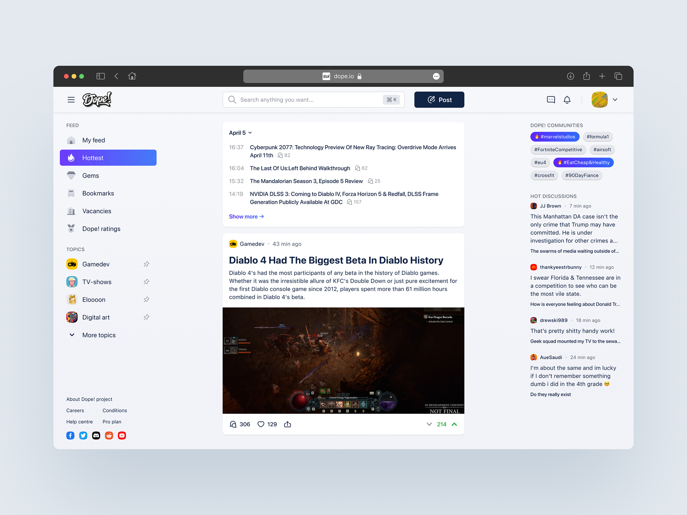
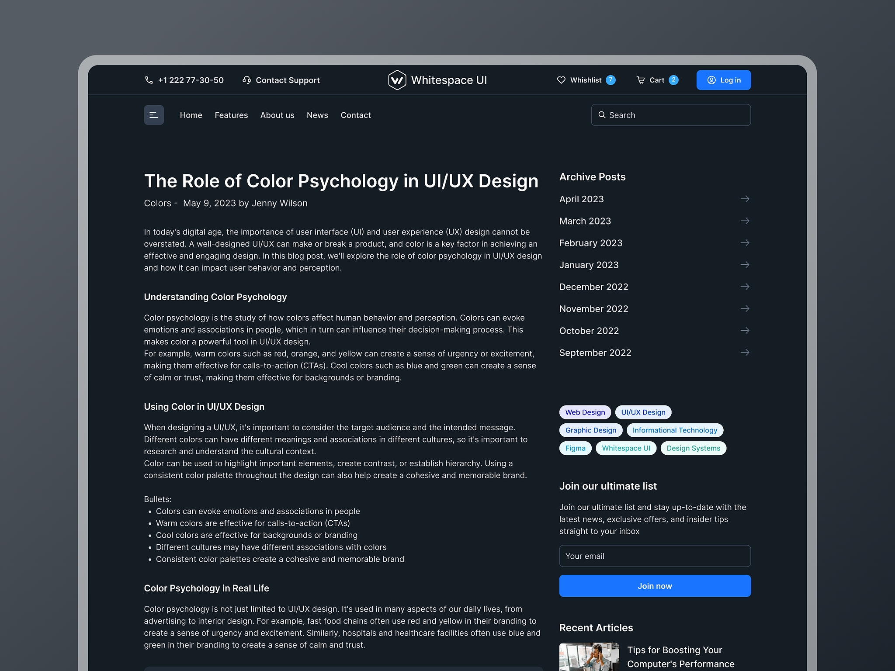
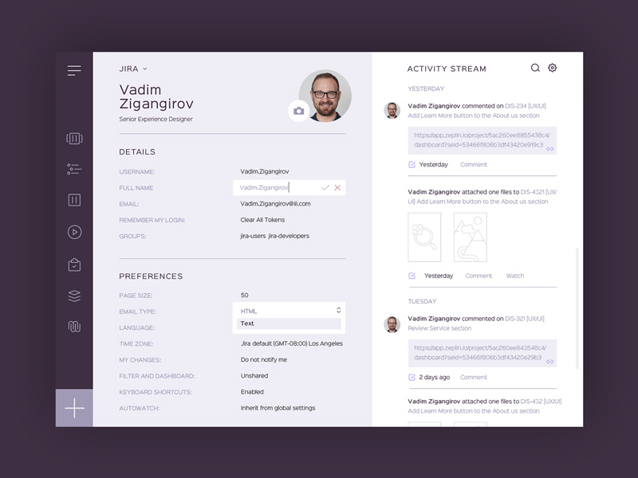
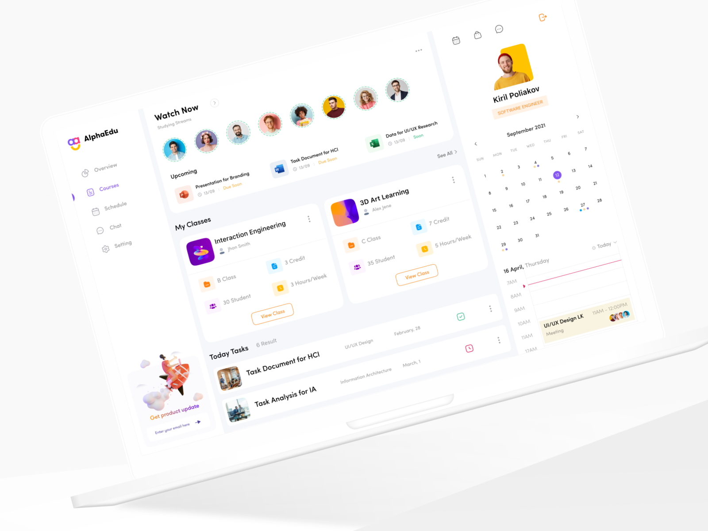
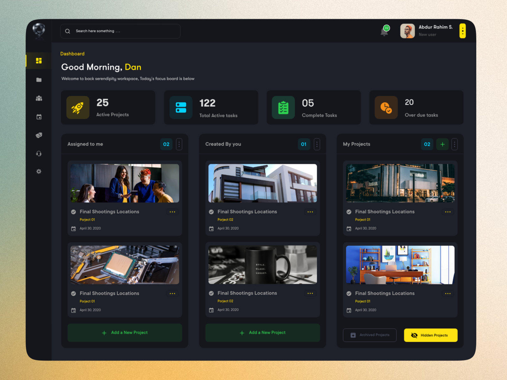
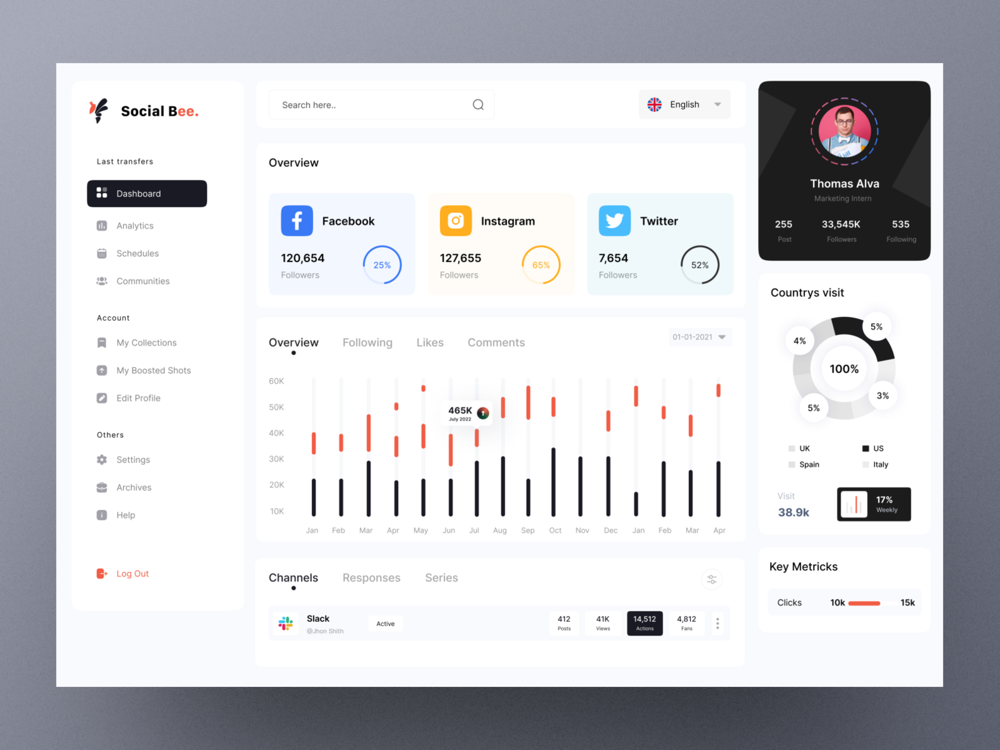
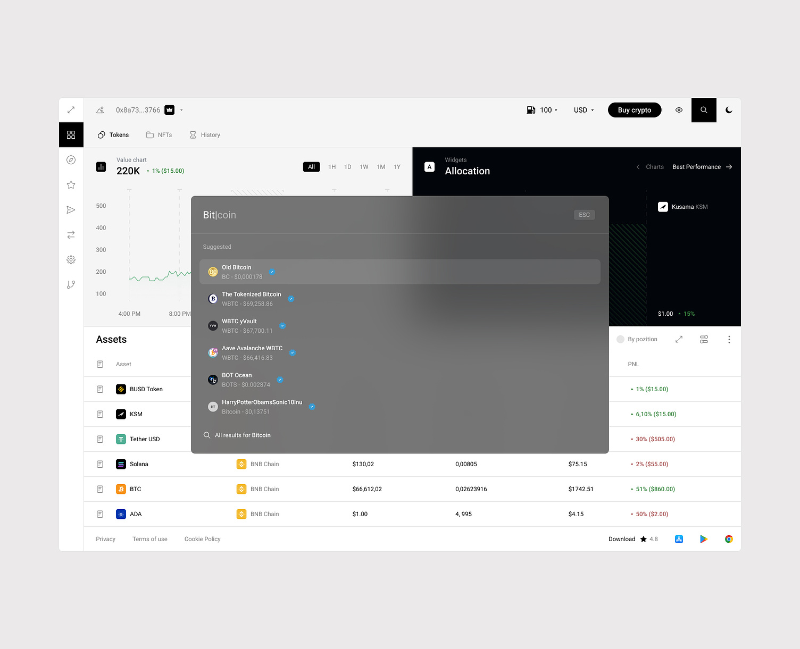
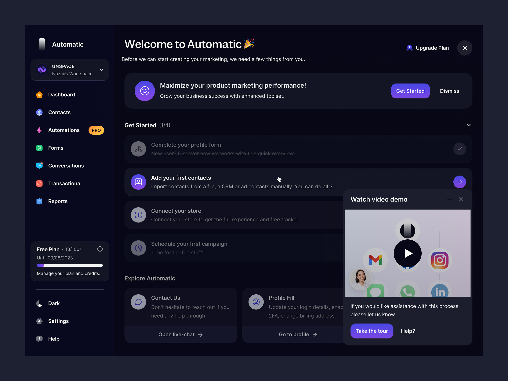
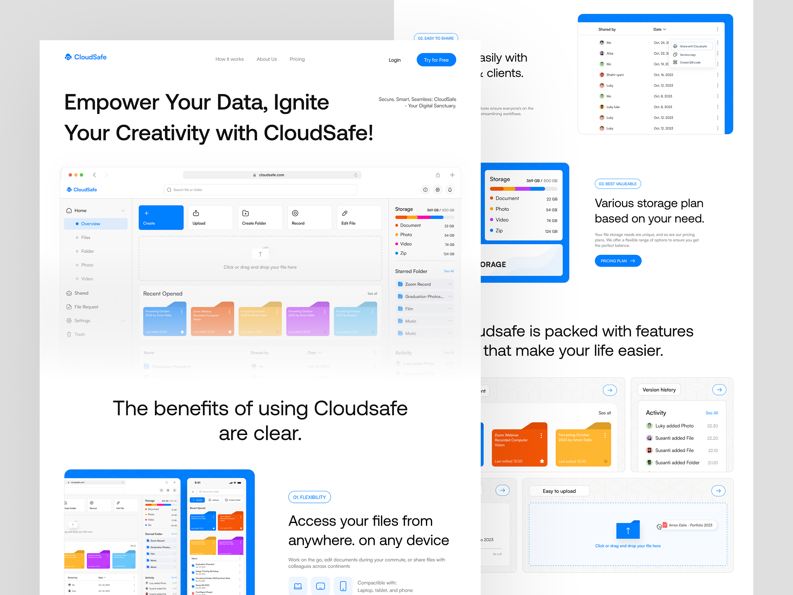
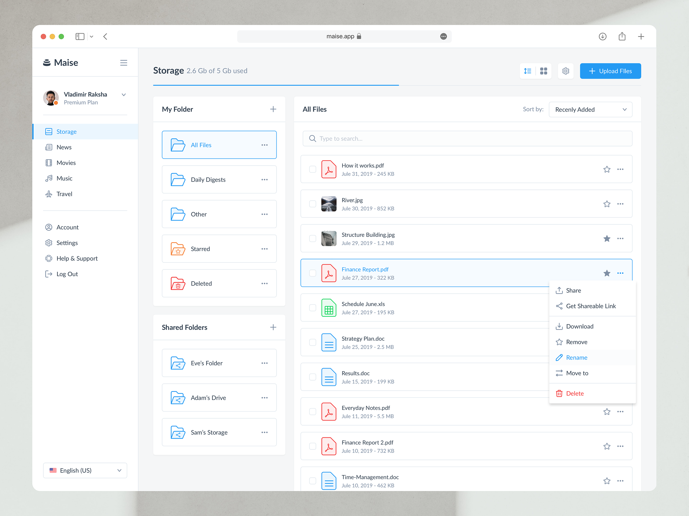

# 만들어보자 내가 직접 만드는 블로그
나의 기술 블로그를 만든다.
그러나 여기서 풀스택으로 준비를 해보도록 하며, 우선 백엔드 개발 이후 프론트 쪽을 공부하면서 학습한 내용을 기반으로 개발을 진행해본다. 
장기 프로젝트로 생각하고 좀 천천히 진행하면 좋을 듯, 대신 기본적으로 해본 것들은 강화시키고, 안 해본걸 먼저 구현해보는 것을 핵심으로 삼았으면 한다. 
백엔드 쪽은 아름다운 설계를 추구하고 설계를 해보도록 노력해보자. SOLID 원칙을 지키면서 간단하게 구현해보자.
프론트는 구현 자체에 집중하는 구조를 하되, 프론트엔드에서 사용되는 주요 기술을 아는게 중요할 것 같기도 하다. 

---
## **필수 기능들은?**
1. 내가 로그인해서 쉽게 사용이 글 작업이 가능해야 한다. <mark style="background: #FF5582A6;">oAuth</mark>
2. 문서 작업이 가능한 기능들로 구현하고 싶은데, 
   좀 더 유연하게 글 쓸 수 있으면 좋겠다. <mark style="background: #FF5582A6;">문서기능</mark>
	1. 썸네일
	2. 미리보기 기능
	3. 댓글 기능
	4. 게시판 형태 기능 
		1. 게시판 추가 
		2. 게시판 삭제 
		3. 게시판 수정
	5. 글에서 이미지 최적화 기능 최대한 빨리 이미지가 나오도록 할 수 있을까?
3. 나중엔 현재의 Obsidian에서 사용되는 기능들을 구현할 수 있으면 좋아 보인다. 
	1. 태그 기능
	2. 세세한 검색 기능
	3. 태그의 관련하여 유사한 글들을 보내줄 수 있도록 설정
	4. private / public mode 를 구분하여 보여줄 영역을 구분하는 것
4. HTTPS, nginx 에서 좀 더 디테일한 설정 만들어주기. 
5. AI 기능 도입 - 맞춤법, 작성하는 글을 API로 자주 날려서, 위치에 맞춰 해당 부분을 지적해주는 기능(켜고 끄기 가능하게?)
6. 배너 기능, 조회수나, 랜덤 성으로 글을 보여주도록 하기
7. 기존의 블로그의 파일 구조를 호환
8. 구글 애널리틱스 등 연결 
9. SEO 최적화 
10. 구글 캘린더 동기화 기능이 제대로 동작할 수 있도록 만들고 싶다...!

---
## 개발 과정, 프로세스를 어떻게 지정하고 진행해볼까 ~ chatGPT 의 추천

1인 개발자로서 체계적으로 개발을 진행하기 위한 효과적인 프로세스는 다음과 같이 구성할 수 있습니다. 이 프로세스는 개발의 초기 단계부터 배포 및 유지보수에 이르기까지 전체적인 라이프사이클을 포함합니다. 각 프로세스 별로 필요한 문서화를 포함하여 설명드리겠습니다.

### 1. 기획 및 요구사항 분석
- **목적**: 프로젝트의 목표, 범위, 기능을 정의합니다.
- **필요 문서**:
  - **요구사항 명세서**: 프로젝트의 목적, 목표, 기능, 사용자 요구사항을 상세하게 기술합니다.
  - **유스케이스**: 사용자와 시스템 간의 상호작용을 기술하여, 기능적 요구사항을 명확히 합니다.
### 2. 설계
- **목적**: 소프트웨어의 아키텍처, 데이터베이스 구조, 인터페이스 디자인 등을 계획합니다.
- **필요 문서**:
  - **아키텍처 설계 문서**: 시스템의 구조적 설계를 기술합니다.
  - **데이터베이스 설계문서**: 데이터베이스 스키마, 관계 등을 상세하게 기술합니다.
  - **화면 설계서**: UI/UX 디자인 가이드라인과 각 화면의 레이아웃, 요소를 명시합니다.
### 3. 개발
- **목적**: 설계된 요구사항에 따라 소프트웨어를 개발합니다.
- **필요 문서**:
  - **코드 주석**: 코드의 이해를 돕기 위해 중요 로직이나 함수에 대한 설명을 주석으로 달아둡니다.
  - **개발 가이드라인**: 프로젝트의 코딩 컨벤션, 버전 관리 규칙 등을 기술합니다.
### 4. 테스트
- **목적**: 개발된 소프트웨어의 오류를 찾고, 요구사항이 제대로 구현되었는지 검증합니다.
- **필요 문서**:
  - **테스트 케이스**: 소프트웨어를 테스트하는 과정에서 사용할 입력 값, 실행 조건, 예상 결과를 명시합니다.
  - **버그 리포트**: 테스트 과정에서 발견된 버그의 상세한 설명과 재현 경로를 기록합니다.
### 5. 배포
- **목적**: 개발과 테스트를 거친 소프트웨어를 사용자가 이용할 수 있도록 배포합니다.
- **필요 문서**:
  - **배포 가이드**: 소프트웨어 설치, 구성, 실행에 대한 절차를 상세하게 기술합니다.
  - **릴리즈 노트**: 버전별 업데이트 내용, 수정된 버그, 알려진 이슈 등을 기록합니다.
### 6. 유지보수
- **목적**: 소프트웨어를 최신 상태로 유지하고, 사용자의 피드백을 반영합니다.
- **필요 문서**:
  - **유지보수 로그**: 버그 수정, 기능 개선, 성능 최적화 등 유지보수 활동에 대한 기록을 남깁니다.
  - **사용자 피드백 문서**: 사용자로부터 받은 피드백과 그에 대한 대응을 기록합니다.

제대로 된 개발 과정을 간소하게 경험해보고, 그 경험을 토대로 포트폴리오로써 가치 있는 깔끔한 개발을 진행해본다. 

---
## 프론트엔드 개발 사용 가능한 것으론?
1. React : 가장 대중적이고 취업에 도움이 될만한 요소이다. 하지만 배우기엔 상당히 난이도가 있으며, 복잡하다. 컴포넌트 기반의 접근방식이다.
2. Vue.js : 배우기 쉬우면서도 강령함. React와 유사한 컴포넌트 기반이지만 보다 단순화된 문법과 구성 옵션으로, 초보자에게 더 친근하고, 확장 면에서 소규모에서 큰 프로젝트까지 유연하게 대응이 가능하다. 
3. Angular : TS 기반으로 모듈성, 높은 테스트 가능성, 코드 재사용성이 용이하다. 기업 수준의 애플리케이션 개발에 적합하며, MVC 패턴, 서비스, 의존성 주입 등 고급 개발 개념을 심도있게 다룬다. 
4. Svelte : 최근 인기를 끄는 프레임 워크이며, 런타임에 대한 부담이 적은 컴파일 단계로 최적화를 통해 전통적인 프레임워크가 런타임에서 처리하는 작업의 양을 줄여주고, 성능향상과 더 쉬운 상태 관리, 코드 작성을 가능케 한다. 

여러모로 여기서 도전해보고 싶은 것, 풀 스텍을 준비하는 것이며 전체 CICD 까지 도전하기 위해서 이므로 개인적으로 선택할만한 기술 스택으론 Vue.js 를 사용해보려고 한다. 

---
## 진행은 어떻게 하면 좋지?
1. 일단 목표로 삼을 프로토타입 디자인 , 목업을 구현하자 
2. 개발 프로세스를 참고해가면서 API와 필요한 내용을 확실하게 정리하고 1차적으로 짧게 우선적으로 구현해야할 것들을 담은 백엔드 서버를 먼저 구현한다. 
3. 프론트엔드 학습을 진행하며 하나씩 만들어낸다. 이때가 되면 무중단 배포, 쿠버네티스를 활용한 배포를 만들어 둔다. 

이렇게 진행하기 위해 학습할 내용, 당면한 과제는 다음과 같을 것으로 보인다. 
1. 도커 - 쿠버네티스에 대해 좀더 디테일하게 배워보기(인강 제대로 듣기..!)
2. 자바, 스프링 프레임워크에서 실습으로 만 배운건 개념을 강화시키기 + 아직 배우지 못해본 Spring Security 와 같은 영역을 어느 정도 습득하기 
3. 코딩 테스트 준비를 빡시게 준비해서 최대한 취업 가능하도록 만들기 
4. 피어 관련한 프로젝트 참여 마무리 짓기 : 실시간 알림 적용을 마지막으로 마무리 짓기
5. 자바, 스프링 / 쿠버네티스 관련하여 학습 마무리 되면 프론트엔드 학습 진행하기

---
## 디자인을 어떤 식으로 적용해볼까?
1. 게시글이 잘 보여야 하고, 상대방에게 글을 보여주기 적절한 UX가 중요하다고 생각한다. 
2. 호버링 기능과 팝업 기능으로 세세하게 보여줄 수는 있는 만큼 전면부는 디테일하기 보단 대표 시 되는 이미지에 핵심을 담은 태그가 미려하게 강조될 수 있도록 한다. 
3. 수정으로 접근하는 방법을 지정해서, 자연스럽게 수정할 수 있도록 만들 수 없을까? 
4. 소개 페이지
5. public, private 를 구분하는 방법이 고려되면 좋겠음
6. 로그인하는 방법을 좀더 디테일하게 가능할까? 세련되게, 최신 방법으로 ㅎㅎ.. (지문인식을 활용한다던가!?)
7. 만약 가능하다면, 어드민페이지란 이름으로 내 개인적은 클라이언트 형태를 만들면 좋아 보인다. 











<iframe src="https://cdn.dribbble.com/userupload/9032257/file/original-1ae2d77b118d6a5f89569dcc8ee1bc2d.mp4", width="600px", height="450px" />


```toc

```
