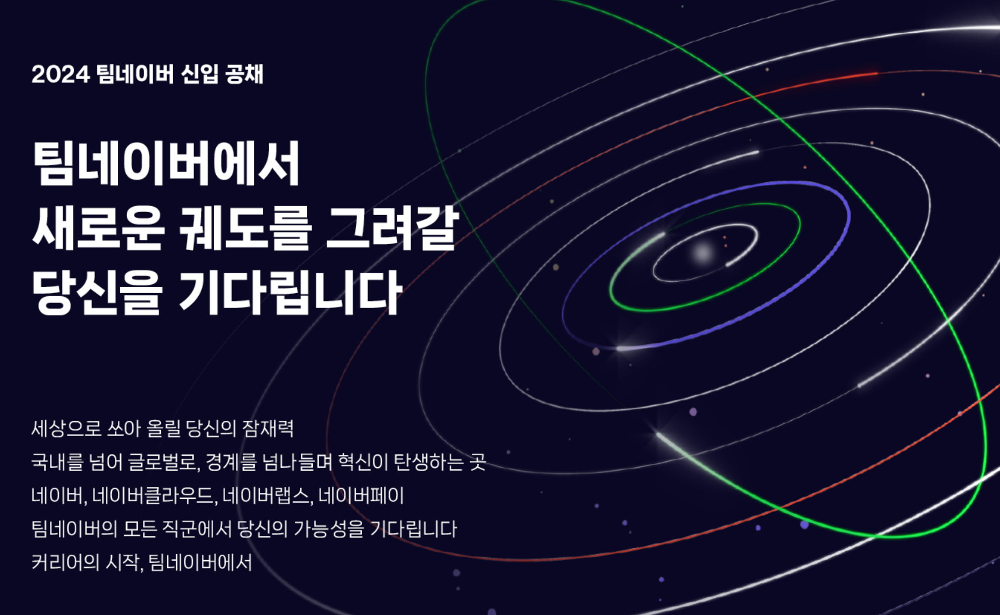
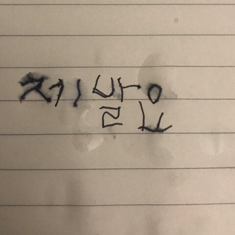
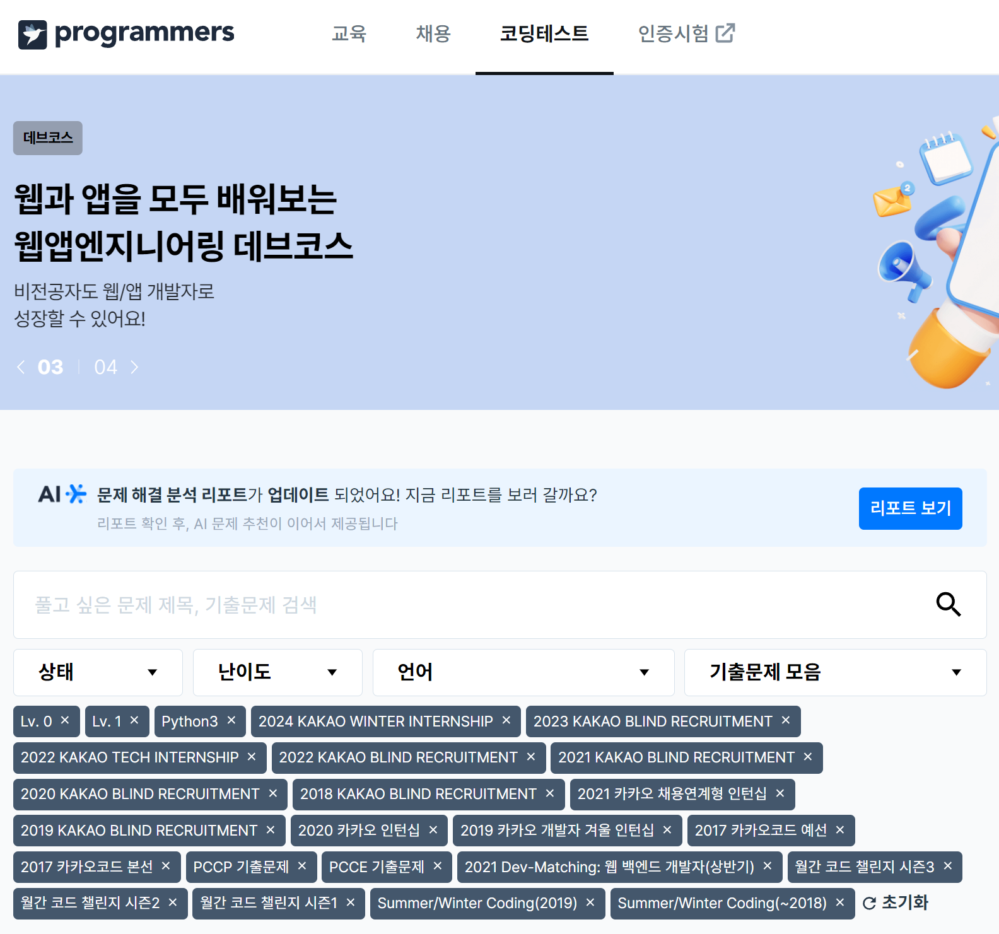
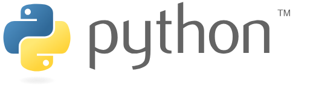
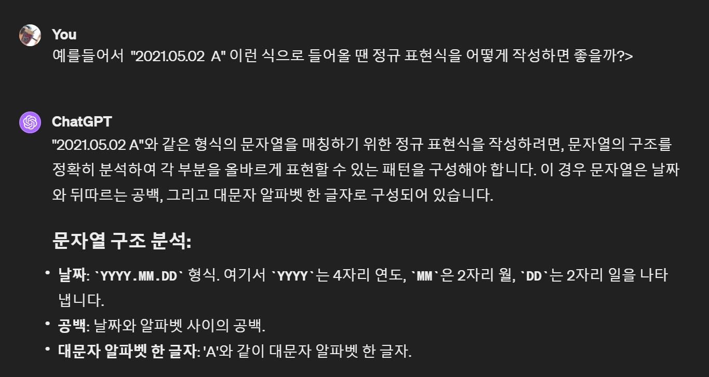
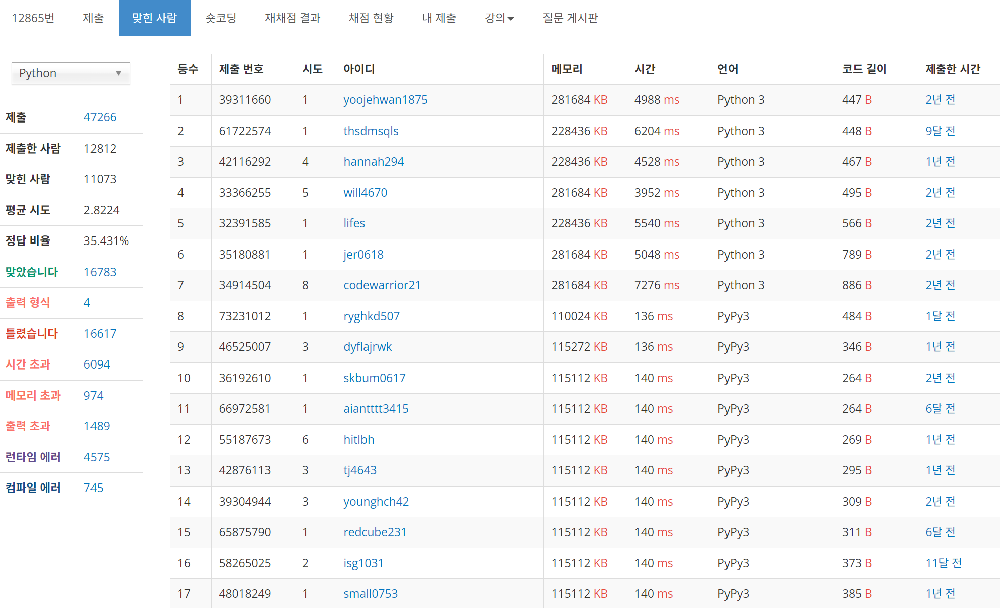
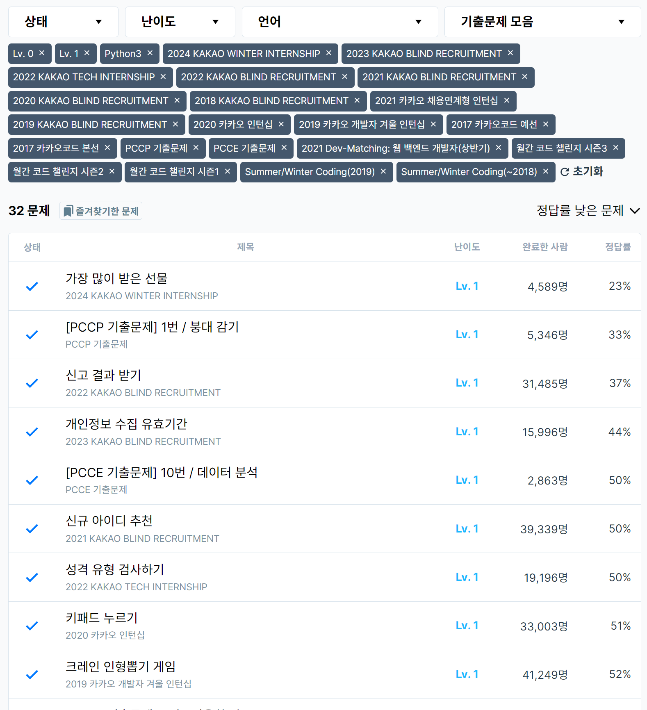
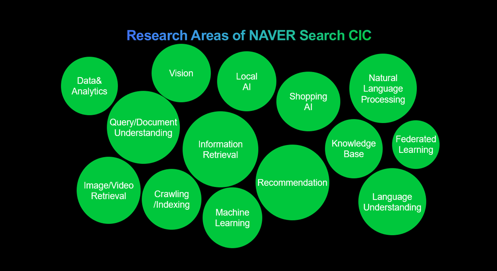
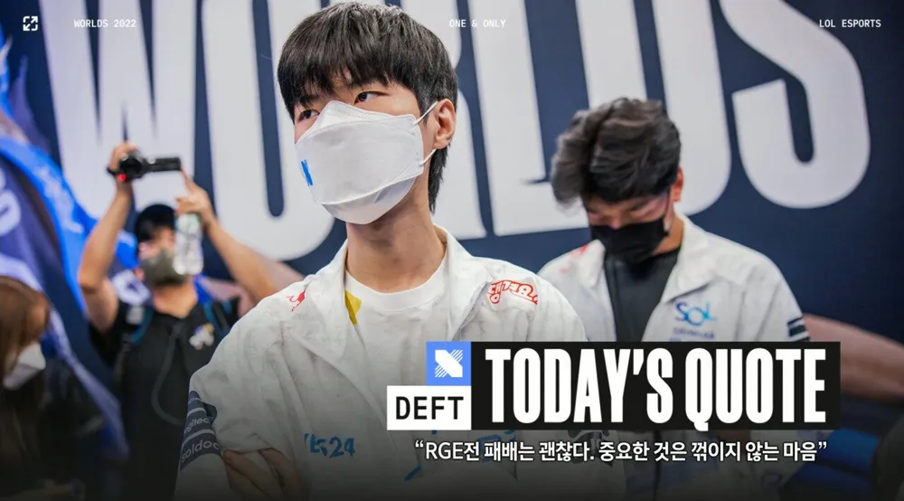

# 네이버 공채를 도전해보았다

## 두둥 


두둥, 공채 소식을 듣게 된 것은 매우 급작스럽게였다. 피어 개발자들 디스코드에서 갑작스럽게 올라온 공채 소식은, 피어 업데이트를 해야 하는 상황 속에서, 취업 준비에 정신이 없던 많은 이들의 머릿속에 울려퍼졌다. 그 중에 나 역시 포함되었고, 결국 싫든 좋든 네이버라는 곳을 도전할 기회는 버릴 수 없단 생각에, 지금까지의 쌓아 올린 것의 종지부를 찍기위해, 해야 한다는 마음만 가득했던 영역을 고민하기 아니, 억지로 시작했다. 

## 어디보자.. 내가 코딩 테스트를 어디까지 준비했더라??

처음에는 대단히 막막했다. 그도 그럴 것이 기존에 코딩테스트를 준비해야 한다는 말을 세간에서 듣고, 걱정 반, 어떻게 해야할지 막막함 반으로 시작했던 기억이 떠올랐다. 이미 학습한 인강들, 처음에는 인강을 다시 복습을 해야 할까? 라는 생각이었다. 

그러나 한 가지. 작년의 기억이 불현듯이 떠올랐다. 작년에도 네이버 공채엔 도전 했었고 시험을 봤던 기억. 코딩 테스트를 칠 때 느꼈던 감정. 실패의 기억이 불현듯 내 앞에 펼쳐졌었다. 그때는 정말 구현에 대해서도, 어떤 구조가 효과적인지에 대해서도 전혀 몰랐고, 그런 상황에서 막막함과 싸워 결국 1문제를 겨우 겨우 푸는 결론에 도달했었지...



거기까지 머리가 돌아가자, 인강을 보는 걸로는 결국 구체적이고 실질적이진 않다고 판단. 남은 시간이 대략 2주가 남은 시점에서 어떻게 해야할지를 전면 재 검토를 하게 되었다. 


> 으아ㅏㅏㅏㅏ 프리ㅣㅣㅣㅣ자ㅏㅏㅏ

그렇게 어떻게 해야하나를 뒤지던 도중, 코딩테스트를 이미 준비를 시작했던 팀 이야기를 듣기도 하고, 기존에 기억을 뒤져 보니 네이버의 코딩 테스트 형태가 프로그래머스에서 제공하는 방식을 활용하고 있단 생각도 들었다. 



프로그래머스에서 어떤 문제를 풀면 좋을까, 그리고 무엇보다 어떻게 시작하면 좋은가 되게 막막했다. 일단 깔려있는 공개된 문제들을 푸는 것도 중요하겠지만 2주라는 시간 안에 가능한 시간을 어떻게 쓸지, 그리고 무엇보다 코테를 위해 알아야할 언어적 도구들의 상식 갖가지를 생각하니 참 아슬아슬하다는 생각을 했다. 

## 파이썬은 코테에서는 옳다(?)



파이썬이라는 언어를 쓰는 것이 꽤 좋은 점과 애매한 점이 있다. 하나는 우선 변칙이 많기에 응용력이 좋다. 하지만 디버깅이 어렵다. 내부에 객체 형으로 되어 있는 것은 다른 언어나 비슷하지만, 그럼에도 축약되어 예약어로 되어 있는 것들이 정말 말도 안될 정도로 응용력이 높다보니 자바나 C++, 하다 못해 자바 스크립트를 쓰다가 오는 순간 신천지를 맛본다.

하지만 신천지는 항상 그렇다, 복잡한 코드를 쓸 때면 꼬여있는 코드들을 볼 때, 그런 객체를 볼 때 느껴지는 복잡함은 상당하다. 뿐만 아니라 느리다. 요즘은 더 빨라진 파이썬, 멀티 프로세싱을 지원하는 인터프리터의 등장으로 달라질 거라는 기대를 받고는 있지만, 여전히 느리다는 점은 코딩 테스트에서 다소 아쉬움으로 남을 수 있다. 

그렇기에 선택이라기보단 물론 대중성을 따라갔던 것이겠지만 언어를 배워야 할 방향을 나 역시 C++ >> JS >> TS 를 거쳐 Java를 배워나갔고, 그 과정 속에서 처음에 맛만 보았던 파이썬은 잊혀져 갔다. 하지만 이번에는 2주라는 시간이 문제였다. 

Java나, C++ 도 사실 강력한 도구들은 있다. STL을 비롯해서 데이터를 저장하는 객체들이 가진 내장 기능들은 그 나름의 강력함을 갖고 있었지만, 여러모로 다급한 현재의 상황에서 쓰기에 온전히 강력하다고 이야기하기엔 그랬다. 특히 고민했던 가장 큰 부분은 파이썬의 컴컴프리헨션이 가지는 능력치였다. 

단적인 예를 보여주자면 다음 문제다. Lv1의 2022 카카오 블라인드 채용 코테 문제였던 '신고 결과 받기' 라는 내용이다. 

```python
# 이건 내가 푼 것이다. 
import re

def solution(id_list, report, k):
    id_count = {id: set() for id in id_list}
    mail_list = {id: 0 for id in id_list}
    # 바로 진행
    for data in report:
        reporter, target = map(str, data.split())
        id_count[target].add(reporter)
        
    for key in id_count:
        if len(id_count[key]) >= k:
            for target in id_count[key]:
                mail_list[target] += 1
                
    return list(mail_list.values())
```

```python
# 이건 커뮤니티에서 가장 인기가 많았던 코드다 
def solution(id_list, report, k):
    answer = [0] * len(id_list)    
    reports = {x : 0 for x in id_list}

    for r in set(report):
        reports[r.split()[1]] += 1

    for r in set(report):
        if reports[r.split()[1]] >= k:
            answer[id_list.index(r.split()[0])] += 1

    return answer
```

```cpp
// C++ 1등 인기 코드 
#include <bits/stdc++.h>
#define fastio cin.tie(0)->sync_with_stdio(0)
using namespace std;

vector<int> solution(vector<string> id_list, vector<string> report, int k) {
    // 1.
    const int n = id_list.size();
    map<string, int> Conv;
    for (int i = 0; i < n; i++) Conv[id_list[i]] = i;

    // 2.
    vector<pair<int, int>> v;
    sort(report.begin(), report.end());
    report.erase(unique(report.begin(), report.end()), report.end());
    for (const auto& s : report) {
        stringstream in(s);
        string a, b; in >> a >> b;
        v.push_back({ Conv[a], Conv[b] });
    }

    // 3.
    vector<int> cnt(n), ret(n);
    for (const auto& [a, b] : v) cnt[b]++;
    for (const auto& [a, b] : v) if (cnt[b] >= k) ret[a]++;
    return ret;
}
```

```java
// Java 1등 인기 풀이 드드
import java.util.Arrays;
import java.util.HashMap;
import java.util.List;
import java.util.stream.Collectors;

class Solution {
    public int[] solution(String[] id_list, String[] report, int k) {
        List<String> list = Arrays.stream(report).distinct().collect(Collectors.toList());
        HashMap<String, Integer> count = new HashMap<>();
        for (String s : list) {
            String target = s.split(" ")[1];
            count.put(target, count.getOrDefault(target, 0) + 1);
        }

        return Arrays.stream(id_list).map(_user -> {
            final String user = _user;
            List<String> reportList = list.stream().filter(s -> s.startsWith(user + " ")).collect(Collectors.toList());
            return reportList.stream().filter(s -> count.getOrDefault(s.split(" ")[1], 0) >= k).count();
        }).mapToInt(Long::intValue).toArray();
    }
}
```

여러 언어적 이슈들이 있지만 보이는가? 사실 객체 지향 언어가 되니 문제 풀이한 코드의 양이 막 진짜 천지 개벽수준의 차이다! 라고 말하긴 어렵다. 하지만 그럼에도 **코드도 줄어들었으며, 확실하게 보이는 것은 도리어 강력한 기능들과, 컴프리헨션의 조합이 얼마나 깔끔하고 정갈하게 로직을 설명하는가?** 에 대한 부분이었다. 

하물며 내공이 부족한 내가 쓴 코드 정도만 보더라도 1등으로 추천 받은 다른 언어 코드들에 비해서 짧았으면 짧았지, 코드의 길이나 간결함은 꽤나 괜찮게 나왔다.(물론 장인의 파이썬만은 절대 못한 게 보인다...) 이러한 점에서 파이썬은 빠르게 배우고, 로직을 표현하는데 있어 다른 언어가 필요한 '노하우' 나 '내공' 과 같은 부분이 훨씬 빠르게 습득 가능하다는 생각을 느끼게 되었을 때, 내 안의 언어에 대한 확신은 명확해졌고 파이썬으로 문제를 풀어 보자! 라는 내 나름의 확신을 얻을 수 있었다. 

## 보고 해? 보지 않고 해?

그 다음으로 고민했던 부분은 어떻게 성장할 수 있나? 에 가까운 문제였다. 2주라는 시간 안에 해결해야 하는 상황. 문제를 마냥 미련하게 풀 수는 없었고, 하물며 파이썬의 컴프리헨션이 강하다고는 했지만 내가 그걸 잘 다루는 것은 아니었다. 

그러니 결국 답지를 보면 그게 도움이 되는가? 라는 생각도 들었고, 그렇다면 어떤 식으로 하는게, 시간과 실력 양쪽을 다 잡을 수 있을까? 에 대한 고민이 될 수 밖에 없었다. 


> 뱃신도 점심 고민은 할거야.. 아마도

여기서 내가 본능적으로 한 것인지, 아니면 나름 확신이 있던 건지 이런 생각에 도달할 수 있었다. 

>결국 코딩 테스트는 문제 해결 능력을 보는 것인데, 문제 해결이라는 것은 결국 아이디어가 튀어 오르냐 아니냐가 아닐까? 🧐
>
>그렇다면 내가 튀어 나올 지식이 있어야 하지만, 지금은 없다(...ㅠ) 😂
>
>그러나 내가 만약 그에 해당하는 적당한 아이디어만 어디서 계속 얻어오는 연습을 하다보면, 패턴을 익힐 수 있지 않을까? 🙄
>
>그러면 막히는 순간은 내가, 아이디어를 떠올리는 것 자체를 그대로 내걸로 만들면 되지 않을까? 😶
>
>오케이 이거다 🤔


> 나는 고민할 거리를 주마, 생각은 니가해라

물론 이게 뭐 그리 대단한 거냐는 사람도 있을 수 있다. 하지만 교육심리학적으로 문제에 도달하는 과정은 사실 되게 기계적인 것이다. 창의적이게 가능하지 않고, 결국은 주어진 정보를 재조합하는 연습이 누가 더 잘 되어 있냐의 문제인 것이다. 그러나 학생들의 경우, 아직 어리기 때문에 그 과정을 그렇게까지 능동적으로 하는 것은 어렵다. **그래서 결국 이러한 걸 배우는 가장 좋은 방법은 우선 일단 정보들을 다 쑤셔 넣고(주입), 문제를 만날 때마다 깨지고(좌절, 고민), 답에 대한 논의 내지는, 로직에 대한 설명을 들으면서 그 로직을 내가 익히는 것으로 결국 결론을 아무도 없는 상황에서 풀어내는 것이다.** 

내가 아는 곳 까지는 스스로 가고, 스스로 간 뒤에 고민 거리가 생기면, 코드를 보진 않고 아이디어만 얻는다. 특히 찾아야 할 정보들까지도 제공해준다면 이거야 말로 기계적인 학습이 되는 것이고, 무의식적으로 자기것으로 만들기 최고의 좋은 방법이란 생각이 불현듯 든 것이다. 

거기다 프로그래머스도 그렇고 백준도 그렇고, 커뮤니티 내부에 문제 풀이를 해둔 사람들의 내용이 공유될 수 있다. 이걸 마지막에 봄으로써 내 부족함과 **자기 객관화로 정신이 번쩍 들면**, 그야 말로 앞에서는 시간을 줄이면서도 기계적으로 아이디어를 내는 경험을 얻고, 또 적용시키는 과정으로 마치 뇌를 속이듯 학습이 진행되며, 이후 공유되는 커뮤니티의 코드들을 통해 미친 자기 객관화를 통한 매운맛(...) 으로 효율과 실력을 얻기에 매우 좋은 구도가 형성 되는 것이다. 


> 특히 백준은 소요 시간과 메모리 사용량을 보여주는데, 이게 또 한 편으로 사람의 열받게 만든다. 내가 만든 로직만 120ms고 나머지 사람들이 60ms 만에 문제를 푸는 걸 볼 때는 열도 받는다ㅋㅋ..

이러한 방법으로 한 문제, 한 문제를 푸니 놀랍게도 프로그머스의 Lv1 의 카카오 문제, 숨이 턱턱 막히던 게 어느새 머릿속으로 자료 구조가 떠올랐고, 변수를 어떻게 설정할지를 생각할 수 있었다. 그리고 결정적으로 문제를 푸는 과정에서 '이때는 우선 생각부터 해보자' 라던지, '일단 만들고 나서 최적화를 위해 변수를 줄이면 되는구나' 와 같은 자아 성찰적 학습이 가능해졌다. 특히 파이썬의 도구들을 하나 씩 적용해서 풀면서 넘어갈 때는 파이썬을 정복했다는 생각도 함께 하면서 묘한 쾌감(?)을 느낄 수 있었다. 



결과적으로 이러한 노력은 생각 이상으로 효과적이었다. 시간은 줄이되 2주란 시간 다른 것들을 하면서도 파이썬을 빠르게 습득 할 수 있었으며, 정답률을 뚫고 LV1은 성공적으로 돌파, LV2 도 쉬운건 풀 수 있을 정도로 도달 한 내 모습이 있었다. 

## 그래서 네이버 코테는 어땠는가?

자세하게 내용이나 이런 것은 당연히 기업 자산이므로 공개가 불가하도록 되어 있으니, 그런 부분은 제외하고 내 느낌 위주로만 정리하면 다음과 같다. 

1) 마음이 급하다면 입출력 파트 메서드들은 생각하지 말자. 프로그래머스는 그런 부분을 고려하지 않는다. (아예 리스트 내지는 정수값, 문자열로 들어온다.)
2) 네이버는 전후 1~ 2년 간의 내용, 면접 후기 등을 보면 하나같이 **'기업을 위한 아이디어, 구상력' 등을 요구하는 부분이 많았다**. 이 말은 현실적으로 네이버의 다양한 서비스나 도구들을 활용하는 비즈니스 모델을 구현내는 것에 우선 초점을 맞춘다는 점이며, 어떤 기술자적인 자질이 압도적 우선순위라는 생각은 들지 않았다. 그리고 이는 코딩 테스트에서도 그대로 녹아든다. <br/>
   **데이터의 재조합** 이라는 측면이 지속적으로 강조 되며, 오히려 복잡한 데이터들의 덩어리를 주는 것은 마치 SQL 데이터들의 재조합한 새로운 데이터 창조에 욕심이 있다는 것을 노골적으로 보여주는 듯 보였다. 
3) 시간 복잡도, 공간 복잡도는 코딩 테스트 기초에는 정말 중요하게 다뤄지고, 실제로 여전히 문제들 중에 중요시 하는 경우가 있긴 하다. 하지만 이 **역시 '어지간히 비효율적인 로직'을 생각하는데 특화된 분이 아니라면 무시하고 나아가라.** 네이버 코테 문제들에서는 요구하는 경우는 드물지 않나 라는 생각을 했다. 
4) 카카오가 확실히 코딩 테스트의 문제가 남다르다. 반대로 네이버는 쉬운 편이다. LV 목표는 2정도를 깔끔하게 풀어낼 수 있으면 충분하다고 느껴진다. 

쉽다 - 아니다는 논란의 여지가 있으니, 그런 부분이 아니라 의도를 생각해보면서 개발자를 어떤 식으로 생각하는지를 고민해보고자 한다. 네이버라는 기업은 어떤 기업인가? 사실 플랫폼으로써, 포털이라는 개념의 구체로써 2000년대 초반에 비하면 그 영향력이 분산화 된 것은 사실이지만 여전히 사람들에겐 '모이는 공간'의 일부이자 '검색의 공간'의 대명사이다. 


> 출처 : [네이버 서비스로 알아보는 DEVIEW 2021 (1/3)](https://d2.naver.com/news/3875565)

그러한 네이버의 사업 전략은 상당히 명백하다. 플랫폼의 장악력을 토대로, 사업성이 있는 저변을 넓히는 작업을 하고, 동시에 뒤에선 보다 많은 RnD를 통해 AI를 비롯 지속적인 기술적 팔로잉을 보여주고 있는 회사라고 나는 판단하고 있다. 

그리고 이런 점에서 바라보면, 카카오나 다른 기업들과의 차별적인 부분도 보이는데, 네이버의 기술의 적용 속도나, 비즈니스 모델들은 생각보다는 대중들에게 더 가깝고, 그렇기에 기술적인 우위나, 기술적 점유가 생각 이상으로 막 활발하게 나타나지는 않는다. 다만, 이를 착각하지 않았으면 하는 것은 이것이 나쁜게 결코 아니라는 점이다. 신기술은 아무리 좋아도 대중들에게 적용되기까지 엄청난 시간과 돈과, 사회적 전파가 이루어져야 한다. 그게 없다면 아무리 테크가 빠르게 진보해도 그 돈먹는 하마는 돈을 먹을 뿐 뱉어내질 못하게 되고 마르지 않는 샘물이 아닌 이상 기업은 파산을 면치 못할 것이다. 

그런 점에서 네이버는 영리하다고 생각한다. 결국 기존의 자료, 데이터들을 활용하는 쪽에 더 초점을 맞추고, 그걸 구현하는 아이디어 있는 인재들을 모으려는 것이 기본적인 스탠스라는게 느껴지는 것이다. 그리고 **이러한 부분은 코딩 테스트에서도 영향을 끼쳐서, 단순히 써야하는 기술의 난이도를 묻기 보단, 실질적으로 아이디어를 구현하는, 로지컬한 사고가 가능해서, 그게 어떤 식으로든 구현되도록 만드는데 목표 점을 찍고 있다는 생각을 할 수 있었다. 어쩌면 기업의 신념이나 철학이라고도 느껴질 정도였다.** 

그런 방점이 찍힌다면 네이버라는 기업 규모를 생각해도 왜 이런 문제의 난이도 인지가 오히려 납득이 되는 느낌이다. 기획을 조금이라도 해보고, 프로젝트를 해본 사람들은 알 것이다. 기술력은 생각보다 중요하지 않다. 결국 옛날 기술도 묶어서 무얼 만들어내기에 부족함이 없을 때가 훨씬 많고, 오히려 신 기술을 적용 시킨 뒤에 예기치 못한 문제들이 터지는 경험은 종종 있는 일이었다. 

하물며 예전 기억을 떠올려보며, 인사 담당자의 입장적으로 생각해보자. 난이도가 높아진다면? 설령 점수를 가지고 기본적으로 걸러 낸다고 하더라도, 그 뒤에는 아마도 검토의 과정을 거칠 거고, 그 검토 속에서 코드에 어떤 로직을 고려 했는가를 보지 않겠는가? 여기서 내 지금까지의 인생 경험을 걸쳐 본다면 아마 100프로 뭔가 분석하고 보고 있었을 것이라 생각한다. 으음~ 정말로 매력적인 기업이다. 

## 그래도 마지막으로 코테에 도움되는 내용을 좀 적자면...

잡설이 길었다. 어차피 결과는 나와 봐야 알 것이고, 이후로도 면접이 된다면 정말(!) 좋을 것 같은데... 그래도 이 글을 읽는 가치를 만들고자 네이버 코테 준비에서 도움이 될만한 내용들을 정리해보자면 다음과 같다. 

### 1) 복잡한 알고리즘을 배울 시간에 우선 '데이터 타입'  부터

이번에 특히나 느꼈던 것인데, 알고리즘은 암기에 영역이다. 이해로 할 수 있는 사람도 있겠지만 그건 1티어인 거고, 대다수의 사람들은 알고리즘의 스텝을 이해했다고 하면서도 잘 안될 수 밖에 없다. 그만큼 복잡하고, 구현한다고 하면 결국 레퍼런스 코드를 보고 비즈니스 로직에 맞춰 재수정하는 일이 더 많지 않겠는가? 거기다 네이버의 코테는 그렇게까지 요구되는 문제는 대략 1문제 정도가 아닌가 싶었다. 

하지만 이에 반해 파이썬을 사용하는 이상, 그리고 파이썬이 아닌 다른 언어도 마찬가지로 객체를 어떤 타입에 저장하냐 에 따라 코드의 질이 달라질 수 밖에 없다. 

예를 들어 집합 클래스는 중복 데이터는 넣어도 반영되지 않고, 집합의 원소 처럼 활용된다. OrderedDict는 사전형이지만 순서성이 보장되어 LRU 알고리즘을 만들거나, key가 순서가 보장되지 않을 때 쓰기 효과적이다. Dict의 key 요소는 여러가지로 쓸 수 있지만, 특히 거기에 일부러 순서를 기록하도록 정수를 쓰는 식으로 하면 리스트와 연계해서 데이터 관리가 용이하다. 

데이터 타입은 생각보다 객체지향 언어에서 엄청난 역할을 해준다. 그 특성을 구현했다는 것만으로도 각 문제의 로직, 논리를 세우는데 적용시켜 자연스럽게 객체가 곧 데이터와 로직을 구현하는 키 역할을 하게 되고, 비즈니스 로직을 코드로 구현할 때 매우 필요 없을 수 있다. 

```python
# [PCCE 기출문제] 10번 / 데이터 분석

def solution(data, ext, val_ext, sort_by):
    extDict = {"code":0, "date":1, "maximum":2, "remain":3}
    newData = []
    for d in data:
        if d[extDict[ext]] < val_ext:
            newData.append(d)
    
    newData.sort(key=lambda x : x[extDict[sort_by]])
    return newData
```
> 해당 문제의 핵심은 사전형을 통해 굳이 데이터를 찾는 과정을 파이썬으로 줄인다는 점이다. 

데이터 타입의 핵심 성격을 알기만 하면, 불필요한 조건문, 반복문을 최소화 할 수 있다. 이건 엄청난 장점이고 코딩 테스트에서 뿐 아니라 로직을 세우는 어떤 언어의 경우에도 매우 유용한 도구가 될 수 있는 것이다. 물론, 더 높은, 더 기술적 성장을 원한다면, 그 다음은 분명 필시 알고리즘이라는 사실은 잊지 말자. 🧐

### 2) 파이썬 컴프리헨션의 기능은 반드시 숙지하고 시작하자

```python
# 2023 KAKAO BLIND RECRUITMENT : 개인정보 수집 유효기간
def to_days(date):
    year, month, day = map(int, date.split("."))
    return year * 28 * 12 + month * 28 + day

def solution(today, terms, privacies):
    months = {v[0]: int(v[2:]) * 28 for v in terms}
    print(months)
    today = to_days(today)
    expire = [
        i + 1 for i, privacy in enumerate(privacies)
        if to_days(privacy[:-2]) + months[privacy[-1]] <= today
    ]
    return expire
```

본문제를 나는 얼마나 코드를 짜서 풀었는지 아는가? 

```python
import re
import re

def solution(today, terms, privacies):
    answer = []
    
    conditionDate = [int(today[0:4]), int(today[5:7]), int(today[8:10])]
    termsDict = dict()
    dateDict = dict()
    typeDict = dict()
    deleteList = []

    for term in terms:
        match = re.match(r'([A-Z])\s(\d+)', term)
        termsDict[match.group(1)] = int(match.group(2))
    
    i = 1
    for privacy in privacies:
        target = re.match(r'(\d{4})\.(\d{2})\.(\d{2})\s([A-Z])', privacy)
        dateDict[i] = [int(target.group(1)), int(target.group(2)), int(target.group(3))]
        typeDict[i] = target.group(4)
        i += 1
        
    def findDeleteTarget(limit, target):
        print(limit, " vs ", target)
        if (limit[0] > target[0]):
            return True
        if (limit[0] == target[0]) and (limit[1] > target[1]):
            return True
        if (limit[0] == target[0]) and (limit[1] == target[1]) and (limit[2] > target[2]):
                return True
        return False
    
    for key in dateDict.keys():
        limit = termsDict[typeDict[key]]
        day = dateDict[key][2] - 1
        month = dateDict[key][1] + limit
        if day == 0:
            day = 28
            month -= 1
        addOn = 0
        if month > 12:
            addOn = month // 12
            month = month % 12
            if month == 0:
                month = 12
                addOn -= 1
        year = dateDict[key][0] + addOn 
        if findDeleteTarget(conditionDate, [year, month, day]):
            answer.append(key)
    return answer
```

물론 접근 방법의 차이는 있다. 하지만 어쨌든 그 차이와 함께 눈여겨 볼 부분은 ` months = {v[0]: int(v[2:]) * 28 for v in terms}` 과 
```python
    expire = [
        i + 1 for i, privacy in enumerate(privacies)
        if to_days(privacy[:-2]) + months[privacy[-1]] <= today
    ]
```
이 부분이다. 컴프리헨션은 데이터를 초기화 할 때 라던지, 데이터 자체의 가공도 한꺼번에 가능하며, 내부에 조건을 넣어줌으로써 로직을 생성할 수도 있는 매우 유용한 기능이다. 위에 부분은 기간을 담은 데이터 terms에서 하나씩 객체를 끄집어 낸 뒤 그것들의 key는 그대로 한글자로 만든 뒤, 값은 그 중에 특정 위치에 올 숫자를 지정한뒤 int 속성으로 형변환 하라는 뜻을 갖고 있다. 

그 뒤에 expire 부분은 오늘 기준, 기준이 되는 날자들의 데이터들을 일수로 변환한 조건이 부합할 때, enumerate라는 메소드로 순서와 값을 가지고 온 뒤 해당하는 번호만 변환해 주는 구조를 갖고 있다. 이 얼마나 논리적 표현을 담아낸 것인가! 

### 3) 모르는 것은 모르는 거다.

보통 "스스로 문제를 풀어야 한다" 라는 표현을 사람들은 온전히 아무것도 보지 않고 할 때 비로소 내것이라는 생각을 가지는 경우가 많다. 이는 분명 틀린 말은 아니다. 

하지만 예를 들어 LRU 알고리즘을 알아야 하는 문제, 문자의 정규화가 필요한 상황에서 정규화 개념을 모른다고 한다면, 과연 끙끙거리며 이러한 상황을 해결하려고 스스로 미친듯이 원시시대 불피우기 위해 도구를 만들듯 접근하는 사람들이 종종 있다. 하지만 그게 맞을까?

우리는 21세기를 살아가고, 학습의 도구들은 넘쳐난다. 특히나 이런 난관에 봉착했을 때, 필요한 도구의 힌트를 얻는 다는 것은 어쩌면 생존과 직결될 정도로 중요한 문제일 것이고, 다양한 옵션들이 넘쳐나는 이 시대에 적절한 것을 빠르게 얻어내는 것은 분명 매우 중요한 덕목일 것이다. 

해답을 달라고 한다거나, 구현한 코드를 달라고 한다거나 하는 행위는 당연히 치팅일 것이지만, 반대로 `~이러한 문제를 해결하기 위해 이런 아이디어를 생각해보았는데 어때?` 하고 검사를 받아 보거나,  `내 상황은 ~이고 이럴 때 필요한 건 ~ ~ 라고 생각하는데, 관련된 자료나 파이썬 도구들은 뭐가 있을까?` 라는 질문으로 접근한다면 chatGPT는 훌륭한 선생님이자, 사실 지식을 알고 재조립하는 과정의 연습을 한방에 단축 시키는 좋은 기회가 될 수 있다. 

하지만 생각보다 많은 이들이 이 방식을 마치 치팅이나 잘못된 것이라고 생각하고, 혼자 끙끙 앓는 방식으로 학습을 하다가 결국 힘이 빠지는 일이 발생하게 되는데, 과연 이게 맞는 학습일까? 판단은 읽는 이들에게 맡기고 싶다. 

## 결론 : 과연 나는 기회를 얻게 될까?

7전 8기라는 마음으로 지금까지 왔다. 도전의 끝까지 온 것은 아직 아니지만, 요즘의 고용시장에서 정말 마음에 드는 일 자리에 들어가기에는 쉽지 않은 상황이라는 것을 요 최근 20개 정도 지원하면서 깨달았다. 덕분에 방향성을 깨닫고, 마지막 개인 프로젝트를 진행해보려고 하고 그것으로 결론을 내보려고 하는 중간에 찾아온 네이버의 기회는 아직까지는 분위기가 좋아 보인다. 

3문제 중 2문제 정도를 내가 생각해도 잘 처리 했고, 하물며 코드 최적화까지 할 수 있을 만큼 성장할 수 있었다. 2주간의 고생은 그래도 그 나름의 의미를 가지고 잘 내 경험의 일부로 녹아든 것이라고 생각한다. 그러나 여전히 길은 남았고, 위에서도 언급 했듯이 아직 부족하다느 것을 깨달은 이상 이제는 정말 나에게 집중해서 필요한 것들을 이뤄내야 하리라 싶다. 마지막 3개월, 새로운 시작, 새로운 기회를 얻기 위해 나는 달려왔고, 나를 지지해준 가족들은 3년이란 시간을 희생해주었다. 너무나 고마운 그들을 지키고, 내 인생을 제대로 살기 위해 마지막까지 노력해보겠다. 



```toc

```
