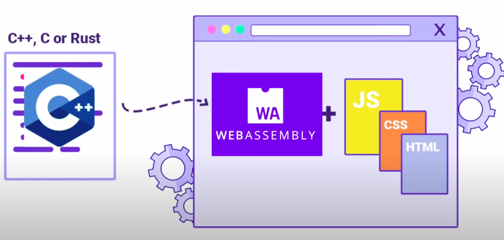
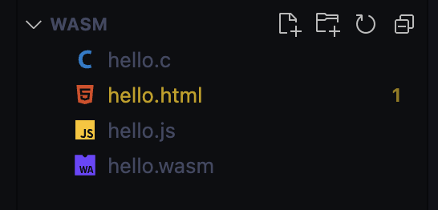
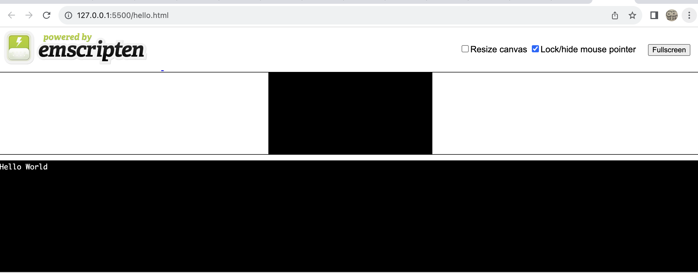
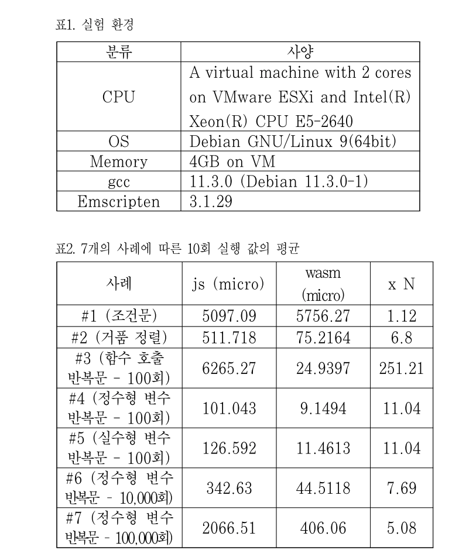
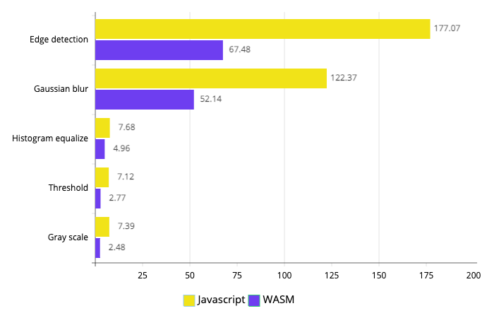
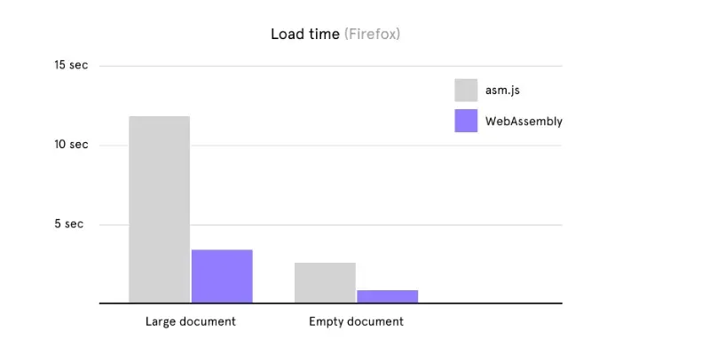

# 웹 어셈블리를 알아보자

웹과 어셈블리. 사실 두 조합에 대해 조금 공부를 해보면 어울리지 않는 다는 것을 알 것이다. 

웹 시장을 평정한 자바스크립트는 인터프리터 방식이고, 크롬의 V8 엔진을 통해 실행되며 컴파일 방식이 아니다.

하물며 멀티 스레드 방식이 아닌 언어적 특성 상 CPU의 자원만을 사용하고 GPU 사용이 제한된다는 점을 포함해 성능적으로 다른 언어들에 비해서는 상당히 '부족하다'는 인식이 있다.

거기다 브라우저의 구조인 BOM, DOM 구조를 갖추다보니 하드웨어를 건드리기 '힘들다 '는 제약 등이 겹쳐지면서 웹은 오로지 웹의 기능성에 집중되며 하드웨어 조작은 어렵다는 이야기들이 많고, 그만큼 제한이 있는 것으로 보는 경우가 많았다. 

하지만 이는 피상적인 영역에서의 이야기다. 웹 시장의 성능적 대 변화를 일으킨 크롬의 V8 엔진은 기존의 인터프리터에서 JIT 컴파일러를 추가하는 방식으로 개선되었으며, 이 방식으로 구현된 엔진의 성능은 여전히 다른 엔진을 쓰지 않아도 될 정도로 훌륭했다. 

이 방식은 Just In Time이라고 하여, 바이트 코드로 변환되어 Interpreter 되다가, hotspot(자주 쓰이는 부분)을 만나게 되면 TurboFan 이라는 기능이 활성화 되면서 캐싱과 기계어로의 컴파일 시킴으로써 코드 크기와 속도를 월등히 줄여주는 기회를 만든다. 
```jsx
// v8/src/execution/rumtime-profiler.cc
OptimizationReason RuntimeProfiler::ShouldOptimize(JSFunction function, BytecodeArray bytecode) {
  // int ticks = 이 함수가 몇번 호출되었는지
  int ticks = function.feedback_vector().profiler_ticks();
  int ticks_for_optimization =
      kProfilerTicksBeforeOptimization +
      (bytecode.length() / kBytecodeSizeAllowancePerTick);
  if (ticks >= ticks_for_optimization) {
    // 함수가 호출된 수가 임계점인 ticks_for_optimization을 넘기면 뜨거워진 것으로 판단
    return OptimizationReason::kHotAndStable;
  } else if (!any_ic_changed_ && bytecode.length() < kMaxBytecodeSizeForEarlyOpt) {
    // 이 코드가 인라인 캐싱되지 않았고 바이트 코드의 길이가 작다면 작은 함수로 판단
    return OptimizationReason::kSmallFunction;
  }
  // 해당 사항 없다면 최적화 하지 않는다.
  return OptimizationReason::kDoNotOptimize;
}
```

이렇듯 웹은 크롬 v8이 구현되는 시점부터 이미 어셈블리어 내지는 기계어에 가깝게 컴파일을 하여 성능을 끌어올리는 생각을 했었고, 그것이 더 나아가서 C, C++, RUST 등의 고급 소스 언어를 컴파일해 브라우저에서 바이너리 형식(low-level language)의 저급 으로 바꾸는 기술이 제시되게 된다. 

## 웹 어셈블리의 정의 
1. WebAssembly 는 최신 웹 브라우저 안에서 실행할 수 있는 새로운 유형의 코드이다. 
2. 위에서 언급했듯, C, C++, RUST 등의 고급 언어를 컴파일하여 바이너리 형식으로 바꾼 것을 '웹'에서 구동 가능하도록 만드는 기술이다. 
3. 2019년 웹 어셈블리는 웹 표준을 관리하는 W3C에서 4번째 웹사용 언어로 공식 권고 했다. 
4. 이때 html, ui, ux를 대체하는 것을 목적으로 나온 것은 아니며 어디까지나 '성능이 필요한 영역'을 위한 대안으로 나오게 된다. 

## 웹 어셈블리의 목표 
어셈블리의 목표는 다음과 같다. 
- 빠르고, 효과적이고, 이식성이 좋을 것 
	- 일반적인 하드웨어들이 제공하는 기능을 활용해 여러 종류의 플랫폼 위에서 네이티브에 가까운 속도로 실행된다. 
- 읽기 쉽고 디버깅이 가능할 것 
	- 웹 어셈블리는 저수준의 어셈블리 언어지만 손으로 작성하고 보고 디버깅할 수 있도록 사람이 읽을 수 있는 수준의 텍스트 포맷을 유지한다. 
	- 웹 어셈블리가 할 수 있는 일들(스펙)이 다듬어지고, 이를 위한 API 들이 구성되고 있음 
- 안전함을 유지할 것 
	- 샌드박싱된 실행환경에서 안전하게 돌아갈 수 있도록 설계한다.
	- 웹 상의 다른 코드와 마찬가지로 same-origin 권한 정책을 강제 한다. 
- 웹을 망가뜨리지 말 것 
	- 다른 웹 기술과 마찰없이 사용되면서 하위 호환성을 관리할 수 있도록 설계된다.
- 웹 어셈블리는 웹과 자바스크립트 환경이 아닌 곳에서도 사용이 가능하다. 
	- [Non-web embeddings](https://webassembly.org/docs/non-web/)

결국 정리하면 웹 어셈블리는 HTML, CSS, JS 환경에서 오는 제약들을 돌파하고, 특히나 단순히 프론트적인 영역의 침범을 위한 기술이 아닌, 요구되는 기능이 늘어나는 웹 환경에 대해 성능적으로 월등하면서도 기능 개발이 가능하도록 기존의 언어들을 웹에서 이용가능한 중간 단계 언어 어셈블리어로 만드는 기술- 이라고 볼 수 있다. 

## 웹 어셈블리의 핵심 컨셉과 구동 방식 
### 핵심 컨셉
1. 모듈 
	- 실행 가능한 컴퓨터 코드로 브라우저에서 컴파일된 WebAssembly 바이너리다
	- stateless 이며, Windows 와 worker 간에 `postMessage()` 를 통해 명시적으로 공유할 수 있다. 
	- ES2015 모듈과 마찬가지로 가져오기 및 내보내기를 선언한다. 
2. 메모리 
	- 웹어셈블리의 저수준 메모리 접근 명령어에 의해 읽고 쓰여지는 바이트들의 선형 배열인 사이즈 조절이 가능한 어레이버퍼다. 
3. 테이블 
	- raw 바이트로 메모리에 저장될 수 없는 레퍼런스의 사이즈 조절 가능한 형식이 지정된 배열이다.
4. 인스턴스 
	- 모듈과 그 모듈이 사용하는 모든 상태의 쌍이다. 
	- 모듈 상태로는 메모리, 테이블,  import 값의 집합 등이 있다. 
자바스크립트의 API는 모듈, 메모리, 테이블, 인스턴스를 생성하는 방법을 제공한다. 자바스크립트 코드에서는 웹 어셈블리 인스턴스에서 일반 자바스크립트 함수의 형태로 노출한 export 를 동기적으로 호출할 수 있다. 

웹 어셈블리 코드를 다운로드하고, 컴파일 하고, 돌리는 일련의 모든 과정은 자바스크립트로 제거아 가능하다. 따라서 **웹 어셈블리를 효율적으로 고성능 함수를 생성하기 위한 자바스크립트의 기능이라고 생각할 수도 있다.** 

### 구동 방식 
- 엠스크립튼(emscripten)으로 다양한 지원 언어 애플리케이션을 포팅한다. (C, C++, Rust, pyhthon 등)
- 어셈블리 수준에서 바로 WebAssenbly 를 작성하거나 생성한다. 
- Rust 응용 프로그램을 작성하고 WebAssembly 를 출력으로 지정한다. 
- TypeScript와 비슷한 AssemblyScript 를 사용하여 WebAssembly 바이너리로 컴파일한다. 

### C/ C++ 예시 
#### emscripten sdk 환경 설정
[https://emscripten.org/docs/getting_started/downloads.html](https://emscripten.org/docs/getting_started/downloads.html)

#### hello.c
```c
#include <stdio.h>

int main(int argc, char ** argv) {
    printf("Hello World\n");
}
```

### bash
```bash
    emcc hello.c -s WASM=1 -o hello.html
```
- `-s WASM=1` — wasm으로 결과물을 만들어 내는 옵션. 이것을 지정하지 않으면 기본적으로 Emscripten이 asm.js를 출력
- `-o hello.html` — Emscripten이 코드를 실행할 HTML 페이지 (및 사용할 파일 이름)를 생성하고 wasm 모듈과 JavaScript "glue"코드를 생성하여 wasm을 컴파일하고 인스턴스화하여 웹 환경에서 사용할 수 있도록 지정

### 결과물

- 바이너리 wasm 모듈 코드 (hello.wasm)
- native c 함수와 Javascript/wasm을 번역해주는 glue코드를 포함한 자바스크립트 파일 (hello.js)
- Wasm 코드를 로드, 컴파일 및 인스턴스화하고 브라우저에 출력을 표시하는 HTML 파일 (hello.html)

로컬 하드에서 직접 읽으면 안 되고 HTTP 서버로 HTML파일을 실행해야 한다


### 사용자 템플릿을 사용


```c
#include <stdio.h>
#include <emscripten/emscripten.h>

int main(int argc, char ** argv) {
    printf("Hello World\n");
}

#ifdef __cplusplus
extern "C" {
#endif

void EMSCRIPTEN_KEEPALIVE myFunction(int argc, char ** argv) {
    printf("MyFunction Called\n");
}

#ifdef __cplusplus
}
#endif
```

```shell
$ emcc -o hello2.html hello2.c -O3 -s WASM=1 --shell-file  template.html  -s NO_EXIT_RUNTIME=1  -s EXTRA_EXPORTED_RUNTIME_METHODS='["ccall"]'
```

내보내기 옵션으로 자바스크립트에서 함수를 가져올 수 있음

템플릿에 버튼을 추가할 수 있다

```js
 <script type="text/javascript">
      document.getElementById('my-button').addEventListener('click', () => {
        var result = Module.ccall(
          'myFunction', // name of C function
          null, // return type
          null, // argument types
          null
        ); // arguments
      });
    </script>
```

1: [MDN 웹 어셈블리 홈페이지](https://developer.mozilla.org/ko/docs/WebAssembly/Concepts)  
2: W3C. 2019. World Wide Web Consortium (W3C) brings a newlanguage to the Web as WebAssembly becomes a W3C  
Recommendation

## 웹 어셈블리의 장단점 

> 해당 결과는 최신 결과는 아니므로 현재 웹 어셈블리를 완벽하게 대응한 결과로 보기 어렵다. 

### 장점 
측정 결과와 관련된 내용을 보면 조건문의 경우 웹 어셈블리보다 JS가 더 뛰어나지만, 반복문과 정렬에선 JS 보다 웹 어셈블리의 성능이 더 좋고, 다만 반복문의 경우 횟수가 증대되면 될수록 JS 대비 월등한 성능 격차를 보여준다. 이에 대해선 여러가지 조건을 고려해볼 수 있는데, 우선 JS 엔진에 따라 차이도 있을 수 있으며, 현재의 V8엔진 기반이라는 전제 하엔 내부에서 빠른 연산을 위해 넣어둔 내장 라이브러리 등을 고려했을 때 조건문 등에선 비슷하거나 더 빠를 수 있긴 하나, 반복문은 최초 인터프리터로 해석되다가 JIT 컴파일러를 통해 캐싱된 컴파일 코드가 동작하기까지 걸리는 시간, 기타 그 밖에 다양한 요소로 애당초 컴파일이 된 어셈블리 상태가 월등히 성능이 좋아지는 것으로 사료된다. 

> 덧, [카카오 기술 블로그](https://tech.kakao.com/2021/05/17/frontend-growth-08/) 글이 가장 최신 글이며, 해당 글에 의하면 최신의 웹 어셈블리는 기존보다 더 많은 성능 향상을 이루었고, 로딩시간도 빨라지며, 성능 역시 native 에 비해 약 20% 정도의 평균 하락치를 보이는 정도로 느리지 않다고 한다. 실제 이미지 데이터 필터링 과정만으로 성능 측정을 해본 결과가 아래의 이미지와 같다고 한다. 

> 실행시간 , 단위 : ms / 출처 : 카카오 기술 블로그

> 결론적으로 약 2~3배 사이 정도로 빠른 수준을 보여준다. 

- JS 와 비교시 빠름. CPU 집약적 작업, 3D 그래픽, 비디오 디코딩 등의 작업에서 뛰어난 성능을 보임
- 다양한 언어로 개발이 가능하며, 기존 사용되는 언어로 작성된 코드를 별도의 재 작업 없이도 쓸수 있다. 
- 웹 어셈블리는 플랫폼과 운영체제에 독립적이며, 이식성이 높아 웹 어셈블리 모듈을 다른 환경에서 재 사용이 가능하다. 

### 단점 
- 초기 기반 언어인 C, C++, RUST 등을 배워야 하는데 문제는 JS와 비교하여 러닝커브가 상당하고 개발 시간도 오래 걸릴 수 있다. 
- 웹 어셈블리 코드는 바이너리 형식으로 컴파일 되고 막상 어셈블리 형식이라고 할지라도 디버깅과 테스트 과정이 복잡하다. (JS로 호출되어 사용되다보니)
- 주요 웹 브라우저의 지원은 완료 되었으나, 여전히 호환성 문제가 있음 

## 적용사례 
### 1. Figma 그래픽 알고리즘 

- 2017년 적용 기준 피그마 로드시간 3배 단축 ([참고링크](https://www.figma.com/blog/webassembly-cut-figmas-load-time-by-3x/))
- skia 라는 그래픽 알고리즘을 부분적으로 사용함

### 2. MicroSoft 의 Blazor 

- 오픈소스의 컴포넌트 기반 웹 개발 프레임워크로 기반을 C#을 활용하여, Blazor WebAssembly 에디션의 경우 웹 브라우저에서 WebAssembly를 채택해 C#으로 작성된 코드를 .NET Standard Assembly 파일로 컴파일 된 후 WebAssembly  런타임 위에서 실행시킨다. 
- SPA를 구현하는 Blazor WebAssembly 에디션의 경우 서버 부담을 줄이고 클라이언트 부담을 높이지만, 그럼에도 대부분의 로직이 윈도우 애플리케이션에 준하는 반응속도와 사용자경험을 제공해줄 수 있다는 장점을 가진다. 

### 3. AssemblyScript 

TypeScript 기반으로 만들어진 WebAssembly로 컴파일되기 위한 프로그래밍 언어. 

1. **향상된 성능**: WebAssembly는 바이너리 명령어 형식을 사용하여 웹 브라우저에서 네이티브 속도에 가깝게 코드를 실행할 수 있게 한다. 이는 특히 계산 집약적인 작업에서 JavaScript보다 빠르게 실행될 수 있음을 의미함.

2. **낮은 메모리 사용**: WebAssembly는 더 낮은 메모리 오버헤드로 실행될 수 있으며, 이는 리소스가 제한된 환경에서 유용할 수 있다. 특히, 복잡한 애플리케이션과 게임에서 이점을 제공한다.

3. **언어 선택의 유연성**: AssemblyScript를 사용함으로써 개발자들은 TypeScript와 매우 유사한 언어를 사용하여 WebAssembly 코드를 작성할 수 있다. 이는 JavaScript 또는 TypeScript에 익숙한 개발자들이 쉽게 접근할 수 있도록 하며, 학습 곡선을 최소화한다.

이러한 이점에도 불구하고,  WebAssembly는 DOM 조작과 같은 일부 작업에서는 JavaScript보다 뛰어난 성능을 제공하지 않을 수 있으며, 초기 로딩 시간이 더 길어질 수 있다. 따라서 성능상의 이점을 최대화하기 위해서는 사용 사례를 신중히 고려하여 WebAssembly를 적절히 활용해야 한다.

---
## 참고자료 

https://www.figma.com/blog/webassembly-cut-figmas-load-time-by-3x/
https://velog.io/@milmilkim/WASM
https://tech.kakao.com/2021/05/17/frontend-growth-08/
https://azderica.github.io/00-web-webassembly/
https://d2.naver.com/helloworld/8786166
https://tech.kakao.com/2021/05/17/frontend-growth-08/
https://jaehoon-daddy.tistory.com/27
https://namu.wiki/w/Blazor
https://bigexecution.tistory.com/65

```toc

```
