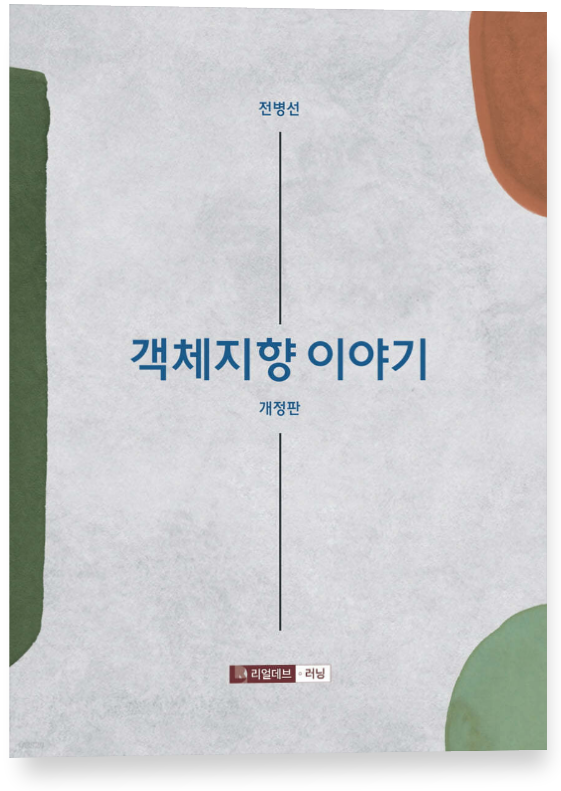
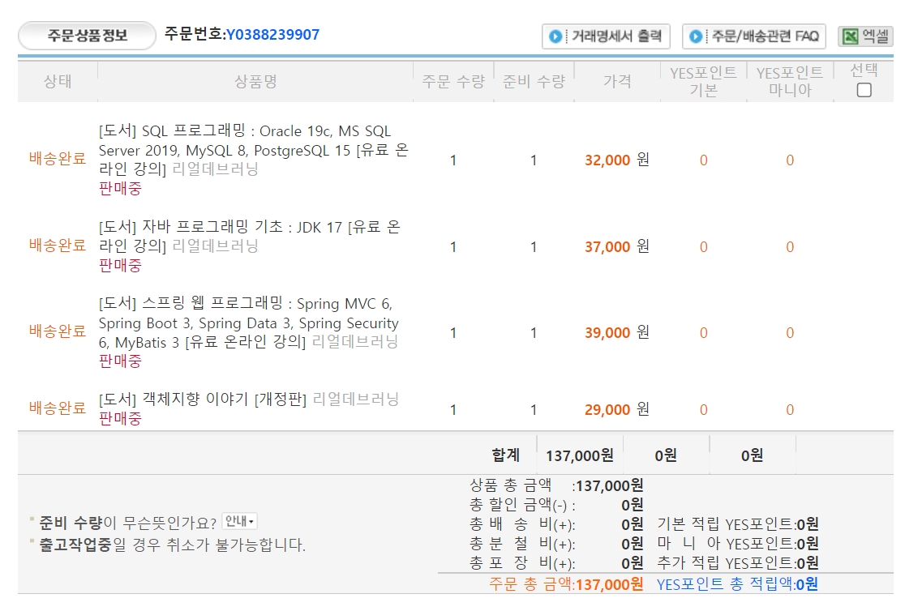

# 객체지향 이야기를 읽고
## 기
프로그래머로 하루를 살아가는 것은 쉬운 일이 아니다. 수도 없이 바뀌는 다양한 기술들은 나를 홀리고, 세상을 홀리며, 돈을 홀린다. 수 많은 투자 아이템들은 멋진, 최신의, 말 그대로 '엣지'가 살아 있는 기술들을 가지고 달려간다. 그렇기에 개발자라는 건, 프로그래머라는 건 그런 것들에 민감할 수 밖에 없고 또 그 와중에 진짜와 가짜도 구분하는 능력이 요구된다. 

참 쉽지 않은 이야기다. 그리고 그런 와중에 항상 스스로를 바라보면서 느낀다. 프레임워크가 지배하는 시대에 왔으니, 그 지배하는 도구를 쓰면 되지 않을까. 그러니 chatGPT를 마주하면 우선 쳐 보는 것이 도구를 사용하는 방법이며, 그 과정에서 필요한 요소의 존재 의의를 쳐다보기 보단, 일단 하는 방법의  HOW TO 라는 포인트에 목숨을 걸고, 또 그걸 위해 $22를 내게 된다. 

하지만 그런 이야기들 중에도 결국 돌고 돌아 개발자에게 필요한 것은 도구에 대한 철학과 근본이라는 것을 깨닫고 만다. 왜냐면 결국 구현을 하든, 뭘 만들고 뭘 고치든, 뭘 문제로 인식하던 그 과정, 그 결과를 인지하는 능력이 있는 사람은 '안목'이 있는 사람이기 때문이다. 망치를 두들기는 건 사실 너무 쉽지만, 망치를 제대로 쓰고 용도 별로 용어부터 파지법까지 다르다는 걸 아는 사람은 목수 뿐이니 말이다. 

데이터 타입을 알아야 데이터 타입이 가질 한계와 능력을 이해하고 대처한다. 짜여지는 구조가 메모리에 어떻게 올라가는 지를 알아야 성능의 최적화를 이룰 수 있으며, 생각과 깊이가 없는 구조를 밀어 붙였다가는 결국 지옥 같은 비효율과 의미를 모르는 버그와 싸울 수 밖에 없다. 지루하게 말이다. 

그렇기에 참 아이러니 하게도, 개발자는 가장 최신에 민감해야 하지만 동시에 가장 역사적(Historical)이어야 한다는 생각을 개발을 배우고, 언어를 배우고, 이제 좀 한 바퀴 쯤 돌았구나 싶은 이 시점에 하게 되었다. 그리하여 알게 된 책, 그 책이 바로 객체 지향 이야기 라는 전병선 작가님의 서적이었다. 

사실 나의 부족을 객관화 하고자 몇 권의 책, 특히 나에게 특화된 영역에 대해 책을 샀었다. 



그 중 가장 이론적이고, 가장 실용적이진 않았지만, 왠지 모르게 끌렸던 첫 번째 책이 바로 `객체지향 이야기`라는 책이고, 오늘 할 이야기는 바로 그 책에 대한 부분이다. 

## 승 
이 책은 처음에는 정말 쉬웠다. 내용을 전부 정리할 순 없으니 짧게 이야기 해보자면 객체라는 개념에 대해 이해를 시키는 것을 시작으로 하여, 개발자에게 다가오는 객체란, 개발이라는 분야에 제시된 패러다임에 대해 저자는 설명해준다. 

소올직히 너무 아재 개그스러워서 뒷목에 소름이 돋았던 인트로는 좀 그랬(?) 지만 저자는 찬찬히, 쉬운 언어로, 진심을 담아 전달하는 것이 느껴졌다. 절차 지향적인 언어가 구조적 프로그래밍 언어화 되어 가고, 그 과정에서 객체지향의 개념이 결합되어서 하나의 클래스(class)를 이루게 된 것에 대한 부분은 이해하기도 쉬웠고, 무엇보다 내 안에 가진 객체지향 언어들에 대해 다시 한 번 곱 씹어 보는 기회가 되었다. 

그렇게 슥슥 책의 쉬운 앞장을 풀어 나가다 보면 4장부터 갑자기 조금씩 본론으로 들어가시는데, 객체를 풀어내는 관계에 대한 내용부터가 진짜 '왜' 배워야 하는 가를 잘 보여주는 대목이 아니었나 생각이 든다. 

## 전 
객체라는 것은 사람의 생각의 형태를 닮지 않았다. 오히려 생명 그 자체와 외부 환경, 내지는 대상과의 관계가 오히려 객체 지향이라고 보여진다. 그렇기에 의존, 연관의 관계를 비롯해 집합에서 구성으로 마지막으론 상속이 되는 관계까지의 다양한 상호작용이 존재하고, 이를 표현할 수 있어야 한다. 이러한 표현이 없어도 본능적으로 개발을 할 수 있을지는 모르겠지만, 저자는 이러한 방식의 이해가 곧 객체 지향의 '잠재능력'을 최대한 활용하는 도구임을 나에게 보여주었다. 

그렇게 정신없이 읽다보면 6장을 마주하게 되고, 6장 부터는 단순한 관계의 상호작용에서 '실제 객체를 설계한다'는 쪽으로 넘어가게 된다. 그리하여 설명해주는 인터페이스는 왜 peer의 설계와 구현 당시 수만은 수정이 일어날 수 밖에 없었는가? 에 대한 답을 보여주는 것 같았다. 언어 마다 다를 지언정 인터페이스 라는 길라잡이를 가지고, 구현체를 만드는 것과 아닌 것은 코드의 작성 보다는 '수정'의 단계에서 대단히 중요한 역할을 하고, 수정 단계에서 손이 덜 가게 만든다는 점은 대단히 매력적이었다. 

슬슬 머리에 열이 차오를 때 즘일까? 이때 드디어 저자의 강 펀치가 날아오기 시작하는데, 그것이 8장부터 이어지는 심화 과정 파트부터다. 소프트웨어의 개발 프로세스, 객체 지향의 설계 5원칙인 SOLID 원칙, 클린 코드와 프레임 워크, 11장까지의 이야기들은 하나하나가 상당한 난이도임과 동시에 peer에서의 문제점을 너무나 잘 인식할 수 있었다. 

peer 의 개발 당시, 부족함에도 나름 잘 했다고 생각했다. 하지만 기획은 완벽하지 않았으며, 특히 설계에 대한 영역은 시간이 갈수록 '시간이 부족하다는' 압박감에 시달렸다. 그리고 이러한 내용들은 개발자들이 '나쁜 습관'을 들이기에 너무 쉽고 대체로 당연하게도 개발하는 과정에서 비효율을 초래한다는 사실 더더욱 실감 할 수 있었다. 

특히 SOLID 원칙에 대해서는 이거는 꼭 반드시 기억하고 넘어가야할 것 중에 하나라고 생각했다. OOP 라고 불리는 객체지향적 프로그래밍의 특징을 기반으로 어떤 설계가 객체지향이라는 관점과 철학을 살릴 수 있는지를 보여주며, 그 내용을 상세히 설명한 부분은 이 책을 쓴 저자의 의도가 어디에 있는가를 대변해주는 것 같았다. 

- Single Responsibility Principle : 단일 책임 원칙 
- Open Closed Principle : 개방 폐쇄 원칙 
- Listov Substitution Principle : 리스코프 치환 원칙 
- Interface Segregation Principle : 인터페이스 분리 원칙
- Dependency Inversion Principle : 의존 역전원칙 

코드의 확장, 유지 보수, 복잡성, 사실 peer 라는 프로젝트 과정 속에서 문제 해결을 위해 달려가다보니 막상 확장 면에서, 유지 보수나 코드가 얼마나 가독성이 좋고 쉬운가에 대해 항상 아쉬움이 남았다. 그리고 거기서 우리는 우리의 실력이 부족하다 - 라고 간단하게 말하며 넘어 갔었지만, 실상은 그렇게 쉽게 결론 내리는 것이 잘못되었다고 말해야 할 만큼 객체 지향의 설계의 원칙부터 과연 살아 있는지 고민의 고민이 필요했다고, 이 책을 보면서 느낄 수 있었다. 

그 뒤의 내용은 원칙에서 확장되어서, 클린 코드란 어떻게 작성하는 것인지를 알려주면서, 그런 내용이 일정 해소되게 만든 원인인 프레임워크에 대해서까지 설명해준다. 

그렇게 코드의 구성이나 짜임새에 대한 이야기가 얼추 마무리 되자, 이 책에서 가장 머리가 아파오는 영역, 디자인 패턴과 개발 프로세스에 대한 내용이 나오게 된다. 개인적으로는 가장 난해한 내용이었다. 한 번은 더 읽어 봐야 겠다고 생각했던 부분이 바로 이 부분이다. 프로젝트를 진행할 때도 느낀 거지만, 막상 대부분의 내용을 정리했다고 판단이 들었을 때 오히려 새로운 이슈가 생기고 기획을 논의해야 하며 아차 하고 실수하여 구조를 잘 못 짜서 다시 짜야 하는 경우, 예상치 못한 이슈로 수정이 필요한 경우가 발생한다. 그런데 곰곰히 돌이켜 생각해보면 그건 과연 무엇이 문제였는가, 진짜 제대로 전문가 다운 분석이 들어가지 않았기 때문이며 디자인 패턴을 어떤 식으로 잘 정리하냐에 따라 불가피하게 생길 수 있는 이슈라도 팀 전체에 큰 타격 없이 잘 넘어갈 수도 있었으리라. 

내용 면에선 상당히 어려웠고, 특히 디자인 패턴 이후 개발 프로세스를 일괄적으로 설명해주시는 부분은 정말 머리가 빙글 빙글 돌 정도로 복잡한 개념들이 많이 등장했다. 마케팅이나 기획, 구조적 생각이 필요하다고 느끼는 부분부분을 아주 조목조목 설명해주었기에, 지금 당장 이걸 내 프로젝트나 학생 수준에서 살리긴 어려울 지언정 회사에서는 충분히 소화시켜야할 내용이리라 생각이 들었다. 

## 결 
첫 1회독으로 이 저자가 나에게 주고 싶던 객체지향이라는 것이 개발 역사에 끼친 영향력을 온전히 다 이해한 기분은 들지 않는다. 초보적 접근으로 얻을 수 있는 것은 어디까지나 코드를 짜는 정도. 그 뒤에 있는 관계를 설정하고, 실제 개발 프로세스에 녹여내고 문서화해 내는 그 과정 전체를 온전히 다 내가 이해하진 못했다고 생각이 든다. 어쩌면 그만큼 이직을 위해 준비하는 나에게 부족함이 있다는 신호일 것이고, 그럴 거라고 이미 진작부터 알고 있었기에, 이제는 일단 다음 고지를 향해 걸어가야 하지 않나 생각해본다. 

그럼에도 소소하게 욕심을 부려보자면, 보면서 정리했던 내용들, 이건 꼭 필요하구나 라고 생각했던 내용들을 이번 개인 프로젝트에 제대로 녹여내는 것은 하고 싶다. 프로세스마다 필요한 문서화를 다 하면서 하기엔 배움도 여건도 촉박하니 다 하기엔 어려울 것이다. 하지만 SOLID 원칙을 지키고, 인터페이스를 활용하여 각 컨텐츠들을 담아내는 그릇을 최대한 깔끔한, 객체지향의 철학에 맞는 설계를 도입해보고자 한다. 또한 각 주요 파트의 내용들은 면접을 준비할 겸 해서 제대로 일단 이 블로그에 기록해 놓는 것, 이것도 고려 해봄직한 내용이라고 생각한다. 
 
```toc

```
