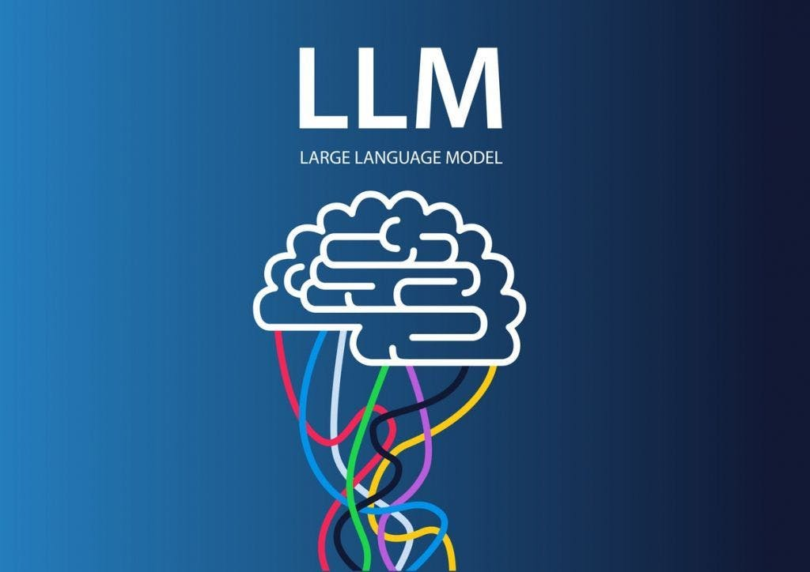
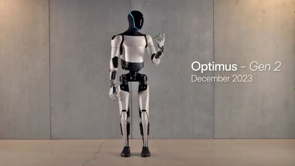
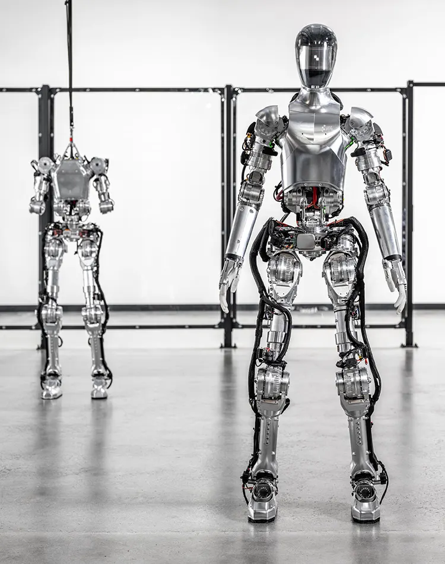
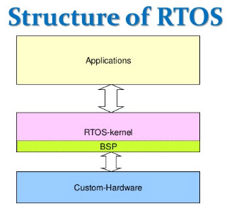
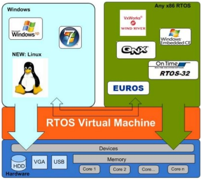

# RTOS 에 대해 알아보자
## Intro 
CS 스터디에서 시작한 토론 및 미니 세미나는 요즘 계속해서 학습의 감초 역할을 하는 것 같다. 지루한 공부에서 벗어나서 관심 있는 것 그런데 이유가 없다는 생각에, 우선순위가 낮다고 생각하는 찰나에 놓치는 많은 소 주제들. 그런 걸 찾아보고 설명하니 꽤나 재밌는 시간이 CS 학습 시간이 되는 것 같다. 

스타트업이나 대기업들이 눈독을 들이는 개발 분야의 대세는 몇 가지 키워드가 존재한다. 그것들이 가지는 가치는 어마무시하단 평가를 받고 있으며, 그걸로 투자를 유치하거나 회사의 기술력을 과시하기도 하는 등을 통해 연일 끝이 없는 자기 생산과 자기 투자를 반복하고 있다. 

그리고 그런 다양한 요소들 중, 요즘의 가장 큰 대세는 역시 AI라는 분야일 것이다. 일전에 한창 거품이 끌어 올랐던 NFT, BlockChain, BitCoin과는 다르게 정말로 실물로 우리 사회의 영향력을 주는 대세가 되고 있으며, 이 AI의 잠재력은 정말 말이 안될 정도라고 모두가 평가하고 있다. 

물론 다른 요소들을 다소 평가 절하한 것처럼 보여서, 그쪽 분야를 좋아하는 사람들에게는 과연 당신 말이 옳은가? 라고 지적할 수도 있다고 생각한다. 하지만 그에 대해서도 반론을 제시할 수 있는 것이, 이미 기술이 기술로 끝나지 않고 사업에 적용이 되며, 돈의 흐름을 타고, 이걸 선점하기 위한 하드웨어 제조사들이 나서기 시작했다는 점에서 나는 AI라고 불리는 (물론 엄밀히 말하면 현재의 AI는 AI가 아니다.) 초 거대 확률계산기의 잠재능력은 그야 말로 아이폰이 나올 시기나, 인터넷의 발달의 그것과 대동소이 할 만큼의 영향력을 가진 거라고 생각한다. 



하지만 그럼에도 동시에 이 AI라는 분야에 대한 평가를 절하해야한다는 움직임도 분명하게 존재한다. 왜냐면 지금의 방식, 구조는 수 천개의 GPU 코어 내지는 ARM 기반 M 시리즈 애플 칩셋의 멀티 프로세싱 능력을 활용한 방대한 병렬연산이 가능하기에 비로소 실현이 가능할 뿐 아니라, 데이터를 넣을 수 있는 공간의 크기가 커야만 정말 커다란 연산의 결과를 도출할 수 있기 때문이다. 그렇기에 온 디바이스 AI가 나오기에는 현실적으로 어려움이 너무나 많으며, 이런 점에서 서비스로 AI를 제공하는 것에 한계가 생기고 만다. 발열이나 전력 소비, 기타 성능 충족치를 달성하지 못하는 등, 소위 VR이라는 아이템이 처음 세상에서 부각이 드리워졌을 때와 유사한 구도가 나타나는 것이다. 

뿐만 아니라,  AI의 결정적인 문제는 바로 '명령' 과 '결과'가 완벽하게 일체화 되지 못한다는 한계를 지속적으로 검증 당하고 있다. 즉, 확률에 의거한 방식의 결론 도출이다보니, 의도적으로 결과를 비집고 확률을 조작해놓지 않으면, 확률에 의거한 답은 항상 어느 정도 일관성을 띄거나 정확한 팩트를 설명한다기 보단, 확률과 통계의 가능성 덩어리가 되고, 이는 서비스를 운영하는 경영의 측면에서 본다면? 완벽한 서비스랑은 거리가 먼, 불완전한 서비스에 가까울 수 있다는 것이 기술적 관점에서 바라보는 현재의 LLM(Large Language Model)의 한계라 볼 수 있을 것이다. 

그래서 이렇게 장황하게 이야기를 하는 이유는 무엇인가? 사실 내가 생각할 때 미래의 진짜 먹거리이자, 미래의 개발자가 살아남을 가능성이 가장 높은 분야는 기존의 NFT, BlockChain 이런 것도 아니며 AI 도 분명 계속 발전은 하겠지만, AI 보다도 더 명확하게 개발자가 반드시 필요한 영역, 그것이 따로 있을 거란 생각이 들기 때문이다. 




2024년 3월 최신 IT 뉴스 중에 단연 인기를 끌었던 것은 Figure Robot 이라고 불리는 ChatGPT를 접목한 FigureAI 를 탑재한 위 로봇의 동영상일 것이다. 해당 기사나 영상을 찾아보면 인공지능을 활용한 사물 인식, 비전 인식을 활용했고, chatGPT가 제공하는 문맥 해석(context interpretation) 으로 과거 기계식으로 사람의 말을 인식하던 로봇들과는 격이 다른 인지 능력과 행동을 보여주었다. 

뿐만 아니라 정말 늦게 휴머노이드 개발 부문에 참여한 테슬라 역시 처음 발표를 했을 때는 조롱 그 자체였다. 하지만 AI가 도입이 되고,  어느새 어느새 버전업을 하더니, 최근 기사에서는 사실상 인간처럼 행동하는 것이 전혀 무리가 없어졌다는 평가를 받을 만큼 업계에서 충격적인 모습을 보여주고 있다. 

## Real Time Operating System 
'실시간 운영 체제' 라고 불리는 운영체제 기반이 있다. 이는 실시간 컴퓨텅이라고 하는 것을 보장하는 운영체제- 라고 보통 정의 내리는 데, 이 쪽은 보통 임베디드 시스템이라는 소형이나 작은 제품에 들어가기 위해 탄생한 OS라고 보면 간단하게 이해할 수 있다. 

하지만 그렇게만 보기엔 해당 OS가 가지는 특성을 다소 과소 평가하는 것이라고볼 수 있다고 생각한다. 왜냐면 본 OS는 기존의 PC에 사용되는 우리가 아는 그런 OS와는 다른 성격을 가지고 있고, 그 특징이 과거를 거쳐, 현재를 지나 미래 로봇 시장 등을 다 뒤덮을 만큼 중요한 기반이 되는 영역이기 때문이다. 그리고 내가 앞에서 장확하게 설명한 AI와 관련된 것들 보다도 더욱 개발자가 향후 필요한 영역이 바로 이 영역일 것이라 생각한다. 



RTOS 의 가장 큰 특징은 바로 정해진 시간 단위로, 지정된 만큼의 작업을 반드시 처리하도록 만들었다- 라는 아주 중요한 특성을 지니고 있다. 이러한 특징이 왜 중요하냐? 라고 한다면 기존의 우리가 잘 아는 OS를 생각해보면 된다. 

우리가 사용하는 일반적인 OS, 유닉스 기반의 맥, 리눅스, 윈도우 등, 대부분의 OS는 커널 단에서 특정 작업을 순차적으로, 짜여져 있는 데로 수행을 한다. 그리고 거기서 context switching 이라는 개념으로 다양한 일들을 동시에 수행하게 되는데, 이러다 보니 나름대로 일의 병렬처리를 잘 처리하고, 대용량 연산에서는 나름의 강점을 가지고 있다. 하지만 기본적으로 context switching의 전략이 시간 단위가 아니기 때문에 요구 되는 처리가 어떤 일이냐에 따라 완료하는 시간이 들쑥날쑥하며, 어떨 때는 일 처리에 더 많은 시간을 요구하도록 되어 있기도 하다. 

하물며 메모리 면에서도 대중적인, 우리가 사용하는 OS의 경우 내부에서 각 프로세스 마다 다양한 일들을 위해 각 프로그램의 개발자들이 알아서 메모리 사용하도록 되어 있는데, 이 점은 어쩔 수 없이 시스템의 안전성에 문제를 초래하게 되고, 그런 대표적인 문제점 중 하나가 `메모리 단편화(memory fragmentation)` 인 것이다. 

하지만 RTOS는 정해진 일을, 반드시 정해진 일로 끝나도록 되어 있고, 그렇기에 실시간 운영체제들은 기본적으로 정해진 일을 수행하게 만들고, 이를 위한 철저한 메모리 관리가 기본으로 들어가는 만큼 시스템 안전성을 갖추게 된다는 장점이 있다. 

그렇다면 왜 갑자기 뜬금없이 RTOS인 것인가? 로봇과 무슨 상관인가? 사실 엄밀히 말하면 로봇 = RTOS는 아니다. RTOS를 쓸 수도 있지만 그렇지 않을 수도 있는 것이다. 그러나 로봇, 항공용 실시간 OS, 로켓 과 같은 다양한 미래 산업 분야들은 목표로 삼는 일들을 처리하기 위해, 그리고 거기서 요구되는 순간에 철저하게 작업을 마쳐야 하는 문제가 있기 때문에 RTOS의 구조를 채택하거나 해당하는 OS 를 사용할 수 밖에 없으며, 이러한 점에서 휴머노이드 로봇도, 우주 산업등 다양한 곳에서 개발자들이 일할 곳, 정말로 실력으로 무언가를 쟁취하기 위해 배워야 하는 산업 분야가 어디인가? 라고 질문한다면 나는 RTOS요 라고 이야기 할 것이며, 그렇기에 오늘 이렇게 RTOS 에 대해 조사를 하게 된 것이다. 


## RTOS의 특징
그렇다면 RTOS의 특징을 정리해보고자 한다. 
1. 실시간 처리 : RTOS는 정해진 시간 안에 작업을 완료하는 것을 보장하며, 시스템이 예측 가능하고 신뢰할 수 있는 반응 시간을 갖도록 도운다. 여기서 OS 기준으로 하드와 소프트 실시간시스템(경성 RTOS, 연성 RTOS)으로 구분이 되는데, 각각 엄격한 시간 제약 조건과 상대적으로 유연한 시간 제약을 가진다. 
2. 멀티 테스킹과 스레드 지원 : 이는 당연한 말이겠지만, 점차 멀티 코어, NPU의 개념 등으로 점차 OS를 구동하는 칩셋은 멀티 프로세싱을 지원하고 시스템 자원을 효과적으로 병렬처리하도록 구성되어 있다.
3. 우선순위 기반 스케줄링 : RTOS는 테스크에 우선순위를 할당하고 가장 높은 우선순위부터 처리하여, 중요 작업부터 빠른 처리를 보장하고 성능의 전반적인 최적화를 진행한다. 
4. 인터럽트 처리 : RTOS는 외부 이벤트, 하드웨어 신호에 신속하게 반응하도록 인터럽트 기반의 이벤트 처리를 탑재하고 있다. 
5. RTOS 커널 : RTOS는 실시간 요구사항을 충족시키기 위해 특별히 설계된 운영체제 커널을 사용한다. 
6. 결정적 시스템 동작 : RTOS 는 시스템의 동작이 결정적이며, 예측 가능하도록 보장한다. 즉, 시스템이 동일 조건에선 동일한 방식으로 반응함으로써 시스템의 신뢰성을 높인다. 

## RTOS 접근해보기 쉬운 OS들 
### 1. FreeRTOS : 
- 가벼운 오픈소스이자, 널리 사용되는 RTOS 중 하나. 간단한 API, 뛰어난 문서화로 초보자가 접근하기 좋다. 
- 배워보면 좋은 점 : 많은 하드웨어 플랫폼과 마이크로 컨트롤러에서 지원되며, 기본적인 멀티태스킹, 인터럽트 관리, 메모리 관리 등 RTOS 의 핵심 개념을 실습하기 적합한 OS

### 2. VxWorks : 
- 특징 : 산업 및 임베디드 시스템에서 널리 사용되는 고성능 RTOS다. 안정성과 확장성이 뛰어나며 복잡한 시스템을 지원한다. 
- 배워보면 좋은 점 : 항공, 우주, 자동차, 방위 산업 등에서 사용되는 고급 기능과 성능을 경험할 수 있다. FreeRTOS로 기본을 익혔다면 복잡한 시스템을 다루는데 적절한 다음 단계의 OS라 할 수 있다. 

### 3. RTLinux 
- 리눅스 커널 위에 실시간 기능을 추가하는 방식으로 구현된 RTOS이다. 리눅스와 호환성이 뛰어나며 , 복잡한 시스템과 애플리케이션에 사용된다. 
- 배워보면 좋은 점 : 리눅스 기반 시스템에 실시간 기능을 추가하는 방법을 배울 수 있다. 리눅스 시스템 개발에 이미 익숙하다면, RTLinux 를 통해 실시간 시스템 개발로 나아갈 수 있다. 
### 4. 그리고 알아야 하는 점은..
- 시작 전에 OS의 기반이 되는 C, C++와 같은 언어 쪽의 지식과 마이크로 컨트롤러와 하드웨어에 대한 이해도가 분야의 기초 학습에 도움이 된다. 

## 결론 
RTOS 에 대해 국내 시장에서의 위치나 입자, 그리고 대우적인 면에서 아직 부족한 것은 사실이 아닌가 싶다. 많은 전공자들이나 개발자 선배들의 조언과 언급에서 아직 국내의 해당 분야에 대한 투자나 자각은 미흡하다고 보여진다. 

그러나 AI를 등에 업은 RTOS 기반의 하드웨어들이 등장하고, 이들의 실질 사례인 Figure One 과 같은 로봇들의 등장은 이런 시대적 분위기 속에서 아직까지 국내에 조명되지 못하고 있는 해당 시장과 분야에 대한 수요가 얼마나 중요한지를 보여준다고 본다. 

과거에는 SF 적인 컨셉 아트 정도로 바라보았을지 모르지만, 이제는 현실로 다가오는 휴머노이드들의 등장, 로켓을 필두로 하여 우주 산업이 정말 눈 앞에 온 것과 같은 상황이라는 점 등을 생각한다면 앞으로의 대세를 위해 조금이나마 이해하고 있는 것이 필요한 게 아닌가 생각해보면 이번 내용 정리를 끝내 본다. 

## 참고자료 
- https://www.elprocus.com/real-time-operating-system-rtos-and-how-it-works/
- https://en.wikipedia.org/wiki/Comparison_of_real-time_operating_systems
- https://www.digitaltoday.co.kr/news/articleView.html?idxno=503629
- https://ko.wikipedia.org/wiki/%EC%8B%A4%EC%8B%9C%EA%B0%84_%EC%9A%B4%EC%98%81%EC%B2%B4%EC%A0%9C
- https://namu.wiki/w/%EC%8B%A4%EC%8B%9C%EA%B0%84%20%EC%9A%B4%EC%98%81%20%EC%B2%B4%EC%A0%9C

```toc

```
