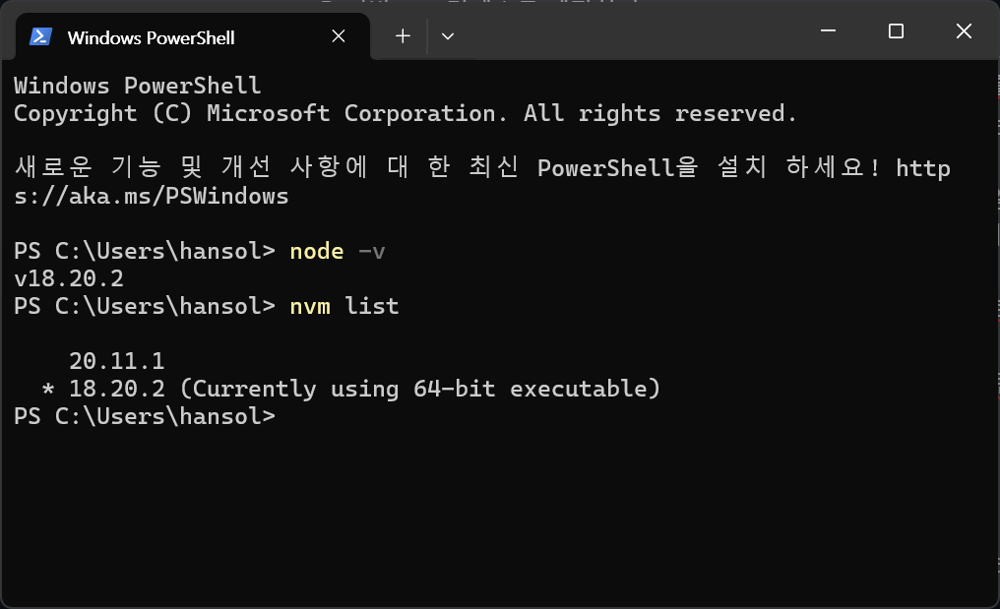
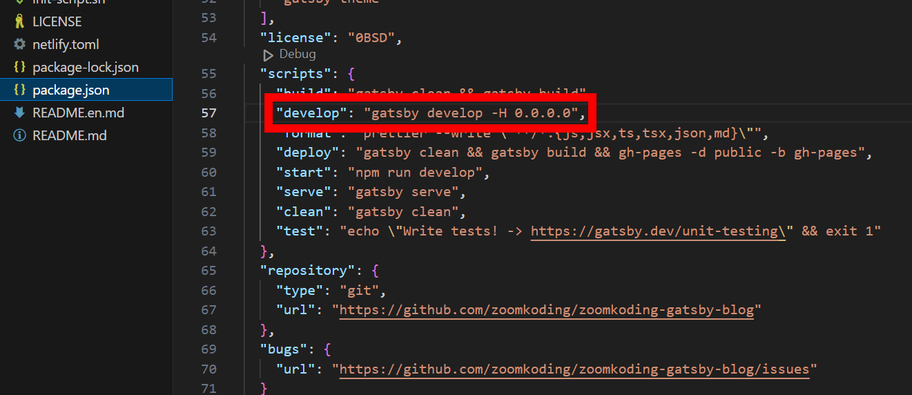
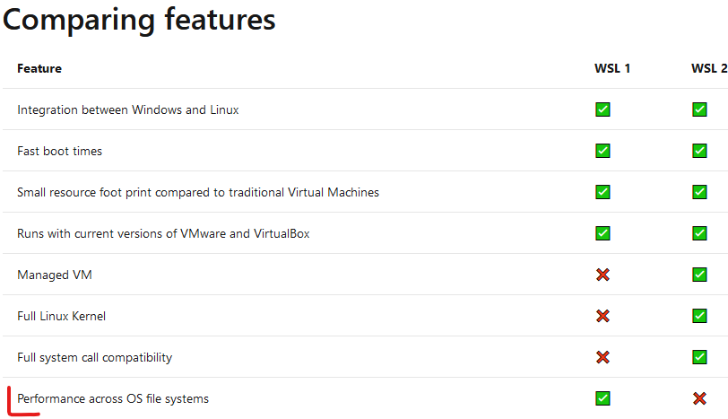

# 블로그 터뜨릴 뻔한 썰푼다...
## 터져버렸다
현재의 블로그는 42서울을 다니고, 최초로 스터디를 통해 만들어낸 기술 블로그다. 깃허브를 활용하고, 이슈나, 기타 등등을 활용해 만들었으며, 그 전신은 줌코딩이라는 풀스택 개발자 분이 만드신 개츠비를 활용한 정적 사이트 생성기며, 나는 그걸 기반으로 조금더 내 스타일로 CSS 등을 바꿔 만든 것이었다. 

그러나 이번에는 정말 오랜만에 잔뜩 블로그가 꼬이게 되면서, 로컬에서의 동작이 비정상적으로 되었고, 해결한다고 하루를 다 써버렸다(...) 문제를 파악하고, 해결을 어떻게 해야하고, 그나마 완전히 스스로 구현했던 것이라면 모를까 그게 아니었기에 정말 너무 많은 시간이 걸렸다고 생각이 든다. 그렇기에 적는 내 나름의 문제 파악 및 상황 파악. 메모용 푸념 글이다. 

## 증상은 무엇이었는가
현재 블로그를 운영하는 방법은 다음과 같다. 
1) MD 파일을 작성할 수 있으며 property 를 손쉽게 작업이 가능한 Obisidian 어플리케이션을 기반으로 컨텐츠를 제작한다. 
2) 작업이 마무리 되면 로컬에서 Node 를 활용해 테스트 빌드를 돌려보고, 제작한 콘텐츠에 문제가 없다- 가 판단이 되면 기술 블로그 레포지터리에 Git push를 진행한다. 
3) Git Action을 활용해서, 내 사설 서버에서 해당 Git push 를 pull 받는다. 그뒤 Git Actrion의 ssh 기능을 활용해서 아래의 작업이 진행된다. 
4) Gatsby 정적 사이트 생성기는 빌드를 통해 MD 파일과 이미지, 지원 가능 한 콘텐츠들을 연결시켜서 사이트의 페이지들을 생성한다.  특히 여기서 만들어지는 페이지, 쿼리를 통해 기술 블로그의 기본이 만들어진다. 
5) 빌드를 통해 만들어지는 정적 사이트들은 내 기술 블로그 레포지토리의 main 브랜치에서 gh-page 라는 브랜치로 머지가 된다. 
6) 일종의 조그만 GET 서버인 깃허브는 그렇게 만들어진 gh-page 브랜치를 기반으로, 브라우저의 요청을 처리하여 사이트를 보여준다. 

사실 구조적으로는 크게 문제가 될 만한 영역은 없다고 생각한다. 생각 보다 안정적인데다가 빌드를 한 순간부터 캐시가 쌓여서 기존의 컴파일 된 영역에 변화가 없다면, 만들어진 페이지들은 그대로 캐쉬 처리 되어 빌드 되는 시간도 엄청 걸리거나 하진 않는다. 

그러나 문제는 빌드가 되지 않았다. 

create page 스텝에서 멈춰서는 전혀 움직이지 않는 것이다...

에러가 나면 무슨 에러냐! 라고 에러 코드라도 뱉어야 할 텐데 그런 것도 없이 뚝- 하고 끝나버리는 상황이 발생했었다. 다만 이것은 로컬에서의 문제이며 희안하게 내가 가진 서버에선 문제없이 동작했다(!)

그러면 문제 없지 않나? 라고 할지 모르겠지만, 서버 모니터링으로 whatap 서비스를 활용했었지만, 이건 현재 리소스의 상태를 보여주는 것이고, 깃 액션에서 결과는 내가 직접 들어가서 확인 해야 하고, 빌드가 실패하는 경우 기껏 올렸다고 생각했는데 안 올라간다던지, 어디서부터 어디까지가 문제인지를 로컬에서 확인 되어야 설령 문제가 생겨도 바로 대응이 가능하다. 그런 점에서 어제까지만해도 잘 되던 테스트 빌드가 전혀 되지 않는다는 것은 매우 심각한 문제였다(...!)

## 그러면 뭐가 문제였는가?
결론적으로 말하면 Node 문제 + 캐시 + Node 모듈 의 복합 문제였다. 



Node는 하위호환을  나름데로 지원하는 JS 런타임 엔진인 것은 맞지만, 현재 내 기술 블로그를 구성하는 기술들은 Deprecated가 매우 매우 진행된(...) 상태였고, `npm install` 를 통해 Node Module 들을 다운로드는 가능하다. 하지만 문제는 모듈과 런타임의 궁합 면에서 확실히 문제가 있는 듯 하다. 

이걸 알게 된 것이 바로 내가 현재 사설 서버에 깔아둔 노드 버전이 몇인가? 를 확인했기 때문이었다. 

그리고 그런 상황에서 Node의 버전 관리가 필요하다는 것을 깨닫게 되었고, Node Version Manager가 필요하다는 사실에 `nvm` 이라는 패키지를 통해 이를 해결했다. NVM 과 관련된 글은 [여기](https://funveloper.tistory.com/203) 를 참고 했다. 

여기서 **캐시**도 문제였는데, 엄밀히 말하면 캐시가 문제가 되서는 안되는 것이었다. 왜냐면 기본적으로 gitignore로 버전 관리가 되는 파일도 아니고, 오로지 빌드를 빠르게 해주기 위한 도구이며, 각 로컬에 귀속되는 것인데... 

문제는 이놈 때문이었다. 


> 그렇다... 원인은...

사용하던 기기를 전부 윈도우로 맞춘 상황에서 가장 손쉽게 파일을 동기화 시키는 도구인데, 문제는 각 기기마다 로컬에서 테스트를 하면서 캐시가 호환이 되는 경우도 있지만, Node 버전이 다르면 이 역시 다르게 빌드 된다는(....) 것을 이번에 깨닫게 되었다. 진짜 다음부터는 서브 기기는 테스트를 돌리지 말아야 할 것 같다(...)

## 해결을 위한 N회차의 고민들
### 도커를 써서 환경을 독립시켜볼까?
노드 버전 관리와 캐시 삭제, 이 간단한 문제를 깨닫기 전에 우선 생각한 것은 그러면 어떻게 이걸 일정하게 해결하도록 만들어 볼까? 에 대해 생각했다. 아무래도 바탕이 되는 호스트 디바이스가 여러 개고 일단 어디서부터 문제인지는 몰라도, 이렇게 환경이 달라서 문제라고 한다면, 이 문제를 해결할 수 있는 방법은 역시 독립적이지만 확실하게 호환되는 환경을 만들자! 이게  생각이었다. 

그래서 도커 + 볼륨 공유 + 포트포워딩으로 간단하게 해당 Node가 동작하는 독립 컨테이너를 만들자! 는 당연한 결론에 귀결 되었고, 다음과 같은 구조로 도커 구조를 만들기 시작했다. 

```dockerfile
FROM leonetpro/node18:vite-4.4.9

WORKDIR /app

COPY ./init-script.sh /app/init-script.sh

RUN chmod +x /app/init-script.sh

RUN apk update 

RUN apk add vim
EXPOSE 8000

CMD ["sh", "./init-script.sh"]
```

```shell
#! /bin/sh
cd blog

if [ -d "node_modules" ]; then
  echo "npm install has ben successfull"
else
  echo "npm install failed or has not been run."
  npm install
fi

npm run start
```

```shell
# 이미지 작성
docker build -t blog-test .

# 도커 실행 시 설정(호스트 네트워크 버전)
docker run -v D:/googleDrive/Obsidian/Paul2021-R.github.io:/app/blog --network host -p 8000:8000 -d --name blog-test-server blog-test:1

# 도커 run (디폴트 네트워크 사용 버전)
docker run -v D:/googleDrive/Obsidian/Paul2021-R.github.io:/app/blog -p 8000:8000 -d --name blog-test-server blog-test:1
```

우선 최초로 보이는 것처럼 도커 파일과 최초 실행시를 위한 스크립트를 구현했다. 컨테이너 내부에서 Node 모듈들을 다운로드 받고, 최초 세팅하게 했으며,  베이스가 되는 이미지를 기반으로 작업을 진행할 위치에서 npm run start라는 로컬 테스트 코드를 컨테이너가 구동되는 순간 동작하도록 했다. 

최초 스크립트의 경우 무엇보다 모듈이 이미 존재하는지를 검증하는 것만 넣었지만, 상황에 따라선 업데이트 등도 가능하도록 스크립트를 구성.

shell 명령어들은 이미지 빌드와 실제 실행 시 내용인데 현재 내 구글 드라이브의 폴더를 내부와 마운트 시키는 구조 및 포트 포워딩을 통해 호스트 디바이스에서 로컬 웹 페이지를 볼 수 있도록 해보았다. 

### 도커는 정답이 아니다 
하지만 역시 사람의 생각대로 되는 법은 아니라고 해야할까. 계획대로 되는 법이 없다랄까, 도커를 활용한 방식또한 문제가 있었고, 최종적으로 문제의 원인을 찾고 난 뒤에, 이 방법으로는 개선이 불가능하겠다는 판단을 하게 되었다. 

#### 1. 앵? 왜 로컬 호스트로 접근이 안됨? 🤔
우선 나름대로 챡챡 필요한 설정들을 진행하고, 몇 차례 테스트를 돌려보니 성공적으로 모듈이 돌아가긴 했다. 그런데 오잉? 분명 빌드는 되었고 Gatsby 테스트 빌드시 열리는 localhost:8000 의 메시지가 뜨면서 접근이 가능하도록 되었었다. 

하지만 접근이 안되... 

포트포워딩에도 문제가 없었고, 설정에도 문제가 없었다. 심지어 나중에는 혹시나 싶어 내부 shell 에서 curl 을 통해 노드 서버에 직접 접근해보았는데, 이 역시 성공적. 근데 왜 호스트에서 접속이 안되나?

처음엔 네트워크 설정 문제인가? 싶어서 docker network 가 아니라 직접 호스트로 연결하는설정도 해보고, 별 짓을 다했다. 뭐가 문제냔 말이다! 



결론적으로 이유는 간단했다. 알고 봤더니 기본적으로 테스트 빌드라는 것은 결국 로컬에서 진행하지, 나처럼 번거롭게 docker까지 쓰겠다고 설정이 되어 있진 않고, 원칙적으로 로컬에서 접근하는 것 만을 허락했던 것이었다. 

그렇기에 Gatsby에서 제공하는 접근 가능한 포트를 수동으로 지정하는 기능을 활용해 로컬호스트에서 접근 만이 아니라 어디서든 가능하도록 설정을 집어 넣자 드디어 접속이 가능해졌다. 

#### 2. 뭐여 왜 이리 느려? 😥

> 끼얏호우!

나름 정리가 되었다고 생각했다. 뭐가 되었든 옛날 같으면 끙끙 거렸겠지만, 손쉽게 문제를 해결했고 이제 진짜 나름 개발자 같구만 하면서 기분이 좋아질 법 했을 무렵. 뭔가 이상함을 깨닫게 되었다. 

빌드가 느리다....?

더불어 접속을 했을 때, 이 정도로 느릴 일이 없는데 왜 로딩이 생기지...?

집에서 사용하는 데스크탑은 윈도우 기반으로 그래도 i5 13400F 였으며, 램도 DDR4 이긴 하지만 64GB, 내부 스토리지도 NVME 로 개발을 위한 컴퓨터론 충분한 성능일텐데임에도 말도 안될 정도로 느렸으며, 그렇게 느리다보니 이미지 로딩이 비정상적으로 되지 않는 현상이 나타난 것이다. 


다시 또 이것저것 알아보기 시작하니 이런 내용이 나오기 시작했다. 

[WSL2에서 웹 어플리케이션이 느려지는 현상](https://velog.io/@korjsh/WSL2-Docker-file-system-%EB%95%8C%EB%AC%B8%EC%97%90-%EB%8A%90%EB%A0%A4%EC%A7%80%EB%8A%94-%ED%98%84%EC%83%81-%ED%95%B4%EA%B2%B0%ED%95%98%EA%B8%B0)

WSL2도 결국 윈도우에서 나름대로 전세대 가상화 기술만으로 도커를 돌리는 것보단 성능 향상을 했다지만 오버헤드가 있는 것은 알고 있었다.  한 10~20% 성능 떨어지는 거야 코어를 할당해주든, 메모리 대역폭을 늘리면 되는데 근데 왜이리 느린가?

결론은  WSL 1과 2를 비교하면, 기능적인 면에서는 엄청난 발전을 이룬 것은 맞지만, 정작 파일 시스템 사이의 데이터 교환의 성능이 엄청나게 느린 것이었다. 


> 출저: 장후후 - WSL 2 + Docker file System 때문에 느려지는 현상 해결하기

위의 참고한 글에서는 이러한 문제를 해결하긴 했다. 방법은 WSL2의 메인 할당되는 스토리지를 볼륨으로 활용하는 식으로 하여서, 데이터가 메인 OS -> Container 볼륨으로 연결되는 것 대신 WSL2 distro 스토리지 -> Container 볼륨으로 속도를 올리고, 대신 윈도우에서 직접 파일을 넣거나, 접속하는 경우의 불편만 감소하는 형태였다. 

하지만 나는 구글 드라이브를 활용하든 뭘 하든, 내가 사용하는 기기에서 접속이 가능해야하고 편집이 필요한데? 응? ~인생은 계획대로 되지 않는 법이란다.~

### 개발 환경의 중요성 그리고 내가 '이해'해야 하는 이유
결국 알 수 있었다. 

Docker로 하는 것은 성공적이진 않다는 사실을. 물론 해결할려고 생각하면 어떻게든 만들 수는 있겠지만 그걸로 얻는 이점보다 일어버리는 이점들이 많을 것이었으며, 그 와중에 문제점이 Node 버전이 주되다는 것을 파악하자마자 과감하게 도커를 활용하는 방법은 포기하는 것으로(...) 결론을 내렸다.

정말이지 윈도우에서 개발하느니 Linux에서 하고 말고, 이것도 귀찮으면 맥을 사야한다는 이유가 괜한 게 아니라는 점을 이번에 더더욱 새로이 깨달았다. 🤔

뿐만 아니다. 최초 기술 블로그를 구현할 때 그 구현의 상당 부분은 만들어주신 원 저작자 줌코딩님의 것이었고, 코드를 이해하지 않고 그대로 쓰고 있던 부분도 많다. 

어쩌면 이번 일은 그런 상황에서 이해도가 떨어지니 사고를 치고, 하마터면 깃허브에 올라간 블로그 데이터도 날려먹을 수도 있을 뿐 아니라, 여기에 적진 않았지만 nvm을 적용 과정에서 윈도우 환경에서의 환경 변수 문제로 잘못하면 유저 데이터들을 잃어버릴 뻔도 했다( ~쿠버네티스 연습한다고 쓰던 도커 컨테이너랑 이미지는 날렸다 ^^~ ) 
([윈도우 사용자 계정 한글에서 영어로 변환](https://healthdevelop.tistory.com/entry/etc3))

이렇듯 내가 알고 쓰는 것과 모르는 것이 가지는 차이가 이만큼이라면, 개발자로써 이게 과연 옳은 자세일까? 라는 생각도 조금 해보게 되었다. 

## 그러면 이제 한 걸음 더 나아가자
이번 일로, 가뜩이나 우울한 주말을 겪었는데 저녁부터 새벽 4시까지 해당 문제를 해결한다고 끙끙 거렸다. 결론적으로 해결도 하고,  후련하기도 하고, 무엇보다 다시 한 번 무얼 해야 할지가 명확해지는 기분이다. 

요즘의 개발자 시장이 능력치가 있는 사람을 뽑다 보니, 신입이라고 하더라도 무언가를 만들고, A to Z를 거친 사람을 뽑는다는 (...) 정말 쉽지 않은 환경이긴 하다. 그러나 오히려 그렇기에 나의 실력이 명확한게 중요하며 숨길 수 없다는 명확함은 남게 되었다. 이를 위해 경험을 해야할 필요는 대두 되었는데, 이번 기술 블로그 사건은 정말로 다시 한 번 직접 블로그를 구현 해내야 겠다는 생각이 들었고, 프론트도 간단히 배워서 더 백엔드 스러운 개발자가 되어야 한다는 생각이 들었다. 

조금 늦어지긴 했지만, 얼른 리액트 학습하면서 개발을 시작해야 할 듯 싶다. 힘내자.. 3개월만 버티면 충분히 완성형이 될 수 있을 것 같다. 


```toc

```
