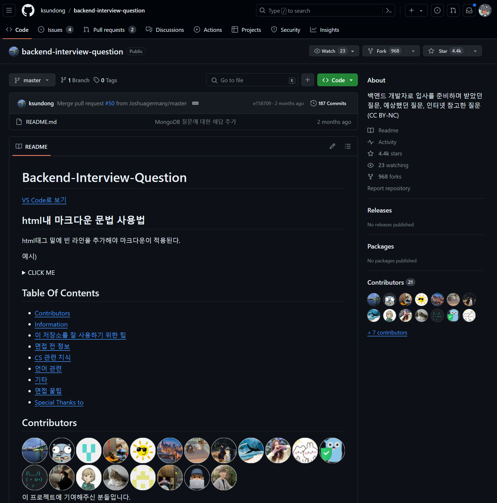
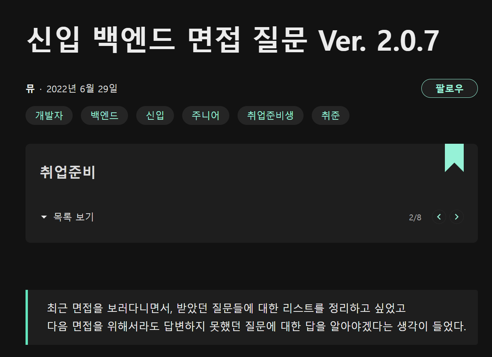
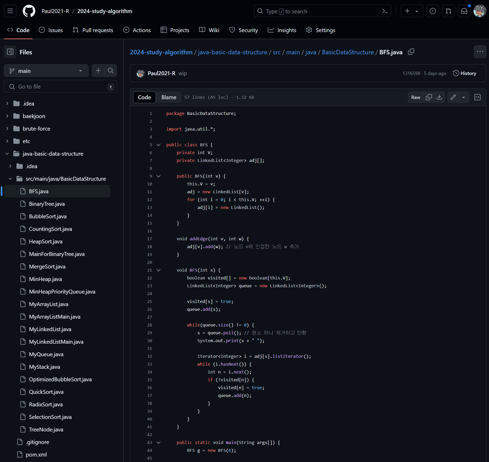
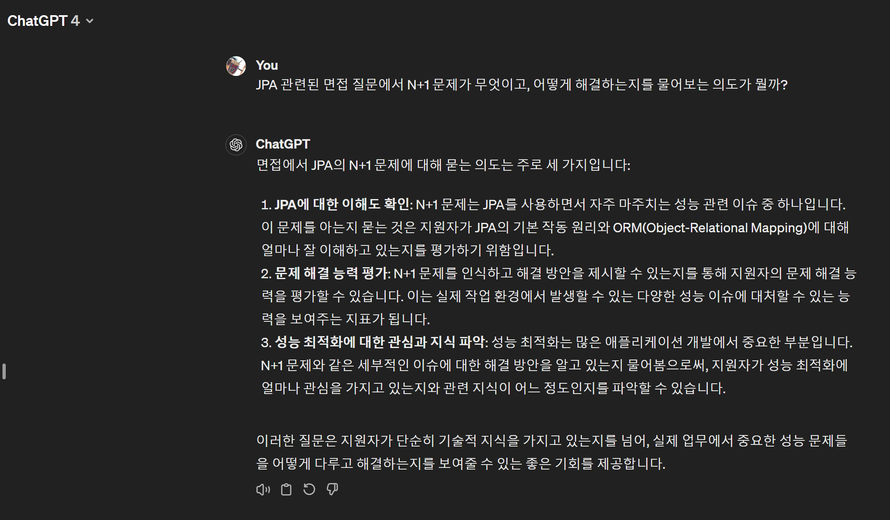

# 면접 본 후기
## 기업이 원하는 나
네이버 서류는 붙었지만 , 코테에서 2문제 맞췄음에도 탈락 통보를 받았다. 그 외에도 괜찮은 업체들을 찾아 이력서를 돌리면서 내 나름의 수준과 업계가 요구하는 수준이 많이 다르다는 사실을 조금씩 깨닫게 되고 있었다. 

그렇기에 결국 따라가는 입장인 나에게 필요한 것이 무엇이고, 가장 효과적인 것은 무엇인가? 를 생각했을 때 두 가지 정도의 가능성을 고려하고 있었다. 

1) 풀스텍에 준하게 웹 개발은 준비를 해야, 회사 입장에서의 인건비를 줄일 만한 인재로 인정받을 가능성이 높다(그런 인사 요건을 가진 업체들이 많다.)
2) 백엔드 기술의 단순 요구사항만 봐도 카프카, 쿠버네티스 등 기존 실무에서 처음 시작하기엔 중-고급이라고 불릴 만한 기술들이 기본적으로 필요 시 되고, 이는 AWS등의 서비스가 제공하는 비용 상승으로 자체적인 오토 스케일링, CICD 구축, 로드 벨런싱을 기능으로 유료로 사용하기 보단, 가능한 표준 기술을 활용해 구현을 요구하는 기업들이 늘어났다. 

참 쉽지 않은 이야기지만, 웹이 사라질 일은 아마 없을 것이다. 대부분의 서비스들이 기존의 네이티브 방식이 가지는 한계를 알기에, 웹 기술이 과거를 생각하면 말도 안될 정도로 성장을 한 상태이고 추가로 성장할 가능성이 많은 만큼 그 일자리의 수요가 줄지는 않는다. 하지만 동시에 웹 기술의 상향 평준화와 더불어 보다 디테일한 작업이나, 웹에서 기술적으로 풀수 없는 영역에 대한 기술적 수요도 함께 늘고 있다보니, 자연스레 웹 개발이라는 직군은 원맨 아미(One Man Army)가 되길 요구하는 기업이 늘어나는 것을 느낄 수 있었다.

뿐만 아니라 6개월~ 길어봐야 10개월 안팎의 개발 관련 정부 지원사업으로 수익을 벌려는 수많은 업체들의 등장은 엄청난 개발자 예비군을 만들어낸게 아닌가 싶다. 기업에서 일자리 공고를 내면 내고 한 두달이면 괜찮은 회사는 거의 200~많게는 600명 씩 지원이 들어가고, 이러한 말도 안되는 경쟁률은 실제로 일어나고 있고, 그렇기에 지금 준비를 하는 우리 모두에게 과연 이게 현실인가? 싶은 안타까운 생각도 들고 있다. 

뭐 어쨌든, 그럼에도 불구하고 나는 내 실력의 성장세를 알고 있었고, peer 라는 과정을 통해 얻은 경험은 자신이 있었다. 그러나 요구하는 수준과 내가 얻을 수 있는 재화의 수준, 그 중간 어딘가를 잡아야 하기 때문에 솔로 프로젝트를 구상하게 된 것이고, 구상한 솔로 프로젝트를 위해 우울하지만, 그럼에도 확실하게 앞으로 나아가고 있었다. 

## 시작은 정말 우연하게 찾아왔다
42서울의 과제 중 하나, 웹 서브에 대한 지식품앗이가 필요하다는 후배의 말에 가볍게 승낙하고, 정말 오랜만에 개포동 42서울 본 건물에 들렀을 때였다. 종종 이렇게 개포동에 가는데, 과제에대해 설명해주거나 내용의 가닥을 잡아주는 역할을 하면서 내 과제 내용을 어느 정도 복습이 가능하기 때문에 였다. 

한창을 진행하던 도중, 갑작스레 전화가 오게 되었고 누군지 모를 번호 였지만, 인터넷 전화나 해외번호가 아닌 휴대폰 번호이길래 받았고, 놀랍게도 전에 관심이 있던 업체 대표로부터의 연락이었다. 

연락의 내용은 당연히 면접에 대한 내용, 갑작스럽지만 기쁘기 그지 없었다. 면접의 일정을 잡을 수 있었고, 기회를 얻었기에 그 기회에서 느끼고 배운 것들을 정리해보고자 한다. 

## 면접의 준비 과정 : 생각 이상으로 여전히 부족하다 
우선, 면접을 위한 도구나 기술적인 면에서 부족하다고 생각한 적은 없었다. 하지만 문제는 기술 면접이라는 점을 생각한다면 과연 내가 충분한가? 에 대하여서는 명확하게 확신을 가질 수는 없었고, 그런 점에서 무엇을 어떻게 준비해야 하는가? 하는 점에 대해서 명확한 길잡이가 필요했다. 그러던 와중에 정리된 아주 좋은 글들을 발견하게 된다. 

- [Backend-Interview-Question](https://github.com/ksundong/backend-interview-question)
- [신입 백엔드 면접 질문 ver. 2.0.7](https://velog.io/@yukina1418/%EC%B5%9C%EA%B7%BC-%EB%A9%B4%EC%A0%91%EC%9D%84-%EB%8B%A4%EB%8B%88%EB%A9%B4%EC%84%9C-%EB%B0%9B%EC%95%98%EB%8D%98-%EC%A7%88%EB%AC%B8%EB%93%A4)




위의 두 개 말고도 잘 정리된 좋은 글은 많았다. 하지만 내용적으로 아주 차이가 있다고 보기엔 어려운 내용들이었고, 그런 점에서 대표적으로 이 두 글을 기반으로 했으며, 그렇게 해서 얻은 데이터를 보고 있으니 아주 든든(?) 하다는 느낌을 받았다. 

그러나 당연한 말이지만, 속성으로 몇 일 안에 그 내용을 전부 다 이해하고, 숙지한다? 쉬운 일이 아님을 알고 있었다. 그렇기에 속성으로 정리를 해야 하는 부분이 많았고, 또 반대로 깊게 봐야 하는 영역을 구분하였으며, 최대한 준비해야 할 영역을 구분 짓고 접근을 시작했다. 

### 반드시 손으로 써봐야 했던 영역 

> Python이 아닌 Java로 BFS를 구현하려고 하니 비슷하면서도 뭔가 느낌이 많이 달랐다

처음 CS영역은 어지간하면 모르지 않는 영역이었다. 기존의 지식들에서 부족한 영역은 검색이나 chaGPT를 활용해 이차 검증을 하면 되는 그런 부분이었다. 그래도 8개월간 CSAPP를 붙잡고 씨름을 했고, OSTEP 이라는 교재를 통해 봐둔 것들이 나름의 역할을 해주는 기분이 들었다. 

하지만 알고리즘, 자료구조와 관련한 영역에 대해서는 이건 아니라고 느꼈다. 왜냐면 코드를 짜본 경험이 있는가, 동시에 그 구조를 파악하였는가? 에 대해서는 역시 손가락으로 직접 따라서 타이핑이라도 해보지 않으면, 각 줄이 의미하는 바를 정확하게 이해하기는 어려워 보였다. 그렇기에 일부러 거진 3배 이상의 시간을 들였으며, 가능하면 main 문 역시 만들어서 정상 동작하는지를 점검하는 식으로 진행했다. 

확실히 이러한 방식으로 했을 때, 구현했던 것들에 대해 훨씬 이해도가 높아지는 것을 느꼈다. 물론 다음부터는 반드시 주석으로 개념과 내용을 함께 정리해둘 생각이다(...) 그걸 빼먹고 내용만 적었더니 돌아서면 까먹는 나 자신은 역시나 라는 생각이 들었다... 쩝😑

### ChatGPT를 어떻게 활용해야 할까? : 자동화 & 의도 파악 
수능 시험이나 토익을 한 번이라도 쳐본 사람이라면, 그리고 강사들이 입에 달고 달고 또 다는 마법의 말 한 마디가 있다. 바로 '출제 의도' 라는 표현이다. 

내가 가르쳤던 아이들도 보면 그랬다. 자신 만의 에고가 너무 강하거나, 상대방의 의도를 고려하기 위해 상대방을 보는 눈이 있던 아이들은 '의도 파악'이라는 것을 잘하면 잘 할 수록 성능은 좋았다. 

그리고 이번 면접을 위한 질문들을 볼 때도, 이게 필요하구나 라는 생각을 했다. 

왜냐면, 예를 들어 이런 질문을 받았다고 보자. 

> N+1 문제가 무엇이며 이를 해결할 방법은?

이 질문을 처음 받았을 때, 다소 혼란스러웠다. JPA 와 관련된 내용이 나와야 하는 영역에서 밑도 끝도 없이 이런 질문이 나오며, 어떻게 해야 하는 것인가? 지식으로 해결하기도 안되고, makeshift를 만들어 보기에도 잘못 말하면 뜬구름 잡는 이야기가 되는 게 아닌가? 그렇기에 가장 먼저 생각한 것이 chatGPT의 도움을 구해 보는 것이었다. 



빙고, 내 기억력의 한계로 못한 영역이 있는 것은 어쩔 수 없다. 하지만 문맥을 이해할 수 있던 점은 아주 훌륭했다. 이렇게 활용해서 정리를 하자, 거의 90개 정도 되는 질문들에 대해 의도와 내용을 파악할 수 있었으며, 그에 대한 답을 달 수 있었다. 

## 먼접 후기 : 어떻게 접근하는게 옳았을까?
그리하여 부랴부랴 거의 대부분의 질문은 소화를 시키고 답변을 준비할 수 있었다. 부족한 부분이나 시간이 없어 다 못 채운 부분도 있었지만, 그건 그거대로 배짱 승부를 봐야지 어떻게 안되겠다는 생각으로 마무리를 짓고 답변을 해나갔다. 

질문은 예상한 내용에 가깝긴 했지만, 전혀 준비하지 않았던 영역도 있었다. 특히나 궁금해 하시던 것은 왜 8개월이란 시간을 CSAPP 란 책에 시간을 쏟았는지. 2년이라는 긴 기간을 준비한다는 것에 대해 힘들지 않았던 건지 등... 전반적으로 나 역시 고민하던 부분에 대해 궁금해 하는 게 느껴졌다. 

생각해보면 난 어떻게 그걸 버텼던 것일까? 그리고 왜 그렇게 버티려고 했던 것일까?

사실 간단하다. 아주 간단한 명제다. 내가 42서울을 처음 들어갔던 순간 느꼈던 무력감. 그리고 거기서 하나를 제대로 소화 시켰을 때 얻은 만족감과 든든한 기초 체력. 결국 한 순간도 잊지 않고 생각했던 것이지만, '일'이 아닌 '실력'이 필요한 이상 잡다한 임시 방편들과 대충대충이란 키워드로 해결해나가는 것은 결코 옳지 못하다. 

고전 인문학이 없으면 현대 인문학이 없으며 사유의 과정의 결론은 내려지지 않았을 것 처럼, 고전 물리학이 없이는 현대 물리학이 왜 고전 물리학이 틀린지를 지적하고, 새로이 현대의 물리학의 전신을 세울 수 있던 것처럼 나의 실력의 기본기가 되어야할 영역에서 편법이나, 돌아가는 길로 정공법을 무시할 수는 없으리라. 그리고 결국 그러했기에 나 또한 처음 시작했을 땐 모두가 무시하던 그저 한 명의 비전공자였지만, 피어의 개발 총괄로 진두지휘가 가능했던 게 아닐까? 아마 앞으로도, 일이라면 효과적이고 효율적이게, 실력과 관련된 것이라면 어떻게든 제대로 채워 나가리라.

추가로 하나 더. 아쉬웠던 점은 '티키타카'가 안 되었다는 점이었다. 내 나름의 준비한 내용들이 있기에, 해당 내용을 듣는 구조가 되는 것은 자연스러운 흐름이긴 하지만, 면접을 배웠다는 양반이 오랜 만에 진지하게 면접을 봐서 일까? 상대의 반응을 보고 이어가는 흐름을 조절하는게 잘 되지 않았다는 게 참 아쉬웠다. 아무래도 반응을 보기에는 원격으로 면접을 본다는 상황 자체가 익숙하진 않아서 그랬다고 생각이 든다. 

## 면접관이 마지막으로 원하던 것은.. 
다행히 마무리에 마무리로 면접을 끝내고 난 뒤, 마지막으로 나는 궁금한 부분들을 물어보는 시간을 가졌다. 그 중에 가장 궁금한 것은 현재의 상황에서 개발자들이 내 이력서를 어떻게 생각하는가? 였다. 

왜냐면 위에서 언급했듯이 현재 개발자를 원하는 사람들이 많아도 너무 많다. 그 만큼 청년층에게 질 좋은 일자리는 없다는 이야기겠다. 그러니 국비 과정을 거치거나, 속성으로 개발자를 해보겠다는 분들도 많이 늘고 이를 활용한 업체들이 정말 말이 안될 정도로 많아진 것이 웃픈 현실이자, 현재의 상황이니 말이다. 

그러니 내 이력서가 차별성이 있는가? 이에 대한 답이 명확하지 않다면 이는 문제이리라 생각했고, 그렇기에 내 이력서에 대해, 내 노력에 대해 물어보는 건 너무나 당연한 수순이리라. 

이에 대해 묻자 면접을 함께 해주신 담당자님께서는 나에대해 '면접에 강하다' 라고 말씀을 해주셨고, 그에 비해 반대로 '이력서'에 대해 보기 힘들다는 평을 들려주셨다. 아하- 하고 머릿속을 스치는 내 상황. 내 이력서의 내용을 생각하니 이제는 무엇을 준비해야할지 보다 명확해졌다. 

필요한 건 비주얼이다. 개발자는 많아졌고, 그 와중에 내실이 없는 사람도 많고, 내실이 있어도 못 살리는 사람도 있다. 한달에 200-300 명을 만나는 인사의 담당자들에게 이런 상황에서 글로 가득차거나, 어쩌면 비주얼적이기 보단 다소 슴슴하고 재미없게 적은 내 이력서가 오히려 나를 더 표현해주지 못하며 묻혀 버리는 게 아닐까?  

거기다 내가 이력서를 봐주고 할 때도, 결국 근본적으로는 같았다. 그러나 시대가 이젠 더 효과적이고 적극적인 이미지를 원하게 된게 아닌가 싶었다. 어쨌든, 이번 기회에 전체적인 형태나 틀의 구조, 이미지를 넣고 동영상 등도 적용해봄직 한지 검토해볼 필요가 있어 보인다. 

```toc

```
