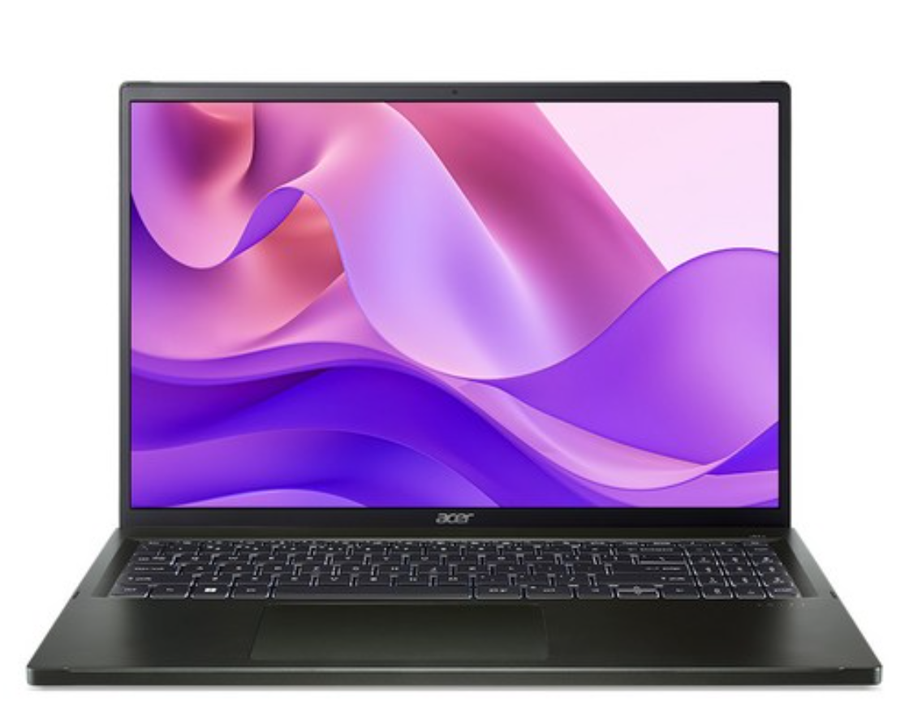
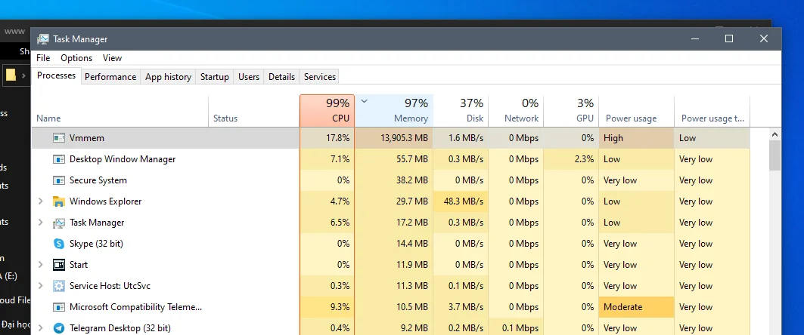

# 피어 개발 런칭 앞으로 4일 남았다.
떨리나? 그렇게 떨리진 않다. 사실 오늘은 뭔가 생각의 정리가 필요하다고 생각하는 부분들이 많이 있었기에, 그저 새벽, 자기 직전 피곤한 몸을 이끌고 정리의 글, 그리고 최근까지 있었던 일들을 정리해보고자 한다. 

## 가장 큰 것은 역시 peer 
정말 오래 걸렸다. 기획을 해보고 싶었던 내가 온전하게 한 사이클을 마무리 짓기까지 앞으로 4일이 남았다. 2월 5일 런칭을 하게 되면 베타로써 한동안 운영될 것이다. 

사실 매우 아쉽다. 부족했다고 본다. 기술적 상상력이 완성되기엔 좀 더 시간이 필요 했다. 정확히는 최악의 경우가 발생했을 때, 그것을 어디까지 사람들은 해결할 수 있는가? 에 대해 예상을 실패했다고 보는 게 맞으리라 생각된다. 

어플리케이션 수준으로 복잡성을 해결하고, 동시에 프론트에 대한 내 개념 수준이 부족하다보니, 백앤드는 어떻게든 해결해 나갈 수 있었지만 프론트는 그럴 수 없었다. 

뿐만 아니라 기존의 기획만 집중하던 시기의 문제가 있었다. 누군가를 탓할 문제는 아니지만, 과도한 자신감은 있었지만, 상상력도, 무얼 해야할지 모르는 이가 리더가 되는 순간 정체 되는 것은 한 순간이었다. 그리고 나는 너무 믿었다. 믿지 말아야 하는 건 아니겠지만, 그런 그가 어떤 사람인지를 정확하게 파악하고 있었어야 했다고 본다. 방향을 잃고 스스로 현타를 느끼게 둔 것은 내가 그럴 역량이 부족하다는 것을 말하는 것이리라 생각도 들었다.

욕심과, 부족함, 그리고 제어와 조절이 불가능한 상황에서 동료라고 하는 존재가 많은 것은 인력으로 전체의 에너지가 되기 보다, 논의할 일이 많아지는 결과를 초래했다고 생각한다.

그럼에도 불구하고 여기까지 온 것도 동료 덕분이기도 했다. 나는 포기하고 싶었던 때가 있었다. 왜냐면 확실한 것은 회사를 들어가는데 있어 어떤 포트폴리오가 완성 했다고 중요한 의미를 갖지는 않는다는 점을 공감하고 있기 때문이다.

런칭을 하는 것보다 그 과정에서 뭘 배웠는지, 무엇을 할 수 있었고, 무엇이 특징이었는지를 아는 것이 더 중요하고 값진 일이며, 회사 수준의 구조, 규칙, 체계를 갖추지 못한 채로, 실무에서 사용되는 기술에 못 미치는 걸로 뭘 만든다 게 큰 의미가 없다고 생각했다. 지금도 마찬가지고 말이다. 

하지만 이게 중요하다고 생각하는 동료들은 선택의 기로에서 포기하지 말자고 이야기 했고, 아슬아슬하게 내가 할 수 있는 영역 안에서 포기하지 않을 수 있었기에, 과감히 자를 걸 자른 뒤 런칭을 하게 되었다. 

사실 런칭을 하게 되어, 그 결과 이용자들의 눈에 보게 된다면 과연 우리 서비스를 쓸까? 객관적으로 그럴 매력은 여전히 부족하다고 보는데, 어떻게 될런지... 기대 된다. 

## 맥북에서 윈도우로..? 윈도우에서 우분투로...! 그리고 다시 윈도우로...

맥북의 돈을 내야 하는 것은 아직 한참 남았다(...) 하지만 개발자로 이직하기 위해, 여러 작업들이 윈도우와 리눅스에서 진행되는데, 맥북으로 하고만 있을 수는 없다고 생각했다. 이제 프로젝트가 마무리 되면, 진짜 이직을 위한 준비의 마지막을 해나가면서, 이직의 기회를 노려야 하는데, 그렇게 되면 보다 현실적인 상황을 맞이할 것이므로, 원래의 '대세' 를 따라가야 한다고 생각했다. 

여튼 그리하여 고민을 하던 찰나, 추후 이야기 하겠지만 경제적으로 마지막 도전을 진행했다. 그리하여 경제적 상황도 조금 풀린 상태에서 기종을 고민했다. 그러다 결론적으로 고른 모델이 1.2kg, 32GB 램을 탑재한 제품이 눈에 들어왔다. 에이서 스위프트 엣지 16이다.



제품에 대해 써보고 난 후기는... 일단 매우 훌륭하다고 느꼈다. 올레드 화면이 반사율만 제외하면 엄청나게 품질이 훌륭했고, 심지어 높은 주사율은 화면은 삼성의 저력(!)이 느껴졌다. 거기다 NPU가 최초로 탑재된 라이젠 7840u 는 상당히 훌륭한 프로세서 였다. 연산 성능도 훌륭하지만, 내장 그래픽 성능이 훌륭해서 소프트하게 게임을 돌리는(?) 것도 가능했다. 거기다 NPU가 탑재 되었다는 점은, 새삼스럽게 다시 한 번 AI에 대해 이해를 하고, 학습으로 대응을 해야 하는 게 아닌가 강렬하게 느낄 수 있었다. 

가장 좋았던 점을 이야기 해보면, 위에서 언급한 부분도 상당하지만, 결정적으론 무게였다. 1.25kg 정도로 16인치를 출시한 것도 훌륭했고, 램이 32GB 라는 점은 더더욱 베스트를 만들어줬다. 피어 개발을 하면서 맥북 14인치만 해도 묵직한 무게의 풀 세트 였는데, 이제는 정말 가볍다는걸 새삼 느낄 수 있었다. 

아 딱 두 가지 정도 아쉬운 점이 있다. 하나는 팬 소음이고, 두 번째는 도대체 무슨 생각으로 이런 색감의 외장을 했는가에 대해서였다. 검정이라 적어놓고 막상 받아보니 거의 다크 국방색 느낌이라... 진자 아무리 acer가 좀 작은 브랜드라도 디자인 갬성은 좀 챙겨줘야 더 잘 팔리는거 아닌가 싶은데 말이다.

### 개발을 위한 OS는..?

그리하야 여러 일들이 있었으나, 잘 정리하고 Free OS 모델이니 뭘 설치해야 하나 고민해보았는데...

정말 지옥이 펼쳐졌다. 왜 결국 돌고 돌아 Intel인가를 정말 새삼스럽게 느낄 수 있었다. Debian을 시작으로 온갖 Distributo 를 깔아 보았는데 프리징, 블랙스크린 등 왜 나는지 파악도 안되는 버그들이 수두룩 했고, 결정적으로 확인이 되었던 부분은 BIOS 부분.... 

BIOS 에서 Secure Boot 라는 기능이 있는데, 이게 부트로더에서 부팅되는 파일들을 점검하거나, 절차 중간에 개입한다는 사실을 알 수있었다. 그런데 이때 문제는 Window 는 정상 호환이 되는데 리눅스 배포판들은 그게 아니었던 것이다. 

그리하여 광명을 찾아 결국 가장 안정성이 보장된다던 Ubuntu 를 설치했으나... 여전히 불안정한데다가, 아예 푹 꺼지면 켜지지 않는 에러(!) 까지 발생하고 나니, 안정성이 부족한 상태에서 과연 사용이 가능한가라는 생각이 들었고 어쩔 수 없이 결국 돌고 돌아 윈도우로 넘어가야만 했다. 

### 하지만 윈도우는..개발자를 위한 OS는 아니다..

그리하여 다시 WSL을 활용하여 DB들을 돌리며 개발을 하려고 하는데, 내눈을 의심할만한 일이 벌어졌다. 


> 이건 예시 스샷입니다.

그래도 돈을 투자해서 32기가 모델로 산 거고, 이 정도면 그래도 어느 정도 돌아가겠지 생각을 했다. 하지만 실제 Front server, Backend server, 도커를 활용하여 DB 서버 프로그램을 돌려 보았다. 그러자 램 32기가 중 25 ~ 6기가... 최대는 30기가까지 먹는 것을 보고, 내가 노트북을 학대 시킬 생각이 없다는 생각이 불현듯 들면서 이대론 안된다는 생각(ㅋㅋ)을 했고, 그래도 불현듯 놀라운 생각이 들었다. 

> 어차피 이렇게 된거 내 서버에 올려버리고 세팅해볼까?

어차피 서버용으로 쓰겠다고 N100 CPU탑재한 서버를 구매했었다. 성능도 준수하고, 무엇보다 전력 소비량이 매우 훌륭했다. 그런데 지금은 사실상 사설 깃 서버용으로 사용하는 정도 뿐이었으니, 이왕 이렇게 된거, 할 일을 분산하자는 생각을 했다. 심지어 N100 CPU 탑재 모델도 16기가니, 해당 PC에서 도커로 DB를 돌리는 정도는 문제가 아니란 판단이었고, 덕분에 램을 20기가 이하로 낮춰서 사용이 가능해졌다. 

여튼 결론적으로 만족스럽게 노트북을 사용할 수 있게 되었다. 개발 환경이 쾌적해지는 것도 쾌적해 지는 것이지만, 동시에 작업에 집중 할 수 있는 환경을 해놓고 나니 윈도우라는 OS의 친숙함이나, 게임등을 돌릴 수 있는 것은 역시 매우 큰 장점이었다. 


# 피어의 런칭과 마무리... 
정말로 이제 마무리의 단계가 왔다는 것을 느낀다. 신입 개발자로써 내 실력이 완벽하진 않지만, 노력했던 것은 날 배신하지 않을만큼 시간과, 경험을 얻을 수 있었다. 다음 준비를 위해 여러 결정을 해나갔으며 새로운 시스템으로 개발 환경을 맞추기도 했다. 새로운 바람을 불러오고 싶다는 생각이랄까... 

개발은 아직 쉽지 않다. 피어 어플리케이션의 목표를 달성하지 못한 부분도 있고, 그런 부분들을 전반적으로 다 고려하여 천천히 그 다음을 향해 한발자국씩 걸어가야 할 것으로 보인다. 걸어 가보자. 노력할 시간이 다시 도래하고 있는 것 같다.


```toc

```
