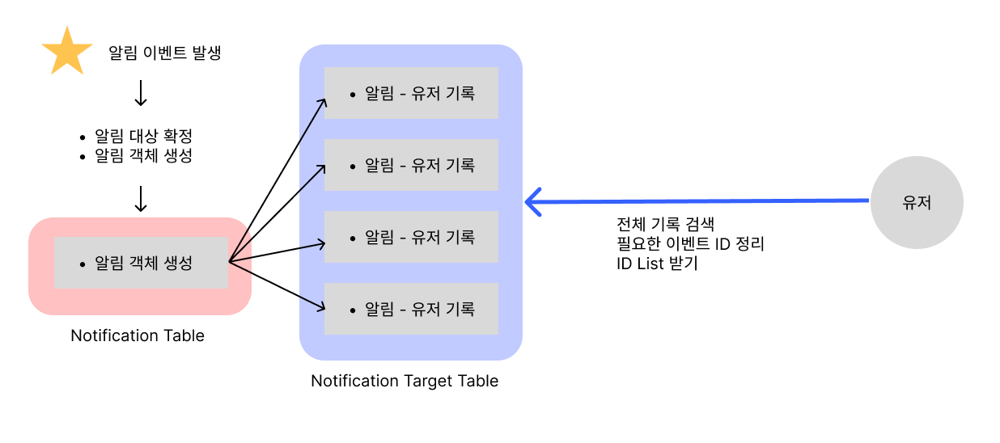
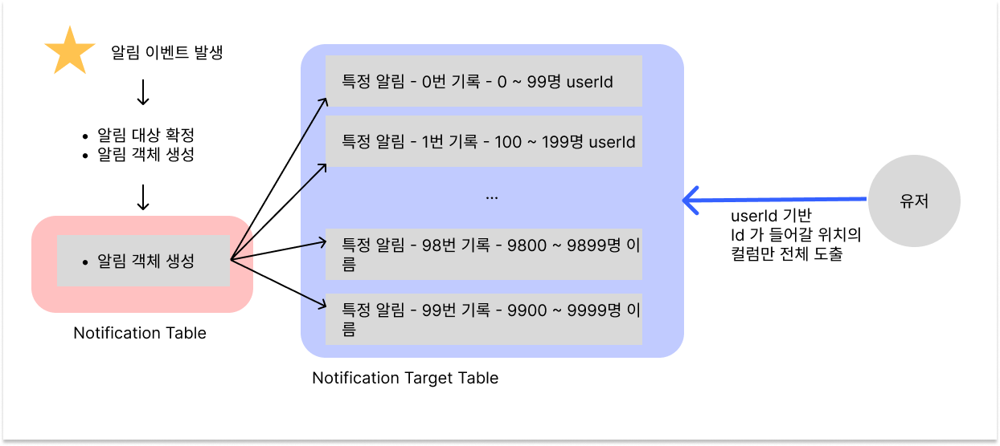

# Next Peer 를 위한 고민 : `알림`

## 시작
피어 웹 서비스의 구현의 목적은 총 3단계로 구성되어 있다. 기획의 핵심은 순환이다. 프로젝트, 스터디의 핵심은 결국 계속해서 타인과 타인 사이에서도 남아야 하며, 만드는 사람들은 목적을 쉽게 달성하며, 동시에 쉽게 자기나 자신의 결과물을 잘 보이는게 핵심이다. 그걸 위해 시작하는 모집글 작성에서 시작하여 협업을 위한 허브 역할의 팀 페이지와 게시판, 쪽지, 그리고 최종적으로 쇼케이스나 피어로그와 같은 것들이 협업의 과정에서의 순환과 결과물의 공유와 강조 등을 포함한다. 

그런 전체 목표 중에 다음 주 중에 공개될 피어 웹 어플리케이션은 대략 2.3~4 단계정도의 진행 정도를 보여준다. 핵심적인 기획은 아직 적용이 안되어 있으며, 특히나 프론트의 딜레이와 버기한 상황들은 앞으로 해당 내용의 확장, 혹은 진화에 조금 더 시간이 걸릴 것으로 보인다. 

어쨌든 프론트의 딜레이와 보안을 하려고 하다보니 시간이 남게 되었고, 덕분에 조금 더 백엔드 구현할 시간이 생겼다. 그렇기에 기존의 알림 시스템을 넣으려고 준비한 것들이 있긴 했지만, 문제점을 파악하고 이에 대해 생각을 좀 더 첨예하게 만들어보고자 한다. 

## 기존의 알림 시스템의 구조는?
처음 생각한 구조를 간단하게 설명하면 다음과 같다. 



본 알림 기능은 두 가지를 목표로 하고 있었다. 

1. 온라인 상태로 들어온 대상에 대하여 온라인 여부를 확인하면, 웹 어플리케이션 내부에 구현된 알림 항목에서 알림 목록을 보여주고, 리다이렉션을 가능케 한다. 
2. 온라인 상태로 들어오지 않은 대상에 대하여 웹 푸시 기능을 활용하여, 구독을 한 하드웨어 디바이스에 대해 알림을 보낸다.

이를 위한 기반이 중요할텐데, 초기에 생각한 형태는 위의 사진과 같다. 매우 심플하게 생각하였다. 다만 몇가지 고민한 게 있었다. 

1. 알림 이벤트는 발생하게 되면, 알림의 대상을 지정하여 이벤트를 생성한다.
2. 이때, 알림은 각기 사용자가 삭제해야 하는 대상이므로, 삭제를 위한 Target Table 이 존재하며 이를 삭제한다. 
3. 이때 전체 인원에 대한 이벤트(내지는 공지)의 경우, target table에 전체 인원의 기록이 발생하게 되므로, 특수하게 Notification Table에서 관리한다. 
4. 사용자는 해당 알림을 누르거나, 삭제를 하게 되면 리다이렉션 처리와 함께 해당 알림은 삭제하는데, 이때 알림 Table에서 직접 이벤트는 삭제하지 않고, Notification Target Table 에서 당사자의 기록을 삭제한다. 
5. 최종적으로 Notification Target Table 에서 referencing 되는 Notification Table 에 이벤트는, 타겟 테이블의 기록이 0이 되는 순간 실제 알림 이벤트의 기록이 삭제 되고, 히스토리용 데이터로 남게 된다. 

## 문제가 있다. 
이러한 구조를 이것저것 채우며 온전한 알림을 전달하는 시스템을 만들려고 했다. 실제로 이 정도면 괜찮지 않을까? 하는 생각을 했다. 그리하여 다른 작업에 집중하다가 이제 다시 알림 시스템을 구축할 수 있게 짬이 났다... 라고 생각을 하고 보니 문제가 있다는 생각을 했다.

무엇이냐면 다음과 같다. 

1. 전체 시스템 공지 알림을 전달할 때가 있는데, 해당 알림에 대해서 각 유저별로 삭제나 리다이렉션을 제공해야 한다. 따라서 target Table 에 기록을 하지 않으면 구현하기가 어렵다.
2. 그렇다고 Target Table 에 유저마다 기록을 하게 된다면, 이벤트 하나가 발생할 때마다 적게는 수십명, 많게는 무한대로 컬럼을 생성하고 데이터를 저장해야한다.
3. 하지만 제한적인 서버 스펙 상황에서 이러한 방식은 매우 많은 데이터를 만들게 된다. 결국 구조적으로 이런 구조라면 활발하게 서비스가 제공된다는 전제로 보면 전체 시스템에서 감당할 수 있는 수준은 기껏해야 수천 ~ 만 이하일 것으로 판단된다.(각 이벤트 당 알림이 생성되고, 전체 알림이 발생한다면, 발생할 때마다 전체 유저 인원수 만큼 타겟 테이블이 생길 수 밖에 없다.)

그렇다. 히스토리를 단순히 생성하는 방식이 된다면 유저들의 인원수 만큼의 데이터가 생성된다. 뿐만 아니라 데이터를 검색하거나 할 때, 관리할 때, 특히 전체 시스템에 공지를 해야 하고, 이 기록을 클라이언트 하드웨어가 아닌 서버가 관리해야 한다는 점에서 기존의 방식은 너무나 한계가 명확했던 것이다. 

이에 여러 생각을 해보았다. 가능하면 서비스가 이런 대형 알림에 대해선 예약의 방식으로 알림이 생성된다던가, 아예 알림만 자체적으로 지원하는 서버를 구룩하는 등도 고려해볼 수 있었다. 하지만 지금은 어쨌든 쿼드코어 서버가 감당해 내야만 하고, 스프링 서버가 가능하면 MySQL 과 잘 정리해주는 것을 기대할 수 밖에 (...) 없어 보였다. 

그렇다면 무슨 방식으로 최적화를 하면 좋을까? 어떻게 하면 알림의 생성에서 부하를 줄이고, 동시에 알림을 적절하게 대응할 수 있을까? 꽤나 많은 시간 호슬림님과 고민을 하다가, 결국 최종적으로 나름의 효율적인 구조를 생각해 낼 수 있었다. 



## '쓸데 없는 컬럼의 생산량을 줄이자'
핵심은 당연히 다수의 컬럼을 생성하는 Notification Target Table 에서 기록을 과도하게 만들지 않도록 하는 것이다. 많은 사용자가 이용한다고 하면, 알림이 생성될 때, 특히 전체 알림을 보내게 된다고 할 때 과하게 컬럼이 많이 생성된다. 일정하게 관리를 해야 하는 것은 사실이지만, 그렇다고 컬럼이 만명의 회원이 있다고 하면, 전체 알림이 생성 될 때마다 컬럼 1만개가 생기는 꼴이 되는것 아니겠는가?

거기다 탐색을 생각해봐도 그렇다. 여러 이벤트가 발생하여 각 이벤트마다 특정 userId로 구분되는 구조를 하게 되면 알림 시스템을 검색하는데도 인덱싱을 찾기, 상당히 난감해진다. 예를 들어 10000개 중에 예를 들어 3이라는 값을 찾는 것은 매우 어렵다. 즉, 경우의 수가 많아지는 만큼 판단할 양이 늘어나는 것이다. 

자 그렇다면 어떻게 하면 좋을까. 

우선 전제 조건으로 아래와 같은 전제를 깔고 접근하면 좋을 것이다. 
- 메모리 상에 데이터를 처리하는 것이 IO보다 처리시간이 짧다. 당연히 메모리 상의 반복작업이 보조 디스크와의 통신까지보다 훨씬 짧게 작업을 진행할 수 있다.
- 더 많은 숫자들 중에 특정 숫자를 구하는 것보단, 범위를 기준으로 인덱싱을 하면 훨씬 더 빠르게 해당 범위의 데이터를 도출해 낼 수 있다. 

이러한 전제 조건으로 생각해보니 다음처럼 생각했다. 우리 서비스의 규모와 수준을 생각하고 목표는 1만명 정도는 원활하게 처리할 수 있는 테이블 수준을 만들고, 향후 더 커진다면 이런 구조의 테이블을 병렬적으로 두면서 서버의 스케일 업이면 되지 않을까 생각했다. 그리하여 정리한 구조는 다음과 같다. 

1) 문자열의 구분자를 넣어, 하나의 컬럼에서 약 100명 정도를 최대 기록하여서, 관리한다. 이때 기준은 userId로 Long 값이다. 
2) 하나의 컬럼이 100명을 관리하면서, 해당 컬럼에도 번호가 붙게 되는데, 그 번호는 1만을 기준으로 나누기 100을 한 값이다. (0 ~ 99)
3) 1만명 기준의 해당 테이블은 1만명이 초과한다면 향후 초과하는 만큼 테이블을 각기 추가하고, asyn 방식으로 병렬 처리로 묶어 낸다면 서버가 부하가 생기는 일을 최소화 할 수 있다. 

## 생성 로직은...
위의 내용을 토대로 이벤트 발생 로직과 이벤트 리스트 중에 특정 userId를 위한 알림을 전달하는 과정은 다음과 같을 것으로 보인다. 

1) 특정 이벤트가 발생한다. 
2) 이벤트 대상을 정리하여, 이벤트 기록에 이벤트 내용, reference counter 를 생성한다. 
3) 보내야 하는 전체 user 객체 리스트에서 Id를 기반으로 100명 단위로 쪼개지는 Notification Target 컬럼을 생성하게 되는데, 이때 컬럼에는 자신의 Id, 해당하는 이벤트, 그 이벤트의 몇번째 인덱스인지(LONG), 그에 해당하는 사람을 append를 계속하는 문자열 이렇게 구성이된다. 
4) 반복문을 통해 돌면서 위에서 언급한 구조의 컬럼이 이미 만들어져 있다면 그 객체의 문자열에 append를 하며, 없다면 새롭게 만들어 내게 된다. 
5) user의 객체에도 알림 생성됨을 지칭하는 counter에 + 1 을 더해준다. (여기서 비효율이 증대 될 수 있어, 적극적으로 JPA를 활용해서 최대한 한번에 처리한다.)
6) 그렇게 생성이 다 되고 나면 해당 내용을 SAVE 한다. 
7) SAVE 함과 동시에 현재 유저가 온라인/ 오프라인 상태를 확인, 알림의 중요도 데이터를 체크하고, 필요시 NestJS 서버에 해당 내용을 전달하고, NestJS 서버는 웹 푸시를 보내게 된다. 

## 유저에게 데이터를 전달하는 로직은?
위의 생성 로직을 통해 만들어진 데이터는 다음과 같은 방식으로 탐색되어 찾아지게 된다. 

1) 특정 유저의 REST API 가 요청이 된다. 
2) 특정 Id Key 를 기반으로 해당 유저의 인덱싱을 특정한다. 예를 들어 1367 번의 유저라면, 해당 유저가 반드시 등록될 이벤트의 인덱싱 번호는 13번이다. 
3) 전체 인덱싱 중 해당하는 번호의 객체들의 배열을 반환 받았다면, 거기서 명부로 기록된 문자열 속에서 지정한 고유 값의 존재 여부를 판단하고, 판단된 이벤트 리스트를 받게 되면, 해당 리스트를 제공한다. 
4) 이때 무한 스크롤을 통해 전달되는 만큼, 필요한 갯수 만큼의 상한을 규정하고, 가장 최신의 이벤트부터 차례로 데이터를 가공하고 전달한다. 
5) 그렇게 전달된 리스트에서 유저가 해당 알림을 지우겠다고 x버튼을 누르거나, 전체 삭제를 누른 경우 이벤트 Id 리스트가 전달되고, 이에 맞춰 삭제를 진행한다. 

## 그렇다면 이렇게 했을 때 장점 /  단점은 뭘까?
이러한 구조를 짜게 되면 우선 아주 중요한 핵심 이점은 바로 컬럼의 생산량이 극단적으로 줄어들게 된다. 1만명이란 기준으로 만약 1회의 전체 알림을 보내면, 구버전의 경우 이벤트 알람 1개에, 전체 유저 분량의 이벤트 관리용 기록이 1만개가 생성되닌 총 10001개의 컬럼이 생성되어야 한다. 하지만 새롭게 고려한 버전에선 최대 101개로 100의 차이가 발생하게 된다. 

뿐만 아니라 탐색을 기준으로 생각해봐도 그렇다. 1만 건의 히스토리가 생성되서 그 중에 한 개의 user에게 배정된 컬럼을 발견해야 하고, 그리고 삭제 시엔 다시 그 기록을 확인하고 지워졌나 아닌가를 판단해야 하므로, 너무나 많은 IO 탐색이 벌어지고 만다. 하지만 새로운 버전은 전체 알림이 1만명 기준으로 최대 100개 밖에 안되는 문자열을 IO 탐색하면 되고, 이후에는 불러온 뒤에 문자열에서, 메모리 상에서 판단하면 될 문제다. 하물며 구분자가 되는 Id 정수 값의 경우 100명 단위로 자른 만큼 특정 문자열 값으로 겹쳐지는 경우가 발생할 수 없다. 즉, 에러가 발생할 가능성이 매우 낮다. 

예를 들어 99번과 199번이 같은 문자열에 있다면, 같은 99라는 문자가 겹쳐서 생길 부분을 추가로 판단해야 한다. 하지만 위의 경우 99번과 199번에게 알림을 보낸다면, 각각 A라는 이벤트의 0번, 1번 컬럼에 각기 속해지게 된다. 그 뒤 99번 유저가 알림 리스트를 요청한다면 서버 입장에선 이제 모든 0번 컬럼만 조사하면 되고, 그 와중에도 99번이 들어갈 확률과 들어가지 않을 확률은 정확히 1/2 로 나눠지게 된다. 

이러한 면에서 새롭게 고려한 방법은 다음과 같은 장점을 가질 것이다. 

1. 생성 시 적은량을 생성 가능하다. 
2. 탐색 시 월등하게 적은 범위를 탐색하게 되고, 그 와중에도 문자열에 대하여 MySQL 의 알고리즘으로 한번 더 거를 수 있는 만큼, 최적의 알림 이벤트 양을 도출해내는 것이 가능하다. 
3. 더불어 그만큼 남는 자원으로 User의 알림 counter를 통해 아예 알림이 0인 경우를 파악할 수 있으며, 이걸 활용하면 더더욱 알림을 섬세하게 탐색하고, 쓸데없는 탐색을 줄일 수 있다. 
4. 뿐만 아니라, 이러한 구조를 가지는 수평적인 테이블을 여러 개 생성하고, 각각 1만명 씩을 위한 테이블로 만든다고 한다면, 비슷하게 용량면에서, 탐색 면에서 이점이 가지는 테이블을 만들 수 있다. 
5. 이론적으로 고려하였을 때, 21만번째 ID가 생성된다고 상상해보자. 이 경우 테이블에 저장 시 Id가 길어져 문자열이 길어질수 있다. 따라서 문자열 탐색에 비효율성이 생길 수 있으나, 약속을 통해 Id의 전반부를 잘라내는 방식으로 userId를 절삭하여 사용한다면 모든 테이블에 Id를 동일하게 압축하여 사용이 가능해진다. 따라서 항상 관리되는 문자열은 결코 늘어나지 않으며 항상 일정하게 유지될 수 있다. 

그렇다면 단점은 어떤 게 있을까?

1. 유지보수 면에서 지속적인 관찰이 필요하다. DB 구조 상 서버에서 유동적으로 파악하여 테이블을 만드는 등의 행위가 불가능한 이상, user 수의 증가를 상시 보고 있고, 이를 체크하면서 알림 테이블을 업데이트해 줘야 한다. 
2. 아무리 빠르다고 한들 메모리 상에서 문자열을 파싱하거나 하는 행위들을 통해 자원을 잡아먹는다는 점은 여전하다. 
3. 해당 로직에 대한 정리와 인수인계서 명확하지 못하면 다른 개발자가 단순히 코드를 통해 이를 이해하고 유지보수 하는 것이 쉽지 않아진다. 
4. 오히려 알림이 소수에게 전달되는 상황들에 대해서는 썩 효율적이진 못하다. 예를 들면, ID가 파편화된 위치에 있어서 테이블에 0번, 13번, 20번 이런 식의 컬럼이 발생하게 될 수 있는데, 그러다보니 핀포인트로 탐색은 기본적으로는 무조건 불가능하고, 모든 활성화된 이벤트당 유저 ID가 해당하는 컬럼을 모두 뒤지도록 해야한다는 점에서 특정 이벤트에, 특정 ID만 생성하는 경우와 효율성면에서 큰 차이가 없다. 대용량 처리에서나 효과적이라고 볼 수 있다. 

## 그럼에도 결론은 
그럼에도 최종적으로 정리해보면, 새롭게 고려한 구조는 대용량 처리에 유리하다. 특히 점점 더 인원수가 많아지거나 할 때, 또한 만약 서비스가 커져 수평적으로 확장을 고려해야 할 때, 알림만을 전담하는 서버를 구성한다면 훨씬 더 효과적일 수 있는 구조라고 판단이 섰다. 이번 주 주말 내로, 과연 서비스를 위한 알림을 만들 수 있을까? 밤새야 할지도 모르겠다 ㅋㅋㅋ..🤣 


```toc

```
