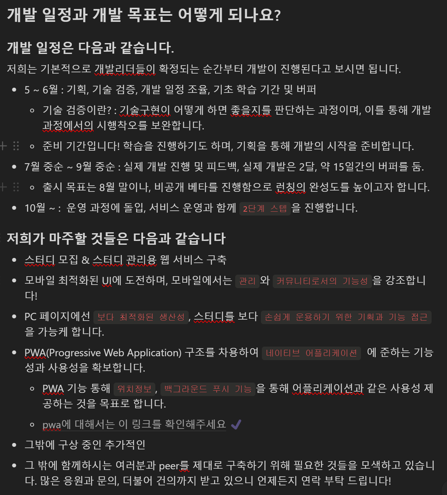
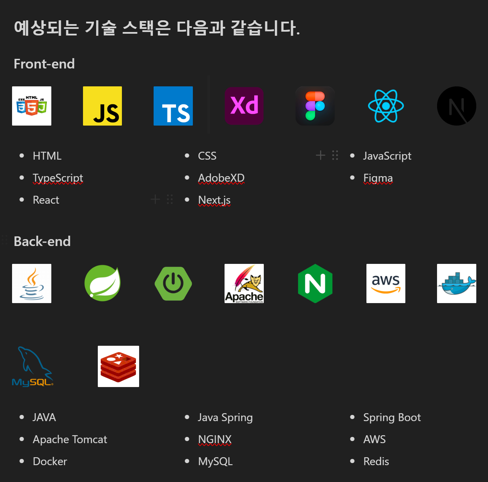
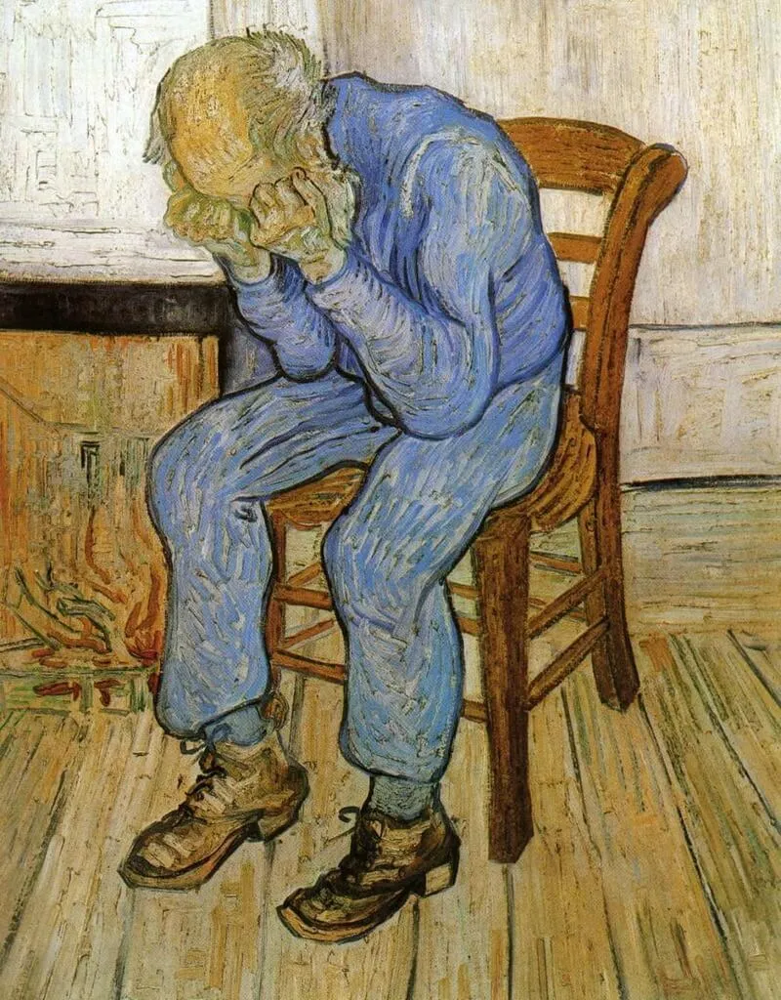

# Peer 프로젝트, 전반부 마무리, 다음을 고민하기 전에 정리해보자

본 글은 프로젝트의 전체 과정을 정리하고자 쓰여진 글이다. 그렇기에 정확하게 기억을 하고, 프로젝트를 설명 할 때의 기초가 되도록 하기 위해서이다. 앞으로의 프로젝트는 다른 방향성을 가질 지도 모르지만, 반성과 성장은 언젠가 도움이 될거니깐! 다소 딱딱하고 재미없는 글이지만, 남을 위한 글이 아니라 나를 위한 글이라는 점 양해 바란다. 

## 구성 단계
피어의 시작은 심플한 기획과 함께 했다. 동료 학습, 협업, 이걸 위한 커뮤니티가 피어의 주인장이 가지고 있는 생각이었다. 스케일 업을 하고 싶었고 커뮤니티화 되는 것을 보고 싶다고 생각했다. 그렇다면 유저는 확대 재생산 될 수 있어야 하며 커뮤니티는 생동력이 있어야 한다는 본질적인 행동을 유도해야 했다. 그렇다면 필요한 게 뭔가를 고민했다. 결론은 심플했다. 팀업이 재생산 될 원초적 심리는 뭘까. 프로젝트, 스터디를 같이 하는 이유를 극대화시켜야 한다는 생각에 집중하게 되었다. 

하지만 예상 외의 복병은 그러한 기획에 대한 부분이 문제가 아니었다. 핵심은 그런 기획들, 욕심을 실제로 구현하여야 하는데, 그게 나 혼자 가능한가? 에 대한 부분이었다. 당연히 답이 No다.  사람이 필요했다. 더불어 피어 운영진 중에도 이야기를 해봤지만 웹 개발에 관심이 있는 사람은 별로 없었다. 오히려 무관심한 분들이 많다는 점은, 조금 섭섭한 부분이기도 했다. 그것을 보면서 돈을 주는 프로젝트도 아닌데, 어떤 식으로 사람을 모아야 할 지가 향후의 과정에서 매우 중요한 영향일 것이란 결론에 도달 할 수 있었다. 

### 원하는 바가 중요했다. 
우선, 기획을 진행함과 함께, '원하는 바'를 찾아다니기 시작했다. 현재의 프로젝트를 구성하기 위해 여러 기능을 구현해야 하며, 이를 제대로 도울 수 있는 사람들을 모은다는 것은 프로젝트의 기획 보다도 우선시 될만큼 중요한 부분이었다. 프로젝트를 하려는 사람들은 분명 원하는 바가 있을 것이었다. 그리고 이런 부분들이 기획에 녹아 들었다면 이 작업에 참여하려는 인원이 많아 질 것이라고 생각했다. 

그렇다면 개발자들이 원하는 것은 무엇일까? 우선, 핵심은 프로젝트의 결과물, 성공 가능성에 대한 확실한 증명이리라 생각했다. 많은 서비스들이 42서울에서 나타났다. 하지만 성공 결과를 장담하지 못했으며, 만든 서비스가 결국 묻히는 것은 너무나 많이 본 경우였다. 이는 어쩔 수 없다고도 생각하는게 개발자들은 개발자이지 운영자들이 아니다. 심지어 기획자이지도 않기 때문에 어떤 서비스가 어떤 순환을 걸치는지, 유저의 라이프 사이클을 고려하는 경우도 별로 없다. 이러한 점들은 종합적으로 취준생들이라는 특수한 환경과 많나는 순간 프로젝트의 성공 보다는 '잘 해봤다'라는 다소 아쉬운 감상으로 마무리 되는 경우가 발생하고 마는 것이다. 

따라서 보여줘야 할 것은 확실한 신뢰감이었다. 팀원들이 여기서 작업한다면 다른 걸 떠나서 '살아남는다'는 인상을 주어야 했기에 그만큼 철저하게 계획을 세웠으며, 글 자체에서 쓰려는 기술 스펙 등을 가능하면 정확하게 적으려고 노력했다. 




> 출처: 노션 개발자 모집글, 적을 땐 몰랐지만 참 이거 저거 고민 했던 것 같다. 

### 유 베이스 & 노 베이스 

뿐 만 아니라, 한 가지 특색이라고 하면, 두 가지 형태로 사람을 뽑도록 제안했었다. 하나는 기술 스택에 대한 유 경험자를 모시는 것과, 준비가 필요한 무 경험자 두 분류를 동시에 접근해도 부담이 되지 않도록 언급했으며, 파이널 미션이라고 하여 준비하는 기간을 1달 정도로 두고, 그 동안 경험이 없어 자신이 없는 사람들도 제대로 배울 수 있는 기회가 있다고 어필했다. 

여기에 프론트엔드를 담당하고 싶은 분들에게는 프론트엔드 만에 기술을 집정하여 새롭게 만들어 볼만한 UX, UI 비전을 제시했다. 더불어 백엔드에는  다양한 백엔드 기술의 구현, 배포, 특히나 기술에서 백엔드 개발자가 구현할 요소들을 목표로 제시하였다. 

그러자 감사하게도 각 분야 별 최소 30명 씩의 신청자가 오게 되었으며, 이렇게 시작한다는 점은 초기 동력을 확보하는데 있어서 성공적인 시작점이 아니었나 생각한다.

## 준비 단계
성공적으로 인재들은 들어왔었다. 확실히 모두가 고파하는 부분을 지적했던 부분에 대해 반응은 분명해 보였다. 그렇게 사람을 모으는데 긴 시간의 인터뷰를 통해 마무리 지었으며, 이렇게 구성된 팀은 다음과 같다. 

전체 리더 2명(나, 운영 리더), 각 프론트, 백의 리더 2명, 해당 리더들 휘하 2명씩의 팀원으로 총 14명의 인원이 팀 peer로 결성되게 된다. 정말 놀라운 일이 아닐 수 없었지만, 놀라거나 기쁘기엔 시작은 너무나 정신없었다. 기획이 구성되고 있었야 했고, 기획 중 부족한 부분들은 채워야 했다. 

**어쩌면 여기서 부터가 개발의 딜레이는 예견 되었던 게 아닐까 생각한다**. 이유는 간단하다. 최초에 이렇게 구성 된 이후 리더들을 세웠는데, 이 리더들은 각각 두 가지 역할을 해 달라고 이야기 했었으나, 그것의 사이드 이펙트랄까? 맡기는 것 만으로는 부족하다는 것을 깨달았기 때문이다. 

먼저, 어떤 역할을 요구했는지 설명해보면 다음과 같다. 첫 번째 리더의 역할은 사람을 살피는 것의 정형화다. 무슨 말이냐면 개발의 과정에서 결국 의견 차이나 관계적 갈등은 생길 수 밖에 없다. 특히 새롭게 하시는 분들은 잘 하시는 분들의 기술이나, 능력, 발언에 주눅이 들거나 스스로 좌절하는 경우를 많이 봤다. 이런 분들이 멘탈적으로 취약해지는 것은 어쩔 수 없이 개발이 시작하면 더 두드러질 것이며 이러한 부분들 하나 둘이 결국 프로젝트의 리스크로 자리 잡게 되면 여러가지 사이드 이펙트가 발생할 수 있다. 

따라서 공감 능력이 좋든 안 좋든 습관적으로, 혹은 형식적으로 정해진 규정 하에 지속적으로 그들을 돌아보는 연습이 되어 있는 것은 향후 감정이 폭발할 시기를 잘 제어할 수 있을 중요한 요소라고 생각했다. 실제로도 그렇게 되긴 했었다.


> 낮은 자존감, 팀원들에 이러한 부분을 놓치는 리더가 되는 것은 좋은 성과를 내기 어렵다. 심지어 이런 분들의 감정에 휘둘릴 수도 있기 때문이다.

두 번째 리더로써 역할은 개별적으로 실력이 있는 리더에게는 개발의 기획을 스스로 따라가고, 멤버들에게 이를 전달하기를 요청했었다. 이렇게 한 이유는 간단했다. 기능들을 고려하는 과정에서 그 양을 봤을 때, 의사소통을 내가 스스로 기획한 내용을 가지고 나누기에는 쉽지 않아 보였다. 기획한 내용을 13명에게 일일이 설명하다가는 날이 새고 만다. 납득이 되지 않는다고 이야기 하는 경우도 있다고 하면 진짜로 몇 날 몇 일이 걸릴지 모를 일이었다. 따라서 이러한 부분에서 기획을 이해하고 전달해주길 바랬다. 최소한의 리더로서의 역할을 요구했다고 할 수 있을 것이다.

하지만... 이러한 나의 생각은 한 편으론 맞았지만 한 편으론 그렇지 못했다. 성공적이라고 말 할 수는 없어 보였다. 왜냐면 우선 1번 역할을 제시했을 때, 리더들은 그것이 어떤 의도에서 하는지, 동시에 어떤 식으로 접근해야 하는 지를 잘 모른다는 사실을 너무 늦게 파악한 것이었다. 잘 할 거라고 믿었던 사람이 알고 보니 동료인 멤버들과 형식적인 소통을 할 줄 알지만 진지하게 깊이 있는 말은 어려워 한다거나, 아니면 반대로 너무 상대방이 무슨 감정을 느끼는지 전혀 모르는, 커뮤니케이션 능력에서 결여된 분도 있었다. 

이러한 분들은 내가 요청하는 사항에 대해 그렇기에 형식적으로 조차 왜 해야 하는지, 그 답변을 내지 못하고 있었다. 그러니 오히려 더 긁어 부스럼에 가까운 행위로만 느꼈고 멤버들과도 오히려 제대로 연계 되지 못하는 것 같은 현상을 볼 수 있었다. 그러다 보니 팀원들과 융화되는데 엠티를 가지 않았다면 지속적으로 갈등이 발생하고, 어색함이 지속되었으리라 생각이 들었다. 

물론, 꼭 다 그런 것만은 아니었다. 오히려 멤버들에게 한 마디라도 물어 봐주려고 노력하는 리더 분들의 경우 확실히 내가 말하는 것 보단 리더로 선정된 그 분을 통해 동기부여가 되고, 목표 설정되는게 수월하게 진행되는 것이 느껴졌다. 그렇기에 부족했던 건 역시 내가 기획과 전체적인 구조를 짜는 과정에서 그들을 너무 방치한게 원인이 아니었나 생각을 해본다. 


그런 점에서 두 번째 역할에 대한 부분도 문제가 있었다. 특히 이는 백엔드와 관련이 좀 있다. 프론트엔드의 경우 UI, UX를 고려하기 때문에 기획을 듣게 되면 결국 어떻게 이를 풀어낼까에 대한 자연스러운 고민을 하는 것이 보여졌다. 그렇기에 기획에 대한 질문이나, 사용자의 시선에서 절차에 대한 고민을 그래도 조금은 하는 게 눈에 보였다.

하지만 백엔드 개발자의 경우 달랐다. 목표가 되는 데이터 형태를 제시하는 것에서는 빠른 대응이 되었지만, 기획 자체를 보여주면서 여기서부터 내용을 해석해내고 DTO를 도출해내고, 비즈니스 로직을 만들어라고 하는 방식은 매우 좋지 못한 접근 법이라는 사실을 알 수 있었다. 그들에게 있어 그러한 과정은 오히려 지루함의 연속으로 느껴지는 듯 보였으며, 특히, 그런 상황에서 리더가 그런 걸 이해해야 하는 자리라는 사실은 백엔드 리더들에게 굉장히 어려운 일이었다. 

그래서 실제로 나가게 된 리더 한 분의 경우 기획에 대해 전혀 이해를 못하고 있었을 뿐만 아니라, 정신 차려보니 팀원들 조차 아무런 기획에 대한 이해도를 전달해주지 못했었다. 코드 조차 제대로 구조화하지 못하고 피상적으로만 작업이 진행되다가, 결국 그 리더가 나간 뒤 제대로 구조 조차 정리가 되지 않은 모습을 알게 되었다.

처음에는 그분에 대하여 굉장히 열을 받았다. 무책임하다고. 하지만 곰곰이 생각해보면 이는 무책임한 게 아니었다. 오히려 너무 과한 조치였고, 개발을 진행 함에 있어, 물론 이 역시 스스로 극복 해내는 능력이 있다면 좋았을 것이겠지만, 없을 수 있다는 사실을 당연하게 내가 오히려 여겼어야 했다. 그런 상황이 발생할 때 피상적이고 굳어서 추상화 된 개념들, 기획을 제대로 현실적으로 백엔드에 녹여내는 것에 대한 나름의 방법론을 준비할 필요가 있어 보였다. 

결론적으로 내가 요청했던 부분에 대해 좀 더 꼼꼼하게 리더들을 살폈어야 했다. 그러지 않은 결과 생각했던 것 보다 더 많이 특정 부분에서 누락이 생겨났고, 이러한 내용들은 처음에는 보이지 않았지만 개발 과정에 들어서는 순간 보이지 않는 장애물이 되었다. 깨달은 순간 처리를 하는데 있어 얼마나 고통스러웠는가를 설명하라고 한다면... 이루 말할 수 없다. 결국 협업을 주도하는 입장에서 내가 당연하다고 생각하는 것은 경험이 준 축복이지, 남들도 같이 공유할 수 있을거란 생각은 상대에 대한 오해와 동시에 상대 스스로 위축되는 결과를 만들 수 밖에 없었다. 

## 파이널 미션과 성장, 그리고 이별 
그럼에도 한 가지 놀라운 사실은 있었다. 그것은 바로 노베이스가 만들어내는 '유베이스' 라는 부분이었다.

프로젝트의 기획과 디자인이 지루하게 이어지고, 그 와중에 자신의 일정, 감정 등등 다양한 상황적 조건으로 몇 명의 중도 해산한 사람들이 발생했다. 그리고 그들에 대한 내용들을 정리하고 하나씩 확인해보니 곪아 있던 부분을 발견하였고 대응하고, 수정하였으며, 다시 팀은 궤도에 올라가고 있었다. 

그 때 정말 놀라웠던 것이 바로 '파이널 미션 통과자' 들에 대한 부분이었다. 우리 팀에는 리더급 혹은 리더에 준하는 실력을 가진 분들이 계셨고, 피어라는 특성과 철학을 지키고자 완전히 웹 개발에 경험이 없는 분들도 그들의 열망이나, 성실성, 협업 능력 정도를 보고 뽑아서 미션을 목표로하여 성장 시켜 함께 개발하겠다는 다소 꿈 같은 이야기를 주장했었다. 그것이 파이널 미션.

파이널 미션은 간단히 말하면 백엔드라면 스프링 프레임워크를 이해하고 실습하면서, 학습을 한 이후에 간단한 서버를 구축해내는 것이었으며, 프론트엔드는 기술스텍으로 리더들이 선정한 도구들을 활용한 웹 프론트엔드를 구현하는, 그리고 여기서 실력 있는 분은 멘토로, 백과 프론트는 1:1로 대응시켜 한 팀을 구성하도록 해서 진행하였다. 

대략 1달의 기간을 들였고, 성공적으로 완성한 팀은 사실상 1군데 정도였다. 하지만 그 과정을 겪은 분들은 다들 나름의 기대, 부족함에 대한 열망, 성장하고 싶다는 동기 부여가 확실히 되는 모습을 볼 수 있었다. 

여기서 나는 한 가지 흥미로운 사실을 알 수 있었다. 멘토급이라고 하는 이들중에 일정 부분 팀을 나가는 사람이 발생하긴 했지만, 반대로 처음부터 도전하고 깨지면서 우리 팀 목표를 향해 나간, 파이널 미션의 참가자 분들은 정말 놀랍게도 개발 마지막의 마지막까지 살아있었다. 

오히려 잘하는 사람들은 불안을 이기지 못하고, 앞서 언급 하였듯이 기획을 제대로 이해하지 못하고,  스스로 불안에 빠지더니 설득에도 결국 팀에서 나가는 모습을 볼 수 있었다. 

물론, 이 과정을 과도하게 잘하는 사람, 이제 시작한 사람 양분하고 미화하는 방식으로 접근하면 안될 것이라 생각한다. 이러한 사례는 백엔드의 사례며 오히려 프론트엔드에선 자신의 실력 부족, 압박감으로 오히려 파이널 미션 참가자가 중도 포기하는 경우도 있었다. 

하지만 한 가지 분명한 사실은 파이널 미션을 통해 올라온 분들이 전반적으로 근성이 좋았고, 기술적 부족을 알지만, 알기 때문에 더욱 노력하는 자세, 진지하게 임하는 자세를 보여주는 것을 느낄 수 있었다. 이러한 지점은 정말 큰 힘이 되어주었으며, 만약 내가 이후에도 팀이나 미션을 마주하게 된다고 할 때 어떤 사람이 결국 내 힘이 될 수 있는가? 에 대한 조금이나마 청사진을 보여준게 아닌가 생각을 하게 된다. 

## 결론 
준비 과정은 정말로 다사다난 했으며, 내 허풍을 현실로 만들기 위한 정말 처절한 과정이었다. 생략한 디자이너님과의 만남, 어떤 식으로 믿음을 줘야 할지 등등... 정리하는 과정에서도 여전히 할 말은 많다는 생각을 하게 된다. 

어쨌든 큰 틀에서 준비 과정에서 겪었던 것들은 사람에 대한 이해, 팀에 대한 이해, 그리고 나에 대한 이해가 뒤섞여 있었고, 여기서 참 쉽지 않았고 결과 미숙함이 딜레이를 초래했다.

다시 한 번 느끼지만 절대 내 기준으로만 사물을 보는 자세, 상대를 보거나, 기획을 보는 자세는 조심해야 한다고 느꼈다. 협업이 종합 예술 같은 것이라면, 각 사람은 정말 다양한 특징과 리스키한 부분을 안고 있는 불완전한 생체 기관 같은 것이며, 그들의 입장을 모른 체, 상황을 고려하지 않은 체 벌인 부분들이 결국 심각한 결과를 한번 씩 초래한다고 생각했다. 


---

```toc

```
