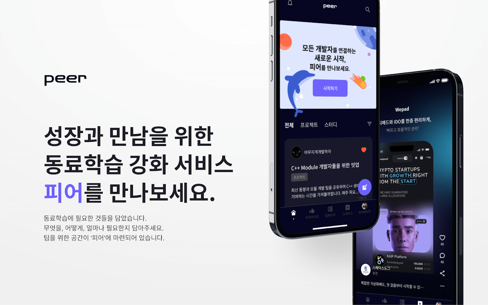
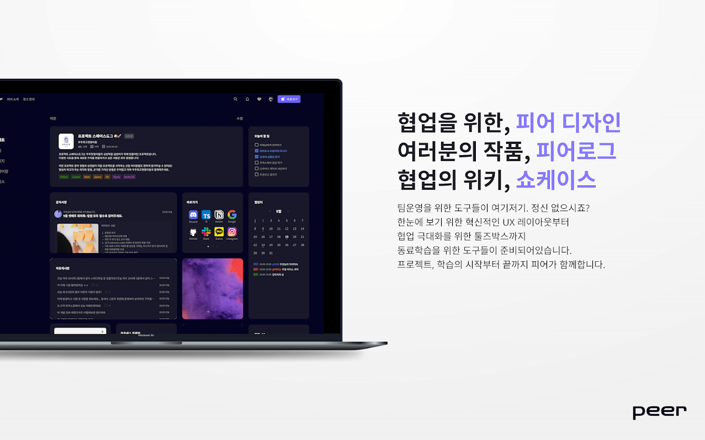
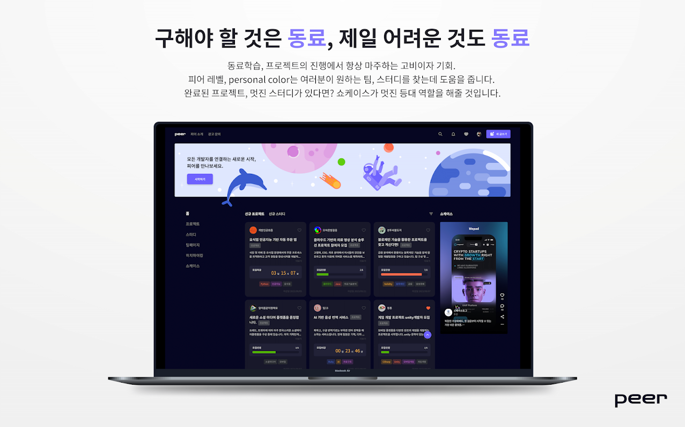
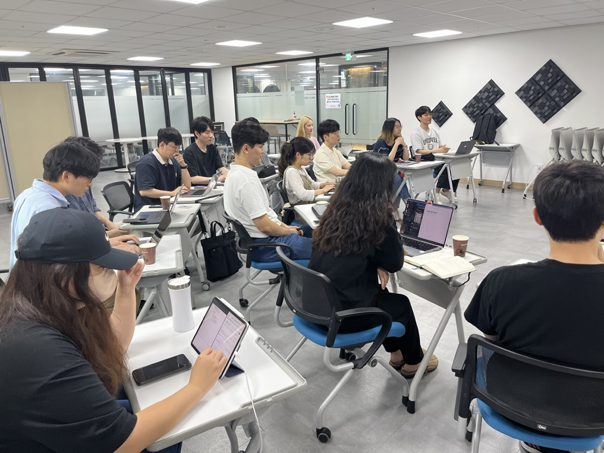
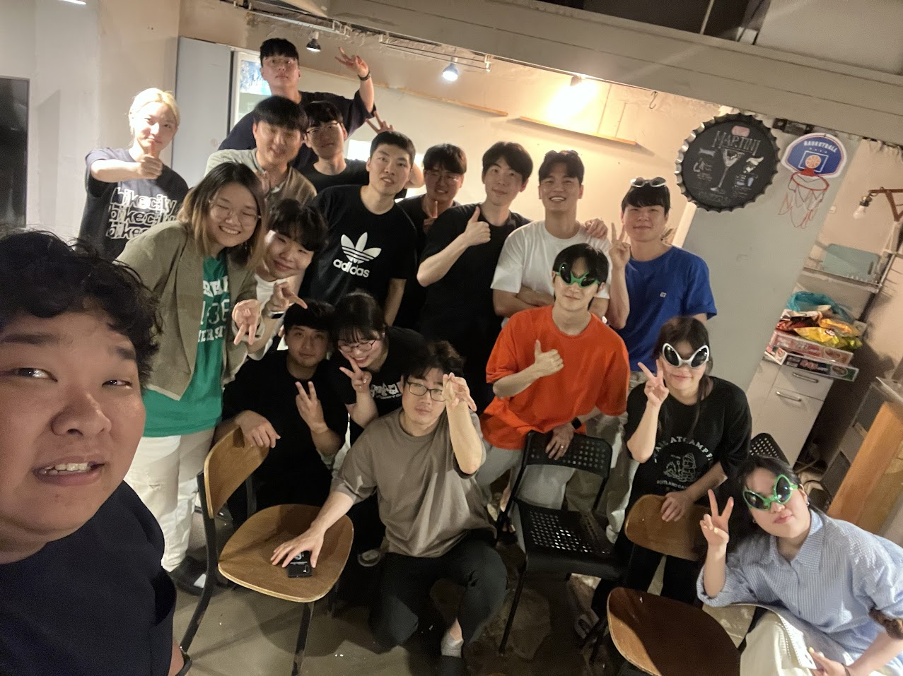
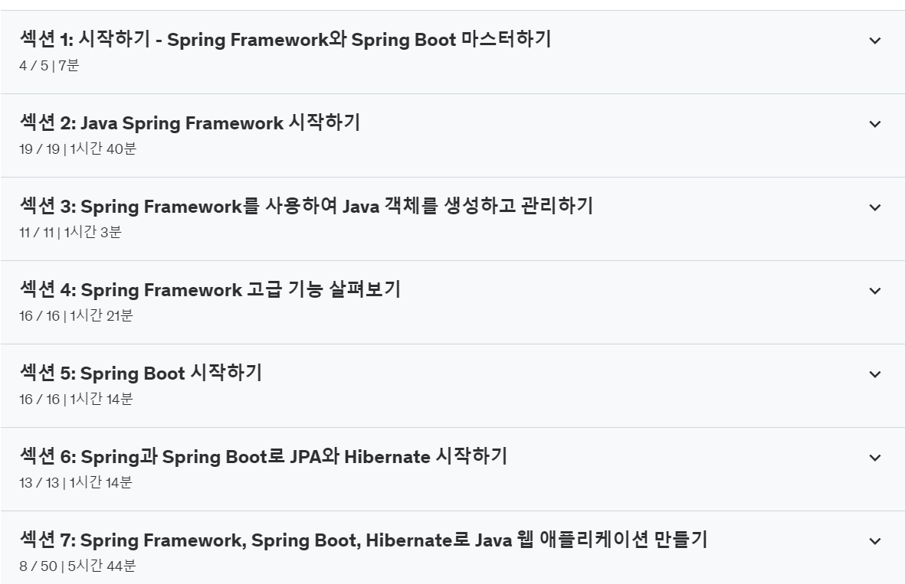
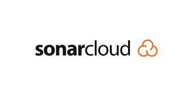
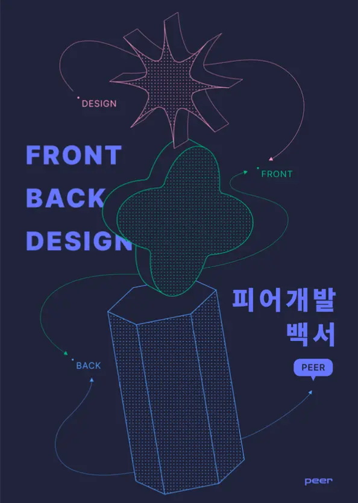

# Intro
본 글은 피어 개발의 과정에서 느낀 바, 알게 된 바에 대한 정리를 목적으로 하는 글이다. 과정에 있었던 상황과, 과정에서의 내 생각들이 담겨 있기에 peer 전체를 대변해주지는 않는다. 그러나 가능하면 공정하고, 상황 그대로를 묘사하려고 노력했음을 알아주길 부탁드린다. 
# 개발 단계 

## 개발 초기 
### 기획의 끝이 보이지 않았다 
개발이 시작되고 틀이 잡혀나가고, 팀 내에는 나름대로 드디어 시작이구나! 라는 생각이 감돌았다. 모두들 의욕이 올라 오는 게 보였기에 이제 할 일은 무엇인가? 에 대한 진지한 생각과 함께 개발에 임하게 되었다. 

우선, 목표를 정확하게 전달할 필요를 다시 느꼈다. 무언가 스스로 해내는 경우는, 스스로가 자신 만의 목표에 몰입 될 때라고 나는 생각해왔기 때문이다. 그렇기에 프론트와 백 양쪽에 쉬운 목표들, 이루기에 어렵지않다고 판단되는 영역과 상당히 난이도 있는 영역, 크게는 두 줄기의 목표를 부여해 주었다.

프론트의 경우, 프론트엔드 개발의 핵심이라고도 할 만한 것이 무엇일까? 를 생각했을 때, NextJS를 사용하고, 노드 중심의 개발 환경인 만큼 이를 극대화할 무언가가 필요하다고 느꼈다. 컴포넌트 단위, 클린 코드를 작성하지 않는다면 구현하기 어려울 만한 것. 그러면서도 기획의 핵심인 동료 학습을 위한 도구로서 의미가 담겨 있을 것. 

백의 경우, 훨씬 수월하게 고민을 할 수 있었다. 백엔드의 핵심은 결국 최적화된 구현. 동시에 여러 다양한 서비스를 무리 없이 연결 시키고, 그 과정에서 생기는 비효율이 무엇인지 파악하고, 그걸 해결해 나가는 에피소드들을 만들어내야 한다는 사실. 

이 두 가지 기준으로 생각했던 나는, 구체적으로 다음과 같은 몇 가지 목표를 제시하게 된다. 

프론트엔드의 경우
- 기본적인 게시판 형태의 강화 버전을 구현할 수 있을 것 
- 팀을 위한 공간, '팀페이지'를 구현하며, 여기서 팀들이 사용할 수 있는 위젯 기능을 모듈화하여 구현한다.
- 팀 페이지 - 위젯 기능은 향후에도 프론트 엔드만의 논의로 계속 추가할 수 있는 모듈형 SDK 구조로 만들어 낼 것. 이를 통해 향후에 재사용이 가능한 컴포넌트로 재생산을 하고, 이를 활용한 웹 애플리케이션 프론트엔드를 구축할 것.

백엔드의 경우 
- 2, 3차 스텝으로 지정한 다양한 서비스 연결(구글 oAuth 연결, PWA, LLM API 연결 등)
- 프론트엔드에서 진행할 모듈형 기능 구현을 위한 데이터 구조 설계(MongoDB)
- 준 대용량 설계에 달하는 문제점 해결할 것(개인화된 알람의 서버에서의 구현 등)




> 그렇게 기획의 최종 정리가된 형태가 바로 이 목업 겸 홍보용 템플릿이다.

해당 목표들의 전달 과정, 그리고 구체화 과정은 정말 끝이 없었다. 구현할 기초 단계의 목표들은 알아서 고려하고 정할 순 있었다. 하지만 예를 들어 서비스를 위해 팀 페이지를 만든 다고 하면, 과연 팀 페이지는 위젯을 몇 개 by 몇 개의 크기로 지정할 수 있어야 하지? 혹은 모바일로 사이즈가 줄어들면 어떻게 되어야 하지? 등 과 같이 다분하게 운영적인 면은 팀원들이 직접 정하지 않으려는 모습이 이어졌다. 

생각해보면 이러한 모습이 결코 나쁘진 않았다. 기획을 하는 사람, 결정을 하는 사람은 정해져 있던 것도 사실이고, 배가 산으로 가지 않으려는 생각으로 나 역시 리더들, 결정권을 휘두를 생각이 있는 사람들이 아니라면 결정에 무언가 이야기를 하는 것이 의사 결정을 오히려 방해할 수 있을거라 생각했기 때문이다. 어쩌면 오히려 조직 전체를 움직이기 위해선 필요한 분위기라고 생각하기도 했다. 그러니 지루하게 긴 여정이라도 의미와, 의욕이 충분히 있었다. 

**하지만** 역시나 의도대로 된다는 것이 사람의 뜻인 이상 완벽하진 않았다. 

### 사람은 모두 다르고, 소통은 엉망이어도 필요했다 
기획과 구조를 짜는 동안, 나머지 팀원들은 3명이 1팀이 되는 구조를 취하고 있었다. 리더급인 사람이 두 명 프론트, 백의 리더를 각각 맡았으며, 그 사람들이 두 명의 팔로워들을 맡고 있는 구조로 총 4팀. 이 중 두 팀은 피어라는 동아리의 철학에 맞춰 완전히 노 베이스이지만 기초를 배워서 해볼 분들로 모셨으며, 두 팀은 이들을 각각 이끌 리딩의 팀 개념으로 경험이 있는 분들을 모아서 진행해 보았다. 

최초 개발이 시작된 직전과 직후에는, 리딩 팀들이 미션으로 제시하는 기초 개발 프로젝트를 진행했고, 그 사이에 리더들과 나는 개발 기획, 운영 기획 등을 진행했다. 당연히 그러면서 사람들을 파악하기 위한 이벤트들도 진행했다. 


> 우리는 이렇게 진행했던 미션을 '파이널 미션'이라고 불렀다. 

> 이후에는 MT를 기획하기도 했다. 가장 큰 이유는 사람을 파악하기 위해서 였다. 

하지만 이러한 과정은 당연히 딜레이를 발생 시킬 수 밖에 없었다. 더불어 지금 생각해보면 최초 시작하는 팀원들은 그 상황과, 고생이 필요하다는 점, 부족하다는 점에서 소통이 어느 정도 이어졌고, 이들을 위한 나름의 대화나, 소통의 시간이 필요했다. 그리고 이는 당연히 인간적인 끈끈함은 생겨나갔지만, 반대로 기획을 마무리하고 완성할 시간이 부족한 사이드 이펙트를 야기 했었다. 

이러한 문제점이 드러나게 된 것, 갈등은 오히려 어디서 터져나왔는가? 바로 '경험자' 집단에서였다. 리더로 역할을 해주는 경험자들, 그들에 대해서 함께하게 된 이후에 상당히 든든한 역할들을 해주었다. 노베이스인 이들의 질문을 받아주고, 그걸 통해 노베이스 팀원들은 성장세가 눈에 띄게 보였으며 이것만으로도 팀 내 분위기는 상당히 좋았다. 

하지만 그 과정에서 기획보다 현재 기술 구현에 대해 역할을 맡긴 백엔드 리더 한 명이 있었다. 굉장히 적극적인 인물 상이었고, 특히나 개발에 대한 나름의 철학이 느껴지는 동료이기에 나 역시 백엔드이자, 가장 핵심 기술 고안의 핵심이 되어주길 원했다. 그렇게 좀 바쁜 상황에서 일을 맡기기도 했던게 솔직한 상황이었다. 

문제는 바로 여기서 부터였다. 그는 사실 상상력이 부족한 사람이었던 것이다. 개발 초기, 완벽에 힘쓰던 나머지 계속해서 발생하는 '결정함에 따라 찾아오는 문제점'에 대해 이겨내지 못하고 있었다. 하물며 알고 있다고 생각한 자신의 상황보다, 앞서서 펼쳐지는 해결 해야 할 문제들에 앞도 당하기 시작했는데, 문제는 거기서 가장 의지해야할 대상인 나를 믿지 않았고, 무엇보다 기획도, 프로젝트 전반도 이해하지 못하고 있었다. 

하물며 뒤에 알게된 바, 그는 동료 학습을 전혀 공감하지 않았으며 42서울에 대해서도 굉장히 부정적인 사람이었다. 그리고 문제는 그런 다소 애매한 입장인 그 리더에게, 팀원들의 요구가 쌓이기 시작할 때 부터였다.

팀원 중에 한 분은 상당히 까다롭지만, 정확한 사람이었다. 그렇지만 동시에 효과적이거나 효율적, 확실하지 않으면 불안해하는 성격의 소유자 였다. 그런 그녀와, 또 한 명의 팀원은 굉장히 과묵한 성격의 소유자였지만, 동시에 잡생각을 하기 보단 하겠다고 마음 먹는 순간 제대로 걸어갈 줄 아는 남성이었다. 처음, 백엔드 리더는 그 둘을 데리고 학습을 더 해나가길 원했다. 그러나 여기서 말했듯, 자신의 부족함을 드러내지 못하고, 솔직하지 못하다는 점, 그리고 결정적으로 커뮤니케이션 능력에서 리더라기 보단 팔로워에 가까웠던 그는 제대로 이 두명의 팀원을 자기 중심에 끌어오지 못했었다. 

그런데 하물며 그 상황에서 팀원 중 한 분인 여성분 입장에선 이런 리더의 모습이 미덥지 못할 뿐 아니라, 프로젝트 자체에 대한 불안이 생길 수 밖에 없었다. 그리고 결국 그런 감정이 터지기 시작하는데, 전체 리더 내지는 함께 하는 다른 리더들에게 이런 상황을 전혀 공유하지 않았고, 결국 우선 첫 번째로 여자분이 나가게 되었으며, 이후엔 여러 일이 있었고 그 백엔드 리더 조차 자신의 감정을 추스리지 못하고 나가게 되었다. 

### 여러 아픔이 있지만, 그럼에도
프론트에서도 여러 일들은 있었다. 개발 중간이나 후반부에서 사람이 빠져나온 것도 있었지만, 분량 상, 그리고 말한다고 그것이 좋아지거나 달라지는 것이 아니니 생략하고자한다. 

하지만 어쨌든 초기의 이러한 과정은 나에게도 팀 전체에게도 여러가지 상황을 직면하게 만들어주었다. 나는 우선, 리더라고 세운 이들도 그냥 단순히 믿고 맡겨서 될 문제가 아님을, 그리고 제 아무리 실력이 좋다고 하더라도 사람이란 사실을 깨달을 수 있었다. 

뿐만 아니라 '실력'이 있다 를 이야기 하는 것이 언어가 아님을, 프레임 워크만이 아님을 팀원 모두가 공감할 수 있는 기회가 되기도 했다. 이런 말을 하는 것은 그렇지만, 내가 가장 신뢰했던 그 백엔드 리더는 결국 만들었던 모든 코드를 드러내야만 했고, 그가 했던 모든 작업은 나와 다른 이들의 논의로 드러냈으며, 마지막 까지 가서도 생겼던 모든 버그들의 주된 원인은 그가 만들어 놓은 것들 때문이었다. 참으로 안타까운 일이었다. 

힘듬을 공유하고, 소통하고, 동시에 그 과정에서 제대로 문제를 바라보는 사람들은 설령 스스로 부족해도, 팀원이나 구성원들을 바라보며 같이 부족함을 채운다. 그게 오히려 효과적이었음을 감각적으로 우리는 익힐 수 있었고, 팀원들의 이탈은 오히려 반면교사가 된 점도 없지않아 있던 것이다. 그렇게 개발의 시계는 중반부로 향했다. 

## 개발 중기 
### 나를 되돌아 보다
개발은 순조롭다고 생각되었다. 초기 있었던 갈등들은 생각보다 큰 충격이었지만, 동시에 다른 팀원들을 묶는 요소가 되기도 했다. 또한 그 과정에서 함께 해준 다른 리더들은 각자 자기 자리를 제대로 지켜주었다. 

그리고 그 과정에서 생기는 여유가, 나에게는 정말 꿈같던 휴식이자, 채울 수 있는 시간이 되어주었다. 생각해보면 개발 초기~ 중기까지 나는 자바도 스프링도 사실상 그렇게 충분히 이해한 상태는 아니었다. 그럼에도 지금까지 쌓은 CS를 가지고 문제를 인식했고, 지금까지 생긴 문제들을 가져오는 팀원들에게 문제를 일단 받으면 빠르게 상황을 읽고 ChatGPT 와 구글링을 통해 내 부족을 채워서 진행해 나갔었다. 지금 생각하면 사짜도 이런 사짜가 없지 않았을까? 😂

그러나 그런 시간이 이어질 순 없다고 생각했다. 아무리 그런 make-shift가 유효한 수단이라곤 하지만, 그걸론 놓치는 게 많다는, 근본적인 문제는 어느것 해결되지 않았다는 불안감이 엄습했다.  


> 내가 부족한 순간 나를 채워준 28minute 의 인도인 선생님의 강의, 다 들은 건 아니지만 대략 4일간 하루 3시간을 자고 이 강의를 듣고 실습을 스스로 만들어 보았다. 

예전 생각이 불현듯 낫다. 선생님이라는 직업을 가졌었기에, 조금 자랑해보자면, 전교 300명 중 270등 짜리 친구를 전교 100등으로, 30등으로 끌어올렸던 때의 기억. 결국 시간과 경험, 수준이라는 것이 쌓일 때까지 폭발하기 전까지 한계까지 버티는 그 아슬아슬함이 나에겐 필요하리라 불안함을 느끼는 순간부터 생각하고 있었다. 

그렇기에 작년 8월 달. 한 창 더위가 치고 올라올 때, 연휴의 딱 4일, 추석이 되었을 때 비로소 나는 내 한계를 넘어설 방법을 마련하기로 생각했다. 있는 시간을 모조리 갈아 넣었고, 실습까지 복습하면서 하루 3시간만 자는 강행군을 약 4일. 4일을 마칠 때 즈음 몸이 박살 나는 것을 느끼긴 했지만 그때의 경험은 peer를 만들어내는데 나에게 있어 정말 기적과도 같은, 축복이라고 할만한 시간이었다고 생각이 든다. 

### 길어지는, 늘어지는, 목적을 상실해 나가는
그러나 무언갈 얻어도, 결국 한계라는 녀석이 항상 존재하기 마련이다. 현실이라는게 아무리 생각해도 시궁창일 때 정도는 있지 않겠는가? 그런 일이 피어에도 스멀스멀 나타나고 있었는데, 그것은 바로 '창조에 대한 고통'이었다. 

42서울에서 2년이란 시간, 20대의 마지막 30대의 시작을 갈아 넣으면서 내가 본 것은 개발자에 대한 두 가지 시각이었다. 하나는 창조적 개발자였으며, 하나는 복사적 개발자라는 두 가지 영역이었다. 물론 이러한 형태는 단순히 개발자만의 문제는 아닐 것이다. 어떤 일을 해도 대게는 크게 두 분류로 쪼개지며, 조금 더 디테일하게 들어가면 창조, 선도적인 입장, 중간 관리의 입장, 보수와 깊이를 더하는 입장 이 정도 대표적인 일의 입장이 아닐까 한다. 

peer 라는 서비스의 구현 방향, 기획에서 전형적인 영역의 개발은 큰 문제가 아니었다. 왜냐면 대부분의 사람들은 기본적으로 보수적이고 깊이를 추구하는 성향은 어느정도든 가지고 있기 때문에 레퍼런스를 보고, 구글링을 하고, 이젠 ChatGPT까지 끼얹어주면 그럴싸한 결과물이 나왔다. 

하지만, 문제는 새로운 영역이었다. 대부분의 많은 이들, 팀원들도 이 부분에 대해선 혼란과 머뭇거림이 있었다. 더욱이 이걸 가속화 시킨 영역 중에 하나가 나는 '책임감'에 대한 압박 때문도 있을거라 생각이 들었다. 팀원이 팀 전체의 운명을 책임 질 수는 없다. 그러니 결과를 내거나 결론을 새로운 영역에서 낼 때는 근거가 없이 결정할 수밖에 없었다. 

예를 들어 업적 시스템을 만든다면 과연 어디까지 업적으로 쳐야 하는가? 팀원 중에 누가 빠져나가는 경우가 생기면 어떻게 데이터적으로 처리하고, 팀원 모집글이나 기존 팀 데이터는 어떻게 해야 하는가? 어쩌면 실무적으로 보면 우스운 이야기일 순 있었겠지만 함께하는 팀원 모두에게는 이러한 영역 하나 하나가 심리적 저항선이자, 늪지대와 같았고 체력을 빼앗아갔다. 

개발의 결과는 점차 늦어졌고, 무언가 만들어내는 것에 힘이 특히나 많이 들어했다. 특히나 이런 영향력에 가장 자유롭지 못했던 부분은 역시나 프론트엔드 였다.

백엔드는 어땠는가? 라고 한다면 그럼에도 다행스러운 면이 많이 있었다. 우선, 내가 개발 총괄이면서도 백엔드, 중반 이후가 되면 좀더 백엔드가 되어 있는 상황이었고, 그러한 결정에서 뭐가 되든 내가 스피디한 결정을 요구했고, 실수가 발생하면 그 부분은 내가 도맡아서 해결하는 구조를 띄게 되었다. 내가 잘나거나 실력이 뛰어나진 않았다. 그러나 고민하고 시간을 쏟는 걸 최소화 한다는 점에선 이 방식은 매우 효과적이었고, 결론적으로 백엔드는 꽤나 빠른 시간 안에 서버와 기능의 큰 틀은 마련이 된 상황이었다. 

### 정리, 새로운 국면 
그러나 백엔드가 잘한다고 프론트가 잘 끝나는 것도 아니다. 하물며 팀 내에서 다소 백엔드가 치고 나가는 것을 보면서, 프론트엔드 내의 분위기가 묘하게 변하는 것도 느낄 수 있었던 상황이었다. 팀으로썬 최악의 생각이라고 볼, 자기들이 발목을 붙잡는 다는 생각. 이런 생각은 추호도 일어나선 안된다고 나는 판단하고 있었다. 

그렇기에 변화가 필요했고, 변화를 위해 필요한 것이 무엇일까 고민하기 시작했었다. 프론트엔드의 레포지터리를 뒤지고, 그들의 문제나 쳐짐이 어디서 오는지를 분석하기 시작했고, 백엔드 역시 여전히 안되는 부분을 어떻게 다잡아야 개발의 속도가 날까? 는 개발 후반부로 갈 수록 나에게 놓여진, 책임자로써의 무게 같은 느낌이 되어가고 있었다. 

우선 가장 먼저 떠오른 변화의 핵심은, 해야 할 일이 있거나, 개발에 집중하지 못하는 인원들, 걱정을 가진 이들을 배제하는 것이었다. 우리는 돈을 받고 월급으로 움직이는 게 아니라, 도전하고 무언가 이루어 보고 싶었던 이들의 자발적 모임이었다. 그러나 거기에는 상황적 한계를 가진 이들도 있었는데, 이런 이들의 표정이나 행동, 몸짓이 팀 내의 사기를 결코 증진시키지 못한다는 사실을 알고 있었다. 

뿐만 아니라 개발한 영역의 수정이 필요할 때, 팀원들 사이에 안목의 차이, 깊이의 차이로 대화가 필요한 경우가 상당히 발생했었다. 이러한 과정은 평상시라면 좋은 성장의 레시피겠지만, 현재의 상황에선 불필요하다는 생각을 했다. 

특히 여기서 가장 핵심 문제가 되는 것은 '기준'을 세우기엔 우리 모두 아마추어라는 사실이었다. 아무리 실력이 있어서 찍어 누른다고 하면 갈등이 발생할 것이며, 반대로 서로 기준이 되어주지 못하기 때문에 수평적인 관계가 오히려 전진할 기준이 불분명하게 만들어버린 것이었다. 그러니 코드를 보고 논의하는 시간도 길어지고, 혼자서 고민하는 시간도 늘어만 갔다. 

이러한 점들을 모아 놓고 보니 필요한 것들은 얼추 정리 되는 상황이었다. 



1. 상황적으로 개발을 이어갈 수 있는 사람이 아닌 분들에 대해선 개발을 내려놓는 것이 '포기' 하는게 아니라 **자신의 해야할 일들을 하러 간다는 인식 심어주고, 일상으로 돌아가게 만들기**.
2. 부족한 부분에서 인원이 추가 필요한지를 판단하고, 이에 대해 인원을 추가했으며, 그렇지 않다면 의사 결정이 빠를 수 있는 선을 유지 시키기. 
3. Sonar Cloud를 적용시키며, 개발의 시작과 끝에는 항상 Code Review를 넣어주며, 이를 반드시 진행시켜야만 자신의 일을 진행할 수 있도록 구조 강조하기.
4. Scrum 방식의 개발을 참고하여 스크럼 미팅을 생활화 하고 가능한 한 구체적으로 목표 달성 여부를 볼 수 있도록 도표화 하기.

## 개발 후반, 그리고 런칭
### 새 국면 그리고 현실
새로운 국면에 접어든, 작년 10월 전후부터, 피어 팀은 보다 단단하고 논의가 빠르게 진행될 수 있는 구조에 가까워졌다. 이는 내 생각과 의도 이상으로 효율적이긴 했다. 이 과정에서 물론 여러 논쟁도 있었다. 프론트 리더 중 하나는 프론트의 문제점을 지적하는 것을 듣지 않으려고 했다던가 이런 일들도 있었다. 백엔드만큼 잘 하고 있다는, 다소 객관적이지 못한 평가를 이어갔기에 변화를 수용하지 않으려고 했다. 다행이, 백엔드의 결과물이 있었기에 수긍하긴 했지만 말이다. 

어쨌든 그렇게 국면이 바뀌자 결과물이 나타나기 시작했으며, nhn cloud 에 서서히 우리가 만든 피어가 나타나기 시작했으며, 그러한 모습은 더욱 피어 팀원들 모두를 가속 시켰다. 런칭이 코앞으로 오고 있음이 느껴지고 있었던 것이다. 

하지만 아는가? 이런 벅찬 순간이 쉽게 다가온다면, 그건 결코 행복한 결말이 될 가능성이 희박하다는 점을 말이다. 이제 점점 형태도, 기능적인 구성도 어느 정도 이루었다! 라는 생각이 들 때 즈음 애플리케이션 내부를 바라보는 내 감상은 다음과 같았다.

"런칭 퀄리티가 아니다 -"

디자인의 일관성을 지키지 않은 프론트엔드의 모습, 기본적인 보안 요소를 신경 쓰지 않은 백엔드 영역들, SQL 인잭션을 비롯 다양한 문제들에 대해 대응은 커녕 전혀 준비되지 않은 모습. 뿐만 아니라 여전히 기존의 서비스들을 대체할 수있어야 하는, 킬링 기능들이 구현조차 되지 못한 현실은 너무나 잔혹하지만 우리에게, 나에게 큰 책임으로 다가오고 있었다. 

다른 이들은 안타깝기도, 아쉽기도 하다는 평이었다. 당연한 이야기 였다. 몇 달의 긴 시간을 들여 만들었음에도 그 수준과 깊이가 부족하고, 서비스의 런칭을 위한 정밀함은 부족했다. 결정적으로 나는 여기서 실무와 개인이 모여서 하는 프로젝트의 수준이란 무엇을 말하는 것인지 깨달을 수 있었으며, 실무에 들어간 이후에 해야하는 일들이었다는 약간의 후회와, 앞으로 어떻게 해야 하는가에 대한 고민을 해야 했다. 

### 그럼에도 런칭은 간다 그리고 개발 백서를 

개인적인 일까지 포함하고도, 개발의 상황은 순탄했지만 도저히 런칭 퀄리티를 지킬 수는 없어보였다. 내가 기획한 스텝 3까지는 무리였고, 대략 1.5 ~ 좋게 쳐줬을 때 2스텝에 있는 개발 목표가 달성되는 상황이었다. 

그렇기에 나는 마지막으로 올해 1월 전체 회의를 통해 운명을 결정해야 한다는 생각을 하게 되었다. 내가 종결을 한다고 이야기를 한 들, 그게 모두의 뜻은 아니기에 런칭 했을 때 어떤 문제들을 직면할 지는 알았지만 그럼에도 그 마음과 책임을 가지고 가겠다는 이가 있다면 할 수 없는 환경, 정리하는게 좋다는 판단이 있다고 해도 희망을 가져보기로 했던 것이다. 

그리하여 결론적으로 피어는 런칭을 하는 쪽으로 방향을 잡게 되었을 뿐 아니라, 개발 백서까지 무사히 만들어 낼 수 있었다. 운영과 관련된 내용은 분량 실패를 했으니(..) 다음 편에서 이어서 이야기 해보겠다. 


> 디자이너 분들이 함께 해주셔서 특히나 잘 나올 수 있었던 개발 백서
> [여기](https://www.peer-study.co.kr/pdf/peer-01.pdf)를 참고 하면 원문을 볼 수 가 있다. 

### peer는 나에게 무엇이 되었는가
마무리를 짓는 글로써 peer가 나에게 준 것이 무엇이었는지를 좀 정리해보고자 한다. 우선 결과적으로 peer는 완벽한 혹은 온전한 서비스까지 결론 나지는 못했다. 어쩔 수 없는 현실도 있었고, 모두의 상황도 이를 뒷받침은 해주지 못했다. 서비스로 런칭도 해보고 운영도 했지만 그럼에도 온전하진 못했다. 

그렇기에 내가 다소 후회하고 있는 점, 팀원 전체에게 미안하게 느꼈던 지점은 '아마추어처럼 하지 말자-' 라는 캐치 프레이즈를 내 걸었던 점이다. 

해당 프레이즈를 내 걸었던 이유. 사실 다른 게 아니었다. 20대 후반까지 돈도 벌어보고, 제 2의 인생을 시작하려고 노력하는 과정에서, 나는 나름대로 '자신감'이 있었다. 적당히 번 것도 아니고 진짜 꽤나 벌면서, 전문가처럼 할 수 있는 노하우를 상당히 많이 알고 있다고 생각했다. 그런데다 2년이란 시간을 통해 나름 내 개인의 실력도 충분히 자신감을 가질만 하다고 생각했다. 그러니 모두가 아마추어라는 수준에서 그저 간단하고, 쉬운 무언가를 만들고 끝내는게 아니라 조금이라도 실무에 가까운 것들을 만들면 좋을 것 같다고 생각했다. 제대로 울림을 주자는 그런 생각이었다.

하지만 이러한 생각은 오히려 그들에게도 나에게도 족쇄가 아니었을 까 싶었다. 더 잘 해야 한다는 압박이 한 편으론 나를 이끄는 선생님이 되기도 하지만, 그게 오히려 우리가 할 수 있는 수준보다 큰 일을 진행하게 만들었고, 정말로 많은 아쉬움을 남긴 게 아닐까? 아마추어가 아마추어다운 것도 중요하다는 점을 새삼 깨달을 수 있었다. 오히려 제대로 채우기는 커녕 아쉬움이 큰, 더욱 우리 스스로가 아마추어임을 증명한 꼴이란 생각이 들었다. 그리고 그런 상황이라고 한다면 오히려 아마추어 답게 성장했어도 되지 않았을까. 거의 반년이 넘는 기간 팀원들과 함께 하는게 좋긴 했지만, 그들의 시간 속에서 내가 너무나 많은 시간을 끌었던 것이 아닌가 하는 생각이 들었다.

그럼에도 분명한 것, 배운 것은 있다. 아쉬움은 당연하겠지만 협업이란 오히려 실력 이상으로 팀 전체의 분위기와 관계, 소통의 중요성을 배울 수 있었다. 물론 실력이 있어야 근본적인 어려운 문제들을 해결하는 조건이 되는 것은 맞지만, 아주 특별한 프로젝트가 아닌 이상, 실력 이상으로 중요한게 뭔지를 새삼 느낄 수 있었다. 

또한 이 과정 전체를 돌아보면서, 문서화, 협업에서 기준을 제시하는 것 등 다양한 기술적 도구들이 팀 전체를 규정하고, 소통을 보조하는 등의 역할을 한다는 것을 보았기 때문에 앞으로도 팀 프로젝트가 이어진다면 이러한 영역을 최대한 신경 써보는 게 필요하리라, 그렇게 생각한다. 

---

```toc

```
