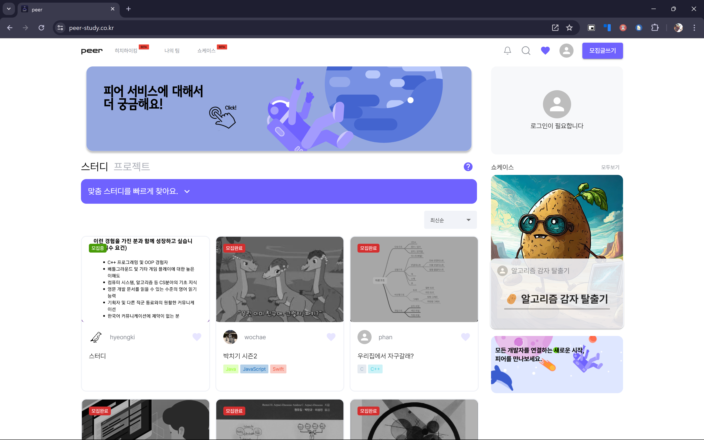

# 런칭과 찾아온...
## 1. 달성함 

peer의 긴 개발 마라톤, 2월이 되자 드디어 그 끝이 보이기 시작했다. 런칭을 위한 수준은 부족해도 기능적으로 동작 가능한 수준을 지정했고 팀원들의 맡은 바는 하루 평균 수십개의 커밋이 올라오는 것으로 우리의 열정이 대변되는 것 같이 느껴졌다.

그렇게 드디어 라는 말이 나올 때 즈음, 나에게도 검은 구름이 찾아오고 있었다. 

TMI에 200%인 이야기지만 상황을 설명해야 하니... 조금 돌아가보고자 한다. 나의 아버지는 목사님이셨다. 이미 소천하신 몸이시지만 나름 자랑스럽게 생각하는 부분은 목사를 되고 마지막까지 농촌에서 일하시면서 농촌 소멸이라는 사실을 일찍이 느끼고 선교를 하시던, 정말로 대단하신 분이셨다.

그러나 문제는 그런 이상적인 일에 생각과 삶을 바친다는 것은 너무나 당연하게도 돈과는 거리가 먼 일이었고, 그런 여파는 나에게도 몰려왔기에 그렇기에 나는 사회학, 정치학 쪽의 석사 코스를 가기를 포기할 수 밖에 없었고 돈을 벌 수 밖에 없었다. 

호주 멜버른 대학 입학 직전까지 갔다가, 귀국을 하고, 그런 뒤에 돌아온 나는 약 2년 간의 정신없는 '사회인 되기'의 시간을 거쳤고, 돈을 벌고, 잠시 휴식이 필요한 상태였던 때가 있었다. 그게 약 4년 전. 개발에 입문하기 전의 상황이었다.

집에 돌아온 나, 나에겐 문제가 없었다. 하지만 내 주변에 문제는 나를 가만히 두질 않았다. 

가장 큰 문제는 아버지께서 소천하시게 된 이래로, 교회는 전도사님이시던 어머님이 맡고 계셨지만, 어머님에게는 현재의 교회와 도움을 받던 이들을 위해 이를 확장 시킬 능력이나 성장할 여유가 없으셨다. 어머니 조차 이미 몸이 만신창이다 보니 시골 지역에서 복지관을 만들고 계속 케어를 해주려고 했던 지적 장애인, 부모의 무지로 학대를 당하던 아이들, 이런 이들에 대한 케어가 전혀 제대로 이루어지지 않고 있었던 것이다. 

아버지가 돌아가신지 3년 째가 되는 상황에서, 그들의 상황은 처참했고, 그들에 대해 아버지가 남겨 놓은 일들은 과연 어떻게 되는 것이며, 이들은 과연 사람처럼 살 수 있을까? 하는 모습이 단적으로 드러나고 있었다. 차마 다 적을 수 없지만 말이다.

그렇기에 그들을 향한 무언가 도움이 필요 했다. 그 중에도 가장 심각했던 분이 지적 장애 3급을 가진 형이 한 명 있었고, 그 분에 대해서는 정말로 심각하게 생각해봐야 하는 상황이었다. 

그의 아버님은 일찍이 돌아가신 상태였으며, 그의 어머님도 지적장애 6급 정도가 되시는 분이었다. 풀무원 공장에서 일을 했고, 정년퇴직을 하시게 된 이래로는 수입이 없는데 문제는 몸에 여러 문제가 발견 되면서 당뇨, 고혈압 등 치료가 필요한 상황이었다. 

하지만 더욱 문제는 그 아들인 그에 대한 부분이었다. 20살 이후로 지적장애에 뇌전증까지 앓게 되면서, 할수 있는 일이 아무것도 없는 상황. 하다못해 공공 기관에서 일자리를 제공해주긴 하지만, 문제는 이제 나이가 차다보니 젊은 장애인들에게 선택권이 우선적으로 제공되고, 그런 과정에서 그에게 마땅한 삶의 선택지는 없었다. 부모도 연고도 이젠 없다 시피하고, 마지막 남은 어머니마저 건강과 지적 영역의 문제는 그가 앞으로 어떤 삶을 살 수 있을지가 보였고, 그렇기에 나의 아버지가 그에게 자격증을 따게 하고 앞으로 만들 센터에서 일을 할 수 있도록 하려는 계획, 아버지가 돌아가시고 이 일을 못할 순간까지 함께 데리고 가려던 계획이었으나, 그것이 결국 정상적으로 돌아가진 못했던 것이다. 

나는 어떤 문제를 넘어, 그가 인간답게 살기를 바랬다. 아버지의 밑에서 인생의 희망을 느꼈을 그가 내 아버지의 죽음으로 다시 절망에 빠져 방안에서 벗어나지 못하는 인생을 살게 만든 다는 것은 일종의 부채 같은 느낌을 지울 수 없었다. 내가 크리스챤의 믿음으로든 아니든 말이다. 그렇기에 수학도, 언어 능력도 부족한 그를 데리고 서울로 올라왔으며 약 4년간 지금 개발자를 준비하는 학습의 과정에서 함께 데리고 있었으며, 사회인으로 삶을 조금이라도 배울 수 있기를 바랬고, 그렇게 케어를 이어 나갔다. 

피어의 완성, 그리고 그런 케어의 연속의 삶 속에서, 올해가 들어서면서 쉽지 않은 일들이 계속해서 벌어졌다. 다행이 직장을 가지게 되었던 그였지만 지적 능력 3급이라는 수준과, 부모가 장애가 있다는 현실은 그가 일반적인 사람처럼 행동할 능력과 정신력을 갖추지 못하게 만들었기에 사건 사고가 끊이질 않았다. 거기다 피어의 일까지, 이직을 앞으로 해나아가야 할 상황 속에서 무엇을 어떻게 해 나아가야 하나, 혼란스러움을 안겨줄 뿐이었다. 

그러는 와중에 피어의 수준은... 사실 생각해보면 기획 자체가 아예 작았다면 충분했을 것이었다. 하지만 피어를 이끈 핵심 리더, 그는 야심을 가진 사람이었기에 단순한 데모를 만들기 원하지 않아 했고, 그것에 부응하고자 나 역시 기획을 절대 작은 수준으로 하지 않았다. 그것이 어쩌면 화근이었을지도 모르겠다.

## 2. 부족함
런칭 퀄리티는 부족했다. 내 앞에 문제들은 내가 숨쉴 틈을 주지 못하고 있었기에 나는 결단이 필요했다. 개발의 리더이자, 전체의 그림을 그릴 수는 있었지만 운영이 가능할까? 나는 거기서 그런 직함까지 맡지 못하고, 하물며 이후에는 과연 제대로 피어를 위한 활동을 할 수 있을까 조차 불분명했다.

그렇기에 나는 1월 말, 2월 초 런칭의 코앞에 이젠 그래도 런칭 퀄리티 기준의 수준 미흡이지만 도달하려고 할 때 사람들을 모아서 이야기를 했다. 포트폴리오를 당연히 회사들은 본다. 하지만 거기서 운영의 경험이 중요하다곤 말 하지만, 사실 회사와 같은 조직의 입장에서 본다면, 적어도 최소한 수준 이상이 되는 회사라면 그저 신입 몇 명이 모여 만든 프로젝트, 정말 갈아 넣지 않는 이상 그것이 회사에서 만든 그것에 필적할 수준이 된다는 건 말이 안되는 소리다. 그렇기에 런칭을 해서 운영을 한다고 하는게 꼭 장점만 있는 것은 아니었다. 면접에서 주요 압박 포인트로 치부되기도 하며, 오히려 그렇게 판을 벌리고 책임감 없는 사람으로 인상이 박혀버리는 경우도 있을 수 있다. 그리고 그런 상황이 와서 당황하면 할 수록 면접에 약한 사람이면 약한 사람일 수록 이는 불리한 점이 될 수도 있다. 

그렇기에 나는 과감없이 현재의 상황을 이야기 했다. 우리의 수준과 상황, 앞으로 책임질 인원이 있는가에 대한 고민. 무엇보다 내가 지금까지 말했던 많은 '가치관적 컨텐츠'를 쌓아 피어라는 브랜드를 만들어야 함에 대한 이야기들. 그것이 불가능하다면 브랜드를 만드는 시도는 결국 참여한 모든 개발자들에게 영향을 줄 것임을. 하지만 현실적으로 운영이 불가능하다는 것이 꼭 나쁜것 만은 아니기에. 차라리 흐지부지 되거나 하여 엉망이 되는 것 보단 정확하게 정리하고, 이를 객관적으로 알고 있도록 만들어 오히려 상황과 현실을 적절하게 판단하는 현명한 신입이 되는 것이 훨씬 효과적이라는 이야기다. 

## 3. 운영을 위한 노력
그러나 그런 나의 이야기에도, 결과물을 만드는 것에 대한 모두의 열망은 컸다. 이는 어쩌면 당연한 것이리라. 모두는 불안할 수 있다고 생각했다. 무언가 자신감이 있거나, 이룰 수 있음을 아는 사람이 아닌 이상, 몇 달에 거쳐 만든 작품을 공개조차 하지 않는게 옳은가에 대해서 다들 생각하는 바가 있겠지. 

그렇기에 나는 그들의 말을 수긍했고, 대신 책임을 질 사람이 누군가? 에 대해 이야기를 나눴다. 결국 나온 것은 프론트엔드의 리더이기도 하고, 피어 전체를 원래 만들었던 동료가 이를 책임지겠다는 말을 했고, 그렇게 결론이 나게 되었기 때문에 런칭은 나름대로 진행하게 되었으며, 베타 런칭 이후 이를 보완하는 것으로 계획을 세우고 정식으로 런칭을 하게 된다. 

## 4. 리더의 부재
모든 이야기가 해피엔딩이라면 아마 이 세상에 행복과 불행, 성공과 실패는 그 의미를 잃어버릴 것이다. 또한 실패를 정면으로 받아들이지 않는다면, 라이트 형제가 물리 역학적으로 해석도 완벽하지 않은 비행길 띄우는데 성공하지 못했을 것이며, 증기 기관이나 대 우주시대를 열 기회 조차 얻진 못했을 것이다. 무수한 실패의 주인공들이, 그저 어느 순간 성공의 주인공으로 성장하고 변화하며, 그 위치에 도달할 가능성을 여는 것이라고 나는 생각한다. 

그렇기에 이번 피어의 마무리는 어땠는가? 라고 말하면다면 '온전한 실패' 라고 나는 자랑스럽게 말하고 싶다. 

베타 런칭 이후, 예상했던데로 일이 벌어지기 시작했다. 아니, 어쩌면 나에겐 더한 시련들이 찾아왔다. 케어해주던 형은 점점 나이가 참에 따라 지적 장애로 인해 생기는 욕구 불만, 그 속에서 정상적으로 성장하지 못한 사회적 자아로 인해 본능이 튀어나오는 행동들이 이어졌고, 이러한 사건과 사고는 계속해서 갈등을, 그리고 겨우 입사시킨 회사에서의 다소의 트러블로 나타났다.

뿐만 아니라 나의 이직을 위한 과정에서도, 내가 원하는 현실적 수준과 그 수준을 달성하기 위한 나의 실력적 차이가 여전히 명확하게 난다는 사실을 알 수 있었고, 이러한 괴리감과 또한 찾아오는 현실적인, 생활적인 부분에서의 문제점 등은 계속해서 나에게 아무것도 할 수 없는 상황을 유도해갔다. 

업데이트 해야할 것들을 할 시간은 부족했으며, peer를 할 때보다 더 바쁜 상황들이 발생되어갔다.

그러는 와중에 피어는 더욱 문제가 커져만 갔다. 사실 정확히 말하면 문제가 아닌 게 문제였다. 백엔드 개발자들 중 일부는 당연히 기존의 과제를 하러 가야만 했고, 미루어지거나 어그러졌던 일들에 부딪히면서 그런 상황을 개선해야 하니 정신이 없어 피어를 제대로 다루지도 못하고 있었다. 

프론트 엔드 개발자들의 경우 너무나 감사하게도 자신들이 아쉽다고 생각하는 것들을 계속해서 이루어 나갔다. 업데이트도 매우 느리긴 해도 어떻게든 해나가려는 것이 보였고, 그런 모습은 기특하기도, 감사하기도 한 관심이었다.

하지만 문제는 이를 이끄는 이가 아무도 없었다. 설령 일의 우선순위가 밀려 속도가 느려지더라도 모두가 가능 방향이 어딘지는 명확하게 만들 수 있도록 리딩의 책임을 질 사람이 필요했다. 

물론, 위에서 언급했듯, 책임질 사람이 있어야만 런칭을 한다고 했고 그 대상은 정해져 있었다. 그러나 그는 우선 내가 보건데 그 역시 아무것도 하지 못하고 있었다. 제대로 끌고 가는 것도 아니고, 자신의 삶에 바빠 결국 책임과 욕심 두 가지를 다 제대로 끌고 가진 못했다. 

결국 4월 말이 되어선, 내 집에 일이 있기도 했고, 온 프레미스 서버를 옮기는 작업이 필요하게 되면서 서버를 잠정 내렸었고, 그 뒤, 이를 겨우 옮겨서 서버 자체를 복구 시키는 것까지는 마무리를 짓게 된다. 

## 5. 마무리를 위한
사실 뒤에는 더 개인적인 이야기들도 많다. 다양한 일들이 있었고, 결국 결론은 서비스에 더 이상 나는 관여하지 않고, 데모 사이트의 구축만을 하는 것으로 마무리가 된 상태이다. 실제 런칭하고 운영을 하는지는  그리고 이러한 과정이 결국 누구 탓이냐 아니냐- 이런 문제로 끝나길 바라진 않는다. 애초에 원망할 것이라면 피어의 개발에 모인 모두가 처한 환경의 한계가 가장 크다. 그럼에도 다음 번에, 이러한 실수를 하지 않기 위해 나는 마지막으로 피어의 한계점을, 운영이 제대로 이우러지지 못한 이유를 설명하고 싶다. 

### 1) 철학 없는 서비스, 구분점 없는 서비스
처음 피어라는 커뮤니티가 커지게 된 데는 한 가지 큰, 핵심적인 특징이 있었다. 그것은 바로 학습을 하는 방법, 그 방법에 나름의 특색있는 룰을 만들었던 피어의 리더가 있었고, 그가 학습의 방법을 함께하는 이들에게 가르쳐주고 관리해주는 것이 있었다는 점이었다. 그렇기에 사람이 모였었고, 그런 점에서 피어는 상당히 특색있는 공간이었다. 

하지만 어느 순간 이러한 지점을 제대로 설파하거나, 모두에게 전달하고, 동료학습을 믿는 사람들을 늘려 나가야 했는데, 어느새 리더들은 이러한 동료학습 방법을 믿기보단 늘어난 사람의 숫자로, 성공할지도 모른다- 라는 식의 구조가 어느새부턴가 팽배해졌다. 개발자를 모실 때도 그랬다. 아마추어라도 사람들을 많이 모으기 위해 공고를 냈었는데, 그때 정말 많은 이들도 이런 평가가 많았다. 

> "사람이 많으니까",  "운영할 기회가 생기지 않을까", "성공 할 것 같으니까"

이러한 평가는 틀린 건 아니었다. 하지만 여기서 나는 느끼고 깨닫고 있어야했다. 이거에 우리 팀의 핵심 리더들은 다소 취해있기도 했고, 나 역시 그러했으며, 그렇기에 처음 피어가 발전하기 시작한 그 때의 모습을 잃고 있다는 사실을 말이다. 

처음 모였던 우리들의 학습 방식에 많은 이들은 놀랬었고, 학습 방식의 변화와 따라오던 이들의 성장은 일종의 '브랜드'가 되었고, 그것이 피어가 42서울이라는 개발자 커뮤니티에서 영향력을 가질 수 있던 이유인데 말이다. 

### 2) 변명하지 말자. 실력은 결국 정확하게 나타낸다
개발을 할 줄 안다. 개발은 종합 예술과도 같다. 얼마나 많은 도구들을 알고 PC의 특성을 이해하냐에 따라 개발의 속도도, 개발의 수준도 결정이 난다. 하지만 할 줄 안다는 말 한마디로 우리의 질은 부족했고, 수준도 부족했다. 

문서화를 강조해도 정착되는데 걸린 시간이 2달이 걸렸었고, SonarCloud의 적용도 내가 조금 더 열심히 찾고 달렸다면 빠르게 적용할 수 있지 않을까? 내가 설득하는 스킬이나, 기술적인 면에서 의지할 수 있게 되는게 빨랐다면 아마도 개발은 훨씬 진척이 빨랐을 것이다. 

특히나 소통하는 방식, 기획을 표현하는 방식등, 기술을 검증하고 기획하는 과정에서 상대방에게 무얼 하는지를 정확하게 알려주는 능력이 개발과 함께 부족하니 생기는 병목 현상, 내지는 소통의 속도 문제는 상대방도 개발을 해 나감에 있어 빠르지 못하게 만드는 중요한 요소가 아니었나 싶다. 

### 3) 책임의 부재, 그리고 갈등
24년 1월, 나는 어필했었다. 서비스는 결과물이고, 사용자는 절대 우리의 과정을 보는게 아니라고. 그렇기에 이벤트를 하든, 운영의 손이 지속적으로 이어져야 했으며, 거기서 할 수 있는 사람이 제대로 하지 않는다면 런칭은 오히려 폐가를 만들어내는 결과를 초래할 수 밖에 없다고, 나는 그렇게 이야기 했었다. 

만약 나라는 총괄과 함께 만든, 모두가 생각한 이 형태가 맘에 안들면 그걸 파악하고 바꿔서라도 누군가가 정확하게 끌고 나가며 살아있음을 티 내는 것. 몇 달의 시간 동안 계속적으로 필요한 물주기의 작업을 누군가가 해주길 바랬다. 

그리고 그런 점에서 이걸 끝까지 가지고 가겠다던 이가 있었기에 나는 안심할 수도 있었고, 내가 할 수 있는한 계속 해나가려고 쥐어 짜고 있던 실정이었다. 

하지만 한 달, 두 달 시간이 지나가면서 나의 생각은 점점 불만과, 이게 맞는가? 에 대한 상황으로 이어졌다. 왜냐면 기획에 대해 이해하고 바꾸거나, 아니면 새로운 신규 사람을 뽑아서 관리를 하던 무언가를 해야 하는데, 정작 아무런 변화는 없으면서 서서히 살려둔 서비스가 활동력을 잃고 가장 최악의 경우로 빠지고 있던 것이었다. 

### 좋은 도전, 좋지 못한 결과, 그러나...
더 할 수 있는 말은 있겠다. 하지만 더 이야기 한다고 해서 이 내부의 일들은 서로를 총질하는 꼴이 될 수밖에 없을 것이고, 그렇게 될 필요는 ㅇ


```toc

```
