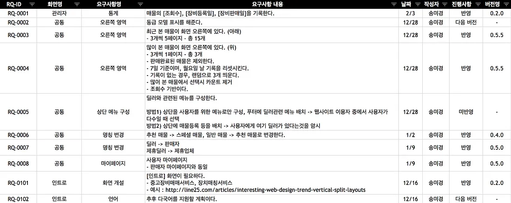
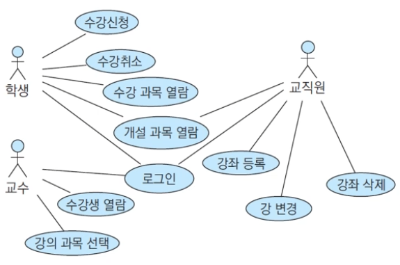
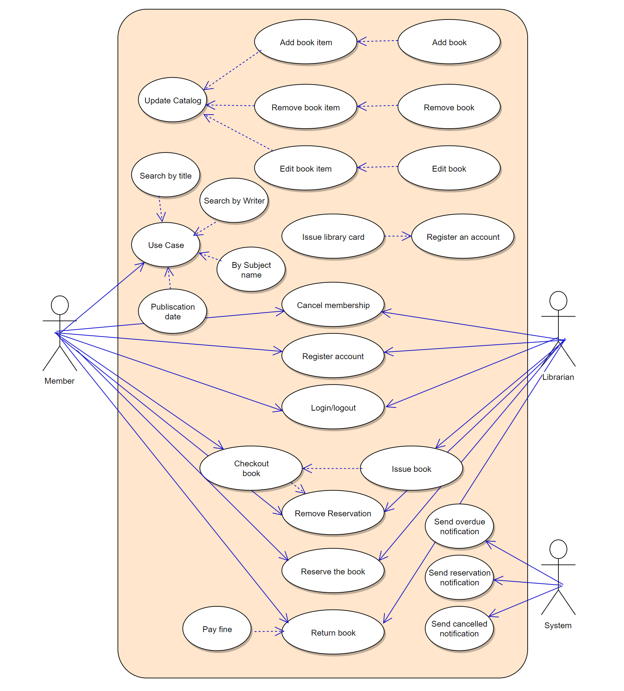

# 개요 
프로젝트의 목표, 범위, 기능을 정의하는 문서로, 프로젝트의 근간이 될 문서를 작성해야 한다. 

# 필요 문서 
1. 요구사항 명세서 : 프로젝트의 목적, 목표, 기능, 사용자 요구사항을 상세히 기술해보는 연습을 한다. 
2. 유스케이스 : 사용자와 시스템 간의 상호작용을 기술하여 기능적 요구사항을 명확히 하는 역할을 한다. 

# 요구사항 명세서를 잘 쓰기 위해...



요구사항 명세서(SRS, Software Requirements Specification)은 요구사항 정의서, 요구사항 기술서와 같은 문서로 봐도 된다. 스타트업 내부 의견을 정리하기 위해 작성하는 것이 좋다. 

## 왜 작성해야 하나? 
- 프로젝트 전체 규모를 파악
- 구현 가능 여부에 대한 논의
- 커뮤니케이션 비용 절약 
- 프로젝트 일정 계획 수립

## 요구사항 명세서의 종류
### 기능적 요구사항(Functional Requirements)
- 기능적 요구사항은 기능들을 설명한다. 

### 비기능적 요구사항(Non-Functional Requirements)
- 비기능적 요구사항은 프로젝트가 수행해야할 기능 외의 조건들에 대한 설명을 한다. 
- 비기능적 요구사항
	- 성능
	- 신뢰성
	- 가용성
	- 보안
	- 사용성

## 무엇을 기재해야 할까? 필수 요소는?
- ID
- 화면명 : 어느 화면에서 구현할 기능인지 기재한다. 화면에 속하지 않는 요구사항도 있을 수  있다. 
- 요구사항명 : 요구사항의 설명을 요약하여 기재한다. 
- 내용 : 상세 내용을 기재한다. 
- 중요도 : 내부 규정에 따라 규칙을 세운다. 
- 부서 / 작성자 : 
- 날짜 
- 진행사항(구현 여부)
- 버전명 
- 그 외 : 유형(기능, 비기능, 제약사항, 인터페이스, 기타 등), 출처(관리자 이름, 사업계획서 등)

## 좋은 요구사항 명세서가 가지고 있는 특징 
- 작업자(개발자, 디자이너 등) 가 이해하기 쉬어야 한다. 
- 무엇을 어떻게 구현되어야 하는지가 명확해야 한다. 
- 하나의 요구 사항에 여러가지 복수 요구사항을 작성하지 않는다. 
- 다른 요구 사항 모순 또는 중복 되지 않게 되어야 한다. 
- 애매한 단어를 사용하지 않고 명확하게 기재한다. 
- 꼭 필요한 요구사항인지 여부를 표시할 것 
- 용어를 사용할 때는 똑같은 기능은 똑같은 단어로 표현해야 혼동이 없어진다. 
- 난이도가 있는 기능이거나, 프로젝트 기간 내에 해결이 어렵다면 대체 가능한 다른 방법을 함께 기재한다. 
- 원칙으로 지정되어 있는 경우도 있다. 
	- 명확성
	- 일관성
	- 관전성
	- 검증가능성 

## 참고자료 
[요구사항 명세서](https://mklab-co.medium.com/%EC%9E%91%EC%84%B1%EB%B2%95-%EC%9A%94%EA%B5%AC%EC%82%AC%ED%95%AD-%EB%AA%85%EC%84%B8%EC%84%9C-requirements-specification-ad3533d6d5b8)
[소프트웨어 개발 요구사항 명세서 작성 방법](https://devinventory.tistory.com/20)
# 유스케이스 관련 정리 
- 요구사항을 사용자 중심 시나리오 분석을 통해 흐름을 나타내는 것 
- 시스템의 동작을 모형화 하는 것 
	- 시스템 사용의 사례로서 시스템의 사례들을 그려 놓은 것 
	- 시스템의 외부에서 본 기능을 명확하게 정리해나가는 방법 : 
		- 내부 과정은 구현에서 고려되는 사항 
	- 개발자와 사용자와의 상호 작용을 표시하는 것 
	- 목적은 시스템의 기능을 정의하는 것
## 유스케이스의 용도와 한계
- 도메인 분석과 모델링 사이의 관문
	- 도메인 분석 : 시스템 전반적인 환경을 말하고 실제로 그 환경이 어떻게 동작할 것인가를 모델링 
- 유스케이스가 중요한 이유는 모델링과 도메인 분석의 설계를 제공하는 빌딩 역할 
- 도메인 분석의 결과를 액터, 유스케이스, 관계들로 구성된 시스템 명세로 매핑하는 작업 
- 시스템의 사용자에게 서비스를 제공하기 위한 상호작용의 단위 
- 사용자 또는 외부 시스템이나 기타 요소들이 시스템과 상호작용하는 다이얼로그를 모델링

## 유스케이스 구축 시 주의사항 
- 시스템 내부를 모델링하는 것이 아님
- 비 기능적 요구를 찾아내는데 효과적인 방법은 아님 
- 시스템의 흐름도가 아님
- 단계적 분할이 아님
- `어떻게` 가 아니라 `무엇을` 시스템이 하는 가를 담는 것 이 핵심이다. 

## 유스케이스 모델링
- 사용자 중심 요구사항 모델링 : 
	- 작업 중심적 : 다이어그램으로 요구사항을 작업 단위로 분류하여 보여준다. 
- 유스케이스는 각각 독립적 
	- 단순한 유스케이스 나열 : 전체적인 시스템 요구사항 이해가 어려울 수 있다. 
	- 비기능적인 요구사항은 표현이 어렵다. 
- 표준 그래픽 표기 
	- 똑같은, 약속된 형태를 통해 각 작업자들 사이의 해석의 리스크를 줄이고, 커뮤니케이션을 개선한다. 

### 유스케이스 다이어그램 
- 시스템의 기능을 나타내기 위해 요구를 추출하고 분석하는데 사용 
- 구성 
	- 유스케이스 - 기능 
	- 액터 - 시스템과 상호작용 하는 것 
	- 액터와 유스케이스를 정하는 것은 시스템의 범위를 정하는것

### 유스케이스의 기호 
- 내용은 링크를 참조할 것 
- [UML 유스 케이스 다이어그램: 정의, 응용 및 예시](https://gitmind.com/kr/use-case-diagram.html)
- [`(UML)`유스케이스 다이어그램](https://googry.tistory.com/2)



## 참고자료 
- [SW이론 유스케이스](https://velog.io/@kansun12/SW%EC%9D%B4%EB%A1%A0-%EC%9C%A0%EC%8A%A4%EC%BC%80%EC%9D%B4%EC%8A%A4)
- [게시판 만들기(2) - 유스케이스 정의서](https://moongom.tistory.com/entry/Spring-%EA%B2%8C%EC%8B%9C%ED%8C%90-%EB%A7%8C%EB%93%A4%EA%B8%B02-%EC%9C%A0%EC%8A%A4%EC%BC%80%EC%9D%B4%EC%8A%A4-%EC%A0%95%EC%9D%98%EC%84%9C)
- [유스케이스 웹 하드 구조도 usercase 명세서, 다이어그램](https://blog.naver.com/tlsdlf5/120115830517)
- [(UML)유스케이스 다이어그램 - Usercase Diagram](https://googry.tistory.com/2)

---
# 그래서 계획은?
1. 요구사항 명세서를 작성을 시작으로 해야할 내용들을 체계적으로 정리 해야 한다. 그리고 그렇게함과 동시에 작업이 들어가야 하니, 너무 느리게 시작할 수는 없을 것이다.
2. usecase를 굳이 해야할까? 하는 생각이 들었지만, 작업을 해주는 것으로 나름대로 내가 놓친 부분이 있는지를 볼 수 있으리라 생각이 든다. 
3. 포인트는 해당하는 내용이 그대로 담겨 있어야 하고, 작업하는 과정에서도 볼 수 있도록 꾸준하게 올리고, 보일만한 공간에서 작업을 해야 한다는 점이다. 
	1. 따라서 우선은 깃헙 블로그에 올릴 수 있도록 작업은 옵시디언으로 진행 및 작업 사항을 기재할 수 있도록 한다. 
	3. 표, 그림 등이 살짝 문제가 있긴 한데 테스트 해봄으로써 iframe으로 구글 문서로 만든 것을 최대한 공유하는 식으로 구현해보자.
	4. 이때 핵심은 내 개인 Obsidian에서 작업을 마무리 시켰고, 구글 스프레드에서 완성이 되었을 때 비로소 글로 올릴 것. 
```toc

```
