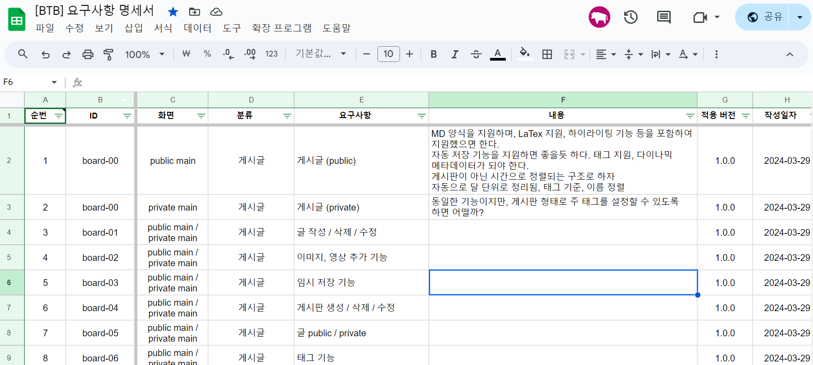
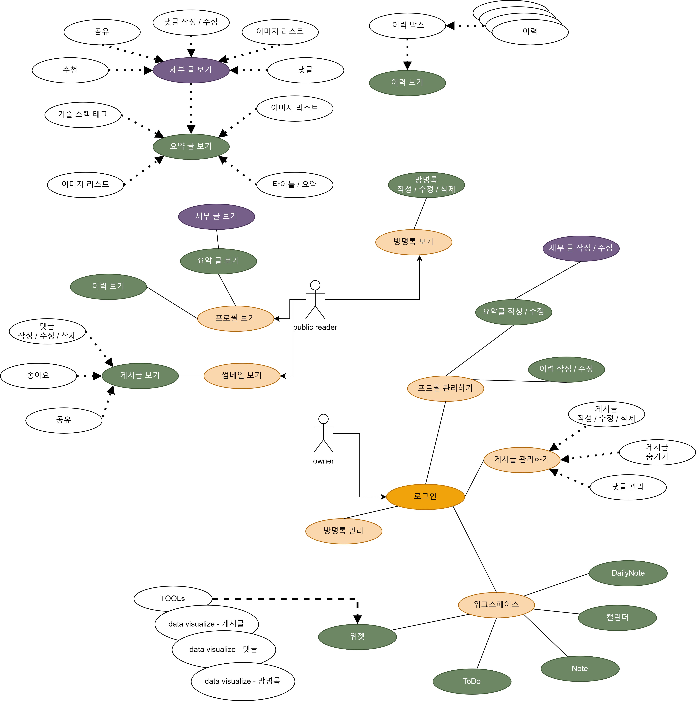
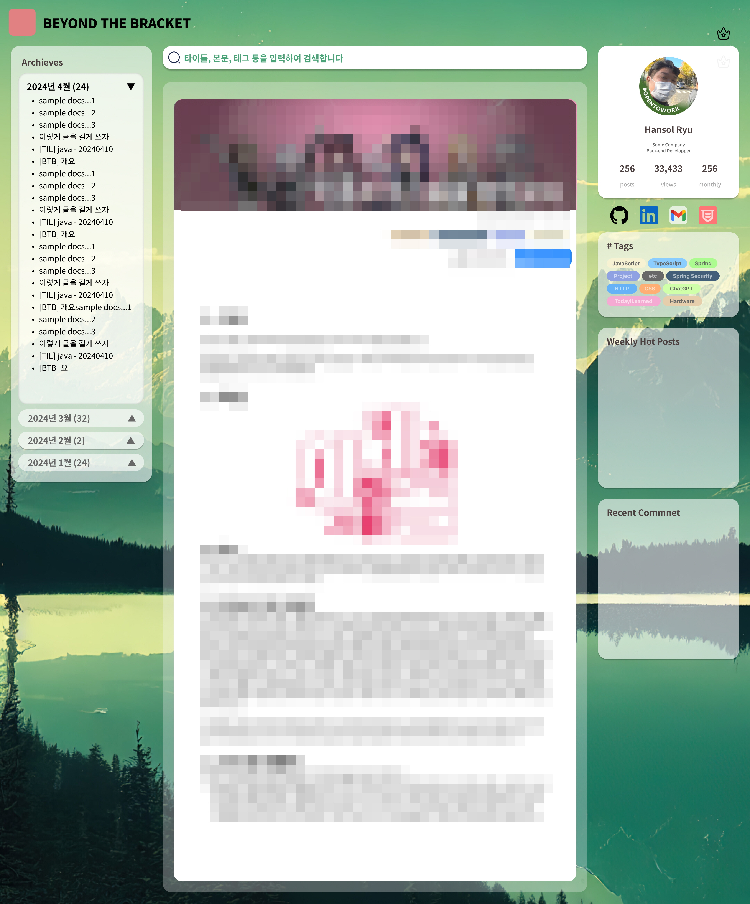

# BTB Project 
이번에 혼자 진행하는 해당 프로젝트는, 일종의 마지막 정리에 가까운 프로젝트이다. 이 프로젝트에 대한 내용 정리를 위한 글로써 지속적으로 업데이트를 해볼 예정이다. 

## "Beyond The Bracket" 

우리는 개발을 하면서 여러 상황에 놓인다. 어려운 일들, 힘든 일들, 과연 내가 가능할까? 하는 생각들은 불안과 공포, 체념을 야기하게 된다. 그리고 그건 마치 우리가 치는 코드의 꺽쇠와 비슷한 느낌을 주곤 한다. 

컴퓨터의 어떤 프로그래밍 언어도 꺽쇠(Edge Bracket)를 사용한다. 꽤 특이한 친구들이 있긴 하지만 대부분의 C 기반인 경우 `{}` 를 통해 범위`scope`를 정하며 그 범위는 소위 어렵게 말하면 stack frame의 역할을 하기에 벗어나면 segmentation fault를 발생 시키고 만다. 

컴퓨터 입장에서 이러한 룰을 정한 것은 어쩌면 CS적 의도이므로, 이게 꼭 나쁜건 아닐 수 있다. 하지만 결국 그 한계를 정해 놓고 나니 생기는 불편함,  그리고 그런 범위를 넘어서는 무언가가 필요할 수 있다는 점을 떠올렸고 그것이 바로 이번 프로젝트의 명칭 그대로 Beyond The Bracket 이다. 

42서울에서의 2년, 버티고 버텨 여기까지 온 나의 수준은 물론 꽤나 쓸만한 개발자가 되는 것은 가능했지만, 과연 이것으로 충분할까? 어쩌면 하나의 코드 블럭 수준을 벗어나지 못 한 게 아닐까? 그리고 그런 한계가 지금 내가 peer 프로젝트에서 얻은 것들 수준이 아닐까? 이런 생각을 했다.

왜냐하면 peer는 정말 좋은 기회임과 동시에 내 부족을 보여주는 거울이었기 때문이다. 10명이 넘는 팀원들을 데리고 목표로 간다는 경험은 어지간히 해보지 못할 정말 좋은 기회였으며, 부족한 상황을 채워나가며 위에서 말하듯 한계라고 생각하는 순간이 왔음에도 결국 도달하여 구현해낸 부분들은 단순히 '스펙'이라고 이야기하는 것보다 더 큰 의미가 있는 기술과 경험을 나에게 제공해주었다. 

하지만 부족하다. 여전히 문서화는 엉망이었으며, 개발된 기술의 구조는 부족하다. 뭔가 열심히 하긴 했으나 그 안에 들어있는 많은 것들이 '부족해' 라고 나에게 말해주는 것 같았으며 순진하다고 하면 순진한 구조라는 것을 알 수 있었다. 이건 부족하다고 내 마음 속도, 현실도 말하고 있었다. 특히 지금까지 처럼 포화된 개발자 환경에서 결국 살아남는 사람이라는 건 결국 '진국', 내지는 
'진짜' 가 되어야 할 것이다.

자바를 더 많이 배워야 하고, 정말 복잡한 추상적 개념들이 아직 산재해 있으며 이걸 내 몸처럼 다루고 싶다. 웹 서비스를 구축하는데 필요한 내용들을 반만 배웠는데 과연 이걸로 되겠는가? 성능도, 시스템도, 분산처리도 결국 내 부족함을 넘어서서 범위를 뛰어넘어 꽤 그럴싸한 인사이트를 얻고 싶다. 그게 로 이 프로젝트를 생각해낸 가장 큰 이유였다. 범위를 벗어난다. 나는 현실에서 강하지 않지만 그러니까 하나하나 채워가는 것. 내 한계의 범위를 벗어나고 싶은 것이다.

요즘 ChatGPT와 같은 모델을 보며 꽤나 많은 이들이 두려워한다. 하지만 개발자적 관점에서 본다면 여전히 웃긴 이야기이다. 인공지능이 현재 정말 어마무시하게 사람을 모사할 수 있다지만, 결국 그 인공지능을 감싼 인터페이스는 사람이 만들고, 그것은 자의식이 아닌 확률과 통계의 결과물이다. 결국 컴퓨터 안에 엄청난 사람들이 있다고 한들 그들의 꺽쇠에 갇혀 있는 존재 일 뿐이다. 하지만 나는 그런 존재인가? 아니지 않겠는가. 그러니 그걸 넘어서(Beyond) 나다운 누군가로, 능력을 가진 사람으로 살고 싶은 것이다. 

## 목적 
사실 이전에 이미 글을 한 번 작성했지만, 좀 더 깔끔하게 정리해보면 다음과 같다. 

> "제대로 웹 개발의 A to Z 를 이해하는 개발자가 되어보자."

웹 개발의 가장 큰 어려움은 소통이라는 경우를 종종 들었다. 이유는 간단하다. 디자인도, 프론트엔드 개발이나 백엔드 개발, 이러한 영역들이 상당히 거리감이 있지만 동시에 전체적으로 이해 해야 구현도, 구조도 전체적으로 그릴 수가 있으나, 이렇게 까지 되는 인재가 되는 것은 쉽지 않다는 것이다. 

특히 웹 서비스라고 하는 것이 가지는 특성 만큼, 대용량 설계, 스케일링, 분산처리 등과 같은 단순한 프로그래밍의 영역을 넘어서는 외적인 요소들에 대한 이해도도 필요한데, 그런 것들을 배우는 것은 어쩌면 더 대단한 기술과 더 대단한 도전을 가능케 하는 시작점이라고 생각했다. 

그러므로, 이번 프로젝트는 일부러 혼자서 모든 것을 다 해보려고 한다. 사실 생각 만하면 위가 쓰리다. 해야 할 양은 많고, 4개월 정도 남은 시간 내에 가능할 것인가? 이것은 잘 모르겠다. 하지만 벽은 넘어야 제맛 아니겠는가?

## 목표 

### Back-end 에서 DevOps까지
- peer에서 경험한 Git Hub 의 Actions를 활용한 CICD 자동화
- 구현 가능한 구조를 '상상'에 의지해 구현했던 비즈니스 로직
-  DB의 특성이나 속성을 고민하지 않은 DB 구조의 한계

내가 peer 동료들의 힘으로 백엔드 개발을 통해 얻었던 것들의 큰 결실들이다. 다소 부정적으로 표현하긴 했지만 백엔드 팀원들과 얻어낸 값진 것이었으며, 이것이 있었기에 지금의 이력서도 나올 수 있었다고 생각한다. 

하지만 백엔드 개발자, 시스템을 구축해보겠다는 말을 하기에는 부족함이 너무 많다는 게 내 생각이다. 웹 서비스를 런칭 해보니 알 수 있던 점이 다음과 같다. 

1. 웹 서비스를 제대로 한다면 어중간한 생각으로 하다 간 비용에 두 번 죽는다. 
2. 서비스의 성장을 위해선 성능 모니터링이 제대로 되지 않으면 안된다. 
3. 서비스의 성장을 위해선 멈춤을 이용자에게 경험 시키면 안된다. 
4. 서비스의 개선이나, 제대로 개선해나가려면 지금보다도 훨씬 체계적인 문서 관리, 그 안의 로직과 관련된 내용에 대한 기록이 있어야 한다. 없다면 개선은 어렵다. 
5. 백엔드 개발자로 인정받기 위해서는 시스템에 대한 이해, 자원에 대한 이해도가 결국 실력의 척도가 될 것이다. 보는 눈이 없다면, 비효율적인 찍어내기만 할 줄 알면 그걸론 전문가라고 취급 받기 어렵다.

이러한 점들은 peer가 성장하지 못하는 현 상황에 대한 고해성사 이기도 하지만, 동시에 정리하고 진행하던 나의 한계를 의미하는 것이기도 하다. 따라서 나는 이러한 부족함을 개선하기 위한 경험과 배움을 이번 프로젝트에서 이뤄내고 싶다는 게 내 목표이다. 

1. 객체 지향 언어이자 MVC 패턴을 기반으로 하는 스프링 부트의 서버 구조를 보다 정확하게 이해하고, 보다 최적화된, 보다 SOLID 원칙에 철저하게 준수한 구조의 서버 프로그램을 구축해보자. 
2. 아직 확실하게 익히지 못한 AOP, annotation 등의 기술을 활용하여 비즈니스 로직의 수직적 최적화와 수평적 최적화를 달성해보자. 
3. 아쉽다고 생각했던 무중단 배포,  auto-scaling, 분산 처리와 같은 백엔드의 꽃들을 제대로 배워보고, 이를 적용 시켜 어느 web 클라우드 프로바이저 서비스에서도 잘 동작할 수 있는 kubernetes 환경을 구축해보자.
4. DB의 특성을 고려하며, 최대한 나의 서비스에 최적화된 DB 설계를 구현해보자.

### Front-End 를 이해해보자 
예전에 최초로 학습했던 프로그래밍 언어는 HTML, CSS를 거쳐 JavaScript일 만큼 나는 나름대로 프론트엔드에 대한 생각이나, 애정이 있다. 특히나 전혀 이해는 안되도 어떻게든 기술 블로그를 구현하고 깃 블로그로 올렸던 것도, 결국 나를 보여주고 드러내고 하는 도구들을 잘 이해하는 것은 필수라고 생각하는 내 지론에서부터 시작된 관심이 아닐 수 없다. 

그렇기에 peer 이전에서 프론트엔드의 기술이나 형태를 어설프게나마 이해하고 있었으며, 디자인에 대한 관심과 맞물려서 peer 프로젝트를 진행할 때는 나름대로 두 개를 잊고, 백엔드 개발자 팀과 프론트엔드 개발자 팀을 이어주는 가교 역할을 했었다. 

하지만 개발을 마치고, 네이버 코테를 집어 넣은 뒤, 일차적으로 회사들에 도전해본 이후 얻은 많은 데이터들을 통해 알 수 있던 부분은 현실적으로 어렵니 안 어렵니 하는 문제를 넘어서서 백엔드가 프론트엔드를 이해하고 있다는 점은 엄청난 이점이 있다는 게 핵심이었다. 

기획을 구현 해본다 던지, 데이터를 구조로 머릿속으로 시스템을 상상하는 것은 백엔드의 소양이라고 생각한다. 그리고 그렇게 만들어보면 생각 이상을 잘 만들 수 있을 뿐 아니라, 나에게 그런 재능이 있기 때문에 peer에서 나름의 역할을 했다고 생각한다. 

하지만 문제는 그런 소양과 재능이 있다고 해도, 결국 구현하는 입장, 겉의 모습과 클라이언트 사이드에서 이를 구현 해야 하는 쪽은 별개의 문제를 갖고 있다. 그리고 그걸 이해할 수 없는 상황에서는 백엔드가 아무리 잘 구현이 되도, 아무리 구현이 가능하다고 이야기해도 프론트에서 '안된다' 한 마디로 끝나고 마는 경우가 있었다. 그리고 이러한 부분이야말로 백엔드와 프론트엔드가 갈등이 발생하는 꼴이 아니겠는가?

이러한 점들을 깨닫게 되었기에, 그리고 도구에 대한 자신감과 확신이 있기에 프론트 엔드에 대한 이해도를 높이기 위해 직접 구현해보고자 한다. 

1. React 를 배우는 것으로 백엔드와 통신하는 간단한 웹 애플리케이션 구현을 해본다. 
2. 기획에서 디자인을 하고, 진행한 디자인을 통해 다시 프론트를 구현해보는 경험을 통해 프론트엔드의 로직과 문법을 다소 나마 이해해본다.
3. 단순히 객체 지향의 언어가 아닌 노드 구조의 언어와 브라우저 환경에 대한 이해도를 높일 수 있는 기회를 얻음으로써, 클라이언트 사이드, 브라우저 환경이라는 것도 이해해보자. 

### 구현할 대상은?
나는 위의 내용들을 정리하면서 무엇을 만들어봐야 이러한 내용들을 담으면서도, 구현의 복잡성은 적절히 조절 할 수 있을지를 생각해보았다. 혼자 하는 만큼 앵간한 실력과 학습이 필수이고, 거침없이 나아가야 하지만 동시에 양을 조절하지 못한다면 목표로 생각하는 달까지 마무리를 짓기엔 어려울 수 있다. 

따라서 그런 내용들의 결론으로, 나를 알릴 수 있는 기술 블로그를 온전히 내 힘으로 구현해보기로 가닥을 잡게 되었다. 거기다 생각해보면 단순한 블로그 수준이 아니라, 현재 사용하고 있는 옵시디언이나 노션 등을 보면서 다 좋지만 내가 만든 것이 아니기 때문에 가지는 너무나 당연한 '완벽한 핏' 과는 거리가 먼 기능들 때문에 골머리를 앓고 있었다. 글을 쓰고 나를 관리하는 도구로 언제나 어디서든 사용 가능한 공간이 있었으면 했지만 노션도, 옵시디언도 사실 완벽한 도구는 아닌 상황이다. 그렇기에 나는 두 가지 핵심 기준을 세우고 구현해보고자 한다. 

1. (public side) 개발자로써 나의 과정과 나의 노력을 보여줄 만한 괜찮은 디자인의 기술 블로그를 구현해낸다. 
2. (private side) 내가 어디서든 내가 원하는 기능들을 갖고 있는, 웹 노팅 애플리케이션을 구현한다. 

### 결론 : 한 번 다 도전해보자 
다행이도 아직 생활을 버틸 시간은 확보되어 있고, 빠른 취업도 중요하지만 '질적인' 취업이 현재 너무 중요한 상황이다. 뿐만 아니라 네이버와 넥슨 백엔드를 지원해둔 것이 있고 아마도 예상하길 4월 중순 ~ 말이 되면 결과가 나올 것이다. 그렇다면 지금부터 준비하고 달릴 수 있도록 하여, 올해 중반까지를 목표로 삼고 싶다. 기존의 글들을 전부 이관할 수 있으면서도 위에서 언급한 핵심 구현사항들을 정리한

## 최종 구현 아키텍쳐(차후 수정 예정)
아키텍처를 위한 그림은 향후 그릴 예정이다. 
1. spring boot 와 mySQL을 활용한 웹 게시판 기능 구현 
2. FIDO2 와 같은 최신 규격의 인증 기술을 적용하여, public side와 private side를 구분한 웹 서비스 구현
3. kubernetes 를 활용한 auto scaling, load balancing 의 도입 구현
4. 무중단 배포가 가능한 서비스 형태를 구축하여 프론트엔드, 백엔드 개발과 CICD에 불편함이 없도록 구현해본다. 
5. React 와 몇 가지 추가 도구들을 활용하여 Data의 Visualize를 도전해본다. 
6. React 와 몇 가지 추가 도구들을 활용하여 위젯, Dashboard, Todo, DailyNote, Private note 등의 기능을 구현하여 웹 애플리케이션으로써 향후에 도움이 될 수 있는 도구를 구현해본다. 

## 개발 일지 
- 본 내용은 어디까지나 기록을 위한 도구로, 향후 글 작성을 위한 자료 중 하나라고 보면 좋을 것 같다. 
- [요구 사항 명세서](https://docs.google.com/spreadsheets/d/1T2iwXEqukhSusb_01EXUGu7xegHQzkSTNKAsb5mLrkA/edit?usp=sharing) : 2024-03-25 ~ 2024-03-28 (완성) 
	- 핵심적으로 들어갈 기능들 확정, 이후 유스케이스 및 디자인 작업에 사용될 기반. 코드 발급까지 마무리 
- 유스케이스 : 2024-03-25 ~  2024-03-28 (완성) 
	- draw.io를 활용하여 UML 방식으로 이용자에 따른 사용성을 정리함. 
	- usecase 이미지 
- 디자인 시안 작업 : 2024-03-25 ~ 2024-04-07
	- Figma를 활용한 프로토타입 완성 완료. 일부 기능적으로 구현 기간등을 고려하여 일부 삭제
	- [Figma 링크](https://www.figma.com/file/EjkNbY2IImVEd0w85wHAkG/BTB-Project?type=design&node-id=0%3A1&mode=design&t=J9weT4p0g06KFZGI-1)
	- 프로토타입 스크린샷
- 아키텍처 설계 문서 : 
- 데이터베이스 설계문서 : 
- API 문서 : 
- 개발 가이드 라인 :
- 테스트 케이스 : 
- 버그 리포팅 : 
- 베포 가이드 : 
- 릴리즈 노트 :
- 유지 보수 로그 : 

```toc

```
