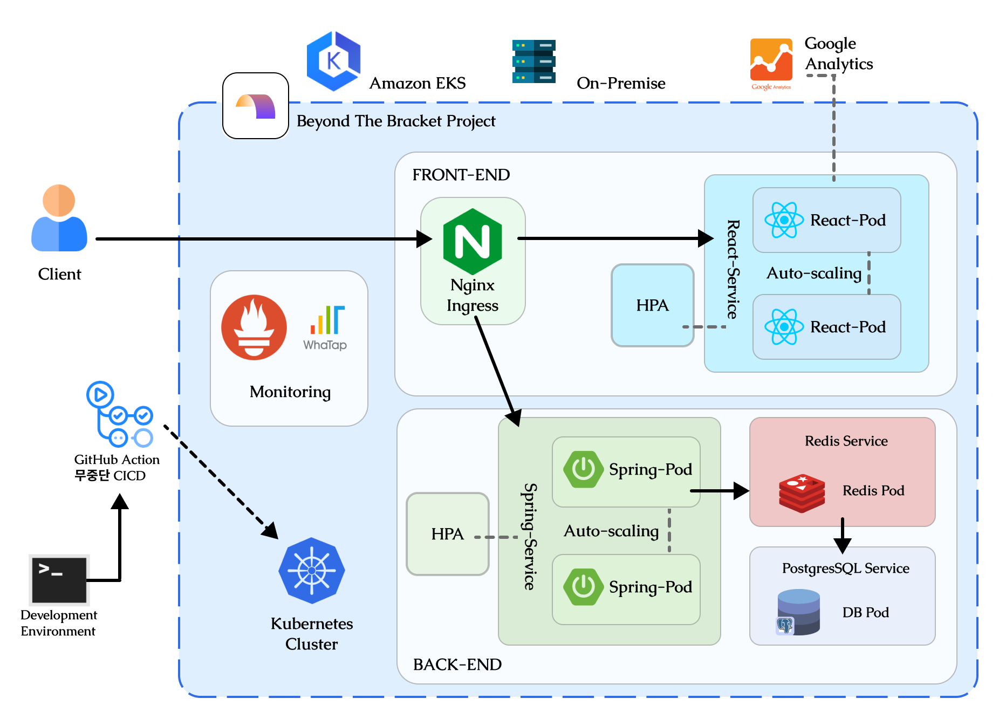

# 아키텍처 설계문서


## 전체 아키텍처

영겁의 시간을 거쳐, 여러 이슈들을 파악했다. 무엇보다 핵심은 Docker, Kubernetes를 적용 시키는 것이 가능하도록 만들 수 있는가? 에 대한 문제를 내가 이해하고 짜는 것을 목표로 삼았다. 그렇게 기본적인 각 요소들이 어떤 식으로 연결되어야 할지, 그 구조가 이제는 좀 명확해진 것으로 보여지고 이를 문서로 정리하고자 한다.

## 핵심 기능 
본 구조의 핵심은 아래와 같다. 
1. `설치 자동화` : Kubernetes를 활용하여 어떠한 클라우드 프로바이저, 로컬에서도 동작 가능한 설계, 세팅이 자동으로 설정되도록 만든다. 
2. `Auto-Scaling` : 기본적으로 Auto Scaling 은 HPA(Horizontal Pod Autoscaler)에서 제공해주는 기능으로 애플리케이션의 부하에 따라 자동으로 Pod의 수를 조절해주는 역할을 한다. 이를 통해 가용성의 극대화와 리소스 사용을 최적화해준다. 
	-  기본적인 전략
		- React 서버의 경우 SSR 을 지원하지 않고 기본적인 정적인 데이터들의 전달만을 담당하기 때문에 최대 스케일업은 1 Pod ~ 2Pod 가지로 한다. 
		- Spring 서버의 경우 연산량과 리소스 사용량이 많은 만큼, 최대 4 Pod 까지 늘어날 수 있게 하되, CPU 연산량과 메모리 사용량의 기준 조건을 높게 둔다. (단, 사용량의 양 측정 후, 리액트와 동일한 수준의 Pod Replica로 둘수도 있다.)
		- 스케일링 전략은 가능하면 느리게 늘어날 수 있도록 매트릭을 조정하며, 가능한한 무분별한 스케일링은 방지한다. 이에 대한 기준이 될 만한 테스트를 고려해보고, 테스트 기준을 근거로 메트릭스 설정을 지향한다.
3. `NGINX Ingress`를 활용한 `서비스 라우팅과 모니터링 시스템의 결합` :
	- 서비스와 같은 Kubenetes 리소스를 활용할 수도 있으나, 다양한 프로토콜 지원, 로드 밸런스, 가상 호스팅을 특화 하는 리소스이다. 
	- 외부와의 연결, 로드 밸런싱도 서비스 객체를 통해 가능한 기술이지만, 최적화되어 있기 해당 방식을 사용한다. 
	- 특히나, 이를 활용하여 Prometheus 와 같은 모니터링 도구와 통합을 통해 요청에 대해 모니터링, 메트릭 수집 및 시각화를 시켜볼 수 있다. 
4. Github Action과 Kubernetes 기능을 활용해 구현하는 `무중단 배포 기능`
	- Github 의 Action 시스템을 활용하여, 각각의 레포지터리들을 관리하고, 관리되는 기능들의 공식 릴리즈가 업데이트가 되면, 자동적으로 이를 Action을 활용하여 인식시킨다. 
	- Kubernetes의 리소스 Pod들은 그 특성상 새로운 버전 업이 이루어지도록 요청을 받아도, 완벽하게 처리되기 전까진 기존 이미지 버전의 Pod를 유지하고, 버전 업에 따른 변화가 완벽하게 적응되기 전까지 기존 서비스를 제공하는 고가용성을 제공한다. 
	- 이러한 점 때문에 Git Action과 Kubernetes의 조합을 통한 무중단 배포를 구현하며, 전략적으로는 가장 기본적인 블루-그린 배포 구조로 구현해낸다. 
5. `Google Analytics`
	- Google Analytics 는 웹 사이트와 앱의 사용자 행동, 트래픽 소스, 페이지 뷰, 세션 지속 시간, 전환율 등 다양한 데이터 수집 분석용 도구다.
	- 해당 도구를 통해 방문자들의 행동을 이해하고, 웹 사이트 성능 향상을 위한 인사이트를 얻을 수 있다. 
	- 작동은 기본적으로 자바스크립트 추적 코드를 포함시킴으로 데이터를 수집하고 처리하여 전달해주는데, React 애플리케이션에도 동작하므로, React 컴포넌트 내에서 페이지 뷰와 이벤트를 추적하도록 설정해야 한다. 
	- 또한 react Router 와 연동하여 페이지 전환 시 자동으로 추적 코드를 호출하거나 수동으로 특정 이벤트를 추적할 수 있어서, 기본적으로 `react-ga` 라이브러리를 통해 통합 설정을 진행한다. 
## 각 부분 별 설명 
1. Client : 클라이언트의 요청은 Nginx Ingress를 통해 접근 되며, 최초 접근이 되면 당연히 React application 쪽으로 요청이 전달되어 정적 데이터들을 제공받는다. 
2. Nginx Ingress : Nginx와 추가적인 기능을 제공하는 kubernetes resource 다. 모니터링 통합과 로드 밸런싱을 담당하며, HTTPS 암호화의 기능을 수행한다. 
3. HPA(프론트, 백) : Horizontal Pod Autoscaler로 기본적으로 Pod들의 모니터링을 담당하며, 시스템 부하를 모니터링한다. 이를 통해 지정된 조건에 맞춰 스케일링이 이루어지며, 리액트는 최대 2개 Replica, 스프링은 최대 3개 Replica를 구현해볼 계획이다.
4. Front Service : Front-end 의 외부 접속을 담당한다. 
5. Back Service : Back-end 의 외부 접속을 담당한다.
6. Front Deployment : 실질적인 애플리케이션 리소스
7. Back Deployment : 실질적인 애플리케이션 리소스
8. Redis Service : Redis 외부 접속을 담당한다.
9. Redis Deployment : Redis 애플리케이션 리소스
10. PostgreSQL Service : DB 외부 접속을 담당한다. 
11. PostgresSQL Deployment : DB 애플리케이션 리소스. 기존의 SQLite 는 Kubernetes와 성격적으로 맞지 않으며, Full Search Text 기능을 활용하기 위하여 PostgresSQL을 사용하기로 변경함.

## 전체 재원을 위한 하드웨어 리소스 명세 
### 기본, Local
구현을 위한 하드웨어 리소스 사용량에 대한 명세를 추정한다. 이는 최소의 추정치인 만큼 향후 더 커질 수 있다. 
1. React Pod : 128 ~ 512MB, 최대 2개(1GB)
2. Spring Pod : 512mb ~ 2GB, 최대 3개(6GB)
3. Redis Pod : 512mb ~ 2GB
4. PostgreSQL Pod : 1GB ~ 4GB 
5. Nginx Ingress : 256mb ~ 512mb
6. 기타 오버헤드 : 1GB ~ 2GB

=> 최소 3.384GB, 최대 11GB(호스트 OS 재원 제외)
따라서 이러한 상황에서 내릴 수 있는 결론은 다음과 같다. 
1. Linux OS 기반의 device로 가상화 오버헤드를 최소화 한다고 하더라도 RAM 16GB 이상의 서버가 필요 
2. CPU 재원은 따로 고려하지 않았으나, 정상적인 성능을 위한 최소 재원으로 볼 때, DB, Redis, Spring 의 경우가 많이 필요할 수 있고, 오버헤드를 고려한다면 추산치 5.4 vCPU가 필요할 수 있다(최소). 따라서 해당 현재 내가 가진 하드웨어 리소스 기준 4코어의 N100 CPU 탑재 제품과 i5 6세대 서버 PC를 풀로 써야 최소보다 살짝 나은 수준의 기본 구동 성능은 확보할 것으로 예상된다.
3. 그러나 쿠버네티스에서 사용할 무중단 배포 기능, 여러가지 시스템 자원 사용 양등을 고려한다면 저전력 기반의<mark style="background: #FFB86CA6;"> Ryzen 5세대 8코어 16스레드, 6코어 12스레드 정도의 제품에 32GB 메모리를 탑재한 정도의 성능이라면 아이들 24~25와트, 풀로드 최대 60와트 급으로 권장사양 정도의 성능을 낼 것으로 추정된다.</mark>

### EKS
#### 인스턴스 구성 최소치 
1. 필요한 리소스 요약 
	- RAM : 약 8GB
	- vCPU : 약 8v CPU 
	- 대략 인스턴스 타입은 범용 인스턴스 m5.large 정도가 필요 
2. 실질 클러스터 구성 
	- 4개의 m5.large 인스턴스(각 2v CPU, 8GB RAM 제공)
	- 총합 8v CPU, 32GB RAM
#### 비용 추산 
1. 인스턴스 비용 
	- m5.large -> $0.096 per hour
	- 한달 : `$0.096 * 24 hours * 30 days ≈ $69.12 per 인스턴스`
	- 총 비용 : 4개 인스턴스 기준 = `$69.12 * 4 ≈ $276.48`
2. 추가 비용 
	- EKS 관리 비용 : $0.10 per hour per cluster
		- 월가 : `$0.10 * 24 hours * 30 days ≈ $72`
	- EBS(Elastic Block Store) 비용 
		- 월간 비용 : `30GB * 4 인스턴스 * $0.10 ≈ $12`
3. 총 월간 비용 
	- 인스턴스 비용 : 약 $277 
	- EKS 관리 비용 : 약 $72 
	- EBS 스토리지 비용 : 약 $12
	- 총 월 비용 : 약 $361(24.5.21 기준 약 49만원)


```toc

```
