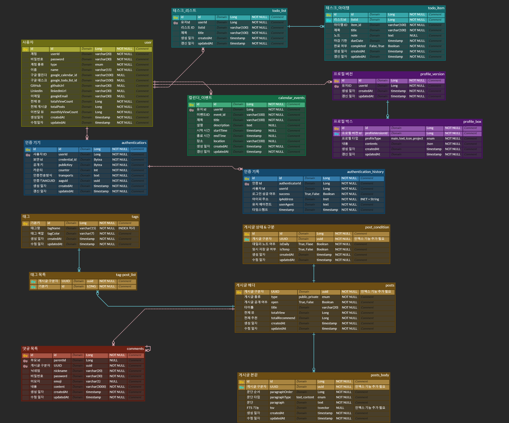
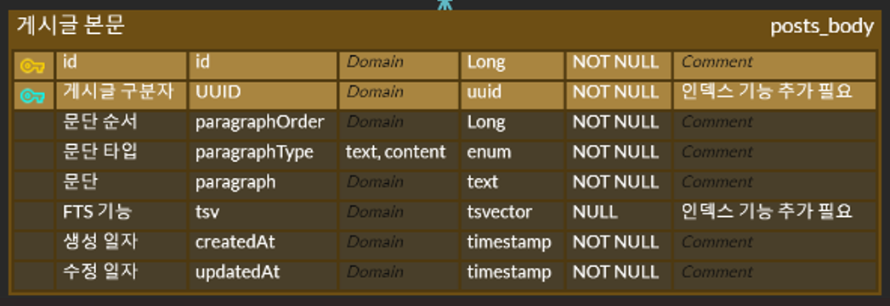
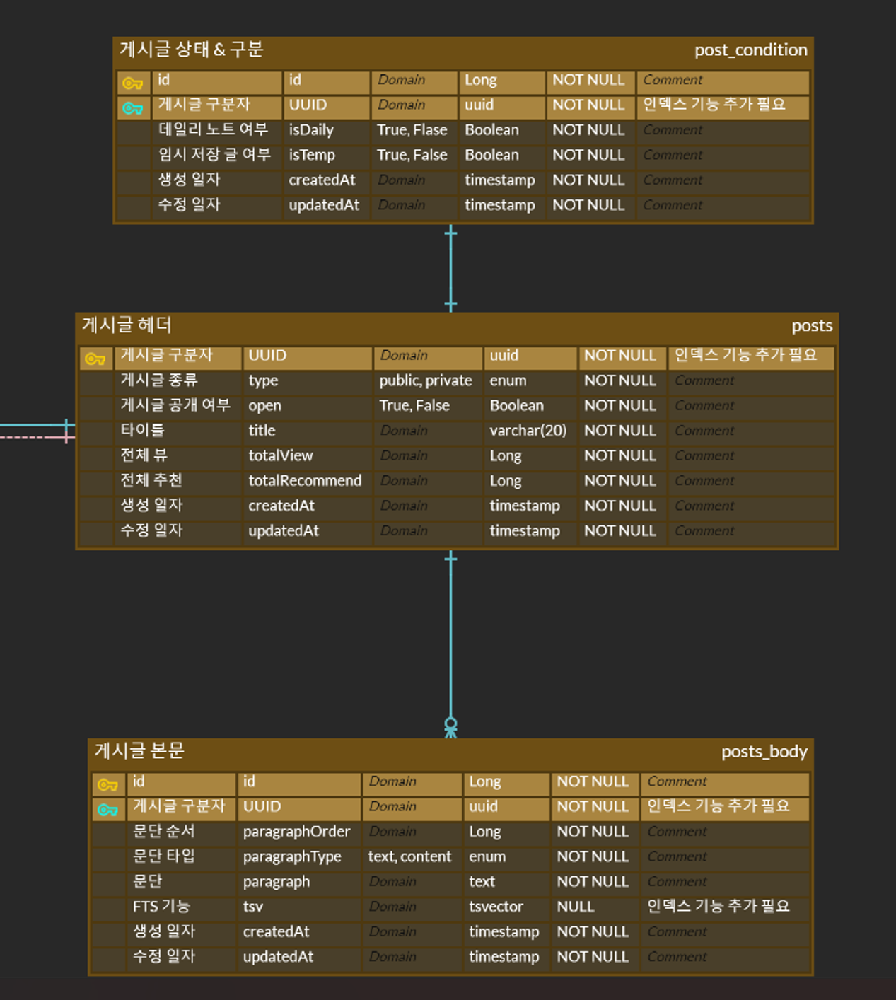
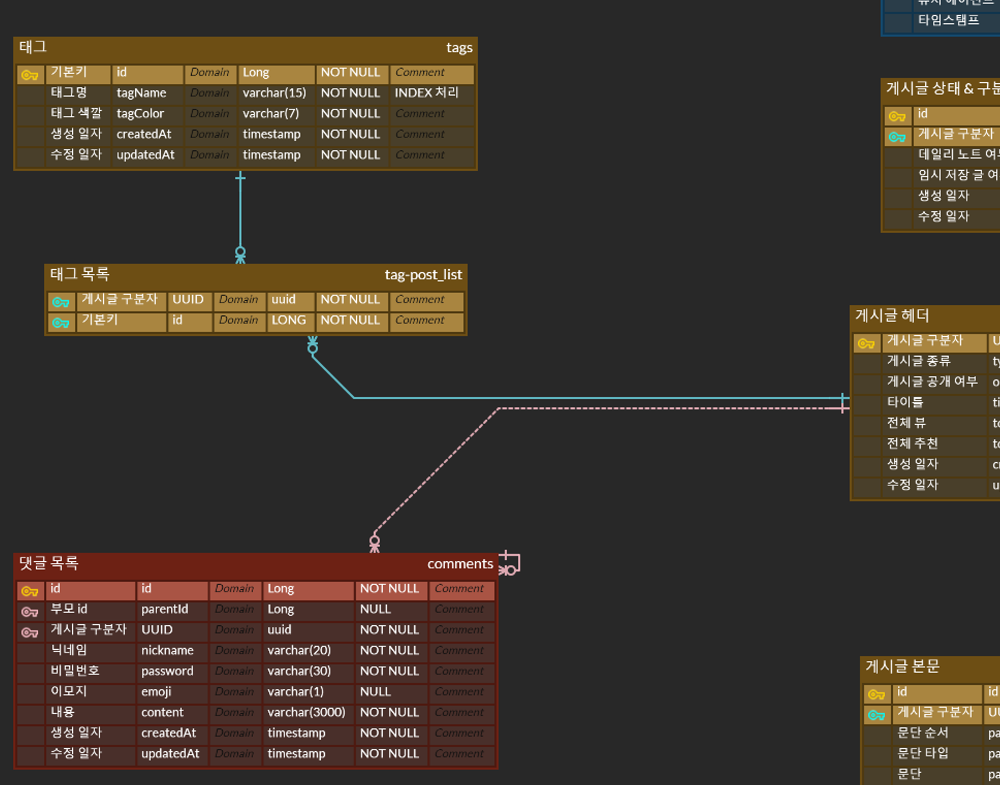
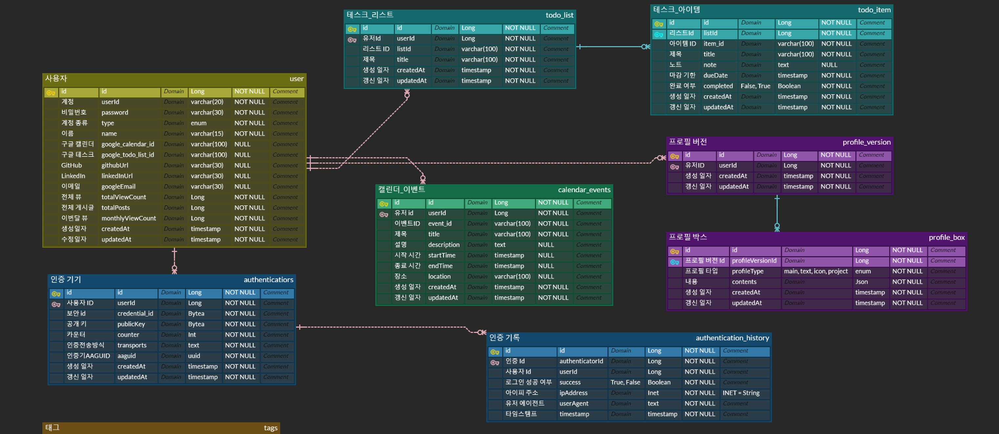

# 데이터베이스 설계 문서

## 들어가면서

[공유 링크](https://www.erdcloud.com/d/iiiJjvSGSgHo4BKK2)
ERD Cloud 를 활용해서 데이터베이스 모델링을 마무리 지었다.

아무래도 서비스 자체의 규모나 기능의 규모가 작다 보니 내용 자체가 방대하기 보단, 하나 하나의 디테일 적으로 어떻게 해야 할 지를 고민을 많이 했다. 효율성을 위한 부분, 특히나 블로그로써 기능적으로 문제 없다를 넘어서서 현재 가장 중요시 생각하는 '검색'을 위해 어떤 기능을 어떻게 넣을 지를 상당히 많이 고려했다. 

## 구성 1 : 게시글
게시글의 핵심은 단순히 글을 작성한다가 아니라, 작성 도중에 사용자인 내가 사용을 그만두거나, 잠시 나가게 된다고 하더라도 다시 돌아왔을 때 다시 작성이 가능하도록 구성을 해 내는 것에 그 의미가 있다. 

또한 핵심 중에 핵심으로는 글을 어떻게 블록화 하고, 향후 여러가지 프론트 기술을 접목시키거나 할 때 어떻게 이를 이끌어 낼 것인가에 대한 구조적 뒷받침이 되는가? 이며, 마지막으로는 검색을 위해 어떻게 데이터를 지정해야 하는지에 대한 고찰이다. 

### 기본 구조 : 블록형 문단, 임시 저장 상태를 저장해두자
기본적으로 글을 하나의 테이블에, 내용도, 타이틀도 모두 저장해두는 구조를 만들 수도 있다. 그리고 이러한 구조는 데이터를 저장하는 데도, 데이터를 사용하는 쪽도 통으로 된 데이터를 가지고, 통으로 조작한다는 점에서는 아주 훌륭한, 효과적인 접근 법이다. 

하지만 이러한 구조는 반대로 '세부적 조작'을 고민하는 구조에서 썩 좋은 구조는 아니라고 생각한다. 예를 들어 임시 저장을 한다고 하면, 임시 저장 시점에 항상 통으로 저장하는게 강제 된다. 뿐만 아니라 프론트엔드에서 좀 더 사용성을 고려한 데이터로 사용하기 위해서는 일단 전달 될 때부터 해당 데이터들이 분할 되어 있는게, 프론트엔드 차원에서 데이터를 조작 및 표현에 용이하다는 것은 이미 충분히 느끼고 있었다. 

따라서, 기본적으로 헤더라고 하는, 문서의 속성들을 담는 것을 따로 넣어둔 뒤, 본문에 대해서는 다음과 같은 구조를 취하게 되었다. 



본문은 문단 단위로 데이터를 저장하도록 했다. 문장이나 단어 단위로는 서버로의 부담, 내용 구성의 문제, 행여 데이터 손실이 되었을 때를 우려하여 문제가 있다고 판단하였고, 가장 적절한 것이 프론트엔드 기준으로도 문단 단위가 아닐까? 생각했으며, 이러한 구조는 다음과 같은 이점을 가지게 만든다. 

1. 임시 저장등의 기능을 사용시 '부분 수정' 이 가능하다. : 필요한 문단에 대해 API로 요청이 오고 가면서 수정이 용이하다. 뿐만 아니라 데이터의 변경 사항이 없다고 한다면, 이미 저장된 데이터를 굳이 수정하거나 가공할 필요가 없다.
2. 프론트엔드에서의 수정이 용이하다 : 문단 단위로 구성된 데이터의 덩어리는 일종의 배열 형태로 가지게 될 것인데, 이러한 구조는 이후 프론트엔드에서 요구되는 UI, UX 적 조작에 용이하게 수정이 가능하고, 데이터의 위치만 이동 시키는 식으로 데이터의 조작이 끝나게 된다. 추가적인 파싱 등이 불필요 해진다. 
3. 검색, 색인과 뷰에 용이하다 : 현재 기능적으로 가장 중요시 하는 부분이 바로 '검색' 이다. 이는 내가 사용하면서도, 기술이나 내용적으로 적었던 것을 빠르게 찾아내고, 비주얼적으로도 적절하게 보여주는게 중요하다. 예를 들어 어떤 키워드를 적용하여 검색을 하게 된다면, 계속 고민하던 부분은 검색 화면까지 갔을 때, 과연 전체 본문을 다 보여줄 수 있는가? 그렇다고 백엔드에선 다 보내고, 프론트에서 이를 다 수정하여 일부만 보여줘야 하는가? 어떤 방식이든지 간에 프론트엔드, 백엔드 서버 양 쪽에 부담을 제공하는 것은 매 한 가지라는 게 내 생각이다.
   그렇기에 이러한 문제들을 해결하는 방법은 `Full Text Search` 기능을 제공하는 PostgresSQL을 적용하는 것이며, 문단 중심으로 쪼개진 본문으로, 검색을 통해 나오는 본문 만을 정리해서 보여준다면 이는 아주 훌륭한 검색의 뷰를 구성할 수 있을거라는 것이 내 판단이다. 


그리하여 정리한 형태는 다음과 같다. 

검색이 필요한, 특히나 빠른 검색이 필요한 곳에는 INDEX를 적용하고, 게시글의 헤더가 데이터의 부모 역할을 하며, 식별 관계로 본문을 문단을 최소 단위로 하여 관리한다. 

그리고 하나 더 특이사항으로 임시 저장되는 글 여부를 효과적으로 표현할 필요가 있으며, 그 와중에도 무제로, 글의 이름이 지정되지 않고 작성 도중에 임시 저장만 되는 경우가 있을 수 있어서, 이를 보다 빠르게 검색할 수 있도록 게시글 상태만을 모아둔 테이블을 모아, 만들어 두었다. 

### 앞으로 배울, 동시에 가장 중요한 '검색'
아직 개념적으로나, 내용적으로 온전히 이해한 상태는 아니다. 하지만 기본적으로 FTS(full text search) 라는 기능이 반드시 필요하다. 블로그이긴 하지만, 동시에 내 글들 속에서 제대로 새로운 인사이트를 얻기 위해선 글을 동시에 여러 개를 본다던가, 검색 시 본문에 어디를 어떻게 검색이 되는지를 명확하게 보여주는 것. 이 두 가지는 내가 이 프로젝트에 무게를 두고 있는 점이라고 볼 수 있다. 

이러한 내용을 위해 학습 과정에서 보니, 이러한 연산을 처리해주는 데이터 구조가 존재했고, 이를 적용시켜야만 실질적으로 스프링 서버에서 이를 적용하는 게 가능하다는 것을 알 수 있었다.

따라서 이 내용을 본문 단위의 post_body 에 `tsvector` 라는 데이터 구조체를 추가함, 향후 JPA 엔티티와 레포지터리 추가로 구현이 이루어질 것이다. 

더불어 이를 통해 구현될 데이터 덩어리에 대해 블로그 프론트에서 어떻게 이를 표현할 것인지. 이 역시 핵심 중에 핵심일 것이다. 

## 구성 2 : 댓글, 그리고 태그

이 부분은 사실 그렇게 어려운 영역이거나, 중요한 영역은 아니다. 그러니 빠르게 정리해보면 다음과 같은 내용이 핵심으로 구성되어 있다. 
- 태그는 태그 테이블 - 태그 목록 - 게시글 헤더 로 1:N ~ N:1 의 구성을 갖추고 있다. 
- 태그명은 INDEX 처리하여 검색 속도를 위한 처리를 진행한다. 
- 댓글은 기본적인 댓글을 위한 구성을 갖추고 있되, 대댓글을 위하여 스스로에 대해 1:N 으로 구성이 가능하도록 구성했다. 따라서 부모 ID를 가질 수 있고, 가지는 경우 그 깊이는 1로 되어 있다. 즉, 댓글에 대댓글 까지만을 지원하고 그 이상으로 대댓글이 달리진 않도록 구성하였다. 다만, 여기서 아직 고민 되는 부분은, 단순히 관계를 보여주는 용도라면 1:N의 관계 표현이 굳이 필요하진 않아 보인다(단순 칼럼으로만 표시하고, 프론트엔드에서 처리만 하면 되니까.)

## 구성 3 : 그 밖의 것들(Google API, FIDO2, Profile  features)

이 부분은 개발에서도 상당히 후반부에 작업할 것으로 예상하는 영역이다. 실제로 프론트엔드가 어느정도 개발 된 이후에나 작업이 가능하지 않을까 생각하기에, 일단은 기본적으로 표준안에서 요구하는 것들만을 넣어서 만들었다. 특이점으로는 프로필에 대한 버전관리를 위해 일부러 프로필 구성하는 방식을 프로필 버전과 그 내용물인 박스로 구성했다는 점이다. 
- FIDO2 인증 : 프론트엔드 라이브러리와 백엔드 패키지로 기본적인 구성에서 필요한 것은 없으나, 보안을 위해 필요한 핵심들은 데이터테이블로 갖고 있으며, 이는 여러대 인증이 되어 있을 때를 대비해 유저와 1:N 관계로 구성했다. 
- google task, calendar : API에 대한 기본적인 데이터들만을 담았다. 내부 로직과 어떻게 동작하여 저장 - 갱신 - 데이터 동기화 를 진행할지는 고민이 필요하다. 
- 프로필 : 이 부분은 향후 내 포트폴리오 겸, 데이터들을 넣어서 보기 좋은 이력서 형태를 구현하는 게 가장 핵심 목표이다. 또한 과거와 현재를 지속적으로 좀 보고 싶다는 점에서 간단한 버전 관리 형태를 구현 하려고도 생각하고 있다. 이에 프론트엔드에서 데이터를 가공하기 쉽게 구성하는게 핵심이었고, 그 생각의 핵심에 json 형태로 구성하는 것으로 만들어 보았다. 
	- 우선 저장이 요청되는 순간 기존 버전에서 신규 버전으로 저장될 수 있도록, 헤더 역할을 하는 데이터 테이블이 `프로필 버전`테이블이다.
	- 여기에 각 구성요소들은 일종의 box 라는 개념으로 묶이게 되는데 이때, 프론트엔드에서 해당하는 타입을 지정해 주고, 기록하여 로드할 때는 해당 데이터로 구분만을 진행한다. 실질적인 데이터들은 업로드가 되면서 url 형태로 구성이 될 것이기 때문에, url과 내용이 담긴 json 구조로 DB에서나 백엔드 서버에서 특별한 편집이나 검증은 헤더 부분만을 진행할 것이다. 

## 데이터 설계를 일단 마무리 하면서...
JPA 강의를 들으며 생각했던 내용들, 특히나 효과적이지 못한 구조나 내용을 최소화 하고 싶어서 여러모로 노력을 해봤는데, 여전히 부족함을 느낀다. 어쩌면 데이터베이스에 대한 기초 자체가 부족하기 때문인게 아닌가 하는 생각도 들긴 한다. 

하지만 뭐 어쩌리. 그럼에도 내용을 정리하는 동안에는 정말 즐거웠고, 이력서를 내거나 하는 과정들 때문에 한창 미뤄진 내 솔로 프로젝트에도 드디어 시작지점을 통과, 중후반으로 가고 있다는 생각이 든다. 

아직 부족하지만 착실하게. 내가 가진 가장 큰 장점이 어느 누구도 범접할 수 없을 때까지 노력하고 또 노력해보자.


```toc

```
