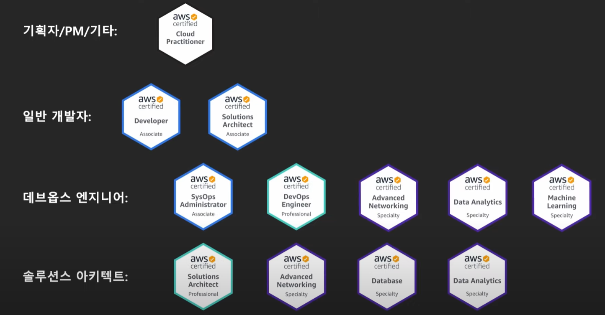

# 쉽게 설명하는 AWS 기초 강좌
- 본 내용은 빠르게 학습 진행 하는 내용이라 전체 내용을 전부 포괄하지 않습니다.
- 모르는 개념들 위주라 참고용이 아니므로 직접 학습 하시고 요약자료 정도로 생각해주시길 부탁드립니다. 
## 1: 클라우드 컴퓨팅이란?
- 서버가 존재 하면, 클라이언트 사이의 통신이 아닌 서버와 클라이언트 간의 통신을 통해 정보 처리, 정보 전달 면에서 유효하게 된다. 
- 데이터 센터 : 어플리케이션의 서버를 호스팅하는 실제 시설
	- 하드웨어
	- 네트워킹 장비
	- 전원공급장치
	- 전기 시스템
	- 백업 발전기 
	- 환경 제어장치(에어컨, 냉각장치 등)
	- 운영인력
	- 기타 인프라 등등... 
- 데이터 센터는 운영에 비용이 많이 소요됨
	- 건물 유지 비용, 서버 구매 비용, 셋업, 유지 보수 등 
	- 한번 구매하면 수요에 상관 없이 계속 보유해야함 
- 느린 구축 시간 
	- 유저의 수요에 빠르게 대처 어려움
	- 장애 발생에 대한 대응 느려짐 
- 클라우드의 출현은 필현에 가깝다. 
- 클라우드의 장점 
	- 자본 비용을 가변 비용으로 대체
	- 규모의 경제로 얻게 되는 이점
## 잠깐 현재 자격증 중에 가장 연봉 높이기 효과적인 친구는?!
- AWS 자격증~
- AWS 를 공부하기 위한 좋은 도구이자, 잘 먹히는 자격증이니 준비해두면 좋을듯! 
- 공식 자격증 : 총 10개, 4종류 
	- AWS 공인 클라우드 전문가
	- AWS 솔루션스 아키텍트
	- AWS 데브옵스 엔지니어
	- AWS 전문 분야 자격증 

## 2: 클라우드 컴퓨팅의 종류 
### 클라우드 컴퓨팅의 유형 
1. 클라우드 컴퓨팅 모델 
2. 클라우드 컴퓨팅 배포 모델
### 클라우드 컴퓨팅 모델
- IaaS: Infrastructure as a Service 
	- 인프라만 제공 
	- OS를 직접 설치하고 필요한 소프트웨어를 개발해서 사용
	- 가상 컴퓨터를 임대하는 것에 가까움
	- ex) AWS EC2
- PaaS: Platform as a Service
	- 인프라 + OS + 기타 프로그램에 실행에 필요한 부분(런타임) 
	- 바로 코드만 올리면 됨 
	- ex) Firebase, Google App Engine등
- SaaS: Software as a Service
	- 서비스 자체를 제공
	- 다른 세팅 없이 바로 서비스 이용 가능 
	- ex) Gmail, DropBox, Slack, Google Docs
### 클라우드 컴퓨팅 배포 모델 
#### 공개형(클라우드) 
- 모든 부분이 클라우드에서 실행 
- 낮은 비용 
- 높은 확장성 
#### 혼합형(하이브리드)
- 폐쇄형과 공개형의 혼합 
- 폐쇄형에서 공개형으로 전환하는 경우 과도기에 사용 
- 혹은 폐쇄형의 백업으로 사용
#### 폐쇄형(직접 운영)
- 높은 수준의 커스터마이징 가능 
- 초기 비용이 비쌈 
- 유지 보수 비용이 비쌈
- 높은 보안
## 3: AWS 구조-리전, 가용영역, 엣지로케이션 등 - 
### AWS 소개 
- 클라우드 서비스 점유율 1위
- 수많은 레퍼런스, 매년 서비스가 성장 및 발전 진행함
### AWS의 구조 
- AWS 클라우드 
	- IAM : 리전에 속하지 않은 서비스
	- Amazon CloudFront
	- etc...
	- 리전
		- VPC : 리전에 속하나, 가용영역과는 별도로 운용되는 서비스
		- S3
		- etc...
		- 가용영역 n개
			- 가용영역 내부에 상주한 서비스
### 리전 
- AWS 서비스가 제공되는 물리적 위치 
- 각 리전은 고유 코드 부여됨 
	- us-east-1 : 미국 동부 가장 대빵이 되는 서비스 제공 되는 리전 
- 리전 별로 가능 서비스가 다르다
- 리전 선택 시 고려 사항 
	- 지연속도
	- 법률(데이터, 서비스 제공 관련)
	- 사용 가능한 AWS 서비스
### 가용영역
- 리전의 하부 단위 
	- 하나의 리전은 반드시 2개 이상의 가용영역을 보유하고 있다. 
- 하나 이상의 데이터 센터로 구성 
- 리전 간의 연결은 매우 빠른 전용 네트워크로 구성 
- 반드시 물리적으로 일정 거리 이상  떨어져 있음 
	- 다만 모든 AZ는 서로 100Km 이내의 거리에 위치
	- 여러 재해에 대한 대비 및 보안 
- 각 계정 별로 AZ의 코드와 실제 위치는 다르다
	- 보안 및 한 AZ로 몰림을 방지하기 위함 
	- 즉, 실제 가용영역의 위치라고 하는 것은 계정에서 보이는 것과는 전혀 다르다. 
### 엣지 로케이션 
- AWS의 CloudFront(CDN) 등의 여러 서비스들을 가장 빠른 속도로 제공(캐싱)하기 위한 거점
- 엣지 로케이션의 핵심 목표는 CDN의 성능이라고 보면 된다. 
- 전세계에 흩어져 있음 
### 글로벌 서비스와 리전 서비스 
- AWS 에는 서비스가 제공되는 지역에 따라 글로벌, 리전 서비스로 분류가 가능 
- 글로벌 서비스 
	- CloudFront(CDN)
	- IAM
	- Route53
	- WAF
- 지역 서비스
	- 대부분의 서비스 
	- S3 : 전세계에서 사용되는 서비스이나 데이터는 리전에 종속됨 
### ARN
- AmazonResourceName: AWS의 모든 리소스의 고유 아이디 
- 형식 :
	- `arn:[partition]:[service]:[region]:[account_id]:[resource_type]/[resource_name]/(qualifier)`
	- 예시) 
		- arn:aws:s3:::test_bucket/text.txt
		- arn:aws:dynamodb:ap-northeast-2:123456789012:table/mytable
		- arn:aws:dynamodb:ap-northeast-2:123456789012:table/*


- 맨 끝에 와일드 카드`(*)`를 사용하여 다수 리소스를 지정 가능

```toc

```
