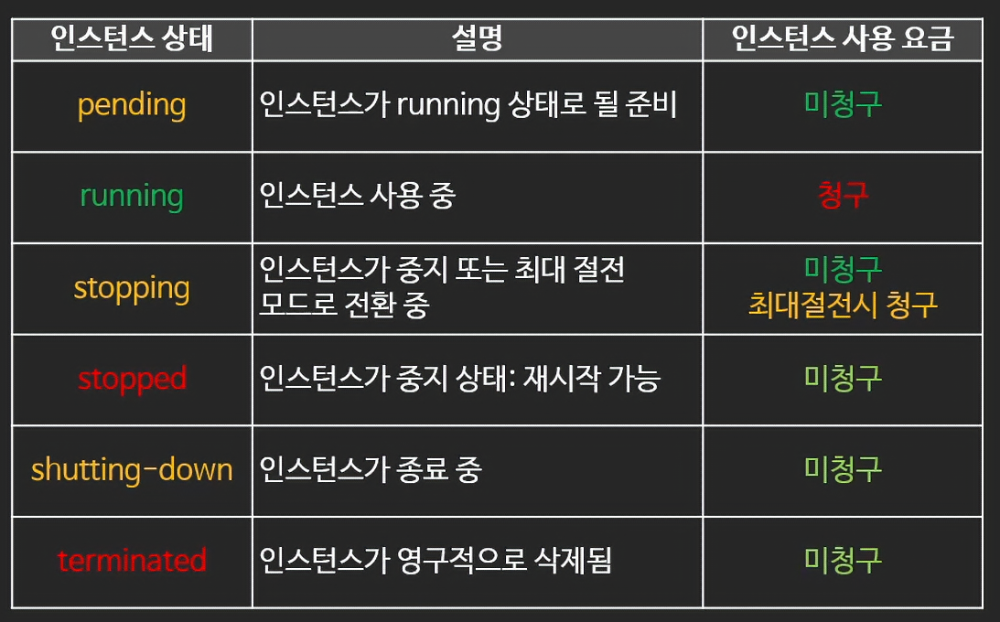

# 쉽게 설명하는 AWS 기초 강좌
- 본 내용은 빠르게 학습 진행 하는 내용이라 전체 내용을 전부 포괄하지 않습니다.
- 모르는 개념들 위주라 참고용이 아니므로 직접 학습 하시고 요약자료 정도로 생각해주시길 부탁드립니다. 
## 11: EC2(5)-EC2 생명 주기 
### EC2의 생명 주기 
- 중지 
	- 중지 중 인스턴스 요금 미 청구 
	- 단, EBS 요금, 다른 구성 요소는 청구
	- 중지 후 재시작 시 Public IP 변경 
	- EBS를 사용하는 인스턴스만 중지 가능: `인스턴스 저장 인스턴스`는 중지 불가 
- 재부팅 
	- 재 부팅 시에는 Public IP 는 변동 없다
- 최대 절전 모드 
	- 메모리 내용을 보존해서 재시작시 중단 지점에서 시작할 수 있는 정지 모드


## 12: EC2 Autoscaling
### 스케일링 
- 수직적 스케일(Vertical Scale) : 성능을 올리는 방식 
- 수평적 스케일(Horizontal Scale) : 규모를 늘려 병렬적으로 처리하는 방식
### AWS Auto Scaling 
- 애플리케이션을 모니터링 하고 용량을 자동으로 조정하여, 최대한 저렴하게 안정적이고 예측 가능한 성능을 유지하는 서비스 
- 종류
	- EC2 Auto Scaling 
	- DDB Auto Scaling 
	- Spot Fleet Auto Scaling
	- Aurora Auto Scaling
	- ECS Auto Scaling 
	- 꽤나 다양한 auto scaling 서비스들이 존재한다. 
### AWS auto Scaling
- 목표 
	- 정확한 수의 EC2 인스턴스를 보유하도록 보장 
	- 그룹의 최소 인스턴스 숫자 및 최대 인스턴스 숫자 
		- 최소 숫자 이하로 내려가지 않도록 인스턴스 숫자를 유지 
		- 최대 숫자 이상 늘어나지 않도록 인스턴스 숫자 유지
	- 다양한 스케일링 정책 적용 가능 
	- 가용 영역에 인스턴스가 골고루 분산을 시켜 인스턴스를 분배 
### 오토 스케일링의 구성 
- 시작구성(launch configuration) / 시작 템플릿(launch template) : 무엇을 실행 시킬 것인가?
	- EC2의 타입, 사이즈
	- AMI
	- 보안 그룹, key, IAM
	- 유저 데이터 
- 모니터링 : 언제 실행시킬 것인가? + 상태 확인 
	- 예시 ) CPU 점유율 몇 % 넘었을 때 추가로 실행 or 2개 이상 필요한 스택에서 EC2 하나가 죽었을 때 
	- CloudWatch (and/or) ELB와 연계 
## 13: Elastic Load Balancer(ELB)
### 로드 밸런싱
- 기본적으로 인스턴스는 공개 IP로 클라이언트가 접근이 되어야 하고, 그러다보니 다수의 오토 스케일링 그룹으로 묶거나하여 인스턴스의 변동이 생길 시 클라이언트는 불편.
- 이러한 트래픽을 하나로 묶어 마치 동일 서비스, 하나의 입구에 접근하는 식으로 트래픽을 분산 처리 및 집적 해주는 용도가 로드 벨런서의 역할이다. 
- 개념 : Elastic Load Balancing은 애플리케이션 트래픽을 EC2 인스턴스, 컨테이너, IP 주소, Lambda 함수와 같은 여러 대상에 자동으로 분산해주는 역할을 한다. ELB는 단일 가용 영역 또는 여러 가용 영역에서 다양한 애플리케이션 부하를 처리할 수 있다. ELB가 제공하는 세 가지 로드 밸런서는 모든 애플리케이션 내결함성에 필요한 고가용성, 자동 확장/ 축소, 강력한 보안을 갖추고 있다. 
- 기능들 
	- 다수의 서비스에 트래픽을 분산 시켜주는 서비스
	- health check
	- autoscaling 과 연동 가능 
	- 여러 가용 영역에 분산 가능 
	- 지속적 IP 주소가 바뀌며 IP 고정 불가능 : 항상 도메인 기반으로 사용
### ELB 의 종류
-  Application Load Balancer 
	- 똑똑한 녀석
	- 트래픽을 모니터링 하여, 라우팅 가능 
		- ex) image.sample.com -> 이미지 서버로 , web.sample.com -> 웹 서버로 트래픽 분산
- Network Load Balanecer
	- 빠른 녀석 
	- TCP 기반 빠른 트래픽 분산 
	- Elastic IP 할당 가능 
- Gateway Load Balancer
	- 트래픽을 먼저 점검하는 녀석(방화벽, 분석, 캐싱, 인증, 로깅 등)
### 대상 그룹 
- ALB 가 라우팅 할 대상의 집합 
- 구성 
	- Instance 
	- IP(private)
	- Lambda
	- ALB 
	- 프로토콜 
	- 기타 설정 
		- 트래픽 분산 알고리즘, 고정 세션 등
## 14: Elastic File System 
### EFS
- 개념 : AWS 클라우드 서비스와 온프레미스 리소스에서 사용할 수 있는, 간단하고 확장가능하며 탄력적인 완전관리형 NFS 파일 시스템을 제공한다. 
- NFS 기반 공유 스토리지 서비스(NFSv4)
	- 따로 용량 지정 필요 없어, 사용한 만큼 용량 증가 
	- EBS 는 미리 크기 지정해야함 
- 페타바이트 단위까지 확장 가능
- 몇 천개의 동시 접속 유지 가능
- 데이터는 여러 AZ에서 나누어 분산 저장 
- 쓰기 후 읽기(Read And Write) 일관성
- Private Service : AWS 외부 접속은 VPN, Direct Coinnect 등으로 별도로 VPC와 연결 필요하여 접속이 어려움
- 각 가용영역에 Mount Target 을 두고 각각의 가용 영역에서 해당 Mount Target으로 접근 
- Linux Only 
### Amazon EFS 퍼포먼스 모드 
- General Purpose : 가장 보편적인 모드, 대부분의 경우 권장됨 
- Max IO : 매우 높은 IOPS가 필요한 경우 
	- 빅데이터, 미디어 처리 등 

### Amazon EFS Throughput 모드
- Bursting Throughput : 낮은 Throughput 일 때 크레딧을 모아서 높은 Throughput 일 때 사용(일반적인 경우 이것으로 해결 대부분 가능 )
	- EC2 T타입과 유사한 개념 
- Provisioned Throughput : 미리 지정한 만큼의 Throughput을 미리 확보해두고 사용 
### Amazon EFS 스토리지 클래스 
- EFS Standard : 3개 이상의 가용 영역에 보관
- EFS Standard - IA : 3개 이상의 가용 영역에 보관, 조금 저렴하나 데이터를 가져올 때 비용 발생
- EFS One Zone : 단일 가용 영역에 보관 -> 가용 영역의 상황에 영향을 받음
- EFS One Zone - IA : 저장된 가용 영역에 영향을 받고, 데이터 가져올 시 비용 발생하나 가장 저렴 
### Amazon FSx
- FSx for Windows File Server
	- EFS의 윈도우즈 버전 
	- SMB 프로토콜을 활용 
	- Microsoft Active Directory 와 통합 등의 관리 기능 사용 가능 
	- Linux, Mac등 다른 OS 도 활용 가능 
- FSx for Lustre 
	- 리눅스를 위한 고성능 병렬 스토리지 시스템 
	- 머신 러닝, 빅데이터 등의 고성능 컴퓨팅에 사용 
	- AWS 밖의 온프레미스에서도 액세스 가능 
## 15: 사설 IP, NAT, CIDR
### 사설 IP
- 한정된 IP 주소를 최대한 활용하기 위해 하위 IP 주소 개념 
- 사설망 
	- 사설망 내부에는 외부 인터넷 망으로 통신이 불가능한 사설 IP 로 구성 
	- 외부 통신은 공개 IP로만 진행 
	- 보통 하나의 망에는 사설 IP를 부여받은 기기들과 NAT 기능을 갖춘 Gateway 로 구성 
### NAT(Network Address Translation)
- 사설 IP가 공용 IP로 통신 할 수 있도록 주소를 변환해주는 방법 
- 종류
	- Dynamic NAT : 1개의 사설 IP를 가용 가능한 공인 IP로 연결 
		- 공인 IP 그룹(NAT Pool)에서 현재 사용 가능한 IP를 가져와서 연결
	- Static NAT : 1개의 사설 IP를 고정된 하나의 공인 IP로 연결
		- AWS Internet Gatway 가 사용하는 방식
	- PAT(Port Address Translation) : 많은 사설 IP를 하나의 공인 IP 로 연결 
		- NAT Gatway / NAT Instance 가 사용하는 방식
### Classless Inter Domain Routing(CIDR)
- Classless Inter Domain Routing
	- IP는 주소의 영역을 여러 네트워크 영역으로 나누기 위해 IP를 묶는 방식
	- 여러 개의 사설망을 구축하기 위해 망을 나누는 방법 
- CIDR Block / CIDR Notation 
	- CIDR Block : IP 주소의 집합 
	- CIDR Notation : CIDR Block 을 표시하는 방법 
		- 네트워크 주소와 호스트 주소로 구성 
		- 각 호스트 주소 숫자 만큼의 IP를 가진 네트워크 망 형성 가능
	-  A.B.C.D/E 형식 
		- 예) `10.0.1.0/24, 172.16.0.0/12`
		- A, B, C, D : 네트워크 주소 + 호스트 주소, E: 0 ~32 : 네트워크 주소가 몇 bit 인지 표시 
### 서브넷 
- 네트워크 안의 네트워크
- 큰 네트워크를 잘게 쪼겐 단위
- 일정 IP 주소의 범위를 보유
	- 큰 네트워크에 부여된 IP범위를 조금씩 잘라 작은 단위로 나눈 후 각 서브넷에 할당

```toc

```
