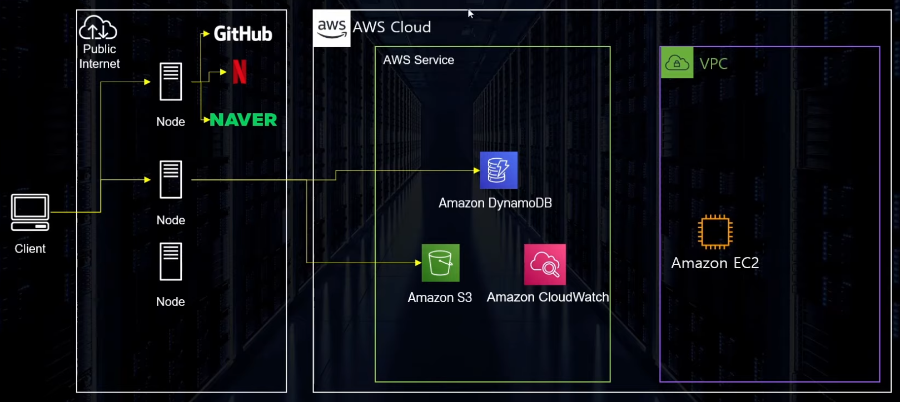
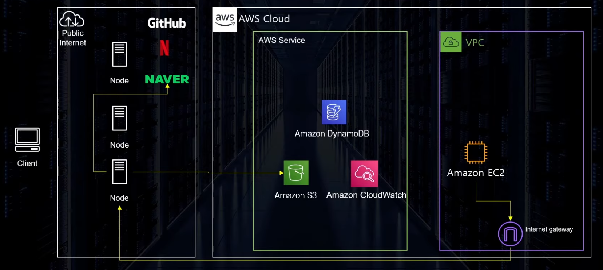
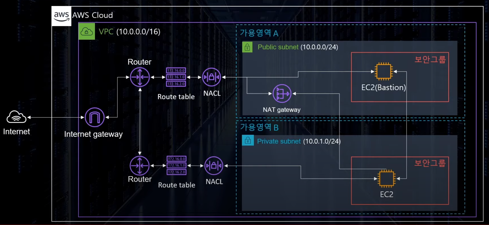
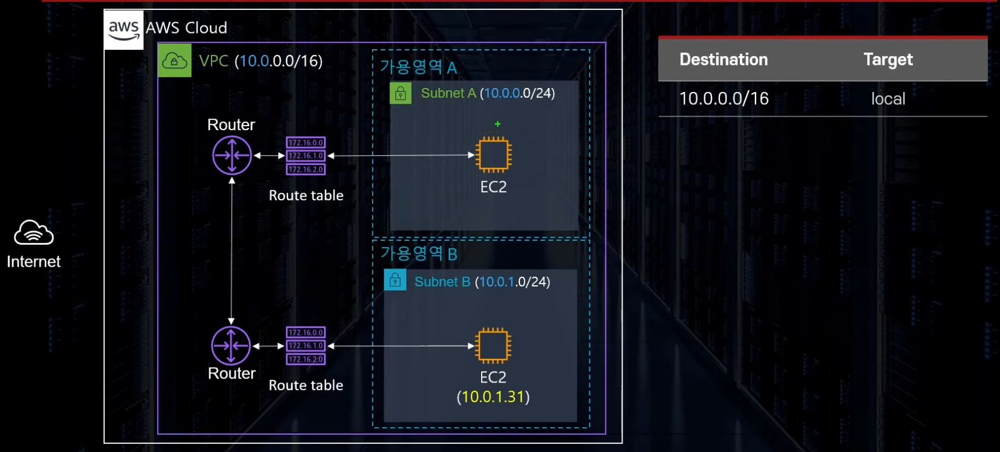

# 쉽게 설명하는 AWS 기초 강좌
- 본 내용은 빠르게 학습 진행 하는 내용이라 전체 내용을 전부 포괄하지 않습니다.
- 모르는 개념들 위주라 참고용이 아니므로 직접 학습 하시고 요약자료 정도로 생각해주시길 부탁드립니다. 
## 16: VPC와 Subnet 
### AWS 의 구조 

- 원칙적으로 VPC는 외부 접근이 안되어야 한다. 
- 하지만 Internet Gateway 가 있기 때문에 접속이 가능한 것일 뿐이다. 

### Virtual Private Cloud(VPC)
- 개념 : AWS 계정 전용 가상 네트워크이다. VPC는 AWS 클라우드에서 다른 가상 네트워크와 논리적으로 분리되어 있다.

### VPC
- 가상의 데이터 센터
- 외부와 격리된 네트워크 컨테이너 구성 가능 
	- 원하는 대로 사설망을 구축 할 수 있다
- 리전 단위
- VPC의 사용 사례 
	- EC2, RDS, Lambda 등의 AWS의 컴퓨팅 서비스 실행 
	- 다양한 서브넷 구성 
	- 보안 설정(IP Block, 인터넷에 노출되지 않는 EC2 등 구성 )
### VPC의 구성요소
- 서브넷
- 인터넷 게이트웨이
- NACL/ 보안그룹
- 라우트 테이블
- NAT Instance / NAT Gateway
- Bastion Host
- VPC Endpoint
### 서브넷 
- VPC의 하위 단위로 VPC에 할당된 IP를 더 작은 단위로 분할한 개념 
- 하나의 서브넷은 하나의 가용영역 안에 위치한다(당연하겠지만 물리적 떨어져 있으니)
- CIDR Block Range로 IP 주소 지정 
### 서브넷의 종류
- 퍼블릭 서브넷 : 외부에서 인터넷을 통해 연결할 수 있는 서브넷
- 프라이빗 서브넷 : 외부에서 인터넷을 통해 연결할 수 없는 서브넷 
### AWS 서브넷의 IP 갯수
- AWS의 사용 가능 IP 숫자는, 선점된 5개를 제외하고 계산하면 된다. 
	- ex) 10.0.0.0/24 사설망이라면
		- 10.0.0.0 : 네트워크 어드레스
		- 10.0.0.1 : VPC Router 
		- 10.0.0.2 : DNS  Server
		- 10.0.0.3 : 미래를 위한 선점 주소
		- 10.0.0.255 : 네트워크 브로드캐스트 어드레스(단, 브로드캐스트는 지원하지 않음)
### 라우트 테이블(Route Table) 
- 트래픽이 어디로 가야 할지 알려주는 이정표
- VPC  생성 시 기본으로 하나 제공


### 인터넷 게이트웨이 
- VPC가 외부의 인터넷과 통신할 수 있도록 경로를 만들어주는 리소스
- 기본적으로 확장성, 고가용성이 확보되어 있다. 
- IPv4, 6 지원 
- RouteTable 에서 경로 설정 후에 접근 가능 
- 무료 
## 17: 보안그룹과  NACL 
### 보안 그룹(Security Group)
- Network Access Control List(NACL) 와 함께 방화벽 역할을 하는 서비스 
- Port 허용 
	- 기본적으로 모든 포트는 비활성화 
	- 선택적으로 트래픽이 지나갈 수 있는 Port 와 soruce설정 가능 
	- Deny는 불가능 -> NACL 로 가능
- 인스턴스 단위(약간 다름)
	- 하나의 인스턴스는 복수의 SG설정 가능 
	- NACL 의 경우 서브넷 단위 
	- 설정된 인스턴스는 모든 SG의 룰을 동시에 적용 받음 
### NACL 
- 보안그룹처럼 방화벽 역할을 담당
- 서브넷 단위
- 포트, 아이피를 직접 Deny 가능 
	- 외부 공격을 받는 상황 등 특정 IP를 블록하고 싶을 때 사용 
- 순서대로 규칙 평가 
### NACL 규칙 
- 규칙번호 : 규칙에 부여되는 고유 숫자 이며, 규칙이 평가되는 순서(낮은 번호부터)
	- AWS 추천은 100단위 증가
- 유형 : 미리지정된 프로토콜, 선택시 AWS에서 잘 알려진 포트가 규칙에 지정됨
- 프로토콜 : 통신 프로토콜
- 포트 범위 : 허용 혹은 거부할 포트 범위
- 소스 : IP주소의 CIDR 블록
- 허용/거부 : 허용 혹은 거부 여부 
## 18: NAT Gateway & Bastion Host
### NAT Gateway & NAT Instance 
- AWS VPC 의 프라이빗 서브넷에 있는 인스턴스에서 인터넷 연결을 지원하는 관리형 서비스 
- Private 인스턴스가 외부와 통신하기 위한 통로
- NAT Instance 는 단일 EC2 인스턴스 , NAT Gateway 는 AWS에서 제공하는 서비스 
- NAT Gateway / Instance 는 모두 서브넷 단위 : 퍼블릿 서브넷에 있어야 한다 
### Bastion Host 
- 외부에서 사설 네트워크에 접속할 수 있도록 경로를 확보해주는 서버 
- Private 인스턴스에 접근하기 위한 서비스 
- 실전에서 잘 쓰이지 않아서, Session Manager 로 접속하는 경우가 더 많다. 
## 19: VPC 생성 실습
### VPC 관련 몇 가지 알아둘 사항
- 커스텀 VPC 생성 시 만들어지는 리소스 : 라우팅 테이블, 기본 NACL, 기본 보안 그룹 
	- 서브넷 생성 시 모두 기본 라우팅 테이블로 자동 연동 
- 서브넷 생성 시 AWS 는 총 5개의 선점 IP가 존재한다
- VPC 에는 단 하나의 Internet Gateway 만 생성 가능
	- IG생성 후 직접 VPC 연동 필요 
	- IG는 자체적으로 고가용성, 장애 내구성 확보 
- 보안 그룹 VPC
- 서브넷은 가용영역 단위(1 서브넷 = 1 가용 영역)
- 가장 작은 서브넷 단위는 /24(11개, 16-5)
### VPC 생성 실습 과정 
1. 직접 커스텀 VPC 생성(10.0.0.0/16)
2. 서브넷 3개 생성: Public, Private, DB 
3. 각 서브넷에 각각 Routing Table 연동
4. Public  서브넷에 인터넷 경로 구성 : Internet Gateway
5. Public 서브넷에 EC2 프로비전
6. Private 서브넷에 EC2 프로비전
	- Bastion Host 
7. DB 서브넷에 DB 생성 
	- NAT Gateway Setup
## 20: S3 기초 
### Simple Storage Service(S3) 란 
- 개념 : 업계 최고의 확장성과 데이터 가용성 및 보안과 성능을 제공하는 객체 스토리지 서비스이다. 
- 객체 스토리지 서비스 : 파일 보관만 가능 <-> Block Storage Service(EBS, EFS 등)
- 어플리케이션 설치 불가능
- 글로벌 서비스 단, 데이터는 리전에 저장 
- 무제한 용량 : 하나의 객체는 0byte ~ 5TB의 용량 
### 버킷
- S3의 저장 공간을 구분하는 단위
- 디렉토리 / 폴더와 같은 개념 
- 버킷 이름은 전세계에서 고유 값 : 리전에 관계 없이 중복된 이름이 존재할 수 없다. 
### S3 객체의 구성 
- Owner : 소유자
- key : 파일의 이름
- Value : 파일의 데이터
- Version Id : 버전 값
- Metadata : 메타 데이터 
- ACL : 파일의 권한을 담은 데이터 
- Torrents : 토렌트 공유를 위한 데이터
### S3의 내구성 
- 최소 3개 가용 영역에 데이터를 분산 저장(Standard 기준) 
- 99.999999999% 내구성 = 0.000000001% 확률로 잃어버를 가능성 존재 
- 99.9% SLA 가용성(스토리지 클래스에 따라 다름) : 내가 원할 때 파일을 쓸 수 있는 능력
### 보안성 
- S3모든 버킷은 새로 생성시 기본적으로 Private 
	- 따로 설정을 통해 불특정 다수에게 공개 가능 
- 보안 설정은 객체 단위, 버킷 단위로 구성
	- Bucket Policy : 버킷 단위 <- 보통 이정도 수준에서 구성
	- ACL : 객체 단위
- MFA 를 활용해 객체 삭제 방지 가능
- Versioning 을 통해 파일 관리 가능 
- 액세스 로그 생성 및 전송 가능 

```toc

```
