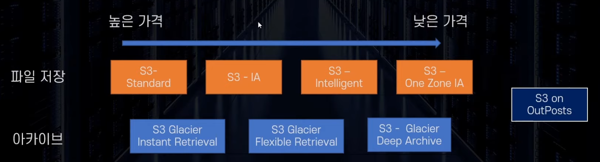
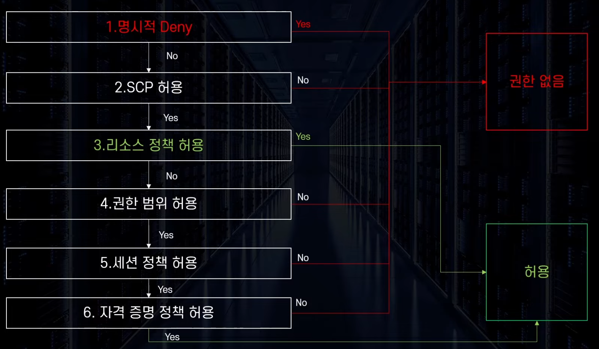
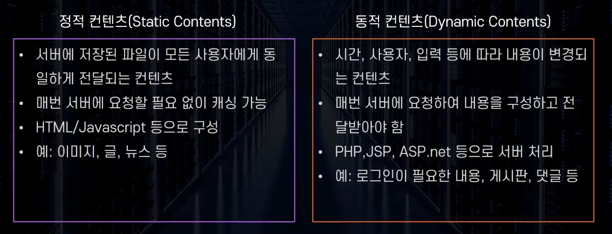

# 쉽게 설명하는 AWS 기초 강좌
- 본 내용은 빠르게 학습 진행 하는 내용이라 전체 내용을 전부 포괄하지 않습니다.
- 모르는 개념들 위주라 참고용이 아니므로 직접 학습 하시고 요약자료 정도로 생각해주시길 부탁드립니다. 
## 21: S3 Storage Class 
### 스토리지 클래스 
- 다양한 스토리지 클래스를 제공 
	- 클래스 별로 저장의 목적, 예산에 따라 다른 저장 방법을 적용 
	- 총 8가지 클래스 

### S3 스탠다드
- 99.99% 가용성 
- 99.999999999% 내구성
- 최소 3개 이상의 가용영역에 분산 보관
- 최소 보관 기간 없음, 최소 보관 용량 없음
- 파일 요청 비용 없음(전송 요금은 발생)
- $0.025/gb(서울 리전 기준)
### S3 스탠다드 IA 
- 자주 사용되지 않는 데이터를 저렴한 가격에 보관
- 최소 3개 이상의 가용영역에 분산 보관 
- 최소 저장 용량 : 128kb
- 최소 저장 기간 : 30일 
	- 즉 1일만 저장해도 30일 요금 발생 
- 데이터 요청 비용 발생 : 데이터를 불러올 때마다 비용 지불(GB) 
- 사용 사례 : 자주 사용하지 않는 파일 중 중요한 파일 
- $0.0138/gb(서울 리전 기준)
### S3  One Zone-IA
- 자주 사용되지 않고, 중요하지 않은 데이터를 저렴한 가격에 보관 
- 단 한개의 가용 영역에만 보관 
- 최소 저장 용량 : 128kb 
- 최소 저장 기간 : 30일 
	- 즉 1일 저장만 해도 30일 요금 
- 데이터 요청 비용 발생 : 데이터를 불러올 때마다 비용 지불(GB)
- 사용 사례: 자주 사용하지 않으며 쉽게 복구 할 수 있는 파일
- $0.011/gb(서울 리전 기준)
### S3 Glacier Instant Retrieval 
- 아카이브용 저장소 
- 최소 저장 용량 128kb
- 최소 저장 기간 90일 
- 바로 액세스 가능 
- 사용 사례 : 의료 이미지 혹은 뉴스 아카이브 등 
- $0.005/gb(서울 리전 기준)
### S3 Glacier Flexible Retrieval
- 아카이브용 저장소 
- 최소 저장 용량 : 40kb
- 최소 저장 기간 : 90일 
- 분~ 시간 단위 이후 액세스 가능 
- 사용사례 : 장애 복구용 데이터, 백업 데이터 
- $0.0045/gb
### S3 Glacier Deep Archive 
- 아카이브용 저장소 
- 최소 저장 용량 : 40kb
- 최소 저장 기간 : 90일 
- 데이터를 가져오는데 12~48시간 소요 
- 사용 사례 : 오래된 로그 저장, 사용할일 거의 없으나 법적으로 보관해야 하는 서류 등 
- $0.002/gb
### S3 Intelligent-Tiering 
- 머신 러닝을 통해 사용해 자동으로 클래스 변경 
- 퍼포먼스 손해 / 오버헤드 없이 요금 최적화가 가능
### S3 on Outposts
- 온프레미스 환경에 S3 제공 
- 내구성을 확보한 상태로 파일 저장하도록 설계
- 온프레미스에서도 IAM, S3  SDK 등 사용이 가능하다 
## 22: S3 권한 관리 
### IAM 정책의 종류
- Identity-based policies(자격 증명 기반 정책)
	- 자격 증명에 부여하는 정책
	- 해당 자격 증명이 무엇을 할 수 있는지 허용
- Resource-based policies(리소스 기반 정책)
	- 리소스에 부여하는 정책
	- 해당 리소스에 누가 무엇을 할 수 있는지 허용 가능
	- 기본적으로 자격증명 기반 정책의 로직으로 검증이 들어가는데, 이때 리소스 정책 허용이 예외적으로 동작하게 되는 구조다 

### S3 버킷 정책 
- 버킷 단위로 부여되는 리소스 정책
- 해당 버킷의 데이터에 "언제, 어디서, 누가, 어떻게, 무엇을" 할 수 있는지 정의 가능 
	- 리소스의 계층 구조에 따라 권한 조절이 가능하다. 
	- 다른 계정에 엔티티에 대해 권한 설정 가능 
	- 익명 사용자(Anonymous)에 대한 권한 설정도 가능
- 기본적으로 모든 버킷은 Private  로 접근설정이 된다. 
### S3의 계층 구조 
- AWS 콘솔에서는 S3 디렉토리(폴더)를 생성 가능하고 확인 됨 
- 하지만 내부적으로 계층 구조가 존재하지 않음 
	- 키 이름에 포함된 디렉토리 구조로 계층구조를 표현한 것일 뿐임 
	- ex) 
		- S3://mybucket/world/southkorea/seoul/guro/map.json
		- 버킷 명 : mybucket
		- 키 : world/southkorea/seoul/guro/map.json (단일 스트링)
### S3 버킷 관리 방법의 선택 
- Identity-based policies(자격 증명 기반 정책)
	- 같은 계정의 IAM 엔티티의 S3 권한 관리 할 때
	- S3 이외의 다른 AWS 서비스와 같이 권한 관리 할 때 
- Resource-based policies(리소스 기반 정책)
	- 익명 사용자 혹은 다른 계정의 엔티티의 S3 이용 권한을 관리할 때 
	- S3 만의 권한을 관리할 때
### S3 Access Control List(ACL)
- 버킷 혹은 객체 단위로 읽기, 쓰기의 권한을 부여 
- S3에서 설정을 통해 ACL 을 활성화 시킨 후에 적용 가능 
- 파일 업로드 시 설정 가능 
- 간단하고 단순한 권한 관리만 가능 
- 점점 사용하지 않는 추세 
## 23: S3 버전 관리 / 객체 잠금 
### S3 버전 관리 
- 객체의 생성, 업데이트, 삭제의 모든 단계를 저장 
	- 삭제 시에는 실제 객체를 삭제 안하고 삭제 마커 추가
- 버킷 단위로 활성화 필요(기본 비활성 상태)
	- 중지 가능, 단 비활성화는 불가능 
	- 한번 버전 관리를 시작하면 비활성화 불가능(버킷 삭제 후 재생성으로 해결은 가능)
- 수명 주기 관리와 연동 가능
- MFA 인증 후 삭제 기능을 통해 보안 강화 가능 
### S3 버전 관리 유의 사항 
- 중지 가능, 단 비활성화 불가능 : 버킷을 아예 삭제해야 함 
- 모든 버전에 대해 비용 발생 : 비용 청구가 매우 커질 수 있다. 
### S3 객체 잠금 
- Write Once, Read Many(WORM) 모델을 활용하여 객체를 저장
- 고정된 시간, 혹은 무기한으로 객체의 삭제, 덮어쓰기 방지 가능
- 규정 준수 및 객체 보호를 위해 사용
- 버전 활성화 필요 
### S3 객체 잠금 종류 
- 보관모드(Retention Mode) : 일정 기간 동안 수정 방지 
	- 규정 준수 모드 : **누구도 잠금설정 변경, 객체 삭제 불가능** 
	- 거버넌스 모드 : 특별 권한 없이 삭제 혹은 잠금 설정 변경 불가능 
		- 객체 삭제 방지 혹은 규정에 따라 보관하기 위해 사용
		- 규정 준수 모드의 테스트 용으로 활용 
- 법적 보존(Legal Hold) 
	- Hold 를 객체에 부여하고, Hold 가 존재하는 한 객체 삭제, 수정 불가능
	- 제한 기간이 없음 
## 24: S3 암호화
### S3의 객체 암호화 
- On Transit : SSL/TLS(HTTPS)
- At Rest(Server Side)
	- SSE S3 : S3 에서 알아서 암호화 시켜주는 것 (온전히 S3 에서 알아서 관리해줌 )
	- SSE KMS : KMS 서비스를 이용해 암호화 하는 것 (키에 대해서 KMS 를 통해 관리 가능)
	- SSE C : 클라이언트에서 제공하는 암호를 통해 암호화 (키는 직접 보관 해야함. 암호화는 키를 가지고 AWS가 해줌)
- Client Side : 클라이언트가 직접 암호화 (직접 관리해야하고 구현해야한다)
## 25: S3 정적 호스팅
### Static vs Dynamic Contents 

### Amazon S3 Static Hosting 
- S3를 사용해서 정적 웹 컨텐츠를 호스팅하는 기능 
- 별도의 서버 없이 웹 사이트 호스팅 가능 
- 고 가용성 / 장애 내구성을 확보
- 사용 사례 : 대규모 접속이 예상되는 사전 예약 페이지, 홍보페이지, 회사 웹 사이트 등 
- 서버리스한 사이트 구현이 가능하다. 
### Static Hosting 과 권한 
- 정적 웹 호스팅을 public 으로 공개할 경우 : 불특정 다수를 위한 권한 부여가 필요 
- 권한 확보를 위해선 
	- S3 Block Public Access 해제 필요 
	- Bucket Policy에서 정책 허용 필요 
### Static Hosting 의 활용
- Route 53 에서 보유한 도메인으로 연결 가능 
	- 단 버킷 명 = 호스팅 주소 
	- ex) test.example.com 으로 호스팅하고 싶다면, 버킷 명도 "test.example.com"이 되어 있어야 함 
- 실전에선 CloudFront(CDN)과 연동해서 사용한다. 
### Amazon Cloud Front 와 연동
- 일반적으로 HTTPS 프로토콜로 구현을 위해선 CloudFront와 연동 필요 
	- ACM 을 톻ㅇ해 SSL 키 관리가 가장 편함
	- 보통 Public Hosting 의 활성화되신 private 모드로 두고 OAI/OAC등을 활용해서 보안 강화 

```toc

```
