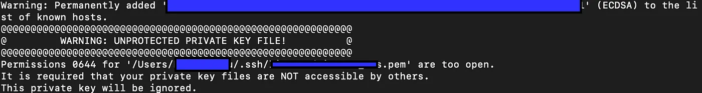

# ssh 접속 시 unprotected private key file 해결 방안



이런 식으로 에러가 발생하는 경우가 생긴다. 
이러한 경고는 permission이 잘못되게 설정되는 경우 발생한다.(너무 많은 혹은 너무 적은 permission 모두)

따라서 이런 경우 해결 방안은 다음과 같이 permision을 수정하면 된다. 

```shell
$ chmod 600 {private-key.pem}
```

```toc

```
