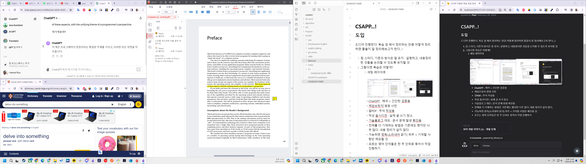

# CSAPP...! 

드디어 진행한다. 복습 겸 해서 정리하는 만큼 어떻게 정리하면 좋을지 잘 정리해보고자 한다...!

1. 팀 스터디, 기존의 방식은 잘 유지 : 설명하고, 내용정리한 것들을 논의할 수 있도록 유지할 것
2. 그렇다면 복습은 어떻게?
	1. 세팅 레이아웃 
	   
	   - ChatGPT : 해석 + 간단한 검증용
	   - 캐임브릿지 영영 사전 
	   - 알PDF : 주석 작성용
	   - 작성 옵시디언 : 실제 글 쓰기 장소 
	   - 기술블로그 데모 : 문서 문제 발생 확인용
	   - 전체를 다 기재하는 방법은 기존에도 했지만 너무 많다. 내용 정리가 쉽지 않다. 
	   - 가능하면 정독(소리내어 읽기) 위주 + 기억할 사항만 메모할 것
	   - 모르는 영어 단어들은 한 주 단위로 묶어서 작업 진행하기(일주일치 학습 사항을 정리하기)
   3. 토론 준비는 어떻게?
	   1. 토론 준비를 위한 아이디어는 정리되는 문서 별로 진행 
	   2. 하단부에 이것저것 적으면서, 아이디어를 모으고 이를 그 다음주 분량에서 진행 
	   3. 금주 연구해야하는 주제는 가능하면 20-30분 할애를 매일 진행해보기 
	   4. 금주 토론 주제에 대해서는 항상 백엔드 개발자적 관점으로 고민하는 연습을 꼭 진행하기

```toc

```
