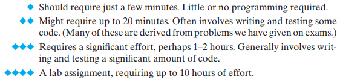

# 2024년 2월 4주차 
## Preface
- 본 교재는 다양한 컴퓨터와 관련된 다양한 분야들을 프로그래머의 관점에서 통합된 시각으로 바라봅니다. 
### Assumptions about the Reader's Background 
- 이 책은 x86-64 기계어로 실행되는 시스템에 주목하고, 특히 Unix 기반의 Linux OS 상에서 동작하는 C 프로그램들이 어떻게 동작하는 지를 고려할 것이다. 
- 알잘딱하게 C 언어로 동작하며, GNU 기반으로 컴파일 된 프로그램들이 예시로 쓰일거니 알아서 잘 신경 쓸 것! 
### How to Read the Book 
- 예시가 되는 것들의 레이팅은 이 정도 느낌이다.
  

### Book Overview
- 작자 의도를 그대로 담기위해 직역만 진행한다. 
>- Chapter 1 : A Tour of Computer Systems.
>	- 컴퓨터 시스템에 대한 여행. 이 장은 간단한 "hello, world" 프로그램의 생명 주기를 추적함으로써 컴퓨터 시스템에서의 주요 아이디어와 테마를 소개합니다.
>- Chapter 2 : Representing and Manipulating Information.
>	- 정보의 표현과 조작. 컴퓨터 산술을 다루며, 프로그래머에게 영향을 미치는 부호 없는 숫자와 2의 보수 숫자 표현의 속성을 강조합니다. 숫자가 어떻게 표현되는지, 그리고 주어진 단어 크기에 대해 어떤 범위의 값이 인코딩될 수 있는지를 고려합니다. 부호 있는 숫자와 부호 없는 숫자 사이의 캐스팅의 영향을 고려합니다. 산술 연산의 수학적 속성을 다룹니다. 초보 프로그래머들은 두 양수의 (2의 보수) 합이나 곱이 음수가 될 수 있다는 사실을 알게 되면 종종 놀랍니다. 반면, 2의 보수 산술은 정수 산술의 많은 대수적 속성을 만족시키므로, 컴파일러는 상수에 의한 곱셈을 시프트와 덧셈의 시퀀스로 안전하게 변환할 수 있습니다. C의 비트 레벨 연산을 사용하여 부울 대수의 원리와 응용을 보여줍니다. IEEE 부동 소수점 형식을 어떻게 값과 부동 소수점 연산의 수학적 속성을 표현하는지 측면에서 다룹니다.
>	- **신뢰할 수 있는 프로그램을 작성하는 데 컴퓨터 산술에 대한 확실한 이해가 중요합니다.** 예를 들어, 프로그래머와 컴파일러는 오버플로우의 가능성 때문에 표현식 (x<y)를 (x-y < 0)로 대체할 수 없습니다. 심지어 (-y < -x)로도 대체할 수 없는데, 이는 2의 보수 표현에서 음수와 양수의 범위가 비대칭적이기 때문입니다. 산술 오버플로우는 프로그래밍 오류와 보안 취약점의 일반적인 원인이지만, 다른 책들은 프로그래머의 관점에서 컴퓨터 산술의 속성을 다루는 경우가 드뭅니다. 
>- Chapter 3: Machine-Level Representation of Programs.
>	- 프로그램의 기계 수준 표현. 우리는 여러분에게 C 컴파일러에 의해 생성된 x86-64 기계 코드를 읽는 방법을 가르칩니다. 우리는 조건문, 반복문, 스위치 문장과 같은 다양한 제어 구조에 대해 생성된 기본 명령 패턴을 다룹니다. 우리는 스택 할당, 레지스터 사용 규칙, 매개변수 전달을 포함한 절차의 구현을 다룹니다. 우리는 구조체, 유니온, 배열과 같은 다양한 데이터 구조가 어떻게 할당되고 접근되는지를 다룹니다. 우리는 정수 및 부동 소수점 산술을 구현하는 명령들을 다룹니다. 또한, 프로그램의 기계 수준 뷰를 사용하여 버퍼 오버플로우와 같은 일반적인 코드 보안 취약점을 이해하고, 프로그래머, 컴파일러, 운영 체제가 이러한 위협을 줄이기 위해 취할 수 있는 단계들을 이해하는 방법으로 사용합니다. 이 장에서의 개념을 배우는 것은 프로그램이 기계에서 어떻게 표현되는지를 이해함으로써 여러분을 더 나은 프로그래머로 만들어줍니다. **한 가지 확실한 이점은 포인터에 대한 철저하고 구체적인 이해를 개발할 것입니다.**
>- Chapter 4 : Processor Architecture.
>	- 프로세서 아키텍처. 이 장에서는 **기본적인 조합 및 순차 논리 요소를 다루고, 이러한 요소들을 어떻게 결합하여 "Y86-64"라고 불리는 x86-64 명령 세트의 간소화된 하위 집합을 실행하는 데이터패스에 적용할 수 있는지 보여줍니다.** 우리는 단일 사이클 데이터패스의 설계로 시작합니다. 이 설계는 개념적으로 매우 간단하지만, 매우 빠르지는 않을 것입니다. 그 다음에, 명령을 처리하는 데 필요한 다양한 단계들이 별도의 단계로 구현된 파이프라이닝을 도입합니다. 주어진 시간에 각 단계는 다른 명령어에 대해 작업할 수 있습니다. 우리의 다섯 단계 프로세서 파이프라인은 훨씬 더 현실적입니다. 프로세서 설계에 대한 제어 논리는 HCL이라고 불리는 간단한 하드웨어 설명 언어를 사용하여 설명됩니다. HCL로 작성된 하드웨어 설계는 교재에 제공된 시뮬레이터로 컴파일되고 연결될 수 있으며, 작동하는 하드웨어로 합성하기에 적합한 Verilog 설명을 생성하는 데 사용될 수 있습니다.
>- Chapter 5: Optimizing Program Performance.
>	- 프로그램 성능 최적화. 이 장에서는 컴파일러가 효율적인 기계 코드를 생성할 수 있도록 C 코드를 작성하는 방법을 프로그래머들이 배우게 함으로써 코드 성능을 향상시키기 위한 여러 기술을 소개합니다. 우리는 프로그램이 수행해야 할 작업을 줄이는 변환으로 시작하여, 어떠한 기계에서든 어떠한 프로그램을 작성할 때 표준 관행이 되어야 합니다. 그 다음으로, 생성된 기계 코드 내의 명령어 수준 병렬성의 정도를 향상시켜 현대의 "슈퍼스칼라" 프로세서에서 그 성능을 개선하는 변환으로 진행합니다. 이러한 변환을 동기 부여하기 위해, **우리는 현대의 out-of-order(프로그래머의 코드가 아닌, 자체적 최적화 방식의) 프로세서가 어떻게 작동하는지에 대한 간단한 운영 모델을 소개하고, 프로그램의 그래픽 표현을 통한 중요 경로 측면에서 프로그램의 잠재적 성능을 측정하는 방법을 보여줍니다. 단순한 C 코드의 변환으로 프로그램을 얼마나 빠르게 가속할 수 있는 지에 대해 놀랄 것입니다.**
>- Chapter 6 : The Memory Hierarchy.
>	- 메모리 계층 구조. 메모리 시스템은 애플리케이션 프로그래머에게 컴퓨터 시스템의 가장 눈에 띄는 부분 중 하나입니다. 이 시점까지, 여러분은 메모리 시스템을 균일한 접근 시간을 가진 선형 배열로서 개념화하여 의존해왔습니다. 실제로, 메모리 시스템은 다양한 용량, 비용, 접근 시간을 가진 저장 장치의 계층 구조입니다. 우리는 RAM과 ROM 메모리의 다양한 유형과 Hard Drive 및 Solid State Drive의 기하학적 구성과 조직을 다룹니다. 이러한 저장 장치들이 어떻게 계층 구조로 배열되는지 설명합니다. 우리는 **참조의 지역성에 의해 이러한 계층 구조가 가능해짐을 보여줍니다.** 우리는 메모리 시스템을 시간적 지역성의 능선과 공간적 지역성의 경사면을 가진 "메모리 산"으로서 독특한 관점을 소개함으로써 이 아이디어를 구체화합니다. 마지막으로, **우리는 애플리케이션 프로그램의 시간적 및 공간적 지역성을 개선함으로써 그 성능을 향상 시키는 방법을 여러분에게 보여줍니다.**
>- Chapter 7 : Linking.
>	- 이 장은 정적 및 동적 링킹을 모두 다루며, 재배치 가능한 및 실행 가능한 객체 파일, 심볼 해석, 재배치, 정적 라이브러리, 공유 객체 라이브러리, 위치 독립 코드, 그리고 라이브러리 인터포지셔닝의 아이디어를 포함합니다. 링킹은 대부분의 시스템 텍스트에서 다루지 않지만, 우리는 두 가지 이유로 이를 다룹니다. **첫째, 프로그래머가 마주칠 수 있는 가장 혼란스러운 오류 중 일부는 특히 대규모 소프트웨어 패키지에 대해 링킹 도중의 문제와 관련**이 있습니다. **둘째, 링커에 의해 생성된 객체 파일은 로딩, 가상 메모리, 그리고 메모리 매핑과 같은 개념과 연결**되어 있습니다.
>- Chapter 8 : Exceptional Control Flow.
>	- 예외적인 제어 흐름. 이 프레젠테이션의 이 부분에서, 우리는 일반적인 **예외적인 제어 흐름(즉, 정상적인 분기와 절차 호출 외부에서의 제어 흐름 변화)의 개념을 소개함으로써 단일 프로그램 모델을 넘어섭니다.** 우리는 하드웨어 예외와 인터럽트의 저수준부터, 동시 프로세스 간의 컨텍스트 스위치, 리눅스 신호 수신에 의한 제어 흐름의 급격한 변화, 스택 규율을 깨는 C의 비지역 점프에 이르기까지, 시스템의 모든 수준에서 존재하는 예외적인 제어 흐름의 예시를 다룹니다.
>	- 이 책의 이 부분은 실행 중인 프로그램의 추상화인 프로세스의 기본적인 아이디어를 소개하는 곳입니다. **여러분은 프로세스가 어떻게 작동하며, 어떻게 애플리케이션 프로그램에서 생성되고 조작될 수 있는지 배우게 됩니다.** 우리는 애플리케이션 프로그래머가 리눅스 시스템 호출을 통해 여러 프로세스를 사용할 수 있는 방법을 보여줍니다. 이 장을 마칠 때, 여러분은 작업 제어를 가진 간단한 리눅스 쉘을 작성할 수 있게 됩니다. 이것은 또한 **동시 프로그램 실행으로 발생하는 비결정적인 행동에 대한 여러분의 첫 번째 소개입니다.**
>- Chapter 9 : Virtual Memory.
>	- 가상 메모리. 우리가 가상 메모리 시스템을 소개하는 것은 그것이 어떻게 작동하는지와 그 특성에 대한 이해를 제공하려는 것입니다. **우리는 여러분이 다양한 동시 프로세스가 어떻게 각각 동일한 주소 범위를 사용할 수 있으며, 일부 페이지를 공유하면서 다른 페이지는 개별 복사본을 가질 수 있는지 알기를 원합니다.** 또한, 가상 메모리를 관리하고 조작하는 데 관련된 문제들도 다룹니다. 특히, 표준 라이브러리의 malloc과 free 작업과 같은 저장소 할당자의 작동을 다룹니다. 이 자료를 다루는 것은 여러 목적을 제공합니다. **가상 메모리 공간이 프로그램이 다양한 저장 단위로 나눌 수 있는 바이트 배열에 불과하다는 개념을 강화합니다. 그것은 저장소 누수 및 유효하지 않은 포인터 참조와 같은 메모리 참조 오류를 포함하는 프로그램의 영향을 이해하는 데 도움이 됩니다**. 마지막으로, 많은 애플리케이션 프로그래머들은 애플리케이션의 요구와 특성에 최적화된 자체 저장소 할당자를 작성합니다. 이 장은 다른 어떤 것보다도 하드웨어와 소프트웨어의 컴퓨터 시스템 측면을 통합적으로 다루는 것의 이점을 보여줍니다. 전통적인 컴퓨터 아키텍처와 운영 시스템 텍스트는 가상 메모리 이야기의 일부만을 제시합니다.
>- Chapter 10 : System-Level I/O.
>	- 
>- Chapter 11 : Network Programming.
>	- 
>- Chapter 12 : Concurrent Programming.
>	- 


```toc

```
