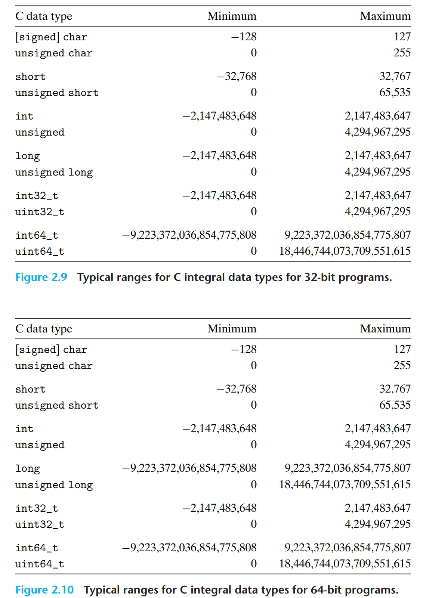
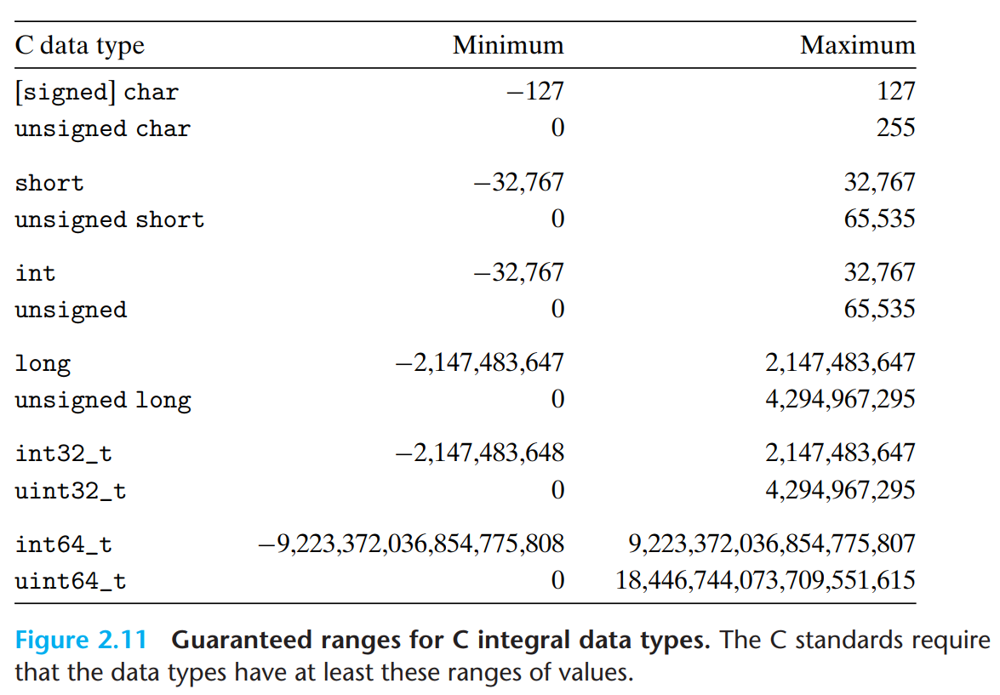

# 2024년 3월 3주차
## Integer Representations
음수가 아닌 숫자만을 표현할 수 있는 방법이고, 다른 하나는 음수, 영, 양수 모두 표현하는 방법을 배우는 챕터이다.이 챕터에서는 수학적 성질과 기계 수준 구현 모두에서의 특징을 살필 것이다. 더불어 인코딩된 정수를 다른 길이의 표현으로 확장하거나 축소했을 때의 영향도 같이 확인할 예정이다. 

### 2.2.1 Integral Data Types
C 언어는 ASCII 기반으로 32, 64비트 프로그램에 대해 가질 수 있는 숫자의 범위를 갖고 있다. 

여기서 알아둬야 할 핵심은 범위가 대칭이 아니라는 점이다. 바이트에 데이터를 넣어 표현하는 특성 상 음수 범위는 양수 범위보다 하나 더 넓다. 

### 2.2.2 Unsigned Encodings
부호에 대한 표시 없이 비트 백터들은 각 자리를 통해 값을 표현할 수 있다. 이는 딱히 어려울 것이 없이 우리가 상식적으로 아는 형태 그대로라고 보면 된다. 

### 2.2.3 Two's-Complement Encodings
많은 응용프로그램에서 음수 값을 표현하길 원하며, 이 방식으로 컴퓨터에서는 2의 보수의 형식을 가지고 하는 기보법을 활용한다. 최상위 비트를 부호 비트로 삼고, 나머지 값은 가중치로 둠으로써 계산하는 방식이다. 

### 2.2.4 Conversions between Signed and Unsigned
### 2.2.5 Signed versus Unsigned in C 
### 2.2.6 Expanding the Bit Representation of a Number
### 2.2.7 Truncating Numbers
### 2.2.8 Advice on Signed versus Unsigned
- 부호 없는 연산의 미묘한 특성들, 부호 있는 수에서 부호 없는 수로의 암시적 변환은 오류나 취약점으로 이어질 수 있고, 그렇기에버그를 피하려면 가장 핵심은 unsigned 숫자를 사용하지 않는 것이다. 
- 그러나 단순히 숫자 해석 없이 비트의 집합으로 생각하는 방식은 꽤나 쓸모는 있다. 

## 2.3 Integer Arithmetic
컴퓨터 연산의 유한성으로 발생하는 문제를 이해하는 것은 프로그래머가 더 신뢰성있는 코드 작성을 가능케 한다. 
- 문제 1오버플로 : 고정된 크기의 메모리에 저장되고, 그렇기에 값이 오버플로가 발생하면 예상치 못한 음수 결과가 나올 수 있다. 
- 문제 2 정밀도의 한계 : 부동소수점 수는 실수를 근사하는 구조고, 여기서 정밀도의 손실이 있다. 따라서 연산 면에서 `x < y 와 x - y < 0`이 다른 결과가 나온다는 점이 문제다.
- 문제 3 산술 연산의 안전성 : 산술 연산의 안전성이 위 두 문제로 발생을 하고, 이러한 부분들을 고려하는 개발자가 되어야 한다. 보다 안정적인 코드 작성 방식을 이해할 필요가 대두된다. 
### 2.3.1 Unsigned Addition 
- 부호없는 덧셈은 두 unsigned 정수의 합을 계산하며, 오버플로가 발생하면 합의 크기를 2^w를 모듈로 한 값이 된다. 
### 2.3.2 Two's-Complement Addtion
- 2의 보수 덧셈은 signed 정수의 덧셈이며, 결과 표현 범위를 벗어나면 양, 음의 오버플로가 발생하고, 이때 값은 당연히 자동으로 조정되어진다. 
### 2.3.3 Two's-Complement Negation
- 2의 보수의 부정은 정수의 부호를 반전시키는 방법이며, 핵심은 모든 비트를 반전 시킨 후 1을 더함으로써 수를 표현하는 방식이다. 
### 2.3.4 Unsigned Multiplication
- 부호 없는 곱셈은 두 unsigned 정수의 곱셈으로 w 비트를 초과할 수 있고, 당연히 그에 맞춰 절삭된다.
### 2.3.5 Two's-Complement Multiplication
- 2의 보수의 곱셈은 부호 있는 정수의 곱셈으로 보수의 덧셈과 같이 자동으로 오버플로에 대응을 하는 구조로 되어 있다. 
### 2.3.6 Multiplying by Constants
- 본 파트에서는 상수에 의한 곱셈에 대해 곱셈을 최적화하는 기법을 설명하며, 프로그램의 효율성 개선을 위해 쉬프트 연산과 덧셈으로 대체될 수 있음을 보여준다. 
### 2.3.7 Dividing by Powers of 2
- 2의 거듭제곱으로 나누는 것은 쉬프트 연산 방식을 활용한다. 이를 통해 거듭 제곱으로 나누는 과정을 단순화 시킬 수 있음을 보여준다. 
### 2.3.8 Final Thoughts on Integer Arithmetic
- 총정리 
## 2.4 Floating Point
### 2.4.1 Fractional Binary Numbers
- 소수점을 포함한 이진수의 표현방식을 설명해준다. 실수를 컴퓨터에서 표현하기 위한 기본적인 개념으로, 고정소수점과 비교하여 더 넓은 범위의 수를 표현할 수 있는 방법을 제공한다. 
### 2.4.2 IEEE Floating-Point Representation 
- IEEE 부동 소수점 표준은 실수를 컴퓨터 메모리에 저장하고 계산하는 방법을 보여주는데, 정밀도를 최대화 하면서도 표현할 수 있는 수의 범위를 극대화하는 방법을 제공한다. 
### 2.4.3 Example Numbers 
- 예시 케이스들 제공 
### 2.4.4 Rounding
- 부동 소수점 수를 표현할 때 제한된 수의 비트를 사용해야 하기 때문에 반올림의 기술이 있어야 한다. 반올림의 방법과 사용시 생기는 오차에 대해 강조한다.
### 2.4.5 Floating-Point Operations
- 부동 소수점 연산과 그 특징 설명 
### 2.4.6 Floating Point in C
- C 언어에서 부동 소수점 수를 어떻게 사용하고, 표현하는지에 대한 지침을 제공하고 부동 소수점 리터럴, 변수 유형 및 표준 수학 함수의 사용에 대한 정보를 포함한다. 
## 2.5 Summary


```toc

```
