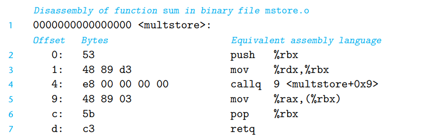
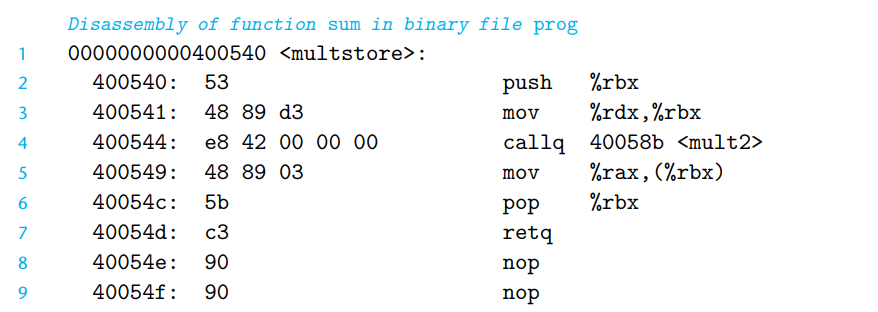

# Machine-Level Representation of Programs
- 이번 챕터에서는 기계어 코드와 사람이 읽을 수 있도록 표현된 어셈블리 코드에 대해 자세히 살펴볼 것이다. 
- 대부분의 시간동안, 고수준의 언어로 생산된 고수준의 추상화를 가진 환경에서가 프로그래밍 개발이 생산적이며, 신뢰성이 있다. 예를 들면 타입 검사를 포함하여, 숙련된 어셈블리 언어 개발자들의 노력으로 현대의 최적화된 컴파일러는 훌륭한, 기계에 특화된 기계어 코드로 변환을 시켜준다. 
- 그렇기에 왜 우리는 기계어를 배울 필요가 생기는 것일까? 
- 기계어 코드를 읽는 것으로, 우리는 컴파일러의 최적화 능력의 수준을 이해하고, 코드 상의 비효율적인 영역이 어딘지 분석하는 눈이 생길 수 있다. 
- 더 나아가서 우리가 알아야 하는 런타임 시의 동작들에 관해 추상화 언어로 숨겨진 것들의 추상 레이어들 속에서도 정확하게 이해할 수 있게 된다. 
- 취약성이 어떻게 증대 될지를 이해하는 것, 그리고 이러한 부분들에 대하여 어떻게 보호할 수 있을지에 대해 프로그램의 기계어 표현에 대한 지식을 요구한다. 
- 이번 챕터에서는 그렇기에, 특이한 어셈블리 언어, C 프로그램, 컴파일 된 기계 코드의 디테일한 부분을 배울 것이다. 
- 일종의 리버스 엔지니어링 방식의 형태로, 시스템을 학습하는 것에 의해 시스템이 생성되는 프로세스를 이해하고,뒤에서의 동작도 이해해보고자 시도할 것이다. 

## 3.1 A Historical Perspective
- 16비트 마이크로프로세서부터 시작해서 인텔은 겁나 발전해왔다! 
- 인텔은 IA32, Intel64 등을 거치면서 x86-64 라고 지칭되기 시작했다.
- AMD와 같은 라이벌이등장하고, AMD는 64비트 체계를 먼저 선보이기도 했다. 
- 2002년에너는 처음으로 1Ghz 의 클럭 스피드를 돌파하는 등으로 x86-64가 성장해왔다. 
## 3.2 Program Encodings 
- 최초 전처리기가 소스 코드에 헤더나 정의 내려진 디파인 등을 통합시켜준다. 
- 이후에 컴파일러가 어셈블리 코드 버전인 `*.s` 방식으로 바꿔준다. 
- 어셈블러가 어셈블리 코드를 바이너리 객체 코드 파일인 `*.o`파일로 변환을 해준다. 하지만 아직 전역 값에 대한 주소 등이 채워지진 않은 상태다.
- 마지막으로 링커가 객체 코드들을과 라이브러리 함수들을 종합하여 최종적으로 실행가능한 바이너리들이 가득찬 파일을 만들게 된다. 
### 3.2.1 Machine-Level Code 
- 기계어 수준의 프로그래밍을 위한 중요한 포인트가 두 개가 존재한다. 
	- 프로세서의 상태를 정의하는, 명령어의 형태를 정의하는 ISA, instructions set architecture 에 의해 기계어 수준의 프로그램들의 형태와 행동이 결정된다. 그리고 이러한 명령어들의 각각의 효과들이 상태를 구성한다. 
	- 기계어 수준의 프로그램에서 사용되는 메모리 주소는 virtual address 이다. 이는 매우 큰 바이트 배열로 표현되는 메모리 모델이며, 운영체제와 다양한 하드웨어들의 조합에 의해 구현된 형태이며, Chapter 9에서 제대로 살펴볼 것이다. 
- 컴파일러는 대부분의 컴파일 과정에서 프로그램의 표현을 프로세서가 수행하는 기본적인 명령어들에 대해 C에 의해 제공되는 추상 실행 모델로  변경시킨다. 이때 어셈블리 코드들은 기계어에 가깝게 표현이 바뀌는데, 이러한 형태의 주요 기능은 좀더 가독성이 좋게하여, 기계어 코드의 바이너리 형태 전에 비교하기 용이하게 만들기 위함이다. 어셈블리코드를 이해하는 것, 이것이 원본 C 코드와 어떻게 연결되는지를 아는 것은 컴퓨터의 실행하는 프로그램들이 어떻게 실행되는지를 이해하는 핵심 역할을 한다고 볼 수 있다. 
- x86-64를 위한 기계어 코드는 원본 C 코드와 크게 다르다. 프로세서 상태의 일부가 C 프로그래머에게는 일반적으로 숨겨져 있는데, 보이는 부분은 다음과 같다. 
	- program counter(PC)
	- 정수 레지스터 파일들로 64비트의 값을 저장할 수 있는 16개의 레지스터
	- 조건 코드 레지스터 : 상태 정보를 갖고 있으며, 대수연산이나 논리 연산을 수행한다. 
	- 벡터 레지스터 세트 : 정수나 부동소수점 값을 하나 내진 더 많이 갖고 있다. 
- 프로그램 메모리는 가상메모리를 사용하는 것으로 설명 된다. 이는 어떤 주어진 시간에도 가상 주소의 제한된 하위 범위만 유효하게 간주된다. 
- 현재 이 기계들의 구현에서, 상위 16비트는 0으로 설정되어 있다. 그래서 주소는 이론상 2^48, 즉 64테라바이트 범위의 바이트까지를 지정할 수 있도록 설정 되어 있다. 
- 컴파일러는 산술 표현식 평가, 반복문, 또는 절차 호출 및 반환과 같은 프로그램 구성을 구현하기 위해 이러한 명령어의 시퀀스를 생성해야 한다.
### 3.2.2 Code Examples
- 어셈블리 코드를 보는 방법은 `-S` 옵션을 붙이는 것이다. 
```shell
linux> gcc -Og -S mstore.c
```

```assembly
multstore: 
  pushq  %rbx
  movq    %rdx, %rbx 
  call    mult2
  movq    %rax, (%rbx) 
  popq    %rbx
  ret
```

- `-c` 를 추가하면 GCC는 컴파일과 어셈블 작업까지 마무리하고, 16진법의 데이터 덩어리로 표현된 형태를 만들어 보여준다. 
```Shell
linux> gcc -Og -C mstore.c
```

```plain
53 48 89 d3 e8 00 00 00 00 48 89 03 5b c3
```

- 기계 코드 파일의 내용을 검사하기 위해, 디스어셈블러로 알려진 프로그램의 한 분류가 매우 중요하다. 이러한 프로그램들은 기계 코드에서 어셈블리 코드와 유사한 형식을 생성해준다(물론 조금 다르다)


```c
#include <stdio.h>
void multstore(long, long, long *); 
	int main() {
	long d;
	multstore(2, 3, &d); 
	printf("2 * 3 --> %ld\n", d); 
	return 0;
}
long mult2(long a, long b) { 
	longs = a * b;
	return s; 
}
```

```shell
linux> gcc -Og -o prog main.c mstore.c
linux> objdump -d prog
```

- 디스어셈블러를 통해 추출한 코드들은 기본적으론 거의 동일하다.
	- 한 가지 중요한 차이점은 왼쪽에 나열된 주소들이 다르다는 것이다. 링커가 이 코드의 위치를 다른 주소 범위로 이동시켰다.
	- 두 번째 차이점은 링커가 callq 명령어가 함수 mult2를 호출할 때 사용해야 하는 주소를 채웠다는 것이다(디스어셈블리의 4번째 줄).
	- 마지막 차이점은 우리가 두 줄의 추가 코드(8-9줄)가 있다는 점이다. 이렇게 되어 있는 이유는 이들은 함수를 위한 코드를 16바이트로 확장하기 위해 삽입되었으며, 메모리 시스템 성능 측면에서 다음 코드 블록의 배치를 개선하기 위한 목적이다.
### 3.2.3 Notes on Formatting
## 3.3 Data Formats

## 3.4 Accessing Information

## 3.5 Arithmetic and Logical Operations

## 3.6 Control 

## 3.7 Procedures

## 3.8 Array Allocation and Access

## 3.9 Heterogeneous Data Structures 

## 3.10 Combining Control and Data in Machine-Level Programs

## 3.11 Floating-Point Code

## 3.12 Summary 

```toc

```
