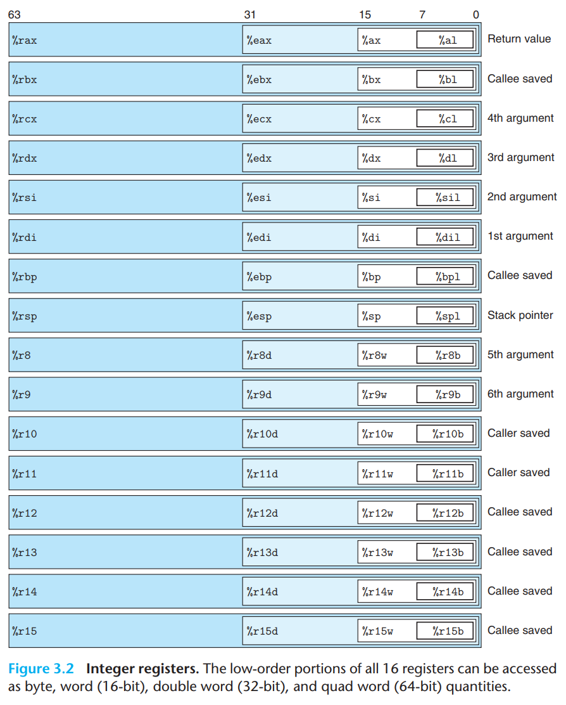
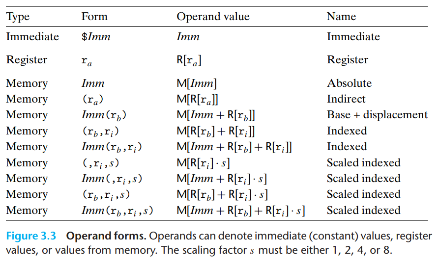

# Machine-Level Representation of Programs
### 3.2.3 Notes on Formatting 서식에 관한 노트
- 어셈블리 코드에 대한 포맷들에 대해 앞으로 사용할 내용을 설명한다. 모든 라인에서 `.` 이 붙어 있다면 어셈블러와 링커의 가이드 역할을 하는 명령어 라고 보면 된다. 
- 기본적으로 어셈블러 상태에는 없지만 본 교재에서는 각 라인 왼쪽에 라인 번호를, 오른쪽에는 원본 코드와 연관된 설명을 첨부한다. 
- CSAPP 저자들은 웹에서 관련 자료를 제공해주고 있다. 
## 3.3 Data Formats
- 16비트 아키텍쳐 때부터가 기원이다보니, 인텔은 16비트 데이터 타입(2바이트)를 워드(word) 라고 불렀으며, 이것을 기반으로 더블워드(double words), 64비트 데이터 양에 대해서는 쿼드 워드(quad words)라고 부른다. 
- x86-64 명령어 셋 역시 모든 바이트, 워느, 더블이나 쿼드 워드까지를 아우르는 명령어 셋을 갖고 있다. 
- 부동 소수점에 대해서는 80비트(10바이트) 부동소수점 형식으로 구현했고 이는 C 프로그램에서 long double 선언을 사용하여 지정할 수 있다. 단, 이러한 형식은 다른 클래스의 기계로 이식하기 어렵고, 단정밀도, 이중 정밀도 연산에 사용되는 것과 같은 고성능 하드웨어로 구현되지않는 경우가 일반적이다. 
- gcc에 의해 생성되는 대부분의 어셈블리 코드 명령어는 피연산자의 크기를 나타내는 단일 문자 접미사를 통해 구분할 수 있다. 
	- movb(바이트 이동), movw(워드 이동), movl(더블워드 이동), movq(쿼드 워드 이동)
	- 부동 소수점 코드는 완전히 다른 명령어 셋트와 레지스터를 사용하므로 구분되어 있다. 
## 3.4 Accessing Information

- x86-64 프로세서는 16개의 범용 레지스터(genral-purpose registers)의 세트를 갖고 있으며, 여기엔 정수의 64비트 값(포인터)을 담는다. 
- 8086 시절 16비트일 때부터 역사적으로 사용되어가면서 확장되었는데, 처음에는 8개의 레지스터만을 갖고 있었고, 이후 8개가 추가 되었다. 
- 16비트 시적에는 %ax ~ %bp라는 이름으로 쓰이고, 32비트 시절이 되면서 라벨링이 %eax ~ %ebp로 확장, 이후 64비트 시대가 오면서 접미사로 %r이 붙은 구조가 되었다. 
- 기본적으로 명령어들은 다양한 사이즈의 데이터를 저장하는데 해당 공간을 이용하며, 낮은 바이트 순서로 저장한다고 보면 된다. 
- 더불어 과거부터의 역사적인 영역으로 데이터의 값의 복사 과정에서 두 가지 관행을 따르는데 8 바이트 보다 적게 생성하는 명령어들을 위한 관행정도로 이해하면 된다. 
- 가장 독특한 레지스터라고 하면 `%rsp` 로 런타임 중인 스택 안의 스택을 가리키는 역할을 한다. 이것 외의 다수의 레지스터들은 포인터를 가리키며 다양한 목적을 위해 사용된다고 보면 된다. 
### 3.4.1 Operand Specifiers 

- 대부분의 명령어는 하나 혹은 그 이상의 피연산자를 가지며, 이는 연산을 수행하기 위한 소스 값과 결과를 저장할 목적지 위치를 지정한다. 
- 연산결과들은 여덟개의 레지스터들, 혹은 메모리 상에 저장될 수 있다. 그래서 다양한 피연산자 가능성은 세가지 유형으로 분류될 수 있다. 
	- immediate : 상수, $ 표시 이후에 들어오는 값들은 상수로 취급되고, 어셈블러에 의해 자동적으로 가장 적절한 압축되는 방식으로 값들을 인코딩해놓는다. 
	- register : 레지스터가 가진 컨텐츠로 결과가 나오는데, 이는 말 그대로 포인트 연산이다. 각 비트들의 형태에 맞춘 결과가 나온다. 기본적으로 ra 형태로 표기법을 쓰고, 레지스터의 배열 R에서 집합으로 보고, 그 주소 값의 실제 값을 참조할 때는 `R[ra]` 라고 쓰인다. 
	- memory  레퍼런스 타입 : 연산된 주소를 통해 메모리 위치를 우리가 접근 가능한데, 이를 유효 주소(effective address)라고 부른다. 형태는 `Mb[Addr]` 이러한 형태인데, 이는 b 바이트의 크기의 값이 저장된 메모리 상의 Addr 위치를 표현하는 것이다. 단 단순화를 위하여 b 첨자를 일반적으로 생략한다. 메모리 참조를 허용하는 많은 주소 지정 모드들 중 가장 일반적인 것이 `Imm(rb, ri, s)` 형태이다. 오프셋 Imm,  기본 레지스터 rb, 인덱스 레지스터 ri, 그리고 스케일 인자 s(1, 2, 4, 8의 값만 들어감)로 배열 계산 시에 참조되는 형태가 바로 이러한 형태이다. 다른 형태들은 일부 구성 요소가 생략된 특수 케이스이다.
### 3.4.2 Data Movement Instructions
### 3.4.3 Data Movement Example
### 3.4.4 Pushinbg and Popping Stack Data 
## 3.5 Arithmetic and Logical Operations
### 3.5.1 Load Effective Address
### 3.5.2 Unary and Binary Operations
### 3.5.3 Shift Operations
### 3.5.4 Discussion 
### 3.5.5 Special Arithmetic Operations

## 3.6 Control 
### 3.6.1 Condition Codes
### 3.6.2 Accessing the Condition Codes
### 3.6.3 Jump Instructions 
### 3.6.4 Jump Instruction Encodings
### 3.6.5 Implementing Condtional Branches with Conditional Control
### 3.6.6 Implementing Condtional Branches with Condtional Moves
### 3.6.7 Loops
### 3.6.8 Switch Statements 

---
## 3.7 Procedures

## 3.8 Array Allocation and Access

## 3.9 Heterogeneous Data Structures 

## 3.10 Combining Control and Data in Machine-Level Programs

## 3.11 Floating-Point Code

## 3.12 Summary 

```toc

```
