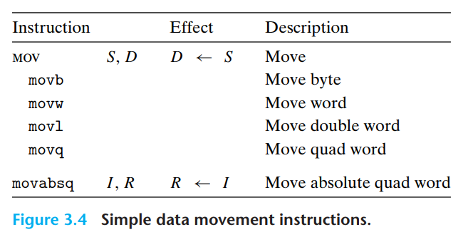
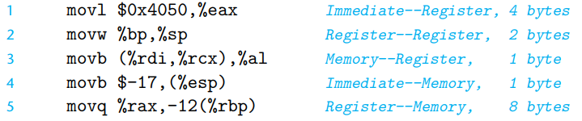
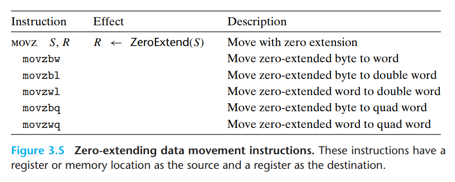
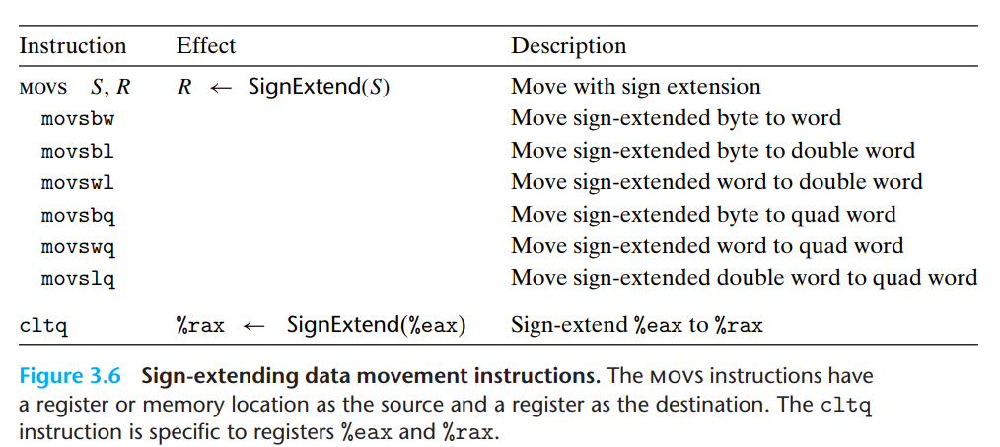
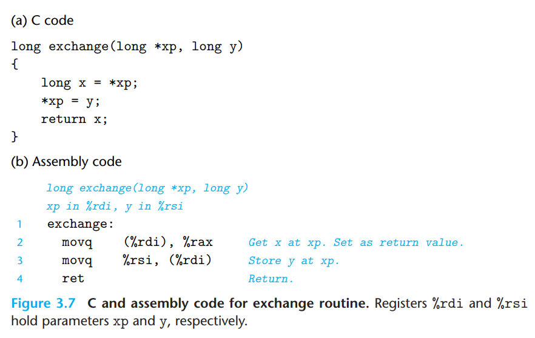
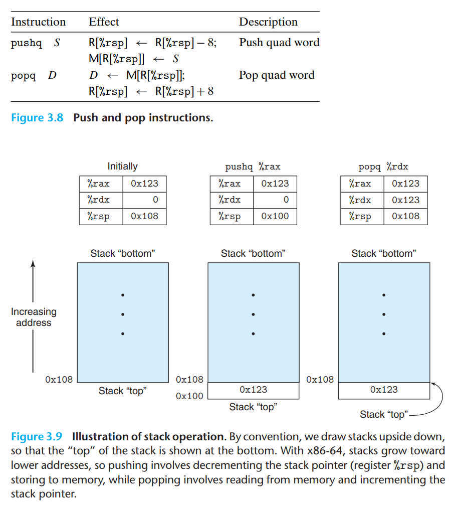
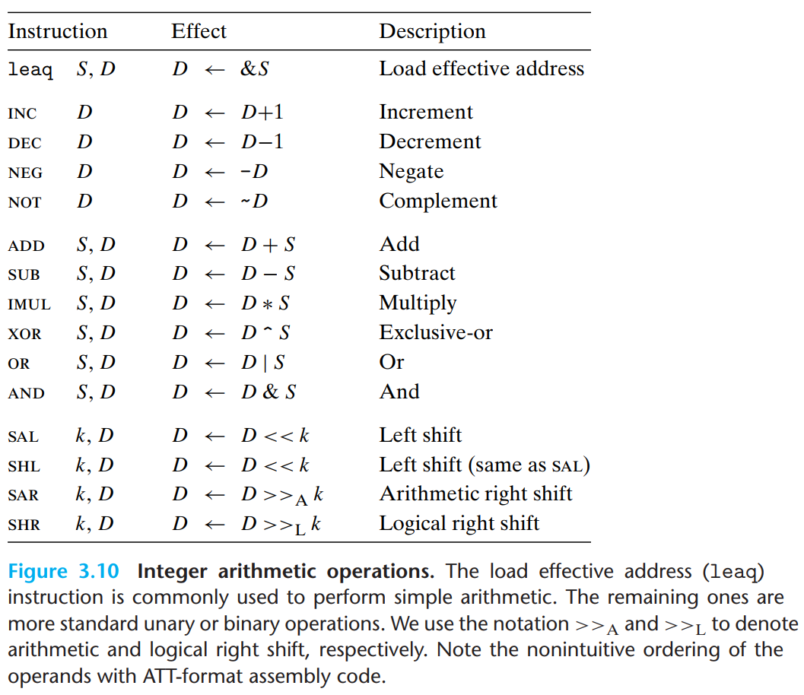
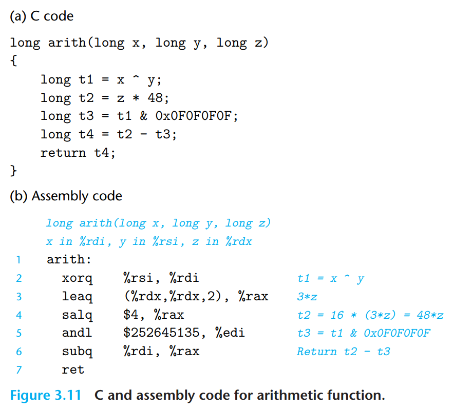
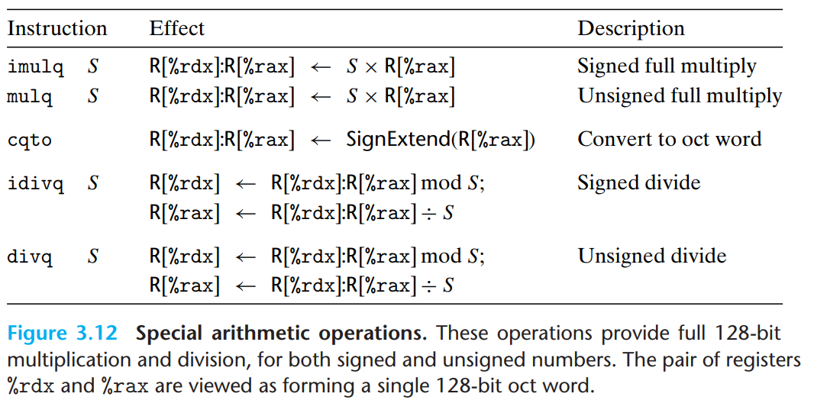
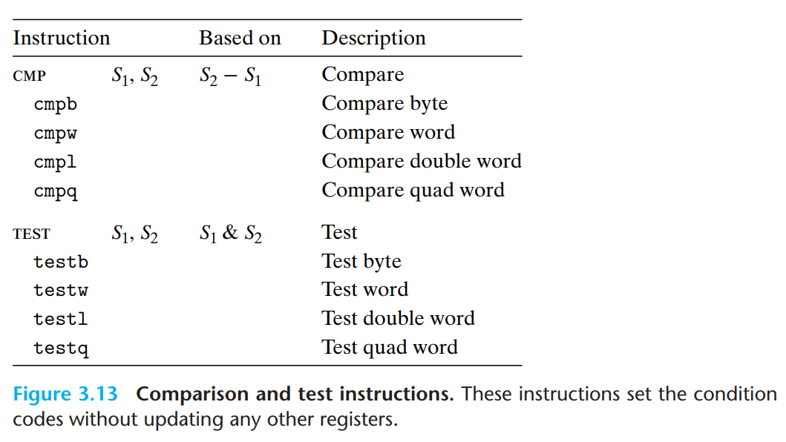

# Machine-Level Representation of Programs
### 3.4.2 Data Movement Instructions

- 가장 많이 사용되는 명령어 중 하나는 데이터 위치를 복사하는 명령어일 것이다. 
- 소스와 목적지 유형, 수행하는 변환, 그리고 기타 부작용이 다른 여러가지 데이터 이동 명령어가 있음을 보여준다. 
- 위 그림의 데이터 이동 명령어는 가장 단순한 형태인 mov 클래스다. 여기서 각 워드 바이트 크기를 다룬다는 차이점을 갖고 있다. 
- 소스 피연산자는 상수 값, 레지스터에 저장된 값, 메모리에 저장된 값을 지정하고, 이동할 목적지도 지정해준다. 이때, x86-64 의 기준 특성상 이동 시 모두 메모리 위치를 참조하는 식으로는 되어 있지 않다. 메모리에서 메모리는 반드시 두번의 명령어가 필요하다. 
- 대부분의 경우 mov 명령어는 목적지 피연산자에 의해 지정된 특정 레지스터 바이트나 메모리 위치만을 업데이트 한다. 
- 아래의 그림은 특정 위치에서 목적지로의 다섯가지 조합을 보여준다. 원본 피연산자가 먼저 온 뒤 목적지가 나온다. 
- `movabsq`의 경우 64비트로 상수 데이터 처리용으로, 원본 피연산자는 상수이며, 목적지로 레지스트만을 가진다.
- 
- 위 두 그림의 경우 원본 값이 목적지보다 작을 때 사용하는 두 클래스의 데이터 이동 명령어 이다 . 이때 z를 통해 나머지 바이트를 0으로 채우면서 데이터를 이동시킨다. 
- 이에 비해 movs의 경우 부호 확장된 명령어로 가장 중요한 비트의 복사본을 생성하여 바이트들을 채우며, 목적지가 원래 소스 데이터 크기보다 큰 경우만 고려한다. 
- 이때 figure 3.5 를 보면 4바이트 소스 값이 8바이트 목적지로 0을 넣으 면서 확장하는 명령어가 명시적으로 존재하지 않는다는 점이 보인다. 이러한 유형의 데이터 이동은 목적지로 레지스터를 가진 movl 명령어를 사용해 대신 구현이 가능하다. 
- 3.6에서는 ctlq 명령어를 설명해주는데, 피연산자가 없으며 항상 `%eax`  레지스터를 소스로 사용하고 부호 확장된 결과에 대한 목적지로 `%rax`를 사용한다. 이를 통해 movslq  를 활용해서 쓰는 명령어와 동일하지만, 더 간결한 인코딩으로 명령을 제공해준다. 
### 3.4.3 Data Movement Example

- C에서 포인터라고 부르는 것은 단순히 주소를 의미하고, 포인터의 역참조는 그 포인터를 레지스터에 복사한 다음 이 레지스터를 메모리 참조에 사용하는 것을 포함한다. 
- x와 같은 지역변수도 종종 메모리보다 레지스터에 유지되어 빠른 접근을 가능케 한다. 
### 3.4.4 Pushinbg and Popping Stack Data 

- 스택은 절차 호출 처리에서 기본적으로 후입선출의 원칙을 지키며, 그렇기에 push 를 하면 top에 붙고, pop을 하면 bottom의 것이 빠져나가게 된다. 
- 스택 포인터 `%rsp`는 스택 top의 주소를 보유한 상태이다. 
- 스택에 쿼드 워드 값을 푸시하는 것은, 스택 포인터를 8 만큼 감소 시킨 후 새로운 top 주소값을 쓰는 것까지가 루틴이다. 따라서 `push %rbp` 명령은 다음 두 쌍의 명령어와 동일하다. 
	```plain
	subq $8, %rsp // 스택 포인터 감소
	movq $rdp, (%rsp) // 새로운 위치에 %rbp 값을 저장
	```
- `popq %rax` 명령에 대해서는 다음처럼 되는 것과 동일한 효과가 있다. 
	```plain 
	movq (%rsp), %rax // 스택에서 %rax 읽기 
	addq $8, %rsp // 스택 포인터 증가
	```
## 3.5 Arithmetic and Logical Operations
- Figure 3.10 은 정수 및 논리 연산 일부 명령어들과 효과 등을 설명한다. 
- 여기서 leaq을 제외한 모든 명령어들은 b,w,l, q를 포함하는 데이터 크기들을 지원한다. 

### 3.5.1 Load Effective Address
- leaq 은 유효주소 명령어로 movq의 변형 명령어이다. 
	- 실제 메모리 참조 안 함. 
	- 첫 번째 피 연산자는 유효주소를 읽어서 목적지로 복사한다. 
	- 메모리 참조를 위한 포인터 생성시 사용할 수 있고, 산술 연산을 간결하게 기술하기 위해 쓰일 수 있다. 
	- 목적지 피연산자는 반드시 레지스터로 설정되어야 한다. 
### 3.5.2 Unary and Binary Operations
- 위 3.10 에서 두번째 그룹은 단항 연산을 하는 명령어다. 
	- 피 연산자는 레지스터, 메모리 위치등 올 수 있다. 
- 세번째 그룹은 이진 연산으로 구성되며, 두 번째 피연산자가 소스이자 목적지로 이용된다.
	- 첫 번째 피연산자는 상수값, 레지스터, 도는 메모리 위치가 온다.
	- 두 번째 피연산자는 레지스터 또는 메모 위치다. 
	- 두 피연산자 모두 메모리 위치일 수 없다. 
### 3.5.3 Shift Operations
- 마지막 그룹은 쉬프트 연산으로 구성되며, 쉬프트 양은 먼저 나오고, 뒤에 그 쉬프트의 대상이 온다. 
- 산술, 논리 우측 쉬프트가 가능하다. 
- 상수 값이나, `%cl` 바이트 레지스터를 통해 쉬프트 양을 정할 수 있다. 
- 원칙적으로 1바이트 쉬프트 양은 최대 2^8-1 = 255 까지다. 
- x86-64에서는 쉬프트 명령어가 w 비트 길이의 데이터 값을 사용하며, 레지스터 `%cl`의 하위 m 비트에서 쉬프트 양을 결정한다. 즉, 2^m = w이며, 상위 비트 1개는 무시된다. 
- 위의 이야기를 종합하면 `%cl` = 0xFF 라고 한다면, `salb` 는 7만큼 쉬프트, `salw`는 15만큼, `sall` 은 31, `salq`는 63만큼 이동하게 된다. 
- 왼쪽 쉬프트 명령어에는 sal, shl 두 가지 명령어가 있는데, 모두 오른쪽에서 0을 채워 넣으며 같은 효과를 낸다. 하지만 오른쪽의 경우 sar은 산술 쉬프트(부호 비트를 채움), shr 은 논리 쉬프트(0을 채움)을 수행한다. 
### 3.5.4 Discussion 

- 3.10 에서 나온 모든 명령어는 unsigned와 2의 보수를 활용한 signed 모두에서 동작한다. 단 오른쪽 쉬프트만 signed 데이터와 unsigned를 구분하여 사용이 가능하다. 
- 3.11 은 산술 연산을 수행하는 함수와 이를 어셈블리 코드로 변환된 예를 보여준다. 
### 3.5.5 Special Arithmetic Operations

- 두개의 8바이트 signed, unsigned 정수의 곱은 128비트를 표현할 수도 있다. 이러한 결과에 대해 x86-64 명령어 집합은 제한적으로 이를 지원한다. 
- 그림 3.12에서 두개의 64비트 수의 전체 128비트 곱셈 결과를 생성하는 명령어와 정수 나눗셈을 지원하는 명령어를 설명해주고 있다. 
- 아래의 예시는 128비트 값을 unsigned 64비트 숫자 두개를 가지고 만들어내는 예시이다. 
```c
#include <inttypes.h>
typedef unsigned __int128 uint128_t;
void store_uprod(uint128_t *dest, uint64_t x, uint64_t y) { 
*dest=x*(uint128_t) y;
}
```

```plain
// void store_uprod(uint128_t *dest, uint64_t x, uint64_t y)
//dest in %rdi, x in %rsi, y in %rdx
store_uproad:
	movq    %rsi, %rax // copy x to multiplicand
	mulq    %rdx       // multiply by y
	movq    %rax, (%rdi) // store lower 8 bytes at dest 
	movq    %rdx, 8(%rdi) // store upper 8bytes at dest + 8
```

- 이 프로그램은 inttypes.h 를 사용해 gcc 가 제공하는 128비트 정수 타입을 활용했고, 값을 도출해낸다. 
- 또한 코드는 최종 곱셈 결과가가 dest 포인터 가리키는 16바이트 메모리 공간에 저장되도록 명시하고 있다. 
## 3.6 Control 
- 이 장에서는 순차적인 직선 코드가 아니라 조건문, 반복문, 스위치 등과 같이 C의 일부 구조에서는 실행되는 연산의 순서가 데이터 결과에 따라 달라지는 조건부 실행을 보고자 한다. 
- 이 챕터에서는 조건부 연산을 구현하는 두 가지 방법, 이후 반복문과 스위치 문에 대해 설명할 것이다. 
### 3.6.1 Condition Codes
- 정수 레지스터를 제외하고 CPU는 가장 최근의 산술 또는 논리 연산의 특성을 나타내기 위한 일련의 단일 비트 조건 코드 레지스터를 갖고 있다. 이는 조건부 분기 수행을 위해 테스트 되며, 가장 유용한 조건 코드들은 다음과 같다. 
	- CF(Carry flag) : 가장 최근 연산에서 최상위 비트로부터 캐리가 발생했을때
	- ZF(Zefo  flag) : 가장 최근 연산의 결과가 0일 때
	- SF(Sign  flag) : 가장 최근 연산 결과가 음수였을 때
	- OF(Overflow flag) : 가장 최근 연산에서 2의 기보법 오버플로우(음수 또는 양수)가 발생했을 
 

```toc

```
