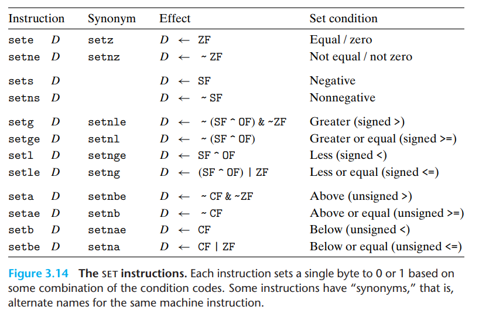
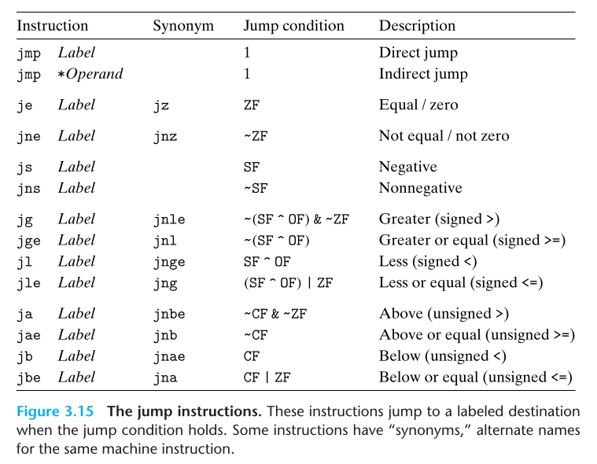
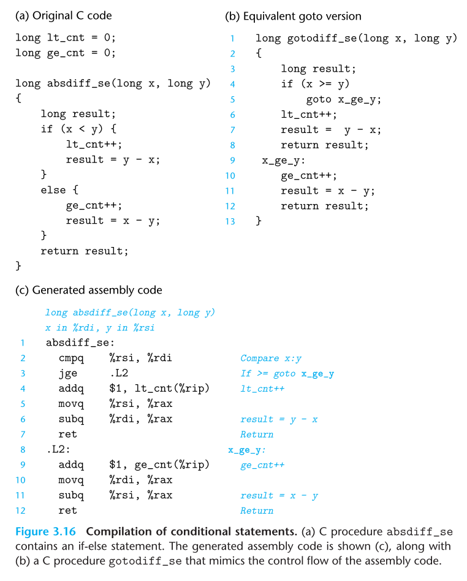

# Machine-Level Representation of Programs
### 3.6.2 Accessing the Condition Codes

- 조건 코드를 직접 수행읽는 대신 사용하는 방법 세 가지 
	1. 조건코드의 조합에 따라 단일 바이트를 0, 1 로 설정한다. 
	2. 프로그램의 다른 부분으로  점프할 수 있다. 
	3. 데이터를 조건부로 전송할 수 있다. 
- 1번의 방법은 set 명령어에서 나타나며, 이때 단 접미사가 다른 연산자와 같이 워드 크기를 나타내는게 아니라는 점이 중요하다(less, below의 l, b를 나타냄, long 또는 byte 아님)

### 3.6.3 Jump Instructions 

- jump 명령어는 기본적인 명령어의 흐름에서 뛰어 넘어 다른 명령어를 수행하고 다시 시작하도록 만드는데, 오브젝트 코드 파일을 생성할 때 어셈블러가 모든 이러한 명령어의 주소값을 결정한다. 
- 명령어들은 간접 점프와 직접 점프가 있는데, 직접 점프의 경우 어셈블리코드에서 점프 목표로 레이블을 지정하고 작성되며, 간접 점프는 메모리 피연산자 형식 중 하나를 사용하여 메모리주소나 레지스터로 점프를 한다. 
- 하나 더 있는 점프 방식은 조건 점프(conditional jump)이다. 조건 점프는 조건에 맞춰 동작하고, 이러한 경우는 직접 점프만이 가능하다.
### 3.6.4 Jump Instruction Encodings
- Chapter 7의 링킹 파트에서 점프 명령어의 목표가 어떻게 인코딩 되는가가 중요하다. 그리고 이러한 내용은 디스어셈블러의 산출물을 이해할 때도 도움이 된다. 
- 어셈블리 코드에서 점프의 대상은 심볼릭 레이블을 사용하여 작성되며, 점프에대한 다양한 인코딩 방식은 있지만 가장 일반적 방법이 PC에 상대적 방식으로 점프를 구현하는 것이다. 
- 즉, 점프 다음 오는 명령어의 주소와 점프 대상 명령어 주소 간의 차이를 인코딩해서 사용하는 것이다. 이러한 오프셋은 1,2, 4바이트로 인코딩 되는 방법이다. 
- 반면에 절대 주소를 활용하는 방법도 있고 이 경우 4바이트로 인코딩 된다. 
- 결론적으로 어셈블러와 링커는 점프 목적지의 적절한 인코딩을 선택해서 구현한다고 보면 된다. 
### 3.6.5 Implementing Condtional Branches with Conditional Control

### 3.6.6 Implementing Condtional Branches with Condtional Moves
### 3.6.7 Loops
### 3.6.8 Switch Statements 

---
## 3.7 Procedures

## 3.8 Array Allocation and Access

## 3.9 Heterogeneous Data Structures 

## 3.10 Combining Control and Data in Machine-Level Programs

## 3.11 Floating-Point Code

## 3.12 Summary 

```toc

```
